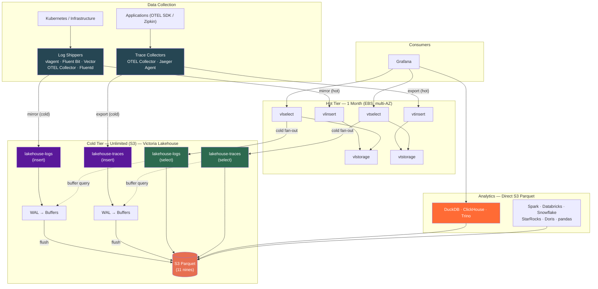
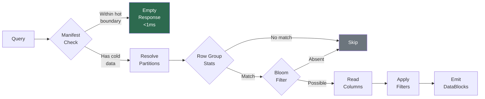
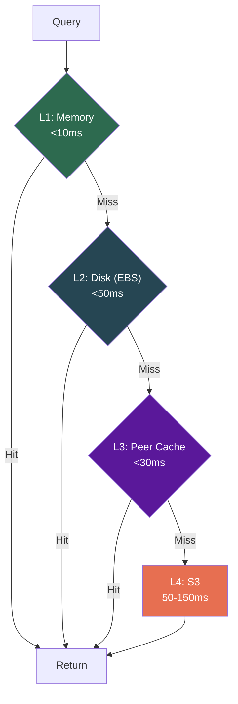
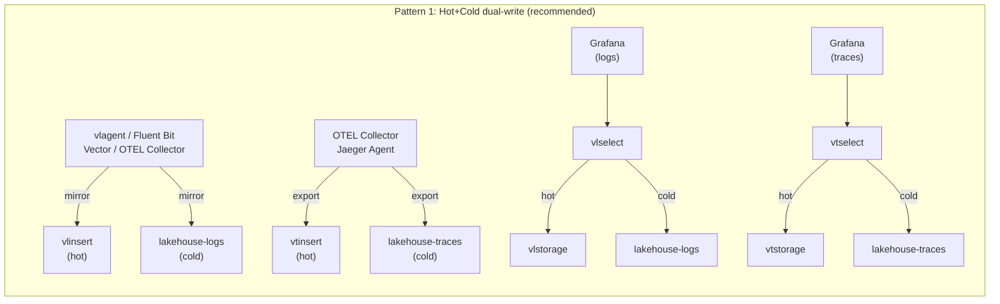
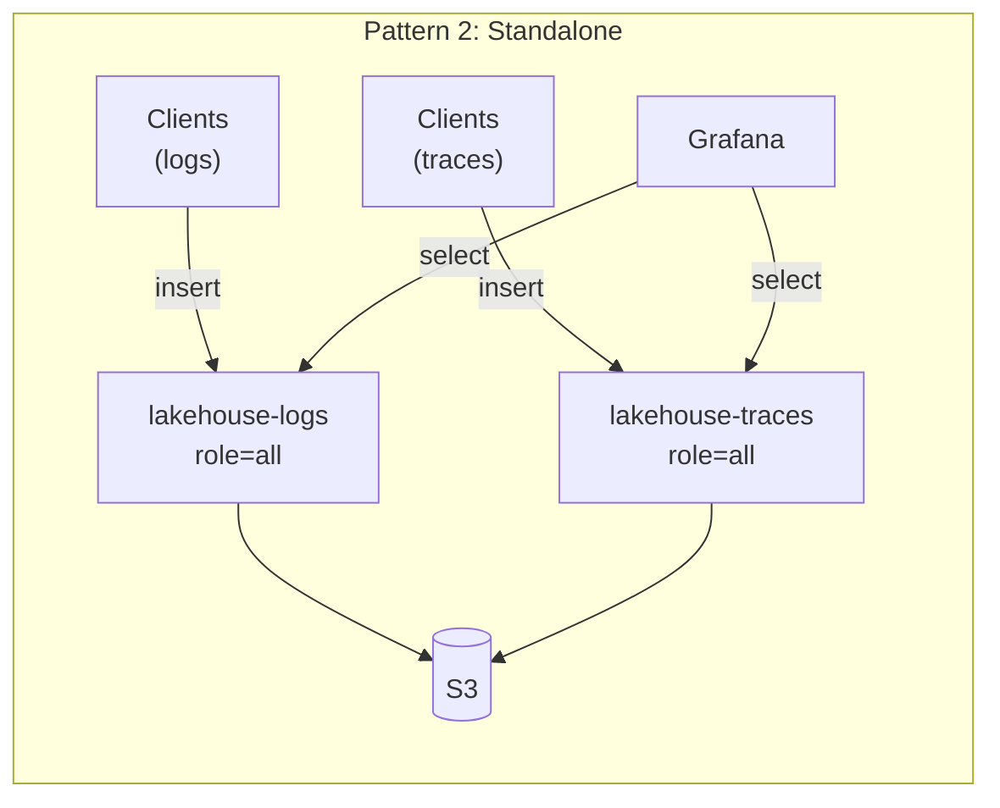
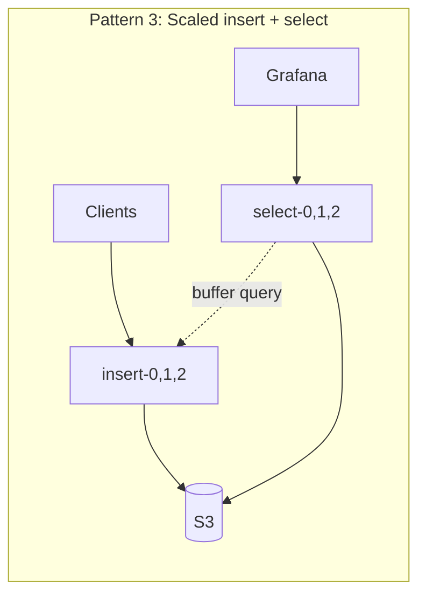
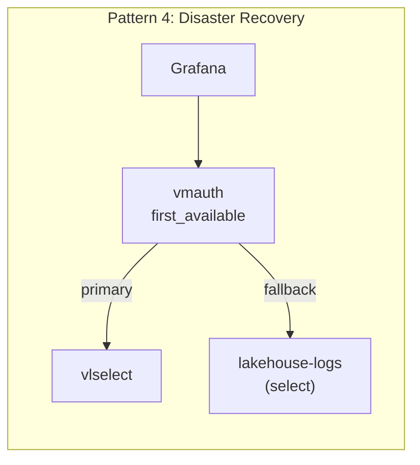
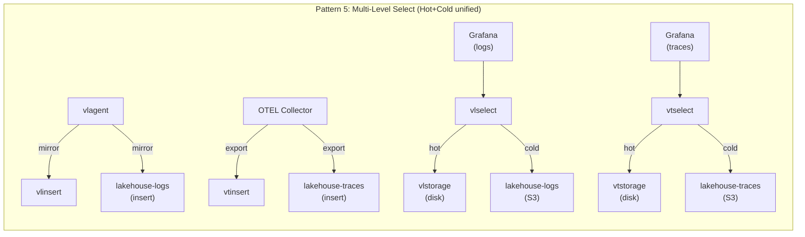
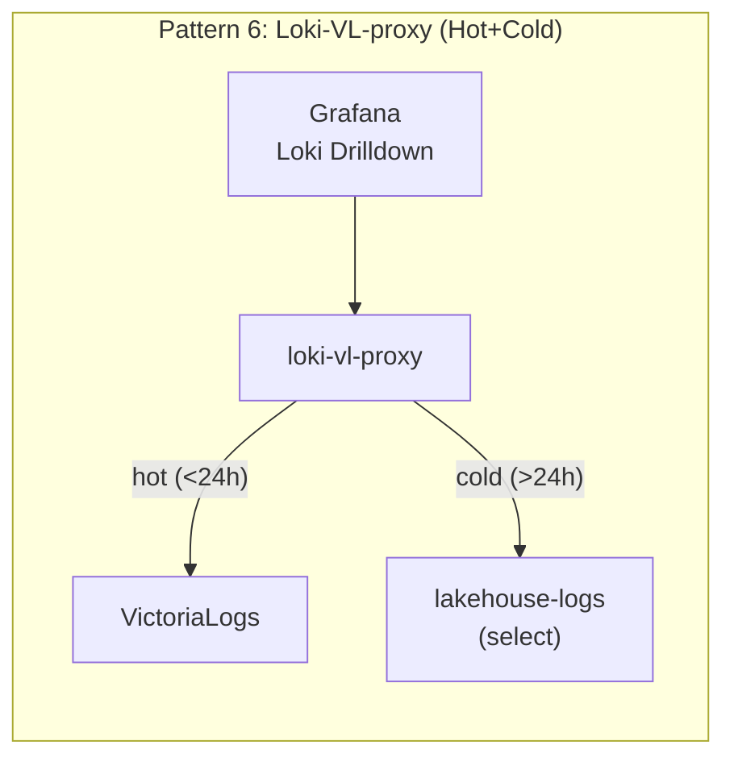
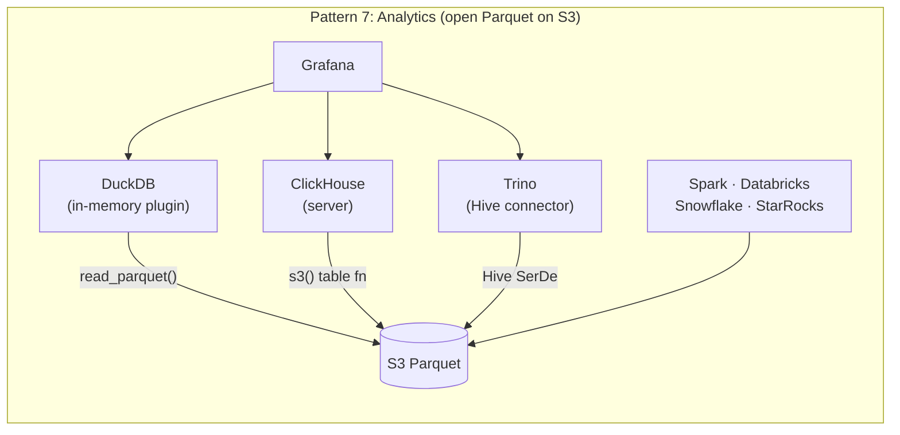

<p align="center">
  
</p>

# Victoria Lakehouse

[](https://github.com/ReliablyObserve/victoria-lakehouse/actions/workflows/ci.yaml)
[](https://github.com/ReliablyObserve/victoria-lakehouse/actions/workflows/security.yaml)
[](https://go.dev/)
[](https://github.com/ReliablyObserve/victoria-lakehouse/releases)
[](https://github.com/ReliablyObserve/victoria-lakehouse)
[](https://github.com/ReliablyObserve/victoria-lakehouse)
[](#tests)
[](https://goreportcard.com/report/github.com/ReliablyObserve/victoria-lakehouse)
[](LICENSE)

**S3-backed cold storage for VictoriaLogs and VictoriaTraces.** Two dedicated binaries — `lakehouse-logs` and `lakehouse-traces` — each 100% API-compatible with VL/VT. Same endpoints, same protocols, same query language. Implements the VL/VT storage interface with an S3 Parquet backend. Registers as a `-storageNode` and works transparently alongside existing VL/VT clusters.

> **Two binaries, one architecture.** `lakehouse-logs` reimplements the VL storage layer. `lakehouse-traces` reimplements the VT storage layer. Both use Parquet on S3 and expose identical HTTP APIs, LogsQL query syntax, binary DataBlock protocol, and insert endpoints as their upstream counterparts. Each binary pins to its own VL/VT dependency version for maximum compatibility.

- **Drop-in VL/VT storage node.** Register as a `-storageNode` on vlselect/vtselect. Queries spanning hot and cold data work transparently.
- **Write path with crash recovery.** Full VL insert protocol support (jsonline, Loki JSON+protobuf, ES bulk, syslog, journald, Datadog, OTLP, Splunk) via upstream `vlinsert` handlers. Data buffers in memory, flushes to S3 Parquet, and survives process crashes via WAL.
- **Zero-delay reads.** Select pods query ALL insert pods across ALL AZs for unflushed buffer data, merging with S3 results for immediate read-after-write visibility.
- **Open format + S3 durability.** 48-56% cheaper than Loki/Tempo at scale. At small scale (≤500 GB/mo), VL/VT EBS is cheapest; at PB/mo with >8mo retention, Lakehouse Hybrid wins. S3's 11-nines durability for compliance, Glacier tiering for 3yr+.
- **Sub-millisecond fast path.** Queries within the hot tier's range get an immediate empty response via the partition manifest. Zero S3 I/O.
- **Disaster recovery.** When the hot cluster is down (outage, upgrade, migration), lakehouse serves all data from S3 — slower but always available.
- **Cost-aware deletion.** VL-compatible delete APIs with tombstone-based soft delete. Three modes: `hide` (instant, $0), `permanent` (physical removal), `auto` (smart). Glacier-safe — never triggers retrieval fees.
- **Open Parquet files.** DuckDB, Trino, Spark, and ClickHouse read the same files directly for analytics, compliance, and ML.

---

## The Cost Case

Cost leadership is **scale-dependent**. At small scale (≤500 GB/mo), VL/VT EBS is cheapest — compute dominates and 55x compression wins. At PB/mo with >8 months retention, Lakehouse Hybrid crosses below VL/VT EBS because S3's per-raw-GB cost ($0.0038) beats 3-AZ EBS ($0.0044) by 14%. Standalone Lakehouse is **cheapest at all retention periods** — 57% cheaper than hybrid, 78% cheaper than Loki/Tempo. It adds **open Parquet format, S3 11-nines durability, disaster recovery, and Glacier tiering**.

| Scenario (500 GB/day, 1yr, 3 AZ) | Standalone Lakehouse | VL/VT EBS Only | Lakehouse Hybrid | Loki + Tempo |
|---|---|---|---|---|
| **Monthly cost** | **$1,283/mo** | $2,679/mo | $3,009/mo | $5,763/mo |
| **Compression (logs)** | 6.1x (ZSTD L7) | ~70x | 6.1x (ZSTD L7) | 3-3.5x (Snappy) |
| **Compression (traces)** | 9.4x (ZSTD L7) | ~47x | 9.4x (ZSTD L7) | 3-4x (Snappy) |
| **Query latency (point)** | <100ms (bloom) | <10ms (EBS) | <10ms hot / <100ms cold | 1-10s |
| **Query latency (scan)** | <500ms | <10ms (EBS) | <10ms hot / <500ms cold | 1-10s |
| **Data format** | **Open Parquet** | Proprietary (VL/VT) | **Proprietary (VL/VT hot) + Open Parquet (S3 cold)** | Proprietary |
| **S3 durability** | **11 nines** | EBS per-AZ | **11 nines** | 11 nines |
| **Glacier tiering** | **Yes (cheapest at 3yr+)** | N/A | **Yes (cheapest at 3yr+)** | No (compaction breaks it) |
| **Analytics access** | **DuckDB, Spark, Trino** | VL/VT API only | **DuckDB, Spark, Trino** | Loki API only |
| **Disaster recovery** | **Independent** | N/A | **Independent cold tier** | N/A |
| **Write path** | WAL + S3 + compaction (~2.1x) | EBS WAL + LSM (~3-10x) | EBS + WAL + S3 + compaction | WAL→chunk→S3→compact (3-5x) |
| **CPU (vCPU-months)** | 9 vCPU | 18 vCPU | 25 vCPU | 24 vCPU |
| **Memory (GB)** | 24 GB | 48 GB | 72 GB | 56 GB |
| **Network traffic (GB/mo)** | 180 PUT+GET | ~150 (EBS local) | 300 PUT+GET + cross-AZ | 370 PUT+GET + compaction |
| **Storage breakdown** | S3: $688/mo | EBS: $796/mo | EBS: $65/mo + S3: $688/mo | S3: $1,484/mo |
| **Cost composition** | 54% Storage, 32% Compute, 14% Network | 30% Storage, 64% Compute, 6% Network | 23% Storage, 64% Compute, 10% Network, 3% Other | 26% Storage, 66% Compute, 6% Network, 2% Other |

> **Write amplification detail**: Lakehouse writes each byte ~2.1x: (1) local WAL (uncompressed gob, crash recovery), (2) S3 PutObject (ZSTD Parquet), (3) compaction reads N files and writes 1 merged file (~0.1x at 10:1 ratio). VL/VT LSM write amplification is 3-10x (WAL → L0 → L1 → L2 compaction levels). Loki/Tempo write 3-5x: WAL → in-memory chunk → flushed chunk → S3 + compacted S3.
>
> **Hybrid = full Lakehouse S3 cost + additional VL/VT hot tier + doubled delivery network** (1 month EBS + compute + 2× cross-AZ ingest from mirroring to both VL/VT and LH inserts). All data always on S3; EBS is additional for sub-10ms queries on recent data. At 500 GB/day, VL/VT EBS is cheapest (compute + delivery dominates). At PB/mo with >8mo retention, Hybrid crosses below VL/VT EBS.

> **Resource metrics and cost composition details:** See [Cost Estimates — Resource Cost Breakdown](docs/cost-estimates.md#resource-cost-breakdown) for CPU/memory/network derivations, per-resource costs, and measurement sources.

### Footnotes

¹ **CPU requirements** derived from throughput benchmarks in [Performance](docs/performance.md#benchmarks) and Helm [defaults](charts/victoria-lakehouse/values.yaml#L150-L160). VL/VT EBS CPU from [VictoriaLogs performance tuning](https://docs.victoriametrics.com/victorialogs/#performance-tuning). Loki/Tempo CPU from [Loki scaling guide](https://grafana.com/docs/loki/latest/operations/loki-canary/) and [Tempo documentation](https://grafana.com/docs/tempo/latest/configuration/).

² **Memory requirements** from Helm [resource defaults](charts/victoria-lakehouse/values.yaml#L200-L220) and [cache configuration](docs/configuration.md#cache-settings). Multi-node scenarios scale linearly with pod count.

³ **Network traffic** calculated from ingest rate (500 GB/day ÷ 6.1x compression = 82 GB S3 PUT/day) and query patterns (estimated 10 queries/day × 10 GB = 100 GB GET/day). See [Cost Estimates — Network Traffic](docs/cost-estimates.md#network-traffic) for detailed calculations.

Full cost worksheet: [Cost Estimates](docs/cost-estimates.md) | Deep comparison vs Loki/Tempo: [Cost Comparison](docs/cost-comparison.md) | Cross-AZ cost: [Cross-AZ Optimization](docs/cross-az-optimization.md)

---

## Quick Start

### Docker

```bash
# Logs (VL-compatible, port 9428)
docker run -p 9428:9428 \
  ghcr.io/reliablyobserve/lakehouse-logs:latest \
  --lakehouse.s3.bucket=obs-archive \
  --lakehouse.s3.region=us-east-1

# Traces (VT-compatible, port 10428)
docker run -p 10428:10428 \
  ghcr.io/reliablyobserve/lakehouse-traces:latest \
  --lakehouse.s3.bucket=obs-archive \
  --lakehouse.s3.region=us-east-1
```

### Docker Compose (with MinIO)

```bash
docker compose -f deployment/docker/docker-compose-e2e.yml up
```

Starts 13 services: MinIO (S3), VictoriaLogs + VictoriaTraces (hot tiers, 24h), lakehouse-logs + lakehouse-traces (cold S3), vlselect + vtselect (multi-level select), loki-vl-proxy (hot+cold routing), ClickHouse (analytics), and Grafana with 11 pre-configured datasources. See [Docker Compose Setup](docs/docker-compose-setup.md).

### Helm

```bash
# Deploy logs cold tier
helm install lakehouse-logs oci://ghcr.io/reliablyobserve/charts/victoria-lakehouse \
  --set lakehouseConfig.mode=logs \
  --set lakehouseConfig.s3.bucket=obs-archive \
  --set lakehouseConfig.s3.region=us-east-1 \
  --set lakehouseConfig.discovery.headless_service=vlstorage.monitoring.svc.cluster.local

# Deploy traces cold tier (separate release, same chart)
helm install lakehouse-traces oci://ghcr.io/reliablyobserve/charts/victoria-lakehouse \
  --set lakehouseConfig.mode=traces \
  --set lakehouseConfig.s3.bucket=obs-archive \
  --set lakehouseConfig.s3.region=us-east-1 \
  --set lakehouseConfig.discovery.headless_service=vtstorage.monitoring.svc.cluster.local
```

### Grafana Datasource (Direct Access)

Point datasources directly at Victoria Lakehouse for standalone cold queries:

```yaml
datasources:
  - name: Cold Logs (Lakehouse)
    type: victorialogs-datasource
    access: proxy
    url: http://lakehouse-logs:9428
  - name: Cold Traces — Jaeger (Lakehouse)
    type: jaeger
    access: proxy
    url: http://lakehouse-traces:10428
  - name: Cold Traces — Tempo (Lakehouse)
    type: tempo
    access: proxy
    url: http://lakehouse-traces:10428/select/tempo
```

For full setup, cluster integration, and deployment patterns, see [Getting Started](docs/getting-started.md).

---

## Architecture

Victoria Lakehouse replaces the VL/VT storage layer with S3 Parquet while reusing all upstream code for insert and select. Insert uses VL's native `vlinsert` handlers via `insertutil.SetLogRowsStorage()` — supporting all VL protocols (jsonline, Loki JSON+protobuf, ES bulk, syslog, journald, Datadog, OTLP, Splunk, native insert). Select uses VL's `vlselect` via `vlstorage.SetExternalStorage()`. Both paths go through thin adapters that convert between VL's internal types and our Parquet schema. The LogsQL query engine, binary DataBlock protocol, and all HTTP APIs work unchanged.

It integrates with any log/trace shipper — [vlagent](https://docs.victoriametrics.com/victorialogs/data-ingestion/vlogscli/), [Fluent Bit](https://fluentbit.io/), [Vector](https://vector.dev/), [OTEL Collector](https://opentelemetry.io/docs/collector/), [Fluentd](https://www.fluentd.org/), [Logstash](https://www.elastic.co/logstash), [Promtail](https://grafana.com/docs/loki/latest/send-data/promtail/) — to mirror data to both hot and cold tiers simultaneously, providing unlimited retention, disaster recovery, and open-format analytics. For Grafana users, [loki-vl-proxy](https://github.com/ReliablyObserve/loki-vl-proxy) provides automatic hot+cold routing with full **Grafana Loki Drilldown** compatibility — queries for the last 24h go to VictoriaLogs (hot), older queries route to lakehouse (cold).



**Key points:**
- **Any log shipper** (vlagent, Fluent Bit, Vector, OTEL Collector, Fluentd, Logstash, Promtail) mirrors to both VictoriaLogs (hot) and `lakehouse-logs` (cold) — all VL insert protocols supported (jsonline, Loki, ES bulk, syslog, OTLP, Datadog, Splunk, journald)
- **Any trace shipper** (OTEL Collector, Jaeger Agent) fans out to both VictoriaTraces (hot) and `lakehouse-traces` (cold) via OTLP or Zipkin protocols
- **vlselect/vtselect** transparently fan out queries to hot + cold — users see unified results
- **Lakehouse as DR**: when hot cluster is down, Grafana queries lakehouse directly (slower but always available)
- **Open Parquet analytics**: [DuckDB](https://duckdb.org/docs/extensions/httpfs/s3api.html) via `read_parquet()`, [ClickHouse](https://clickhouse.com/docs/sql-reference/table-functions/s3) via `s3()` table function, [Trino](https://trino.io/docs/current/connector/hive-s3.html), [Spark](https://spark.apache.org/docs/latest/sql-data-sources-parquet.html), and [pandas](https://pandas.pydata.org/docs/reference/api/pandas.read_parquet.html) all query S3 Parquet directly for analytics, compliance, and ML

For detailed collector configs, shipper examples, and DR playbooks, see [Deployment Architecture](docs/deployment-architecture.md).

### Query Flow



### Multi-Tier Cache



### Deployment Patterns















**Analytics Engines with Grafana Datasources:**

| Engine | Grafana Plugin | Status | License |
|---|---|---|---|
| [DuckDB](https://duckdb.org/docs/extensions/httpfs/s3api.html) | [`motherduck-duckdb-datasource`](https://github.com/motherduckdb/grafana-duckdb-datasource) | Unsigned, GitHub only | Free |
| [ClickHouse](https://clickhouse.com/docs/sql-reference/table-functions/s3) | [`grafana-clickhouse-datasource`](https://grafana.com/grafana/plugins/grafana-clickhouse-datasource/) | Official (Grafana Labs), 27.7M downloads | Free |
| [Trino](https://trino.io/docs/current/connector/hive-s3.html) | [`trino-datasource`](https://grafana.com/grafana/plugins/trino-datasource/) | Community-signed, in catalog, 1.4M downloads | Free |
| [Databricks](https://docs.databricks.com/en/connect/storage/index.html) | [`grafana-databricks-datasource`](https://grafana.com/grafana/plugins/grafana-databricks-datasource/) | Official (Grafana Labs) | Enterprise only |
| [Snowflake](https://docs.snowflake.com/en/user-guide/data-load-s3) | [`grafana-snowflake-datasource`](https://grafana.com/grafana/plugins/grafana-snowflake-datasource/) | Official (Grafana Labs) | Enterprise only |
| [StarRocks](https://docs.starrocks.io/docs/data_source/External_table/) / [Doris](https://doris.apache.org/docs/lakehouse/datalake-analytics/hive/) | Built-in MySQL datasource | MySQL wire protocol compat | Free |
| [Spark](https://spark.apache.org/docs/latest/sql-data-sources-parquet.html) | None | No plugin exists | — |
| [pandas](https://pandas.pydata.org/docs/reference/api/pandas.read_parquet.html) | None | CLI/notebook only | — |

Full engine comparison with query examples: [Analytics Engines](docs/analytics-engines.md)

---

## Binaries and Roles

Two separate binaries, each pinned to its own VL/VT upstream version for maximum API compatibility. Same Go codebase (shared `internal/` packages for cache, manifest, S3, config), different entry points and schemas. Each binary is a standalone static binary (no CGo) with a distroless Docker image (<20MB compressed).

| Binary | Port | Upstream Compat | Insert APIs | Select APIs | Docker Image |
|---|---|---|---|---|---|
| `lakehouse-logs` | 9428 | VL v1.50.0 | All VL insert protocols (jsonline, Loki, ES bulk, syslog, journald, Datadog, OTLP, Splunk) | `/select/logsql/*`, `/delete/logsql/*`, `/internal/select/*` | `ghcr.io/reliablyobserve/lakehouse-logs` |
| `lakehouse-traces` | 10428 | VT v0.9.2 | `/insert/jsonline`, Zipkin `/api/v2/spans`, OTLP | `/select/logsql/*`, Jaeger `/select/jaeger/api/*`, Tempo `/select/tempo/api/*`, `/delete/tracessql/*` | `ghcr.io/reliablyobserve/lakehouse-traces` |

Each binary supports three roles for independent scaling:

| Role | Flag | Description | Use Case |
|---|---|---|---|
| All | `--lakehouse.role=all` (default) | Insert + select in one process, direct S3 access | Single-node, dev/test, small deployments |
| Insert | `--lakehouse.role=insert` | Write path only — receives data, buffers, flushes Parquet to S3 | Scale write throughput independently |
| Select | `--lakehouse.role=select` | Read path only — queries S3 + buffer query to insert pods | Scale read concurrency independently |

**Why two binaries**: VictoriaLogs and VictoriaTraces evolve at different cadences and have different API surfaces (Jaeger for traces, Loki push for logs). Separate binaries let each track its upstream independently — a VL version bump never blocks VT and vice versa. Separate Go modules prevent dependency conflicts between the two VL/VT versions.

---

## Key Features

### Write Path
- **Full VL insert protocol support**: jsonline, Loki (JSON + protobuf), ES bulk, syslog, journald, Datadog, OTLP, Splunk, native insert — all via VL's upstream `vlinsert` handlers.
- **Write-ahead log (WAL)**: crash-safe durability with gob-encoded append-only log and automatic replay on restart. Configurable `ack_mode`: `buffer` (default, fast) or `flush-sync` (zero data loss, used by `max-durability` profile).
- **Adaptive file sizing**: per-partition byte estimates trigger flush when approaching `--lakehouse.insert.target-file-size` for optimal Parquet file sizes.
- **Buffer query bridge**: select pods fan out to ALL insert pods across ALL AZs via `/internal/buffer/query` for zero-delay reads of unflushed data. AZ-aware routing is only used for peer cache (L3), never for buffer queries — same-AZ-only would miss 2/3 of buffered rows in a 3-AZ deployment.
- **Atomic S3 writes**: each Parquet file is written via a single S3 PutObject (1x write amplification). No WAL replay deduplication, no compactor reconciliation — contrast with Loki/Tempo's 3-5x write amplification from WAL→chunk→S3 pipelines.
- **Manifest label pruning**: `FileInfo.Labels` enables query-time file skipping based on label values without opening Parquet files.

### Read Path
- **Schema-driven FieldType system**: centralized type-aware formatting for all Parquet column types (INT64 nanoseconds to RFC3339Nano, INT32 to decimal, etc.) via `FieldType.FormatValue()`. Eliminates scattered `fmt.Sprintf`/`time.Format` calls — all query paths use the schema registry for consistent output.
- **Auto-discovery of hot boundary** via `/internal/partition/list` on vlstorage/vtstorage. Zero manual config.
- **Partition manifest** for sub-ms "nothing here" responses. Recent queries cost zero S3 I/O.
- **LogsQL filter evaluation**: field matchers (exact, substring, regex, NOT) are applied post-scan to filter DataBlock rows at the storage layer.
- **max_rows enforcement**: `query.max_rows` (default 10M) caps emitted rows per query, preventing unbounded cold-query resource usage.
- **Multi-tier bloom index** on `trace_id` and `service.name` for fast point lookups. Age-based tiering (Hot/Warm/Cold/Archive) with automatic downgrade, LRU cache, auto-tuning controller, and `/api/v1/bloom/status` API. See [Bloom Index](docs/bloom-index.md).
- **Parallel file workers**: configurable bounded worker pool for concurrent Parquet file processing (default 8 workers).
- **Correlated prefetch**: log query warms trace Parquet for same time+service, and vice versa.
- **Read-ahead**: sequential time scans prefetch next partitions.

### Smart Cache
- **Unified cache controller** orchestrating L1 (memory), L2 (disk), L3 (peer), L4 (S3) with per-entry TTL, hot access detection, and singleflight S3 deduplication.
- **Active query pinning**: files used by in-flight queries are pinned in cache with configurable grace period, preventing eviction under load.
- **Cache sizing calculator**: adaptive budget estimation blending ingestion rate (early) and query pattern analysis (after 12h uptime), with per-node fleet division.
- **Snapshot persistence**: metadata snapshots to disk for fast cache warmup on restart.
- **15 Prometheus metrics**: hit ratio, entries, bytes used/limit, evictions by reason, hot/pinned entries, coverage hours, prefetch hit ratio.

### Cross-Signal Prefetch
- **Bidirectional hints** between `lakehouse-logs` and `lakehouse-traces` deployments. A logs query for `service=checkout` automatically warms trace Parquet for the same time window, and vice versa.
- **Works across separate binaries/deployments** — logs and traces don't need to be co-located. Hints are exchanged via HTTP (`/internal/prefetch/hint`, `/internal/cache/evict-hint`).
- **Connected data eviction**: when trace cache entries are evicted, correlated log entries are deprioritized.
- **Hint batching**: trace ID hints are accumulated and flushed on interval or batch size threshold, reducing HTTP overhead.
- **Auth key support**: optional `X-Cross-Signal-Key` header for securing cross-deployment communication.

### Deletion
- **Three-tier strategy**: tombstone (instant, $0) -> selective rewrite (S3 Standard only) -> lifecycle expiry (Glacier/IA).
- **`lakehouse-logs`**: `/delete/logsql/*` endpoints. **`lakehouse-traces`**: `/delete/tracessql/*` endpoints.
- **Three modes**: `hide` (tombstone only, never rewrites), `permanent` (physical removal), `auto` (smart default).
- **Cost estimation**: `/delete/logsql/estimate` (or `/delete/tracessql/estimate`) returns per-storage-class cost breakdown before executing.
- **Verification**: `/delete/logsql/verify` (or `/delete/tracessql/verify`) confirms tombstoned data is invisible (normal mode) or physically deleted (deep mode).
- **Un-delete**: remove a tombstone to restore data visibility instantly.
- **Glacier-safe**: never triggers retrieval fees. Tombstone suppresses reads; data ages out via lifecycle.
- **GDPR compliant**: immediate inaccessibility satisfies right-to-erasure. Optional physical delete for strict compliance.

### Loki Drilldown Compatibility
- **loki-vl-proxy hot+cold routing** with automatic time-based query routing: recent queries to VictoriaLogs (hot), older queries to lakehouse (cold), with configurable overlap.
- **Translated metadata mode** (`-metadata-field-mode=translated`) and structured metadata emission for full Grafana Loki Drilldown support.
- **Trace-to-logs linking** via derived fields — click a trace ID in Grafana to jump to correlated logs.

### Multi-Tenancy
- **Single binary, all tenants**: one lakehouse-logs/traces process serves all tenants simultaneously via header-based routing. Same pattern as Grafana Loki and Tempo.
- **In-path S3 isolation**: `BatchWriter` groups rows by `(AccountID, ProjectID)` at flush and writes one Parquet file per tenant per partition under the resolved `{AccountID}/{ProjectID}/<mode>/` prefix. Single-tenant batches keep the fast path (one upload, one manifest entry, one stats callback).
- **One process, many buckets**: optional per-tenant bucket overrides route a tenant's reads and writes to its own S3 bucket via the YAML policy file's `tenant.bucket` field (no template required). The s3reader pool registry caches a separate client per bucket so a single lakehouse process serves isolated buckets without restart. Manifest sidecars stay in the default bucket so a fleet-wide manifest still resolves files across many tenant buckets.
- **Per-tenant config overrides** with global-default inheritance: `Retention`, `Cardinality`, `Ingest` rate limits, `Lifecycle` transitions, and `S3` bucket can be overridden per `(AccountID, ProjectID)` via a YAML policy file. Unspecified knobs fall back to the global defaults. Overrides keyed by OrgID alias re-resolve on the same cadence as alias sync, so late-registered tenants pick up their overrides without a restart.
- **Retroactive bucket migration**: `POST /lakehouse/api/v1/admin/tenant/migrate` server-side-copies existing Parquet objects from the shared bucket to a tenant's new dedicated bucket, then flips `manifest.FileInfo.Bucket` and deletes the source — auth-gated via the existing global-read credential surface (header or Bearer token), closed by default.
- **Enterprise bucket-template isolation**: legacy `--lakehouse.tenant.isolation=bucket` with `--lakehouse.tenant.bucket-template` for IAM-level hard isolation still works when every tenant follows a templated bucket layout.
- **Global read mode**: configurable `X-Lakehouse-Global-Read` header (or Bearer token) allows admin/Grafana dashboards to query across all tenants (must be explicitly enabled).
- **vmauth header extraction**: `X-Scope-AccountID` / `X-Scope-ProjectID` headers for tenant routing.
- **Analytics compatible**: all Parquet tools (DuckDB, ClickHouse, Trino, Spark) query per-tenant prefix directly.
- **Cost attribution**: per-prefix S3 Inventory or per-bucket billing for tenant cost allocation.
- **Tenant stats & monitoring**: real-time per-tenant statistics (files, bytes, rows, cost) with CRDT fleet sync, JSON API, and Prometheus metrics. `/api/v1/stats/breakdown?group_by=tenant` returns exact per-tenant facets (not estimated shares) with `org_id` decoration; `/api/v1/tenants/policy` lists every resolved override + pending alias; `/api/v1/tenants/{id}` includes a `policy` block when configured.
- **VL/manifest parity endpoint** surfaces drift between upstream VL counts and Lakehouse manifest counters with a matching UI panel — catches double-counting and silent missed writes.
- **Per-tenant cardinality + ingest rate limits**: `tenant.CardinalityLimiter` gates streams at the insert path so a tenant over its `max_streams`/`max_fields` cap drops the offending rows rather than letting cardinality leak through to the writer; `tenant.IngestRateLimiter` adds independent byte/sec + row/sec token buckets with `X-RateLimit-*` headers + HTTP 429 on overflow.
- **Per-tenant lifecycle overrides**: tenants with their own S3 transition schedule (e.g. `ONEZONE_IA @ 7d` → `GLACIER @ 60d`) shadow the global rules; the storage-class detector + rewriter scheduler both consult the per-tenant rules so manual predictions and the background rewriter agree.

### Tenant Stats & Storage Metrics
- **TenantRegistry**: CRDT-based in-memory registry tracking per-tenant files, bytes, rows, time ranges, storage classes, and query activity.
- **Fleet synchronization**: delta broadcast with ZSTD compression (configurable interval), S3 snapshot fallback for crash recovery.
- **S3 storage class awareness**: lifecycle prediction (zero API cost), HeadObject sampling, optional S3 Inventory import.
- **Cost estimation**: per-class pricing model with lifecycle savings calculation, request cost tracking, per-tenant cost allocation.
- **JSON API**: 7 endpoints under `/lakehouse/api/v1/` — tenants, overview, ingestion, cost, compression, cardinality.
- **Lakehouse Explorer UI**: built-in Preact+uPlot dashboard with Storage Overview, Tenants, and Cardinality Explorer tabs. Injected into VL/VT VMUI as optional tab (zero upstream modifications).

### Configuration Profiles
- **Five named presets** (`balanced`, `max-performance`, `max-durability`, `max-cost-savings`, `dev`) tune 40+ settings for a specific operational goal.
- **Three-level hierarchy** in Helm: global → per-signal (logs/traces) → per-role (insert/select). More specific levels override less specific.
- **Any explicit setting wins**: profiles provide defaults, not constraints. Override individual flags without switching profiles.

### Infrastructure
- **Metadata persistence**: manifest, label index, cache metadata, and smart cache snapshots survive restarts.
- **Distributed peer cache**: consistent hash routing across fleet instances via headless DNS.
- **Schema auto-discovery**: OTLP column names in Parquet, mapped to VL/VT names at query time. Schema registry carries per-column type information (FieldType) for type-aware formatting, extensible via `--lakehouse.schema.extra-promoted` with typed columns (string, int32, int64, float64, bool, timestamp_nano).
- **SQS/SNS support**: optional near-real-time manifest updates from S3 event notifications.

---

## Configuration

Minimal config (S3 bucket) works out of the box. All 130+ config options have production-ready defaults. Each binary automatically applies mode-appropriate defaults (port, S3 prefix, bloom columns, delete prefix).

### Configuration Profiles

Five named presets tune 40+ settings with one flag. Any explicit setting overrides the profile:

```bash
lakehouse-logs --lakehouse.profile=max-durability --lakehouse.s3.bucket=obs-archive
```

| Profile | ack_mode | WAL | Cache | GC | Retention | Target |
|---|---|---|---|---|---|---|
| `balanced` (default) | buffer | On | 512MB/50GB | 6h | Off | General production |
| `max-performance` | buffer | Off | 2GB/100GB | 3h | Off | Lowest latency |
| `max-durability` | flush-sync | On (1GB) | 512MB/50GB | 1h | On | Zero data loss |
| `max-cost-savings` | buffer | Off | 128MB/10GB | Off | On | Minimize cost |
| `dev` | buffer | Off | 64MB/1GB | Off | Off | Local MinIO dev |

Profiles support three-level hierarchy in Helm: global → per-signal → per-role:

```yaml
lakehouseConfig:
  profile: balanced           # global default
logs:
  profile: max-durability     # logs override
  select:
    profile: max-performance  # logs-select override
traces:
  profile: max-cost-savings   # traces override
```

Full reference: [Getting Started — Configuration Profiles](docs/getting-started.md#configuration-profiles) | [Configuration](docs/configuration.md#configuration-profiles)

### Shared Config (both binaries)

```yaml
lakehouse:
  s3:
    bucket: obs-archive
    region: us-east-1
  discovery:
    headless_service: vlstorage.monitoring.svc.cluster.local
    partition_auth_key: "${PARTITION_AUTH_KEY}"
```

### Smart Cache & Cross-Signal Config

```yaml
lakehouse:
  smart_cache:
    max_age: 24h
    hot_access_threshold: 3
    hot_window: 10m
    target_hours: 24
    snapshot_interval: 60s
    query_grace_period: 5m
  cross_signal:
    enabled: true
    endpoint: http://lakehouse-traces:10428  # for lakehouse-logs
    auth_key: "${CROSS_SIGNAL_KEY}"
    max_batch: 100
    batch_interval: 500ms
  query:
    file_workers: 8
```

### Multi-Tenancy Config

```yaml
lakehouse:
  tenant:
    prefix_template: "{AccountID}/{ProjectID}/"  # S3 prefix per tenant
    isolation: prefix           # prefix (default) | bucket (enterprise template)
    bucket_template: ""         # e.g., "obs-{AccountID}-{ProjectID}" for bucket-template isolation
    default_account: "0"        # single-tenant default AccountID
    default_project: "0"        # single-tenant default ProjectID
    header_account: "X-Scope-AccountID"   # HTTP header for AccountID
    header_project: "X-Scope-ProjectID"   # HTTP header for ProjectID
    orgid_header: "X-Scope-OrgID"         # Loki/Tempo-compatible string alias header
    alias_sync_interval: "30s"            # fleet alias sync interval (also drives policy refresh)
    auto_register: false                  # auto-register unknown X-Scope-OrgID values
    global_read_header: ""      # e.g., "X-Lakehouse-Global-Read" — cross-tenant reads via custom header
    global_read_value: ""       # required value for the custom header
    global_read_token: ""       # Bearer token for cross-tenant reads via Authorization header
    aliases:                    # static OrgID → (AccountID, ProjectID) map (CRUD'd via API at runtime)
      acme-corp:   { account_id: 1002, project_id: 0 }
      staging-team: { account_id: 1003, project_id: 0 }
    overrides:                  # per-tenant policy: key is "account:project" OR OrgID alias
      "1002:0":                 # acme-corp: long retention + stream cap + ingest cap + 2-stage lifecycle
        retention: 2160h        # 90 days
        cardinality:
          max_streams: 5000
          max_fields:  1000
        ingest:
          max_bytes_per_sec: 5242880   # 5 MiB/s
          max_rows_per_sec:  10000
        lifecycle:
          - { transition_days: 7,  storage_class: ONEZONE_IA }
          - { transition_days: 60, storage_class: GLACIER }
        s3:
          bucket: obs-acme      # one-process-many-buckets: this tenant's reads/writes route here
      "1:1":                    # tight retention only; everything else inherits global
        retention: 168h         # 7 days
      staging-team:             # keyed by OrgID alias — resolved at startup + on alias-sync tick
        retention: 720h         # 30 days
        cardinality: { max_streams: 50000 }
```

Full reference: [Multi-Tenancy](docs/multi-tenancy.md)

### Tenant Stats & Storage Metrics Config

```yaml
lakehouse:
  stats:
    enabled: true
    push_interval: 30s              # peer delta broadcast interval
    push_compression: true           # ZSTD compress deltas
    snapshot_interval: 5m            # S3 snapshot persistence
    metrics_cardinality_limit: 100   # max tenant label values (0=disable)
    cardinality_warning_threshold: 10000
    s3_lifecycle_rules:              # for zero-cost storage class prediction
      - transition_days: 30
        storage_class: STANDARD_IA
      - transition_days: 90
        storage_class: GLACIER
    s3_price_per_gb:                 # cost estimation pricing
      STANDARD: 0.023
      STANDARD_IA: 0.0125
      GLACIER: 0.0036
      DEEP_ARCHIVE: 0.00099
  ui:
    enabled: true                    # serve /lakehouse/ui/
    vmui_tab: true                   # inject tab into VL/VT VMUI
    theme: auto                      # auto | dark | light
```

Full reference: [Tenant Stats](docs/tenant-stats.md) | [Lakehouse Explorer](docs/lakehouse-explorer.md)

### Mode-Specific Config

Each binary reads its own section for mode-specific overrides:

```yaml
lakehouse:
  # lakehouse-logs reads this section
  logs:
    bloom_columns: [service.name]
    delete_prefix: /delete/logsql

  # lakehouse-traces reads this section
  traces:
    bloom_columns: [trace_id, service.name]
    delete_prefix: /delete/tracessql
    jaeger_enabled: true
    jaeger_grpc_addr: ":16685"
```

### Mode-Specific Flags

```bash
# lakehouse-logs flags
--lakehouse.logs.bloom-columns=service.name
--lakehouse.logs.delete-prefix=/delete/logsql

# lakehouse-traces flags
--lakehouse.traces.bloom-columns=trace_id,service.name
--lakehouse.traces.delete-prefix=/delete/tracessql
--lakehouse.traces.jaeger-enabled=true
--lakehouse.traces.jaeger-grpc-addr=:16685
```

Full reference: [Configuration](docs/configuration.md)

---

## Observability

- **~147 Prometheus metrics** under `lakehouse_*` prefix (RED, USE, S3, cache, peer, manifest, Parquet engine, prefetch, smart cache, cross-signal, tenant, storage, cost, stats sync, startup, bloom index)
- **Per-tenant metrics** with configurable cardinality cap (files, bytes, rows, queries, ingestion, timestamps)
- **Global storage metrics** (compression ratio, partitions, oldest/newest data, cost by storage class, ingestion rate)
- **Grafana dashboards** (single-instance + cluster + supplementary panels for VL/VT dashboards)
- **10 alerting rules** with severity and annotations
- **Lakehouse Explorer UI** at `/lakehouse/ui/` with Storage Overview, Tenants, and Cardinality tabs
- **Structured JSON logs** via `slog`

See [Observability](docs/observability.md) and [Tenant Stats](docs/tenant-stats.md).

---

## Security

### Container Hardening
- **Distroless runtime image** (`gcr.io/distroless/static-debian12:nonroot`) — no shell, no package manager, minimal attack surface
- **Non-root execution** (UID 65534) — never runs as root
- **Read-only root filesystem** in Kubernetes — prevents runtime filesystem modification
- **Stripped binaries** (`-s -w` linker flags) — no debug symbols in production
- **Drop all capabilities** (`capabilities.drop: ["ALL"]`) — principle of least privilege
- **Seccomp profile** (`RuntimeDefault`) — syscall filtering

### Authentication & Authorization
- **Internal endpoint auth**: `/internal/cache/*`, `/internal/manifest/update`, `/internal/prefetch/hint` endpoints require Bearer token when configured (`peer.auth_key`, `partition_auth_key`)
- **Cross-signal auth**: optional `X-Cross-Signal-Key` header for securing cross-deployment prefetch hints between logs and traces instances
- **S3 credential isolation**: each binary has its own S3 credentials via flags, environment variables, or IAM roles
- **Multi-tenant isolation**: S3 prefix per tenant (`{AccountID}/{ProjectID}/`) with explicit default `0/0/`, single binary serving all tenants. Enterprise option for bucket-per-tenant with separate IAM policies. Optional global read mode for admin dashboards. See [Multi-Tenancy](docs/multi-tenancy.md)

### CI Security Pipeline
- **[govulncheck](https://pkg.go.dev/golang.org/x/vuln/cmd/govulncheck)** — Go vulnerability database scanning
- **[gosec](https://github.com/securego/gosec)** — Go security linter
- **[Trivy](https://trivy.dev/)** — container image vulnerability scanning
- **[gitleaks](https://gitleaks.io/)** — secret detection in git history
- **[CodeQL](https://codeql.github.com/)** — semantic code analysis (Go, Python, JavaScript)
- **[golangci-lint](https://golangci-lint.run/)** — includes security-related linters (errcheck, gosec, staticcheck)

See [Security](docs/security.md).

---

## Parquet Schema

Victoria Lakehouse reads and writes **OTLP-standard Parquet files**. Column names use OTEL semantic convention dot-notation directly (e.g., `service.name`, `k8s.namespace.name`) for zero-translation compatibility with OTEL Collector exporters and standard tooling. High-frequency fields are promoted to top-level columns with statistics and optional bloom filters. Everything else is preserved in MAP columns — no data is ever lost.

**S3 layout**: Hive partitioned `s3://{bucket}/{AccountID}/{ProjectID}/{signal}/dt=YYYY-MM-DD/hour=HH/{batch}.parquet` (default tenant: `0/0/`)

### Logs Schema

| Column | Type | Bloom | Description |
|---|---|---|---|
| `timestamp_unix_nano` | INT64 | | Log timestamp (nanoseconds) |
| `body` | STRING | | Log message body |
| `severity_text` | STRING | | Log level (INFO, ERROR, etc.) |
| `severity_number` | INT32 | | OTEL severity number (1-24) |
| `service.name` | STRING | Yes | Originating service |
| `k8s.namespace.name` | STRING | | Kubernetes namespace |
| `k8s.pod.name` | STRING | | Kubernetes pod |
| `k8s.deployment.name` | STRING | | Kubernetes deployment |
| `k8s.node.name` | STRING | | Kubernetes node |
| `deployment.environment` | STRING | | production, staging, canary |
| `cloud.region` | STRING | | AWS/GCP region |
| `host.name` | STRING | | Hostname |
| `trace_id` | STRING | Yes | Correlated trace ID |
| `span_id` | STRING | | Correlated span ID |
| `_stream` / `_stream_id` | STRING | | VL stream identity |
| `scope.name` | STRING | | Instrumentation scope name |
| `resource.attributes` | MAP(STRING,STRING) | | All resource attributes not promoted |
| `log.attributes` | MAP(STRING,STRING) | | All log record attributes |

### Traces Schema

| Column | Type | Bloom | Description |
|---|---|---|---|
| `timestamp_unix_nano` | INT64 | | Span end time (nanoseconds) |
| `start_time_unix_nano` | INT64 | | Span start time (nanoseconds) |
| `trace_id` | STRING | Yes | Trace identifier |
| `span_id` | STRING | | Span identifier |
| `parent_span_id` | STRING | | Parent span for tree structure |
| `span.name` | STRING | | Operation name |
| `span.kind` | INT32 | | Span kind (1=Internal, 2=Server, 3=Client, 4=Producer, 5=Consumer) |
| `service.name` | STRING | Yes | Originating service |
| `duration_ns` | INT64 | | Span duration (nanoseconds) |
| `status.code` | INT32 | | Span status (0=Unset, 1=OK, 2=Error) |
| `status.message` | STRING | | Error details |
| `scope.name` | STRING | | Instrumentation library name |
| `resource.attributes` | MAP(STRING,STRING) | | Resource attributes (environment, region, K8s metadata) |
| `span.attributes` | MAP(STRING,STRING) | | Span attributes (HTTP method, status code, DB system) |
| `scope.attributes` | MAP(STRING,STRING) | | Instrumentation scope attributes |

All typed columns (INT32, INT64) are stored as native Parquet types with column statistics for efficient predicate pushdown. The schema registry provides centralized type-aware formatting via `FieldType.FormatValue()` for the VL/VT read path (e.g., INT64 nanoseconds to RFC3339Nano timestamps, INT32 to decimal strings).

Any tool that reads Parquet can query these files directly — DuckDB, ClickHouse, Trino, Spark, Databricks, Snowflake, StarRocks, Doris, pandas. Full engine list with Grafana plugin status: [Analytics Engines](docs/analytics-engines.md). Schema reference: [Open Parquet Format](docs/open-parquet-format.md)

---

## Performance Targets

| Operation | Target p95 |
|---|---|
| Manifest "nothing here" fast path | <1ms |
| Point query (trace_id, bloom filter) | <100ms |
| Time-range scan (1h) | <500ms |
| stats_query (aggregation) | <300ms |
| field_names / field_values | <1ms (label index) |

See [Performance](docs/performance.md).

### Parquet Compression (ZSTD, real E2E data)

Default: **level 7** (`SpeedBetterCompression`) — best cost/performance compromise.

| Signal | Ratio | Write Speed | Read Speed | vs Level 3 |
|--------|-------|------------|-----------|-----------|
| Logs (377K rows) | 6.13x | 257 MB/s | 53 MB/s | **25% smaller**, 80% write speed |
| Traces (159K rows) | 9.39x | 335 MB/s | 39 MB/s | **16% smaller**, 91% write speed |

Read latency is nearly flat across all levels — decompression is not the bottleneck. Level 7 saves **$50/month per 2 TB/day** vs level 3 ($608/year). Level 11+ buys <2% better ratio at 5x CPU cost — never recommended.

See [ZSTD Compression Benchmark](docs/zstd-compression-benchmark.md) for full results.

---

## Documentation

### Getting Started
- [Getting Started](docs/getting-started.md) — quick start, first query in 5 minutes
- [Docker Compose Setup](docs/docker-compose-setup.md) — full local environment with MinIO, hot/cold tiers, Grafana (11 datasources)
- [Configuration](docs/configuration.md) — all 110+ config options with production-ready defaults

### Architecture & Design
- [Architecture](docs/architecture.md) — internal design, Parquet schema, query flow, cache tiers
- [Deployment Architecture](docs/deployment-architecture.md) — collector configs (vlagent, Fluent Bit, Vector, OTEL Collector), hot/cold tiers, DR playbooks
- [Write Path](docs/write-path.md) — insert APIs, WAL crash recovery, adaptive flush, buffer query bridge
- [Deletion Strategy](docs/deletion-strategy.md) — cost-aware tombstone + selective rewrite, Glacier-safe, three modes

### Analytics (Open Parquet)
- [Analytics](docs/analytics.md) — DuckDB, ClickHouse, Trino, Spark, pandas query examples on S3 Parquet, 11 Grafana datasource reference, ClickHouse OTEL views setup
- [Analytics Engines](docs/analytics-engines.md) — all 9 engines with Grafana datasource status (DuckDB, ClickHouse, Trino, Databricks, Snowflake, StarRocks, Doris, Spark, pandas)
- [Open Parquet Format](docs/open-parquet-format.md) — full schema reference, typed columns, bloom filters, compression, row group statistics, external tool examples
- [Use Cases](docs/use-cases.md) — disaster recovery, compliance/audit, capacity planning, cost allocation, ML pipelines
- [Multi-Tenancy](docs/multi-tenancy.md) — S3 prefix isolation, bucket-per-tenant enterprise option, vmauth integration, analytics tool compatibility
- [Tenant Stats & Storage Metrics](docs/tenant-stats.md) — per-tenant statistics, CRDT fleet sync, S3 storage class tracking, cost estimation, JSON API, Prometheus metrics
- [Lakehouse Explorer UI](docs/lakehouse-explorer.md) — built-in web UI with Storage Overview, Tenants, and Cardinality Explorer tabs, VMUI integration

### Operations
- [Operations](docs/operations.md) — day-2 operations, scaling, troubleshooting
- [Security](docs/security.md) — container hardening, auth, network policies, credentials
- [Observability](docs/observability.md) — ~110 metrics, Grafana dashboards, 10 alerting rules
- [Performance](docs/performance.md) — benchmarks, tuning guides, p95 targets
- [ZSTD Compression Benchmark](docs/zstd-compression-benchmark.md) — real-data compression levels, write/read performance, S3 cost impact
- [Scaling](docs/scaling.md) — horizontal (insert/select separation) and vertical scaling

### Cost & Comparison
- [Cost Estimates](docs/cost-estimates.md) — EBS vs S3 vs Glacier cost breakdown, scale-dependent recommendations
- [Cost Comparison vs Loki/Tempo](docs/cost-comparison.md) — comprehensive competitive analysis at 500 GB/day, S3 write path durability comparison
- [Cross-AZ Optimization](docs/cross-az-optimization.md) — AZ-aware routing strategy, buffer bridge design, cross-AZ cost analysis

---

## Current Status

All core milestones are **complete**. The project is in production-readiness and feature expansion phase.

| Milestone | Status | Description |
|---|---|---|
| **M1: Foundation** | Complete | Go module, CI/CD pipeline (test, lint, build, security), Dockerfile (distroless), Helm chart, config namespace with 110+ flags |
| **M2: ParquetS3Storage** | Complete | Schema registry (OTLP → VL/VT), partition manifest, Parquet query engine with row group stats skip, bloom filters, column projection, all 11 VL storage interface methods |
| **M3: Cache + Persistence** | Complete | L1 memory LRU, L2 disk LRU, singleflight S3 dedup, label/attribute index, metadata persistence to disk for fast restart |
| **M4: Discovery + Peer Cache** | Complete | Hot boundary auto-discovery via `/internal/partition/list`, consistent hash peer cache (L3) via headless DNS, `/manifest/range` API |
| **M5: Cluster Integration** | Complete | `/internal/select/*` binary protocol with ZSTD DataBlock streaming, `-storageNode` registration on vlselect/vtselect |
| **M6: Filter AST + E2E** | Complete | Full LogsQL predicate engine (exact, substring, regex, NOT, AND, OR, ranges), Playwright E2E, schema validation |
| **M7: Observability** | Complete | ~147 Prometheus metrics (including 12 bloom-specific), Grafana dashboards (single-instance + cluster), 10 alerting rules, circuit breaker, structured JSON logging |
| **M8: Write Path** | Complete | Full VL insert protocol support via upstream `vlinsert` handlers (jsonline, Loki JSON+protobuf, ES bulk, syslog, journald, Datadog, OTLP, Splunk), WAL with crash recovery, adaptive flush, buffer query bridge for zero-delay reads |
| **M9: Compaction** | Complete | Background merge of small Parquet files, size-tiered strategy, manifest atomic updates, tombstone integration |
| **M10: Testing & Helm** | Complete | E2E test suite (VL + vlselect + loki-vl-proxy chain), benchmarks, Victoria-pattern Helm chart, upstream sync GHA |
| **M11: Cost-Aware Deletion** | Complete | Three-tier deletion (tombstone → rewrite → lifecycle), `/delete/logsql/*` and `/delete/tracessql/*` APIs, storage-class detection, Glacier-safe, verify endpoint |
| **Binary Split** | Complete | Separate `lakehouse-logs` + `lakehouse-traces` binaries with independent Go modules, mode-specific config/flags/schemas |
| **Smart Cache** | Complete | Unified cache controller (L1-L4), active query pinning, cache sizing calculator, snapshot persistence, cross-signal prefetch between logs↔traces |
| **E2E Compose** | Complete | Full Docker Compose with MinIO, VL/VT hot tiers, vlselect/vtselect multi-level select, loki-vl-proxy, DuckDB + ClickHouse analytics, 11 Grafana datasources |
| **Bloom Index** | Complete | Multi-tier bloom index (Hot/Warm/Cold/Archive), per-column bloom filters, LRU cache, auto-tuning controller, config sync, metadata compactor, `/api/v1/bloom/status` API, 12 Prometheus metrics, 44 unit tests + E2E verification |
| **Settings Profiles** | Complete | 5 named presets (balanced, max-performance, max-durability, max-cost-savings, dev) with three-level hierarchy (global → per-signal → per-role), Helm `coalesce` resolution, JSON schema validation, 24 regression tests |

---

## Development

```bash
# Logs binary
make build-logs       # Build lakehouse-logs
make test-logs        # Run logs module tests with race detector
make docker-logs      # Build logs Docker image

# Traces binary
make build-traces     # Build lakehouse-traces
make test-traces      # Run traces module tests with race detector
make docker-traces    # Build traces Docker image

# Both
make build            # Build both binaries
make test             # Run all tests
make lint             # golangci-lint both modules
make e2e              # Full E2E with MinIO + VL cluster
```

---

## License

Apache License 2.0. See [LICENSE](LICENSE).
