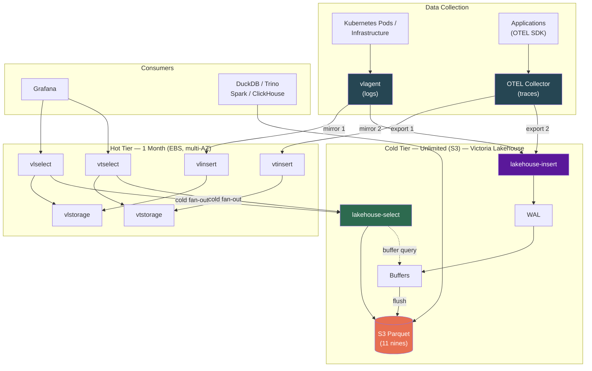
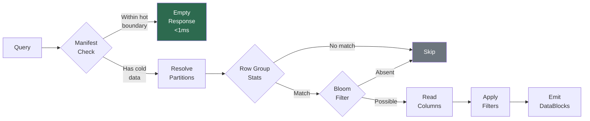
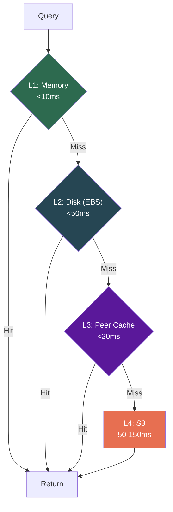
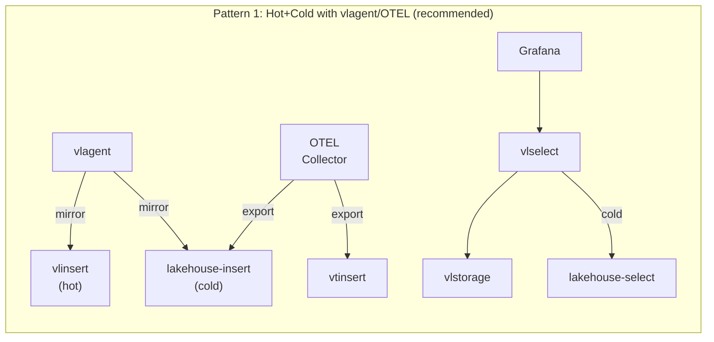
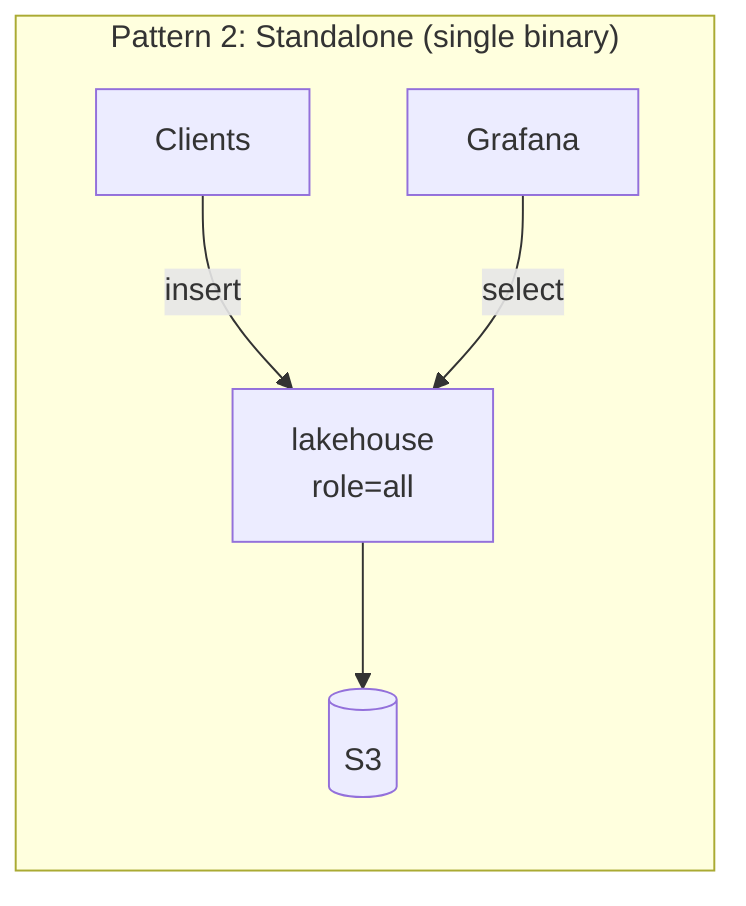
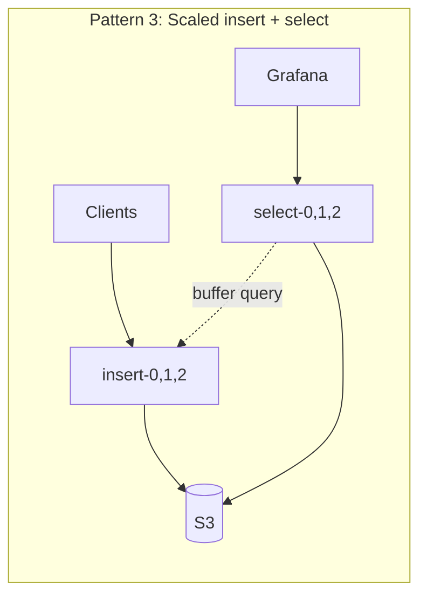
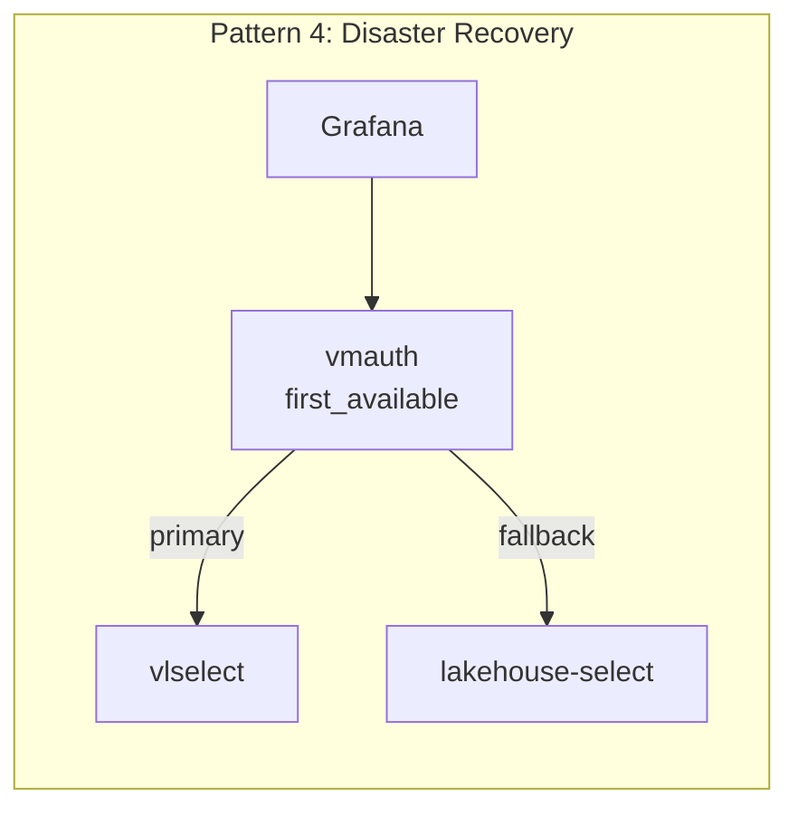
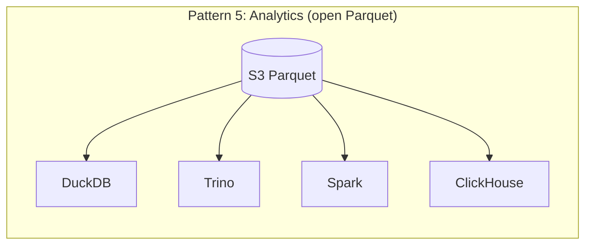

# Victoria Lakehouse

[](https://github.com/ReliablyObserve/victoria-lakehouse/actions/workflows/ci.yaml)
[](https://github.com/ReliablyObserve/victoria-lakehouse/actions/workflows/security.yaml)
[](https://go.dev/)
[](https://github.com/ReliablyObserve/victoria-lakehouse/releases)
[](https://github.com/ReliablyObserve/victoria-lakehouse)
[](#tests)
[](LICENSE)

**S3-backed cold storage for VictoriaLogs and VictoriaTraces.** 100% API-compatible with VL/VT — same endpoints, same protocols, same query language. Implements the VL/VT storage interface with an S3 Parquet backend. Registers as a `-storageNode` and works transparently alongside existing VL/VT clusters.

> **100% VL/VT API compatible.** Victoria Lakehouse reimplements the VL/VT storage layer with Parquet on S3 while exposing identical HTTP APIs, LogsQL query syntax, binary DataBlock protocol, and insert endpoints. VL/VT's vlselect fans out queries to both hot (vlstorage) and cold (lakehouse) — users see unified results. No VL/VT fork — a purpose-built cold tier that speaks the same language.

- **Drop-in VL/VT storage node.** Register as a `-storageNode` on vlselect/vtselect. Queries spanning hot and cold data work transparently.
- **Write path with crash recovery.** VL-compatible insert APIs (`/insert/jsonline`, Loki push, ES bulk) buffer data, flush to S3 Parquet, and survive process crashes via WAL.
- **Zero-delay reads.** Select pods query insert pods for unflushed buffer data, merging with S3 results for immediate read-after-write visibility.
- **Open format + S3 durability.** 22% cheaper than Loki/Tempo. Within 5% of VL/VT EBS cost at 1yr, cheapest at 3yr+ with Glacier tiering. S3's 11-nines durability for compliance.
- **Sub-millisecond fast path.** Queries within the hot tier's range get an immediate empty response via the partition manifest. Zero S3 I/O.
- **Disaster recovery.** When the hot cluster is down (outage, upgrade, migration), lakehouse serves all data from S3 — slower but always available.
- **Cost-aware deletion.** VL-compatible delete APIs with tombstone-based soft delete. Three modes: `hide` (instant, $0), `permanent` (physical removal), `auto` (smart). Glacier-safe — never triggers retrieval fees.
- **Open Parquet files.** DuckDB, Trino, Spark, and ClickHouse read the same files directly for analytics, compliance, and ML.

---

## The Cost Case

VL/VT's 47-70x compression makes EBS-only cheapest for short retention. With 3 AZ replication, VL/VT EBS and Lakehouse Hybrid are within 5% of each other. Lakehouse adds **open Parquet format, S3 11-nines durability, disaster recovery, and Glacier tiering** — and is always cheaper than Loki/Tempo.

| Scenario (500 GB/day, 1yr, 3 AZ) | VL/VT EBS Only | Lakehouse Hybrid | Loki + Tempo |
|---|---|---|---|
| **Monthly cost** | **$2,679/mo** | $2,814/mo | $3,610/mo |
| **Compression** | 47-70x | 6x (Parquet) | 3.5x |
| **Query speed (cold)** | <10ms (all EBS) | <500ms (Parquet) | 1-10s |
| **Data format** | Proprietary | **Open Parquet** | Proprietary |
| **S3 durability** | EBS per-AZ | **11 nines** | 11 nines |
| **Glacier tiering** | N/A | **Yes (cheapest at 3yr+)** | No (compaction breaks it) |
| **Analytics access** | VL/VT API only | **DuckDB, Spark, Trino** | Loki API only |
| **Disaster recovery** | N/A | **Independent cold tier** | N/A |

Full cost worksheet: [Cost Estimates](docs/cost-estimates.md) | Deep comparison vs Loki/Tempo: [Cost Comparison](docs/cost-comparison.md)

---

## Quick Start

### Docker

```bash
docker run -p 9428:9428 \
  ghcr.io/reliablyobserve/victoria-lakehouse:latest \
  --lakehouse.mode=logs \
  --lakehouse.s3.bucket=obs-archive \
  --lakehouse.s3.region=us-east-1
```

### Docker Compose (with MinIO)

```bash
docker compose -f deployment/docker/docker-compose-e2e.yml up
```

### Helm

```bash
helm install lakehouse-logs oci://ghcr.io/reliablyobserve/charts/victoria-lakehouse \
  --set mode=logs \
  --set s3.bucket=obs-archive \
  --set s3.region=us-east-1 \
  --set discovery.headlessService=vlstorage.monitoring.svc.cluster.local \
  --set discovery.partitionAuthKey=secret
```

### Grafana Datasource (Direct Access)

Point a VictoriaLogs datasource directly at Victoria Lakehouse for standalone cold queries:

```yaml
datasources:
  - name: Cold Logs (Lakehouse)
    type: victorialogs-datasource
    access: proxy
    url: http://lakehouse-logs:9428
```

For full setup, cluster integration, and deployment patterns, see [Getting Started](docs/getting-started.md).

---

## Architecture

Victoria Lakehouse reimplements the VL/VT storage interface (`RunQuery`, `GetFieldNames`, `GetFieldValues`, `GetStreams`, etc.) backed by Parquet files on S3. All HTTP APIs (`/select/logsql/*`, `/insert/jsonline`, `/insert/loki/api/v1/push`, `/insert/elasticsearch/_bulk`, `/delete/logsql/*`), the binary DataBlock protocol, and the LogsQL query engine are implemented from the VL/VT spec — same endpoints, same wire format, same query syntax.

It integrates with vlagent (logs) and OTEL Collector (traces) to mirror data to both hot and cold tiers simultaneously, providing unlimited retention, disaster recovery, and open-format analytics.



**Key points:**
- **vlagent** mirrors logs to both VictoriaLogs (hot, 1 month, EBS) and Lakehouse (cold, unlimited, S3)
- **OTEL Collector** fans out traces to both VictoriaTraces (hot) and Lakehouse (cold)
- **vlselect/vtselect** transparently fan out queries to hot + cold — users see unified results
- **Lakehouse as DR**: when hot cluster is down, Grafana queries lakehouse directly (slower but always available)
- **Open Parquet**: DuckDB, Trino, Spark, ClickHouse query S3 directly for analytics, compliance, ML

For detailed collector configs and DR playbooks, see [Deployment Architecture](docs/deployment-architecture.md).

### Query Flow



### Multi-Tier Cache



### Deployment Patterns











---

## Modes and Roles

Single binary, two modes, three roles:

| Mode | Flag | Port | API | Use Case |
|---|---|---|---|---|
| Logs | `--lakehouse.mode=logs` | 9428 | VL `/select/logsql/*` + `/insert/*` | Cold log storage |
| Traces | `--lakehouse.mode=traces` | 10428 | VT `/select/logsql/*` + Jaeger | Cold trace storage |

| Role | Flag | Description |
|---|---|---|
| All | `--lakehouse.role=all` (default) | Insert + select in one process |
| Insert | `--lakehouse.role=insert` | Write path only, flush to S3 |
| Select | `--lakehouse.role=select` | Read path only, query S3 + buffers |

---

## Key Features

### Write Path
- **VL-compatible insert APIs**: `/insert/jsonline`, `/insert/loki/api/v1/push`, `/insert/elasticsearch/_bulk` — same protocols as VictoriaLogs.
- **Write-ahead log (WAL)**: crash-safe durability with gob-encoded append-only log and automatic replay on restart.
- **Adaptive file sizing**: per-partition byte estimates trigger flush when approaching `--lakehouse.insert.target-file-size` for optimal Parquet file sizes.
- **Buffer query bridge**: select pods fan out to insert pods via `/internal/buffer/query` for zero-delay reads of unflushed data.
- **Manifest label pruning**: `FileInfo.Labels` enables query-time file skipping based on label values without opening Parquet files.

### Read Path
- **Auto-discovery of hot boundary** via `/internal/partition/list` on vlstorage/vtstorage. Zero manual config.
- **Partition manifest** for sub-ms "nothing here" responses. Recent queries cost zero S3 I/O.
- **Bloom filters** on `trace_id` and `service_name` for fast point lookups.
- **Correlated prefetch**: log query warms trace Parquet for same time+service, and vice versa.
- **Read-ahead**: sequential time scans prefetch next partitions.

### Deletion
- **Three-tier strategy**: tombstone (instant, $0) → selective rewrite (S3 Standard only) → lifecycle expiry (Glacier/IA).
- **VL-compatible APIs**: `/delete/logsql/*` for logs, `/delete/tracessql/*` for traces — same query syntax.
- **Three modes**: `hide` (tombstone only, never rewrites), `permanent` (physical removal), `auto` (smart default).
- **Cost estimation**: `/delete/logsql/estimate` returns per-storage-class cost breakdown before executing.
- **Verification**: `/delete/logsql/verify` confirms tombstoned data is invisible (normal mode) or physically deleted (deep mode).
- **Un-delete**: remove a tombstone to restore data visibility instantly.
- **Glacier-safe**: never triggers retrieval fees. Tombstone suppresses reads; data ages out via lifecycle.
- **GDPR compliant**: immediate inaccessibility satisfies right-to-erasure. Optional physical delete for strict compliance.

### Infrastructure
- **Metadata persistence**: manifest, label index, and cache survive restarts.
- **Distributed peer cache**: consistent hash routing across fleet instances via headless DNS.
- **Schema auto-discovery**: OTLP column names in Parquet, mapped to VL/VT names at query time.
- **SQS/SNS support**: optional near-real-time manifest updates from S3 event notifications.

---

## Configuration

Minimal config (mode + S3 bucket) works out of the box. All 110+ config options have production-ready defaults.

```yaml
lakehouse:
  mode: logs
  s3:
    bucket: obs-archive
    region: us-east-1
  discovery:
    headless_service: vlstorage.monitoring.svc.cluster.local
    partition_auth_key: "${PARTITION_AUTH_KEY}"
```

Full reference: [Configuration](docs/configuration.md)

---

## Observability

- **~80 Prometheus metrics** under `lakehouse_*` prefix (RED, USE, S3, cache, peer, manifest, Parquet engine, prefetch, startup)
- **Grafana dashboards** (single-instance + cluster + supplementary panels for VL/VT dashboards)
- **10 alerting rules** with severity and annotations
- **Structured JSON logs** via `slog`

See [Observability](docs/observability.md).

---

## Security

- **Distroless runtime image** (`gcr.io/distroless/static-debian12:nonroot`) — no shell, no package manager
- **Non-root execution** (UID 65534)
- **Read-only root filesystem** in Kubernetes
- **Stripped binaries** (`-s -w` linker flags)
- **Drop all capabilities** (`capabilities.drop: ["ALL"]`)
- **Seccomp profile** (`RuntimeDefault`)
- **CI security gates**: govulncheck, gosec, Trivy, gitleaks, CodeQL

See [Security](docs/security.md).

---

## Parquet Schema

Victoria Lakehouse reads OTLP-standard Parquet files. Column names use **OTEL semantic convention dot-notation** directly (e.g., `service.name`, `k8s.namespace.name`) for zero-translation compatibility with OTEL Collector exporters and standard tooling. High-frequency fields are promoted to top-level columns (with statistics + bloom filters). Everything else goes in MAP columns.

| Promoted (Logs) | Promoted (Traces) |
|---|---|
| `timestamp_unix_nano` | `timestamp_unix_nano`, `start_time_unix_nano` |
| `body`, `severity_text` | `trace_id`, `span_id`, `parent_span_id` |
| `service.name` | `span.name`, `service.name` |
| `k8s.namespace.name`, `k8s.pod.name` | `status.code`, `duration_ns` |
| `trace_id`, `span_id` | `resource.attributes` (MAP) |
| `resource.attributes`, `log.attributes` (MAP) | `span.attributes`, `scope.attributes` (MAP) |

S3 layout: Hive partitioned by `dt=YYYY-MM-DD/hour=HH`.

Full schema reference: [Architecture](docs/architecture.md)

---

## Performance Targets

| Operation | Target p95 |
|---|---|
| Manifest "nothing here" fast path | <1ms |
| Point query (trace_id, bloom filter) | <100ms |
| Time-range scan (1h) | <500ms |
| stats_query (aggregation) | <300ms |
| field_names / field_values | <1ms (label index) |

See [Performance](docs/performance.md).

---

## Documentation

### Core
- [Getting Started](docs/getting-started.md) — quick start, ingestion, deployment patterns
- [Deployment Architecture](docs/deployment-architecture.md) — vlagent, OTEL Collector, hot/cold tiers, DR
- [Configuration](docs/configuration.md) — all 110+ config options with defaults
- [Architecture](docs/architecture.md) — internal design, Parquet schema, query flow
- [Operations](docs/operations.md) — day-2 operations, scaling, troubleshooting

### Use Cases & Analytics
- [Use Cases](docs/use-cases.md) — DR, compliance, capacity planning, cost allocation, ML
- [Analytics](docs/analytics.md) — DuckDB, Trino, Spark, ClickHouse, Pandas examples

### Operations
- [Security](docs/security.md) — hardening, network policies, credential handling
- [Observability](docs/observability.md) — metrics, dashboards, alerting rules
- [Performance](docs/performance.md) — benchmarks, tuning, targets
- [Scaling](docs/scaling.md) — horizontal and vertical scaling guides
- [Cost Estimates](docs/cost-estimates.md) — EBS vs S3 cost comparison
- [Cost Comparison vs Loki/Tempo](docs/cost-comparison.md) — comprehensive competitive analysis
- [Write Path](docs/write-path.md) — insert APIs, WAL, flush pipeline, buffer query bridge
- [Deletion Strategy](docs/deletion-strategy.md) — cost-aware tombstone + selective rewrite, Glacier-safe

---

## Current Status

| Milestone | Status | Key Deliverables |
|---|---|---|
| M1: Foundation | Complete | Go module, config, CI/CD, Helm chart, Dockerfile |
| M2: ParquetS3Storage Core | Complete | Schema registry, manifest, query engine, bloom filters, column projection, stream methods |
| M3: Cache + Persistence | Complete | L1 memory LRU, L2 disk LRU, singleflight coalescence, label index, metadata persistence |
| M4: Discovery + Peer Cache | Complete | Hot boundary auto-discovery, consistent hash peer cache, `/manifest/range` API |
| M5: VL/VT Cluster Integration | Complete | `/internal/select/*` binary protocol, storage node registration |
| M6: Filter AST + E2E | Complete | Full LogsQL predicate engine, Playwright E2E, schema validation |
| M8-Phase A: Write Durability | Complete | WAL crash recovery, insert APIs, adaptive flush, buffer query bridge, manifest labels |
| M9: Compaction | Complete | Background merge, size-tiered strategy, manifest updates |
| M10: Testing & Helm | Complete | E2E overhaul (VL + vlselect + loki-vl-proxy), benchmarks, Victoria-pattern Helm chart, upstream sync GHA |
| M11: Cost-Aware Deletion | Complete | Tombstone store, `/delete/logsql/*` + `/delete/tracessql/*` APIs, query-time filtering, background rewriter, storage-class detection, verify endpoint |
| M7: Observability | Complete | ~80 Prometheus metrics, Grafana dashboards (single + cluster), 10 alerting rules, circuit breaker |

---

## Development

```bash
make build          # Build binary + healthcheck
make test           # Run unit tests with race detector
make lint           # golangci-lint
make docker         # Build container image
make e2e            # Full E2E with MinIO + VL cluster
```

---

## License

Apache License 2.0. See [LICENSE](LICENSE).
