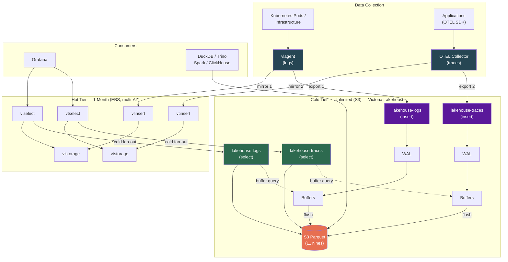
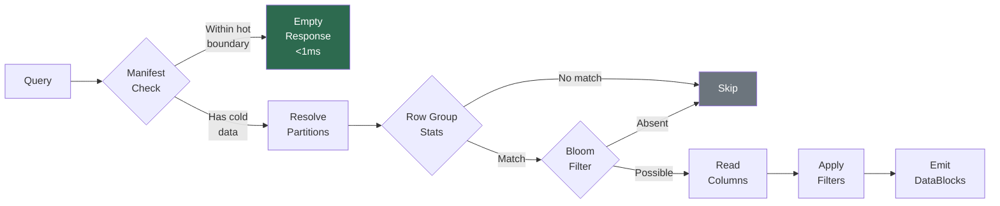
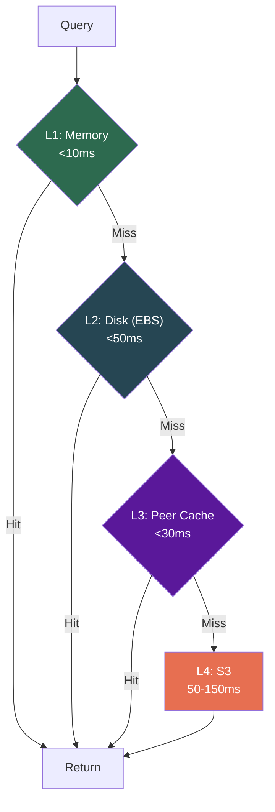
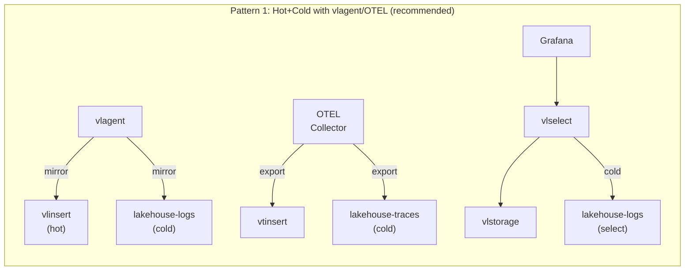
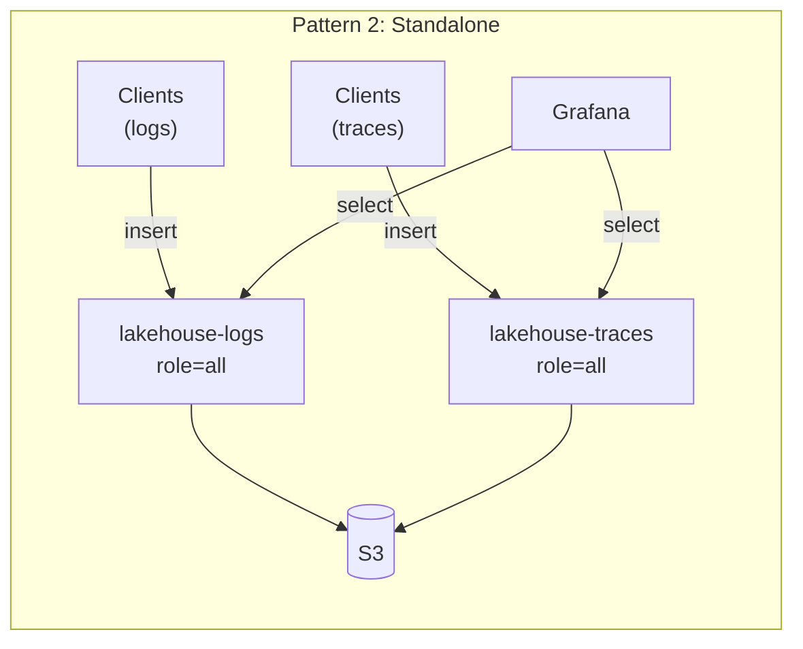
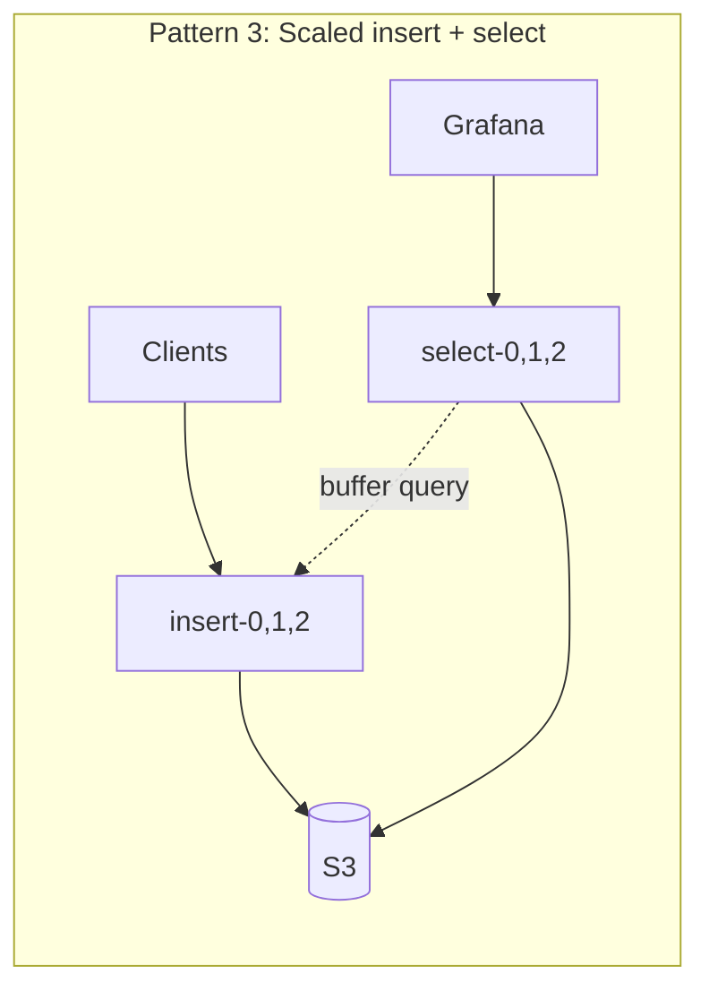
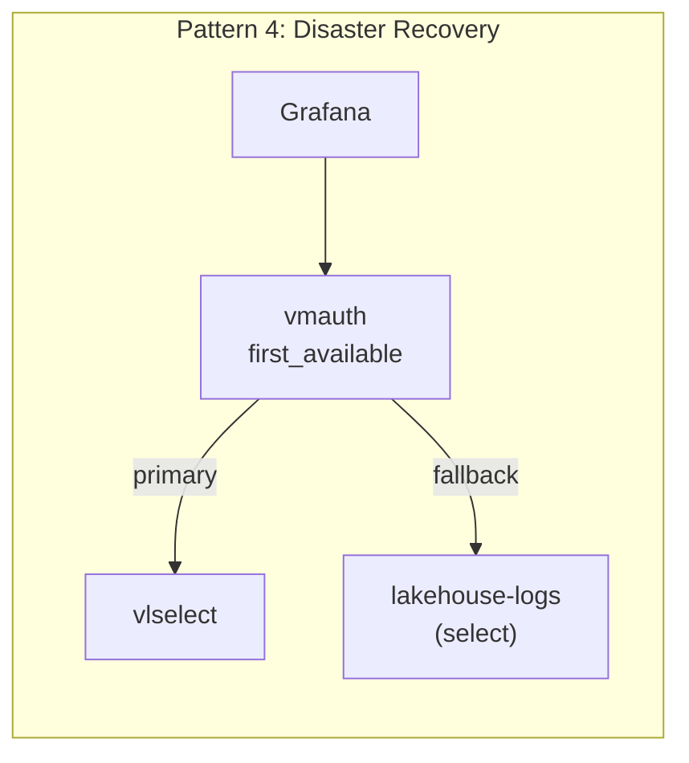
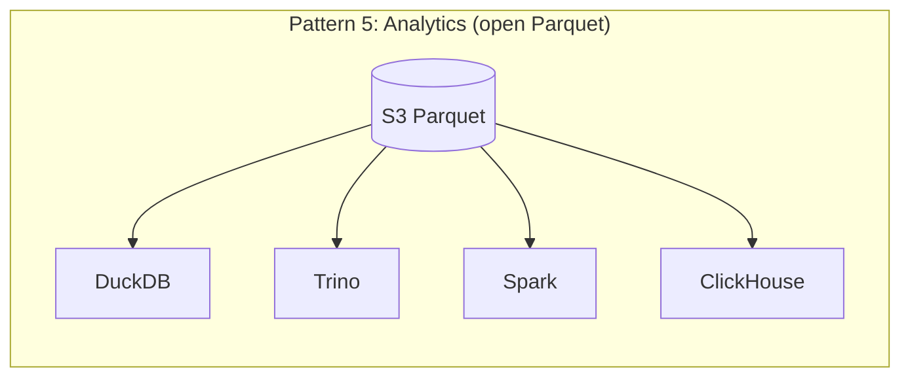

<p align="center">
  
</p>

# Victoria Lakehouse

[](https://github.com/ReliablyObserve/victoria-lakehouse/actions/workflows/ci.yaml)
[](https://github.com/ReliablyObserve/victoria-lakehouse/actions/workflows/security.yaml)
[](https://go.dev/)
[](https://github.com/ReliablyObserve/victoria-lakehouse/releases)
[](https://github.com/ReliablyObserve/victoria-lakehouse)
[](https://github.com/ReliablyObserve/victoria-lakehouse)
[](#tests)
[](LICENSE)

**S3-backed cold storage for VictoriaLogs and VictoriaTraces.** Two dedicated binaries — `lakehouse-logs` and `lakehouse-traces` — each 100% API-compatible with VL/VT. Same endpoints, same protocols, same query language. Implements the VL/VT storage interface with an S3 Parquet backend. Registers as a `-storageNode` and works transparently alongside existing VL/VT clusters.

> **Two binaries, one architecture.** `lakehouse-logs` reimplements the VL storage layer. `lakehouse-traces` reimplements the VT storage layer. Both use Parquet on S3 and expose identical HTTP APIs, LogsQL query syntax, binary DataBlock protocol, and insert endpoints as their upstream counterparts. Each binary pins to its own VL/VT dependency version for maximum compatibility.

- **Drop-in VL/VT storage node.** Register as a `-storageNode` on vlselect/vtselect. Queries spanning hot and cold data work transparently.
- **Write path with crash recovery.** VL-compatible insert APIs (`/insert/jsonline`, Loki push, ES bulk) buffer data, flush to S3 Parquet, and survive process crashes via WAL.
- **Zero-delay reads.** Select pods query insert pods for unflushed buffer data, merging with S3 results for immediate read-after-write visibility.
- **Open format + S3 durability.** 22% cheaper than Loki/Tempo. Within 5% of VL/VT EBS cost at 1yr, cheapest at 3yr+ with Glacier tiering. S3's 11-nines durability for compliance.
- **Sub-millisecond fast path.** Queries within the hot tier's range get an immediate empty response via the partition manifest. Zero S3 I/O.
- **Disaster recovery.** When the hot cluster is down (outage, upgrade, migration), lakehouse serves all data from S3 — slower but always available.
- **Cost-aware deletion.** VL-compatible delete APIs with tombstone-based soft delete. Three modes: `hide` (instant, $0), `permanent` (physical removal), `auto` (smart). Glacier-safe — never triggers retrieval fees.
- **Open Parquet files.** DuckDB, Trino, Spark, and ClickHouse read the same files directly for analytics, compliance, and ML.

---

## The Cost Case

VL/VT's 47-70x compression makes EBS-only cheapest for short retention. With 3 AZ replication, VL/VT EBS and Lakehouse Hybrid are within 5% of each other. Lakehouse adds **open Parquet format, S3 11-nines durability, disaster recovery, and Glacier tiering** — and is always cheaper than Loki/Tempo.

| Scenario (500 GB/day, 1yr, 3 AZ) | VL/VT EBS Only | Lakehouse Hybrid | Loki + Tempo |
|---|---|---|---|
| **Monthly cost** | **$2,679/mo** | $2,814/mo | $3,610/mo |
| **Compression** | 47-70x | 6x (Parquet) | 3.5x |
| **Query speed (cold)** | <10ms (all EBS) | <500ms (Parquet) | 1-10s |
| **Data format** | Proprietary | **Open Parquet** | Proprietary |
| **S3 durability** | EBS per-AZ | **11 nines** | 11 nines |
| **Glacier tiering** | N/A | **Yes (cheapest at 3yr+)** | No (compaction breaks it) |
| **Analytics access** | VL/VT API only | **DuckDB, Spark, Trino** | Loki API only |
| **Disaster recovery** | N/A | **Independent cold tier** | N/A |

Full cost worksheet: [Cost Estimates](docs/cost-estimates.md) | Deep comparison vs Loki/Tempo: [Cost Comparison](docs/cost-comparison.md)

---

## Quick Start

### Docker

```bash
# Logs (VL-compatible, port 9428)
docker run -p 9428:9428 \
  ghcr.io/reliablyobserve/lakehouse-logs:latest \
  --lakehouse.s3.bucket=obs-archive \
  --lakehouse.s3.region=us-east-1

# Traces (VT-compatible, port 10428)
docker run -p 10428:10428 \
  ghcr.io/reliablyobserve/lakehouse-traces:latest \
  --lakehouse.s3.bucket=obs-archive \
  --lakehouse.s3.region=us-east-1
```

### Docker Compose (with MinIO)

```bash
docker compose -f deployment/docker/docker-compose-e2e.yml up
```

### Helm

```bash
# Deploy logs cold tier
helm install lakehouse-logs oci://ghcr.io/reliablyobserve/charts/victoria-lakehouse \
  --set lakehouseConfig.mode=logs \
  --set lakehouseConfig.s3.bucket=obs-archive \
  --set lakehouseConfig.s3.region=us-east-1 \
  --set lakehouseConfig.discovery.headless_service=vlstorage.monitoring.svc.cluster.local

# Deploy traces cold tier (separate release, same chart)
helm install lakehouse-traces oci://ghcr.io/reliablyobserve/charts/victoria-lakehouse \
  --set lakehouseConfig.mode=traces \
  --set lakehouseConfig.s3.bucket=obs-archive \
  --set lakehouseConfig.s3.region=us-east-1 \
  --set lakehouseConfig.discovery.headless_service=vtstorage.monitoring.svc.cluster.local
```

### Grafana Datasource (Direct Access)

Point a VictoriaLogs datasource directly at Victoria Lakehouse for standalone cold queries:

```yaml
datasources:
  - name: Cold Logs (Lakehouse)
    type: victorialogs-datasource
    access: proxy
    url: http://lakehouse-logs:9428
  - name: Cold Traces (Lakehouse)
    type: jaeger
    access: proxy
    url: http://lakehouse-traces:10428
```

For full setup, cluster integration, and deployment patterns, see [Getting Started](docs/getting-started.md).

---

## Architecture

Victoria Lakehouse reimplements the VL/VT storage interface (`RunQuery`, `GetFieldNames`, `GetFieldValues`, `GetStreams`, etc.) backed by Parquet files on S3. All HTTP APIs (`/select/logsql/*`, `/insert/jsonline`, `/insert/loki/api/v1/push`, `/insert/elasticsearch/_bulk`, `/delete/logsql/*`), the binary DataBlock protocol, and the LogsQL query engine are implemented from the VL/VT spec — same endpoints, same wire format, same query syntax.

It integrates with vlagent (logs) and OTEL Collector (traces) to mirror data to both hot and cold tiers simultaneously, providing unlimited retention, disaster recovery, and open-format analytics.



**Key points:**
- **vlagent** mirrors logs to both VictoriaLogs (hot, 1 month, EBS) and `lakehouse-logs` (cold, unlimited, S3)
- **OTEL Collector** fans out traces to both VictoriaTraces (hot) and `lakehouse-traces` (cold)
- **vlselect/vtselect** transparently fan out queries to hot + cold — users see unified results
- **Lakehouse as DR**: when hot cluster is down, Grafana queries lakehouse directly (slower but always available)
- **Open Parquet**: DuckDB, Trino, Spark, ClickHouse query S3 directly for analytics, compliance, ML

For detailed collector configs and DR playbooks, see [Deployment Architecture](docs/deployment-architecture.md).

### Query Flow



### Multi-Tier Cache



### Deployment Patterns











---

## Binaries and Roles

Two separate binaries with independent VL/VT dependency versions:

| Binary | Port | VL/VT Compat | API | Docker Image |
|---|---|---|---|---|
| `lakehouse-logs` | 9428 | VL v1.50.0 | VL `/select/logsql/*` + `/insert/*` + `/delete/logsql/*` | `ghcr.io/.../lakehouse-logs` |
| `lakehouse-traces` | 10428 | VT v0.8.2 | VT `/select/logsql/*` + Jaeger + `/delete/tracessql/*` | `ghcr.io/.../lakehouse-traces` |

Each binary supports three roles:

| Role | Flag | Description |
|---|---|---|
| All | `--lakehouse.role=all` (default) | Insert + select in one process |
| Insert | `--lakehouse.role=insert` | Write path only, flush to S3 |
| Select | `--lakehouse.role=select` | Read path only, query S3 + buffers |

---

## Key Features

### Write Path
- **VL-compatible insert APIs**: `/insert/jsonline`, `/insert/loki/api/v1/push`, `/insert/elasticsearch/_bulk` — same protocols as VictoriaLogs.
- **Write-ahead log (WAL)**: crash-safe durability with gob-encoded append-only log and automatic replay on restart.
- **Adaptive file sizing**: per-partition byte estimates trigger flush when approaching `--lakehouse.insert.target-file-size` for optimal Parquet file sizes.
- **Buffer query bridge**: select pods fan out to insert pods via `/internal/buffer/query` for zero-delay reads of unflushed data.
- **Manifest label pruning**: `FileInfo.Labels` enables query-time file skipping based on label values without opening Parquet files.

### Read Path
- **Auto-discovery of hot boundary** via `/internal/partition/list` on vlstorage/vtstorage. Zero manual config.
- **Partition manifest** for sub-ms "nothing here" responses. Recent queries cost zero S3 I/O.
- **LogsQL filter evaluation**: field matchers (exact, substring, regex, NOT) are applied post-scan to filter DataBlock rows at the storage layer.
- **max_rows enforcement**: `query.max_rows` (default 10M) caps emitted rows per query, preventing unbounded cold-query resource usage.
- **Bloom filters** on `trace_id` and `service_name` for fast point lookups.
- **Parallel file workers**: configurable bounded worker pool for concurrent Parquet file processing (default 8 workers).
- **Correlated prefetch**: log query warms trace Parquet for same time+service, and vice versa.
- **Read-ahead**: sequential time scans prefetch next partitions.

### Smart Cache
- **Unified cache controller** orchestrating L1 (memory), L2 (disk), L3 (peer), L4 (S3) with per-entry TTL, hot access detection, and singleflight S3 deduplication.
- **Active query pinning**: files used by in-flight queries are pinned in cache with configurable grace period, preventing eviction under load.
- **Cache sizing calculator**: adaptive budget estimation blending ingestion rate (early) and query pattern analysis (after 12h uptime), with per-node fleet division.
- **Snapshot persistence**: metadata snapshots to disk for fast cache warmup on restart.
- **15 Prometheus metrics**: hit ratio, entries, bytes used/limit, evictions by reason, hot/pinned entries, coverage hours, prefetch hit ratio.

### Cross-Signal Prefetch
- **Bidirectional hints** between `lakehouse-logs` and `lakehouse-traces` deployments. A logs query for `service=checkout` automatically warms trace Parquet for the same time window, and vice versa.
- **Works across separate binaries/deployments** — logs and traces don't need to be co-located. Hints are exchanged via HTTP (`/internal/prefetch/hint`, `/internal/cache/evict-hint`).
- **Connected data eviction**: when trace cache entries are evicted, correlated log entries are deprioritized.
- **Hint batching**: trace ID hints are accumulated and flushed on interval or batch size threshold, reducing HTTP overhead.
- **Auth key support**: optional `X-Cross-Signal-Key` header for securing cross-deployment communication.

### Deletion
- **Three-tier strategy**: tombstone (instant, $0) -> selective rewrite (S3 Standard only) -> lifecycle expiry (Glacier/IA).
- **`lakehouse-logs`**: `/delete/logsql/*` endpoints. **`lakehouse-traces`**: `/delete/tracessql/*` endpoints.
- **Three modes**: `hide` (tombstone only, never rewrites), `permanent` (physical removal), `auto` (smart default).
- **Cost estimation**: `/delete/logsql/estimate` (or `/delete/tracessql/estimate`) returns per-storage-class cost breakdown before executing.
- **Verification**: `/delete/logsql/verify` (or `/delete/tracessql/verify`) confirms tombstoned data is invisible (normal mode) or physically deleted (deep mode).
- **Un-delete**: remove a tombstone to restore data visibility instantly.
- **Glacier-safe**: never triggers retrieval fees. Tombstone suppresses reads; data ages out via lifecycle.
- **GDPR compliant**: immediate inaccessibility satisfies right-to-erasure. Optional physical delete for strict compliance.

### Infrastructure
- **Metadata persistence**: manifest, label index, cache metadata, and smart cache snapshots survive restarts.
- **Distributed peer cache**: consistent hash routing across fleet instances via headless DNS.
- **Schema auto-discovery**: OTLP column names in Parquet, mapped to VL/VT names at query time.
- **SQS/SNS support**: optional near-real-time manifest updates from S3 event notifications.

---

## Configuration

Minimal config (S3 bucket) works out of the box. All 110+ config options have production-ready defaults. Each binary automatically applies mode-appropriate defaults (port, S3 prefix, bloom columns, delete prefix).

### Shared Config (both binaries)

```yaml
lakehouse:
  s3:
    bucket: obs-archive
    region: us-east-1
  discovery:
    headless_service: vlstorage.monitoring.svc.cluster.local
    partition_auth_key: "${PARTITION_AUTH_KEY}"
```

### Smart Cache & Cross-Signal Config

```yaml
lakehouse:
  smart_cache:
    max_age: 24h
    hot_access_threshold: 3
    hot_window: 10m
    target_hours: 24
    snapshot_interval: 60s
    query_grace_period: 5m
  cross_signal:
    enabled: true
    endpoint: http://lakehouse-traces:10428  # for lakehouse-logs
    auth_key: "${CROSS_SIGNAL_KEY}"
    max_batch: 100
    batch_interval: 500ms
  query:
    file_workers: 8
```

### Mode-Specific Config

Each binary reads its own section for mode-specific overrides:

```yaml
lakehouse:
  # lakehouse-logs reads this section
  logs:
    bloom_columns: [service.name]
    delete_prefix: /delete/logsql

  # lakehouse-traces reads this section
  traces:
    bloom_columns: [trace_id, service.name]
    delete_prefix: /delete/tracessql
    jaeger_enabled: true
    jaeger_grpc_addr: ":16685"
```

### Mode-Specific Flags

```bash
# lakehouse-logs flags
--lakehouse.logs.bloom-columns=service.name
--lakehouse.logs.delete-prefix=/delete/logsql

# lakehouse-traces flags
--lakehouse.traces.bloom-columns=trace_id,service.name
--lakehouse.traces.delete-prefix=/delete/tracessql
--lakehouse.traces.jaeger-enabled=true
--lakehouse.traces.jaeger-grpc-addr=:16685
```

Full reference: [Configuration](docs/configuration.md)

---

## Observability

- **~100 Prometheus metrics** under `lakehouse_*` prefix (RED, USE, S3, cache, peer, manifest, Parquet engine, prefetch, smart cache, cross-signal, startup)
- **Grafana dashboards** (single-instance + cluster + supplementary panels for VL/VT dashboards)
- **10 alerting rules** with severity and annotations
- **Structured JSON logs** via `slog`

See [Observability](docs/observability.md).

---

## Security

- **Distroless runtime image** (`gcr.io/distroless/static-debian12:nonroot`) — no shell, no package manager
- **Non-root execution** (UID 65534)
- **Read-only root filesystem** in Kubernetes
- **Stripped binaries** (`-s -w` linker flags)
- **Drop all capabilities** (`capabilities.drop: ["ALL"]`)
- **Seccomp profile** (`RuntimeDefault`)
- **Internal endpoint auth**: `/internal/cache/*` endpoints require Bearer token (`peer.auth_key`) when configured, matching the same auth pattern used by `/internal/manifest/update`
- **Tenant isolation**: each Lakehouse deployment serves a single tenant's S3 prefix. Multi-tenancy is achieved at the deployment level, not row-level filtering
- **CI security gates**: govulncheck, gosec, Trivy, gitleaks, CodeQL

See [Security](docs/security.md).

---

## Parquet Schema

Victoria Lakehouse reads OTLP-standard Parquet files. Column names use **OTEL semantic convention dot-notation** directly (e.g., `service.name`, `k8s.namespace.name`) for zero-translation compatibility with OTEL Collector exporters and standard tooling. High-frequency fields are promoted to top-level columns (with statistics + bloom filters). Everything else goes in MAP columns.

| Promoted (Logs) | Promoted (Traces) |
|---|---|
| `timestamp_unix_nano` | `timestamp_unix_nano`, `start_time_unix_nano` |
| `body`, `severity_text` | `trace_id`, `span_id`, `parent_span_id` |
| `service.name` | `span.name`, `service.name` |
| `k8s.namespace.name`, `k8s.pod.name` | `status.code`, `duration_ns` |
| `trace_id`, `span_id` | `resource.attributes` (MAP) |
| `resource.attributes`, `log.attributes` (MAP) | `span.attributes`, `scope.attributes` (MAP) |

S3 layout: Hive partitioned by `dt=YYYY-MM-DD/hour=HH`.

Full schema reference: [Architecture](docs/architecture.md)

---

## Performance Targets

| Operation | Target p95 |
|---|---|
| Manifest "nothing here" fast path | <1ms |
| Point query (trace_id, bloom filter) | <100ms |
| Time-range scan (1h) | <500ms |
| stats_query (aggregation) | <300ms |
| field_names / field_values | <1ms (label index) |

See [Performance](docs/performance.md).

---

## Documentation

### Core
- [Getting Started](docs/getting-started.md) — quick start, ingestion, deployment patterns
- [Deployment Architecture](docs/deployment-architecture.md) — vlagent, OTEL Collector, hot/cold tiers, DR
- [Configuration](docs/configuration.md) — all 110+ config options with defaults
- [Architecture](docs/architecture.md) — internal design, Parquet schema, query flow
- [Operations](docs/operations.md) — day-2 operations, scaling, troubleshooting

### Use Cases & Analytics
- [Use Cases](docs/use-cases.md) — DR, compliance, capacity planning, cost allocation, ML
- [Analytics](docs/analytics.md) — DuckDB, Trino, Spark, ClickHouse, Pandas examples

### Operations
- [Security](docs/security.md) — hardening, network policies, credential handling
- [Observability](docs/observability.md) — metrics, dashboards, alerting rules
- [Performance](docs/performance.md) — benchmarks, tuning, targets
- [Scaling](docs/scaling.md) — horizontal and vertical scaling guides
- [Cost Estimates](docs/cost-estimates.md) — EBS vs S3 cost comparison
- [Cost Comparison vs Loki/Tempo](docs/cost-comparison.md) — comprehensive competitive analysis
- [Write Path](docs/write-path.md) — insert APIs, WAL, flush pipeline, buffer query bridge
- [Deletion Strategy](docs/deletion-strategy.md) — cost-aware tombstone + selective rewrite, Glacier-safe

---

## Current Status

| Milestone | Status | Key Deliverables |
|---|---|---|
| M1: Foundation | Complete | Go module, config, CI/CD, Helm chart, Dockerfile |
| M2: ParquetS3Storage Core | Complete | Schema registry, manifest, query engine, bloom filters, column projection, stream methods |
| M3: Cache + Persistence | Complete | L1 memory LRU, L2 disk LRU, singleflight coalescence, label index, metadata persistence |
| M4: Discovery + Peer Cache | Complete | Hot boundary auto-discovery, consistent hash peer cache, `/manifest/range` API |
| M5: VL/VT Cluster Integration | Complete | `/internal/select/*` binary protocol, storage node registration |
| M6: Filter AST + E2E | Complete | Full LogsQL predicate engine, Playwright E2E, schema validation |
| M8-Phase A: Write Durability | Complete | WAL crash recovery, insert APIs, adaptive flush, buffer query bridge, manifest labels |
| M9: Compaction | Complete | Background merge, size-tiered strategy, manifest updates |
| M10: Testing & Helm | Complete | E2E overhaul (VL + vlselect + loki-vl-proxy), benchmarks, Victoria-pattern Helm chart, upstream sync GHA |
| M11: Cost-Aware Deletion | Complete | Tombstone store, delete APIs, query-time filtering, background rewriter, storage-class detection, verify endpoint |
| M7: Observability | Complete | ~80 Prometheus metrics, Grafana dashboards (single + cluster), 10 alerting rules, circuit breaker |
| Binary Split | Complete | Separate `lakehouse-logs` + `lakehouse-traces` binaries, independent Go modules, mode-specific config/flags |
| Smart Cache & Cross-Signal | Complete | Smart cache controller, cross-signal prefetch, parallel query workers, cache sizing, active query pinning |

---

## Development

```bash
# Logs binary
make build-logs       # Build lakehouse-logs
make test-logs        # Run logs module tests with race detector
make docker-logs      # Build logs Docker image

# Traces binary
make build-traces     # Build lakehouse-traces
make test-traces      # Run traces module tests with race detector
make docker-traces    # Build traces Docker image

# Both
make build            # Build both binaries
make test             # Run all tests
make lint             # golangci-lint both modules
make e2e              # Full E2E with MinIO + VL cluster
```

---

## License

Apache License 2.0. See [LICENSE](LICENSE).
