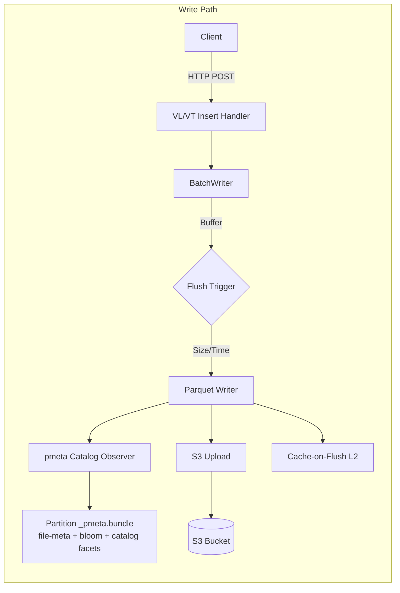
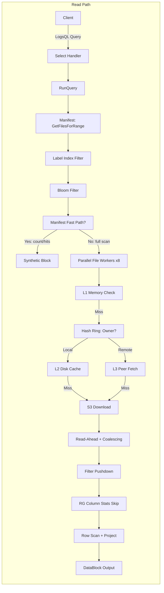
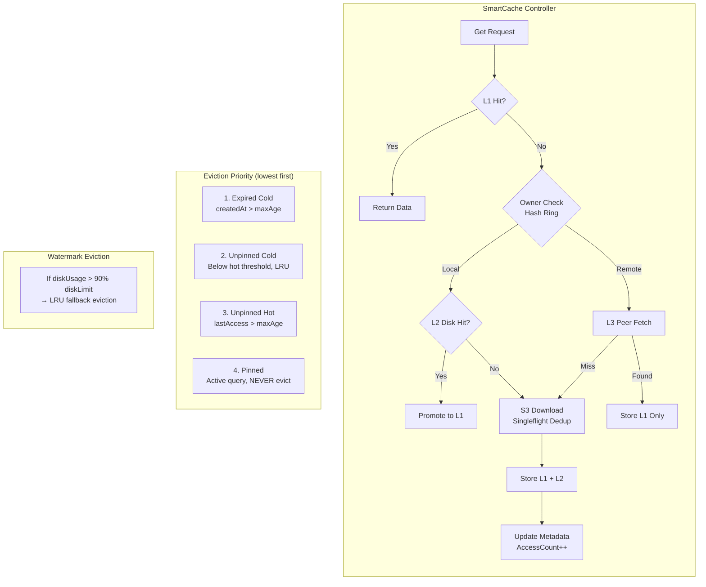
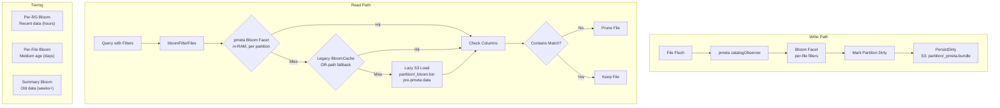
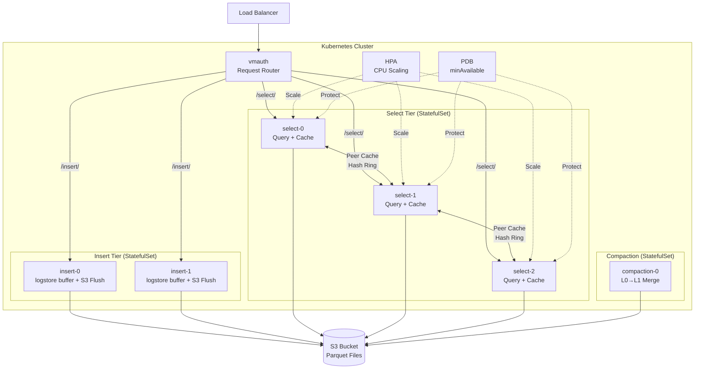

# Victoria Lakehouse Architecture Overview

## System Architecture

```mermaid
graph TB
    subgraph "Victoria Lakehouse"
        subgraph "Ingestion Layer"
            VLI[VL Insert Handlers<br/>Logs :9428]
            VTI[VT Insert Handlers<br/>Traces :10428]
        end

        subgraph "Query Layer"
            VLS[VL Select Handlers<br/>LogsQL API]
            VTS[VT Select Handlers<br/>Traces API]
            JAE[Jaeger API<br/>gRPC + HTTP]
            LOKI[Loki Proxy<br/>Compatibility]
        end

        subgraph "Storage Layer (parquets3)"
            BW[BatchWriter<br/>insert.buffer_engine:<br/>buffer | logstore]
            RQ[RunQuery<br/>Parallel File Scan<br/>+ recent window from buffer]
            FA[Field APIs<br/>field_names/values<br/>stream_fields/ids]
        end

        subgraph "Query Optimization Stack"
            FPD[Filter Pushdown]
            BI[Bloom Index<br/>pmeta bloom facet<br/>+ partition index]
            MFP[Manifest Fast Path<br/>Zero-S3 Stats]
            RGS[RG Column Stats<br/>Min/Max Skip]
            PRJ[Projection<br/>Column Pruning]
            PRW[PreWhere<br/>Early Filter]
            SF[Self-Filter<br/>Hash-Ring Ownership]
            CA[Cache Affinity<br/>Footer-first Sort]
            TB[Token Bloom<br/>Body Text Pruning]
            LI[Label Index<br/>Fast Field Lookup]
        end

        subgraph "Cache Hierarchy"
            L1[L1: BudgetedL1<br/>Memory LRU]
            L2[L2: Disk LRU<br/>SmartCache Controller]
            L3[L3: Peer Cache<br/>Consistent Hash Ring]
            SC[SmartCache Controller<br/>TTL + Hot + LRU + Pin]
            SP[Snapshot Persistence<br/>Versioned Envelope]
            SZ[Sizing Calculator<br/>Ingestion + Query Based]
            CC[Chunk Cache<br/>Column-level]
            CP[Column Popularity<br/>Adaptive Caching]
            PG[Pollution Guard<br/>Scan Protection]
            FC[Footer Cache<br/>Parquet Metadata]
        end

        subgraph "Infrastructure"
            MAN[Manifest<br/>File Registry + Stats]
            CMP[Compaction<br/>L0 to L1 Merge]
            PFE[Prefetch Engine<br/>Cross-Signal + ReadAhead]
            BLC[Bloom Cache<br/>LRU + Lazy S3 Load]
            DSC[Discovery<br/>S3 + DNS SRV]
            PR[Peer Ring<br/>AZ-Aware Routing]
            HT[Health Tracking<br/>Failure Counting]
        end

        subgraph "Tenant & Stats"
            TR[Tenant Resolver<br/>OrgID Mapping]
            TS[Tenant Sync<br/>Fleet CRDT Merge]
            ST[Stats Registry<br/>Per-Tenant Metrics]
            CE[Cost Estimator<br/>Storage Class Aware]
            UI[Explorer UI<br/>3-Tab Preact App]
            VUI[VMUI Tab<br/>Injected Dashboard]
            CAR[Cardinality API<br/>Field Explorer]
        end

        subgraph "Cross-Signal"
            CSC[Cross-Signal Client<br/>Batched Hints]
            CSH[Cross-Signal Handler<br/>Hint Receiver]
            EVH[Eviction Hints<br/>Connected Data]
        end

        subgraph "S3 I/O Optimization"
            RAB[Read-Ahead Buffer<br/>256KB Streaming]
            RCO[Range Coalescing<br/>64KB Gap Merge]
            HTT[HTTP/2 Transport<br/>Connection Tuning]
            RGW[RG Worker Pool<br/>8 Concurrent Workers]
            FPF[Footer Prefetch<br/>Batch S3 Range Reads]
        end

        subgraph "K8s Integration"
            AZD[AZ Detection<br/>Env/IMDS/GCP/K8s]
            STM[Startup Manager<br/>Phase-Based Init]
            SHD[Shutdown Handler<br/>Graceful Drain]
            BB[Buffer Bridge<br/>AZ-Aware Fan-Out]
        end
    end

    subgraph "External"
        S3[(S3 / MinIO<br/>Parquet Storage)]
        VL[VictoriaLogs<br/>Upstream Insert]
        VT[VictoriaTraces<br/>Upstream Insert]
    end

    subgraph "Deployment (Helm)"
        INS[Insert Pods<br/>StatefulSet + PV]
        SEL[Select Pods<br/>StatefulSet + PV]
        COM[Compaction Pods<br/>StatefulSet]
        HPA[HPA<br/>CPU Autoscaling]
        PDB[PDB<br/>Availability]
    end

    VLI --> BW
    VTI --> BW
    VLS --> RQ
    VTS --> RQ
    JAE --> RQ
    LOKI --> VLS

    BW --> S3
    RQ --> FPD & BI & MFP
    RQ --> L1 --> L2 --> L3
    RQ --> RAB --> RCO --> S3

    SC --> L2
    SC --> SP
    SC --> SZ

    CSC <--> CSH
    PFE --> SC

    TR --> TS
    ST --> CE
    UI --> ST
    VUI --> UI

    INS --> VLI & VTI
    SEL --> VLS & VTS
    COM --> CMP
```

## Data Flow





## Cache Architecture



## Bloom Index Architecture



## Deployment Topology



