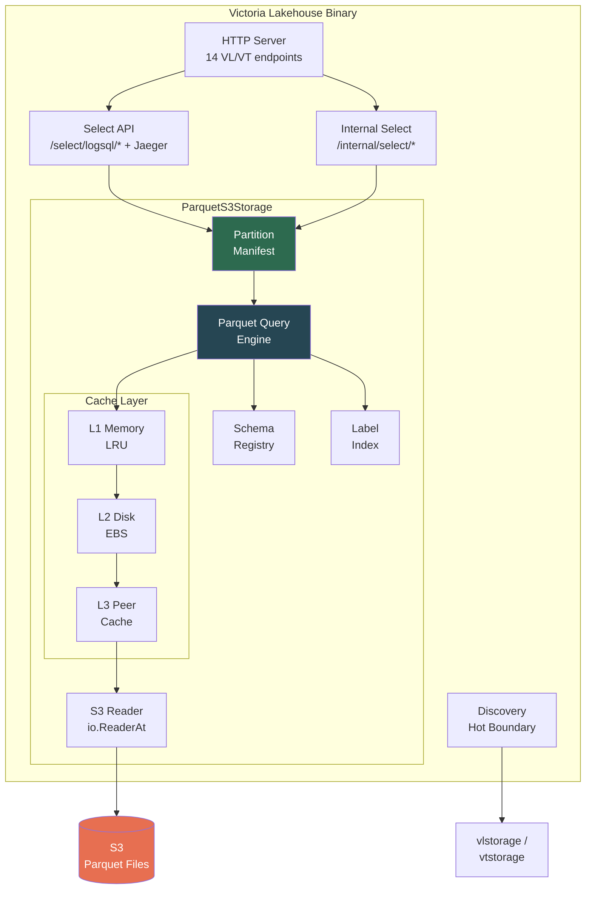
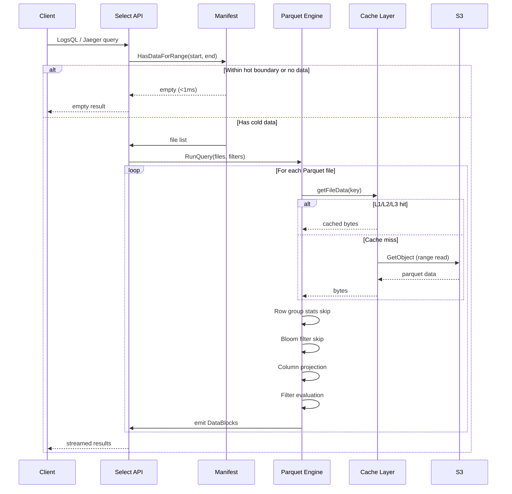
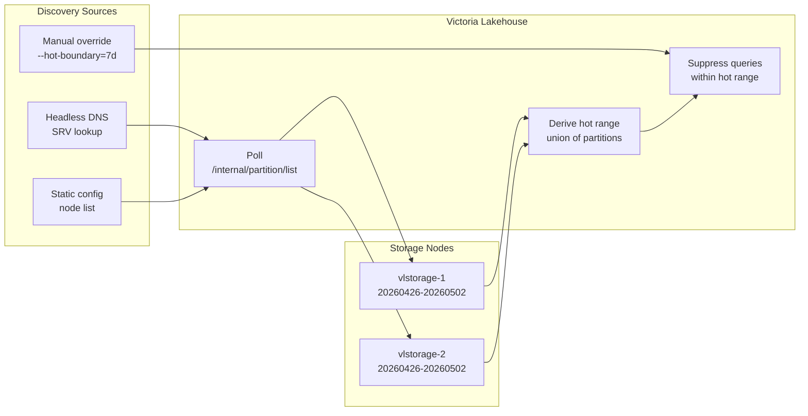
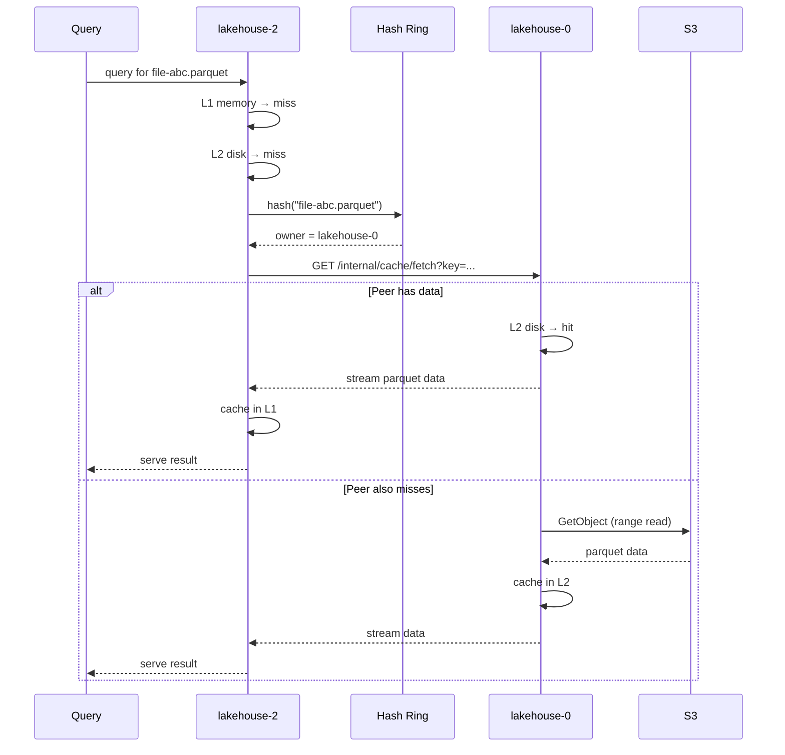
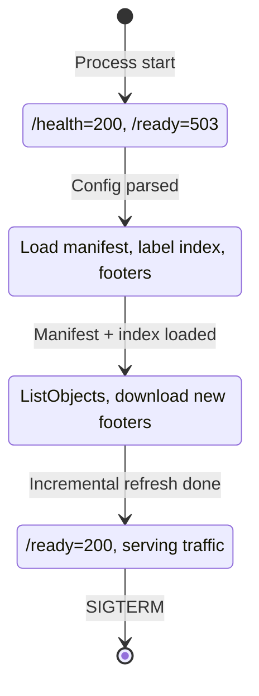
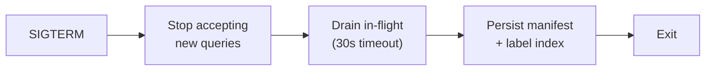
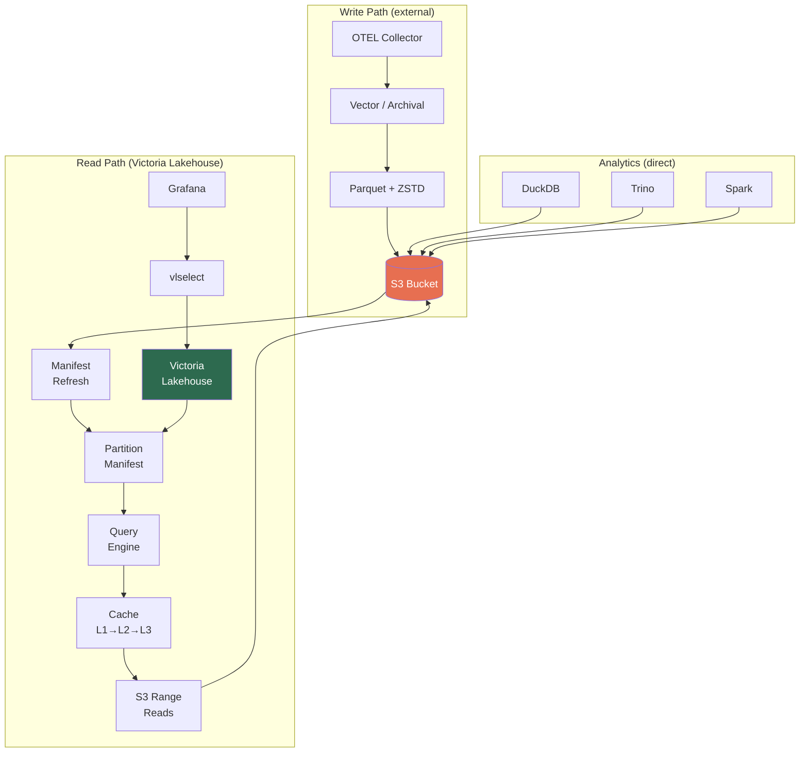

# Architecture

## Overview

Victoria Lakehouse is a single Go binary that reimplements VL/VT select APIs backed by a Parquet/S3 backend (`ParquetS3Storage`). It serves the same HTTP endpoints and response formats as VL/VT, making it a drop-in cold storage tier.



## Storage Interface

Victoria Lakehouse implements VL's storage interface (11 methods):

| Method | Purpose |
|---|---|
| `RunQuery(qctx, writeBlock)` | Execute LogsQL query, stream results |
| `GetFieldNames(qctx, filter)` | List field/column names |
| `GetFieldValues(qctx, field, filter)` | List values for a field |
| `GetStreamFieldNames(qctx, filter)` | List stream label names |
| `GetStreamFieldValues(qctx, field)` | List values for a stream label |
| `GetStreams(qctx)` | List active streams |
| `GetStreamIDs(qctx)` | List stream IDs |
| `GetTenantIDs(qctx)` | List tenant IDs |
| `DeleteRunTask` / `DeleteStopTask` / `DeleteActiveTasks` | No-op (read-only) |

## Query Execution Flow



## Parquet Schema

### Column Naming: OTEL Semantic Conventions (Dot-Notation)

Parquet column names use **OTEL semantic convention dot-notation directly** (e.g., `service.name`, `k8s.namespace.name`). This gives zero-translation compatibility with OTEL Collector Parquet exporters and standard OTEL tooling. SQL engines that need quoting (`"service.name"`) can handle this themselves — SQL compatibility is not a design constraint.

### Logs

| Column | Type | VL Name | Notes |
|---|---|---|---|
| `timestamp_unix_nano` | INT64 | `_time` | Every query filters on time |
| `body` | STRING | `_msg` | Full-text search |
| `severity_text` | STRING (DICT) | `level` | Dashboard filter |
| `severity_number` | INT32 | (derived) | Numeric comparison |
| `service.name` | STRING (DICT) | `service.name` | Highest-cardinality filter |
| `k8s.namespace.name` | STRING (DICT) | `k8s.namespace.name` | Infra filter |
| `k8s.pod.name` | STRING (DICT) | `k8s.pod.name` | Infra filter |
| `trace_id` | FIXED_BYTE_ARRAY(16) | `trace_id` | Bloom filter |
| `span_id` | FIXED_BYTE_ARRAY(8) | `span_id` | Correlation |
| `_stream` | STRING | `_stream` | Stream identity |
| `_stream_id` | STRING | `_stream_id` | Stream hash |
| `resource.attributes` | MAP<STRING,STRING> | (by key) | All resource attrs |
| `log.attributes` | MAP<STRING,STRING> | (by key) | All log attrs |
| `scope.name` | STRING | `scope.name` | Instrumentation scope |

### Traces

| Column | Type | VT Name | Notes |
|---|---|---|---|
| `timestamp_unix_nano` | INT64 | `_time` | Time range filter |
| `start_time_unix_nano` | INT64 | (computed) | Duration |
| `trace_id` | FIXED_BYTE_ARRAY(16) | `trace_id` | Primary key + bloom |
| `span_id` | FIXED_BYTE_ARRAY(8) | `span_id` | Identity |
| `parent_span_id` | FIXED_BYTE_ARRAY(8) | `parent_span_id` | Tree construction |
| `span.name` | STRING (DICT) | `name` | Common filter |
| `span.kind` | INT32 | `kind` | CLIENT/SERVER |
| `status.code` | INT32 | `status_code` | Error filtering |
| `status.message` | STRING | `status_message` | Error details |
| `duration_ns` | INT64 | `duration` | Latency queries |
| `service.name` | STRING (DICT) | `resource_attr:service.name` | Most filtered |
| `resource.attributes` | MAP<STRING,STRING> | `resource_attr:*` | All resource attrs |
| `span.attributes` | MAP<STRING,STRING> | `span_attr:*` | All span attrs |
| `scope.name` | STRING | `scope_attr:otel.library.name` | Library |
| `scope.attributes` | MAP<STRING,STRING> | `scope_attr:*` | Other scope |

### Schema Registry

The `SchemaRegistry` maps OTEL dot-notation Parquet column names to VL/VT internal names at query time. Because column names directly match OTEL semantic conventions, most promoted columns need no translation — the Parquet column name IS the VL/VT name.

1. Check promoted column (fast, stats + bloom) — most are identity mappings
2. Check VT prefix convention (`resource_attr:X` -> `resource.attributes` MAP lookup)
3. Check VL dotted convention (`custom.field` -> try `resource.attributes`, then `log.attributes`)
4. Check runtime-discovered MAP keys
5. Not found -> return empty

Promoted columns always take precedence over MAP lookups.

### S3 Layout

```
s3://obs-archive/{tenant}/
  logs/
    dt=2026-04-01/hour=00/00000-abc.parquet
    dt=2026-04-01/hour=01/00000-def.parquet
    ...
  traces/
    dt=2026-04-01/hour=00/00000-ghi.parquet
    ...
```

Hive partitioned by date and hour. Files written by external archival pipelines (Vector, custom ETL).

## Filter Evaluation

| LogsQL Filter | Parquet Strategy |
|---|---|
| `field:value` (substring) | Scan column, `strings.Contains` |
| `field:="exact"` | Row group stats skip + scan |
| `field:~"regex"` | Compile regex, scan column |
| `field:>N` (range) | Row group min/max skip + scan |
| `_time:[start, end)` | Hive partition pruning + row group stats |
| `trace_id:="abc"` | Bloom filter + verify |
| `NOT` / `AND` / `OR` | Compose inner filter results |
| MAP key `resource_attr:key` | Read MAP column, extract key |

## Multi-Tier Cache

```
L1: Memory (sync.Map + LRU)
    - Parquet footers (~1KB each)
    - Bloom filter data (~10KB per column per row group)
    - Hot row group pages
    - Configurable max: --lakehouse.cache.memory-limit (default 512MB)
    - Target: >90% hit rate for repeated queries

L2: Local Disk (EBS gp3)
    - Full Parquet files from S3
    - LRU eviction at watermark (default 80% of disk limit)
    - Async background download
    - Target: >80% hit rate for same-day queries

L3: Peer Cache (HTTP)
    - Consistent hash ring, headless DNS discovery
    - GET /internal/cache/fetch?key=...
    - Shared secret auth (--lakehouse.peer-auth-key)
    - singleflight coalescence (no duplicate S3 fetches)

L4: S3 (source of truth)
    - io.ReaderAt -> S3 GetObject with Range header
    - Section hints for footer+bloom prefetch
    - Connection pooling, circuit breaker
```

## Partition Manifest

In-memory index of all Parquet files in S3. Enables sub-millisecond "nothing here" responses.

```
manifest.HasDataForRange(start, end) -> O(1) check
  - Range outside [minTime, maxTime] -> return empty (FAST PATH)
  - Range overlaps -> manifest.GetFiles(start, end) -> only matching files
```

Refreshed via S3 ListObjects (configurable interval) and/or SQS event notifications. ~100 bytes per partition-hour (~850KB for 1 year of hourly data).

## Query Engine Features (M2)

### Row Group Skipping

Two skip mechanisms reduce I/O:

1. **Timestamp statistics**: Row group column index min/max values are checked against the query time range. Row groups entirely outside `[startNs, endNs)` are skipped.
2. **Bloom filters**: For columns marked `HasBloom: true` (service.name, trace_id), exact-match queries trigger bloom filter checks. If the bloom filter says a value is definitely absent, the row group is skipped.

### Column Projection

When `QueryContext.RequestedColumns` is set, only the specified columns (plus `timestamp_unix_nano` always) are read and returned. This reduces DataBlock size and memory allocation. Without projection, all columns are returned.

### Filter Evaluation Matrix

| LogsQL Filter | Parquet Strategy | Status |
|---|---|---|
| `_time:[start, end)` | Hive partition pruning + row group timestamp stats | Implemented |
| `field:="exact"` | Bloom filter check (if available) + row scan | Implemented |
| `trace_id:="abc"` | Bloom filter on trace_id column | Implemented |
| `service.name:="X"` | Bloom filter on service.name column | Implemented |
| `field:value` (substring) | Row scan, `strings.Contains` | Planned (M3+) |
| `field:~"regex"` | Row scan, compiled regex | Planned (M3+) |
| `field:>N` (range) | Row group min/max + scan | Planned (M3+) |
| `NOT`, `AND`, `OR` | Evaluate sub-filters | Planned (M3+) |

### Stream Fields

Stream identity fields are defined per profile:
- **Logs**: `service.name`, `k8s.namespace.name`, `k8s.pod.name`
- **Traces**: `resource_attr:service.name`, `name`

`GetStreamFieldNames()` returns these from the registry. `GetStreamFieldValues()` delegates to `GetFieldValues()`. `GetStreams()` reads the `_stream` column from Parquet files.

## Cache Layer (M3)

### Multi-Tier Cache Implementation

The cache layer is integrated into the storage query path via `getFileData()`:

```
Query arrives for Parquet file key
  |
  1. L1 Memory (LRU) -> hit? use bytes.NewReader, open parquet
  2. L2 Disk (LRU)   -> hit? read file, promote to L1, open parquet
  3. Singleflight    -> coalesce concurrent requests for same key
  4. S3 Download     -> store in L2 disk + L1 memory
```

### L1 Memory Cache (`internal/cache/lru.go`)

- Container/list doubly-linked list with map for O(1) access
- Size-based LRU eviction (configurable via `--lakehouse.cache.memory-limit`)
- Thread-safe (sync.Mutex)
- Returns byte copies to prevent caller mutation of cached data
- Tracks hits, misses, evictions for metrics

### L2 Disk Cache (`internal/cache/disk.go`)

- Stores full Parquet files on local EBS
- Key-to-path sanitization (replaces `/`, `:`, `=` with `_`)
- Watermark-based LRU eviction (default 80% of `--lakehouse.cache.disk-limit`)
- Atomic file writes, stale file detection (auto-removes entries for deleted files)
- Supports `PutFromPath` for zero-copy import from existing files

### Cache Coalescence (`internal/cache/coalesce.go`)

- Custom singleflight implementation prevents duplicate S3 downloads
- When multiple queries need the same uncached file, only one S3 request executes
- Waiting callers receive the same result with `shared=true`
- In-flight tracking for metrics (`Inflight()` count)

### Label Index (`internal/cache/persist.go`)

- Pre-computed index of label/attribute names and values
- `GetFieldNames()` responds in <1ms from label index instead of scanning Parquet files
- `GetFieldValues()` serves from index when available (with limit), falls back to file scan
- Values capped at 10K per label, cardinality and seen-in-files tracked
- Built incrementally as Parquet files are queried (`updateLabelIndex()`)
- Thread-safe (sync.RWMutex)

### Metadata Persistence (`internal/cache/persist.go`)

- Atomic JSON writes (write to `.tmp`, rename to final path)
- Persists on graceful shutdown (`Close()`) and periodic intervals
- On startup, recovers label index from disk for instant query capability
- Manifest state serialization for fast restart (planned integration with manifest package)

### Configuration

| Flag | Default | Description |
|---|---|---|
| `--lakehouse.cache.memory-limit` | `512MB` | L1 memory cache max size |
| `--lakehouse.cache.disk-path` | `/data/lakehouse/cache` | L2 disk cache directory |
| `--lakehouse.cache.disk-limit` | `50GB` | L2 disk cache max size |
| `--lakehouse.cache.eviction-watermark` | `0.8` | L2 eviction threshold |
| `--lakehouse.manifest.persist-path` | `/data/lakehouse` | Persistence directory |

## Discovery Layer (M4)

### Hot Boundary Auto-Discovery (`internal/discovery/`)



Victoria Lakehouse auto-discovers the hot tier's data range by connecting to vlstorage/vtstorage nodes:

1. **Discover storage nodes** via Kubernetes headless service DNS (SRV records) or static config
2. **Poll** each node's `/internal/partition/list?authKey=<key>` endpoint
3. **Response**: `["20260426","20260427",...]` — YYYYMMDD partition names
4. **Derive hot range**: union of all partition dates across all storage nodes
5. **Suppress**: queries entirely within hot range return empty immediately (<1ms)
6. **Refresh** every 5min (configurable)

**Discovery methods (priority order):**
- Headless DNS: `--lakehouse.discovery.headless-service=vlstorage.ns.svc.cluster.local`
- Static: `--lakehouse.discovery.storage-nodes=vlstorage-1:9428,vlstorage-2:9428`
- Manual override: `--lakehouse.hot-boundary=7d`

### Distributed Peer Cache (`internal/peercache/`)

When Victoria Lakehouse runs as a fleet, instances discover each other and share cached data:



**Components:**
- **Consistent hash ring** (`ring.go`): CRC32-based with 150 virtual nodes per member
- **Peer HTTP protocol**: `GET /internal/cache/fetch?key=...` and `/internal/cache/has?key=...`
- **Authentication**: `X-Peer-Auth-Key` header (shared secret via `--lakehouse.peer-auth-key`)
- **Discovery**: Headless DNS via `--lakehouse.discovery.peer-headless-service`

**Cache hierarchy with peer cache:**
```
L1: Memory (local)     → <10ms
L2: Disk (local EBS)   → <50ms
L3: Peer cache (HTTP)  → <30ms
L4: S3 (range reads)   → 50-150ms
```

### Manifest Range API (`internal/manifest/api.go`)

```
GET /manifest/range
Response: {"minTime": ..., "maxTime": ..., "minDate": "2025-01-31",
           "maxDate": "2026-04-30", "totalFiles": 8760, "totalBytes": ...}
```

Used by Loki-VL-proxy for routing decisions and operational tooling for data coverage verification.

### Configuration

| Flag | Default | Description |
|---|---|---|
| `--lakehouse.discovery.headless-service` | `""` | K8s headless service for vlstorage/vtstorage |
| `--lakehouse.discovery.storage-nodes` | `""` | Static storage node addresses |
| `--lakehouse.discovery.partition-auth-key` | `""` | Auth key for `/internal/partition/list` |
| `--lakehouse.discovery.peer-headless-service` | `""` | K8s headless service for peer discovery |
| `--lakehouse.peer-auth-key` | `""` | Shared secret for peer cache HTTP |
| `--lakehouse.peer.timeout` | `5s` | Peer cache request timeout |
| `--lakehouse.peer.max-connections` | `32` | Max HTTP connections per peer |

## Startup Phases



With `--lakehouse.startup.serve-stale=true`, readiness flips after DISK_RECOVERY (stale but fast).

## Graceful Shutdown



Kubernetes `terminationGracePeriodSeconds`: 60s.

## Data Flow (Write + Read Path)


