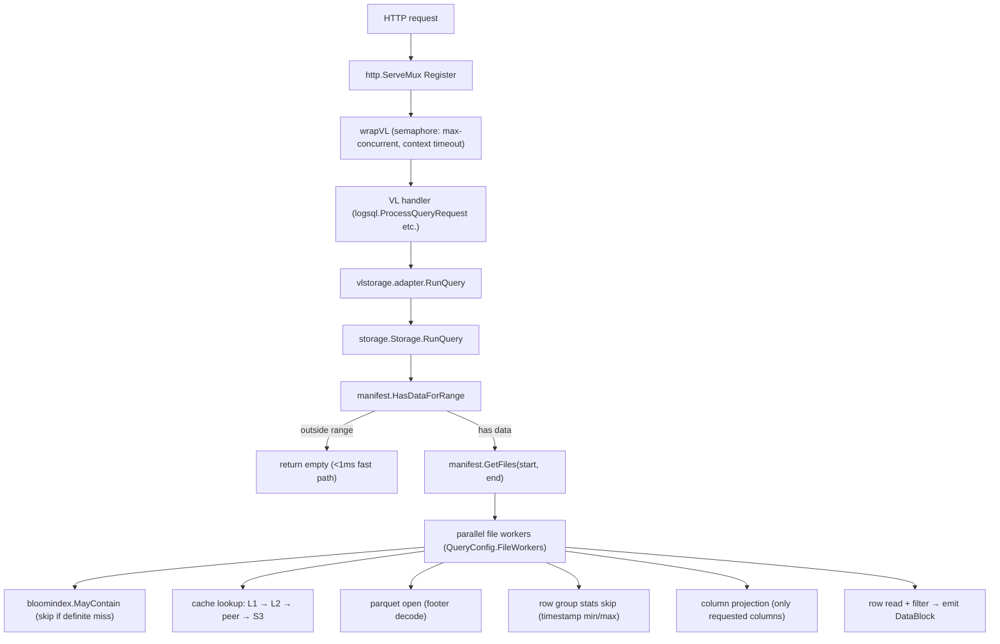
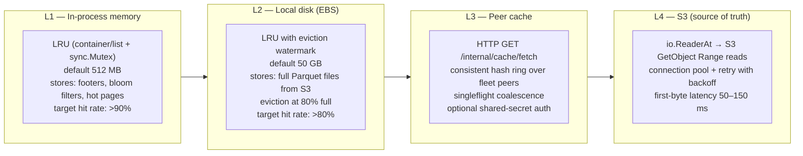
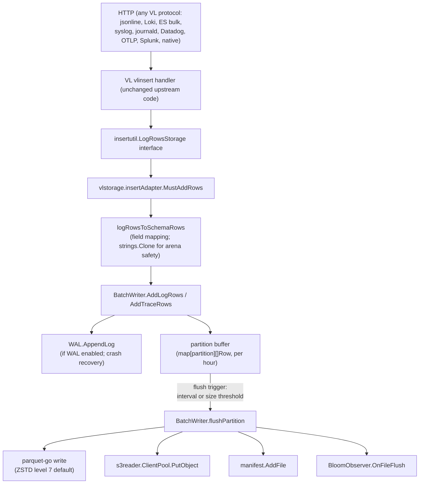
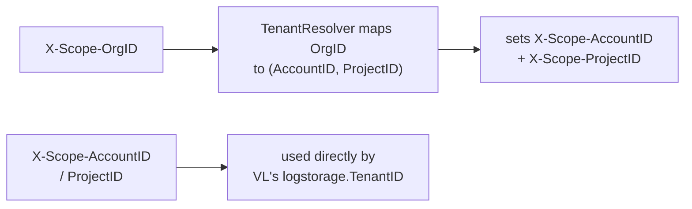
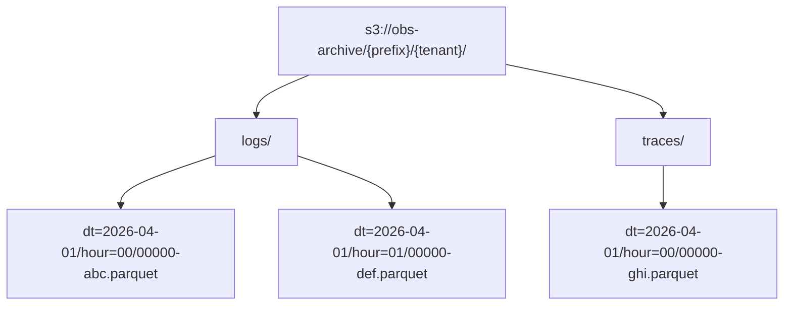
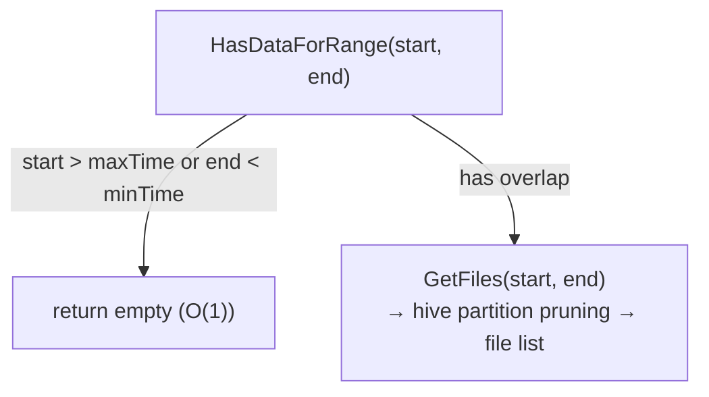

# Architecture

## Overview

Victoria Lakehouse is a single Go binary that reimplements VL/VT HTTP APIs backed by a Parquet/S3 storage engine (`parquets3`). It acts as a drop-in cold storage tier: the same endpoints and wire formats as VictoriaLogs/VictoriaTraces, with data stored as Parquet files on S3.

Two binaries are produced: `lakehouse-logs` and `lakehouse-traces`. Each is identical in structure but operates in a different mode (`logs` or `traces`), which controls schema, bloom columns, and Jaeger/Tempo endpoint registration.

---

## Query Execution Flow



`wrapVL` uses a buffered channel semaphore (`chan struct{}` of size `MaxConcurrent`). If the semaphore is full the request is rejected immediately with HTTP 429. A `context.WithTimeout` wraps each request.

---

## Cache Hierarchy

Four tiers are consulted in order on each file fetch. Once a tier hits, the result is promoted to all upstream tiers.



Cache misses at L1/L2 are deduplicated with a singleflight implementation (`internal/cache/coalesce.go`) so only one S3 download fires per key regardless of concurrent callers.

The **SmartCache controller** (`internal/smartcache/`) wraps all tiers with:
- Unified TTL enforcement (background loop every 30 s)
- Hot-access detection: entries accessed >= `HotAccessThreshold` times within `HotWindow` are marked hot and survive eviction
- Active-query pinning: `Pin(key)` / `Unpin(key)` protect in-flight files from eviction with a configurable grace period

---

## Bloom Index Pipeline

### Write path

During `BatchWriter.FlushAll`, after a Parquet file is written to S3, the `BloomObserver.OnFileFlush` callback is invoked with the collected column values for each configured bloom column. The bloom filter is built from those values and stored in `internal/bloomindex.Index` (keyed by S3 file key and column name).

Bloom columns are configured per mode:

```yaml
logs:
  bloom_columns: [trace_id, service.name]
traces:
  bloom_columns: [trace_id, service.name]
```

### Query path

Before fetching a file from the cache, `bloomindex.Index.MayContain(keys, column, value)` is called for exact-match filters. Files where the bloom filter reports a definite miss are dropped from the candidate list and never fetched. Files with no bloom entry are always included (conservative).

```mermaid
flowchart TD
    A["exact-match filter (field:=\"value\")"] --> B["bloomindex.MayContain(fileKeys, column, value)"]
    B -->|bloom says NO| C["skip file (no S3/cache access)"]
    B -->|bloom says MAYBE| D["proceed to cache lookup → row verify"]
```

The bloom index is persisted via `BloomObserver.PersistDirty` at shutdown and periodically during operation, so it survives restarts.

---

## Insert Path



Key points:
- `logRowsToSchemaRows` clones all strings because VL uses arena-allocated memory freed immediately after `MustAddRows` returns.
- Partitions are by hour: `dt=YYYY-MM-DD/hour=HH/`.
- Flush is triggered by `FlushInterval` (configurable) or when the buffer exceeds `TargetFileSize` (default 128 MB compressed).
- WAL provides crash recovery: rows written to WAL before the S3 flush are replayed on restart.

---

## Multi-Tenancy

Tenant isolation is implemented as S3 prefix partitioning. Each tenant's data lives under a dedicated prefix derived from its identity headers.

### Header resolution



The `TenantResolver.Middleware` intercepts requests, resolves `X-Scope-OrgID` to a `TenantID{AccountID, ProjectID}`, and rewrites the headers before passing the request to VL handlers. Unknown tenants return HTTP 400; `auto_register: true` creates a new ID automatically.

### S3 layout



The prefix template is configurable (`tenant.prefix_template`). Isolation modes:
- `prefix` (default): single bucket, per-tenant S3 prefix
- `bucket`: separate bucket per tenant (`tenant.bucket_template`)

All manifest lookups, cache keys, and bloom index entries are scoped by tenant prefix.

---

## Storage Interface

`internal/storage/interface.go` defines the `Storage` interface implemented by the `parquets3` engine:

| Method | Purpose |
|---|---|
| `RunQuery(ctx, tenantIDs, query, writeBlock)` | Execute LogsQL query, stream DataBlocks |
| `GetFieldNames(ctx, tenantIDs, query)` | List field/column names (label index fast path) |
| `GetFieldValues(ctx, tenantIDs, query, field, limit)` | List values for a field |
| `GetStreamFieldNames` / `GetStreamFieldValues` | Stream label introspection |
| `GetStreams` / `GetStreamIDs` | Active stream enumeration |
| `MustAddLogRows(rows)` | Buffer log rows → WAL → partition buffer → S3 |
| `MustAddTraceRows(rows)` | Buffer trace rows → WAL → partition buffer → S3 |
| `CanWriteData()` | S3 connectivity + WAL capacity check |
| `BufferedLogRows/TraceRows(start, end)` | Return unflushed rows for buffer bridge |

The `vlstorage.adapter` wraps `Storage` and registers it with VL's `vlstorage.SetExternalStorage`, so all VL HTTP handlers route through the lakehouse engine without modification.

---

## Partition Manifest

The manifest is an in-memory index of all Parquet files in S3. It enables sub-millisecond "nothing here" responses for queries outside the cold data range.



The manifest is refreshed via:
- **Periodic S3 ListObjects** (configurable `manifest.refresh_interval`)
- **SQS event notifications** (optional `manifest.sqs_queue_url`) for near-real-time updates

Memory footprint: ~100 bytes per partition-hour → ~850 KB for one year of hourly data.

---

## Hot Boundary Discovery

To avoid serving queries that belong to the hot tier (VL/VT on disk), Victoria Lakehouse auto-discovers the hot data range by polling VL/VT storage nodes:

1. Resolve storage node addresses via headless DNS (`discovery.headless_service`) or static list
2. Poll each node's `/internal/partition/list` endpoint (returns `["YYYYMMDD",...]`)
3. Derive union of all partition dates across all nodes
4. Suppress queries entirely within the hot range (return empty, <1 ms)
5. Refresh every 5 minutes (configurable)

Manual override: `hot_boundary: 7d` skips discovery and uses a fixed lookback.
