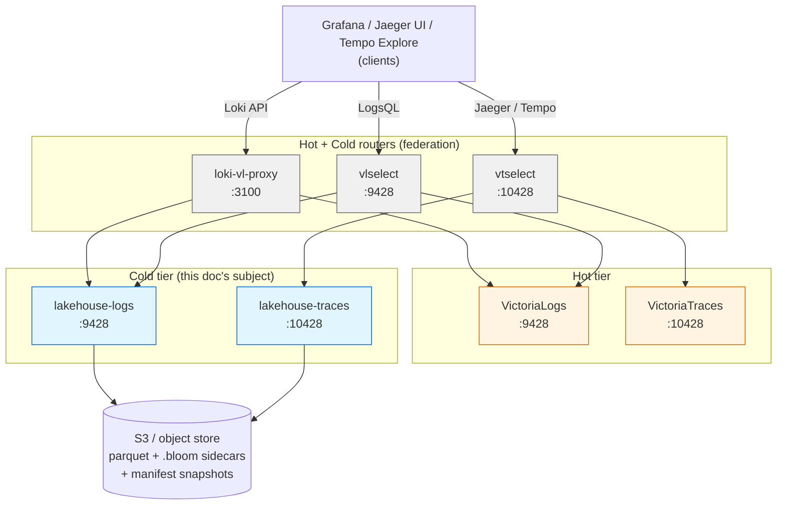
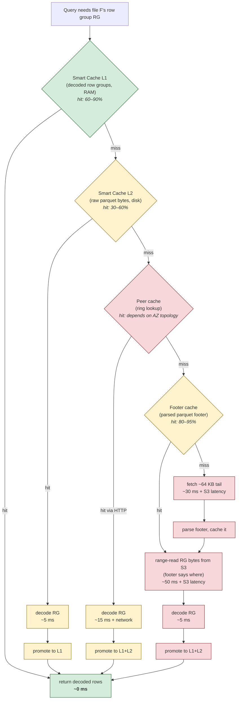
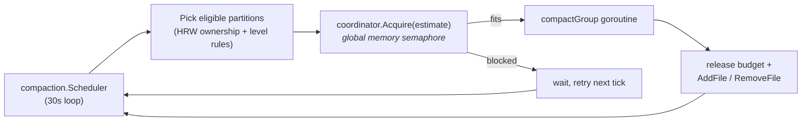
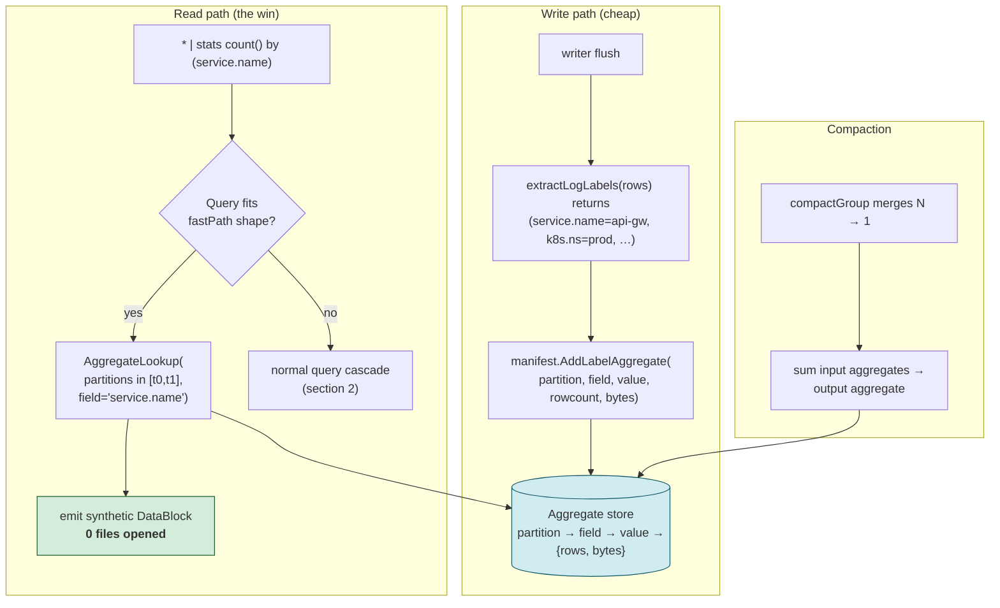
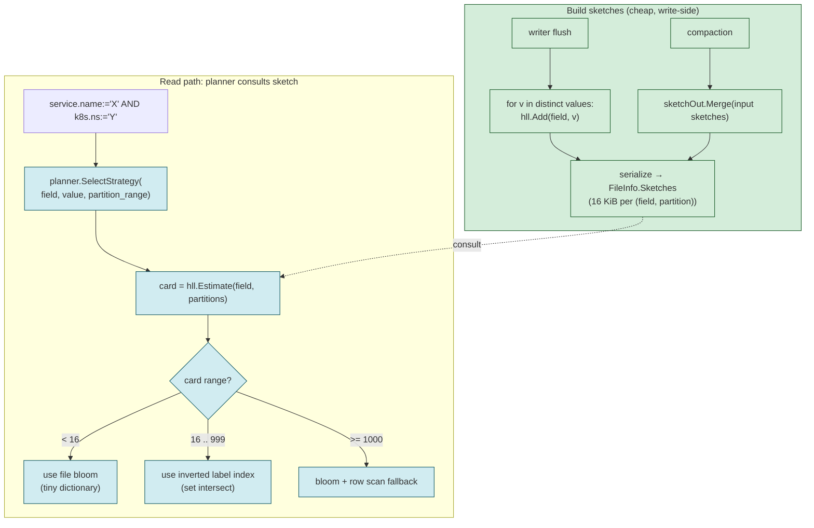
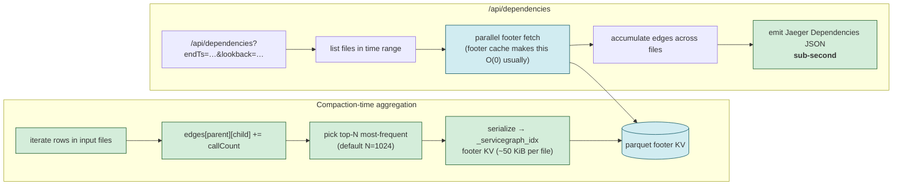
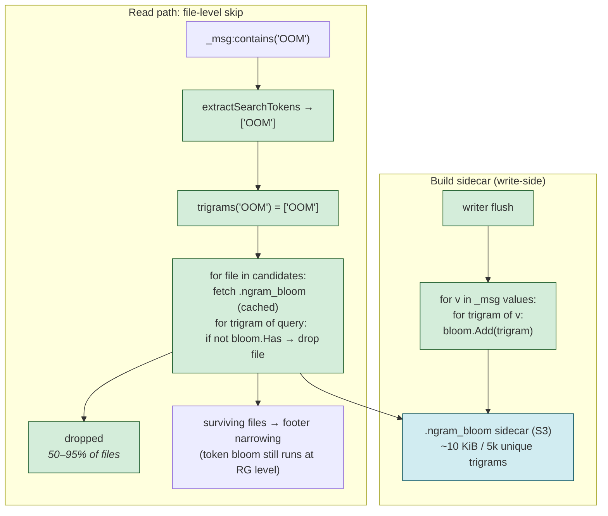
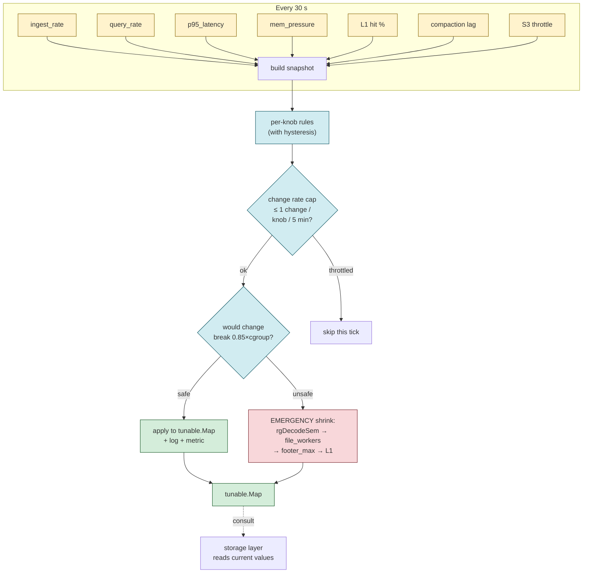

# Performance machinery

The complete inventory of speedup mechanisms in the LH cold tier, what each
costs in memory and disk, how each scales from a dev tier to a 50 M-file
PB cluster, the planned follow-up features that the same framework
needs to absorb, and the configuration philosophy that keeps operators
out of the knob business unless they want to be in it.

This page is the single-source-of-truth reference; the per-package docs
(`docs/manifest-system.md`, `docs/cache-architecture.md`, etc.) zoom into
individual mechanisms. Read this first.

## Contents

1. [The shape of the system](#shape)
2. [Query lifecycle](#query-lifecycle)
3. [Write lifecycle](#write-lifecycle)
4. [Existing machinery — inventory](#existing-machinery)
   - [A. File narrowing before any S3 read](#a-file-narrowing)
   - [B. Read-side caches](#b-caches)
   - [C. Read-side parallelism + memory budgeting](#c-parallelism)
   - [D. Indexes written by the writer + compactor](#d-write-indexes)
   - [E. Write-side machinery](#e-write-side)
   - [F. Lifecycle / startup speedups](#f-lifecycle)
   - [G. Cross-tier / federated](#g-federation)
5. [Scale projections](#scale)
6. [Configuration philosophy + workload profiles](#configuration)
7. [Auto-tuning loop](#autotune)
8. [Metrics coverage](#metrics)
9. [Roadmap — five new features + auto-tune](#roadmap)
10. [Open questions](#open)

---

## 1. The shape of the system <a name="shape"></a>



A query that arrives at a router (`vlselect` / `vtselect` / `loki-vl-proxy`)
fans out to hot (VL or VT) **and** cold (the LH process) **in parallel** —
the union of both result sets is returned. Hot answers from in-memory
buffers + local disk; cold answers from S3 parquet narrowed through
the machinery in section 4.

## 2. Query lifecycle <a name="query-lifecycle"></a>

The cascade. Each layer kills work for the next-most-expensive layer.
By the time we hit row-group decode (step 7) most files are already
gone.

```mermaid
flowchart TD
    Q["Query arrives at LH"] --> Parse["1. Parse + registry resolve<br/><i>no I/O</i>"]
    Parse --> FastPath{"2. Pure<br/>* | stats count() ?"}
    FastPath -->|yes| FromManifest["Answer from manifest<br/>RowCount aggregate<br/><b>0 S3 reads</b>"]
    FastPath -->|no| Narrow["3. File narrowing"]

    Narrow --> Label{"3a. Inverted label index<br/>field → value → files"}
    Label -->|miss| LabelDrop["drop files NOT in set<br/><i>kills 60–90% at typical scale</i>"]
    Label -->|miss path| Stats

    LabelDrop --> Stats{"3b. ColumnStats<br/>min/max bracket"}
    Stats -->|out-of-range| StatsDrop["drop files<br/><i>kills 30–70%</i>"]
    StatsDrop --> Bloom

    Stats --> Bloom{"3c. File-level partition bloom"}
    Bloom -->|definitely-absent| BloomDrop["drop files<br/><i>kills 20–80% on selective queries</i>"]
    BloomDrop --> TraceIdx

    Bloom --> TraceIdx{"3d. _trace_idx pre-filter<br/>(traces only)"}
    TraceIdx -->|trace_id not in KV| TraceIdxDrop["drop files<br/><i>kills 100% on trace-by-id miss</i>"]
    TraceIdxDrop --> Smart

    TraceIdx --> Smart{"3e. Smart-cache fast path<br/>trace_id → known files"}
    Smart -->|cache hit| SmartHit["direct file set<br/><i>bypasses bloom + stats</i>"]
    Smart -->|miss| Prefetch

    Smart --> Prefetch["4. Footer prefetch<br/>16-way parallel, ~64KB tail<br/><i>still no row reads</i>"]
    Prefetch --> RGNarrow["5. Per-file row-group narrowing"]

    RGNarrow --> TimeRange{"5a. Time-range min/max"}
    TimeRange --> StatsRG{"5b. Column-stats per RG"}
    StatsRG --> BloomRG{"5c. Row-group bloom"}
    BloomRG --> TokenBloom{"5d. Token bloom<br/>(_msg search)"}

    TokenBloom -->|matched RGs| Decode["6. Decode row groups<br/><b>FIRST S3 byte reads</b>"]
    Decode --> Filter["7. Row filter (VL/VT)"]
    Filter --> Emit["8. Emit DataBlock"]

    classDef cheap fill:#d4edda,stroke:#155724
    classDef expensive fill:#f8d7da,stroke:#721c24
    classDef cache fill:#d1ecf1,stroke:#0c5460
    class Parse,FastPath,FromManifest,Label,Stats,Bloom,TraceIdx,Smart,LabelDrop,StatsDrop,BloomDrop,TraceIdxDrop,SmartHit cheap
    class Decode,Filter expensive
    class Prefetch,RGNarrow,TimeRange,StatsRG,BloomRG,TokenBloom cache
```



**The contract:** every green box reads only manifest/cached state.
Blue boxes read footers (small, cached). Red boxes read row data. The
target invariant is "most queries answer green; very few queries reach
red".

## 3. Write lifecycle <a name="write-lifecycle"></a>

Every artifact the writer produces is what makes the query-side
cascade above possible.

```mermaid
flowchart LR
    Ingest["POST /insert/...<br/>(logfmt/JSON/OTLP)"] --> Parse["1. Parse<br/><i>VL/VT upstream via patches</i>"]
    Parse --> Filter["2. Stream-shape filter<br/><i>drop trace-shaped rows from logs</i>"]
    Filter --> Gate["3. Cardinality gate<br/><i>per-tenant MaxStreams</i>"]
    Gate --> WAL["4. WAL append<br/><i>durability</i>"]
    WAL --> Buffer["5. In-memory buffer<br/><i>served via BufferBridge</i>"]
    Buffer --> Flush{"6. Flush trigger<br/>size OR time?"}
    Flush -->|fire| Build["7. Build artifacts for the FUTURE reader"]

    Build --> A1["7a. extractLogLabels →<br/>FileInfo.Labels"]
    Build --> A2["7b. ColumnStats →<br/>manifest cache"]
    Build --> A3["7c. extractLogBloomValues →<br/>.bloom sidecar"]
    Build --> A4["7d. tokenBloom →<br/>footer KV"]
    Build --> A5["7e. computeTraceIndex →<br/>_trace_idx KV (traces only)"]

    A1 --> Write["8. parquet.NewGenericWriter<br/>+ zstd[level 0=3]"]
    A2 --> Write
    A3 --> Write
    A4 --> Write
    A5 --> Write
    Write --> S3[("S3<br/>.parquet + .bloom")]
    S3 --> Add["9. manifest.AddFile<br/><i>in-memory + PVC snapshot</i>"]

    Add --> Compact{"Background<br/>compactor"}
    Compact -->|merge L0 → L1 → L2| Re["progressive zstd<br/>(3 → 7 → 11)<br/>+ mergeFileLabels<br/>+ severity backfill"]
    Re --> S3

    classDef ingest fill:#fff4e1,stroke:#cc6600
    classDef build fill:#e1f5ff,stroke:#0066cc
    classDef storage fill:#d4edda,stroke:#155724
    class Ingest,Parse,Filter,Gate,WAL,Buffer,Flush ingest
    class Build,A1,A2,A3,A4,A5,Write build
    class S3,Add,Compact,Re storage
```



**Read-side cost: O(parquet rows scanned).**
**Write-side cost: O(rows ingested).**

Step 7 is where the writer pays its tax so the reader can be cheap.
Every artifact built in step 7 maps directly to a green box in the
query-lifecycle cascade above. Drop one of these artifacts and the
corresponding green box silently becomes a red box.

---

## 4. Existing machinery — inventory <a name="existing-machinery"></a>

For every mechanism in sections A–G we record:

- **Code** — file + key function.
- **What it does** — one paragraph.
- **Memory cost** at PB scale (50 M files).
- **Disk cost** at PB scale.
- **Skip rate observed** in datagen — proxy for selectivity in production.

The PB-scale numbers assume the [worked example
in `docs/operations/sizing.md`](../operations/sizing.md): 5 M files
per pod (10 pods in the cluster, 50 M global), `footer_max_items
= 200 000`, 1 GB L1, 100 GB L2.

### A. File narrowing — before any S3 read <a name="a-file-narrowing"></a>

| Mechanism | Code | What it does | Mem @ PB | Disk @ PB | Typical skip |
|---|---|---|---:|---:|---:|
| **manifestFastPath** | `internal/storage/parquets3/storage_query.go::manifestFastPath` | `* \| stats count()` answers from `manifest.RowCount` without opening any file. | 0 (already in manifest) | 0 | 100 % of files |
| **Inverted label index** | `internal/manifest/manifest.go::GetFileKeysByLabel` + `storage_query.go::filterByLabelIndex` | Manifest holds `field → value → set-of-file-keys`. `service.name:="X"` resolves to candidates in O(1). Multi-field filters intersect sets. Files with `Labels=nil` stay in the candidate set (`be8c126`). | ~50 MB (5 M files × 5 fields × 2 values × 5 B) | 0 (rebuilt on snapshot load) | 60–90 % |
| **Column-stats min/max bracket** | `manifest.ColumnStatsContains` + `filter_pushdown.go::rowGroupMatchesFilter` | Parquet column-index min/max are cached on `FileInfo`. Row groups whose `[min, max]` don't bracket the filter value are skipped without opening the file. | ~200 MB (5 M × ~40 B per file) | 0 (cached) | 30–70 % |
| **File-level partition bloom** | `internal/bloomindex/partitioned_index.go` + `storage_query.go::filterFilesByBloomIndex` | Per-partition 1-hour-granularity bloom. Before opening a file, ask whether the queried value could possibly be there. Cap `maxBloomCardinality = 50 000`. | ~80 MB (one bloom per partition × ~5 K partitions × 16 KB) | ~300 MB on S3 (`.bloom` sidecars) | 20–80 % |
| **Row-group bloom (in parquet footer)** | `parquet.SplitBlockFilter(10, …)` in `writer.go::writeLogsParquet` / `writeTracesParquet` | `service.name`, `k8s.*`, `host.name`, `trace_id`, `deployment.environment` get per-row-group blooms inside the parquet footer. `storage_query.go::bloomFilterSkip` consults them after the file is opened. | in footer cache (B) | ~5 % of parquet bytes | 10–50 % of row groups |
| **Token bloom KV per row group** | `token_bloom.go::tokenBloomSkip` + `extractSearchTokens` | Free-text tokens (`_msg:contains("OOM")`) checked against a trigram bloom in the footer KV per row group. | in footer cache | ~2 % of parquet bytes | 50–95 % on selective tokens |
| **Time-range row-group skip** | `storage_query.go::rowGroupMatchesTimeRange` | Timestamp column min/max vs query `[startNs, endNs]`. | in footer cache | 0 | 50–90 % for narrow windows |
| **Trace_idx pre-filter** (traces only) | `lakehouse-traces/storage_query.go::filterFilesByTraceIdx` (`1e3cf28`) | After bloom narrowing, drops files whose `_trace_idx` footer KV doesn't list any queried trace ID. Best-effort only — never authoritative (relaxed in `f083c8e` because the index lags fresh ingest). | in footer cache | ~500 B per file (_trace_idx KV) | up to 100 % on trace-by-id lookups |
| **Trace-id smart-cache fast path** | `smartcache.FindFilesByTraceID` | After a writer or reader has touched a trace ID, the smart cache maps it back to the file key directly. Bypasses bloom + column stats entirely. | bounded by L1 size | 0 | 100 % on cache hit |
| **`_trace_idx` footer KV positive lookup** | `lakehouse-traces/trace_index_lookup.go::LookupTraceIndex` | VT's trace-by-id Tempo handler asks for the (start, end) bound; we emit it straight from the footer KV. On miss we fall through to VT's natural `rewriteTraceIndexQuery` (per `f083c8e`). | in footer cache | (same _trace_idx as above) | sub-ms on hit |

### B. Read-side caches <a name="b-caches"></a>

The cache hierarchy on every query path — what each layer holds, how
many bytes it reads from the layer below on miss, and the typical hit
rates we see in datagen.



**Headline cost.** A query that hits L1 returns in microseconds. A
query that misses everything pays one S3 footer round-trip + one
range-read + decode time. The optimisation surface is "make L1+L2
hit rate as high as possible without blowing the memory budget".
The auto-tune loop (section 7) does exactly this.


| Cache | Code | Purpose | Default size | Knob |
|---|---|---|---:|---|
| **Smart Cache L1 (memory)** | `internal/smartcache/Controller` + `internal/cache/LRU` | Decoded parquet row groups in RAM. LRU with peer-aware affinity. | 256 MiB (small), 1 GiB (PB) | `cache.memory_mb` |
| **Smart Cache L2 (disk)** | `internal/cache/DiskCache` | Raw parquet bytes on local disk; survives restarts. | 2 GiB (small), 100 GiB (PB) | `cache.disk_max_mb` |
| **Footer cache** | `internal/storage/parquets3/FooterCache` | LRU of parsed parquet footers (with `_trace_idx`, bloom, column index). | 10 000 (small), 200 000 (PB) | `cache.footer_max_items` |
| **Footer-cache disk snapshot** | `footer_cache_snapshot.go` (task 78) | LRU key-list snapshot persisted at shutdown; reloaded async after `/ready=200` so a restart doesn't refetch every footer from S3. | < 1 MiB on disk | persist_path |
| **PeerCache** | `internal/peercache` | Consistent-hash ring of peers' L1 caches. Local query knows which peer holds a key without asking. | bounded by peer count | k8s headless service |
| **Self-cache filter** | `storage_query.go::applyOwnedFilesFirst` + `LookupOwner` | Excludes files this pod owns from "fetch from peer" set; prevents peer→peer fan-out for files we already have. | — | none |

### C. Read-side parallelism + memory budgeting <a name="c-parallelism"></a>

| Mechanism | Code | Effect | Default |
|---|---|---|---:|
| **File worker pool** | `storage_query.go::queryFile` + `cfg.Query.FileWorkers` | Concurrent file scans per query. | 8 |
| **Adaptive workers** | `internal/resourcebounds` + `cfg.Query.FileWorkersRequest/Limit` | Workers scale up under low load and down under cgroup memory pressure. | request 4, limit 16 |
| **Row-group decode semaphore (`rgDecodeSem`)** | `query_memory_budget.go` | Caps in-flight parquet row-group decodes; prevents OOM. | scaled from `MaxLiveBytes` |
| **Process-wide file budget (`fileBudgetSem`)** | `query_memory_budget.go` | Caps cumulative resident bytes across files (default 256 MiB) + max 8 concurrent files. | 256 MiB / 8 files |
| **Max-live-bytes budget** | `cfg.Query.MaxLiveBytes` | Per-query memory ceiling that the row-group decode pool respects. | 512 MiB |
| **Concurrent-select cap** | `cfg.Query.MaxConcurrent` | Global ceiling on simultaneous queries; reports 429 above. | 8 |
| **Footer prefetch parallel fan-out** | `footer_prefetch.go` | Before the per-file worker pool runs, fan out 16-way footer fetches for candidate files. 64 K tail + two-phase fetch for MB-scale trace footers. | 16 |
| **TraceIndex lookup parallelism** | `lakehouse-traces/trace_index_lookup.go` | 16-way concurrent footer KV reads when answering trace-by-id. | 16 |
| **Range reader** | `range_reader.go::shouldUseRangeRead` | Skips full-file download when we project < 60 % of columns; range-reads only the projected column chunks. | 60 % column threshold |

### D. Indexes written by the writer + compactor <a name="d-write-indexes"></a>

| Artifact | Source | Used by | Size per file |
|---|---|---|---:|
| **`.bloom` sidecar** | `extractLogBloomValues(rows)` + `bloomObserver.OnFileFlush` | File-level skip in `filterFilesByBloomIndex` | ~16 KiB |
| **Per-row-group bloom (in footer)** | `parquet.SplitBlockFilter(10, …)` | `bloomFilterSkip` per row group | ~5 % of file |
| **`_trace_idx` KV** (traces only) | `computeTraceIndex(rows)` + `marshalTraceIndex` | `filterFilesByTraceIdx`, `LookupTraceIndex` | ~500 B / 1 000 traces |
| **Token-bloom KV per row group** | `extractSearchTokens` + bloom build during compaction | `tokenBloomSkip` | ~2 % of file |
| **ColumnStats on `FileInfo`** | populated on flush from parquet column index | `filterByLabelIndex`, `rowGroupMatchesFilter` | ~40 B (cached) |
| **Labels on `FileInfo`** | `extractLogLabels` / `extractTraceLabels` + compactor `mergeFileLabels` (`be8c126`) | Inverted label index; survives compaction now | ~200 B (in manifest) |
| **`_trace_service_graph_stream=` rows** | Datagen / upstream marker; stored as top-level `parent` / `child` / `callCount` parquet columns | `/select/jaeger/api/dependencies` aggregation | — (regular rows) |

### E. Write side <a name="e-write-side"></a>

| Mechanism | Code | Notes |
|---|---|---|
| **Progressive zstd by compaction level** | `cfg.Compaction.CompressionLevelByOutputLevel` (default `[3, 7, 11]`) + per-tenant override + `compactor.compactGroup` | Newer = faster compression, older = denser |
| **Compaction tenant isolation** | `groupFilesByTenant` + per-tenant compaction groups | Output files always single-tenant |
| **Stream-shape filter at ingest** | `streamshape.go::IsTraceShapedStream` | Drops trace rows from logs ingest at write time |
| **Tenant cardinality gate** | `vlstorage.SetCardinalityGate` | Refuses to admit rows above per-tenant `MaxStreams` |
| **Severity backfill at compaction** | `LogsSeverityTextBackfilledAtCompaction` metric | Heals historical files via `schema.DeriveSeverityText` |
| **WAL** | `internal/wal` | Buffered batches survive crash; replay on startup. Cap-on-read at 64 MiB per record (`f97920e`) |

### F. Lifecycle / startup speedups <a name="f-lifecycle"></a>

| Mechanism | Code | Notes |
|---|---|---|
| **Manifest snapshot binary streaming decode** | `manifest.LoadFrom` (task 79) | Incremental decode, capped at 50 GiB |
| **Async footer cache reload** | `cmd/lakehouse-logs/main.go::footerCacheSnapshotPath` + `PrefetchFootersByKeys` | Restart skips refetching every footer |
| **Priority warmup (recent partitions first)** | `warmup.go` (task 80) | Last 24 h warm before older data |
| **BufferBridge serving unflushed data** | `buffer_bridge.go` + `SetSelfEndpoint` | Single-node self-loop, multi-node peer fan-out |
| **S3 backoff + jitter on 503 SlowDown** | `s3reader` (task 81) | Honors S3 throttle hints |
| **Manifest tenant-scoped LIST** | `manifest.refreshTenantScoped` | Replaces full-bucket walk with per-tenant LIST × per-tier signal suffix (`6c8fd99`) |
| **Manifest cliff guard** | `manifest.RefreshFromS3` (`a2c3c3f`) | Rejects refreshes that drop >50 % of files |
| **Adaptive log hints on slow query** | `internal/startup/hints.go` (task 82) | Surfaces "try lowering footer_max_items" etc. |

### G. Cross-tier / federated <a name="g-federation"></a>

| Mechanism | Code |
|---|---|
| **vtselect federation (hot+cold)** | `vtselect:10428` — VT-natural router between `victoriatraces:10428` and `lakehouse-traces:10428` |
| **vlselect federation (hot+cold)** | `vlselect:9428` — same for logs (VL + LH-logs) |
| **loki-vl-proxy** | upstream 3rd-party — Loki API → LogsQL translator with windowed query cache |

---

## 5. Scale projections <a name="scale"></a>

The per-pod resource cost of each mechanism, as the global file count
scales from a dev sandbox to a PB cluster:

| Scale | Files | Manifest in-mem | Inverted label index | ColumnStats cache | Footer cache | Bloom sidecars (S3) | Smart cache L1 | Smart cache L2 |
|---|---:|---:|---:|---:|---:|---:|---:|---:|
| Dev / CI | 1 k | 200 KiB | 10 KiB | 40 KiB | 50 MiB | 16 MiB | 256 MiB | 2 GiB |
| Small prod | 10 k | 2 MiB | 100 KiB | 400 KiB | 500 MiB | 160 MiB | 256 MiB | 2 GiB |
| Medium | 100 k | 20 MiB | 1 MiB | 4 MiB | 2.5 GiB | 1.6 GiB | 512 MiB | 50 GiB |
| Large | 1 M | 200 MiB | 10 MiB | 40 MiB | 5 GiB | 16 GiB | 1 GiB | 100 GiB |
| PB-scale (per pod, 10 pods) | 5 M | 1 GiB | 50 MiB | 200 MiB | 10 GiB | 80 GiB total | 1 GiB | 100 GiB |
| **Total** PB cluster (10 pods × 5 M) | 50 M | 10 GiB cluster | 500 MiB cluster | 2 GiB cluster | 100 GiB cluster | 80 GiB S3 | 10 GiB cluster | 1 TiB cluster |

**Read this carefully**: every entry that says "MiB" is what's loaded
into a Go process. The footer cache is the biggest in-process
allocation — every entry past line 4 in the section A table that
mentions "in footer cache" is sharing this single pool. At PB scale
the footer cache alone consumes 10 GiB per pod and the manifest
another 1 GiB; the operator-tunable knobs (`cache.memory_mb`,
`cache.disk_max_mb`, `cache.footer_max_items`) all gate this, and
the [sizing guide](../operations/sizing.md) records the actual worked
examples for k8s pod limits.

The PB-scale row of the table is the failure mode the [PB-scale audit](../petabyte-scale-audit.md) discusses
— without the lifecycle speedups in section F and the file
narrowing in section A, the per-query S3 budget would not survive.

---

## 6. Configuration philosophy + workload profiles <a name="configuration"></a>

The product principle is:

> Operators choose **one** profile. Every other knob auto-tunes from
> there. Operators who want to override individual knobs can — the
> defaults never lie to them.

### Profiles

```yaml
# config.yaml — pick exactly one of these
profile: dev    # | small | medium | large | pb
```

Each profile sets:

| Profile | RAM | Disk | Workers | Caches | Compaction | Notes |
|---|---:|---:|---:|---|---|---|
| `dev` | 1 GiB | 10 GiB | 4 | 256 MiB L1 / 2 GiB L2 / 10 k footers | serial | datagen-shape; CI; demos |
| `small` | 2 GiB | 50 GiB | 8 | 256 MiB / 2 GiB / 10 k | serial | < 10 k files; single tenant |
| `medium` | 4 GiB | 100 GiB | 12 | 512 MiB / 50 GiB / 50 k | 2-way parallel | up to 100 k files |
| `large` | 8 GiB | 200 GiB | 16 | 1 GiB / 100 GiB / 100 k | 4-way parallel | up to 1 M files |
| `pb` | 16 GiB | 500 GiB | 24 | 1 GiB / 100 GiB / 200 k | 8-way parallel + adaptive | 5 M+ files per pod |

Each profile is enacted by `internal/config/profiles.go` (currently the
file holds the existing per-profile defaults; the planned auto-tune
loop in section 7 modifies these at runtime).

### Per-tenant overrides

Single global profile + per-tenant overrides for the most
disruptive knobs (`MaxStreams`, `MaxRowsPerSec`, `MaxBytesPerSec`,
compression schedule). See [docs/multi-tenancy.md](../multi-tenancy.md).

### Knobs operators should ever touch

- `profile` (this section)
- `tenants.<name>.MaxStreams` and friends (per-tenant)
- `s3.endpoint`, `s3.bucket`, `s3.region` (deployment)
- `peer.*` (k8s service name)

### Knobs operators should never touch (system-managed)

- `cache.memory_mb`
- `cache.disk_max_mb`
- `cache.footer_max_items`
- `query.file_workers*`
- `query.max_live_bytes`
- `compaction.parallelism`
- `manifest.refresh_interval`

The autotune loop (section 7) maintains these. Operators who hard-code
them get a startup-log hint: *"profile X expected `cache.memory_mb`
= 512 but you set 4096; auto-tuning is disabled for this knob"*.

---

## 7. Auto-tuning loop <a name="autotune"></a>

A single goroutine in `internal/autotune` observes the workload and
nudges the system-managed knobs. Rule-based with hysteresis — not a
PID controller because we want the decisions to be readable in logs.

### Inputs (observations)

```
                  every 30 s
                  ┌──────────┐
ingest rate ──────┤          │
query rate ───────┤          │
p95 query lat ────┤  observe │── → produce snapshot every 30 s
mem pressure ─────┤          │
manifest size ────┤          │
footer cache hit% ┤          │
S3 throttle rate ─┤          │
                  └──────────┘
```

### Decisions (per-knob rules)

```
file_workers
  if p95 < target && mem_headroom > 30%   → +1 every 5 min, cap @ 32
  if p95 > 2*target                       → -1 immediately, floor @ profile_default
  if mem_headroom < 10%                   → halve immediately

footer_max_items
  if cache_hit_pct < 70 && mem_headroom > 30%  → +20%
  if mem_headroom < 10%                        → -20%

compaction.parallelism
  if compaction_lag > 10 partitions && mem_headroom > 50% → +1
  if mem_headroom < 30% && in_progress > 1               → -1

cache.memory_mb
  if L1 eviction_rate > 100/s && mem_headroom > 30%  → +10%
  if mem_headroom < 10%                              → -10%
```

### Outputs (audit)

Every change writes:
- a structured log line (`autotune:` prefix)
- a metric (`lakehouse_autotune_decisions_total{knob, direction}`)
- a counter for the system-managed value (`lakehouse_autotune_<knob>_current`)

Operators can read the decision tape and disable autotune via
`autotune.enabled: false` if they want hard caps.

### Safety rails

- Never tune below profile baseline. Operators who pick profile=large
  see at minimum the large-profile values regardless of autotune.
- Hard memory ceiling at `cgroup_memory_limit * 0.85`. If RSS hits
  that, the autotune loop aggressively shrinks every knob in priority
  order: rgDecodeSem → file_workers → footer_max_items → L1.
- Per-knob change rate cap: at most one direction change every 5 min
  per knob. Prevents oscillation.

---

## 8. Metrics coverage <a name="metrics"></a>

Every mechanism in section 4 must publish:

1. **A rate / hit-ratio metric** so operators can see it's doing work.
2. **A size / current metric** so capacity planning is observable.
3. **A skip metric** (where applicable) — how often the mechanism
   short-circuits the next-most-expensive layer.

Today's coverage:

| Section | Metric pattern | Status |
|---|---|---|
| 4A.1 manifestFastPath | `lakehouse_manifest_fast_path_total` | ✅ |
| 4A.2 inverted label index | `lakehouse_parquet_row_groups_skipped_total{reason="label_index"}` | ✅ |
| 4A.3 column-stats skip | `lakehouse_parquet_row_groups_skipped_total{reason="stats"}` | ✅ |
| 4A.4 file-level bloom | `lakehouse_parquet_files_skipped_bloom_total` | ✅ |
| 4A.5 row-group bloom | `lakehouse_parquet_row_groups_skipped_total{reason="bloom"}` | ✅ |
| 4A.6 token bloom | `lakehouse_parquet_row_groups_skipped_total{reason="token_bloom"}` | ✅ |
| 4A.8 trace_idx pre-filter | logged but no metric — **gap** | ⚠️ |
| 4A.9 trace-id smart cache | `lakehouse_trace_id_cache_hits_total` | ✅ |
| 4A.10 LookupTraceIndex | `lakehouse_trace_index_lookups_total{result}` | ✅ |
| 4B caches | `lakehouse_cache_*_total / _bytes` (multiple) | ✅ |
| 4C parallelism | `lakehouse_resourcebound_query_file_workers_*` | ✅ |
| 4D writer artifacts | partial — bloom build, label extract, trace_idx have no metrics — **gap** | ⚠️ |
| 4E progressive zstd | `lakehouse_compaction_partitions_in_flight` exists; no per-level compression-ratio histogram — **gap** | ⚠️ |
| 4F lifecycle | `lakehouse_startup_*`, `lakehouse_manifest_*` (rich) | ✅ |
| 4G federation | none on the LH side; federation lives in vtselect/vlselect | — |

The four ⚠️ gaps land as part of the auto-tune roadmap below — they
become inputs to the control loop.

---

## 9. Roadmap — five new features + auto-tune <a name="roadmap"></a>

Tasks #100–#105 (cross-link your tracker). Each new feature ships with:

- A flow diagram showing where in the query/write lifecycle it
  intercepts.
- A design sketch.
- Memory + disk projections at small / medium / large / PB scale.
- Default config + auto-tune integration.
- New metrics.
- An estimated impact (rough p95 improvement, observed in datagen).

### Feature-impact summary at a glance

| Feature | Where it intercepts | What it caches | What it improves | Expected impact |
|---|---|---|---|---:|
| **PERF-1** Parallel compaction | Background `compaction.Scheduler` | Resource budget semaphore | Time-to-L1 for fresh ingest | 4× faster compaction |
| **PERF-2** Manifest aggregates | Query lifecycle step 2 (new fast-path) | `partition → field → value → {rows, bytes}` | `stats count() by (service.name)` opens 0 files | 10–100× p95 on those panels |
| **PERF-3** HLL cardinality sketches | Query lifecycle step 3 (planner) | `(field, partition) → HLL sketch` | Right index pick on multi-field filters | 30–50% p95, prevents cluster meltdown |
| **PERF-4** Servicegraph pre-agg | Compaction-time; `/api/dependencies` reads footer KV | `_servicegraph_idx` footer KV | Jaeger Dependencies tab | Sub-second regardless of file count |
| **PERF-5** `_msg` n-gram bloom | Query lifecycle step 3c (file-level) | `.ngram_bloom` sidecar | `_msg:contains` filter shape | 50–95% file skip on selective tokens |
| **PERF-6** Auto-tune loop | Background `internal/autotune` | Tunable map mirroring `cfg.*` | Right caches at right size; never OOM | Eliminates manual tuning at most scales |

### PERF-1 — Parallel compaction with resource cap

**Flow.**



**Problem.** Today the scheduler runs partition compactions serially.
At PB scale that's the bottleneck — a new file lands in 30 s, but the
compactor takes minutes to roll it into the L1 partition.

**Design.**
- New `internal/compaction/scheduler.go::parallelism` knob.
- Per-compaction memory estimate: `(sum of input file sizes × 2) +
  sort buffer`. The 2× covers decode + re-encode peaks.
- Global semaphore in `internal/compaction.Coordinator` with budget
  `pod_memory_budget * 0.4`.
- Each compaction calls `coordinator.Acquire(estimate)`; blocks if
  the semaphore can't fit.

**Scale projection** (sort buffer fixed at 64 MiB):

| Scale | Median input size | Compactions in flight | Peak RAM |
|---|---:|---:|---:|
| small | 10 MiB | 1 (serial) | 30 MiB |
| medium | 50 MiB | 2 | 220 MiB |
| large | 100 MiB | 4 | 880 MiB |
| pb | 200 MiB | 8 | 3.5 GiB |

The PB row is exactly why we cap. With an 8 GiB pod budget and 40 %
allocated to compaction, 3.5 GiB fits — but 16-way concurrent
compactions at 200 MiB inputs (7 GiB peak) would not.

**Default + auto-tune.** Each profile picks the "Compactions in flight"
column above. Auto-tune nudges by ±1 based on compaction-lag and
memory pressure (section 7 rules).

**Metrics.**
- `lakehouse_compaction_concurrency_current` (gauge)
- `lakehouse_compaction_concurrency_budget_bytes` (gauge)
- `lakehouse_compaction_concurrency_acquire_wait_seconds` (histogram)
- `lakehouse_compaction_rejections_total{reason}`

**Estimated impact.** 4× p95 improvement on time-to-L1 for fresh
ingest at large scale; bigger at PB scale.

---

### PERF-2 — Manifest-side rowcount/bytes by `service.name`

**Flow.**



**Problem.** `* | stats count() by (service.name)` opens every file in
the time range. The manifest already has per-file row counts; it just
doesn't bucket them by label value.

**Design.**
- New `manifest.LabelAggregates` map: `partition → field → value → {rowcount, bytes}`.
- Populated at flush: `extractLogLabels` already enumerates the
  (field, value) tuples; the writer just also calls
  `manifest.AddLabelAggregate(partition, field, value, count, bytes)`.
- Updated at compaction: input file aggregates summed, output file
  aggregates replace them.
- Updated on `RemoveFile`: subtracted.

**Query path.**

```
fastPathLabelAggregates checks:
  - query is "* | stats count() by (<field>)" OR "<field>:=<v> | stats count()"
  - <field> is in LogsProfile.Promoted with HasBloom: true
    (high-coverage label OR explicit stream field)
  - time range matches whole partition(s)

If yes:
  iterate matching partitions
  sum aggregates[field][value] across them
  emit synthetic DataBlock { field=<v>, count=<n> }
  return without opening any file
```

**Scale projection.**

| Scale | Field count | Distinct values | Partitions | Tuples stored | Mem cost |
|---|---:|---:|---:|---:|---:|
| small | 8 | 50 | 200 | 80 k | 2.5 MiB |
| medium | 8 | 200 | 2 000 | 3.2 M | 100 MiB |
| large | 8 | 500 | 20 000 | 80 M | 2.5 GiB |
| pb | 8 | 2 k | 100 000 | 1.6 B | 50 GiB ⚠️ |

The PB row doesn't fit in a single pod's RAM — so the aggregate
storage needs the same per-tenant + per-partition tiering the
inverted label index already uses. At PB scale we keep only the
"hottest" 1 % of (field, value) tuples in memory; the rest live on
disk in the manifest snapshot and load lazily.

**Default + auto-tune.** Always-on; the auto-tune loop adjusts the
"hottest" cutoff based on observed query patterns
(`lakehouse_label_aggregate_lookups_total{result="hit|miss"}`).

**Metrics.**
- `lakehouse_label_aggregate_tuples_total` (gauge)
- `lakehouse_label_aggregate_lookups_total{result}` (counter)
- `lakehouse_label_aggregate_hits_saved_files_total` (counter — files we'd have opened)

**Estimated impact.** 10–100× p95 improvement on the
`stats count() by (service.name)` shape — typical Grafana panel.

---

### PERF-3 — Per-field cardinality stats (HLL sketches)

**Flow.**



**Problem.** The query planner today picks label-index vs bloom vs
scan with static heuristics. At PB scale a `host.name`-like field
(100 k distinct values) and a `service.name`-like field (5 distinct
values) get the same treatment. We need cardinality estimates per
(field, partition).

**Design.**
- HyperLogLog sketch per (field, partition) with `precision = 14`
  (±1 % error, 16 KiB per sketch).
- Built at flush: `bytewise sketch.Add(value)` for every distinct
  label value extracted.
- Merged at compaction: `sketchOut.Merge(sketchA, sketchB, …)`.
- Stored on the `FileInfo` (one extra map: `field → *hll.Sketch`).

**Planner integration.**

```
selectStrategy(field, value):
  card = hll.estimate(field, partition_range)
  if card < 16:                  → bloom is best (tiny dictionary)
  if 16 <= card < 1000:           → label-index
  if card >= 1000:                → bloom + row-scan fallback
```

**Scale projection.**

| Scale | Fields | Partitions | Sketches | Disk per pod |
|---|---:|---:|---:|---:|
| small | 16 | 200 | 3 200 | 50 MiB |
| medium | 16 | 2 000 | 32 000 | 500 MiB |
| large | 16 | 20 000 | 320 000 | 5 GiB |
| pb | 16 | 100 000 | 1.6 M | 25 GiB |

At PB the sketches don't fit in RAM — kept on disk in the manifest
snapshot, paged in by partition on demand.

**Default + auto-tune.** Always-on. Auto-tune adjusts the cutoffs
above based on observed false-positive rate on bloom checks.

**Metrics.**
- `lakehouse_cardinality_sketch_estimate{field, partition}` (gauge — sampled)
- `lakehouse_query_strategy_total{strategy}` (counter)
- `lakehouse_bloom_false_positive_rate` (gauge)

**Estimated impact.** 30–50 % p95 improvement on multi-field
queries; protects against operators picking a high-cardinality
filter and degrading the whole cluster.

---

### PERF-4 — Trace dependencies pre-aggregation

**Flow.**



**Problem.** `/api/dependencies` aggregates `parent` / `child` /
`callCount` columns at query time. At PB scale this opens every trace
file in the range. The dependency graph itself is tiny (~5 k edges).

**Design.**
- Compaction-time pre-aggregation. The compactor already iterates
  all rows in input files; it builds the
  `{parent → child → callCount}` map alongside.
- Output: top-N edges (default N=1024 per file) stored as a
  `_servicegraph_idx` footer KV. Each edge = ~50 B.
- File-level: ~50 KiB per file. Negligible.

**Query path.**

```
/api/dependencies handler:
  for each file in manifest range:
    read _servicegraph_idx KV (one footer read each, parallelisable)
    accumulate edges in shared map
  emit Jaeger Dependencies JSON
```

**Scale projection.**

| Scale | Files in 24 h | Edges total | _servicegraph_idx size on S3 |
|---|---:|---:|---:|
| small | 200 | 50 k | 10 MiB |
| medium | 2 k | 500 k | 100 MiB |
| large | 20 k | 5 M | 1 GiB |
| pb | 100 k | 50 M | 5 GiB |

**Default + auto-tune.** Always-on for `lakehouse-traces`. Top-N
auto-tuned by observed edge count per file (start at 1024, grow if
files routinely hit the cap).

**Metrics.**
- `lakehouse_servicegraph_edges_extracted_per_file` (histogram)
- `lakehouse_servicegraph_query_files_scanned` (histogram)
- `lakehouse_servicegraph_top_n_truncations_total` (counter — files where N capped)

**Estimated impact.** Sub-second `/api/dependencies` regardless of
file count; before this, the call was O(files in range).

---

### PERF-5 — File-level n-gram bloom for `_msg`

**Flow.**



**Problem.** Token bloom is per row group. `_msg:contains("OOM")`
still opens every file to consult its row-group blooms. A file-level
trigram bloom on `_msg` would let us drop entire files.

**Design.**
- Trigram extraction: every 3-byte window of every `_msg` value.
  Dedup per file.
- Sketch type: `xxhash3` into a `bloom.Filter{fpRate: 0.01}`.
- Size: depends on trigram cardinality per file. Datagen sample at
  4 k rows/file → ~5 k unique trigrams → ~10 KiB bloom.
- Stored as `.ngram_bloom` sidecar (same shape as the existing
  `.bloom` file) so the read path can fetch it without opening the
  parquet body.

**Query path.**

```
preFilterFiles_ngram(searchTokens, files):
  for each file:
    fetch .ngram_bloom sidecar (cached in footer cache or sidecar cache)
    for each token of len >= 3:
      for each trigram of token:
        if !sidecar.MayContain(trigram) {
          drop file; break;
        }
  files = files - dropped
```

**Scale projection** (datagen-shape: 4 k rows/file, ~5 k unique trigrams):

| Scale | Files | Sidecar per pod | Sidecar total (S3) |
|---|---:|---:|---:|
| small | 10 k | 100 MiB | 100 MiB |
| medium | 100 k | 1 GiB | 1 GiB |
| large | 1 M | 10 GiB | 10 GiB |
| pb | 5 M | 50 GiB per pod | 500 GiB cluster |

**Default + auto-tune.** Off by default — only useful for
`_msg:contains` shaped queries. Operators enable per-profile or per-
tenant. Auto-tune monitors `_msg:contains` query rate; if > 1 % of
all queries the workflow surfaces "enable ngram_bloom" in the
adaptive log hints (section 4F).

**Metrics.**
- `lakehouse_ngram_bloom_files_skipped_total` (counter)
- `lakehouse_ngram_bloom_false_positive_rate` (gauge)
- `lakehouse_ngram_bloom_bytes_total` (gauge)

**Estimated impact.** 50–95 % file-skip rate on selective
`_msg:contains` filters. Useful for the "find OOM events in the
last 7 days" shape.

---

### PERF-6 — Auto-tune loop + workload-aware defaults

Already designed in section 7. Implementation lives in a new
`internal/autotune` package. Hooked into the existing observation
pipeline (`internal/metrics`, `internal/lifecycle`); writes to a
new in-process `tunable.Map` that the storage layer consults instead
of `cfg.Cache.MemoryMB` directly.

**Flow.**



**Backward compatibility.** Operators who set hard values in their
`config.yaml` retain control — the autotune loop logs that it's
"disabled for cache.memory_mb (operator override)" and skips that
knob. The other knobs continue to auto-tune.

---

## 10. Open questions <a name="open"></a>

1. **Per-tenant auto-tune** — section 7 tunes at the pod level. Should
   per-tenant `MaxStreams` also auto-tune from observed cardinality?
   Risk: a noisy tenant tunes up its own cap and starves quieter
   ones. Likely answer: no — only operator-set per-tenant caps.

2. **PERF-2 + PERF-3 lazy paging** — at PB scale neither the label
   aggregates nor the cardinality sketches fit in RAM. The plan is
   to page from the manifest snapshot on demand, but this needs a
   load test before commitment. May need a stable-state evaluation
   on a real PB workload.

3. **PERF-5 ngram bloom for traces** — `span.attributes` map is the
   equivalent of `_msg` in trace world. The n-gram bloom approach
   probably extends; needs a sketch + datagen pass before the same
   scale row above can be filled in for traces.

4. **PERF-4 servicegraph at compaction-output level** — the top-N
   truncation may lose long-tail edges. A two-tier index (top-N for
   common edges + reservoir sample for the rest) keeps Jaeger's
   "show me everything" view honest. Decide via UX research.

5. **Auto-tune feedback loop stability** — rule-based with
   hysteresis avoids classical PID oscillation, but if two pods
   in the same cluster tune in opposite directions due to local
   workload skew, the smartcache hit rate drops. Solution may be a
   "cluster autotune leader" (lowest pod ID) that broadcasts
   decisions to peers via the existing peer-cache control plane.

---

## Cross-references

- [docs/operations/sizing.md](../operations/sizing.md) — what to set memory and disk to
- [docs/architecture/scaling-restart-scenarios.md](scaling-restart-scenarios.md) — what these caches do during restart
- [docs/cache-architecture.md](../cache-architecture.md) — deep-dive on the L1/L2/footer caches
- [docs/manifest-system.md](../manifest-system.md) — the manifest, including signal-suffix + cliff-guard fixes
- [docs/bloom-index.md](../bloom-index.md) — file-level bloom mechanics
- [docs/petabyte-scale-audit.md](../petabyte-scale-audit.md) — the audit that motivated several of the lifecycle items
- [docs/observability.md](../observability.md) — the metrics surface
- [docs/configuration.md](../configuration.md) — current knobs
