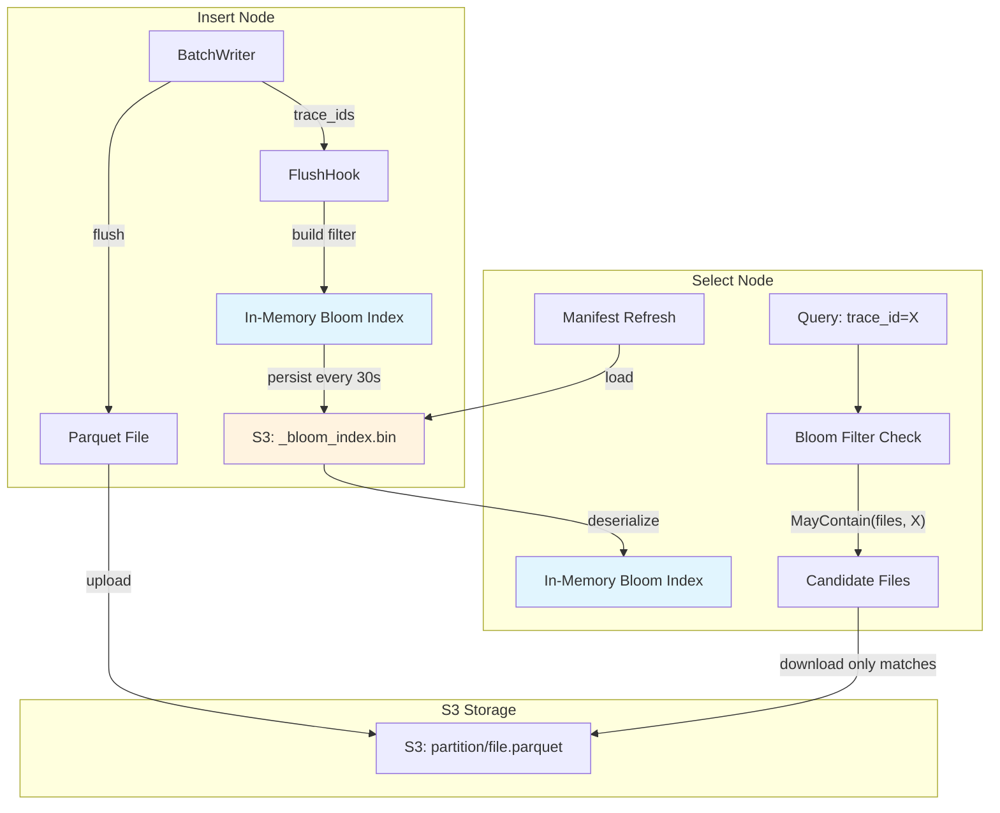
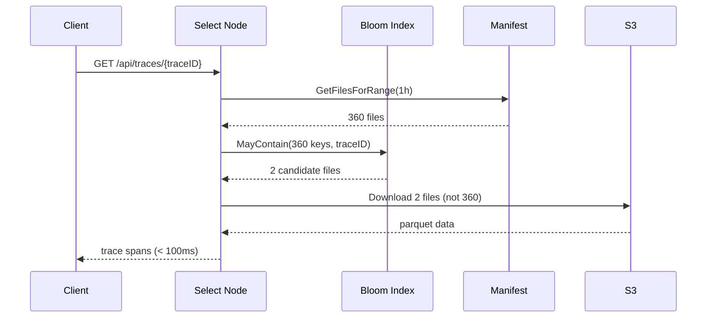

# Bloom Index — File-Level Trace Lookup Acceleration

## Problem

Trace lookup by `trace_id` requires scanning all parquet files in a time partition. With 10s flush intervals, a single hour can have 360+ files. Even with 64 parallel workers, downloading and parsing all files takes 2-3 seconds.

## Solution

A **file-level bloom index** that maps each S3 parquet key to a compact bloom filter containing the trace_ids in that file. Before downloading any parquet file, the query engine checks the bloom index to eliminate files that definitely don't contain the target trace.

## Architecture



## Data Flow



## File Format

Binary format for `_bloom_index.bin`:

```
[version: 1 byte = 0x01]
[entry_count: 4 bytes LE]
[entries...]

Each entry:
  [key_len: 2 bytes LE]
  [key: key_len bytes]  (S3 object key)
  [filter_len: 4 bytes LE]
  [filter_data: filter_len bytes]

Filter data:
  [num_hashes: 1 byte]
  [bits: remaining bytes]
```

## Size Estimates

| Files/hour | Traces/file | Bloom size/file | Index size/hour | Total (3 days) |
|-----------|-------------|-----------------|-----------------|----------------|
| 360       | 150         | ~180 bytes      | ~100 KB         | ~7 MB          |
| 60        | 900         | ~1.1 KB         | ~100 KB         | ~7 MB          |

## Deployment Modes

### Combined (insert + select)

Bloom index is built during flush and immediately available for queries. Persisted to S3 every 30s for crash recovery.

### Split (insert and select are separate pods)

- **Insert node**: Builds bloom index from flushed trace_ids, persists to S3
- **Select node**: Loads bloom index from S3 on manifest refresh (every 30s)
- Latency: max 30s for a newly flushed file to appear in select's bloom index

### Backfill (existing data)

On first startup, a background goroutine reads parquet file footers to extract bloom filter data for existing files. This is a one-time cost (~5 min for 2000 files).

## Configuration

```yaml
query:
  bloom_index_enabled: true  # default: true for traces mode
  bloom_index_backfill: true # scan existing files on startup
```

## Performance Impact

| Metric | Before | After |
|--------|--------|-------|
| Service search | 22s → 10ms | 10ms (label index) |
| Trace lookup (cold) | 2.6s | ~50-100ms |
| Trace lookup (warm) | 2.6s | ~50-100ms |
| Memory overhead | — | ~7 MB for 3 days |
| S3 overhead | — | 1 extra GET per refresh |

## Package

`internal/bloomindex/` — standalone package with no external dependencies.

- `Filter` — single bloom filter (add/check/marshal)
- `Index` — maps file keys to filters (MayContain/Marshal/Unmarshal)
- Double-hashing with FNV-64a for fast, allocation-free lookups
- 1% false positive rate at ~10 bits per item
