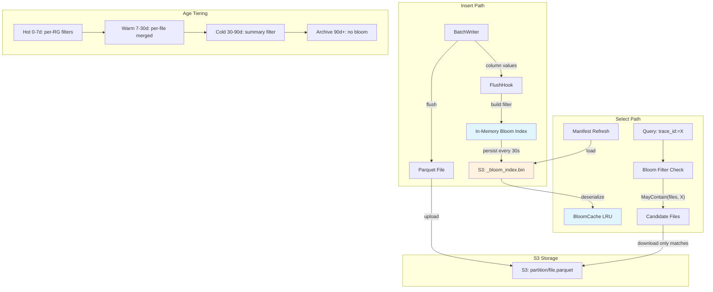
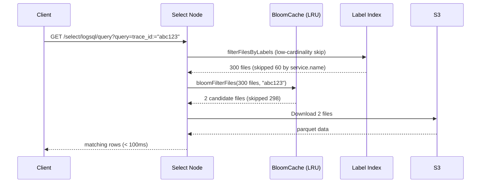

# Bloom Index — Query Acceleration for High-Cardinality Fields

## Problem

Trace lookup by `trace_id` requires scanning all parquet files in a time partition. With 10s flush intervals, a single hour can have 360+ files. Even with 64 parallel workers, downloading and parsing all files takes 2-3 seconds.

## Solution

A **multi-tier bloom index** that maps each S3 parquet key to a compact bloom filter containing indexed column values. Before downloading any parquet file, the query engine checks the bloom index to eliminate files that definitely don't contain the target value.

The bloom index supports multiple indexed columns (e.g., `trace_id`, `service.name`) and uses age-based tiering to balance memory usage with query acceleration across retention periods.

## Architecture



## Age-Based Tiering

Bloom filters consume memory proportional to the number of indexed files. Age-based tiering reduces memory for older data that is queried less frequently:

| Tier | Age | Granularity | Memory | Query Speed |
|------|-----|-------------|--------|-------------|
| Hot | 0-7 days | Per row group | Highest | Fastest |
| Warm | 7-30 days | Per file (merged) | Medium | Fast |
| Cold | 30-90 days | Summary per partition | Low | Moderate |
| Archive | 90+ days | No bloom | None | Full scan |

Tier boundaries are configurable and auto-tunable via the bloom controller.

### Tier Transitions

The `MetadataCompactor` handles automatic downgrade:
- **Hot → Warm**: `MergeFrom()` combines per-RG filters into a single per-file filter
- **Warm → Cold**: `DowngradeToSummary()` merges all per-file filters into one partition summary
- **Cold → Archive**: Bloom data evicted from cache entirely

## Data Flow



## Label Index vs Bloom Index

Lakehouse uses two complementary file-skip strategies:

| Strategy | Best For | Mechanism | Cardinality |
|----------|----------|-----------|-------------|
| **Label Index** | Low-cardinality fields | Exact value lists per file (max 100) | service.name, severity, k8s.namespace |
| **Bloom Index** | High-cardinality fields | Probabilistic bloom filters | trace_id, span_id |

High-cardinality fields (trace_id) are excluded from label extraction because they always exceed the 100-value cap, making the label list useless for filtering. Bloom filters handle these fields instead.

## Components

### `internal/bloomindex/`

| File | Purpose |
|------|---------|
| `bloomindex.go` | Core `Filter` and `Index` types — add/check/marshal with double-hashing FNV-64a |
| `tiering.go` | Age-tier model, tier config, transition functions (`DowngradeToPerFile`, `DowngradeToSummary`) |
| `partitioned.go` | `PartitionedIndex` — manages per-partition bloom indexes |
| `cache.go` | `BloomCache` — LRU cache with size-based eviction and Prometheus metrics |
| `controller.go` | `BloomController` — auto-tuning of FPR, tier boundaries based on query patterns |
| `config_sync.go` | `ConfigSync` — persists/loads bloom config from S3 for cross-node consistency |
| `metadata_compactor.go` | `MetadataCompactor` — handles tier transitions and filter merging |
| `api.go` | `/api/v1/bloom/status` HTTP handler |
| `cost.go` | Storage cost projection calculator |

### Storage Integration (`internal/storage/parquets3/`)

| File | Purpose |
|------|---------|
| `bloom_build.go` | `storageBloomObserver` — builds bloom filters on Parquet flush |
| `storage_query.go` | `bloomFilterFiles()` — query-time bloom acceleration |
| `storage_query.go` | `filterFilesByLabels()` — label-based file pre-filtering |

## File Format

Binary format for `_bloom_index.bin`:

```
[version: 1 byte = 0x01]
[entry_count: 4 bytes LE]
[entries...]

Each entry:
  [key_len: 2 bytes LE]
  [key: key_len bytes]  (S3 object key)
  [filter_len: 4 bytes LE]
  [filter_data: filter_len bytes]

Filter data:
  [num_hashes: 1 byte]
  [bits: remaining bytes]

Integrity:
  SHA256 checksum via MarshalWithChecksum / UnmarshalWithChecksum
```

## Size Estimates

| Files/hour | Traces/file | Bloom size/file | Index size/hour | Total (3 days) |
|-----------|-------------|-----------------|-----------------|----------------|
| 360       | 150         | ~180 bytes      | ~100 KB         | ~7 MB          |
| 60        | 900         | ~1.1 KB         | ~100 KB         | ~7 MB          |

With age tiering, the 30-90 day cold tier uses summary filters that are 10-50x smaller than hot per-RG filters.

## Prometheus Metrics

| Metric | Type | Description |
|--------|------|-------------|
| `lakehouse_bloom_build_total` | Counter | Bloom filters built (by trigger: flush/backfill) |
| `lakehouse_bloom_build_errors_total` | Counter | Bloom build/persist failures |
| `lakehouse_bloom_entries_total` | Counter | Total entries added to bloom filters |
| `lakehouse_bloom_queries_total` | Counter | Bloom queries attempted |
| `lakehouse_bloom_files_skipped_total` | Counter | Files skipped by bloom filter |
| `lakehouse_bloom_bytes_avoided_total` | Counter | S3 bytes avoided by bloom skip |
| `lakehouse_bloom_bytes_memory` | Gauge | Current bloom cache memory usage |
| `lakehouse_bloom_tier_partitions` | Gauge | Partitions per tier (hot/warm/cold/archive) |
| `lakehouse_bloom_tier_transitions_total` | Counter | Tier transitions (hot_to_warm, etc.) |
| `lakehouse_bloom_config_sync_total` | Counter | Config sync operations |
| `lakehouse_bloom_config_sync_errors_total` | Counter | Config sync failures |
| `lakehouse_bloom_controller_adjustments_total` | Counter | Auto-tuning parameter adjustments |

## API

### `GET /api/v1/bloom/status`

Returns bloom index health, cache stats, tier distribution, and configuration:

```json
{
  "enabled": true,
  "mode": "logs",
  "indexed_columns": ["service.name", "trace_id"],
  "cache": {
    "entries": 72,
    "size_bytes": 524288,
    "max_size_bytes": 104857600
  },
  "tiers": {
    "hot":     {"age_range": "0-7d",   "partitions": 42},
    "warm":    {"age_range": "7-30d",  "partitions": 23},
    "cold":    {"age_range": "30-90d", "partitions": 7},
    "archive": {"age_range": "90d+",   "partitions": 0}
  }
}
```

## Deployment Modes

### Combined (insert + select)

Bloom index is built during flush and immediately available for queries. Persisted to S3 every 30s for crash recovery.

### Split (insert and select are separate pods)

- **Insert node**: Builds bloom index from flushed column values, persists to S3
- **Select node**: Loads bloom index from S3 on manifest refresh (every 30s)
- Latency: max 30s for a newly flushed file to appear in select's bloom index

### Backfill (existing data)

On first startup, a background goroutine reads parquet file footers to extract bloom filter data for existing files. This is a one-time cost (~5 min for 2000 files).

## Configuration

```yaml
query:
  bloom_index_enabled: true   # default: true
  bloom_index_backfill: true  # scan existing files on startup

lakehouse:
  logs:
    bloom_columns: [service.name]
  traces:
    bloom_columns: [trace_id, service.name]
```

Tier boundaries can be customized:

```yaml
bloom:
  tier_hot_days: 7
  tier_warm_days: 30
  tier_cold_days: 90
  fpr: 0.01              # false positive rate (1%)
  cache_max_bytes: 100MB
```

## Performance Impact

| Metric | Before | After |
|--------|--------|-------|
| Trace lookup (cold cache) | 2.6s | ~50-100ms |
| Trace lookup (warm cache) | 2.6s | ~10-50ms |
| Service filter | 22s | ~10ms (label index) |
| Memory overhead | — | ~7 MB for 3 days |
| S3 overhead | — | 1 extra GET per refresh |
| False positive rate | — | ≤1% (configurable) |

## Test Coverage

- **44 unit tests** in `internal/bloomindex/`: property-based (1000 seeds, no false negatives), FPR bounds, merge correctness, fuzz, race detector, edge cases (corrupt data, SHA256 tamper)
- **Storage integration tests**: bloom build on flush, PREWHERE filtering, tier transitions, compaction
- **E2E tests**: trace_id lookup, service filter, multi-tenant isolation, round-trip insert→bloom lookup, performance bounds
