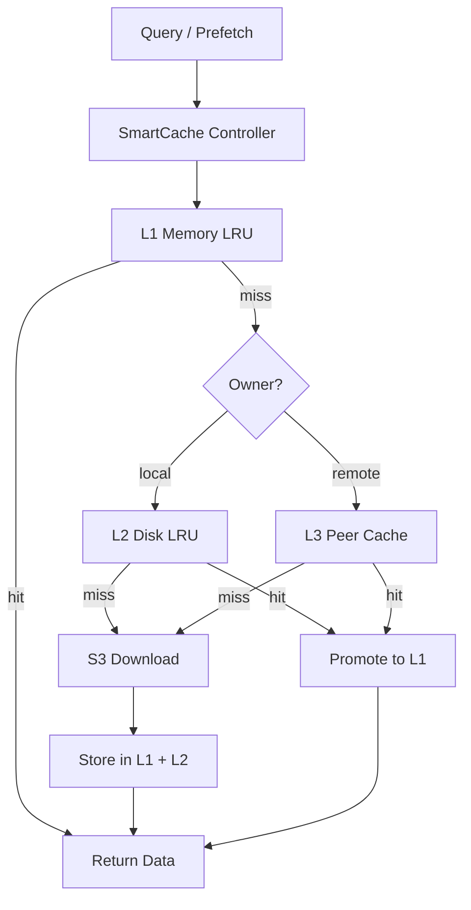
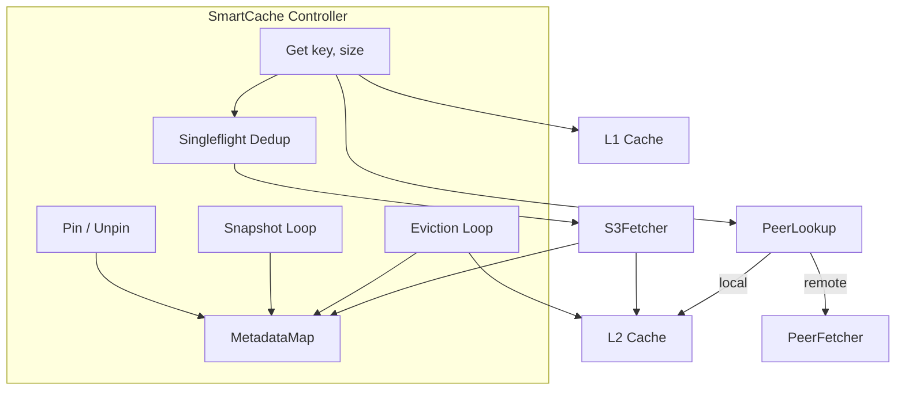
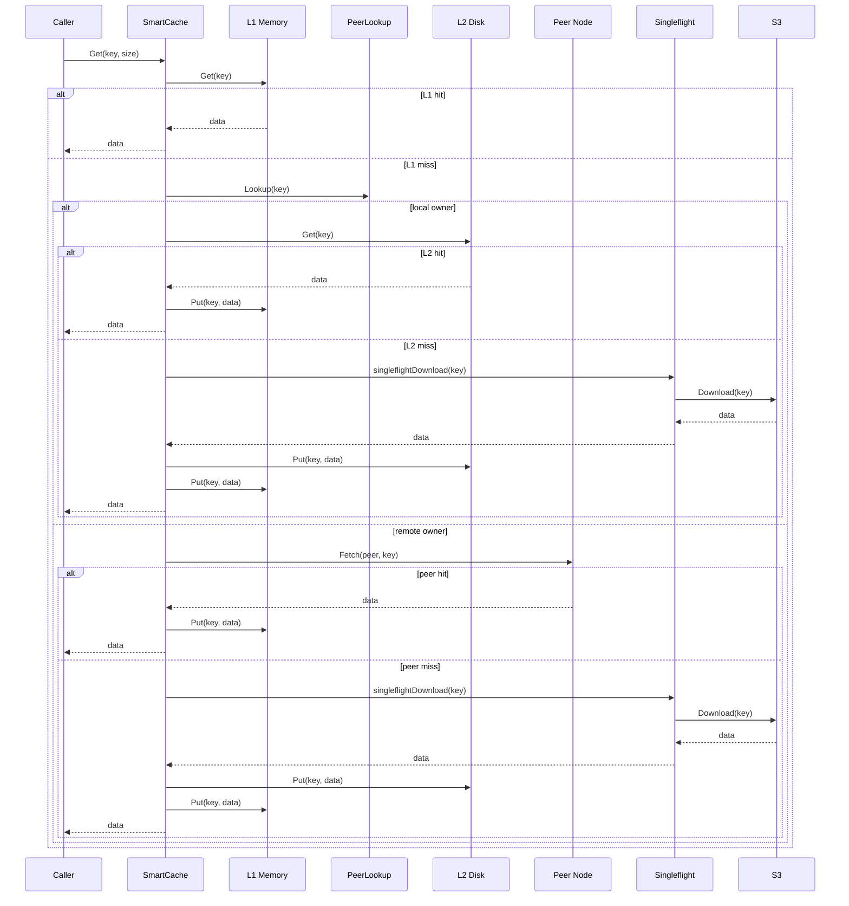
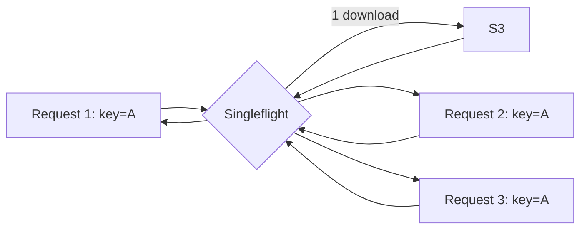
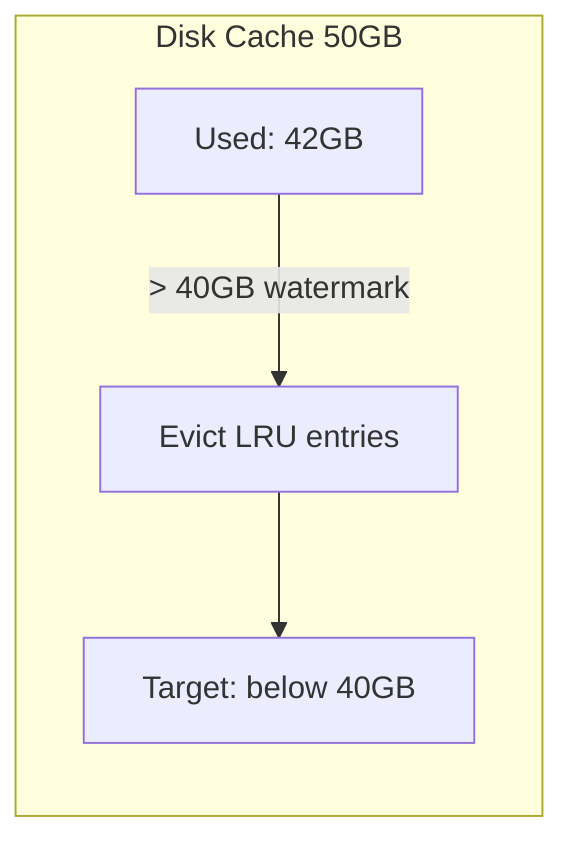
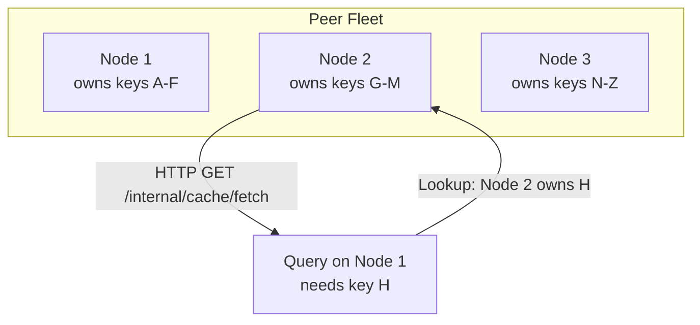
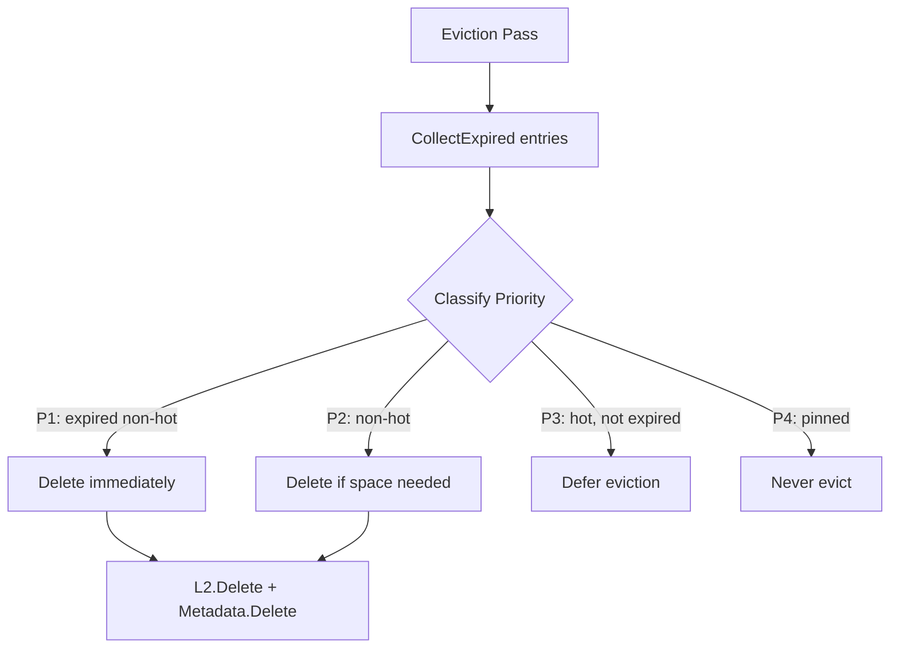
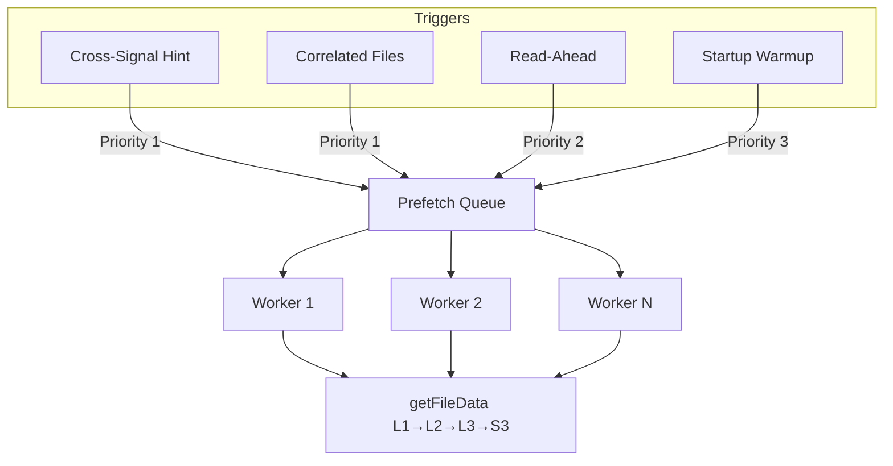
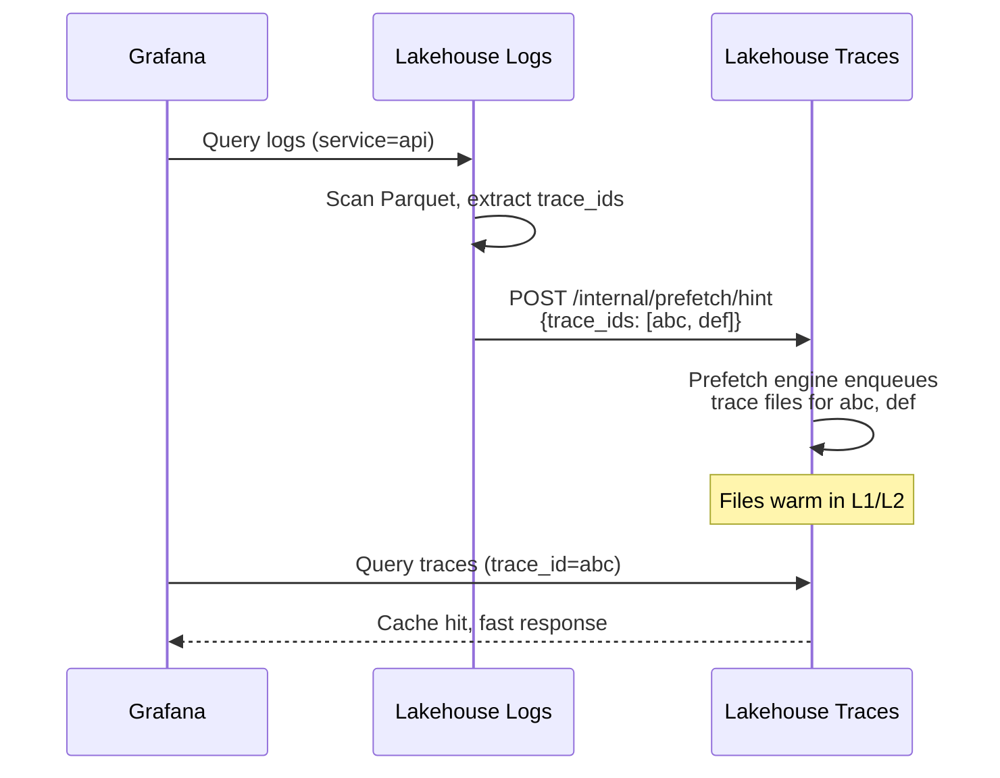
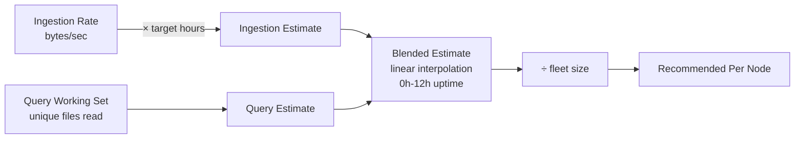

# Cache Architecture

Victoria Lakehouse uses a multi-tier cache to minimize S3 latency and cost. Every Parquet file read passes through a four-level hierarchy before hitting object storage.

## Cache Tiers Overview



| Tier | Medium | Latency | Capacity | Eviction |
|------|--------|---------|----------|----------|
| L1 | Memory | < 1 ms | 512 MB default | LRU by size |
| L2 | Disk (EBS/NVMe) | < 10 ms | 50 GB default | LRU with watermark |
| L3 | Peer HTTP | < 30 ms | Fleet aggregate | Consistent hash ring |
| L4 | S3 | 50-150 ms | Unlimited | N/A |

## SmartCache Controller

The SmartCache Controller (`internal/cache/smartcache/controller.go`) is the central orchestrator. It wraps all cache tiers, tracks per-entry metadata, handles singleflight dedup, and coordinates eviction.



### Get Flow

The `Controller.Get(ctx, key, size)` method executes the full cache chain:



### Singleflight Dedup

Concurrent requests for the same missing key are coalesced. Only the first caller downloads from S3; all others wait and share the result. This prevents thundering herd on cold cache.



## L1: Memory LRU

**File:** `internal/cache/lru.go`

In-memory LRU cache backed by a doubly-linked list. Entries are byte slices keyed by S3 object path. No TTL at this level — eviction is purely size-driven.

| Config | Default | Flag |
|--------|---------|------|
| `cache.memory_limit` | `512MB` | `--lakehouse.cache.memory-limit` |

### Eviction

When `curSize > maxSize`, the oldest entries (back of the LRU list) are removed until the cache fits within budget.

## L2: Disk LRU

**File:** `internal/cache/disk.go`

File-based LRU cache on local disk (EBS gp3 or NVMe). Each cached Parquet file is stored as a regular file with a sanitized key path.

| Config | Default | Flag |
|--------|---------|------|
| `cache.disk_path` | `/data/lakehouse/cache` | `--lakehouse.cache.disk-path` |
| `cache.disk_limit` | `50GB` | `--lakehouse.cache.disk-limit` |
| `cache.eviction_watermark` | `0.8` | `--lakehouse.cache.eviction-watermark` |

### Watermark Eviction

Eviction triggers when `curSize > maxSize * watermark`. With defaults (50 GB, 0.8 watermark), eviction starts at 40 GB. This prevents the cache from constantly churning at the boundary.



### Atomic Writes

Files are written to a `.tmp` file first, then renamed — no partial reads possible.

## L3: Peer Cache

**Files:** `internal/peercache/`

Distributed cache across lakehouse fleet nodes. Uses consistent hashing to assign key ownership, so each file has a single "home" node that stores it on L2 disk.



### Consistent Hash Ring

**File:** `internal/peercache/ring.go`

- Hash function: CRC32 (IEEE) on `peer + vnode_bytes`
- Virtual nodes: 150 per peer (configurable)
- Lookup: binary search on sorted hash keys, wraps to start

### Protocol

| Endpoint | Method | Purpose |
|----------|--------|---------|
| `/internal/cache/fetch?key=K` | GET | Download cached data from peer |
| `/internal/cache/has?key=K` | HEAD | Probe if peer has key |

Both endpoints require `Authorization: Bearer {authKey}` header.

### Discovery

Peers are discovered via Kubernetes headless service DNS. The `DiscoveryConfig.PeerHeadlessService` resolves to pod IPs. Peer list refreshes every `PeerRefreshInterval` (default 30s).

| Config | Default | Flag |
|--------|---------|------|
| `peer.auth_key` | (none) | `--lakehouse.peer.auth-key` |
| `peer.timeout` | `5s` | `--lakehouse.peer.timeout` |
| `peer.max_connections` | `32` | `--lakehouse.peer.max-connections` |
| `discovery.peer_headless_service` | (none) | `--lakehouse.discovery.peer-headless-service` |
| `discovery.peer_refresh_interval` | `30s` | `--lakehouse.discovery.peer-refresh-interval` |

## Entry Metadata & Hot Tracking

**File:** `internal/cache/smartcache/metadata.go`

Every cached entry has associated metadata tracked in `MetadataMap`:

```
EntryMeta {
    CreatedAt         time.Time             // When cached
    LastAccess        time.Time             // Most recent read
    AccessCount       int                   // Reads in current window
    AccessWindowStart time.Time             // Window start
    PinnedBy          map[string]time.Time  // queryID → pin expiry
    Signal            string                // "logs" or "traces"
    TraceIDs          []string              // Cross-signal correlation
    Size              int64                 // Entry size in bytes
}
```

### Hot Detection

An entry is "hot" when `AccessCount >= HotAccessThreshold` within `HotWindow`:

| Config | Default | Flag |
|--------|---------|------|
| `smart_cache.hot_access_threshold` | `3` | `--lakehouse.smart-cache.hot-access-threshold` |
| `smart_cache.hot_window` | `10m` | `--lakehouse.smart-cache.hot-window` |

Hot entries survive eviction longer than cold entries.

### Query Pinning

Active queries pin all their manifest files via `SmartCache.Pin(key, queryID)`. Pinned entries are never evicted, even under memory pressure. Pins expire after `QueryGracePeriod` (default 5 min) to cover follow-up queries.

## Eviction Strategy

**File:** `internal/cache/smartcache/eviction.go`

The eviction loop runs periodically and classifies entries by priority:



**TTL-based** (`CollectExpired`):
- Non-hot entries: evicted when `now - CreatedAt > MaxAge`
- Hot entries: evicted when `now - LastAccess > MaxAge`
- Pinned entries: never evicted

**LRU-based** (`CollectLRU`): When disk space is needed, entries are sorted by priority tier, then by `LastAccess` within each tier. Non-hot entries are evicted first.

| Config | Default | Flag |
|--------|---------|------|
| `smart_cache.max_age` | `24h` | `--lakehouse.smart-cache.max-age` |
| `smart_cache.query_grace_period` | `5m` | `--lakehouse.smart-cache.query-grace-period` |

### Metadata Persistence

Metadata snapshots are saved periodically to disk (JSON) and restored on startup. This preserves hot/cold classification across restarts.

| Config | Default | Flag |
|--------|---------|------|
| `smart_cache.snapshot_interval` | `60s` | `--lakehouse.smart-cache.snapshot-interval` |

## Prefetch Engine

**File:** `internal/prefetch/prefetch.go`

The prefetch engine proactively warms the cache for data likely to be queried soon.



### Task Types & Priority

| Type | Priority | Trigger |
|------|----------|---------|
| CrossSignal | 1 (highest) | Trace ID seen in logs → prefetch matching traces |
| Correlated | 1 | Related files in same partition |
| ReadAhead | 2 | Sequential partition scan |
| Warmup | 3 (lowest) | Startup warm-up of recent partitions |

### Queue Management

- Tasks deduplicated by key
- When queue is full (`MaxQueue`), oldest tasks are evicted
- Workers dequeue highest-priority (lowest number) first
- Usefulness tracked: `MarkUseful(key)` records if prefetched data was actually queried

| Config | Default | Flag |
|--------|---------|------|
| `prefetch.correlated` | `true` | `--lakehouse.prefetch.correlated` |
| `prefetch.read_ahead_depth` | `2` | `--lakehouse.prefetch.read-ahead-depth` |
| `prefetch.max_concurrent` | `8` | `--lakehouse.prefetch.max-concurrent` |
| `prefetch.max_queue` | `128` | `--lakehouse.prefetch.max-queue` |

## Cross-Signal Prefetch

Cross-signal prefetch bridges separate lakehouse-logs and lakehouse-traces deployments. When a trace ID appears in a log query, the logs instance hints the traces instance to warm that trace's data (and vice versa).



### Deprioritization

When a cross-signal hint has been served, the hinted entries can be deprioritized via `DeprioritizeByTraceIDs()`. This resets access counts so the entries don't artificially appear "hot" from prefetch alone.

## Sizing Calculator

**File:** `internal/cache/smartcache/sizing.go`

Estimates optimal cache size for covering a target query window (default 24 hours).



- **Early in uptime** (0-12h): weighted toward ingestion estimate (no query history yet)
- **After 12h**: weighted toward actual query working set
- Divided by fleet size for per-node recommendation

| Config | Default | Flag |
|--------|---------|------|
| `smart_cache.target_hours` | `24` | `--lakehouse.smart-cache.target-hours` |
| `smart_cache.disk_limit_max` | `100GB` | `--lakehouse.smart-cache.disk-limit-max` |
| `smart_cache.ingestion_rate_hint` | (none) | `--lakehouse.smart-cache.ingestion-rate-hint` |

## Integration in Storage

**File:** `internal/storage/parquets3/storage.go`

The `getFileData` method is the single point where all cache tiers are accessed. When a SmartCache controller is configured, it delegates entirely:

```go
if s.smartCache != nil {
    return s.smartCache.Get(ctx, key, size)
}
```

Adapter types bridge the concrete cache implementations to the SmartCache interfaces:

| Adapter | Wraps | Interface |
|---------|-------|-----------|
| `l1Adapter` | `cache.LRU` | `L1Cache` |
| `l2Adapter` | `cache.DiskCache` | `L2Cache` |
| `peerLookupAdapter` | `peercache.PeerCache` | `PeerLookup` |
| `peerFetchAdapter` | `peercache.PeerCache` | `PeerFetcher` |
| `s3Adapter` | `s3reader.ClientPool` | `S3Fetcher` |
| `localOnlyLookup` | (none) | `PeerLookup` (single-node) |

When running in insert-only mode (no SmartCache), `getFileData` falls back to a simpler L1 → L2 → L3 → S3 chain directly.

## Metrics

| Metric | Type | Description |
|--------|------|-------------|
| `lakehouse_cache_hits_total{tier}` | Counter | Hits per tier (L1, L2, L3) |
| `lakehouse_cache_misses_total{tier}` | Counter | Misses per tier |
| `lakehouse_cache_singleflight_dedup` | Counter | Coalesced S3 requests |
| `lakehouse_peer_hits_total` | Counter | Peer cache fetch hits |
| `lakehouse_peer_bytes_transferred{dir}` | Counter | Peer data transferred (rx/tx) |
| `lakehouse_s3_requests_total{op}` | Counter | S3 operations (GET, PUT, LIST) |
| `lakehouse_s3_request_duration_seconds` | Histogram | S3 request latency |
| `lakehouse_s3_bytes_read_total` | Counter | Bytes read from S3 |
