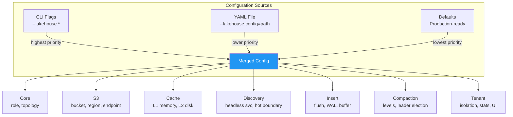

# Configuration

Victoria Lakehouse uses a `--lakehouse.*` flag prefix for all settings. Flags can also be set via YAML config file (`--lakehouse.config=path`). CLI flags override YAML values.

All flags have production-ready defaults. A minimal config requires only `--lakehouse.s3.bucket`. Mode is determined by which binary you run (`lakehouse-logs` or `lakehouse-traces`).



## Core Settings

| Flag | Default | Description |
|---|---|---|
| `--lakehouse.config` | `""` | Path to YAML config file |
| `--lakehouse.role` | `all` | `all`, `insert`, `select` — component role |
| `--lakehouse.topology` | `auto` | `auto`, `storage-node`, `direct`, `loki-proxy` |

## S3 Settings

| Flag | Default | Description |
|---|---|---|
| `--lakehouse.s3.bucket` | **(required)** | S3 bucket name |
| `--lakehouse.s3.region` | `us-east-1` | AWS region |
| `--lakehouse.s3.prefix` | `""` | Key prefix (auto-set from mode: `logs/` or `traces/`) |
| `--lakehouse.s3.endpoint` | `""` | Custom S3 endpoint (MinIO, R2) |
| `--lakehouse.s3.access-key` | `""` | Static access key (prefer IAM role/IRSA) |
| `--lakehouse.s3.secret-key` | `""` | Static secret key (prefer IAM role/IRSA) |
| `--lakehouse.s3.force-path-style` | `false` | Use path-style S3 URLs (required for MinIO) |
| `--lakehouse.s3.max-connections` | `128` | Max concurrent S3 HTTP connections |
| `--lakehouse.s3.timeout` | `30s` | Per-request S3 timeout |
| `--lakehouse.s3.retry-max` | `3` | Max retries on S3 transient errors |
| `--lakehouse.s3.retry-base-delay` | `200ms` | Initial retry backoff (doubles each retry) |

## Cache Settings

| Flag | Default | Description |
|---|---|---|
| `--lakehouse.cache.memory-limit` | `512MB` | L1 in-memory cache max size |
| `--lakehouse.cache.disk-path` | `/data/lakehouse/cache` | L2 disk cache directory |
| `--lakehouse.cache.disk-limit` | `50GB` | L2 disk cache max size |
| `--lakehouse.cache.eviction-watermark` | `0.8` | Start evicting at 80% of disk limit |
| `--lakehouse.cache.footer-ttl` | `1h` | L1 footer cache TTL |
| `--lakehouse.cache.bloom-ttl` | `1h` | L1 bloom filter cache TTL |
| `--lakehouse.cache.page-ttl` | `10m` | L1 hot page cache TTL |

## Discovery Settings

| Flag | Default | Description |
|---|---|---|
| `--lakehouse.discovery.headless-service` | `""` | K8s headless service for vlstorage/vtstorage |
| `--lakehouse.discovery.storage-nodes` | `""` | Comma-separated static storage node addresses |
| `--lakehouse.discovery.partition-auth-key` | `""` | Auth key for `/internal/partition/list` |
| `--lakehouse.discovery.refresh-interval` | `5m` | How often to poll storage nodes |
| `--lakehouse.discovery.timeout` | `10s` | Timeout per storage node poll |
| `--lakehouse.discovery.peer-headless-service` | `""` | K8s headless service for peer cache fleet |
| `--lakehouse.discovery.peer-refresh-interval` | `30s` | Peer DNS refresh interval |

## Hot Boundary

| Flag | Default | Description |
|---|---|---|
| `--lakehouse.hot-boundary` | `""` (auto-discover) | Manual hot boundary override (e.g., `7d`, `168h`) |

When empty, Victoria Lakehouse auto-discovers the hot boundary by polling vlstorage/vtstorage nodes. Set this to skip auto-discovery.

## Insert Settings

| Flag | Default | Description |
|---|---|---|
| `--lakehouse.insert.flush-interval` | `10s` | Periodic flush interval (1s-60s) |
| `--lakehouse.insert.max-buffer-rows` | `50000` | Per-partition buffer row limit |
| `--lakehouse.insert.max-buffer-bytes` | `256MB` | Total buffer memory limit |
| `--lakehouse.insert.row-group-size` | `10000` | Rows per Parquet row group |
| `--lakehouse.insert.target-file-size` | `128MB` | Target Parquet file size (adaptive flush trigger) |
| `--lakehouse.insert.bloom-columns` | `service.name,trace_id` | Columns with bloom filters |
| `--lakehouse.insert.compression-level` | `default` | ZSTD level: `fastest`, `default`, `better`, `best` |

## WAL Settings

| Flag | Default | Description |
|---|---|---|
| `--lakehouse.insert.wal-enabled` | `true` | Enable write-ahead log for crash recovery |
| `--lakehouse.insert.wal-dir` | `/data/lakehouse/wal` | WAL file directory |
| `--lakehouse.insert.wal-max-bytes` | `512MB` | Maximum WAL file size |

## Select Settings

| Flag | Default | Description |
|---|---|---|
| `--lakehouse.select.buffer-query-enabled` | `true` | Query insert pods for unflushed data |
| `--lakehouse.select.insert-headless-service` | `""` | K8s headless service for insert pod discovery |
| `--lakehouse.select.buffer-query-timeout` | `2s` | Timeout for buffer query fan-out |

## Schema Extensibility

| Flag | Default | Description |
|---|---|---|
| `--lakehouse.schema.extra-promoted` | `""` | YAML list of user-defined promoted Parquet columns |

Example YAML:
```yaml
lakehouse:
  schema:
    extra_promoted:
      - name: "http.status_code"
        type: "int32"
        bloom: true
      - name: "customer_id"
        type: "string"
        bloom: true
```

## Manifest Settings

| Flag | Default | Description |
|---|---|---|
| `--lakehouse.manifest.refresh-interval` | `5m` | S3 ListObjects polling interval |
| `--lakehouse.manifest.sqs-queue-url` | `""` | Optional SQS queue for S3 event notifications |
| `--lakehouse.manifest.sqs-region` | (from `s3.region`) | SQS queue region |
| `--lakehouse.manifest.sqs-wait-time` | `20s` | SQS long-poll wait time |
| `--lakehouse.manifest.persist-path` | `/data/lakehouse` | Directory for persisted manifest + index |
| `--lakehouse.manifest.persist-interval` | `5m` | How often to write manifest to disk |

## Prefetch Settings

| Flag | Default | Description |
|---|---|---|
| `--lakehouse.prefetch.correlated` | `true` | Enable cross-signal prefetch (logs/traces) |
| `--lakehouse.prefetch.read-ahead-depth` | `2` | Partitions to prefetch for sequential scans |
| `--lakehouse.prefetch.max-concurrent` | `4` | Max concurrent prefetch downloads |
| `--lakehouse.prefetch.max-queue` | `64` | Max pending prefetch tasks |

## Smart Cache Settings

| Flag | Default | Description |
|---|---|---|
| `--lakehouse.smart-cache.max-age` | `24h` | Maximum TTL for cached entries |
| `--lakehouse.smart-cache.snapshot-interval` | `60s` | How often to persist cache metadata to disk |
| `--lakehouse.smart-cache.query-grace-period` | `5m` | Keep pinned entries after query completes |
| `--lakehouse.smart-cache.hot-access-threshold` | `3` | Accesses within hot window to mark entry as "hot" |
| `--lakehouse.smart-cache.hot-window` | `10m` | Window for counting hot accesses |
| `--lakehouse.smart-cache.target-hours` | `24` | Target hours of query coverage for cache sizing |
| `--lakehouse.smart-cache.disk-limit-max` | `100GB` | Hard cap on disk cache size |
| `--lakehouse.smart-cache.ingestion-rate-hint` | `""` | Optional hint for ingestion rate (e.g., `500MB`) to bootstrap cache sizing |

## Cross-Signal Settings

| Flag | Default | Description |
|---|---|---|
| `--lakehouse.cross-signal.enabled` | `false` | Enable cross-signal prefetch hints |
| `--lakehouse.cross-signal.endpoint` | `""` | URL of the other signal's lakehouse (e.g., `http://lakehouse-traces:10428`) |
| `--lakehouse.cross-signal.headless-service` | `""` | Headless service for peer discovery (alternative to endpoint) |
| `--lakehouse.cross-signal.auth-key` | `""` | Shared secret for cross-signal HTTP |
| `--lakehouse.cross-signal.timeout` | `2s` | Timeout for cross-signal HTTP requests |
| `--lakehouse.cross-signal.max-batch` | `100` | Max trace IDs per hint batch |
| `--lakehouse.cross-signal.batch-interval` | `500ms` | Flush interval for hint batching |

## Peer Cache Settings

| Flag | Default | Description |
|---|---|---|
| `--lakehouse.peer-auth-key` | `""` | Shared secret for peer cache HTTP |
| `--lakehouse.peer.timeout` | `5s` | Timeout for peer cache requests |
| `--lakehouse.peer.max-connections` | `32` | Max HTTP connections per peer |

## Startup Settings

| Flag | Default | Description |
|---|---|---|
| `--lakehouse.startup.serve-stale` | `false` | Serve from disk cache before S3 refresh |
| `--lakehouse.startup.warmup-window` | `24h` | Pre-cache footers/blooms for recent data |
| `--lakehouse.startup.max-warmup-time` | `5m` | Abort warmup safety valve |

## Query Settings

| Flag | Default | Description |
|---|---|---|
| `--lakehouse.query.max-concurrent` | `32` | Max concurrent queries |
| `--lakehouse.query.timeout` | `60s` | Per-query timeout |
| `--lakehouse.query.max-rows` | `10000000` | Max rows scanned per query (safety limit) |
| `--lakehouse.query.slow-threshold` | `5s` | Queries slower than this are logged |
| `--lakehouse.query.file-workers` | `8` | Concurrent Parquet files processed per query |

## Circuit Breaker Settings

| Flag | Default | Description |
|---|---|---|
| `--lakehouse.circuit-breaker.threshold` | `5` | Consecutive S3 failures to open breaker |
| `--lakehouse.circuit-breaker.timeout` | `30s` | Time in open state before half-open probe |
| `--lakehouse.circuit-breaker.success-threshold` | `2` | Successful probes to close breaker |

## Tenant Settings

| Flag | Default | Description |
|---|---|---|
| `--lakehouse.tenant.default-prefix` | `""` | S3 prefix for default (no tenant) queries |
| `--lakehouse.tenant.prefix-template` | `{AccountID}/{ProjectID}/` | S3 prefix template per tenant |

## Compaction Settings

| Flag | Default | Description |
|---|---|---|
| `--lakehouse.compaction.enabled` | `false` | Enable background Parquet compaction |
| `--lakehouse.compaction.interval` | `5m` | How often the scheduler scans for eligible partitions |
| `--lakehouse.compaction.max-concurrent` | `1` | Max partitions compacted per scan |
| `--lakehouse.compaction.min-files-l0` | `10` | L0→L1 compaction threshold (number of L0 files per partition) |
| `--lakehouse.compaction.min-files-l1` | `10` | L1→L2 compaction threshold (number of L1 files per partition) |
| `--lakehouse.compaction.min-age` | `1h` | Minimum partition age before it is eligible for compaction |
| `--lakehouse.compaction.leader-election` | `auto` | Election mode: `auto`, `k8s`, `s3`, `none` |
| `--lakehouse.compaction.lease-duration` | `15s` | K8s Lease duration (k8s election mode) |
| `--lakehouse.compaction.s3-lock-ttl` | `60s` | S3 lock TTL before another instance may steal it (s3 election mode) |
| `--lakehouse.compaction.s3-heartbeat` | `15s` | S3 lock heartbeat interval (s3 election mode) |

Compaction is disabled by default. Enable it for production deployments with more than a few hours of data. See [Operations — Compaction](operations.md#compaction) for guidance.

**Leader election modes:**

| Mode | Behavior |
|---|---|
| `auto` | Uses K8s Lease when `KUBERNETES_SERVICE_HOST` is set, else S3 lock, else none |
| `k8s` | Kubernetes `coordination.k8s.io/v1` Lease — requires RBAC (provided by Helm chart) |
| `s3` | S3 lock file with HTTP liveness detection before stealing an expired lock |
| `none` | No coordination — every instance is always the leader (single-instance only) |

## Inherited VL/VT Flags

| Flag | Default | Description |
|---|---|---|
| `--httpListenAddr` | `:9428` / `:10428` (auto) | HTTP listen address |
| `--loggerLevel` | `INFO` | Log level (DEBUG, INFO, WARN, ERROR) |

## Timeout Summary

| Operation | Timeout | Retry | Notes |
|---|---|---|---|
| S3 single request | 30s | 3x exponential (200ms base) | Range read, HEAD, ListObjects |
| Query execution | 60s | No retry | Client gets 504 if exceeded |
| Storage node discovery poll | 10s | Next refresh cycle (5m) | Background |
| Peer cache request | 5s | Falls back to S3 | Must be < query timeout |
| SQS long poll | 20s | Immediate re-poll | AWS max |
| Circuit breaker open | 30s | Half-open probe after timeout | 2 successes to close |
| Startup max warmup | 5m | Goes ready with partial state | Background continues |
| Graceful shutdown drain | 30s | Force exit after 60s | In-flight queries drain |

## YAML Config Example

```yaml
lakehouse:
  mode: logs
  role: all
  topology: auto

  s3:
    bucket: obs-archive
    region: us-east-1
    prefix: ""
    max_connections: 128
    timeout: 30s
    retry_max: 3
    retry_base_delay: 200ms

  insert:
    flush_interval: 10s
    max_buffer_rows: 50000
    max_buffer_bytes: 256MB
    row_group_size: 10000
    target_file_size: 128MB
    bloom_columns: "service.name,trace_id"
    compression_level: default
    wal_enabled: true
    wal_dir: /data/lakehouse/wal
    wal_max_bytes: 512MB

  select:
    buffer_query_enabled: true
    insert_headless_service: lakehouse-insert.monitoring.svc.cluster.local
    buffer_query_timeout: 2s

  cache:
    memory_limit: 512MB
    disk_path: /data/lakehouse/cache
    disk_limit: 50GB
    eviction_watermark: 0.8

  discovery:
    headless_service: vlstorage.monitoring.svc.cluster.local
    partition_auth_key: "${PARTITION_AUTH_KEY}"
    refresh_interval: 5m
    peer_headless_service: lakehouse-logs.monitoring.svc.cluster.local

  manifest:
    refresh_interval: 5m
    persist_path: /data/lakehouse

  prefetch:
    correlated: true
    read_ahead_depth: 2

  startup:
    serve_stale: false
    warmup_window: 24h
    max_warmup_time: 5m

  query:
    max_concurrent: 32
    timeout: 60s
    slow_threshold: 5s

  stats:
    enabled: true
    push_interval: 30s
    push_compression: true
    snapshot_interval: 5m
    metrics_cardinality_limit: 100
    cardinality_warning_threshold: 10000
    s3_lifecycle_rules:
      - transition_days: 30
        storage_class: STANDARD_IA
      - transition_days: 90
        storage_class: GLACIER
    s3_price_per_gb:
      STANDARD: 0.023
      STANDARD_IA: 0.0125
      GLACIER: 0.0036
      DEEP_ARCHIVE: 0.00099

  ui:
    enabled: true
    vmui_tab: true
    refresh_default: 0
    theme: auto

  tenant:
    prefix_template: "{AccountID}/{ProjectID}/"
    isolation: prefix
    # For bucket isolation mode:
    # isolation: bucket
    # bucket_template: "obs-{AccountID}-{ProjectID}"
    # known_tenants:
    #   - account_id: "100"
    #     project_id: "1"
```
