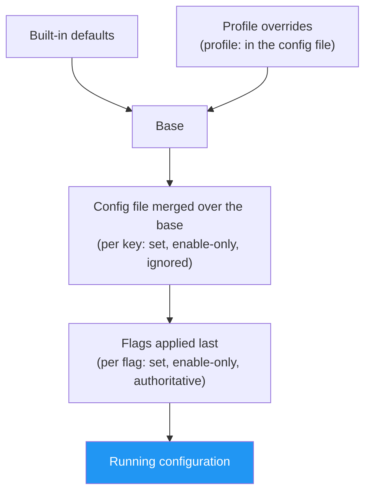

# Configuration

Victoria Lakehouse ships two binaries, `lakehouse-logs` and `lakehouse-traces`. Both
read the same settings from three places: the built-in defaults with an optional
**profile** on top, an optional YAML **config file** (`--lakehouse.config=path`, keys
under a `lakehouse:` root) and **flags** (`-lakehouse.*`). The only required setting is
the bucket: `-lakehouse.s3.bucket=obs-archive`.

The code is the single source of truth for every default on this page. Each binary
prints its whole configuration surface — every key with its default and how a
config-file value is merged, every profile as the keys it overrides, every flag with the
key it sets — as JSON:

```bash
lakehouse-logs print-default-config
lakehouse-traces print-default-config
```

The generated tables below, the Helm chart values and the defaults quoted elsewhere in
these docs are generated from that output or checked against it in CI (see
[Configuration drift gate](#configuration-drift-gate)).

## How a setting is resolved

A binary builds its configuration in three steps:

1. **Base.** The built-in defaults with the selected profile's overrides applied. The
   profile is read from the config file: `<signal>.insert.profile` or
   `<signal>.select.profile` for the pod's role, then `<signal>.profile`, then
   `profile`, then `balanced`.
2. **Config file.** Each key in the file is merged over the base as the **Config file**
   column of the [reference](#configuration-reference) says. Most keys take any
   non-zero, non-empty value — `0`, `""` and `[]` leave the base value in place.
   `enable-only` booleans can turn a setting on but not off, and `ignored` keys are
   dropped.
3. **Flags.** Each flag is applied as the **Effect** column of the [flag table](#flags)
   says. Most flags override only when set to a non-zero value; `enable-only` flags can
   only turn a setting on; `-lakehouse.pmeta.enabled` always wins, its default included.


```mermaid
graph TD
    D["Built-in defaults"] --> B["Base"]
    P["Profile overrides<br/>(profile: in the config file)"] --> B
    B --> F["Config file merged over the base<br/>(per key: set, enable-only, ignored)"]
    F --> L["Flags applied last<br/>(per flag: set, enable-only, authoritative)"]
    L --> R["Running configuration"]

    style R fill:#2196F3,color:#fff
```

### Known limitations of this release

These follow from the rules above; the generated tables mark every affected key.

- **A config file cannot turn off an `enable-only` key the profile enables.**
  `compaction.enabled: false` under the `balanced` profile leaves compaction on. Select a
  profile that disables the setting instead (see
  [Compaction on or off](#compaction-on-or-off)).
- **Some keys are ignored in the config file** — the `ignored` rows of the
  [reference](#configuration-reference), among them `query.max_files_per_query`,
  `cache.warmup_max_files`, `startup.min_manifest_files`, `pmeta.*` and
  `<signal>.promoted_attributes`. Set the ones that have a flag with the flag.
- **`-lakehouse.profile` is applied under the already-loaded configuration**, so only
  keys still at zero take the profile's value. [Profile flag gaps](#profile-flag-gaps)
  lists the keys each profile does not apply that way. Put `profile:` in the config file
  instead.
- **Keys marked "Not read." are accepted and validated, but no binary reads them**, so
  setting them has no effect. Among them are `insert.ack_mode` (so `flush-sync` does not
  delay acknowledgements), `insert.flush_linger`, `s3.retry_max` and
  `s3.retry_base_delay`.

## Configuration profiles

A profile is a named set of overrides on top of the built-in defaults. Select one in the
config file:

```yaml
lakehouse:
  profile: max-durability
  s3:
    bucket: obs-archive
```

or per signal and per role (the more specific setting wins):

```yaml
lakehouse:
  logs:
    profile: max-durability
    select:
      profile: max-performance
  traces:
    profile: max-cost-savings
```

In the Helm chart the same levels are `lakehouseConfig.profile`, `<signal>.profile` and
`<signal>.<role>.profile`. The chart writes `lakehouseConfig.profile` into the config file
together with the explicit values from `values.yaml`, and every non-zero value the chart
sets wins over the profile. `<signal>.profile` and the per-role profiles reach the pods
only as `-lakehouse.profile`, so the [profile flag gaps](#profile-flag-gaps) apply to them.

Headline settings of each profile:

<!-- BEGIN GENERATED: config-profile-summary -->
<!-- Generated by `make config-docs` from the code; do not edit. -->

| Profile | Ack mode (not read) | Flush interval | zstd level | Cache memory | Cache disk | Compaction | GC | Retention | Stats | Cross-signal |
|---|---|---|---|---|---|---|---|---|---|---|
| `balanced` | buffer | 1m | 3 | 512MB | 50GB | on | on | off | on | off |
| `max-performance` | buffer | 5s | 3 | 2GB | 100GB | on | on | off | on | on |
| `max-durability` | flush-sync | 1m | 7 | 512MB | 50GB | on | on | on | on | off |
| `max-cost-savings` | buffer | 30s | 11 | 128MB | 10GB | off | off | on | off | off |
| `dev` | buffer | 1s | 1 | 64MB | 1GB | off | off | off | off | off |

<!-- END GENERATED: config-profile-summary -->

Every override, profile by profile:

<!-- BEGIN GENERATED: config-profiles -->
<!-- Generated by `make config-docs` from the code; do not edit. -->

`balanced` is the built-in defaults and overrides nothing. Every other profile is exactly the set of keys below; an empty cell means the profile keeps the default.

| Key | Default | `max-performance` | `max-durability` | `max-cost-savings` | `dev` |
|---|---|---|---|---|---|
| `cache.bloom_ttl` (not read) | `1h` | `4h` |  | `30m` | `1m` |
| `cache.disk_limit` | `50GB` | `100GB` |  | `10GB` | `1GB` |
| `cache.footer_ttl` (not read) | `1h` | `4h` |  | `30m` | `1m` |
| `cache.memory_limit` | `512MB` | `2GB` |  | `128MB` | `64MB` |
| `cache.page_ttl` (not read) | `10m` | `1h` |  | `5m` | `1m` |
| `compaction.enabled` | `true` |  |  | `false` | `false` |
| `compaction.interval` | `5m` | `2m` |  |  |  |
| `compaction.max_concurrent` | `1` | `2` |  |  |  |
| `compaction.min_files_l0` | `10` | `5` |  |  |  |
| `cross_signal.enabled` | `false` | `true` |  |  |  |
| `delete.default_mode` | `auto` |  | `permanent` | `hide` |  |
| `delete.rewrite_batch_size` (not read) | `50` | `100` |  | `25` | `5` |
| `delete.rewrite_delay` | `1h` | `30m` |  | `6h` | `10s` |
| `delete.verify_interval` | `6h` |  | `1h` | `24h` |  |
| `discovery.peer_refresh_interval` | `30s` | `10s` |  | `1m` |  |
| `gc.enabled` | `true` |  |  | `false` | `false` |
| `gc.interval` | `6h` | `3h` | `1h` |  |  |
| `insert.ack_mode` (not read) | `buffer` |  | `flush-sync` |  |  |
| `insert.compression_level` | `3` |  | `7` | `11` | `1` |
| `insert.flush_interval` | `1m` | `5s` |  | `30s` | `1s` |
| `insert.flush_linger` (not read) | `200ms` | `100ms` | `0s` | `1s` | `0s` |
| `insert.max_buffer_bytes` (not read) | `256MB` | `512MB` |  | `128MB` | `32MB` |
| `insert.max_buffer_rows` | `50000` | `100000` |  | `25000` | `1000` |
| `insert.row_group_size` | `10000` | `5000` |  | `50000` | `1000` |
| `insert.target_file_size` | `128MB` | `64MB` |  | `256MB` | `8MB` |
| `manifest.persist_interval` | `5m` | `1m` | `1m` | `15m` | `5s` |
| `manifest.refresh_interval` | `5m` | `1m` |  | `15m` | `5s` |
| `peer.az_aware` | `true` |  |  |  | `false` |
| `peer.max_connections` | `32` | `64` |  | `16` | `8` |
| `peer.timeout` | `5s` | `2s` |  | `10s` |  |
| `prefetch.correlated` (not read) | `true` |  |  | `false` | `false` |
| `prefetch.max_concurrent` | `8` | `16` |  | `2` | `1` |
| `prefetch.max_queue` (not read) | `128` | `256` |  | `32` | `8` |
| `prefetch.read_ahead_depth` (not read) | `2` | `4` |  | `0` | `0` |
| `query.file_workers` | `64` | `16` |  | `4` | `2` |
| `query.max_concurrent` | `32` | `64` |  | `16` | `4` |
| `query.max_rows` | `10000000` | `50000000` |  | `1000000` | `100000` |
| `query.slow_threshold` | `5s` | `10s` |  | `3s` | `1s` |
| `query.timeout` | `1m` | `2m` |  | `30s` |  |
| `retention.enabled` | `false` |  | `true` | `true` |  |
| `s3.force_path_style` | `false` |  |  |  | `true` |
| `s3.max_concurrent_downloads` | `16` | `32` |  | `8` | `4` |
| `s3.max_connections` | `128` | `256` |  | `64` | `16` |
| `s3.retry_base_delay` (not read) | `200ms` |  | `500ms` |  |  |
| `s3.retry_max` (not read) | `3` | `5` | `5` |  | `1` |
| `s3.timeout` | `30s` | `15s` |  | `1m` |  |
| `select.buffer_query_enabled` | `true` |  |  | `false` |  |
| `select.buffer_query_timeout` | `2s` | `1s` |  |  |  |
| `smart_cache.disk_limit_max` | `100GB` | `200GB` |  | `20GB` | `2GB` |
| `smart_cache.hot_access_threshold` | `3` | `2` |  | `5` |  |
| `smart_cache.hot_window` | `10m` | `15m` |  | `5m` |  |
| `smart_cache.max_age` | `24h` | `72h` |  | `6h` | `1h` |
| `smart_cache.query_grace_period` | `5m` |  |  | `1m` |  |
| `smart_cache.snapshot_interval` | `1m` | `30s` | `30s` | `5m` |  |
| `smart_cache.target_hours` | `24` | `72` |  | `6` | `1` |
| `startup.max_warmup_time` (not read) | `5m` | `10m` |  | `2m` | `10s` |
| `startup.serve_stale` (not read) | `false` | `true` |  |  | `true` |
| `startup.warmup_window` (not read) | `24h` | `72h` |  | `6h` | `1h` |
| `stats.enabled` | `true` |  |  | `false` | `false` |
| `stats.push_interval` | `30s` | `15s` |  | `5m` |  |
| `stats.snapshot_interval` | `5m` |  | `1m` | `30m` |  |
| `ui.enabled` | `true` |  |  | `false` |  |

<!-- END GENERATED: config-profiles -->

### Profile flag gaps

Keys whose profile value is not in effect when the profile is selected with
`-lakehouse.profile` instead of `profile:` in the config file:

<!-- BEGIN GENERATED: config-profile-flag-gaps -->
<!-- Generated by `make config-docs` from the code; do not edit. -->

| Profile | Keys not applied by `--lakehouse.profile` | Count |
|---|---|---|
| `balanced` | — | 0 |
| `max-performance` | `cache.bloom_ttl`, `cache.disk_limit`, `cache.footer_ttl`, `cache.memory_limit`, `cache.page_ttl`, `compaction.interval`, `compaction.max_concurrent`, `compaction.min_files_l0`, `delete.rewrite_batch_size`, `delete.rewrite_delay`, `discovery.peer_refresh_interval`, `gc.interval`, `insert.flush_interval`, `insert.flush_linger`, `insert.max_buffer_bytes`, `insert.max_buffer_rows`, `insert.row_group_size`, `insert.target_file_size`, `manifest.persist_interval`, `manifest.refresh_interval`, `peer.max_connections`, `peer.timeout`, `prefetch.max_concurrent`, `prefetch.max_queue`, `prefetch.read_ahead_depth`, `query.file_workers`, `query.max_concurrent`, `query.max_rows`, `query.slow_threshold`, `query.timeout`, `s3.max_concurrent_downloads`, `s3.max_connections`, `s3.retry_max`, `s3.timeout`, `select.buffer_query_timeout`, `smart_cache.disk_limit_max`, `smart_cache.hot_access_threshold`, `smart_cache.hot_window`, `smart_cache.max_age`, `smart_cache.snapshot_interval`, `smart_cache.target_hours`, `startup.max_warmup_time`, `startup.warmup_window`, `stats.push_interval` | 44 |
| `max-durability` | `delete.default_mode`, `delete.verify_interval`, `gc.interval`, `insert.ack_mode`, `insert.compression_level`, `insert.flush_linger`, `manifest.persist_interval`, `s3.retry_base_delay`, `s3.retry_max`, `smart_cache.snapshot_interval`, `stats.snapshot_interval` | 11 |
| `max-cost-savings` | `cache.bloom_ttl`, `cache.disk_limit`, `cache.footer_ttl`, `cache.memory_limit`, `cache.page_ttl`, `compaction.enabled`, `delete.default_mode`, `delete.rewrite_batch_size`, `delete.rewrite_delay`, `delete.verify_interval`, `discovery.peer_refresh_interval`, `gc.enabled`, `insert.compression_level`, `insert.flush_interval`, `insert.flush_linger`, `insert.max_buffer_bytes`, `insert.max_buffer_rows`, `insert.row_group_size`, `insert.target_file_size`, `manifest.persist_interval`, `manifest.refresh_interval`, `peer.max_connections`, `peer.timeout`, `prefetch.correlated`, `prefetch.max_concurrent`, `prefetch.max_queue`, `prefetch.read_ahead_depth`, `query.file_workers`, `query.max_concurrent`, `query.max_rows`, `query.slow_threshold`, `query.timeout`, `s3.max_concurrent_downloads`, `s3.max_connections`, `s3.timeout`, `select.buffer_query_enabled`, `smart_cache.disk_limit_max`, `smart_cache.hot_access_threshold`, `smart_cache.hot_window`, `smart_cache.max_age`, `smart_cache.query_grace_period`, `smart_cache.snapshot_interval`, `smart_cache.target_hours`, `startup.max_warmup_time`, `startup.warmup_window`, `stats.enabled`, `stats.push_interval`, `stats.snapshot_interval`, `ui.enabled` | 49 |
| `dev` | `cache.bloom_ttl`, `cache.disk_limit`, `cache.footer_ttl`, `cache.memory_limit`, `cache.page_ttl`, `compaction.enabled`, `delete.rewrite_batch_size`, `delete.rewrite_delay`, `gc.enabled`, `insert.compression_level`, `insert.flush_interval`, `insert.flush_linger`, `insert.max_buffer_bytes`, `insert.max_buffer_rows`, `insert.row_group_size`, `insert.target_file_size`, `manifest.persist_interval`, `manifest.refresh_interval`, `peer.az_aware`, `peer.max_connections`, `prefetch.correlated`, `prefetch.max_concurrent`, `prefetch.max_queue`, `prefetch.read_ahead_depth`, `query.file_workers`, `query.max_concurrent`, `query.max_rows`, `query.slow_threshold`, `s3.max_concurrent_downloads`, `s3.max_connections`, `s3.retry_max`, `smart_cache.disk_limit_max`, `smart_cache.max_age`, `smart_cache.target_hours`, `startup.max_warmup_time`, `startup.warmup_window`, `stats.enabled` | 37 |

<!-- END GENERATED: config-profile-flag-gaps -->

## Compaction on or off

| Where | Behavior |
|---|---|
| Built-in default | `compaction.enabled` is `true` in both binaries; `lakehouse-traces` runs the same compaction scheduler as `lakehouse-logs`. |
| Profiles | `balanced`, `max-performance` and `max-durability` keep it on; `max-cost-savings` and `dev` turn it off. |
| Config file | `enable-only`: `true` turns compaction on, `false` is ignored. |
| `-lakehouse.compaction.enabled` | `enable-only`: `=true` turns compaction on, `=false` does nothing. |
| `-lakehouse.profile=max-cost-savings` or `=dev` | Leaves compaction on (a profile flag gap). |
| Helm chart | The chart writes `lakehouseConfig.compaction.enabled` (default `true`) and `lakehouseConfig.profile` into the config file and passes `logs.profile`, `traces.profile` and the per-role profiles only as `-lakehouse.profile`. Compaction runs unless `lakehouseConfig.profile` is `max-cost-savings` or `dev` **and** `lakehouseConfig.compaction.enabled` is `false`. |

The built-in default wins everywhere except in one case: a config file that selects
`max-cost-savings` or `dev` (`profile:`, `<signal>.profile` or a per-role profile for the
pod's role) and does not itself set `compaction.enabled: true` runs without compaction.
`TestCompactionEnabledResolution` in both binaries pins every row of this table.

## Write path

### Buffer engine (`insert.buffer_engine`)

| Engine | What it is | Recent-data reads | Durability |
|---|---|---|---|
| `buffer` | Rows stage in an in-memory `[]schema.{Log,Trace}Row` slice, flushed to Parquet | Reconstructed into a `DataBlock` at query time (or served cross-pod via the BufferBridge HTTP fan-out) | In-flight staging is lost on crash (no WAL) — use `logstore` for crash durability |
| `logstore` | Rows feed a real per-pod `logstorage.Storage` (the VictoriaLogs/Traces in-memory-parts model) via the exported `MustAddRows` | Served from the buffer through the **same** exported `Storage.RunQuery` the S3-Parquet scan uses — no struct→DataBlock conversion. On a multi-pod cluster, queries fall through to the BufferBridge fan-out so every pod's unflushed rows are gathered. | logstorage's own disk parts (written every flush interval, restored on open) — crash-loss window equals hot VT/VL; **no separate LH WAL needed** |

The `logstore` engine is what brings cold Jaeger/Tempo to parity with hot VT for
recently-ingested traces (the recent/unflushed window is served from the buffer
natively). The Helm chart runs `logstore` on its persistent `/data/lakehouse` volume;
the binaries default to `buffer`. See [Persistence & Durability](durability.md).

### Acknowledgements (`insert.ack_mode`)

`insert.ack_mode` accepts `buffer`, `wal` and `flush-sync`, and profiles set it, but no
binary reads it in this release: every insert is acknowledged once it is buffered. For
crash durability of buffered rows use `insert.buffer_engine: logstore`.

### Durability

There is no separate lakehouse WAL. Durability for recently-ingested data is
provided by the `logstore` buffer engine, which reuses logstorage's own on-disk
persistence — parts are written to `insert.buffer_dir` every flush interval and
restored on open, so the crash-loss window matches hot VT/VL. The
`BufferFlusher` (`insert.buffer_flush_enabled`) then drains the buffer to S3
Parquet, which is the long-term durable store.

## Compaction schedules

`compaction.compression_level_by_output_level` and
`compaction.row_group_size_by_output_level` are per-output-level schedules: slot N
applies to output files at compaction level N (index 0 = L0 rewrite, 1 = L0→L1,
2 = L1→L2, ...). Levels deeper than the last slot use the last slot; an empty list falls
back to `insert.compression_level` and `insert.row_group_size`. In flags the row-group
schedule is comma-separated, for example `-lakehouse.compaction.row-group-size-by-output-level=10000,10000,20000`.

The progressive compression schedule lets fresh writes optimize for ingest throughput
while older cold rollups invest more CPU to shrink long-term storage. The row-group
schedule keeps the write-path row-group size for L0/L1 outputs and grows it for L2+
rollups — cold scan-heavy files trade row-group pruning granularity for fewer, larger
groups (measured: −46% row groups, −18% pages, −0.15% bytes on real L2 files). Per-tenant
overrides (see [Multi-tenancy](multi-tenancy.md)) adjust the compression schedule for a
specific tenant without changing the global default.

## Manifest snapshot

The manifest snapshot in `manifest.persist_path` uses a binary gob format with a magic
prefix so the streaming decoder can early-reject a corrupted or oversize file (>50 GiB)
before allocating buffers. The same directory also stores the footer-cache snapshot
(`footer-cache-snapshot.bin`) used to seed the post-restart async footer prefetch.

## Hot boundary

When `hot_boundary` is empty, Victoria Lakehouse discovers the hot boundary by polling
the hot storage nodes (`discovery.headless_service` or `discovery.storage_nodes`). Set
it (for example `-lakehouse.hot-boundary=7d`) to skip discovery.

## Flags

<!-- BEGIN GENERATED: config-flags -->
<!-- Generated by `make config-docs` from the code; do not edit. -->

The **Effect** column says what a flag does to the config key it writes:

- `set` — a non-zero value overrides the key; the zero value leaves the loaded value alone.
- `enable-only` — `true` sets the key; `false` leaves it unchanged.
- `authoritative` — the flag value, including its default, always replaces the loaded value.
- `none` — writes no config key.

| Flag | Binaries | Sets | Effect | Flag default | Description |
|---|---|---|---|---|---|
| `-httpListenAddr` | both |  | none | `:9428` | HTTP listen address |
| `-lakehouse.cache.disk-max-mb` | both | `cache.disk_limit` | set | `0` | L2 disk cache max size in MB (default: 51200) |
| `-lakehouse.cache.disk-path` | both | `cache.disk_path` | set | ` ` | L2 disk cache directory path |
| `-lakehouse.cache.memory-mb` | both | `cache.memory_limit` | set | `0` | L1 memory cache size in MB (default: 512) |
| `-lakehouse.cache.memory.limit` | both | `cache.memory_limit_v2` | set | ` ` | Cache memory limit (Go size string, e.g. 256MB) |
| `-lakehouse.cache.memory.request` | both | `cache.memory_request` | set | ` ` | Cache memory request (Go size string, e.g. 64MB) |
| `-lakehouse.cache.memory.scaling` | both | `cache.memory_scaling` | set | ` ` | Cache memory scaling policy: fixed\|linear\|expbackoff |
| `-lakehouse.cache.partition-mode` | both | `cache.partition_mode` | set | ` ` | Cache partition mode: az-local (default), global, distributed |
| `-lakehouse.cache.warmup-max-files` | both | `cache.warmup_max_files` | set | `0` | Max files to warm on startup; warmup runs only when this or -lakehouse.cache.warmup-partitions is set (default: 0 = 500 when warmup runs) |
| `-lakehouse.cache.warmup-partitions` | both | `cache.warmup_partitions` | set | `0` | Number of recent hourly partitions to warm on startup; warmup runs only when this or -lakehouse.cache.warmup-max-files is set (default: 0 = 6 when warmup runs) |
| `-lakehouse.compaction.daily-rollup-age` | both | `compaction.daily_rollup_age` | set | `0s` | Minimum partition age for daily rollup compaction (default: 24h) |
| `-lakehouse.compaction.enabled` | both | `compaction.enabled` | enable-only | `false` | Enable the compaction scheduler (on by default; false does not turn it off — select a profile that disables compaction in the config file) |
| `-lakehouse.compaction.interval` | both | `compaction.interval` | set | `0s` | Compaction scan interval |
| `-lakehouse.compaction.row-group-size-by-output-level` | both | `compaction.row_group_size_by_output_level` | set | ` ` | Comma-separated Parquet row-group sizes per compaction output level, slot N = output level N (default: 10000,10000,20000) |
| `-lakehouse.config` | both |  | none | ` ` | Path to YAML config file |
| `-lakehouse.hot-boundary` | both | `hot_boundary` | set | ` ` | Manual hot boundary override (e.g., 7d) |
| `-lakehouse.insert.flush-interval` | both | `insert.flush_interval` | set | `0s` | Insert flush interval (e.g., 10s) |
| `-lakehouse.logs.bloom-columns` | logs | `logs.bloom_columns` | set | ` ` | Comma-separated bloom filter columns for logs (default: service.name,trace_id) |
| `-lakehouse.logs.delete-prefix` | logs | `logs.delete_prefix` | set | ` ` | Delete API prefix (default: /delete/logsql) |
| `-lakehouse.manifest.refresh-interval` | both | `manifest.refresh_interval` | set | `0s` | Manifest refresh interval (e.g., 30s) |
| `-lakehouse.pmeta.always-sketch-fields` | both | `pmeta.always_sketch_fields` | set | ` ` | Comma-separated id columns to sketch instead of enumerate (e.g. trace_id,span_id) |
| `-lakehouse.pmeta.cardinality-threshold` | both | `pmeta.cardinality_threshold` | set | `0` | Per-field distinct-value cap before a field is high-card (0 = default 50000) |
| `-lakehouse.pmeta.enabled` | both | `pmeta.enabled` | authoritative | `true` | Unified partition-metadata layer (catalog + file-meta + bloom facets). Disabling is a degraded mode: no metadata for new files |
| `-lakehouse.pmeta.refuse-sketch-enumeration` | both | `pmeta.refuse_sketch_enumeration` | enable-only | `false` | Return empty for always-sketch field_values instead of scanning |
| `-lakehouse.profile` | both | `profile` | set | ` ` | Configuration profile: balanced, max-performance, max-durability, max-cost-savings, dev. Applied under the already-loaded config, so only keys left at zero take the profile value; prefer profile: in the config file |
| `-lakehouse.query.file-workers` | both | `query.file_workers` | set | `0` | Number of parallel file workers for queries (default: 64) |
| `-lakehouse.query.file-workers.limit` | both | `query.file_workers_limit` | set | `0` | Query file-workers limit (hard ceiling) |
| `-lakehouse.query.file-workers.request` | both | `query.file_workers_request` | set | `0` | Query file-workers request (always-reserved baseline) |
| `-lakehouse.query.file-workers.scaling` | both | `query.file_workers_scaling` | set | ` ` | Query file-workers scaling policy: fixed\|linear\|expbackoff |
| `-lakehouse.query.max-files-per-query` | both | `query.max_files_per_query` | set | `0` | Max S3 files per query before rejection (default: 0 = unlimited) |
| `-lakehouse.query.max-live-bytes` | both | `query.max_live_bytes` | set | `0` | Per-query ceiling on in-flight DataBlock bytes before cancellation (default: 512MiB) |
| `-lakehouse.query.max-rows.limit` | both | `query.max_rows_limit` | set | `0` | Query max-rows limit (hard ceiling) |
| `-lakehouse.query.max-rows.request` | both | `query.max_rows_request` | set | `0` | Query max-rows request (operator-visible baseline) |
| `-lakehouse.query.max-rows.scaling` | both | `query.max_rows_scaling` | set | ` ` | Query max-rows scaling policy: fixed\|linear\|expbackoff |
| `-lakehouse.role` | both | `role` | set | ` ` | Role: all, insert, select (default: all) |
| `-lakehouse.s3.access-key` | both | `s3.access_key` | set | ` ` | S3 access key |
| `-lakehouse.s3.bucket` | both | `s3.bucket` | set | ` ` | S3 bucket name (required) |
| `-lakehouse.s3.coalesce-gap-bytes` | both | `s3.coalesce_gap_bytes` | set | `0` | Merge S3 range reads with gaps smaller than this (default: 1MB) |
| `-lakehouse.s3.concurrent-downloads.limit` | both | `s3.concurrent_downloads_limit` | set | `0` | S3 download concurrency limit (hard ceiling; default: 0 = the request, or -lakehouse.s3.max-concurrent-downloads when both are unset) |
| `-lakehouse.s3.concurrent-downloads.request` | both | `s3.concurrent_downloads_request` | set | `0` | S3 download concurrency request (always-reserved baseline; default: 0 = limit/4 when the limit is at least 8, else the limit) |
| `-lakehouse.s3.concurrent-downloads.scaling` | both | `s3.concurrent_downloads_scaling` | set | ` ` | S3 download concurrency scaling policy: fixed\|linear\|expbackoff (empty means fixed) |
| `-lakehouse.s3.endpoint` | both | `s3.endpoint` | set | ` ` | Custom S3 endpoint (MinIO) |
| `-lakehouse.s3.footer-prefetch-bytes` | both | `s3.footer_prefetch_bytes` | set | `0` | Tail range-read size for parquet footer prefetch/fetch (default: 128KB logs / 640KB traces — traces L2 footers carry a 467-519KB trace index) |
| `-lakehouse.s3.force-path-style` | both | `s3.force_path_style` | enable-only | `false` | Use path-style S3 URLs |
| `-lakehouse.s3.max-concurrent-downloads` | both | `s3.max_concurrent_downloads` | set | `0` | DEPRECATED: use -lakehouse.s3.concurrent-downloads.{request,limit,scaling}. Flat S3 download concurrency (default: 16). |
| `-lakehouse.s3.parquet-read-mode` | both | `s3.parquet_read_mode` | set | ` ` | Parquet page read mode on ranged S3 opens: async (read-ahead goroutine per column) or sync (default: async) |
| `-lakehouse.s3.planned-fetch-max-inflight` | both | `s3.planned_fetch_max_inflight` | set | `0` | Concurrent span GETs per file on the planned projected-read path: min(k, spans) in flight (default: 16) |
| `-lakehouse.s3.planned-fetch-span-cap-bytes` | both | `s3.planned_fetch_span_cap_bytes` | set | `0` | Per-SPAN byte cap on the planned projected-read path; coalesced spans above it are split into cap-sized concurrent GETs (CH bytes_per_read_task scope; default: 16MB) |
| `-lakehouse.s3.prefix` | both | `s3.prefix` | set | ` ` | S3 key prefix |
| `-lakehouse.s3.projected-fetch-max-bytes` | both | `s3.projected_fetch_max_bytes` | set | `0` | DEPRECATED: the per-plan cap is retired (kept parsed for compatibility; plans are admitted via the memory ledger and capped per-SPAN by lakehouse.s3.planned-fetch-span-cap-bytes) |
| `-lakehouse.s3.projected-fetch-mode` | both | `s3.projected_fetch_mode` | set | ` ` | Read strategy for column-projected parquet reads: planned (plan-then-fetch exact coalesced column-chunk ranges, no speculative window) or window (adaptive read-ahead window — rollback switch) (default: window) |
| `-lakehouse.s3.read-ahead-bytes` | both | `s3.read_ahead_bytes` | set | `0` | S3 read-ahead base window in bytes (default: 2MB) |
| `-lakehouse.s3.read-ahead-max-bytes` | both | `s3.read_ahead_max_bytes` | set | `0` | Adaptive read-ahead window ceiling in bytes; the window doubles from read-ahead-bytes on sequential scans (default: 8MB) |
| `-lakehouse.s3.read-ahead-waste-threshold` | both | `s3.read_ahead_waste_threshold` | set | `0` | Waste-feedback threshold for the adaptive read-ahead window: when an evicted window had more than this fraction of its bytes never read, the next window halves toward read-ahead-bytes instead of growing; &gt;=1 disables (default: 0.5) |
| `-lakehouse.s3.read-buffer-size` | both | `s3.read_buffer_size` | set | `0` | Parquet page read buffer for ranged S3 opens in bytes (default: 1MB) |
| `-lakehouse.s3.region` | both | `s3.region` | set | ` ` | S3 region |
| `-lakehouse.s3.secret-key` | both | `s3.secret_key` | set | ` ` | S3 secret key |
| `-lakehouse.s3.whole-file-threshold-bytes` | both | `s3.whole_file_threshold_bytes` | set | `0` | S*: on the planned projected-read path, a cold-footer file below this size is downloaded whole (the download warms the footer cache) instead of footer-fetch + spans (default: 5MB logs / 8MB traces) |
| `-lakehouse.smart-cache.disk.limit` | both | `smart_cache.disk_limit` | set | ` ` | Smart-cache disk limit (Go size string) |
| `-lakehouse.smart-cache.disk.request` | both | `smart_cache.disk_request` | set | ` ` | Smart-cache disk request (Go size string) |
| `-lakehouse.smart-cache.disk.scaling` | both | `smart_cache.disk_scaling` | set | ` ` | Smart-cache disk scaling policy: fixed\|linear\|expbackoff |
| `-lakehouse.tenant.alias` | both | `tenant.aliases` | set | ` ` | Static tenant aliases: comma-separated orgid:account:project (e.g. acme-corp:1001:0,staging-team:1002:0). Re-applied every startup as the reconstruction baseline; merged with S3-persisted runtime aliases. |
| `-lakehouse.tenant.alias-sync-interval` | both | `tenant.alias_sync_interval` | set | `0s` | Fleet sync interval for runtime aliases (default: 30s) |
| `-lakehouse.tenant.auto-register` | both | `tenant.auto_register` | enable-only | `false` | Auto-register unknown X-Scope-OrgID tenants |
| `-lakehouse.tenant.bucket-template` | both | `tenant.bucket_template` | set | ` ` | Bucket name template for bucket isolation |
| `-lakehouse.tenant.default-account` | both | `tenant.default_account` | set | ` ` | Default tenant account ID (default: 0) |
| `-lakehouse.tenant.default-prefix` | both | `tenant.default_prefix` | set | ` ` | Static S3 key prefix override |
| `-lakehouse.tenant.default-project` | both | `tenant.default_project` | set | ` ` | Default tenant project ID (default: 0) |
| `-lakehouse.tenant.global-read-header` | both | `tenant.global_read_header` | set | ` ` | Header name for global read access |
| `-lakehouse.tenant.global-read-token` | both | `tenant.global_read_token` | set | ` ` | Bearer token for global read access |
| `-lakehouse.tenant.global-read-value` | both | `tenant.global_read_value` | set | ` ` | Expected header value for global read access |
| `-lakehouse.tenant.header-account` | both | `tenant.header_account` | set | ` ` | HTTP header for account ID (default: X-Scope-AccountID) |
| `-lakehouse.tenant.header-project` | both | `tenant.header_project` | set | ` ` | HTTP header for project ID (default: X-Scope-ProjectID) |
| `-lakehouse.tenant.isolation` | both | `tenant.isolation` | set | ` ` | Tenant isolation mode: prefix or bucket |
| `-lakehouse.tenant.metrics-format` | both | `tenant.metrics_format` | set | ` ` | Prometheus tenant label format: id, name, both (default: id) |
| `-lakehouse.tenant.orgid-header` | both | `tenant.orgid_header` | set | ` ` | HTTP header for string tenant ID (default: X-Scope-OrgID) |
| `-lakehouse.tenant.prefix-template` | both | `tenant.prefix_template` | set | ` ` | S3 prefix template (default: {AccountID}/{ProjectID}/) |
| `-lakehouse.topology` | both | `topology` | set | ` ` | Deployment topology: auto, storage-node, direct, loki-proxy |
| `-lakehouse.traces.bloom-columns` | traces | `traces.bloom_columns` | set | ` ` | Comma-separated bloom filter columns for traces (default: trace_id,service.name) |
| `-lakehouse.traces.delete-prefix` | traces | `traces.delete_prefix` | set | ` ` | Delete API prefix (default: /delete/tracessql) |
| `-lakehouse.traces.jaeger-enabled` | traces | `traces.jaeger_enabled` | enable-only | `true` | Enable the Jaeger query API (on by default; false does not turn it off) |
| `-lakehouse.traces.jaeger-grpc-addr` | traces | `traces.jaeger_grpc_addr` | set | ` ` | Jaeger gRPC listen address (default: :16685) |

<!-- END GENERATED: config-flags -->

Both binaries also accept the upstream VictoriaLogs/VictoriaTraces flags they link in,
for example `-loggerLevel` (`INFO`, `WARN`, `ERROR`) and the `-http.*` server flags.

## Configuration reference

Every key `internal/config` accepts, grouped by section, with its type, default, how a
config-file value is merged, the flags that set it, the profiles that override it and
the description from the code.

<!-- BEGIN GENERATED: config-reference -->
<!-- Generated by `make config-docs` from the code; do not edit. -->

The **Config file** column says how a value written in the `--lakehouse.config` file is merged over the profile the file selects:

- `set` — a non-zero, non-empty value replaces the profile value; `0` and empty values are treated as unset.
- `enable-only` — `true` replaces the profile value; `false` is treated as unset, so it cannot turn off a key the profile enables.
- `disable-only` — `false`, or leaving the key out of a config file, sets `false`; `true` keeps the profile value.
- `ignored` — the value in the config file is ignored; the profile value always applies.

**Not read.** marks a key that neither binary reads in this release: setting it has no effect.

### Top-level keys

| Key | Type | Default | Config file | Flags | Profile overrides | Description |
|---|---|---|---|---|---|---|
| `hot_boundary` | string | `""` | set | `-lakehouse.hot-boundary` |  | Fixes the hot/cold boundary at an age such as 7d or 168h instead of discovering it from the hot storage nodes. |
| `mode` | string | `""` | ignored |  |  | The signal this binary serves: logs or traces. |
| `profile` | string | `""` | set | `-lakehouse.profile` |  | Names the profile the config file is merged over: balanced, max-performance, max-durability, max-cost-savings or dev. |
| `role` | string | `all` | set | `-lakehouse.role` |  | Selects the components to run: all, insert or select. |
| `topology` | string | `auto` | set | `-lakehouse.topology` |  | Selects how the hot tier is found: auto, storage-node, direct or loki-proxy. |

### `cache`

Sizes the L1 in-memory and L2 disk caches of footers, blooms and pages.

| Key | Type | Default | Config file | Flags | Profile overrides | Description |
|---|---|---|---|---|---|---|
| `cache.bloom_ttl` | duration | `1h` | set |  | max-performance: `4h`; max-cost-savings: `30m`; dev: `1m` | **Not read.** How long cached bloom filter data stays valid. |
| `cache.disk_limit` | string | `50GB` | set | `-lakehouse.cache.disk-max-mb` | max-performance: `100GB`; max-cost-savings: `10GB`; dev: `1GB` | The L2 disk cache size, as a size string such as 50GB. |
| `cache.disk_path` | string | `/data/lakehouse/cache` | set | `-lakehouse.cache.disk-path` |  | The L2 disk cache directory. |
| `cache.eviction_watermark` | float | `0.8` | set |  |  | The fraction of disk_limit, in (0, 1], at which L2 eviction starts. |
| `cache.footer_max_items` | int | `0` | ignored |  |  | The upper bound on the parquet footer cache. |
| `cache.footer_ttl` | duration | `1h` | set |  | max-performance: `4h`; max-cost-savings: `30m`; dev: `1m` | **Not read.** How long a cached Parquet footer stays valid. |
| `cache.label_index_max_fields` | int | `0` | ignored |  |  | Caps the number of distinct field names the in-memory label index will track. |
| `cache.memory_limit` | string | `512MB` | set | `-lakehouse.cache.memory-mb` | max-performance: `2GB`; max-cost-savings: `128MB`; dev: `64MB` | The deprecated L1 in-memory cache budget, as a size string such as 512MB, used when memory_request and memory_limit_v2 are unset. |
| `cache.memory_limit_v2` | string | `""` | set | `-lakehouse.cache.memory.limit` |  | The hard ceiling of the L1 in-memory cache budget, as a size string. |
| `cache.memory_request` | string | `""` | set | `-lakehouse.cache.memory.request` |  | K8s-style request/limit/scaling for the L1 in-memory cache budget. |
| `cache.memory_scaling` | string | `""` | set | `-lakehouse.cache.memory.scaling` |  | The ramp policy from memory_request to memory_limit_v2: fixed, linear or expbackoff. |
| `cache.page_ttl` | duration | `10m` | set |  | max-performance: `1h`; max-cost-savings: `5m`; dev: `1m` | **Not read.** How long a cached Parquet data page stays valid. |
| `cache.partition_mode` | string | `az-local` | set | `-lakehouse.cache.partition-mode` |  | Scopes the peer cache ring: az-local (peers in the pod's availability zone), global (every peer) or distributed. |
| `cache.warmup_concurrency` | int | `0` | ignored |  |  | The number of concurrent startup warmup downloads; 0 means 16. |
| `cache.warmup_max_files` | int | `0` | ignored | `-lakehouse.cache.warmup-max-files` |  | Caps the files warmed at startup. |
| `cache.warmup_partitions` | int | `0` | ignored | `-lakehouse.cache.warmup-partitions` |  | The number of recent hourly partitions warmed at startup. |

### `compaction`

Controls background Parquet compaction.

| Key | Type | Default | Config file | Flags | Profile overrides | Description |
|---|---|---|---|---|---|---|
| `compaction.compression_level_by_output_level` | []int | `[3, 7, 11]` | set |  |  | Sets the zstd level used when emitting a compacted file at output level i (index 0 = L0 rewrite, 1 = L0→L1, 2 = L1→L2, ...). |
| `compaction.daily_rollup_age` | duration | `24h` | set | `-lakehouse.compaction.daily-rollup-age` |  | The partition age after which L1 files roll up into daily files. |
| `compaction.enabled` | bool | `true` | enable-only | `-lakehouse.compaction.enabled` (enable-only) | max-cost-savings: `false`; dev: `false` | Runs the compaction scheduler. |
| `compaction.interval` | duration | `5m` | set | `-lakehouse.compaction.interval` | max-performance: `2m` | The compaction scan interval. |
| `compaction.max_concurrent` | int | `1` | set |  | max-performance: `2` | The number of partitions a pod compacts concurrently. |
| `compaction.min_age` | duration | `1h` | set |  |  | Keeps files younger than this out of compaction. |
| `compaction.min_files_l0` | int | `10` | set |  | max-performance: `5` | The number of L0 files a partition needs before L0 to L1 compaction; at least 2. |
| `compaction.min_files_l1` | int | `10` | set |  |  | The number of L1 files a partition needs before L1 to L2 compaction; at least 2. |
| `compaction.row_group_size_by_output_level` | []int | `[10000, 10000, 20000]` | set | `-lakehouse.compaction.row-group-size-by-output-level` |  | Sets the Parquet row-group size (max rows per row group) used when emitting a compacted file at output level i — same slot semantics as CompressionLevelByOutputLevel (index 0 = L0 rewrite, 1 = L0→L1, 2 = L1→L2, ...). |

### `cross_signal`

Controls prefetch and eviction hints between the logs and traces lakehouses.

| Key | Type | Default | Config file | Flags | Profile overrides | Description |
|---|---|---|---|---|---|---|
| `cross_signal.auth_key` | string | `""` | set |  |  | The shared key of cross-signal requests. |
| `cross_signal.batch_interval` | duration | `500ms` | set |  |  | How often hint batches are sent. |
| `cross_signal.enabled` | bool | `false` | enable-only |  | max-performance: `true` | Sends prefetch and eviction hints to the other signal's lakehouse. |
| `cross_signal.endpoint` | string | `""` | set |  |  | The URL of the other signal's lakehouse. |
| `cross_signal.headless_service` | string | `""` | set |  |  | The Kubernetes headless service that resolves the other signal's pods, used instead of endpoint. |
| `cross_signal.max_batch` | int | `100` | set |  |  | The number of trace ids per hint batch. |
| `cross_signal.timeout` | duration | `2s` | set |  |  | Bounds a cross-signal request. |

### `delete`

Controls the delete API, tombstones and file rewrites.

| Key | Type | Default | Config file | Flags | Profile overrides | Description |
|---|---|---|---|---|---|---|
| `delete.auto_rewrite_classes` | []string | `[STANDARD]` | set |  |  | The S3 storage classes whose files auto mode rewrites. |
| `delete.cost_warning_threshold` | float | `10` | set |  |  | **Not read.** The estimated rewrite cost, in dollars, above which a delete warns. |
| `delete.default_mode` | string | `auto` | set |  | max-durability: `permanent`; max-cost-savings: `hide` | The delete mode of a request that names none: hide, permanent or auto. |
| `delete.enabled` | bool | `true` | enable-only |  |  | Serves the delete API. |
| `delete.force_glacier_header` | string | `X-Force-Glacier-Delete` | set |  |  | **Not read.** The header that forces rewriting files in Glacier storage classes. |
| `delete.lifecycle_rules` | []object | `[]` | set |  |  | The bucket lifecycle rules used to predict storage classes for delete cost estimates. |
| `delete.persist_path` | string | `/data/lakehouse/tombstones` | set |  |  | The directory tombstones persist to. |
| `delete.rewrite_batch_size` | int | `50` | set |  | max-performance: `100`; max-cost-savings: `25`; dev: `5` | **Not read.** The number of files per rewrite batch. |
| `delete.rewrite_delay` | duration | `1h` | set |  | max-performance: `30m`; max-cost-savings: `6h`; dev: `10s` | The wait after a tombstone before files are rewritten, so tombstones batch. |
| `delete.rewrite_max_concurrent` | int | `2` | set |  |  | The number of concurrent rewrite workers. |
| `delete.verify_interval` | duration | `6h` | set |  | max-durability: `1h`; max-cost-savings: `24h` | How often completed deletes are verified again. |

### `discovery`

Finds the hot storage nodes and the peer fleet.

| Key | Type | Default | Config file | Flags | Profile overrides | Description |
|---|---|---|---|---|---|---|
| `discovery.headless_service` | string | `""` | set |  |  | The Kubernetes headless service that resolves the hot VictoriaLogs/VictoriaTraces storage nodes. |
| `discovery.partition_auth_key` | string | `""` | set |  |  | The auth key sent to the storage nodes' /internal/partition/list endpoint. |
| `discovery.peer_headless_service` | string | `""` | set |  |  | The Kubernetes headless service that resolves the peer fleet for the distributed cache and stats gossip. |
| `discovery.peer_refresh_interval` | duration | `30s` | set |  | max-performance: `10s`; max-cost-savings: `1m` | How often peer ring membership is refreshed. |
| `discovery.refresh_interval` | duration | `5m` | set |  |  | How often the storage nodes and their partitions are refreshed. |
| `discovery.ring_change_notify` | bool | `true` | enable-only |  |  | **Not read.** Notifies subscribers when ring membership changes. |
| `discovery.ring_stabilize_duration` | duration | `1m` | set |  |  | **Not read.** Keeps departed peers in the ring as a shadow set during scaling, so both old and new assignments resolve. |
| `discovery.storage_nodes` | []string | `[]` | set |  |  | A static list of hot storage node addresses, used instead of headless_service. |
| `discovery.timeout` | duration | `10s` | set |  |  | Bounds a single storage node discovery request. |

### `gc`

Controls garbage collection of orphan files.

| Key | Type | Default | Config file | Flags | Profile overrides | Description |
|---|---|---|---|---|---|---|
| `gc.enabled` | bool | `true` | enable-only |  | max-cost-savings: `false`; dev: `false` | Runs garbage collection of orphan files. |
| `gc.interval` | duration | `6h` | set |  | max-performance: `3h`; max-durability: `1h` | The garbage collection scan interval. |
| `gc.orphan_grace_period` | duration | `1h` | set |  |  | **Not read.** The age an unreferenced file must reach before garbage collection deletes it. |

### `insert`

Controls buffering and flushing on the write path.

| Key | Type | Default | Config file | Flags | Profile overrides | Description |
|---|---|---|---|---|---|---|
| `insert.ack_mode` | string | `buffer` | set |  | max-durability: `flush-sync` | **Not read.** Selects when an insert is acknowledged: buffer (once buffered), wal or flush-sync (once S3 confirms the write). |
| `insert.bloom_columns` | []string | `[service.name, trace_id]` | set |  |  | Extra columns to bloom-index on write, in addition to the signal's built-in bloom columns. |
| `insert.buffer_dir` | string | `/data/lakehouse/buffer` | set |  |  | The local/tmpfs directory for the logstore buffer's parts (durability is logstorage persistence here + the S3 Parquet flush). |
| `insert.buffer_engine` | string | `buffer` | set |  |  | Selects how the insert buffer (recently-ingested, not-yet-flushed rows) is held and queried (Option B): "buffer" (default) — legacy []schema.{Log,Trace}Row staging + struct→DataBlock conversion at query time. |
| `insert.buffer_flush_enabled` | bool | `false` | enable-only |  |  | Makes the logstore buffer the AUTHORITATIVE Parquet producer via the BufferFlusher (the WAL cutover). |
| `insert.buffer_flush_interval` | duration | `5m` | set |  |  | The BufferFlusher's object-store flush CAP: the max time a sub-target window waits before being flushed to S3 Parquet anyway. |
| `insert.buffer_retention` | duration | `1h` | set |  |  | Bounds how long rows live in the logstore buffer before VL drops them; once the flush sink is active this is just a ceiling. |
| `insert.compression_level` | int | `3` | set |  | max-durability: `7`; max-cost-savings: `11`; dev: `1` | The zstd level (1-22) of freshly written files; compaction recompresses older files per compaction.compression_level_by_output_level. |
| `insert.flush_interval` | duration | `1m` | set | `-lakehouse.insert.flush-interval` | max-performance: `5s`; max-cost-savings: `30s`; dev: `1s` | The interval at which buffered rows are flushed to Parquet on S3. |
| `insert.flush_linger` | duration | `200ms` | set |  | max-performance: `100ms`; max-durability: `0s`; max-cost-savings: `1s`; dev: `0s` | **Not read.** Delays a flush to coalesce small writes. |
| `insert.flush_max_rows` | int | `5000` | set |  |  | **Not read.** Caps the rows of one flush batch. |
| `insert.max_buffer_bytes` | string | `256MB` | set |  | max-performance: `512MB`; max-cost-savings: `128MB`; dev: `32MB` | **Not read.** The total buffer memory across partitions, as a size string. |
| `insert.max_buffer_rows` | int | `50000` | set |  | max-performance: `100000`; max-cost-savings: `25000`; dev: `1000` | The number of rows a partition buffer holds before it flushes. |
| `insert.peer_replicate` | bool | `false` | enable-only |  |  | **Not read.** Replicates inserts to peer insert pods. |
| `insert.peer_replicate_timeout` | duration | `5ms` | set |  |  | **Not read.** Bounds one peer replication. |
| `insert.peer_replicate_ttl` | duration | `30s` | set |  |  | **Not read.** How long replicated rows are kept on peers. |
| `insert.row_group_size` | int | `10000` | set |  | max-performance: `5000`; max-cost-savings: `50000`; dev: `1000` | The number of rows per Parquet row group in freshly written files. |
| `insert.target_file_size` | string | `128MB` | set |  | max-performance: `64MB`; max-cost-savings: `256MB`; dev: `8MB` | The target Parquet file size, as a size string; a buffer reaching it flushes early. |

### `logs`

Holds settings that apply only to lakehouse-logs.

| Key | Type | Default | Config file | Flags | Profile overrides | Description |
|---|---|---|---|---|---|---|
| `logs.bloom_columns` | []string | `[service.name, trace_id]` | set | `-lakehouse.logs.bloom-columns` (logs only) |  | Extra columns to bloom-index for logs; the built-in log bloom columns are always included. |
| `logs.compat_version` | string | `""` | set |  |  | **Not read.** The VictoriaLogs version the API reports; empty reports the built-in one. |
| `logs.delete_prefix` | string | `/delete/logsql` | set | `-lakehouse.logs.delete-prefix` (logs only) |  | The path prefix of the logs delete API. |
| `logs.insert.profile` | string | `""` | set |  |  | The profile for this role (insert or select) of the signal; it takes precedence over the signal's profile. |
| `logs.profile` | string | `""` | set |  |  | The profile for the logs signal; it takes precedence over profile. |
| `logs.promoted_attributes` | []object | `[]` | ignored |  |  | Custom attributes promoted into dedicated Parquet columns, each {name, bloom}. |
| `logs.select.profile` | string | `""` | set |  |  | The profile for this role (insert or select) of the signal; it takes precedence over the signal's profile. |

### `manifest`

Controls the index of Parquet files and its local snapshot.

| Key | Type | Default | Config file | Flags | Profile overrides | Description |
|---|---|---|---|---|---|---|
| `manifest.persist_interval` | duration | `5m` | set |  | max-performance: `1m`; max-durability: `1m`; max-cost-savings: `15m`; dev: `5s` | How often the manifest snapshot is written to persist_path. |
| `manifest.persist_path` | string | `/data/lakehouse` | set |  |  | The directory holding the manifest snapshot, index and footer-cache snapshot. |
| `manifest.refresh_interval` | duration | `5m` | set | `-lakehouse.manifest.refresh-interval` | max-performance: `1m`; max-cost-savings: `15m`; dev: `5s` | How often the manifest is fully re-listed from S3. |
| `manifest.sqs_queue_url` | string | `""` | set |  |  | **Not read.** An SQS queue receiving S3 event notifications for near-real-time manifest updates. |
| `manifest.sqs_region` | string | `""` | set |  |  | **Not read.** The AWS region of the SQS queue. |
| `manifest.sqs_wait_time` | duration | `20s` | set |  |  | **Not read.** The long-poll wait of an SQS receive. |

### `peer`

Controls the distributed peer cache.

| Key | Type | Default | Config file | Flags | Profile overrides | Description |
|---|---|---|---|---|---|---|
| `peer.auth_key` | string | `""` | set |  |  | The bearer key protecting the peer cache HTTP endpoints. |
| `peer.az_aware` | bool | `true` | enable-only |  | dev: `false` | Prefers peers in the pod's own availability zone. |
| `peer.az_env_var` | string | `LAKEHOUSE_AZ` | set |  |  | Names the environment variable that overrides the detected availability zone. |
| `peer.az_min_peers_per_az` | int | `2` | set |  |  | The minimum number of same-zone peers strict mode requires. |
| `peer.az_mode` | string | `preferred` | set |  |  | Preferred (fall back to other zones) or strict (require az_min_peers_per_az peers in the same zone). |
| `peer.cross_az_fallback` | bool | `true` | enable-only |  |  | **Not read.** Allows fetching from another zone when no same-zone peer is available. |
| `peer.max_connections` | int | `32` | set |  | max-performance: `64`; max-cost-savings: `16`; dev: `8` | Caps HTTP connections per peer. |
| `peer.timeout` | duration | `5s` | set |  | max-performance: `2s`; max-cost-savings: `10s` | Bounds a single peer cache fetch. |

### `pmeta`

Gates the unified partition-metadata layer (internal/pmeta).

| Key | Type | Default | Config file | Flags | Profile overrides | Description |
|---|---|---|---|---|---|---|
| `pmeta.always_sketch_fields` | []string | `[]` | ignored | `-lakehouse.pmeta.always-sketch-fields` |  | Forced high-cardinality regardless of the threshold (known unbounded id columns, e.g. trace_id, span_id, request_id). |
| `pmeta.cardinality_threshold` | int | `0` | ignored | `-lakehouse.pmeta.cardinality-threshold` |  | Caps how many distinct values the catalog keeps per field. |
| `pmeta.enabled` | bool | `true` | ignored | `-lakehouse.pmeta.enabled` (authoritative) |  | Turns on the field/value catalog facet (dropdown speedups). |
| `pmeta.refuse_sketch_enumeration` | bool | `false` | ignored | `-lakehouse.pmeta.refuse-sketch-enumeration` (enable-only) |  | RefuseSketchEnumeration, when true, makes field_values for an AlwaysSketchFields field return EMPTY instead of scanning to enumerate it (matches VL/VT, and avoids a pointless expensive scan on id columns nobody browses — you look them up by exact value, which is unaffected). |

### `prefetch`

Controls proactive cache warming ahead of queries.

| Key | Type | Default | Config file | Flags | Profile overrides | Description |
|---|---|---|---|---|---|---|
| `prefetch.correlated` | bool | `true` | enable-only |  | max-cost-savings: `false`; dev: `false` | **Not read.** Enables correlated logs-to-traces prefetch by trace_id. |
| `prefetch.max_concurrent` | int | `8` | set |  | max-performance: `16`; max-cost-savings: `2`; dev: `1` | Caps concurrent prefetch downloads. |
| `prefetch.max_queue` | int | `128` | set |  | max-performance: `256`; max-cost-savings: `32`; dev: `8` | **Not read.** Caps pending prefetch tasks. |
| `prefetch.read_ahead_depth` | int | `2` | set |  | max-performance: `4`; max-cost-savings: `0`; dev: `0` | **Not read.** The number of partitions prefetched ahead of a sequential scan. |

### `query`

Bounds the cost of select queries.

| Key | Type | Default | Config file | Flags | Profile overrides | Description |
|---|---|---|---|---|---|---|
| `query.file_workers` | int | `64` | set | `-lakehouse.query.file-workers` | max-performance: `16`; max-cost-savings: `4`; dev: `2` | The deprecated per-query pool of parallel Parquet file readers, used as request and limit when file_workers_request and file_workers_limit are unset. |
| `query.file_workers_limit` | int | `0` | set | `-lakehouse.query.file-workers.limit` |  | The hard ceiling on concurrent Parquet file readers. |
| `query.file_workers_request` | int | `0` | set | `-lakehouse.query.file-workers.request` |  | K8s-style request/limit/scaling for file workers (process-wide concurrent parquet-file readers). |
| `query.file_workers_scaling` | string | `""` | set | `-lakehouse.query.file-workers.scaling` |  | The ramp policy from file_workers_request to file_workers_limit: fixed, linear or expbackoff. |
| `query.max_concurrent` | int | `32` | set |  | max-performance: `64`; max-cost-savings: `16`; dev: `4` | Caps concurrent select queries; a query over the cap gets HTTP 429. |
| `query.max_files_per_query` | int | `0` | ignored | `-lakehouse.query.max-files-per-query` |  | Rejects a query that matches more S3 files than this; 0 means unlimited, leaving the memory budget as the safety net. |
| `query.max_live_bytes` | int | `536870912` | set | `-lakehouse.query.max-live-bytes` |  | A per-query ceiling on the bytes of in-flight DataBlocks currently held by RunQuery before writeBlock has consumed them. |
| `query.max_rows` | int | `10000000` | set |  | max-performance: `50000000`; max-cost-savings: `1000000`; dev: `100000` | The deprecated per-query row ceiling, used when max_rows_limit is unset. |
| `query.max_rows_limit` | int | `0` | set | `-lakehouse.query.max-rows.limit` |  | The hard per-query row ceiling. |
| `query.max_rows_request` | int | `0` | set | `-lakehouse.query.max-rows.request` |  | K8s-style request/limit/scaling for the per-query row ceiling. |
| `query.max_rows_scaling` | string | `""` | set | `-lakehouse.query.max-rows.scaling` |  | The ramp policy from max_rows_request to max_rows_limit: fixed, linear or expbackoff. |
| `query.slow_threshold` | duration | `5s` | set |  | max-performance: `10s`; max-cost-savings: `3s`; dev: `1s` | Logs queries that run longer than this. |
| `query.timeout` | duration | `1m` | set |  | max-performance: `2m`; max-cost-savings: `30s` | Bounds a single query. |

### `retention`

Controls automatic deletion of expired data.

| Key | Type | Default | Config file | Flags | Profile overrides | Description |
|---|---|---|---|---|---|---|
| `retention.check_interval` | string | `1h` | set |  |  | How often expired data is looked for, as a duration such as 1h. |
| `retention.default` | string | `90d` | set |  |  | The retention period of data no rule matches, as a duration such as 90d. |
| `retention.enabled` | bool | `false` | enable-only |  | max-durability: `true`; max-cost-savings: `true` | Deletes data older than its retention period. |
| `retention.rules` | []object | `[]` | set |  |  | Per-stream retention periods: a label match and a keep duration. |

### `s3`

The object storage the Parquet files live in.

| Key | Type | Default | Config file | Flags | Profile overrides | Description |
|---|---|---|---|---|---|---|
| `s3.access_key` | string | `""` | set | `-lakehouse.s3.access-key` |  | A static S3 access key. |
| `s3.bucket` | string | `""` | set | `-lakehouse.s3.bucket` |  | The S3 bucket holding the Parquet files. |
| `s3.coalesce_gap_bytes` | int | `1048576` | set | `-lakehouse.s3.coalesce-gap-bytes` |  | Merges S3 range reads separated by fewer bytes than this into one GET. |
| `s3.concurrent_downloads_limit` | int | `0` | set | `-lakehouse.s3.concurrent-downloads.limit` |  | The hard ceiling on concurrent S3 downloads. 0 falls back to the request, or to max_concurrent_downloads when both are unset. |
| `s3.concurrent_downloads_request` | int | `0` | set | `-lakehouse.s3.concurrent-downloads.request` |  | K8s-style request/limit/scaling for S3 download concurrency (request = always-reserved baseline, limit = hard ceiling, scaling = ramp policy). |
| `s3.concurrent_downloads_scaling` | string | `""` | set | `-lakehouse.s3.concurrent-downloads.scaling` |  | The ramp policy from request to limit: fixed, linear or expbackoff. |
| `s3.endpoint` | string | `""` | set | `-lakehouse.s3.endpoint` |  | A custom S3-compatible endpoint URL (MinIO, R2); http or https only. |
| `s3.footer_prefetch_bytes` | int | `0` | set | `-lakehouse.s3.footer-prefetch-bytes` |  | The tail range-read size used to prefetch parquet footers (footer cache fills: prefetchFooters, shouldSkipByFooter, fetchFooterFile, the inline open-path fetch). 0 = per-signal default: logs 128KB, traces 640KB. |
| `s3.force_path_style` | bool | `false` | enable-only | `-lakehouse.s3.force-path-style` (enable-only) | dev: `true` | Uses path-style S3 URLs, which MinIO requires. |
| `s3.max_concurrent_downloads` | int | `16` | set | `-lakehouse.s3.max-concurrent-downloads` | max-performance: `32`; max-cost-savings: `8`; dev: `4` | The deprecated flat S3 download concurrency, used as request and limit when concurrent_downloads_request and concurrent_downloads_limit are both unset. |
| `s3.max_connections` | int | `128` | set |  | max-performance: `256`; max-cost-savings: `64`; dev: `16` | Caps concurrent HTTP connections to S3. |
| `s3.parquet_read_mode` | string | `async` | set | `-lakehouse.s3.parquet-read-mode` |  | Selects parquet-go's page read mode on ranged S3 opens: "async" (default — pages are read ahead by a per-column goroutine, hiding S3 latency behind decode; bounded at one page in flight per column reader) or "sync" (the library default mode, kept as the rollback switch). |
| `s3.planned_fetch_max_inflight` | int | `16` | set | `-lakehouse.s3.planned-fetch-max-inflight` |  | Bounds concurrent span GETs per file on the plan-then-fetch projected read path: min(k, spans) in flight. |
| `s3.planned_fetch_span_cap_bytes` | int | `16777216` | set | `-lakehouse.s3.planned-fetch-span-cap-bytes` |  | Caps ONE coalesced span of a plan-then- fetch projected read (default 16MB) — ClickHouse's bytes_per_read_task scope (16 MiB PER read task, NOT per plan). |
| `s3.prefix` | string | `""` | set | `-lakehouse.s3.prefix` |  | The S3 key prefix. |
| `s3.projected_fetch_max_bytes` | int | `16777216` | set | `-lakehouse.s3.projected-fetch-max-bytes` |  | — DEPRECATED since the planned-fetch v2 slice 1 cap re-scope (kept parsed for config compatibility; no longer consulted). |
| `s3.projected_fetch_mode` | string | `window` | set | `-lakehouse.s3.projected-fetch-mode` |  | Selects the read strategy for COLUMN-PROJECTED parquet reads (queries that touch fewer than half the columns): "planned" — CH-style plan-then-fetch: the exact coalesced byte ranges of the projected column chunks (dictionary pages and page-index sections included) are derived from the cached footer and fetched concurrently up-front; NO speculative read-ahead window. |
| `s3.read_ahead_bytes` | int | `2097152` | set | `-lakehouse.s3.read-ahead-bytes` |  | The base read-ahead window, in bytes, for sequential S3 range reads; the adaptive window grows from it up to read_ahead_max_bytes. |
| `s3.read_ahead_max_bytes` | int | `8388608` | set | `-lakehouse.s3.read-ahead-max-bytes` |  | The ceiling for the ADAPTIVE read-ahead window. |
| `s3.read_ahead_waste_threshold` | float | `0.5` | set | `-lakehouse.s3.read-ahead-waste-threshold` |  | The waste-feedback knob for the ADAPTIVE read-ahead window: when a window is evicted with MORE than this fraction of its bytes never read (fetched-but-never-served, the same high-water-mark accounting behind lakehouse_s3_buffer_wasted_bytes_total), the next window is HALVED (floored at read_ahead_bytes) instead of kept or grown, and the growth credit resets — the window only grows again after consecutive efficient windows. |
| `s3.read_buffer_size` | int | `1048576` | set | `-lakehouse.s3.read-buffer-size` |  | Parquet-go's per-column page read buffer for ranged S3 opens (the library default of 4KB is sized for local disk; its own docs suggest ~4MiB for network storage). |
| `s3.region` | string | `us-east-1` | set | `-lakehouse.s3.region` |  | The AWS region of the bucket. |
| `s3.retry_base_delay` | duration | `200ms` | set |  | max-durability: `500ms` | **Not read.** The first retry backoff; it doubles on every retry. |
| `s3.retry_max` | int | `3` | set |  | max-performance: `5`; max-durability: `5`; dev: `1` | **Not read.** Caps retries of a failed S3 request. |
| `s3.secret_key` | string | `""` | set | `-lakehouse.s3.secret-key` |  | The static S3 secret key paired with AccessKey. |
| `s3.timeout` | duration | `30s` | set |  | max-performance: `15s`; max-cost-savings: `1m` | Bounds a single S3 request. |
| `s3.whole_file_threshold_bytes` | int | `0` | set | `-lakehouse.s3.whole-file-threshold-bytes` |  | S*: on the opt-in PLANNED projected-read path, a file whose footer is NOT yet cached and whose size is below this threshold is downloaded WHOLE through the smart-cache path (one GET; the download doubles as the footer-cache warmup via ParseFooterFromData) instead of paying footer-fetch + span RTTs. 0 = per-signal default: logs 5MB, traces 8MB — from the cost model over the live file-size distributions (traces files carry the multi-hundred-KB trace-index footer, shifting the whole-file breakeven higher). |

### `select`

Controls how select pods read rows not yet flushed to S3.

| Key | Type | Default | Config file | Flags | Profile overrides | Description |
|---|---|---|---|---|---|---|
| `select.az_aware` | bool | `true` | enable-only |  |  | Prefers insert pods in the select pod's own availability zone for buffer queries. |
| `select.buffer_query_enabled` | bool | `true` | enable-only |  | max-cost-savings: `false` | Queries the insert pods for rows not yet flushed to S3. |
| `select.buffer_query_timeout` | duration | `2s` | set |  | max-performance: `1s` | Bounds a buffer query to the insert pods. |
| `select.cross_az_fallback` | bool | `true` | enable-only |  |  | **Not read.** Queries insert pods in other zones when no same-zone pod answers. |
| `select.insert_headless_service` | string | `""` | set |  |  | **Not read.** The Kubernetes headless service that resolves the insert pods for buffer queries. |

### `shutdown`

Bounds the phases of a graceful shutdown.

| Key | Type | Default | Config file | Flags | Profile overrides | Description |
|---|---|---|---|---|---|---|
| `shutdown.delay` | duration | `5s` | set |  |  | The pause before the HTTP server stops, so load balancers drain the pod. |
| `shutdown.flush_timeout` | duration | `30s` | set |  |  | Bounds flushing buffered rows to S3 during shutdown. |
| `shutdown.max_graceful_duration` | duration | `7s` | set |  |  | **Not read.** The time in-flight HTTP requests get to finish. |
| `shutdown.persist_timeout` | duration | `10s` | set |  |  | Bounds writing the manifest, footer-cache and stats snapshots during shutdown; 0 means 30s. |
| `shutdown.release_timeout` | duration | `5s` | set |  |  | Bounds notifying peers during shutdown. |

### `smart_cache`

Controls how cached data is pinned, aged and sized.

| Key | Type | Default | Config file | Flags | Profile overrides | Description |
|---|---|---|---|---|---|---|
| `smart_cache.disk_limit` | string | `""` | set | `-lakehouse.smart-cache.disk.limit` |  | The hard ceiling of the smart-cache disk budget, as a size string. |
| `smart_cache.disk_limit_max` | string | `100GB` | set |  | max-performance: `200GB`; max-cost-savings: `20GB`; dev: `2GB` | The deprecated smart-cache disk budget, as a size string, used when disk_request and disk_limit are unset. |
| `smart_cache.disk_request` | string | `""` | set | `-lakehouse.smart-cache.disk.request` |  | K8s-style request/limit/scaling for the smart-cache disk budget. |
| `smart_cache.disk_scaling` | string | `""` | set | `-lakehouse.smart-cache.disk.scaling` |  | The ramp policy from disk_request to disk_limit: fixed, linear or expbackoff. |
| `smart_cache.hot_access_threshold` | int | `3` | set |  | max-performance: `2`; max-cost-savings: `5` | The number of accesses within hot_window that marks an entry hot. |
| `smart_cache.hot_window` | duration | `10m` | set |  | max-performance: `15m`; max-cost-savings: `5m` | The window over which hot accesses are counted. |
| `smart_cache.ingestion_rate_hint` | string | `""` | set |  |  | **Not read.** An ingestion rate such as 500MB that seeds cache sizing; empty detects it. |
| `smart_cache.max_age` | duration | `24h` | set |  | max-performance: `72h`; max-cost-savings: `6h`; dev: `1h` | The maximum age of a cached entry. |
| `smart_cache.query_grace_period` | duration | `5m` | set |  | max-cost-savings: `1m` | How long entries stay pinned after their query ends. |
| `smart_cache.snapshot_interval` | duration | `1m` | set |  | max-performance: `30s`; max-durability: `30s`; max-cost-savings: `5m` | How often cache metadata is persisted to disk. |
| `smart_cache.target_hours` | int | `24` | set |  | max-performance: `72`; max-cost-savings: `6`; dev: `1` | The number of hours of recent data the cache sizes itself to hold. |

### `startup`

Controls warmup and readiness when a pod starts.

| Key | Type | Default | Config file | Flags | Profile overrides | Description |
|---|---|---|---|---|---|---|
| `startup.cache_revalidation` | bool | `true` | enable-only |  |  | Revalidates cache entries on a stale start. |
| `startup.max_resync_time` | duration | `10m` | set |  |  | **Not read.** Bounds the stale-state resync before the pod reports ready anyway. |
| `startup.max_warmup_time` | duration | `5m` | set |  | max-performance: `10m`; max-cost-savings: `2m`; dev: `10s` | **Not read.** Bounds startup warmup before the pod reports ready. |
| `startup.min_manifest_files` | int | `0` | ignored |  |  | The lower-bound the lifecycle manager requires before /ready can return 200. |
| `startup.peer_sync_timeout` | duration | `30s` | set |  |  | **Not read.** Bounds syncing state from peers at startup. |
| `startup.require_manifest_sync` | bool | `true` | enable-only |  |  | **Not read.** Requires a manifest sync before the pod reports ready. |
| `startup.serve_stale` | bool | `false` | enable-only |  | max-performance: `true`; dev: `true` | **Not read.** Serves persisted local state before the S3 refresh completes. |
| `startup.serve_while_warming` | bool | `false` | ignored |  |  | ServeWhileWarming, when true, lets /ready return 204 ("ready but warming") immediately after disk recovery — before the background S3 refresh completes. |
| `startup.stale_threshold` | duration | `1h` | set |  |  | The age after which persisted state, for example after a volume reattach, is treated as stale. |
| `startup.wal_reconciliation` | bool | `true` | enable-only |  |  | Reconciles persisted write state against the manifest on a stale start. |
| `startup.warmup_window` | duration | `24h` | set |  | max-performance: `72h`; max-cost-savings: `6h`; dev: `1h` | **Not read.** The age of the recent data whose footers and blooms are pre-cached at startup. |

### `stats`

Controls tenant statistics, storage class tracking and cost estimates.

| Key | Type | Default | Config file | Flags | Profile overrides | Description |
|---|---|---|---|---|---|---|
| `stats.breakdown_labels` | []string | `[deployment.environment, service.name, k8s.namespace.name, k8s.cluster.name, k8s.deployment.name]` | ignored |  |  | The dimensions offered by the stats breakdown. |
| `stats.cardinality_warning_threshold` | int | `10000` | set |  |  | **Not read.** The field cardinality that raises a high-cardinality warning. |
| `stats.enabled` | bool | `true` | enable-only |  | max-cost-savings: `false`; dev: `false` | Collects tenant statistics and syncs them across the fleet. |
| `stats.headobject_max_per_refresh` | int | `50` | set |  |  | **Not read.** Caps HeadObject calls per refresh. |
| `stats.headobject_sample_interval` | duration | `6h` | set |  |  | **Not read.** The interval of HeadObject spot checks near lifecycle transitions. |
| `stats.max_delta_count` | int | `1000` | set |  |  | **Not read.** The number of deltas after which a full sync is forced. |
| `stats.meta_bucket` | string | `""` | set |  |  | A dedicated bucket for metadata in bucket isolation; empty uses s3.bucket. |
| `stats.metrics_cardinality_limit` | int | `100` | set |  |  | Caps distinct tenant label values in metrics. |
| `stats.node_meta_ttl` | duration | `1m30s` | set |  |  | Bounds how long a peer's gossiped metadata footprint stays in the fleet view (/stats/instances + the cluster-wide Overview sum) without a refresh. |
| `stats.push_compression` | bool | `true` | enable-only |  |  | Zstd-compresses delta broadcasts. |
| `stats.push_interval` | duration | `30s` | set |  | max-performance: `15s`; max-cost-savings: `5m` | How often stat deltas are broadcast to peers. |
| `stats.s3_inventory_bucket` | string | `""` | set |  |  | **Not read.** An S3 Inventory bucket used to verify storage classes exactly. |
| `stats.s3_lifecycle_rules` | []object | `[]` | set |  |  | The bucket lifecycle rules used to predict storage classes without API calls. |
| `stats.s3_price_per_gb` | map[string]float | `{"DEEP_ARCHIVE": 0.00099, "GLACIER": 0.0036, "GLACIER_IR": 0.004, "STANDARD": 0.023, "STANDARD_IA": 0.0125}` | set |  |  | The storage price per GB-month of each storage class, for cost estimates. |
| `stats.s3_request_prices` | map[string]float | `{"GET": 0.0004, "LIST": 0.005, "PUT": 0.005}` | set |  |  | The price per 1000 requests of each request type, for cost estimates. |
| `stats.snapshot_interval` | duration | `5m` | set |  | max-durability: `1m`; max-cost-savings: `30m` | How often the full registry snapshot is written to S3. |
| `stats.snapshot_prefix` | string | `_meta/tenant-stats` | set |  |  | The S3 key prefix of the registry snapshot. |

### `telemetry`

Controls OpenTelemetry tracing of the lakehouse itself.

| Key | Type | Default | Config file | Flags | Profile overrides | Description |
|---|---|---|---|---|---|---|
| `telemetry.always_sample_slow` | bool | `true` | disable-only |  |  | **Not read.** Samples slow queries regardless of sample_rate. |
| `telemetry.batch_timeout` | duration | `5s` | set |  |  | The span export batch timeout. |
| `telemetry.enabled` | bool | `false` | enable-only |  |  | Traces the lakehouse itself with OpenTelemetry. |
| `telemetry.endpoint` | string | `""` | set |  |  | The OTLP gRPC endpoint that receives the lakehouse's own spans. |
| `telemetry.sample_rate` | float | `0.1` | set |  |  | The fraction of traces sampled, parent-based. |
| `telemetry.service_name` | string | `""` | set |  |  | The service name reported in the lakehouse's own spans. |

### `tenant`

Controls multi-tenant routing, isolation and per-tenant overrides.

| Key | Type | Default | Config file | Flags | Profile overrides | Description |
|---|---|---|---|---|---|---|
| `tenant.alias_sync_interval` | duration | `30s` | set | `-lakehouse.tenant.alias-sync-interval` |  | How often runtime aliases and tenant policies sync across the fleet. |
| `tenant.aliases` | map[string]object | `{}` | set | `-lakehouse.tenant.alias` |  | Maps string tenant ids to an AccountID and ProjectID. |
| `tenant.auto_register` | bool | `false` | enable-only | `-lakehouse.tenant.auto-register` (enable-only) |  | Registers an unknown string tenant id as a new alias. |
| `tenant.bucket_template` | string | `""` | set | `-lakehouse.tenant.bucket-template` |  | Names a tenant's bucket in bucket isolation; required when isolation is bucket. |
| `tenant.default_account` | string | `0` | set | `-lakehouse.tenant.default-account` |  | The AccountID of a request that carries no tenant header. |
| `tenant.default_prefix` | string | `""` | set | `-lakehouse.tenant.default-prefix` |  | A static S3 key prefix that replaces prefix_template. |
| `tenant.default_project` | string | `0` | set | `-lakehouse.tenant.default-project` |  | The ProjectID of a request that carries no tenant header. |
| `tenant.global_read_header` | string | `""` | set | `-lakehouse.tenant.global-read-header` |  | The header that, carrying global_read_value, grants a cross-tenant read. |
| `tenant.global_read_token` | string | `""` | set | `-lakehouse.tenant.global-read-token` |  | A bearer token that grants a cross-tenant read. |
| `tenant.global_read_value` | string | `""` | set | `-lakehouse.tenant.global-read-value` |  | The value global_read_header must carry. |
| `tenant.header_account` | string | `X-Scope-AccountID` | set | `-lakehouse.tenant.header-account` |  | The HTTP header carrying the AccountID. |
| `tenant.header_project` | string | `X-Scope-ProjectID` | set | `-lakehouse.tenant.header-project` |  | The HTTP header carrying the ProjectID. |
| `tenant.isolation` | string | `prefix` | set | `-lakehouse.tenant.isolation` |  | Prefix (tenants share the bucket under prefix_template) or bucket (each tenant gets the bucket named by bucket_template). |
| `tenant.known_tenants` | []object | `[]` | set |  |  | **Not read.** Lists tenants with their own lifecycle rules and prices, for bucket isolation. |
| `tenant.metrics_format` | string | `id` | set | `-lakehouse.tenant.metrics-format` |  | The tenant label of metrics: id, name or both. |
| `tenant.orgid_header` | string | `X-Scope-OrgID` | set | `-lakehouse.tenant.orgid-header` |  | The header carrying a string tenant id (the Loki/Tempo X-Scope-OrgID), resolved through the aliases. |
| `tenant.overrides` | map[string]object | `{}` | set |  |  | Keys: either "&lt;account&gt;:&lt;project&gt;" (e.g. |
| `tenant.prefix_template` | string | `{AccountID}/{ProjectID}/` | set | `-lakehouse.tenant.prefix-template` |  | The S3 prefix of a tenant; {AccountID} and {ProjectID} are replaced from the request. |

### `traces`

Holds settings that apply only to lakehouse-traces.

| Key | Type | Default | Config file | Flags | Profile overrides | Description |
|---|---|---|---|---|---|---|
| `traces.bloom_columns` | []string | `[trace_id, service.name]` | set | `-lakehouse.traces.bloom-columns` (traces only) |  | Extra columns to bloom-index for traces; the built-in trace bloom columns are always included. |
| `traces.compat_version` | string | `""` | set |  |  | **Not read.** The VictoriaTraces version the API reports; empty reports the built-in one. |
| `traces.delete_prefix` | string | `/delete/tracessql` | set | `-lakehouse.traces.delete-prefix` (traces only) |  | The path prefix of the traces delete API. |
| `traces.insert.profile` | string | `""` | set |  |  | The profile for this role (insert or select) of the signal; it takes precedence over the signal's profile. |
| `traces.jaeger_enabled` | bool | `true` | enable-only | `-lakehouse.traces.jaeger-enabled` (enable-only) (traces only) |  | Serves the Jaeger query API. |
| `traces.jaeger_grpc_addr` | string | `:16685` | set | `-lakehouse.traces.jaeger-grpc-addr` (traces only) |  | The listen address of the Jaeger gRPC API. |
| `traces.profile` | string | `""` | set |  |  | The profile for the traces signal; it takes precedence over profile. |
| `traces.promoted_attributes` | []object | `[]` | ignored |  |  | Custom attributes promoted into dedicated Parquet columns, each {name, bloom}. |
| `traces.select.profile` | string | `""` | set |  |  | The profile for this role (insert or select) of the signal; it takes precedence over the signal's profile. |

### `ui`

Controls the Lakehouse Explorer web UI.

| Key | Type | Default | Config file | Flags | Profile overrides | Description |
|---|---|---|---|---|---|---|
| `ui.enabled` | bool | `true` | enable-only |  | max-cost-savings: `false` | Serves the Lakehouse Explorer at /lakehouse/ui/. |
| `ui.refresh_default` | int | `0` | set |  |  | **Not read.** The default auto-refresh interval in seconds; 0 disables it. |
| `ui.theme` | string | `auto` | set |  |  | **Not read.** The UI theme: auto, dark or light. |
| `ui.vmui_tab` | bool | `true` | enable-only |  |  | Adds a Lakehouse tab to the VictoriaLogs/VictoriaTraces VMUI. |

<!-- END GENERATED: config-reference -->

## Configuration drift gate

The `helm-config-drift` CI job keeps every surface that spells a setting in line with
the code:

| Surface | Check |
|---|---|
| `cmd/lakehouse-logs/testdata/config-surface.json`, `lakehouse-traces/testdata/config-surface.json` | Golden tests fail when `print-default-config` output changes without the file being regenerated. |
| `internal/config/testdata/field-docs.json` | Golden test of the doc comments the reference descriptions come from. |
| Generated blocks in `docs/configuration.md`, `docs/getting-started.md`, `README.md` | Fail when stale. |
| `charts/victoria-lakehouse/values.yaml`, `values.schema.json` defaults, template fallbacks | Every value must equal the code default or be a recorded override; the chart must cover every key (`helmdrift`). |
| Docs tables and YAML examples | Flags and keys must exist; a Default cell must be a code span equal to the code default; YAML examples must use real keys of the right type. |
| Flag usage strings | A `(default: X)` hint must equal the code default. |
| `deployment/docker` | Config files need a `lakehouse:` root and real keys; compose files may only pass flags the binaries define. |

```bash
make config-surface   # regenerate the golden surface and field-docs files from the code
make config-docs      # regenerate the generated docs blocks
make config-drift     # run the whole gate locally (what CI runs)
```

A chart value that differs from the code default on purpose is an `override` line in
`scripts/ci/helm-drift-allowlist.txt`:

```text
override helm-values:query.file_workers 8 (code 64) — why the chart deviates
```

An override goes stale — and fails the gate — as soon as the chart value or the code
default changes, so every deviation is justified again. The report also lists the keys no
binary reads; that list is informational and drives the "Not read." marks above.

## YAML config example

```yaml
lakehouse:
  role: all
  topology: auto

  s3:
    bucket: obs-archive
    region: us-east-1
    max_connections: 128
    timeout: 30s

  insert:
    flush_interval: 1m
    max_buffer_rows: 50000
    max_buffer_bytes: 256MB
    row_group_size: 10000
    target_file_size: 128MB
    bloom_columns: [service.name, trace_id]
    compression_level: 3
    buffer_engine: logstore         # durable buffer (on-disk parts, no WAL)
    buffer_dir: /data/lakehouse/buffer
    buffer_retention: 1h

  select:
    buffer_query_enabled: true
    buffer_query_timeout: 2s

  cache:
    memory_limit: 512MB
    disk_path: /data/lakehouse/cache
    disk_limit: 50GB
    eviction_watermark: 0.8

  discovery:
    headless_service: vlstorage.monitoring.svc.cluster.local
    partition_auth_key: "${PARTITION_AUTH_KEY}"
    refresh_interval: 5m
    peer_headless_service: lakehouse-logs.monitoring.svc.cluster.local

  manifest:
    refresh_interval: 5m
    persist_path: /data/lakehouse

  query:
    max_concurrent: 32
    timeout: 60s
    slow_threshold: 5s

  stats:
    enabled: true
    push_interval: 30s
    push_compression: true
    snapshot_interval: 5m
    metrics_cardinality_limit: 100
    s3_lifecycle_rules:
      - transition_days: 30
        storage_class: STANDARD_IA
      - transition_days: 90
        storage_class: GLACIER
    s3_price_per_gb:
      STANDARD: 0.023
      STANDARD_IA: 0.0125
      GLACIER: 0.0036
      DEEP_ARCHIVE: 0.00099

  ui:
    enabled: true
    vmui_tab: true

  tenant:
    prefix_template: "{AccountID}/{ProjectID}/"
    isolation: prefix
    # For bucket isolation mode:
    # isolation: bucket
    # bucket_template: "obs-{AccountID}-{ProjectID}"
```
