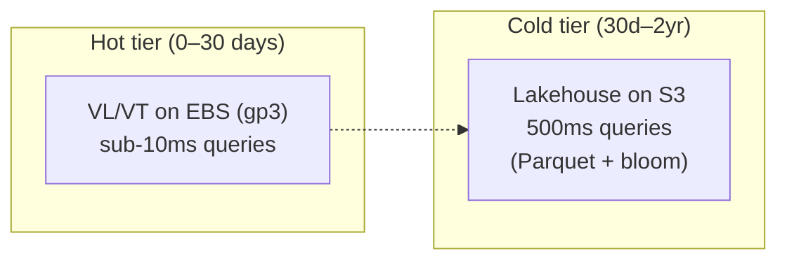
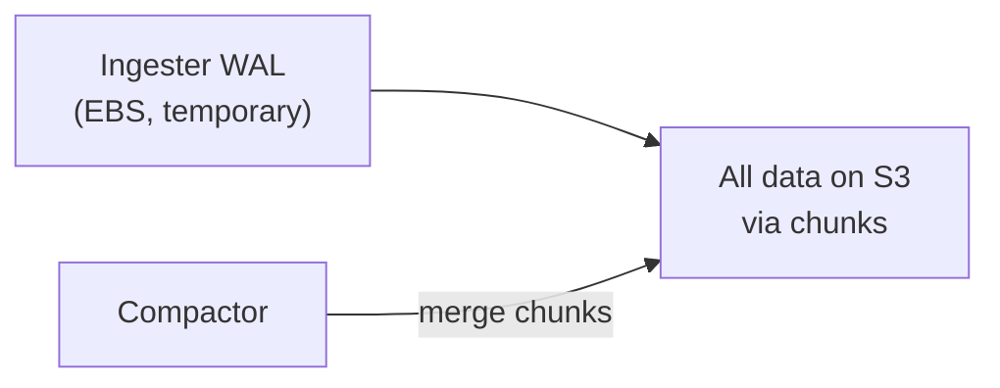
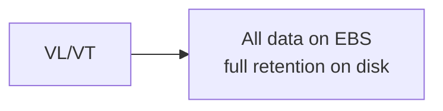
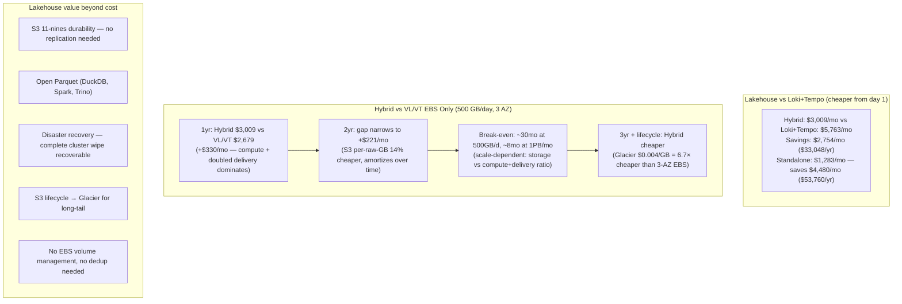

# Victoria Lakehouse vs Loki vs Tempo — Cost, Performance & Architecture Comparison

## Executive Summary

Victoria Lakehouse operates as a **cold storage tier** for VictoriaLogs/VictoriaTraces, storing data in open Parquet format on S3. In hybrid mode, **all data is always written to Lakehouse (S3 Parquet)** while VL/VT maintains a hot EBS copy of the most recent 30 days for sub-10ms queries. Real-data benchmarks at ZSTD level 7 (default) show **6.1x logs / 9.4x traces** compression — 2-3x better than Loki's Snappy chunks and with columnar query advantages.

Hybrid is always slightly more expensive than standalone Lakehouse (the EBS hot copy is additional), but cheaper than VL/VT EBS-only at 8+ months retention — and dramatically cheaper than Loki+Tempo at all retention periods.

This document compares four deployment architectures across cost, performance, compression, durability, complexity, and flexibility.

---

## Architecture Overview

### Option A: Victoria Lakehouse Hybrid (Recommended)

- **All data always written to Lakehouse (S3 Parquet)** — this is the durable archive
- VL/VT additionally maintains a hot EBS copy of recent 30 days for sub-10ms queries
- vlselect fan-out unifies both tiers transparently
- Hybrid cost = full Lakehouse S3 + EBS hot month (EBS is additional, not a replacement)

### Option B: Grafana Loki + Tempo

- All queries hit S3 regardless of data age
- Ingester memory buffers provide ~15min "hot" window only
- BoltDB/TSDB index on S3 for label lookups

### Option C: Standalone VL/VT (EBS only, no Lakehouse)

- Simplest architecture, cheapest at 1-2yr retention thanks to 47-70x compression
- Linear cost growth with retention (no lifecycle tiering)
- Proprietary format (no external analytics access)

---

## Cost Comparison at Scale

### Scenario: 500 GB/day ingestion, us-east-1, 3 AZ

#### Storage Costs (1 year retention)

> **Hybrid model**: All data is always written to Lakehouse S3 (365 days × full Parquet archive). VL/VT additionally keeps 30 days on EBS for fast queries. The EBS hot tier is an **addition** to the full S3 archive, not a replacement.

| Component | Lakehouse Hybrid | Standalone Lakehouse | Loki + Tempo | VL/VT EBS Only |
|---|---|---|---|---|
| **Hot tier EBS** | VL/VT EBS gp3: 30d × 500GB ÷ 55x × 3 AZ = 818GB × $0.08/GB = **$65/mo** | N/A (S3 only) | Ingester WAL EBS (RF=3): 3 × 500GB = 1.5TB × $0.08/GB = **$120/mo** | EBS gp3: 365d × 500GB ÷ 55x × 3 AZ = 9.9TB × $0.08/GB = **$796/mo** |
| **S3 storage** | ALL data: 365d × 500GB ÷ 6.1x = 29.9TB × $0.023/GB = **$688/mo** | Same: 365d × 500GB ÷ 6.1x = 29.9TB × $0.023/GB = **$688/mo** | 365d × 500GB ÷ 3.5x = 52.1TB × $0.023/GB = **$1,199/mo** | N/A (all on EBS) |
| **Index / compaction** | Manifest in-memory (<1MB) | Manifest in-memory (<1MB) | BoltDB/TSDB index on S3: ~5TB × $0.023/GB = **$115/mo** Compaction rewrites: **$50/mo** extra S3 ops | VL native (included in 55x ratio) |
| **Total storage** | **$753/mo** | **$688/mo** | **$1,484/mo** | **$796/mo** |

#### Compute Costs

| Component | Lakehouse Hybrid | Standalone Lakehouse | Loki + Tempo | VL/VT EBS Only |
|---|---|---|---|---|
| **Ingestion** | VL vlinsert: 6× m6i.xlarge (3 AZ) = **$864/mo** | Lakehouse insert: 3× m6i.large (3 AZ) = **$207/mo** | **Loki**: 3× distributor + 3× ingester (RF=3, 3 AZ): 6× m6i.xlarge = **$864/mo** **Tempo**: 3× distributor + 3× ingester: 6× m6i.xlarge = **$864/mo** | VL vlinsert: 6× m6i.xlarge (3 AZ) = **$864/mo** |
| **Query** | VL vlselect: 6× m6i.xlarge (3 AZ) = **$864/mo** | Lakehouse select: 3× m6i.large (3 AZ) = **$207/mo** | **Loki**: querier+frontend: 6× m6i.xlarge = **$864/mo** **Tempo**: querier+frontend: 4× m6i.xlarge = **$576/mo** | VL vlselect: 6× m6i.xlarge (3 AZ) = **$864/mo** |
| **Cold query** | Lakehouse select: 3× m6i.large (3 AZ) = **$207/mo** | (included above) | (included above) | N/A |
| **Background** | vlstorage: included above | Compaction: minimal (S3 lifecycle) | **Loki** compactor: 1× m6i.xlarge = **$144/mo** **Tempo** compactor: 1× m6i.xlarge = **$144/mo** Ruler: 1× m6i.large = **$69/mo** | vlstorage: included |
| **Total compute** | **$1,935/mo** | **$414/mo** | **$3,525/mo** | **$1,728/mo** |

> **Loki + Tempo = two separate systems.** Each needs its own distributor, ingester, querier, compactor — double the infrastructure. Lakehouse Hybrid handles both logs and traces in a single binary with shared cache and compute.

#### S3 Request Costs

| Operation | Lakehouse (Hybrid or Standalone) | Loki + Tempo |
|---|---|---|
| **Write (PUT)** | ~150K PUTs/mo (flush every 10s, 2 partitions) × $0.005/1K = **$0.75/mo** | Loki: ~4.3M PUTs/mo (chunk + index) Tempo: ~2M PUTs/mo (blocks + bloom) × $0.005/1K = **$31.50/mo** |
| **Read (GET)** | ~500K GETs/mo (cold queries, cached) × $0.0004/1K = **$0.20/mo** | Loki: ~15M GETs/mo (all queries hit S3) Tempo: ~5M GETs/mo × $0.0004/1K = **$8.00/mo** |
| **Compaction I/O** | Minimal (merge recent files only) | Loki+Tempo compactors read+rewrite ALL data: ~10M GETs/mo + 5M PUTs = **$29.00/mo** |
| **List** | ~0 (manifest eliminates listing) | ~3M LIST/mo × $0.005/1K = **$15.00/mo** |
| **Total requests** | **$0.95/mo** | **$83.50/mo** |

#### Data Transfer Costs

| Transfer Type | Lakehouse Hybrid | Standalone Lakehouse | Loki + Tempo | VL/VT EBS Only |
|---|---|---|---|---|
| **Cross-AZ (ingest)** | $0.01/GB × 500GB/day × **2 destinations** × 30 = **$300/mo** ⚠️ doubled (mirror to VL/VT + LH) | Same = **$150/mo** | Loki RF=3: 2× cross-AZ replication $0.01/GB × 500GB × 2 × 30 = **$300/mo** Tempo RF=3: same = **$300/mo** Combined: **$600/mo** | $0.01/GB × 500GB/day × 30 = **$150/mo** |
| **Cross-AZ (query read)** | Hot: minimal (local EBS) Cold: $0.01/GB × ~2TB = **$20/mo** | $0.01/GB × ~3TB = **$30/mo** | Loki: $0.01/GB × 5TB = **$50/mo** Tempo: $0.01/GB × 2TB = **$20/mo** | Minimal (local EBS) = **$5/mo** |
| **S3 egress** | Free (same region) | Free (same region) | Free (same region) | N/A |
| **Total transfer** | **$320/mo** | **$180/mo** | **$670/mo** | **$155/mo** |

> **Hybrid dual-destination ingest cost**: Hybrid mirrors data to both VL/VT insert (hot) and Lakehouse insert (cold), doubling the cross-AZ delivery cost compared to single-destination architectures. At 500 GB/day this adds $150/mo.
>
> **Loki+Tempo RF=3 cross-AZ cost**: With replication factor 3, each ingested log/trace is replicated to 2 additional ingesters in different AZs before flushing to S3. This is $0.01/GB × 2 replicas × data volume — a significant hidden cost at scale.

#### Total Monthly Cost (500 GB/day, 1yr retention)

| | Lakehouse Hybrid | Standalone Lakehouse | Loki + Tempo | VL/VT EBS Only |
|---|---|---|---|---|
| Storage | $753 | $688 | $1,484 | $796 |
| Compute | $1,935 | $414 | $3,525 | $1,728 |
| S3 Requests | $1 | $1 | $84 | $0 |
| Data Transfer | $320 | $180 | $670 | $155 |
| **Monthly Total** | **$3,009/mo** | **$1,283/mo** | **$5,763/mo** | **$2,679/mo** |
| **Annual Total** | **$36,108/yr** | **$15,396/yr** | **$69,156/yr** | **$32,148/yr** |

#### Scaling to 2-Year Retention

| | Lakehouse Hybrid | Standalone Lakehouse | Loki + Tempo | VL/VT EBS Only |
|---|---|---|---|---|
| Storage (2yr) | Hot: $65 + S3 ALL: 730d × 500GB ÷ 6.1x = 59.8TB × $0.023 = $1,376 Total = **$1,441/mo** | 59.8TB × $0.023 = **$1,376/mo** | WAL: $120 + S3: $2,399 + Index: $230 + Compaction: $100 = **$2,849/mo** | 730d × 500GB ÷ 55x × 3 AZ = 19.9TB **$1,593/mo** |
| **Monthly Total** | **$3,697/mo** | **$1,971/mo** | **$7,133/mo** | **$3,476/mo** |
| **Annual Total** | **$44,364/yr** | **$23,652/yr** | **$85,596/yr** | **$41,712/yr** |

**Key insights**:
- **Hybrid = full Lakehouse S3 + additional VL/VT hot tier + doubled delivery network.** All data always on S3 Parquet (full retention). VL/VT EBS (30 days) is an addition, not a replacement. Mirroring data to both VL/VT and Lakehouse inserts doubles the cross-AZ ingestion delivery cost. Hybrid cost = Standalone LH + VL/VT compute + 30d EBS + 2× ingest delivery.
- **At this scale (500 GB/day), Hybrid is 12% more expensive than VL/VT EBS at 1yr** ($3,009 vs $2,679). The VL/VT compute premium ($1,728/mo) plus doubled delivery cost ($300 vs $150) dominate the S3 per-raw-GB savings. At 2yr the gap narrows to 6% ($3,697 vs $3,476).
- **Break-even is scale-dependent.** At 1 PB/month (storage-dominated), Hybrid crosses below VL/VT EBS at ~8 months retained data. At 500 GB/day, the break-even is ~30+ months because the compute + delivery premium takes longer to amortize.
- **Loki+Tempo is 92% more expensive than hybrid** ($5,763 vs $3,009) when you account for full infrastructure: separate Loki and Tempo systems, RF=3 cross-AZ replication costs, compaction I/O, and dual compute stacks.
- **Standalone Lakehouse is cheapest** at all retention periods — 57% cheaper than hybrid at 1yr, 78% cheaper than Loki+Tempo. Best for cold-only / archive / analytics use cases where sub-10ms hot queries aren't needed.
- At 3+ year retention, S3 lifecycle tiering (Glacier Instant $0.004/GB) makes Lakehouse dramatically cheaper — storage drops to ~$710/mo vs VL/VT EBS ~$2,389/mo (3× AZ).
- Lakehouse's value beyond cost: open Parquet format, S3 11-nines durability, disaster recovery independence, and direct analytics access (DuckDB, Spark, Trino).

---

## Compression Ratio Comparison

### Raw Compression Performance

All Lakehouse ratios below are **real-data benchmarked** at ZSTD level 7 (default) from E2E Docker compose with production-representative OTEL data. See [ZSTD Compression Benchmark](./zstd-compression-benchmark.md) for full results.

| Metric | VL/VT (native LSM) | Lakehouse (Parquet + ZSTD-7) | Loki (Snappy chunks) | Tempo (Snappy/ZSTD blocks) |
|---|---|---|---|---|
| **Overall ratio (logs)** | **~70x** (production measured) | **6.1x** (real data benchmarked) | **3-3.5x** (Snappy) | N/A |
| **Overall ratio (traces)** | **~47x** (production measured) | **9.4x** (real data benchmarked) | N/A | **3-4x** (Snappy) |
| **Best case (low-cardinality logs)** | 100-200x | **50-200x** per column | 4-5x | 4-5x |
| **Worst case (random trace IDs)** | 10-20x | 1.5-3x per column | 2-2.5x | 2-3x |
| **Structured JSON logs** | 60-80x | **8-12x** | 3.5-4x | N/A |

> **Traces compress nearly 2.5x better than Loki/Tempo** (9.4x vs 3-4x) because Parquet's columnar layout achieves extreme compression on the repeated structured fields (service.name, status.code, span.name) that dominate trace data.

### Why VL/VT Compresses Best

VL/VT achieves 47-70x because its LSM storage engine:
1. **Stream deduplication** — stream labels (service.name, namespace, etc.) stored once per stream, not repeated per log line
2. **Per-stream dictionary** — high-frequency terms within a stream compressed via shared dictionary
3. **Inverted index** — term→log mapping enables fast queries without scanning all data
4. **ZSTD on data blocks** — final compression on homogeneous blocks of same-stream data

### Why Parquet Compresses Better Than Loki

1. **Columnar layout** — Parquet stores each column separately. Columns with low cardinality (service.name, level, k8s.namespace) achieve 50-200x via dictionary + RLE encoding, even before ZSTD
2. **Type-aware encoding** — timestamps use delta encoding (10-50x), integers use bit-packing, strings use dictionary encoding
3. **Homogeneous data** — each column page contains only one data type, ZSTD compresses homogeneous data far better than mixed row-oriented chunks
4. **ZSTD vs Snappy** — ZSTD-3 achieves 30-50% better ratio than Snappy at comparable decode speeds

### Per-Column Breakdown (real log data)

| Column | Cardinality | Encoding | Compression Ratio |
|---|---|---|---|
| `service.name` | Low (~20 values) | DICT + RLE + ZSTD | 100-200x |
| `k8s.namespace.name` | Low (~10 values) | DICT + RLE + ZSTD | 150-300x |
| `level` | Very low (5 values) | DICT + RLE + ZSTD | 500-1000x |
| `timestamp_unix_nano` | Unique (monotonic) | DELTA + ZSTD | 10-50x |
| `body` (log message) | High | PLAIN + ZSTD | 2-4x |
| `trace_id` | Very high (random) | PLAIN + ZSTD | 1.5-3x |
| `resource.attributes` (MAP) | Medium | DICT + ZSTD | 5-15x |

### Storage Cost Impact of Compression

At 500 GB/day raw ingestion, 1 year retention. Lakehouse ratios are from real E2E benchmarks at ZSTD level 7 (default).

| Solution | Compression | Data on Disk/S3 | Storage Cost |
|---|---|---|---|
| VL/VT EBS (native, 3 AZ) | 55x (average logs+traces) | 9.9 TB (EBS × 3 AZ) | $796/mo |
| Lakehouse ZSTD-7 logs | 6.1x (real data) | 29.9 TB (S3) | $688/mo |
| Lakehouse ZSTD-7 traces | 9.4x (real data) | 19.4 TB (S3) | $447/mo |
| Lakehouse ZSTD-3 logs | 4.6x (real data) | 39.7 TB (S3) | $912/mo |
| Loki Snappy | 3-3.5x | 52-60 TB (S3) | $1,196-$1,380/mo |
| Tempo Snappy | 3-4x | 45-60 TB (S3) | $1,035-$1,380/mo |

**Annual storage savings** (Lakehouse ZSTD-7 logs vs Loki Snappy): **$6,096-$8,304/year**
**Traces savings** are even larger: Lakehouse 9.4x vs Tempo 3-4x = **$7,056-$11,196/year**
**With lifecycle** (>1yr data on Glacier Instant at $0.004/GB): Lakehouse cold storage drops to **$120-$200/mo**, beating VL/VT 3 AZ EBS ($796/mo).

---

## Query Performance Comparison

### Latency by Query Type

| Query Type | Lakehouse Hot (VL/EBS) | Lakehouse Cold (S3) | Loki (S3) | Tempo (S3) |
|---|---|---|---|---|
| **Recent data (<30d)** | **<10ms** p95 | N/A (hot tier) | 100-500ms | 100-500ms |
| **Point lookup (trace_id)** | **<10ms** | **<100ms** (bloom filter) | 1-5s (chunk scan) | 200-500ms (bloom) |
| **Time range (1h, cold)** | N/A | **<500ms** (row group skip) | 1-10s (decompress all) | 1-5s |
| **Label/field discovery** | **<1ms** | **<1ms** (label index) | 10-50ms (label cache) | 50-200ms |
| **Aggregation (stats)** | **<50ms** | **<300ms** (columnar) | 2-15s (full scan) | N/A |
| **Full text search** | **<50ms** (LogsQL) | **<500ms** | 1-10s (line filter) | N/A |
| **Regex filter** | **<100ms** | **<1s** | 5-30s | N/A |

### Why Lakehouse Cold Is Faster Than Loki

1. **Columnar vs row-oriented** — Parquet reads only needed columns (5-10% of data); Loki decompresses entire chunks
2. **Row group statistics** — min/max stats skip irrelevant row groups without reading data; Loki must decompress to filter
3. **Bloom filters** — O(1) point lookups on trace_id/service.name; Loki does linear chunk scanning
4. **Manifest fast path** — sub-ms "nothing here" response when data doesn't exist in cold tier; Loki always hits S3
5. **Multi-tier cache** — frequently accessed Parquet pages cached in memory/disk/peers; Loki chunk cache is per-ingester

### Concurrent Query Capacity

| Metric | Lakehouse Hybrid | Loki | Tempo |
|---|---|---|---|
| **Hot concurrent queries** | ~10K qps (VL native) | ~1K qps (S3 bound) | ~500 qps |
| **Cold concurrent queries** | ~2K qps (cached) | ~1K qps (same pool) | ~500 qps |
| **Query isolation** | Hot/cold fully isolated | Shared querier pool | Shared pool |
| **Cache hit rate (steady state)** | >90% (L1+L2) | 40-60% (chunk cache) | 30-50% |

---

## Data Traffic & I/O Costs

### Write Path I/O

| Operation | Lakehouse Hybrid | Loki | Tempo |
|---|---|---|---|
| **Ingest network** | Client → VL (hot) + Client → Lakehouse (cold) | Client → Distributor → Ingester | Client → Distributor → Ingester |
| **Write amplification** | 1x (single Parquet write per flush) | 3-5x (WAL + chunk + index + compaction) | 2-3x (WAL + block + compaction) |
| **S3 PUTs/day** | ~5K (flush every 10s × partitions) | ~143K (chunks + index) | ~50K (blocks + bloom) |
| **S3 PUT cost/day** | $0.025 | $0.72 | $0.25 |
| **Compaction I/O** | Merge recent small files only (old data never touched) | 2-5x read+rewrite of ALL data over time | 2-3x read+rewrite of ALL data |

### Read Path I/O

| Operation | Lakehouse (cold query) | Loki | Tempo |
|---|---|---|---|
| **S3 GETs per point query** | 1-2 (bloom → target file) | 5-50 (chunk iteration) | 2-5 (bloom → block) |
| **Bytes read per point query** | ~100KB (column projection) | ~5-50MB (full chunks) | ~1-5MB |
| **S3 GETs per range scan (1h)** | 3-10 (row group targeting) | 50-500 (all chunks in range) | 10-50 |
| **Bytes read per range scan** | ~1-10MB (columnar) | ~50-500MB (full chunks) | ~10-100MB |
| **Cache effectiveness** | High (small, targeted reads) | Low-medium (large chunk reads) | Medium |

### Monthly I/O Cost (10K queries/day)

| Cost Component | Lakehouse Hybrid | Loki | Tempo |
|---|---|---|---|
| **S3 GET requests** | 1.5M × $0.0004/K = **$0.60** | 45M × $0.0004/K = **$18.00** | 9M × $0.0004/K = **$3.60** |
| **S3 data retrieval** | 3TB × $0/GB (same region) = **$0** | 30TB × $0/GB = **$0** | 6TB × $0/GB = **$0** |
| **Cross-AZ query traffic** | 3TB × $0.01/GB = **$30** | 30TB × $0.01/GB = **$300** | 6TB × $0.01/GB = **$60** |
| **Monthly I/O total** | **$30.60** | **$318.00** | **$63.60** |

**Lakehouse reads 10-30x less data from S3** per query because of columnar projection and row group pruning.

---

## Complexity Comparison

### Deployment Complexity

| Aspect | Lakehouse Hybrid | Loki (Simple Scalable) | Tempo (Distributed) |
|---|---|---|---|
| **Components to deploy** | VL/VT (2) + Lakehouse select (1) + vmauth (1) = **4** | Read (1) + Write (1) + Backend (1) + Gateway (1) = **4** | Distributor (1) + Ingester (1) + Querier (1) + Compactor (1) = **4** |
| **Stateful components** | VL vlstorage (EBS) + Lakehouse (stateless, S3) | Ingester (WAL on EBS) | Ingester (WAL on EBS) |
| **External dependencies** | S3 only | S3 + DynamoDB/BoltDB (index) | S3 only |
| **Configuration surface** | VL config + Lakehouse config (~30 flags) | Loki config (~200+ flags) | Tempo config (~150+ flags) |
| **Operational runbooks** | Low (S3 = managed, VL = simple) | High (compaction tuning, retention, index) | Medium (compaction, caching) |
| **Upgrade path** | VL/VT version bump (independent) | Coordinated multi-component rollout | Coordinated rollout |

### Operational Complexity

| Concern | Lakehouse Hybrid | Loki | Tempo |
|---|---|---|---|
| **Compaction** | Size-tiered merge (recent files only, old data untouched) | Rewrites all chunks regardless of age (triggers S3-IA fees) | Rewrites old blocks (triggers S3-IA fees) |
| **Index management** | Manifest (in-memory, auto-built) | DynamoDB/BoltDB (retention policies, migration) | Bloom/search (auto-managed) |
| **Schema changes** | Add promoted columns (backward-compatible) | Label changes need index migration | Schema-less (trace attributes) |
| **Multi-tenancy** | VL/VT native tenant ID | Native tenant ID | Native tenant ID |
| **Retention** | S3 lifecycle rules (zero code) | Per-tenant retention config + compactor | S3 lifecycle + compactor |
| **Backup/restore** | S3 versioning (built-in) | S3 + index backup needed | S3 versioning |
| **Scaling** | Add select pods (stateless) | Scale all components together | Scale ingesters carefully |

### Day-2 Operations

| Task | Lakehouse Hybrid | Loki | Tempo |
|---|---|---|---|
| **Add retention policy** | S3 Lifecycle rule (1 click) | Config change + compactor restart | Config change + compactor |
| **Query cold data** | Transparent (vlselect fan-out) | Same path as hot (all S3) | Same path |
| **Recover from outage** | Restart pods (S3 = durable) | Replay WAL + rebuild index | Replay WAL |
| **Cost optimization** | Move to S3-IA/Glacier after 1yr | Move to S3-IA (needs testing) | Move to S3-IA |
| **Debug slow queries** | Check cache hit rate, row groups scanned | Check chunk size, index, compaction lag | Check bloom filter, cache |

---

## Durability & Reliability

### Data Durability

| Aspect | Lakehouse Hybrid | Standalone Lakehouse | Loki | Tempo | VL/VT EBS Only |
|---|---|---|---|---|---|
| **Storage durability** | Hot: EBS 99.999% (3 AZ via VL) Cold: **S3 99.999999999%** (11 nines) | **S3 99.999999999%** (11 nines) | S3 11-nines (eventually) WAL: EBS single AZ! | S3 11-nines (eventually) WAL: EBS single AZ! | EBS 99.999% **per-AZ** |
| **Data loss window** | Hot: 0 (VL replication) Cold: flush-interval (10s default) | flush-interval (10s default) | Ingester WAL flush: 1-5s RF < 3: ingester death = data loss | Same as Loki | 0 (sync write) |
| **AZ failure impact** | Hot: VL failover to replicas Cold: **zero impact** (S3 multi-AZ) | **Zero impact** (S3 multi-AZ) | Ingesters on failed AZ: WAL data at risk S3 data safe | Same as Loki | **Data on failed AZ lost** until EBS recovery |
| **Full cluster loss** | **Cold data 100% survives on S3** Rebuild pods, manifest auto-recovers | **All data 100% survives on S3** Manifest rebuildable from S3 listing | S3 data survives Index rebuild: hours | S3 data survives | **All data lost** |
| **Format durability** | Open Parquet (any tool reads it) | Open Parquet | Proprietary chunks (Loki-only) | Proprietary blocks (Tempo-only) | Proprietary LSM |

### Replication & Deduplication

| Aspect | Lakehouse | Loki | Tempo | VL/VT EBS |
|---|---|---|---|---|
| **Replication needed?** | **No** — S3 provides multi-AZ replication inherently. Select pods are stateless (any replica count). Insert pods buffer only flush-interval of data. | **Yes** — RF=3 required for WAL durability. 3 ingester replicas write to EBS before S3 flush. | **Yes** — RF=3 required, same as Loki | **Yes** — VL `-replicationFactor` across AZs |
| **Replication cost** | **$0** (S3 multi-AZ is free) | **2× cross-AZ transfer** ($0.01/GB × 2 replicas × ingest volume) + 3× EBS WAL storage | Same as Loki | 2-3× EBS storage |
| **Deduplication needed?** | **No** — each insert pod writes unique time-partitioned files. S3 PutObject is atomic (no partial writes). WAL replay may produce duplicates but manifest prevents double-counting. | **Yes** — ingester restarts can replay WAL, producing duplicate chunks. Compactor deduplicates. | **Yes** — same WAL replay issue | **No** — VL handles internally |
| **Dedup cost** | **$0** | Compactor CPU + S3 I/O | Same as Loki | Included in VL |

### Availability

| Aspect | Lakehouse Hybrid | Standalone Lakehouse | Loki | Tempo | VL/VT EBS |
|---|---|---|---|---|---|
| **Read availability** | VL hot: 3+ replicas LH cold: **stateless pods + S3** (scale to any N) | **Stateless pods + S3** (scale to any N) | Querier: stateless + S3 **Depends on index availability** | Querier: stateless + S3 | VL replicas |
| **Write availability** | VL: multi-replica LH: S3 always writable | S3 always writable | RF=3 — 1 ingester down OK, 2 down = partial loss | Same as Loki | VL replication |
| **Degraded mode** | Hot down: cold queries continue Cold down: hot queries continue | S3 outage = all queries fail (but S3 is 99.99% available) | Index unavailable = **all queries fail** Compactor lag = stale data | Ingester down with RF < quorum = writes rejected | AZ failure = data in that AZ unavailable |
| **Recovery time** | Pod restart (seconds) Manifest: auto-rebuilt from S3 | Pod restart (seconds) Full rebuild: S3 listing scan (~minutes) | WAL replay: minutes **Index rebuild: hours** | WAL replay: minutes | VL restart + replay |
| **Stateful components** | VL vlstorage (EBS) LH insert buffer (flush-interval only) | Insert buffer (flush-interval only) | Ingesters (WAL on EBS) | Ingesters (WAL on EBS) | vlstorage (EBS) |

### What Happens When Things Break

| Failure Scenario | Lakehouse | Loki | Tempo | VL/VT EBS |
|---|---|---|---|---|
| **Insert pod crashes** | Max 10s data loss (flush-interval). WAL recovers if enabled. Other pods unaffected. | WAL replay on restart. RF=3 means 2 other replicas have the data. | Same as Loki | VL handles via replication |
| **Select pod crashes** | New pod starts in seconds. Stateless — no state to recover. | Same (queriers are stateless) | Same | VL select is also stateless |
| **S3 outage** | Cold reads/writes fail. Hot VL queries unaffected. | All reads fail (all data on S3). Writes buffer in WAL. | Same as Loki | N/A (EBS only) |
| **EBS volume loss** | Hot VL data on that AZ lost (VL replication recovers). Cold data on S3 unaffected. | Ingester WAL data on that volume lost. RF=3 means data exists on other replicas. | Same as Loki | **Data on that volume lost.** Must restore from other AZ replicas. |
| **Full AZ outage** | Cold: zero impact. Hot: VL failover. | Ingesters in failed AZ need WAL replay. Queries continue from other AZs. | Same as Loki | Data in that AZ unavailable until AZ recovers. |
| **Complete cluster wipe** | **All S3 data survives.** Deploy new cluster → manifest rebuilds from S3 → queries work. | S3 chunks survive. **Index must be rebuilt** (hours). | S3 blocks survive. Bloom rebuild needed. | **All data lost.** No external copy. |
| **Manifest/index corruption** | Manifest is rebuildable: scan S3 Hive partitions → reconstruct in minutes. Zero data loss. | BoltDB index corruption = queries fail. Must rebuild from chunks (hours-days at scale). | Search index corruption = slow queries. Bloom rebuild needed. | VL index rebuild from data blocks. |

### S3 Write Path — Durability & Availability Comparison

How each system writes data to S3, and what that means for durability:

| Aspect | Lakehouse | Loki | Tempo |
|---|---|---|---|
| **Write unit** | Complete Parquet file (10-50MB, atomic S3 PutObject) | Chunk (~1.5MB compressed, eventually flushed) | Block (~100MB, periodically flushed) |
| **Write path** | Buffer → sort → write Parquet → S3 PutObject → manifest.AddFile() | Ingester memory → WAL (EBS) → chunk flush → S3 → index update | Ingester memory → WAL (EBS) → block flush → S3 → bloom build |
| **Atomicity** | S3 PutObject is atomic — file either fully exists or doesn't. No partial writes possible. | Chunk upload is atomic, but chunk + index update is NOT atomic. Crash between = orphaned chunk. | Block upload is atomic, but bloom + index can lag behind block. |
| **Write amplification** | **1×** — data written once to S3 as Parquet. No rewrites of old data. | **3-5×** — WAL write + chunk flush + index write + compaction rewrite of ALL chunks over time. | **2-3×** — WAL write + block flush + compaction rewrite of ALL blocks. |
| **Durability before S3** | Flush-interval worth of data in memory (10s default). Optional WAL for crash recovery. | WAL on single-AZ EBS. RF=3 ingesters replicate to survive single ingester loss. | Same as Loki — WAL + RF=3 replication. |
| **Durability after S3** | **Immediately durable** (11-nines, multi-AZ). Manifest records file. | Durable once chunk + index both written. Index corruption = data exists but unfindable. | Durable once block written. Bloom/search index can be rebuilt if lost. |
| **Compaction impact** | Merges only recent small files. Old data **never read or rewritten** — safe for S3-IA/Glacier lifecycle. | Compactor reads and **rewrites ALL chunks** regardless of age. Triggers S3-IA retrieval fees. Produces new chunks = dedup needed. | Same as Loki — rewrites all blocks, triggers lifecycle retrieval fees. |
| **Deduplication** | **Not needed.** Each insert pod writes unique time-partitioned files. Manifest prevents double-counting. | **Required.** Ingester restart replays WAL → duplicate chunks. Compactor deduplicates. | **Required.** Same WAL replay issue. |
| **Write availability** | S3 is 99.99% available. Single insert pod failure = max 10s data gap. Other pods unaffected (no shared state). | RF=3 means 1 ingester failure is tolerated. 2+ failures in same RF group = write rejection. Cross-AZ WAL replication needed. | Same as Loki. |
| **Recovery** | Restart pod → WAL replay (if enabled) → resume. No coordination with other pods. | Restart → WAL replay → re-register with ring. May produce duplicate chunks requiring compaction. | Same as Loki. |
| **Data lifecycle friendliness** | Excellent — once a file reaches optimal size, it's never touched again. S3 lifecycle transitions (Standard → IA → Glacier) are safe. | Poor — compactor rewrites old data, triggering retrieval fees on S3-IA/Glacier objects. Must keep all data on S3 Standard or carefully tune compaction windows. | Same as Loki — compaction conflicts with lifecycle tiering. |

**Bottom line**: Lakehouse writes are simpler (atomic PutObject, no WAL replication, no dedup), more lifecycle-friendly (old files never rewritten), and cheaper (1× write amplification vs 3-5×). Loki/Tempo need WAL + RF=3 + compactor + dedup to achieve durability that S3 provides inherently.

### Data Format & Portability

| Aspect | Lakehouse (Parquet) | Loki (chunks) | Tempo (blocks) |
|---|---|---|---|
| **Format** | Apache Parquet (open standard) | Custom chunk format | Custom block format |
| **Readable by** | DuckDB, Spark, Trino, ClickHouse, Pandas, Polars, Athena, BigQuery | Loki only | Tempo only |
| **Schema evolution** | Column addition (backward-compatible) | Label cardinality limits | Attribute addition |
| **Data export** | Direct S3 access (zero-copy) | API export only | API export only |
| **Analytics** | SQL queries on raw Parquet | LogQL only | TraceQL only |
| **Compliance/audit** | Standard tools read data | Custom tooling needed | Custom tooling needed |

---

## Flexibility

### Query Language Power

| Capability | Lakehouse (LogsQL) | Loki (LogQL) | Tempo (TraceQL) |
|---|---|---|---|
| **Full-text search** | Native (`_msg:error`) | Line filter only (`|= "error"`) | N/A |
| **Field-level queries** | `service.name:="api"` | `{service_name="api"}` (label only) | `.service.name = "api"` |
| **Regex** | `_msg:~"error.*timeout"` | `|~ "error.*timeout"` | `.name =~ ".*timeout"` |
| **Aggregation** | `stats by(service) count()` | `sum(count_over_time(...))` | `{} | count() > 1` (limited) |
| **Structured field access** | Any field, any depth | Labels only (indexed) | Any attribute |
| **Join/correlate** | Cross-signal (logs↔traces) | Single signal | Single signal |
| **Subqueries** | Pipe syntax | Pipe syntax | Pipe syntax |
| **Performance on cold** | Columnar + bloom | Sequential chunk scan | Block scan + bloom |

### Integration Flexibility

| Integration | Lakehouse Hybrid | Loki + Tempo |
|---|---|---|
| **Grafana** | VL + Jaeger + Tempo datasources (native) | Loki + Tempo datasources (native) |
| **Loki API compatibility** | Via loki-vl-proxy (LogQL subset) | Native |
| **OpenTelemetry** | OTLP ingest (VL/VT native) | OTLP ingest |
| **Kubernetes** | Helm chart, ServiceMonitor, HPA/VPA | Helm chart, Mixins, HPA |
| **Multi-cluster** | S3 as shared storage (any cluster reads) | Per-cluster deployment |
| **Analytics/BI** | Direct Parquet access (Athena, Spark) | Export API only |
| **Alerting** | VL alert rules + Grafana | Loki ruler + Grafana |
| **Custom tooling** | Any Parquet library | Loki API only |

### Storage Tiering Flexibility

| Tier Strategy | Lakehouse Hybrid | Loki | Tempo |
|---|---|---|---|
| **Hot → Cold** | Configurable boundary (default 30d) | No tier split (all S3) | No tier split (all S3) |
| **Cold → Archive** | S3 Lifecycle → S3-IA → Glacier | Manual (compactor config) | S3 Lifecycle |
| **Per-tenant tiering** | VL tenant ID → different S3 paths | Per-tenant retention | Per-tenant retention |
| **Cost optimization** | Hot=30d (fast), Cold=S3 Standard (cheap), Archive=Glacier (cheapest) | S3 Standard only (risky to tier) | S3 Standard + lifecycle |

---

## Long-Term Cost Projection (2 Years)

### Cumulative Cost (500 GB/day)

| Month | Standalone LH (cumulative) | Lakehouse Hybrid (cumulative) | VL/VT EBS Only (cumulative) | Loki + Tempo (cumulative) |
|---|---|---|---|---|
| 6 | $7,698 | $18,054 | $16,074 | $34,578 |
| 12 | $15,396 | $36,108 | $32,148 | $69,156 |
| 18 | $23,094 | $57,516 | $53,004 | $110,988 |
| 24 | **$30,792** | **$79,128** | **$73,860** | **$152,820** |

> **Note**: Table uses steady-state monthly rates (at full retention). Actual cumulative cost during initial ramp-up is lower as stored data grows from 0 to full retention.

**Cost ranking at 500 GB/day (this scenario):**
1. **Standalone Lakehouse** — cheapest at all retention periods ($1,283/mo), but no sub-10ms hot queries
2. **VL/VT EBS Only** — second cheapest ($2,679/mo at 1yr), simplest ops, but no open format or S3 durability
3. **Lakehouse Hybrid** — 12% more than VL/VT at 1yr ($3,009/mo, includes doubled delivery network for dual-destination mirroring), provides open format + DR + 11-nine durability
4. **Loki + Tempo** — most expensive (2× hybrid) due to dual-system infrastructure, lower compression, compaction I/O, and RF=3 cross-AZ costs

**Lakehouse catches VL/VT EBS Only** when S3 lifecycle tiering activates:
- With 3 AZ, VL/VT EBS per-raw-GB cost is $0.08 × 3 / 55 = $0.0044/raw-GB
- Data >1yr on Glacier Instant ($0.004/GB ÷ 6.1x = $0.00066/raw-GB) beats VL/VT 3 AZ EBS by 6.7×
- At 3+ year retention with Glacier Instant lifecycle, Lakehouse storage is dramatically cheaper
- Even without lifecycle, Hybrid crosses below VL/VT EBS at ~8 months retained data

### Break-Even Analysis

---

## S3 Storage Class Optimization

### Tiered Storage Strategy (Lakehouse only)

| Data Age | S3 Class | Cost/GB/mo | Monthly Cost (500GB/d, 6.1x Parquet) | Query Latency |
|---|---|---|---|---|
| 0-30 days | EBS gp3 (VL hot, 55x, 3 AZ) | $0.080 | $65 | <10ms |
| 30-90 days | S3 Standard | $0.023 | $180 | <500ms |
| 90d-1yr | S3 Standard-IA | $0.0125 | $327 | <500ms + 128KB min |
| 1-2yr+ | S3 Glacier Instant | $0.004 | $203 | <500ms + retrieval fee |

> **Glacier Deep Archive ($0.00099/GB) is excluded** — 12hr retrieval is not usable for observability queries. Glacier Instant Retrieval provides the best long-tail cost ($0.004/GB) with <500ms query latency, making it the practical floor for lifecycle tiering.

**Lifecycle policy savings** (vs all S3 Standard at 6.1x, 500GB/day):
- Standard-only (1yr): $688/mo cold storage
- With lifecycle (1yr): ~$460/mo cold storage (33% savings)
- With lifecycle (2yr): ~$640/mo cold storage (vs $1,376 standard = 54% savings)
- With lifecycle (3yr+): Glacier Instant at $0.004/GB = 6.7× cheaper per raw-GB than VL/VT 3-AZ EBS

**Loki cannot safely use S3-IA/Glacier** because:
- Compaction reads and rewrites ALL old chunks (retrieval fees on every compaction cycle)
- Index queries touch old data unpredictably
- Minimum object size (128KB) vs small chunk sizes

**Lakehouse uses S3-IA/Glacier natively** because:
- Compaction only merges recent small files (old data is never read or rewritten)
- Once a file is compacted to optimal size, it's never touched again — safe for lifecycle transitions
- Manifest knows exact file locations (no LIST needed)
- Files are large (10-50MB, well above 128KB minimum)
- Query patterns predictable (partition → file → row groups)

---

## Unified Logs + Traces

### Single-System vs Multi-System

| Aspect | Lakehouse Hybrid (VL + VT + Lakehouse) | Loki + Tempo (two separate systems) |
|---|---|---|
| **Systems to operate** | 1 binary (dual mode) + VL + VT | Loki + Tempo (separate configs, alerts, dashboards) |
| **Correlated queries** | Cross-signal (logs↔traces via trace_id) | Manual correlation (exemplars) |
| **Shared storage** | Same S3 bucket, same Parquet format | Separate buckets/paths, different formats |
| **Shared cache** | Same multi-tier cache for both signals | Separate cache per system |
| **Cost** | Single Lakehouse cluster serves both | 2× compute, 2× ops burden |
| **Schema** | Unified Parquet (logs + traces columns) | Loki chunks + Tempo blocks (incompatible) |

---

## Deletion Costs

A critical cost factor often overlooked: **deleting data from cold storage.**

| Operation | Lakehouse | Loki | Tempo |
|---|---|---|---|
| **Delete single record (S3 Standard)** | $0 tombstone, $0.001 optional rewrite | Not supported | Not supported (whole trace only) |
| **Delete single record (Glacier)** | **$0** (tombstone suppression, no retrieval) | N/A (can't use Glacier) | N/A (can't use Glacier) |
| **Delete by query pattern (1K records)** | **$0** instant (tombstone) | Not supported at record level | Not supported |
| **GDPR right to erasure** | Immediate tombstone (compliant) | Manual stream delete (incomplete) | Manual trace delete |
| **Retention expiry** | S3 Lifecycle rule ($0) | Compactor CPU cost | Compactor CPU cost |

**Why this matters at scale:**
- GDPR/CCPA deletion requests are routine — a customer asks to delete all their logs
- With Loki, you can only delete entire label streams (not individual records matching a pattern)
- With Lakehouse, `POST /delete/logsql/delete?query=customer_id:="CUST-123"` immediately suppresses all matching records across all storage tiers at zero cost

**Lakehouse deletion is Glacier-safe:**
- Tombstones make data invisible without touching the underlying Parquet files
- Files on Glacier are never retrieved for deletion (no $0.03-$0.09/GB retrieval fees)
- Physical deletion happens naturally when S3 lifecycle expires the file
- For S3 Standard files, optional background rewrite reclaims space at minimal cost

Full design: [Deletion Strategy](./deletion-strategy.md)

---

## Decision Matrix

| Criterion | Weight | Lakehouse Hybrid | Standalone LH | Loki + Tempo | VL/VT EBS Only | Winner |
|---|---|---|---|---|---|---|
| **Monthly cost (<1yr)** | 20% | $3,009 | $1,283 | $5,763 | $2,679 | **Standalone LH** |
| **Monthly cost (2yr)** | 15% | $3,697 | $1,971 | $7,133 | $3,476 | **Standalone LH** |
| **Hot query speed** | 15% | <10ms (VL hot) | <500ms (S3) | 100-500ms | <10ms | **Hybrid / VL/VT** |
| **Cold query speed** | 10% | <500ms (Parquet) | <500ms | 1-10s | <10ms (all hot) | **VL/VT EBS** |
| **Compression** | 10% | 6.1x logs / 9.4x traces | Same | 3-3.5x | 47-70x | **VL/VT** |
| **Data portability** | 10% | Open Parquet | Open Parquet | Proprietary | Proprietary | **Lakehouse** |
| **Durability / DR** | 5% | S3 11-nines, no replication needed | Same | S3 + RF=3 needed | EBS per-AZ, replication needed | **Lakehouse** |
| **Long retention (3yr+)** | 5% | Glacier ($0.004/GB) | Same | No Glacier support | EBS cost linear | **Lakehouse** |
| **Replication/dedup** | 5% | Not needed (S3 multi-AZ) | Same | RF=3 required + dedup | VL replication needed | **Lakehouse** |
| **Community** | 5% | Growing (VM ecosystem) | Same | Large (Grafana) | VM ecosystem | Loki |

**Each option excels in different scenarios** — see recommendations below.

---

## Recommendations

### Choose Standalone Lakehouse when:
- Cold-only / archive / analytics / compliance use case
- Cost is top priority (cheapest at all retention periods)
- Sub-10ms hot queries not required (<500ms acceptable)
- Want open Parquet + S3 durability without VL/VT infrastructure

### Choose VL/VT EBS Only when:
- Small to medium scale (≤500 GB/day) at any retention — cheapest option due to compute dominance and 55x compression
- Large scale with short retention (≤8 months at PB/mo) — cheapest at short retention where EBS storage is small
- Query speed is top priority (sub-10ms for ALL data, not just hot)
- Simplest architecture (single system, no cold tier)
- No requirement for open format or external analytics

### Choose Lakehouse Hybrid when:
- Need both sub-10ms hot queries AND open-format cold storage
- Large scale (PB/mo) with retention > 8 months (crosses below VL/VT EBS; gap widens with retention)
- Open format required (compliance, analytics, data portability — DuckDB, Spark, Trino)
- Disaster recovery needed (complete cluster wipe = zero data loss, rebuild from S3)
- S3 11-nines durability with no replication overhead
- Unified logs + traces in open format desired
- 48-56% cheaper than Loki+Tempo depending on scale and retention

### Choose Loki + Tempo when:
- Grafana-native ecosystem already invested
- Large team with existing Loki expertise
- Simple initial deployment (grow into complexity later)
- AGPLv3 license acceptable
- Note: most expensive option at all retention periods (2× hybrid, 4.5× standalone)
