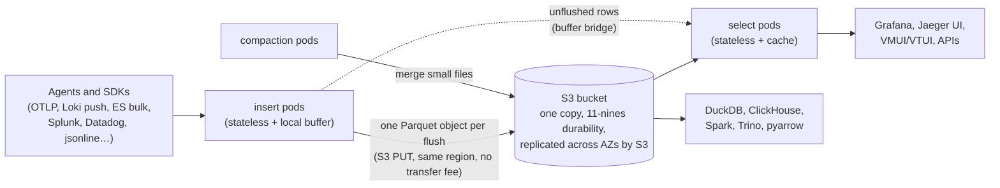
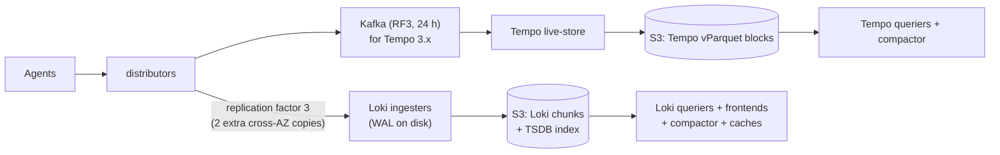

# Victoria Lakehouse vs Loki and Tempo: where the money goes

This page explains **why** Lakehouse costs what it costs on AWS, line by line, and why its cost grows in a straight line with ingest and retention. Every number is either an AWS list price or output of the cost model in `scripts/cost/` (see [Cost Estimates](cost-estimates.md) for all systems and all sizes).

**Assumptions used everywhere on this page:**
- AWS us-east-1, on-demand, Linux.
- Logs and traces together, 60% logs and 40% traces by raw volume, at 1 query per second.
- Every system is deployed for production HA.
- **Lakehouse CPU is assumed**: the same per-MB/s rule ClickHouse publishes for its own sizing, until Lakehouse's is measured.
- Loki and Tempo sizing comes from Grafana's published guides.

## 1. AWS list prices used

Fetched 2026-10-01 from AWS's public price feed, us-east-1.

**Compute (EC2 on-demand, Linux)**

| Instance | vCPU | RAM | $/hour | $/month (730 h) |
|---|---:|---:|---:|---:|
| m7g.xlarge | 4 | 16 GiB | 0.1632 | 119.14 |
| r7g.xlarge | 4 | 32 GiB | 0.2142 | 156.37 |
| m7g.8xlarge | 32 | 128 GiB | 1.3056 | 953.09 |
| r7g.8xlarge | 32 | 256 GiB | 1.7136 | 1,250.93 |

The small-scale model prices compute per vCPU at the m7g rate ($0.0408 per vCPU-hour, which includes 4 GiB). RAM beyond 4 GiB per vCPU is charged at the r7g−m7g difference ($0.0032 per GiB-hour). The large-scale model counts whole r7g.8xlarge and m7g.8xlarge nodes.

**Block storage (EBS gp3)**

| Item | Price |
|---|---|
| Storage | $0.08 per GB-month |
| Included per volume | 3,000 IOPS and 125 MB/s |
| Extra IOPS / throughput | $0.005 per IOPS-month / $40.96 per GiB/s-month (not modelled; would raise every EBS-based row) |

**Object storage (S3)**

| Storage class | $ per GB-month | Retrieval | Notes |
|---|---:|---:|---|
| S3 Standard, first 50 TB | 0.023 | free | |
| S3 Standard, next 450 TB | 0.022 | free | |
| S3 Standard, over 500 TB | 0.021 | free | |
| S3 Standard-IA | 0.0125 | $0.01 per GB | 30-day minimum storage duration |
| S3 Glacier Instant Retrieval | 0.004 | $0.03 per GB | millisecond GETs; 90-day minimum |
| S3 Glacier Flexible Retrieval | 0.0036 | restore first | not queryable in place |
| S3 Glacier Deep Archive | 0.00099 | restore first | archive only |

| S3 request | Price |
|---|---|
| PUT, COPY, POST, LIST (Standard) | $0.005 per 1,000 |
| GET and others (Standard) | $0.0004 per 1,000 |
| Lifecycle transition into Glacier Instant Retrieval | $0.02 per 1,000 objects |
| Data between S3 and EC2 in the same region | free |

**Network**

| Item | Price |
|---|---|
| Cross-AZ transfer between instances | $0.01 per GB each direction ($0.02 per GB round trip) |

## 2. Lakehouse in one picture: two pod types and one bucket

```mermaid
flowchart LR
    A["Agents and SDKs<br/>(OTLP, Loki push, ES bulk,<br/>Splunk, Datadog, jsonline…)"] --> I["insert pods<br/>(stateless + local buffer)"]
    I -- "one Parquet object per flush<br/>(S3 PUT, same region, no transfer fee)" --> S3[("S3 bucket<br/>one copy, 11-nines durability,<br/>replicated across AZs by S3")]
    C["compaction pods"] -- "merge small files" --> S3
    S3 --> Q["select pods<br/>(stateless + cache)"]
    I -. "unflushed rows<br/>(buffer bridge)" .-> Q
    Q --> G["Grafana, Jaeger UI,<br/>VMUI/VTUI, APIs"]
    S3 --> X["DuckDB, ClickHouse,<br/>Spark, Trino, pyarrow"]
```

- **Insert pods** accept every VictoriaLogs/VictoriaTraces protocol, buffer locally, and flush compressed Parquet to S3.
- **Select pods** answer queries from S3 plus the insert pods' unflushed rows.
- **Compaction** merges small files in the background.

None of them owns data. S3 is the only copy, and S3 already spreads it across availability zones, so **HA never multiplies storage**: add pods, not copies.

Loki + Tempo for comparison:

```mermaid
flowchart LR
    A["Agents"] --> D["distributors"]
    D -- "replication factor 3<br/>(2 extra cross-AZ copies)" --> IN["Loki ingesters<br/>(WAL on disk)"]
    D --> K["Kafka (RF3, 24 h)<br/>for Tempo 3.x"]
    K --> LS["Tempo live-store"]
    IN --> S3[("S3: Loki chunks<br/>+ TSDB index")]
    LS --> S3T[("S3: Tempo vParquet blocks")]
    S3 --> QL["Loki queriers + frontends<br/>+ compactor + caches"]
    S3T --> QT["Tempo queriers + compactor"]
```

## 3. Unit economics: what one raw TB costs to keep

Compression decides how many bytes each system stores per raw byte ingested. The copies decide how many times you pay for them.

| System | Effective compression (60/40 mix) | Stored per raw TB | Copies paid for | Medium | **$ per raw TB per month kept** |
|---|---:|---:|---:|---|---:|
| **Lakehouse** | **7.1x** (logs 6.1x, traces 9.4x, measured) | 141 GB | **1** | S3 Standard | **$3.24** |
| Lakehouse + lifecycle to Glacier Instant Retrieval | 7.1x | 141 GB | 1 | S3 Glacier IR | $0.56 (+ $0.03 per GB read back) |
| Loki + Tempo | 4.35x (logs ~4x, traces ~5x, typical) | 230 GB | 1 | S3 Standard | $5.29 |
| ClickHouse tiered (data older than 7 days) | 12x (vendor guide) | 83 GB | 2 (no supported shared copy) | S3 Standard | $3.83 |
| ClickHouse on EBS / first 7 days | 12x | 83 GB | 2, plus 25% free-space headroom | EBS gp3 | $16.67 |
| VictoriaLogs / VictoriaTraces HA | 13.6x (vendor range) | 73 GB | 2 clusters, plus 20% free space | EBS gp3 | $14.67 |

How to read this:
- **VL/VT and ClickHouse compress better than Lakehouse.** They lose the storage line anyway once they keep data on EBS, because EBS costs 3.5x S3 per GB and HA doubles it.
- **Against Loki + Tempo**, Lakehouse stores about **40% fewer bytes** for the same raw data (ZSTD Parquet vs Loki chunks), in one copy on the same S3.
- **Retention is where this compounds.** Keeping 1 TB/day for a year means about 365 raw TB retained:
  - Lakehouse: **~$1,180 per month** of storage.
  - Loki + Tempo: about $2,050.
  - VL/VT HA on EBS: about $5,350.

## 4. Where the money goes, line by line

Monthly, mid estimate, from `python3 scripts/cost/cost_model.py`.

### 1 TB/day, 1-year retention (storage-dominated)

| | Storage | Compute | Cross-AZ network | S3 requests | **Total** |
|---|---:|---:|---:|---:|---:|
| **Lakehouse** | $1,183 (81%) | $207 (14%) | $60 (4%) | $3 | **$1,453** |
| Loki + Tempo | $2,051 (66%) | $717 (23%) | $300 (10%) | $20 | $3,088 |
| ClickHouse 7d EBS + S3, RF2 | $1,489 (76%) | $351 (18%) | $110 (6%) | $4 | $1,954 |
| VL/VT HA on EBS | $5,353 (94%) | $172 (3%) | $180 (3%) | $0 | $5,706 |

### 10 TB/day, 30-day retention (compute and network matter)

| | Storage | Compute | Cross-AZ network | S3 requests | **Total** |
|---|---:|---:|---:|---:|---:|
| **Lakehouse** | $972 (27%) | $2,068 (57%) | $600 (16%) | $6 | **$3,646** |
| Loki + Tempo | $2,787 (12%) | $17,492 (75%) | $3,000 (13%) | $156 | $23,435 |
| ClickHouse 7d EBS + S3, RF2 | $2,048 (40%) | $1,902 (38%) | $1,100 (22%) | $18 | $5,069 |
| VL/VT HA on EBS | $4,400 (56%) | $1,724 (22%) | $1,800 (23%) | $0 | $7,924 |

### The resources behind those numbers (10 TB/day)

| | vCPU | RAM | EBS | S3 kept (30 d / 1 y) | Cross-AZ per month |
|---|---:|---:|---:|---:|---:|
| **Lakehouse** | **69** | 278 GiB | **0** | 42 TB / 514 TB | **30 TB** |
| Loki + Tempo | 587 | 1,511 GiB | 15 TB (Kafka) | 69 TB / 840 TB | 150 TB |
| ClickHouse 7d EBS + S3, RF2 | 64 | 255 GiB | 15 TB | 38 TB / 597 TB | 55 TB |
| VL/VT HA on EBS | 58 | 231 GiB | 55 TB / 669 TB | 0 | 90 TB |

### What drives each line

**Storage** = stored bytes × copies × price per GB. Lakehouse pays S3 Standard on one copy (section 3). Nothing sits on EBS: insert pods use a small local disk for the buffer and select pods a cache disk, both sized by throughput, not by retention.

**Compute** follows the ingest rate and query load, not retention.
- **Lakehouse:** insert at 0.15 vCPU per MB/s with two insert nodes minimum, plus select at 0.3 vCPU per MB/s at 1 QPS. **This is assumed** until measured. At 10 TB/day (116 MB/s raw) that is 69 vCPU.
- **Loki:** Grafana's sizing tier for 3–30 TB/day is a fixed baseline of 410 vCPU and 780 GiB before frontends, compactor and caches (+30%). That is why Loki + Tempo compute jumps at 3 TB/day and dominates at 10 TB/day. Well-tuned deployments can run leaner than the vendor baseline.
- **Tempo:** distributors, live-store and queriers per the Tempo guide, plus a 3-broker Kafka.

**Cross-AZ network** is where replication shows up on the AWS bill.

| System | Cross-AZ bytes per ingested wire byte | Why |
|---|---:|---|
| **Lakehouse** | **0.5** | Only clients crossing AZs to reach an insert pod. Insert → S3 is same-region and free; S3 replicates across AZs at no transfer charge. |
| ClickHouse RF2 | 0.5 + stored replication | `ReplicatedMergeTree` ships every part to the replica. |
| VL/VT HA | 1.5 | Every write goes to two independent clusters. |
| Loki + Tempo | 2.5 | Replication factor 3: two extra copies of every write cross AZs; Tempo's Kafka is RF3. |

**S3 requests** are small for everyone. Lakehouse writes about 64 MB objects, so 1 TB/day raw (141 GB stored) is about 2,200 PUTs a day ($0.33 a month). Loki's ~1.5 MB chunks need about 40x more PUTs per stored byte. The model counts one write per stored object plus a fixed 200,000 GETs a day for every system. Compaction rewrites are not counted for any system.

## 5. Scaling: linear, and two knobs

From `python3 scripts/cost/cost_model_scale.py`: whole r7g.8xlarge / m7g.8xlarge nodes, production HA, 1-year retention.

| Ingest/day | Lakehouse pods (m7g.8xlarge) | Lakehouse compute | Lakehouse S3 kept | **Lakehouse total** | Loki + Tempo nodes | Loki + Tempo total |
|---|---|---:|---:|---:|---|---:|
| 100 TB | 9 insert + 17 select + 3 compaction | $28k | 5.1 PB | **$142k** | 158 r7g.8xlarge + Kafka 28 × m7g.8xlarge | $445k |
| 500 TB | 40 insert + 79 select + 13 compaction | $126k | 25.7 PB | **$697k** | 785 r7g.8xlarge + Kafka 139 × m7g.8xlarge | $2,214k |

**Lakehouse is not ready at these sizes yet**: every replica holds the full file manifest, and metadata grows with file count, which at 64 MB files is about 80 million files a year at 100 TB/day. These rows show the cost once that work is done ([limits](cost-estimates.md#where-lakehouse-wins-and-where-it-does-not)).

Why the Lakehouse column is a straight line:
- **Two independent knobs.** Ingest rate sets the insert (and compaction) pod count, about 8 insert pods per 100 TB/day at the assumed rule. Query load sets the select pod count. Retention sets only the S3 line. None of these affects the others.
- **No data placement.**
  - Adding pods moves no data: there are no shards to rebalance, no replicas to resync and no disks to grow.
  - ClickHouse adds shards and must place data on them.
  - VL/VT on EBS grows nodes with retention, because every node's disk fills.
  - Loki and Tempo scale ingesters behind replication factor 3 and Kafka partitions.
- **Autoscaling is plain HPA.** Select pods are stateless; scale them on query load and to zero-ish off-hours. A select pod restart costs a cache warm-up, not a data recovery.
- **Retention is a single S3 lifecycle rule.** Lengthening retention adds S3 bytes and nothing else. Moving older objects to Glacier Instant Retrieval cuts that line by about 83% while staying queryable (at $0.03 per GB read back).
  - Lakehouse's large objects make transitions cheap: about 16,000 objects per stored TB, so about $0.31 per TB transitioned.
  - Loki's 1.5 MB chunks need about 670,000 objects per TB, about $13 per TB.
  - Objects must stay 90 days in Glacier IR (30 in Standard-IA) before compaction rewrites them, or AWS bills the remainder.

## 6. Long retention: let the data get cheaper as it ages

Lakehouse objects are large, immutable and compacted, so S3 lifecycle rules can move them to cheaper storage classes as they age while they stay queryable:
- S3 Standard for the first 30 days.
- Standard-IA until day 90.
- Glacier Instant Retrieval after that.

Lakehouse mirrors those rules (globally or per tenant) so its cost stats and deletes know where each object lives, and deletes on cold classes never trigger retrieval fees. The full calculator for 1–500 TB/day and 30 days to 7 years, plus an archive policy with Deep Archive, is in [Cost Estimates](cost-estimates.md#long-term-retention-and-s3-storage-class-tiering) (`python3 scripts/cost/cost_tiering.py`).

Storage + compute + cross-AZ network + requests. Lakehouse uses the all-queryable policy (Standard 30d → Standard-IA → Glacier IR at 90d); Loki + Tempo is shown on S3 Standard and with the same lifecycle; VL/VT HA keeps two EBS copies (no tiering on EBS). Compute for Loki + Tempo and VL/VT is taken from scripts/cost/cost_model.py at 10 TB/day.

| 10 TB/day, retention | Lakehouse + lifecycle | Loki + Tempo, S3 Standard | Loki + Tempo + same lifecycle | VL/VT HA on EBS |
|---|---:|---:|---:|---:|
| 30 days | **$3,644** | $23,268 | $23,268 | $7,924 |
| 90 days | **$4,707** | $26,304 | $25,010 | $16,724 |
| 1 year | **$6,271** | $39,830 | $27,574 | $57,057 |
| 3 years | **$10,385** | $75,089 | $34,290 | $164k |
| 7 years | **$18,615** | $146k | $47,722 | $378k |

At 10 TB/day:
- **3 years:** Lakehouse with lifecycle costs about **$10.4k a month in total**, against $75k for Loki + Tempo on S3 Standard and $164k for VL/VT HA on EBS.
- **1 year:** the policy cuts Lakehouse's storage line by about 68% (from $11.3k to $3.6k a month).
- **7 years:** it cuts it by about 79% (from $76k to $16k).

Reading Standard-IA or Glacier IR data costs $0.01 or $0.03 per GB read, on top of the figures above.

## 7. What these numbers do not say

- **Lakehouse CPU is assumed.** At 30-day retention compute is about 57% of the Lakehouse bill, so a 2x error there moves those totals noticeably. At 1-year retention storage dominates and the ranking holds.
- **Lakehouse vs Loki and Tempo performance has not been benchmarked.** The only measured comparison is VictoriaLogs behind loki-vl-proxy vs Loki: on 36 Grafana Logs Drilldown queries over 8 M log entries, Loki returned data for 9 and silently empty results for 13, while the proxy over VictoriaLogs returned data for 35 and was 10–24x faster where both answered ([loki-vl-proxy measurements](https://github.com/ReliablyObserve/loki-vl-proxy/blob/main/docs/honest-tldr.md)). That is VictoriaLogs, not Lakehouse.
- **Not modelled for any system:**
  - Reserved instances and savings plans; these lower compute for every row, most for compute-heavy rows.
  - Extra EBS IOPS or throughput.
  - Compaction request costs.
  - Egress to the internet.
- **A single-replica ClickHouse on S3 is cheaper** than Lakehouse at long retention, because it compresses better, but it has no compute HA. See [Cost Estimates](cost-estimates.md).
