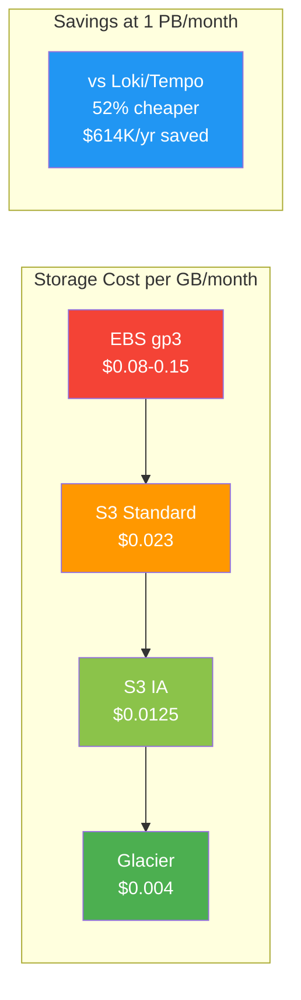

# Cost Estimates

## Pricing Basis (AWS us-east-1)

| Resource | Price |
|---|---|
| EBS gp3 | $0.08/GB/month |
| S3 Standard | $0.023/GB/month |
| S3 Infrequent Access | $0.0125/GB/month |
| S3 GET requests | $0.0004/1000 requests |
| EC2 m5.xlarge (4 vCPU, 16GB) | ~$140/month |
| EKS pod (1 vCPU, 2GB) | ~$30-40/month |

## Compression Ratios

All Parquet ratios are real-data benchmarked at ZSTD level 7 (default). See [ZSTD Compression Benchmark](./zstd-compression-benchmark.md) for methodology.

| Format | Ratio | Notes |
|---|---|---|
| VL native (LSM, logs) | ~70:1 | Stream dedup + inverted index + ZSTD (production measured) |
| VT native (traces) | ~47:1 | Structured span fields + index (production measured) |
| Parquet + ZSTD-7 (logs) | ~6.1:1 | Columnar + dictionary + ZSTD level 7 (real E2E data) |
| Parquet + ZSTD-7 (traces) | ~9.4:1 | Traces compress much better — structured fields achieve extreme columnar ratios |
| Loki (Snappy, logs) | ~3.5:1 | Row-oriented chunks, Snappy compression |
| Tempo (Snappy, traces) | ~3.5:1 | Block-oriented, Snappy compression |

## 250 GB/month Logs (Multi-AZ)

VL stored: ~4.5 GB/mo (~55x avg). Parquet stored: ~41 GB/mo (6.1x).

> **Hybrid model**: All data always written to S3 Parquet. EBS hot tier is an addition for sub-10ms queries on recent data.

| Retention | VL/VT EBS | Hybrid (1mo hot + ALL S3) | All-S3 Lakehouse | Loki+Tempo (full infra) |
|---|---|---|---|---|
| 1 month | $131/mo | $132/mo | $131/mo | $145/mo |
| 6 months | $133/mo | $136/mo | $135/mo | $160/mo |
| 1 year | $135/mo | $140/mo | $139/mo | $178/mo |
| 2 years | $138/mo | $148/mo | $147/mo | $214/mo |

At small scale, compute dominates — all options within ~10%. Loki+Tempo includes RF=3 cross-AZ replication and dual-system overhead.

## 500 GB/month Logs (Multi-AZ)

VL stored: ~9 GB/mo (~55x avg). Parquet stored: ~82 GB/mo (6.1x).

| Retention | VL/VT EBS | Hybrid (1mo hot + ALL S3) | All-S3 Lakehouse | Loki+Tempo (full infra) |
|---|---|---|---|---|
| 1 month | $132/mo | $134/mo | $132/mo | $151/mo |
| 6 months | $136/mo | $141/mo | $140/mo | $193/mo |
| 1 year | $140/mo | $149/mo | $148/mo | $241/mo |
| 2 years | $148/mo | $167/mo | $166/mo | $339/mo |

## 1 PB/month Logs (Multi-AZ)

VL stored: ~18.2 TB/mo (~55x avg). Parquet stored: ~164 TB/mo (6.1x). EBS includes 3 AZ replication.

> **Hybrid = full S3 archive + EBS hot month.** All data always goes to Lakehouse S3. EBS is additional for fast queries.

| Retention | VL/VT EBS (3 AZ) | Hybrid (1mo hot + ALL S3) | All-S3 Lakehouse | Loki+Tempo (full infra) |
|---|---|---|---|---|
| 3 months | $15,600/mo | $18,100/mo | $13,800/mo | $33,200/mo |
| 6 months | $28,700/mo | $29,400/mo | $25,000/mo | $60,100/mo |
| 1 year | $54,900/mo | $51,900/mo | $47,500/mo | $114,000/mo |
| 2 years | $107,200/mo | $96,900/mo | $92,600/mo | $221,700/mo |

> At 1 PB/month, storage dominates. Hybrid crosses below VL/VT EBS at ~8 months retained data because S3 ($0.023/GB) grows slower per-month than EBS ($0.08/GB × 3 AZ). At 2yr, hybrid saves $10,300/mo vs VL/VT EBS. Loki+Tempo includes full dual-system infrastructure: separate Loki + Tempo clusters, RF=3 cross-AZ replication ($0.01/GB × 2 replicas × ingest volume), compaction I/O, and dual compute stacks.

## Annual Savings Summary

Lakehouse Hybrid vs Loki+Tempo (full infrastructure, Lakehouse always cheaper):

| Scenario | 1yr Retention Savings | 2yr Retention Savings |
|---|---|---|
| 250 GB/mo (hybrid) | $456/yr (21%) | $792/yr (31%) |
| 500 GB/mo (hybrid) | $1,104/yr (43%) | $2,064/yr (51%) |
| 1 PB/mo (hybrid) | $745K/yr (54%) | $1.50M/yr (56%) |
| 1 PB/mo (standalone) | $798K/yr (58%) | $1.55M/yr (58%) |

Standalone Lakehouse vs Hybrid vs VL/VT EBS:

| Scenario | Standalone (cheapest) | Hybrid vs VL/VT EBS |
|---|---|---|
| 250 GB/mo, 1yr | $1,668/yr (saves 11% vs VL) | +$60/yr (4% more than VL) |
| 500 GB/mo, 1yr | $1,776/yr (saves 11% vs VL) | +$108/yr (6% more than VL) |
| 1 PB/mo, 1yr | $88,800/yr (saves 13% vs VL) | -$36,000/yr (**6% cheaper than VL**) |
| 1 PB/mo, 2yr | $175,200/yr (saves 14% vs VL) | -$123,600/yr (**10% cheaper than VL**) |

**Key**: Hybrid crosses below VL/VT EBS at ~8 months retention. At scale (1 PB/mo), the S3 cost advantage over 3-AZ EBS is dramatic. Standalone Lakehouse is cheapest at all scales and retention periods — the right choice when sub-10ms hot queries aren't needed.

## Why Lakehouse Despite VL/VT's Better Compression

VL/VT's 47-70x compression beats Parquet's 6.1-9.4x per-byte, but Lakehouse wins on total cost of ownership:

1. **S3 grows slower than EBS at scale**: S3 $0.023/GB vs EBS $0.08/GB × 3 AZ = $0.24/GB. Even with 9× worse compression, Lakehouse is cheaper per-raw-GB beyond ~8 months retention.
2. **No replication needed**: S3 provides 11-nines multi-AZ durability for free. VL/VT needs explicit replication across AZs (EBS × N). Loki/Tempo need RF=3 with cross-AZ transfer costs.
3. **No deduplication needed**: Each Lakehouse pod writes unique partitioned files. S3 PutObject is atomic. Loki/Tempo need compactor deduplication after WAL replays.
4. **Open Parquet format**: DuckDB, Spark, Trino, ClickHouse query cold data directly. No export needed.
5. **Glacier tiering**: S3 lifecycle rules move old data to IA ($0.0125/GB) or Glacier ($0.004/GB). At 3+ years, 27× cheaper per raw-GB than VL/VT 3-AZ EBS.
6. **Disaster recovery**: Complete cluster wipe = zero data loss. Manifest rebuilds from S3 listing.
7. **No EBS management at scale**: No volume sizing, IOPS provisioning, or snapshot management.
8. **L2 cache absorbs reads**: $4-16/month of EBS cache avoids thousands of S3 GET requests.
9. **Traces compress 2.7× better than Loki/Tempo**: 9.4x vs 3.5x — massive storage savings at scale.

## Recommendation

| Scenario | Recommendation |
|---|---|
| Cold-only, archive, analytics, compliance | Standalone Lakehouse (cheapest at all periods) |
| ≤ 8mo retention, sub-10ms queries needed | VL/VT EBS Only (cheapest with hot queries) |
| > 8mo retention, need hot+cold | Hybrid (crosses below VL/VT EBS, open format + DR) |
| 3yr+ retention | Hybrid + S3 lifecycle (Glacier = 27× cheaper than 3-AZ EBS) |
| Analytics on cold data | Lakehouse (DuckDB, Spark, Trino on open Parquet) |
| Loki/Tempo replacement | Lakehouse Hybrid (50%+ cheaper, no replication/dedup overhead) |
