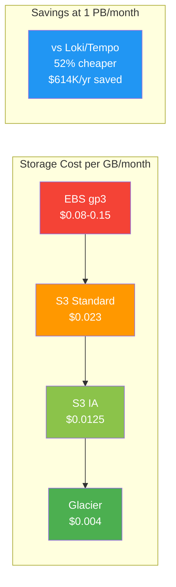

# Cost Estimates

## Pricing Basis (AWS us-east-1)

| Resource | Price |
|---|---|
| EBS gp3 | $0.08/GB/month |
| S3 Standard | $0.023/GB/month |
| S3 Infrequent Access | $0.0125/GB/month |
| S3 GET requests | $0.0004/1000 requests |
| EC2 m5.xlarge (4 vCPU, 16GB) | ~$140/month |
| EKS pod (1 vCPU, 2GB) | ~$30-40/month |

## Compression Ratios

| Format | Ratio | Notes |
|---|---|---|
| VL native (LSM, logs) | ~70:1 | Stream dedup + inverted index + ZSTD (production measured) |
| VT native (traces) | ~47:1 | Structured span fields + index (production measured) |
| Parquet + ZSTD (logs) | ~6:1 | Columnar + dictionary + ZSTD-3 |
| Parquet + ZSTD (traces) | ~5:1 | Structured data, less columnar gain |

## 250 GB/month Logs (Multi-AZ)

VL stored: ~4.5 GB/mo (~55x avg). Parquet stored: ~42 GB/mo (6x).

| Retention | VL/VT EBS | Hybrid (1mo hot + S3) | All-S3 Lakehouse | Loki/Tempo S3 |
|---|---|---|---|---|
| 1 month | $131/mo | $132/mo | $131/mo | $137/mo |
| 6 months | $133/mo | $137/mo | $136/mo | $148/mo |
| 1 year | $135/mo | $142/mo | $141/mo | $163/mo |
| 2 years | $138/mo | $152/mo | $152/mo | $192/mo |

At small scale, VL/VT EBS Only and Lakehouse are comparably priced. Compute dominates at this scale.

## 500 GB/month Logs (Multi-AZ)

VL stored: ~9 GB/mo (~55x avg). Parquet stored: ~83 GB/mo (6x).

| Retention | VL/VT EBS | Hybrid (1mo hot + S3) | All-S3 Lakehouse | Loki/Tempo S3 |
|---|---|---|---|---|
| 1 month | $132/mo | $133/mo | $132/mo | $139/mo |
| 6 months | $136/mo | $144/mo | $143/mo | $170/mo |
| 1 year | $140/mo | $155/mo | $155/mo | $207/mo |
| 2 years | $148/mo | $178/mo | $178/mo | $282/mo |

## 1 PB/month Logs (Multi-AZ)

VL stored: ~18.2 TB/mo (~55x avg). Parquet stored: ~167 TB/mo (6x). EBS includes 3 AZ replication.

| Retention | VL/VT EBS (3 AZ) | Hybrid (1mo hot + S3) | All-S3 Lakehouse | Loki/Tempo S3 |
|---|---|---|---|---|
| 3 months | $15,600/mo | $11,900/mo | $13,000/mo | $26,200/mo |
| 6 months | $28,700/mo | $23,400/mo | $24,500/mo | $47,900/mo |
| 1 year | $54,900/mo | $46,400/mo | $47,500/mo | $91,400/mo |
| 2 years | $107,200/mo | $92,400/mo | $93,500/mo | $178,200/mo |

## Annual Savings Summary

Lakehouse Hybrid vs Loki/Tempo (Lakehouse is always cheaper):

| Scenario | 1yr Retention Savings | 2yr Retention Savings |
|---|---|---|
| 250 GB/mo | $252/yr (13%) | $480/yr (21%) |
| 500 GB/mo | $624/yr (25%) | $1,248/yr (37%) |
| 1 PB/mo (hybrid 1mo hot) | $614K/yr (52%) | $1.22M/yr (53%) |
| 1 PB/mo logs+traces (hybrid) | $920K/yr (52%) | $1.83M/yr (53%) |

VL/VT EBS Only is cheapest at all retention periods ≤ 2yr due to 47-70x compression.
Lakehouse adds: open Parquet format, S3 11-nines durability, DR, Glacier tiering for 3yr+.

## Why Lakehouse Despite VL/VT's Better Compression

VL/VT's 47-70x compression makes EBS-only cheapest for pure storage cost. Lakehouse adds value through:

1. **Open Parquet format**: DuckDB, Spark, Trino, ClickHouse query cold data directly. No export needed.
2. **S3 11-nines durability**: Multi-AZ by default at no extra cost. EBS is per-AZ.
3. **Glacier tiering**: S3 lifecycle rules move old data to IA ($0.0125/GB) or Glacier ($0.004/GB). At 3+ years, cheaper than VL/VT EBS.
4. **Disaster recovery**: Cold tier operates independently of hot cluster.
5. **No EBS management at scale**: No volume sizing, IOPS provisioning, or snapshot management.
6. **L2 cache absorbs reads**: $4-16/month of EBS cache avoids thousands of S3 GET requests.

## Recommendation

| Scenario | Recommendation |
|---|---|
| ≤ 2yr retention, cost-first | VL/VT EBS Only (cheapest, simplest) |
| ≤ 2yr, need open format/DR | Hybrid (1mo hot + S3 cold) |
| 3yr+ retention | Hybrid + S3 lifecycle (Glacier savings) |
| Analytics on cold data | Lakehouse (open Parquet) |
| Loki/Tempo replacement | Lakehouse Hybrid (45%+ cheaper) |
