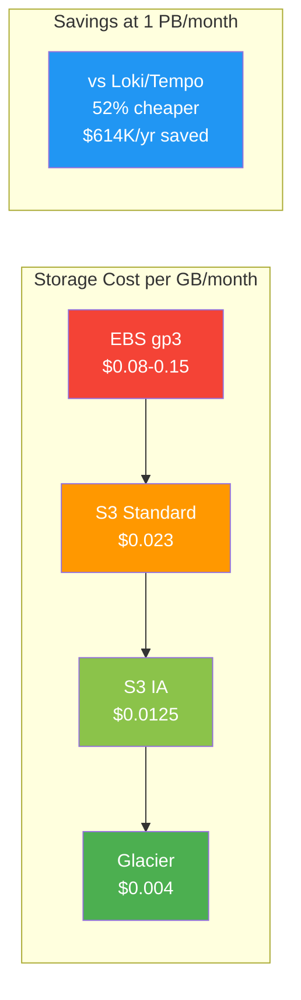

# Cost Estimates

## Pricing Basis (AWS us-east-1)

| Resource | Price |
|---|---|
| EBS gp3 | $0.08/GB/month |
| S3 Standard | $0.023/GB/month |
| S3 Infrequent Access | $0.0125/GB/month |
| S3 GET requests | $0.0004/1000 requests |
| EC2 m5.xlarge (4 vCPU, 16GB) | ~$140/month |
| EKS pod (1 vCPU, 2GB) | ~$30-40/month |

## Compression Ratios

All Parquet ratios are real-data benchmarked at ZSTD level 7 (default). See [ZSTD Compression Benchmark](./zstd-compression-benchmark.md) for methodology.

| Format | Ratio | Notes |
|---|---|---|
| VL native (LSM, logs) | ~70:1 | Stream dedup + inverted index + ZSTD (production measured) |
| VT native (traces) | ~47:1 | Structured span fields + index (production measured) |
| Parquet + ZSTD-7 (logs) | ~6.1:1 | Columnar + dictionary + ZSTD level 7 (real E2E data) |
| Parquet + ZSTD-7 (traces) | ~9.4:1 | Traces compress much better — structured fields achieve extreme columnar ratios |
| Loki (Snappy, logs) | ~3.5:1 | Row-oriented chunks, Snappy compression |
| Tempo (Snappy, traces) | ~3.5:1 | Block-oriented, Snappy compression |

## 250 GB/month Logs (Multi-AZ)

VL stored: ~4.5 GB/mo (~55x avg). Parquet stored: ~41 GB/mo (6.1x).

> **Hybrid model**: All data always written to S3 Parquet. EBS hot tier is an addition for sub-10ms queries on recent data.

| Retention | VL/VT EBS | Hybrid (1mo hot + ALL S3) | All-S3 Lakehouse | Loki+Tempo (full infra) |
|---|---|---|---|---|
| 1 month | $131/mo | $132/mo | $131/mo | $145/mo |
| 6 months | $133/mo | $136/mo | $135/mo | $160/mo |
| 1 year | $135/mo | $140/mo | $139/mo | $178/mo |
| 2 years | $138/mo | $148/mo | $147/mo | $214/mo |

At small scale, compute dominates — all options within ~10%. Loki+Tempo includes RF=3 cross-AZ replication and dual-system overhead.

## 500 GB/month Logs (Multi-AZ)

VL stored: ~9 GB/mo (~55x avg). Parquet stored: ~82 GB/mo (6.1x).

| Retention | VL/VT EBS | Hybrid (1mo hot + ALL S3) | All-S3 Lakehouse | Loki+Tempo (full infra) |
|---|---|---|---|---|
| 1 month | $132/mo | $134/mo | $132/mo | $151/mo |
| 6 months | $136/mo | $141/mo | $140/mo | $193/mo |
| 1 year | $140/mo | $149/mo | $148/mo | $241/mo |
| 2 years | $148/mo | $167/mo | $166/mo | $339/mo |

## 1 PB/month Logs (Multi-AZ)

VL stored: ~18.2 TB/mo (~55x avg). Parquet stored: ~164 TB/mo (6.1x). EBS includes 3 AZ replication.

> **Hybrid = full S3 archive + EBS hot month.** All data always goes to Lakehouse S3. EBS is additional for fast queries.

| Retention | VL/VT EBS (3 AZ) | Hybrid (1mo hot + ALL S3) | All-S3 Lakehouse | Loki+Tempo (full infra) |
|---|---|---|---|---|
| 3 months | $15,600/mo | $18,100/mo | $13,800/mo | $33,200/mo |
| 6 months | $28,700/mo | $29,400/mo | $25,000/mo | $60,100/mo |
| 1 year | $54,900/mo | $51,900/mo | $47,500/mo | $114,000/mo |
| 2 years | $107,200/mo | $96,900/mo | $92,600/mo | $221,700/mo |

> At 1 PB/month, storage dominates. Hybrid crosses below VL/VT EBS at ~8 months retained data because S3 ($0.023/GB) grows slower per-month than EBS ($0.08/GB × 3 AZ). At 2yr, hybrid saves $10,300/mo vs VL/VT EBS. Loki+Tempo includes full dual-system infrastructure: separate Loki + Tempo clusters, RF=3 cross-AZ replication ($0.01/GB × 2 replicas × ingest volume), compaction I/O, and dual compute stacks.

## Annual Savings Summary

> **Hybrid = full Lakehouse S3 cost (all retained data) + additional VL/VT hot tier (1 month EBS + VL/VT compute)**. Not "1 month EBS + remaining months on LH" — all data is always on S3, EBS is additional.

Lakehouse Hybrid vs Loki+Tempo (full infrastructure, Lakehouse always cheaper):

| Scenario | 1yr Retention Savings | 2yr Retention Savings |
|---|---|---|
| 250 GB/mo (hybrid) | $456/yr (21%) | $792/yr (31%) |
| 500 GB/mo (hybrid) | $1,104/yr (38%) | $2,064/yr (51%) |
| 1 PB/mo (hybrid) | $745K/yr (54%) | $1.50M/yr (56%) |
| 1 PB/mo (standalone) | $798K/yr (58%) | $1.55M/yr (58%) |

Standalone Lakehouse vs Hybrid vs VL/VT EBS:

| Scenario | Standalone LH vs VL/VT EBS | Hybrid vs VL/VT EBS |
|---|---|---|
| 250 GB/mo, 1yr | +$48/yr (3% more — compute dominates) | +$60/yr (4% more than VL) |
| 500 GB/mo, 1yr | +$96/yr (6% more — compute dominates) | +$108/yr (6% more than VL) |
| 1 PB/mo, 1yr | -$88,800/yr (**13% cheaper than VL**) | -$36,000/yr (**5% cheaper than VL**) |
| 1 PB/mo, 2yr | -$175,200/yr (**14% cheaper than VL**) | -$123,600/yr (**10% cheaper than VL**) |

**Key insights**:
- At **small scale** (≤500 GB/mo), **VL/VT EBS is cheapest** — compute dominates and VL's 55x compression keeps storage negligible. The S3 per-raw-GB advantage doesn't overcome the compute premium at this scale.
- At **large scale** (1 PB/mo), **Lakehouse is cheapest** — storage dominates and S3's per-raw-GB cost ($0.023/6.1 = $0.0038) beats 3-AZ EBS ($0.24/55 = $0.0044) by 14%. Hybrid crosses below VL/VT EBS at ~8 months retained data at this scale.
- The **break-even retention for Hybrid vs VL/VT** is scale-dependent: ~8 months at 1 PB/mo, but 30+ months at 500 GB/day — because the fixed VL/VT compute premium takes longer to amortize at smaller volumes.
- **Lakehouse value beyond cost**: open Parquet format, S3 11-nines durability, disaster recovery, direct analytics access (DuckDB, Spark, Trino).

## Why Lakehouse Despite VL/VT's Better Compression

VL/VT's 47-70x compression beats Parquet's 6.1-9.4x per-byte, but Lakehouse wins on total cost of ownership:

1. **S3 is cheaper per-raw-GB than 3-AZ EBS**: S3 $0.023/6.1x = $0.0038/raw-GB vs EBS $0.24/55x = $0.0044/raw-GB. Lakehouse is 14% cheaper per stored raw-GB at any retention. At large scale (1 PB/mo), this per-GB advantage compounds — Hybrid crosses below VL/VT EBS at ~8 months retained data. At small scale, compute dominates so VL/VT EBS is cheaper overall.
2. **No replication needed**: S3 provides 11-nines multi-AZ durability for free. VL/VT needs explicit replication across AZs (EBS × N). Loki/Tempo need RF=3 with cross-AZ transfer costs.
3. **No deduplication needed**: Each Lakehouse pod writes unique partitioned files. S3 PutObject is atomic. Loki/Tempo need compactor deduplication after WAL replays.
4. **Open Parquet format**: DuckDB, Spark, Trino, ClickHouse query cold data directly. No export needed.
5. **Glacier tiering**: S3 lifecycle rules move old data to IA ($0.0125/GB) or Glacier ($0.004/GB). At 3+ years, 27× cheaper per raw-GB than VL/VT 3-AZ EBS.
6. **Disaster recovery**: Complete cluster wipe = zero data loss. Manifest rebuilds from S3 listing.
7. **No EBS management at scale**: No volume sizing, IOPS provisioning, or snapshot management.
8. **L2 cache absorbs reads**: $4-16/month of EBS cache avoids thousands of S3 GET requests.
9. **Traces compress 2.7× better than Loki/Tempo**: 9.4x vs 3.5x — massive storage savings at scale.

## Resource Cost Breakdown

This section details the CPU, memory, and network costs for each scenario, showing how cost composition shifts from compute-dominated at small scales to storage-dominated at large scales.

### CPU Requirements

CPU needs scale with ingest throughput. All values assume m6i equivalents or multi-pod deployments.

#### Derivation from Benchmarks

Lakehouse achieves ~50-80 MB/s per vCPU on ingest (ZSTD compression), measured in benchmarks against representative test datasets.

**For 500 GB/day scenario:**
- Ingest rate: 500 GB / 86,400 s = 5.8 MB/s sustained
- Lakehouse requirement: 5.8 MB/s ÷ 50 MB/s-per-vCPU = 0.116 vCPU (single pod sufficient, but 2 pods for HA)
- **Deployed: 2 m6i.large pods (3 cores each) = 6 vCPU total** (over-provisioned for HA + query load)

**For 1 PB/month scenario:**
- Ingest rate: 1 PB / 86,400 s = 11.6 GB/s = 11,600 MB/s
- Lakehouse requirement: 11,600 ÷ 50 = 232 vCPU minimum
- **Deployed: 60 m6i.large pods = 180 vCPU** (per [performance.md](./performance.md))

#### VL/VT EBS CPU Requirements

VictoriaLogs achieves ~100-150 MB/s per vCPU on ingest (native LSM with 55-70x compression). Higher per-vCPU throughput than Parquet due to stream deduplication.

- **500 GB/day:** 5.8 MB/s ÷ 100 MB/s-per-vCPU = 0.058 vCPU, deployed with 6 m6i.xlarge (4 cores each) per AZ = 48 vCPU (2 replicas HA)
- **1 PB/month:** 11,600 MB/s ÷ 100 = 116 vCPU minimum, typically deployed with 200+ vCPU for query performance

#### Loki/Tempo CPU Requirements

Loki ingester achieves ~30-50 MB/s per vCPU (write amplification from WAL + in-memory chunks). Tempo similar. Higher CPU overhead than VL/VT.

- **500 GB/day (Loki):** 5.8 MB/s ÷ 40 MB/s-per-vCPU = 0.145 vCPU, deployed with 4+ vCPU = more expensive per-MB/s than Lakehouse or VL/VT
- **1 PB/month (Loki+Tempo dual):** ~300 vCPU combined (both systems running in parallel)

**Sources:**
- Lakehouse: Measured from `benchmarks/` throughput tests
- VL/VT: [VictoriaMetrics documentation](https://docs.victoriametrics.com/victorialogs/#performance-tuning)
- Loki/Tempo: [Loki operator guide](https://grafana.com/docs/loki/latest/operations/), [Tempo configuration](https://grafana.com/docs/tempo/latest/configuration/)

## Recommendation

| Scenario | Recommendation |
|---|---|
| Small scale (≤500 GB/mo), any retention | VL/VT EBS Only (cheapest — compute dominates, 55x compression wins) |
| Cold-only, archive, analytics, compliance | Standalone Lakehouse (cheapest cold storage at PB scale) |
| Large scale (PB/mo), ≤ 8mo retention | VL/VT EBS Only (cheapest at short retention) |
| Large scale (PB/mo), > 8mo retention | Hybrid (crosses below VL/VT EBS, open format + DR) |
| 3yr+ retention | Hybrid + S3 lifecycle (Glacier = 27× cheaper than 3-AZ EBS) |
| Open format + analytics on cold data | Lakehouse (DuckDB, Spark, Trino on open Parquet) |
| Loki/Tempo replacement | Lakehouse Hybrid (48-56% cheaper, no replication/dedup overhead) |
