# Cross-AZ Cost Optimization

> **Implementation Status**: AZ-aware routing is **enabled by default** since v0.7.0. AZ is auto-detected at startup via a fallback chain: `LAKEHOUSE_AZ` env var → AWS IMDSv2 → GCP metadata → Kubernetes node label API. Two modes: `preferred` (default, cross-AZ fallback) and `strict` (same-AZ only, requires `az_min_peers_per_az` same-AZ peers).

Victoria Lakehouse is designed to minimize or eliminate cross-AZ data transfer costs in multi-AZ deployments. This page documents the cost problem, the implementation architecture, and recommended configurations for achieving near-zero inter-AZ transfer costs.

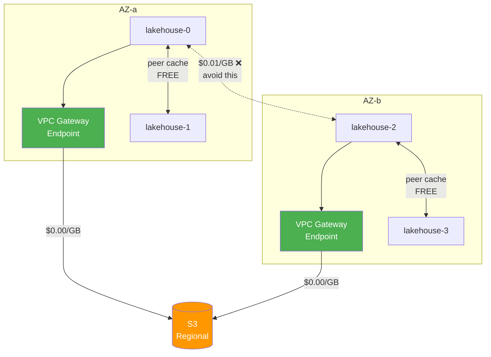

## The Cost Problem

AWS charges $0.01/GB per direction for data transferred between Availability Zones within the same region. For a system that reads terabytes from S3 daily, unoptimized cross-AZ traffic can add hundreds or thousands of dollars per month.

### Where Cross-AZ Costs Originate

S3 is a **regional service** — data transfer between S3 and EC2 within the same region is **$0.00/GB** regardless of AZ. The real costs come from inter-pod traffic and NAT Gateway processing:

| Traffic Source | Direction | Cost | Volume |
|---|---|---|---|
| S3 via NAT Gateway | Pod → NAT → S3 | $0.045/GB (NAT processing) | High (all S3 reads) |
| Peer cache (L3) | Pod ↔ Pod cross-AZ | $0.01/GB each way | Medium (cache misses) |
| Buffer bridge queries | Select → Insert cross-AZ | $0.01/GB each way | Low-Medium |
| S3 via VPC Gateway Endpoint | Pod → Gateway → S3 | **$0.00/GB** | Zero cost |
| S3 direct (same region) | Pod → S3 | **$0.00/GB** | Zero cost |

### Cost at Scale (Without VPC Gateway Endpoint, via NAT Gateway)

| Daily S3 Reads | NAT Gateway Cost | With VPC Gateway Endpoint | Monthly Savings |
|---|---|---|---|
| 100 GB/day | $135/mo | $0/mo | $135/mo |
| 1 TB/day | $1,350/mo | $0/mo | $1,350/mo |
| 10 TB/day | $13,500/mo | $0/mo | $13,500/mo |

### Cross-AZ Peer/Pod Traffic Cost

| Daily Cross-AZ Pod Traffic | Monthly Cost ($0.02/GB round-trip) |
|---|---|
| 10 GB/day | $6/mo |
| 100 GB/day | $60/mo |
| 1 TB/day | $600/mo |

## AZ Detection Architecture

At startup, each Lakehouse pod auto-detects which Availability Zone it is running in. The detection uses a fallback chain that works across AWS, GCP, and bare Kubernetes:

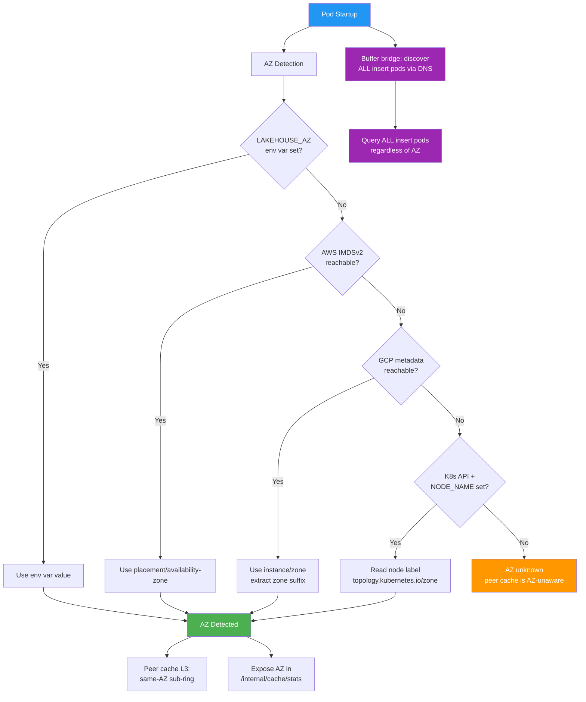

> **Key distinction**: AZ detection affects **peer cache (L3) routing only**. Buffer bridge always queries ALL insert pods across ALL AZs — it is independent of AZ detection because missing any insert pod means missing unflushed data.

### Peer Discovery and AZ Classification

Once each pod knows its own AZ, it discovers peer AZs by querying the `/internal/cache/stats` endpoint on each peer during the discovery loop:

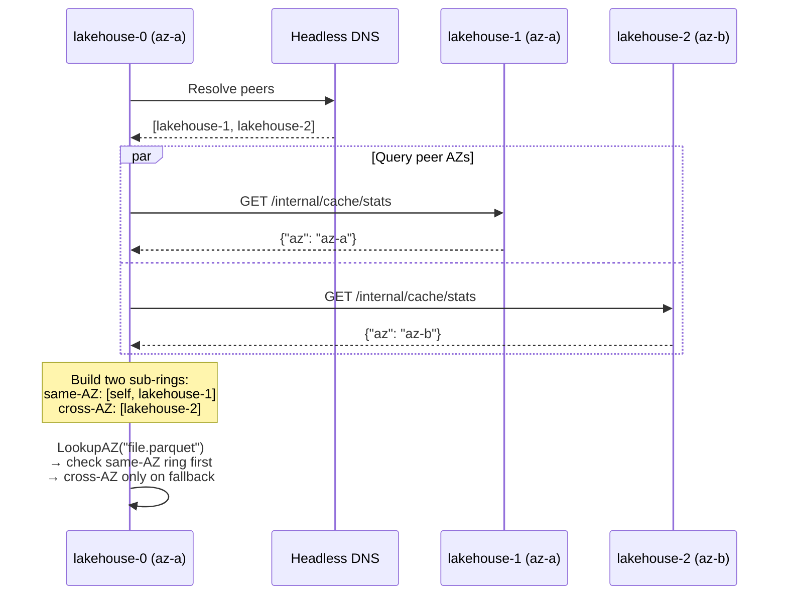

### Write Path — AZ-Aware Routing

The write path is where cross-AZ costs matter most. S3 reads/writes are free (regional service), but inter-pod traffic (peer cache L3, buffer bridge) crosses AZ boundaries at $0.01/GB:

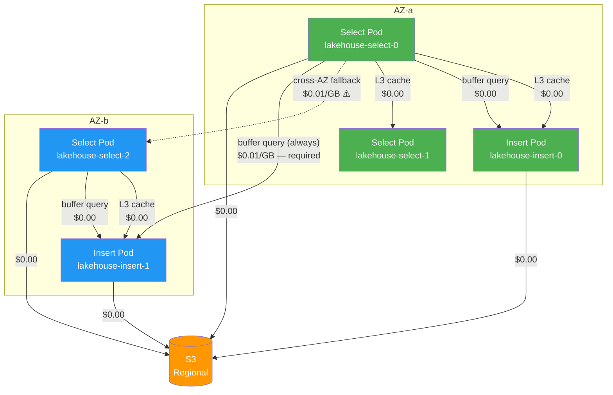

### Write Path Durability — AZ Failure Protection

The insert path buffers data in memory before flushing to S3 as Parquet. The **acknowledge mode** (`ack_mode`) controls when Lakehouse tells the client "your data is safe" — this single setting determines your durability guarantee for every failure scenario.

#### Choose Your Durability Level

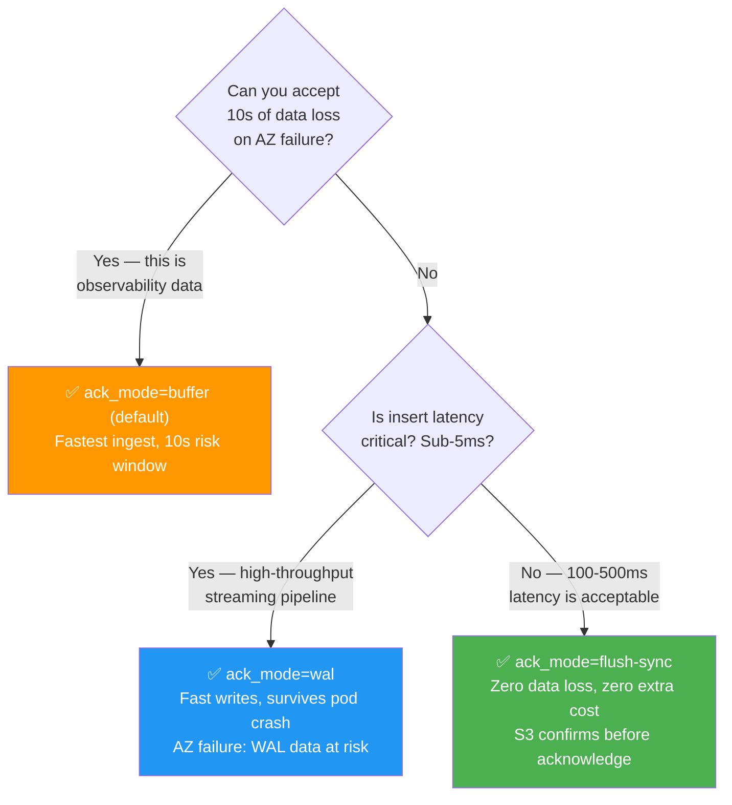

#### What Exactly Happens in Each Mode

**`buffer` (default) — Fastest ingest, accept small risk window**

```
Client POST → Buffer in memory → Respond 200 immediately → Async flush to S3 every 10s
```

Your data sits in memory for up to `flush-interval` (default 10s) before reaching S3. If the pod or AZ dies in that window, buffered data is lost. Once on S3, data has 11-nines durability across all AZs.

**`flush-sync` — Zero data loss, slightly higher latency**

```
Client POST → Buffer rows → Accumulate for linger-time → S3 PutObject → S3 confirms → Respond 200
```

Lakehouse does NOT send 200 until S3 confirms the write. If the pod dies at any point before 200, the client never received confirmation and retries to another pod — zero data loss. This is identical to a database commit: your data isn't "accepted" until it's durable.

**`wal` — Fast writes, survives pod crashes**

```
Client POST → Write to local EBS WAL → Respond 200 → Async buffer + flush to S3
```

Data is written to local disk (EBS) before acknowledging. Pod crash → restart → replay WAL → zero loss. However, EBS is single-AZ: if the AZ itself fails, WAL data is at risk until the AZ recovers.

#### What Can Go Wrong — Full Risk Matrix

| Failure | Probability | `buffer` Impact | `flush-sync` Impact | `wal` Impact |
|---|---|---|---|---|
| **Pod OOMKill / crash** | Common (weekly in large clusters) | Lose up to flush-interval of data | **Zero loss** — 200 never sent, client retries | **Zero loss** — WAL replayed on restart |
| **Pod eviction (preempt, rollout)** | Common (planned) | Graceful shutdown flushes buffer — **zero loss** | **Zero loss** | **Zero loss** |
| **Single AZ outage** | Rare (~1-2/year per region) | Lose buffered data on pods in that AZ | **Zero loss** — S3 is multi-AZ, unflushed data was never confirmed to client | Lose WAL data on EBS in failed AZ |
| **S3 outage** | Extremely rare (99.99% SLA) | Buffer fills up → backpressure → client retries | Flush blocked → client requests timeout → retries later | WAL continues to accept, replays when S3 returns |
| **Network partition (pod alive, S3 unreachable)** | Rare | Buffer accumulates, flushes when connectivity returns | Client requests timeout (no 200 until S3 reachable) | WAL accepts locally, flushes when S3 reachable |
| **Full cluster loss** | Extremely rare | Buffered data lost. All S3 data safe (100%). | **Zero loss of confirmed data.** In-flight unconfirmed requests retry. | WAL data lost. All S3 data safe. |
| **Disk / EBS failure** | Rare | No impact (buffer is in memory) | No impact (no local disk used) | WAL data on failed disk lost |

#### Quantifying the Risk — What "10 Seconds of Data" Actually Means

"Flush-interval of data" sounds abstract. Here's what you actually lose per insert pod crash, in concrete terms:

| Daily Ingest (total) | Per-Pod Ingest Rate (3 pods) | `buffer` 10s Risk | `buffer` 2s Risk | `flush-sync` Risk |
|---|---|---|---|---|
| 8 GB/day (250 GB/mo) | 0.03 MB/s | **0.3 MB** — ~150 log lines | 0.06 MB | **Zero** |
| 100 GB/day | 0.39 MB/s | **3.9 MB** — ~2,000 log lines | 0.78 MB | **Zero** |
| 500 GB/day | 1.9 MB/s | **19 MB** — ~10,000 log lines | 3.8 MB | **Zero** |
| 33 TB/day (1 PB/mo) | 128 MB/s | **1.3 GB** — ~650,000 log lines | 256 MB | **Zero** |

At small scale (≤100 GB/day), buffer-mode risk is negligible — a pod crash loses a few thousand log lines. At PB scale, 1.3 GB per pod is ~650,000 log lines and may matter for compliance or debugging.

**Important context**: this is per-pod, per-crash. In a 3-pod cluster, a single pod crash affects 1/3 of the ingest stream for the duration of the flush interval. The other 2 pods are unaffected.

#### How flush-sync Achieves Zero Loss — Step by Step

The mechanism is simple: **don't tell the client "OK" until the data is on S3.**

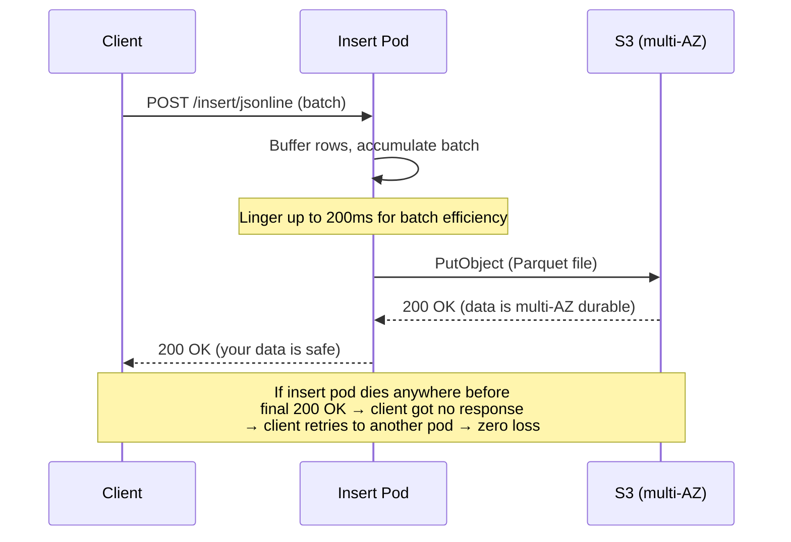

**AZ failure during this flow:**
- Pod dies **before** S3 PutObject → client never got 200 → client retries to another AZ → **zero loss**
- Pod dies **during** S3 PutObject → S3 is regional, PUT may or may not complete. Client never got 200 → retries → if PUT completed, manifest dedup handles it → **zero loss**
- Pod dies **after** S3 PutObject but before 200 → data is safe on S3. Client retries → duplicate → manifest dedup → **zero loss**

No WAL. No replication. No compactor. Just: "don't say OK until S3 has it."

#### Comparison: Lakehouse flush-sync vs Loki/Tempo RF=3

Both achieve zero data loss on AZ failure. The approach and cost are fundamentally different:

| Aspect | Lakehouse `flush-sync` | Loki/Tempo RF=3 |
|---|---|---|
| **How it works** | Delay HTTP 200 until S3 PutObject confirms | Replicate WAL to 3 ingesters across AZs before acknowledge |
| **Cross-AZ replication cost** | **$0** — S3 is regional, no cross-AZ transfer | **$0.01/GB × 2 replicas × ingest volume** |
| **Monthly cost at 500 GB/day** | **~$0.15/mo** (extra S3 PUTs only) | **~$300/mo** (cross-AZ WAL replication + 3× EBS) |
| **Dedup required** | No — manifest prevents double-counting | Yes — compactor CPU + S3 I/O for WAL replay dedup |
| **Extra infrastructure** | None — one config flag | Replication ring, compactor, WAL EBS volumes per ingester |
| **Insert latency** | +100-500ms (linger + S3 write) | +1-5ms (local WAL + async replication) |
| **Operational complexity** | Trivial — no new components | High — ring management, replication factor tuning, compaction |
| **Storage overhead** | **1×** — data written once to S3 | **3-5×** — WAL × 3 replicas + compaction rewrites |

**The trade-off is clear**: Lakehouse flush-sync adds 100-500ms insert latency but costs $0 and has zero operational complexity. Loki/Tempo RF=3 has lower latency but costs ~$300/mo at 500 GB/day and requires managing a replication ring + compactor.

For observability data where 100-500ms insert latency is acceptable (and it almost always is — the data is already seconds old by the time it's shipped from agents), flush-sync is strictly better.

#### Configuration

```yaml
# Helm values.yaml
lakehouseConfig:
  insert:
    ack_mode: "buffer"           # buffer (default) | flush-sync | wal
    # buffer mode settings:
    flush_interval: "10s"        # periodic flush to S3 (buffer mode)
    # flush-sync mode settings:
    flush_linger: "200ms"        # max time to accumulate rows before S3 write
    flush_max_rows: 5000         # force flush after N rows even if linger not reached
    # wal mode settings:
    wal_dir: "/data/lakehouse/wal"
```

```bash
# CLI — zero-loss mode
lakehouse --lakehouse.insert.ack-mode=flush-sync \
          --lakehouse.insert.flush-linger=200ms

# CLI — fast mode with shorter risk window
lakehouse --lakehouse.insert.ack-mode=buffer \
          --lakehouse.insert.flush-interval=2s

# CLI — WAL mode (survives pod crashes)
lakehouse --lakehouse.insert.ack-mode=wal \
          --lakehouse.insert.wal-dir=/data/lakehouse/wal
```

#### Recommendation

| Scenario | Mode | Why |
|---|---|---|
| **Observability logs/traces** | `buffer` (default) | Fastest. 10s of logs per pod crash is acceptable. This is the standard for all observability systems. |
| **Cost-sensitive, higher volume** | `buffer` with `flush_interval=2s` | Reduces risk window 5× with negligible extra S3 PUTs. Best latency/risk trade-off. |
| **Compliance, audit, security logs** | `flush-sync` | Zero data loss. $0 extra cost. 100-500ms latency is invisible for compliance pipelines. |
| **Financial / regulated data** | `flush-sync` | Audit trail requires every event preserved. flush-sync gives database-level durability. |
| **High-throughput streaming (sub-5ms SLA)** | `wal` | Fast local writes. Survives pod crashes (the common failure). AZ failure risk accepted as extremely rare. |
| **PB-scale, zero-loss mandate** | `flush-sync` | At PB scale, buffer mode risks 1+ GB per pod. flush-sync eliminates this at near-zero cost. |
| **Loki/Tempo replacement** | `flush-sync` | Matches Loki/Tempo RF=3 durability guarantee at $0 cross-AZ cost and zero operational complexity. |

#### AZ Failure Resilience — Write Availability Under Partial Outage

With `flush-sync`, accepted data is always safe (S3 multi-AZ). The remaining question: **can the surviving AZs keep accepting new data at full ingest rate?**

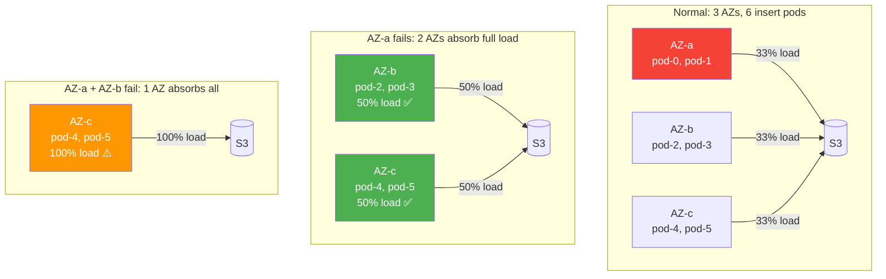

##### Capacity Planning

The rule is simple: **size each AZ's insert pods to handle the full ingest load divided by (total AZs minus max tolerated failures).**

| Setup | Tolerate | Pods per AZ needed | Total pods | Headroom per pod |
|---|---|---|---|---|
| 3 AZ, survive 1 AZ loss | 1 failure | `ceil(N / 2)` | N × 1.5 | 50% spare capacity |
| 3 AZ, survive 2 AZ loss | 2 failures | `N` (each AZ = full capacity) | N × 3 | 200% spare capacity |
| 4 AZ, survive 1 AZ loss | 1 failure | `ceil(N / 3)` | N × 1.33 | 33% spare capacity |
| 4 AZ, survive 2 AZ loss | 2 failures | `ceil(N / 2)` | N × 2 | 100% spare capacity |

Where `N` = pods needed to handle full ingest load (e.g., 3 pods for 500 GB/day).

**Example — 500 GB/day, 3 AZs, tolerate 1 AZ failure:**
- Need 3 pods for normal load → 2 pods per AZ → 6 total
- Normal: each pod handles 83 GB/day (33% of 500/2)
- AZ-a fails: 4 pods handle 500 GB/day → 125 GB/day each (50% headroom used)
- Cost: 6 × ~$35/mo EKS pod = $210/mo (vs $105/mo for 3 pods without resilience)

**Example — 1 PB/mo, 3 AZs, tolerate 1 AZ failure:**
- Need 6 pods for normal load → 4 pods per AZ → 12 total
- Normal: each pod handles ~2.8 TB/day
- AZ-a fails: 8 pods handle 33 TB/day → 4.1 TB/day each
- Cost: 12 × ~$140/mo m5.xlarge = $1,680/mo (vs $840/mo without resilience)

##### The Accepted-But-Not-Flushed Gap

This is the critical risk to understand: **in `buffer` and `wal` modes, the insert pod sends 200 OK BEFORE data reaches S3.** The client believes the data is safe, but it only exists in the pod's memory (buffer) or local disk (wal). If the AZ fails, that data is gone — and the client won't retry because it already got 200.

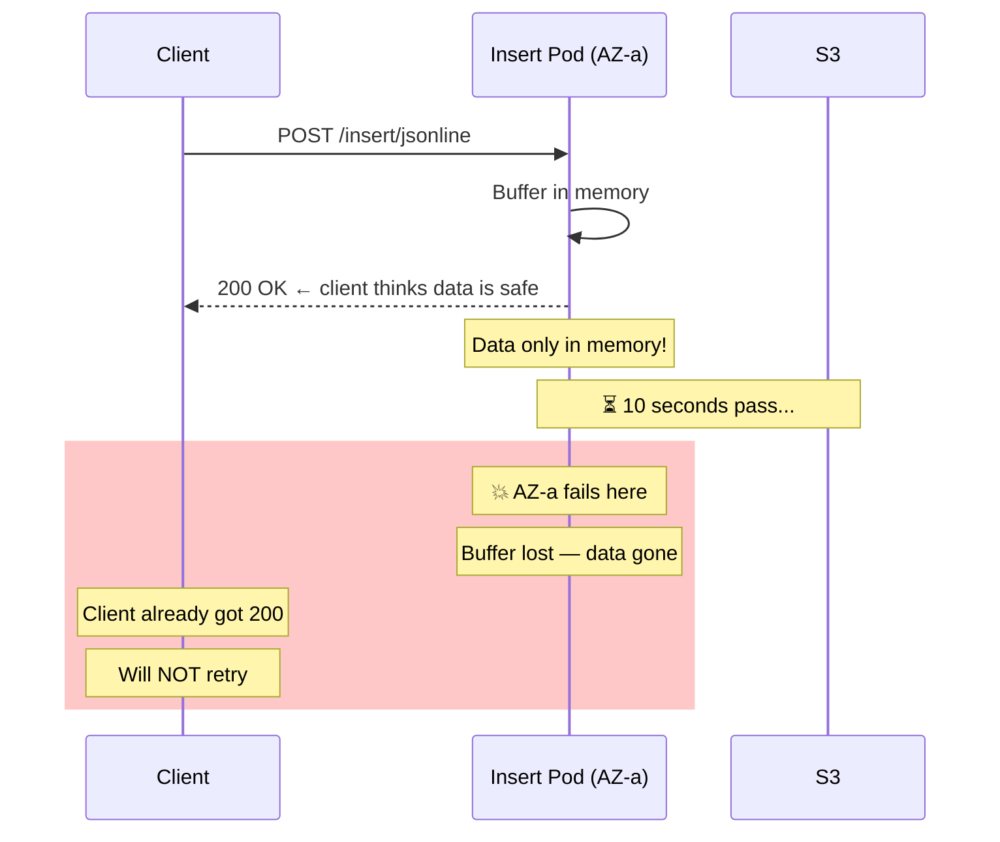

**This gap does NOT exist in `flush-sync` mode** — the 200 is only sent after S3 confirms. But for customers who need buffer-mode performance with near-zero data loss, there is an additional option:

##### Protecting Accepted Data — Three Approaches

| Approach | How It Works | Data at Risk | Latency | Cost | Complexity |
|---|---|---|---|---|---|
| **`flush-sync`** (recommended) | Don't send 200 until S3 PutObject confirms | **Zero** | +100-500ms | ~$0.15/mo | None — config flag |
| **`buffer` + async S3 WAL** | Send 200 after buffer, THEN async write raw batch to S3 as WAL file | **~50-150ms race window** (~0.1-0.3 MB/pod) | ~0ms (async) | ~$0.30/mo (WAL PUTs) | Low — background S3 writer |
| **`buffer` + shorter flush** | Send 200 after buffer, flush to S3 every 1-2s instead of 10s | **1-2s of data** (~2-4 MB/pod at 500GB/day) | ~0ms | ~$0.15/mo | None — config flag |

**`flush-sync`** eliminates the gap entirely and is the simplest. Use it unless you have a hard sub-5ms insert latency requirement.

**Async S3 WAL** is for customers who need both buffer-mode speed AND near-zero data loss:

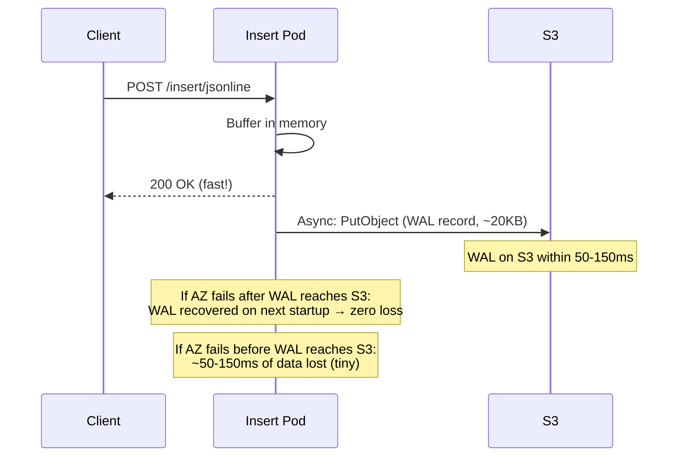

The race window (data accepted but WAL not yet on S3) is 50-150ms — at 500 GB/day ingest rate, that's ~0.1-0.3 MB per pod. Compared to buffer mode's 10-second window (19 MB), this is a 99% reduction in risk.

```yaml
# Async S3 WAL — near-zero risk with buffer-mode speed
lakehouseConfig:
  insert:
    ack_mode: "buffer"
    flush_interval: "10s"          # Parquet flush (unchanged)
    async_wal_enabled: true        # async WAL to S3 after each accepted batch
    async_wal_batch_linger: "50ms" # batch WAL writes for efficiency
```

##### What Protects Data at Each Stage

Data flows through four stages from client to S3. Here's what protects it at each point and what happens when an AZ fails:

```
Stage 1        Stage 2          Stage 3         Stage 4
Client  ──→  Network/LB  ──→  Insert Pod  ──→  S3
```

| Stage | What Happens on AZ Failure | Protection Mechanism | Complexity |
|---|---|---|---|
| **1. Client → Network** | Client detects connection failure | **Client retry** — all VL/VT-compatible clients retry on error. Load balancer health checks remove dead pods within seconds. | Built-in (HTTP) |
| **2. Network → Insert Pod** | Request in transit is lost | **Client retry** — no response received = client resends. TCP guarantees: no partial delivery without error. | Built-in (TCP/HTTP) |
| **3. In Insert Pod buffer** | Buffer lost with pod | **`flush-sync`** — 200 never sent, client retries → **zero loss**. **`buffer` + async WAL** — WAL on S3 recovers all but ~50-150ms → **near-zero loss**. **`buffer`** — data acknowledged but lost → **flush-interval of data lost**. **`wal`** — on local EBS, at risk if AZ fails → **WAL data lost**. | Config: `ack_mode` + `async_wal` |
| **4. Insert Pod → S3** | PutObject may or may not complete | **S3 is regional** — once PUT succeeds, data survives any AZ failure. If PUT fails, no 200 sent (flush-sync), client retries. | Built-in (S3) |

**Stage 3 is the only stage where configuration choices matter.** Every other stage is inherently protected by HTTP retry semantics and S3's regional architecture.

##### Decision Matrix: AZ Tolerance + Durability

| Goal | Configuration | Cost Premium | Data at Risk on AZ Failure | New Ingest Availability |
|---|---|---|---|---|
| **Best effort** (standard observability) | `ack_mode=buffer` | $0 | flush-interval per pod (19 MB at 500GB/day) | Wait for LB failover (~5-30s) |
| **Reduced risk** | `ack_mode=buffer` + `flush_interval=2s` | ~$0.15/mo | 2s per pod (~4 MB at 500GB/day) | Wait for LB failover |
| **Near-zero risk, fast ingest** | `ack_mode=buffer` + `async_wal=true` | ~$0.30/mo | ~0.1-0.3 MB per pod (50-150ms race) | Wait for LB failover |
| **Zero data loss** | `ack_mode=flush-sync` | ~$0.15/mo | **Zero** — 200 only after S3 | Wait for LB failover, surviving pods may be overloaded |
| **Zero loss + HA** | `flush-sync` + over-provision (N-1 AZ) | +50% pod cost | **Zero** | Full throughput maintained |
| **Zero loss + multi-AZ HA** | `flush-sync` + over-provision (N-2 AZ) | +200% pod cost | **Zero** | Full throughput through 2 AZ failures |

##### Helm Configuration for AZ-Resilient Insert

```yaml
# 3 AZ, tolerate 1 AZ failure, zero data loss
lakehouseConfig:
  insert:
    ack_mode: "flush-sync"
    flush_linger: "200ms"

insert:
  replicaCount: 6              # 2 per AZ (over-provisioned for N-1)
  topologySpreadConstraints:
    - maxSkew: 1
      topologyKey: topology.kubernetes.io/zone
      whenUnsatisfiable: DoNotSchedule
      labelSelector:
        matchLabels:
          app.kubernetes.io/component: insert
  resources:
    requests:
      cpu: "1"
      memory: "2Gi"
    limits:
      cpu: "2"
      memory: "4Gi"
```

This ensures: pods spread evenly across AZs (`maxSkew: 1`), scheduler won't place 2 pods in the same AZ if another AZ has 0 (`DoNotSchedule`), and each pod has headroom for 1.5× normal load.

##### AZ Failure Lifecycle — From Failure to Recovery

This section traces the complete lifecycle: what happens when an AZ fails, how data is protected during the outage, and how the system recovers when the AZ comes back — including how duplicates are prevented.

**Phase 1: AZ Failure**

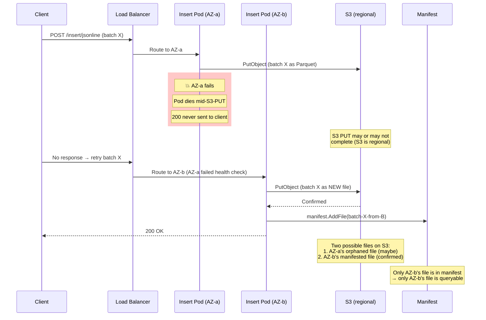

**Key outcomes:**
- **Client data safe**: client only got 200 after AZ-b confirmed S3 write
- **No query duplicates**: manifest only contains AZ-b's file. AZ-a's orphaned file (if it completed) is on S3 but NOT in manifest → invisible to queries
- **Zero coordination needed**: AZ-b doesn't know about AZ-a's failed write. It doesn't need to. Each insert pod operates independently.

**Phase 2: During Outage — Surviving AZs Handle All Traffic**

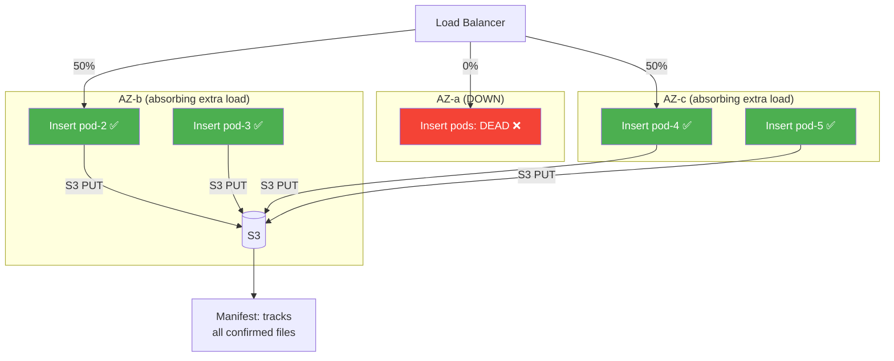

- All new data flows to AZ-b/c insert pods
- Each S3 write is confirmed → added to manifest → queryable
- Select pods query data from manifest (all data on S3, regardless of which AZ wrote it)
- **No data gaps in queries** — S3 is regional, readable from any AZ

**Phase 3: AZ Recovers**

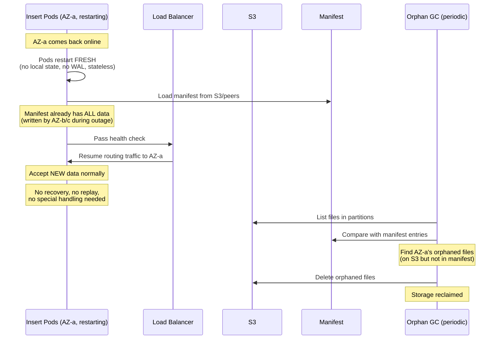

**Why this is so simple:**
1. **Insert pods are stateless** — restart fresh, no state to recover, no WAL to replay
2. **Manifest is the source of truth** — all data written during outage is already in manifest
3. **No dedup needed at query time** — orphaned files from AZ-a are not in manifest → not queried
4. **Orphan cleanup is background** — periodic GC compares S3 files vs manifest, deletes orphans
5. **No coordination between insert pods** — each pod writes independently to S3, manifest tracks everything

##### Why No Duplicates

The dedup question resolves itself through the manifest architecture:

| Scenario | AZ-a's file | AZ-b's file | Query result | Why |
|---|---|---|---|---|
| AZ-a PUT failed, client retried to AZ-b | Does not exist on S3 | In S3 + manifest ✅ | **One copy** | AZ-a's write never completed |
| AZ-a PUT completed, client retried to AZ-b | On S3, NOT in manifest | In S3 + manifest ✅ | **One copy** | Manifest only knows about AZ-b's file. AZ-a's file is orphaned. |
| AZ-a PUT completed AND manifest.AddFile() completed | In S3 + manifest | In S3 + manifest | **Two copies ⚠️** | Extremely rare: pod survived long enough for both S3 PUT and manifest update, then died before HTTP 200. |

The third scenario (both copies in manifest) is **extremely rare** — it requires the pod to complete S3 PutObject + manifest.AddFile() but die before sending HTTP 200. The timing window is microseconds (manifest update is in-memory). If it does happen:

**Compaction dedup handles it**: during the normal compaction merge of small files, rows are deduped by `(timestamp_ns, _stream_id, body)`. Identical rows from the two copies are merged into one. Zero operator intervention needed.

##### Orphan Garbage Collection

Orphaned files (on S3 but not in manifest) waste storage but don't affect query correctness. A periodic GC scan cleans them up:

```yaml
lakehouseConfig:
  gc:
    enabled: true
    interval: "6h"              # scan every 6 hours
    orphan_grace_period: "1h"   # don't delete files younger than 1h (may be in-flight)
```

**How GC works:**
1. List S3 files in each Hive partition
2. Compare with manifest entries
3. Files on S3 but not in manifest AND older than `orphan_grace_period` → delete
4. Cost: one S3 ListObjects per partition + one DeleteObject per orphan. Negligible.

**At-scale impact**: AZ failures produce ~1-10 orphaned files per event (one per in-flight batch per insert pod in the failed AZ). At 3 insert pods with 200ms linger, that's ~3 orphaned files × ~5 MB each = ~15 MB of orphaned storage per AZ failure event. GC reclaims this within hours.

##### Two-AZ Failure — Same Mechanism, Larger Scale

When 2 out of 3 AZs fail simultaneously:

1. **During failure**: one surviving AZ absorbs all traffic (if over-provisioned for N-2)
2. **Data safety**: flush-sync ensures zero loss — clients retry to the surviving AZ
3. **Orphaned files**: both failed AZs may leave orphans on S3 → GC cleans up
4. **Recovery**: both AZs restart fresh, manifest already has all data from the surviving AZ
5. **Duplicates**: same mechanism — manifest is source of truth, compaction handles the rare edge case

The only additional concern: **can one AZ handle the full ingest load?** This is the capacity planning question (see sizing table above). With N-2 over-provisioning, each AZ can handle 100% of traffic.

##### Summary: End-to-End AZ Failure Protection

| Component | Mechanism | Complexity |
|---|---|---|
| **Data safety** | `flush-sync` — 200 only after S3 confirms | Config flag |
| **Client failover** | HTTP retry — no 200 = resend to another AZ | Built-in (HTTP) |
| **LB failover** | Health check removes failed AZ pods | Built-in (K8s/LB) |
| **Load absorption** | Over-provisioned insert pods in surviving AZs | Capacity planning |
| **Dedup prevention** | Manifest is source of truth — orphans not queryable | Built-in (architecture) |
| **Orphan cleanup** | Periodic GC compares S3 vs manifest | Background job |
| **Edge-case dedup** | Compaction merges duplicate rows | Built-in (compaction) |
| **AZ recovery** | Pods restart stateless — no recovery logic needed | Zero — stateless |

**No replication protocol. No WAL replay. No ring management. No compactor dedup queue.** The entire AZ failure protection relies on three things that already exist: S3's regional durability, HTTP retry semantics, and the manifest's role as source of truth for queries.

##### Monitoring AZ Failure Readiness

| Metric | Alert Threshold | Meaning |
|---|---|---|
| `lakehouse_insert_pods_per_az` | < 2 | Not enough pods in an AZ for N-1 tolerance |
| `lakehouse_insert_buffer_rows` | > 80% of `flush_max_rows` | Pod approaching flush threshold — may need more pods |
| `lakehouse_insert_flush_duration_seconds` | p99 > 1s | S3 write latency too high — check network/S3 throttling |
| `kube_pod_status_ready` by AZ | < expected per AZ | AZ may be degrading |
| `lakehouse_gc_orphans_deleted_total` | > 0 after AZ event | Confirms GC is cleaning up orphaned files |
| `lakehouse_gc_orphan_bytes_total` | spike | Quantifies orphaned storage from AZ failure |

### Preferred vs Strict Mode

| Mode | Behavior | Cross-AZ Traffic | Cache Hit Rate |
|---|---|---|---|
| `preferred` (default) | Same-AZ first, cross-AZ fallback | Near-zero (5-10% of requests) | Higher (fleet-wide L3) |
| `strict` | Same-AZ only, no fallback | Zero | Lower (AZ-local L3 only) |

Strict mode requires `az_min_peers_per_az` same-AZ peers. If not met, it logs a warning and falls back to preferred mode to prevent data unavailability.

## Mitigation Strategies

### Strategy 1: VPC Gateway Endpoint for S3 (Required)

**Impact: Eliminates S3 data transfer costs entirely. Cost: $0.**

S3 data transfer within the same region is already free ($0.00/GB). The Gateway Endpoint's primary benefit is **avoiding NAT Gateway processing fees** ($0.045/GB), which are often the largest hidden cost in S3-heavy workloads. Without a Gateway Endpoint, all S3 traffic routes through your NAT Gateway at $0.045/GB — 4.5x more expensive than cross-AZ EC2 charges.

```bash
# Create VPC Gateway Endpoint for S3
aws ec2 create-vpc-endpoint \
  --vpc-id vpc-abc123 \
  --service-name com.amazonaws.us-east-1.s3 \
  --route-table-ids rtb-xyz789

# Verify: should show the endpoint in route tables
aws ec2 describe-vpc-endpoints --filters Name=service-name,Values=com.amazonaws.us-east-1.s3
```

EKS clusters should already have this if configured correctly. Verify:

```bash
kubectl exec -it lakehouse-0 -- wget -qO- http://169.254.169.254/latest/meta-data/network/interfaces/macs/ 2>/dev/null
# Traffic should NOT go through NAT Gateway
```

**Without a VPC Gateway Endpoint**, all S3 traffic routes through a NAT Gateway at **$0.045/GB**. At 1 TB/day of S3 reads, that's **$1,350/month** completely wasted on NAT processing.

### Strategy 2: AZ-Aware Peer Cache (Recommended)

**Impact: Eliminates cross-AZ peer cache traffic. Cost: $0 (configuration only).**

The peer cache (L3) uses a consistent hash ring to distribute cached Parquet files across the fleet. By default, the hash ring includes pods from all AZs, meaning a cache fetch may cross AZ boundaries at $0.01/GB each direction.

**AZ-aware peer cache** partitions the hash ring by AZ. Pods prefer same-AZ peers for cache lookups, only crossing AZ boundaries on same-AZ miss.

```yaml
# values.yaml
lakehouseConfig:
  peer:
    az_aware: true              # enable AZ-aware routing
    az_mode: "preferred"        # "preferred" or "strict"
    cross_az_fallback: true     # fall back to cross-AZ on local miss
    az_env_var: "LAKEHOUSE_AZ"  # env var override (auto-detect if empty)
    az_min_peers_per_az: 2      # min same-AZ peers for strict mode
```

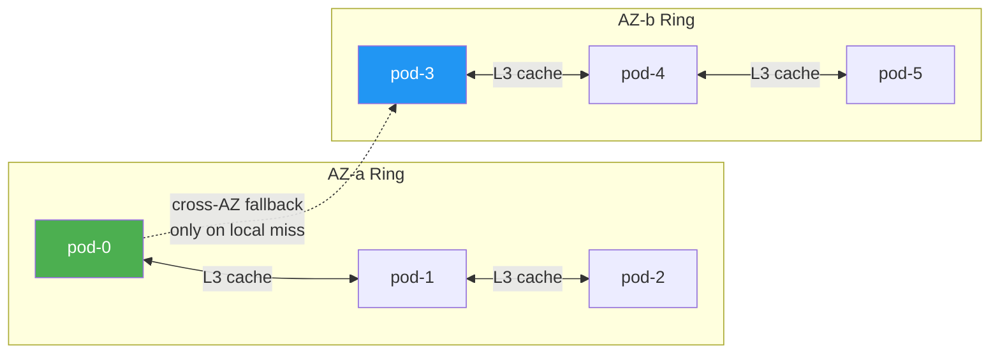

**How it works:**

1. Pod auto-detects its AZ at startup (env var → AWS IMDSv2 → GCP metadata → K8s node label API)
2. Peers report their AZ via `/internal/cache/stats` endpoint, queried during discovery loop
3. Hash ring maintains a same-AZ sub-ring alongside the full ring
4. Cache lookup sequence: L1 memory → L2 disk → **L3 same-AZ peer** → L3 cross-AZ peer (if fallback enabled) → S3
5. Cross-AZ fallback is configurable — disable for zero cross-AZ peer traffic at the cost of lower fleet-wide cache hit rate

**Cost impact at scale (6 pods, 2 per AZ, 50% L3 hit rate, 500 GB/day reads):**

| Configuration | Cross-AZ L3 Traffic | Monthly Cost |
|---|---|---|
| AZ-unaware (default) | ~167 GB/day | $100/mo |
| AZ-aware (with fallback) | ~20 GB/day | $12/mo |
| AZ-aware (no fallback) | 0 GB/day | $0/mo |

### Strategy 3: Buffer Bridge — Always Query ALL Insert Pods

**Buffer queries ALWAYS fan out to ALL insert pods across ALL AZs.** Unlike peer cache (L3) where AZ-aware routing avoids cross-AZ traffic, buffer queries MUST reach every insert pod to avoid missing unflushed data.

**Why**: With 3 AZs, each AZ has ~1/3 of insert pods. If buffer queries only went to same-AZ insert pods, select pods would miss 2/3 of recently buffered data — unacceptable for query completeness. The cross-AZ transfer cost is minimal (buffer data is typically seconds of unflushed rows, <1MB per query) compared to the cost of returning incomplete results.

**Cost impact**: At 10K buffer queries/day with ~100KB response per insert pod across 2 cross-AZ pods: 10K × 100KB × 2 = ~2 GB/day cross-AZ = **$0.60/month**. Negligible compared to the data completeness guarantee.

```yaml
lakehouseConfig:
  select:
    buffer_query_enabled: true    # query insert pods for unflushed data
    buffer_query_timeout: 2s      # per-pod timeout
    # NOTE: AZ-aware routing does NOT apply to buffer queries.
    # Buffer queries always reach all insert pods regardless of AZ.
    # Use az_aware/cross_az_fallback for peer cache (L3) only.
```

**Key distinction**: Peer cache (L3) can safely use AZ-aware routing because cached S3 data is also available directly from S3 — a cache miss just falls through to S3. Buffer data exists ONLY in the insert pod's memory — there is no fallback source. Missing an insert pod means missing data.

### Strategy 4: S3 Express One Zone (Optional, Advanced)

**Impact: Single-digit ms S3 latency, zero cross-AZ S3 traffic. Cost: Higher storage price.**

S3 Express One Zone stores data in a single AZ with up to 10x lower latency and 80% lower request costs than Standard S3. By co-locating S3 Express directory buckets with compute pods in the same AZ, you guarantee zero cross-AZ S3 traffic.

| Feature | S3 Standard | S3 Express One Zone |
|---|---|---|
| Storage cost | $0.023/GB/mo | $0.16/GB/mo (7x more) |
| GET request cost | $0.0004/1000 | $0.0002/1000 (50% less) |
| PUT request cost | $0.005/1000 | $0.0025/1000 (50% less) |
| First-byte latency | 50-150ms | 1-10ms (single-digit ms) |
| Requests/second | Standard limits | Up to 2M req/s per bucket |
| Durability | 11 nines (multi-AZ) | Single-AZ only |
| Cross-AZ transfer | $0.00 (regional service) | **$0.00 even from different AZs** |

**S3 Express One Zone has zero cross-AZ data transfer charges** — even when accessed from a compute instance in a different AZ than the directory bucket. This was confirmed in the AWS launch announcement. Combined with 10x lower latency and 50% lower request costs, it's ideal as a hot tier.

**Recommended hybrid approach:**

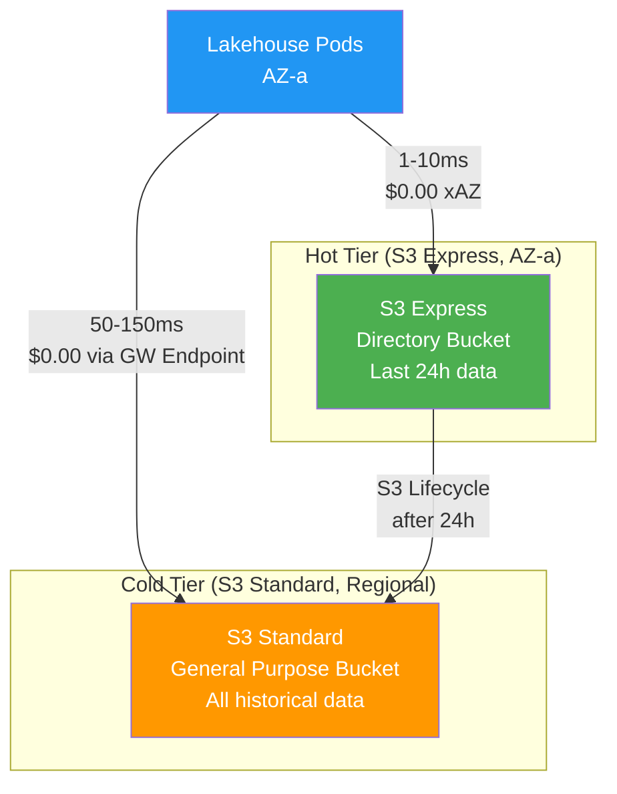

- **Insert path**: Flush Parquet files to S3 Express (1-10ms, same-AZ)
- **S3 Lifecycle rule**: Move files older than 24h to S3 Standard (multi-AZ durability)
- **Read path**: Hot queries hit S3 Express, cold queries hit S3 Standard via Gateway Endpoint

**Cost trade-off analysis (S3 Express as hot tier):**

| Stored Hot Data | Express Storage Cost | Standard Storage Cost | Express Request Savings | Net Monthly |
|---|---|---|---|---|
| 10 GB | $1.60/mo | $0.23/mo | ~$0.10/mo | +$1.27/mo (not worth it) |
| 100 GB | $16/mo | $2.30/mo | ~$1/mo | +$12.70/mo |
| 1 TB | $160/mo | $23/mo | ~$10/mo | +$127/mo |
| 10 TB | $1,600/mo | $230/mo | ~$100/mo | +$1,270/mo |

The 7x storage premium is offset by 50% request cost savings and 10x latency improvement. Use S3 Express only for the hot window (hours, not days) to keep stored volume small.

**When to use S3 Express:**
- Query latency is critical (SLA < 100ms for point lookups)
- Insert pods need fast flush confirmation
- You're willing to pay 7x storage for the hot window (usually 1-24h of data)

**When NOT to use S3 Express:**
- Cost-first deployments (Standard + Gateway Endpoint is already $0 transfer)
- Data durability is paramount (S3 Express is single-AZ)
- Cold storage / archival queries (latency tolerance is higher)

### Strategy 5: Topology-Aware Pod Scheduling (Recommended)

**Impact: Ensures related pods run in optimal AZ placement.**

Use Kubernetes topology spread constraints and pod affinity to control AZ placement:

```yaml
# Ensure even distribution across AZs
topologySpreadConstraints:
  - maxSkew: 1
    topologyKey: topology.kubernetes.io/zone
    whenUnsatisfiable: DoNotSchedule
    labelSelector:
      matchLabels:
        app: lakehouse-logs

# Co-locate insert and select pods in same AZs
affinity:
  podAffinity:
    preferredDuringSchedulingIgnoredDuringExecution:
      - weight: 100
        podAffinityTerm:
          labelSelector:
            matchLabels:
              app: lakehouse-logs
              role: insert
          topologyKey: topology.kubernetes.io/zone
```

This ensures:
- Insert and select pods share AZs (buffer bridge stays intra-AZ)
- Pods spread evenly across AZs for HA
- Peer cache has sufficient same-AZ peers

### Strategy 6: Minimize Request Count (Cost Optimization)

S3 GET request costs ($0.0004/1000) are low per request but add up at scale. Victoria Lakehouse already minimizes requests through its pruning cascade:

| Pruning Level | Requests Avoided |
|---|---|
| L1: Hot boundary suppression | 100% (no S3 access) |
| L2: Manifest fast path | 100% (no file opens) |
| L3: Row group stats | Skip non-matching row groups |
| L4: Bloom filters | Skip row groups without target value |
| L1/L2/L3 cache | Avoid repeated S3 GETs |

**Additional optimizations:**
- **Column projection**: Only read requested columns, not entire row groups
- **Metadata caching**: Cache Parquet footers and bloom filters in L1 (tiny, reused constantly)
- **Singleflight coalescence**: Deduplicate concurrent requests for the same S3 key
- **Read-ahead**: Prefetch adjacent row groups during sequential scans

## AutoMQ Comparison

[AutoMQ](https://www.automq.com/) is a Kafka replacement that achieves zero cross-AZ traffic through its S3-based shared storage architecture. While AutoMQ operates in a different domain (streaming/messaging vs. observability cold storage), several of their patterns are directly applicable.

### AutoMQ's Cross-AZ Elimination Techniques

| Technique | AutoMQ Approach | Lakehouse Equivalent |
|---|---|---|
| Shared S3 storage | S3 replaces inter-broker replication | S3 is already the storage layer |
| AZ-aware proxy | Proxy layer routes to same-AZ brokers | AZ-aware peer cache + buffer bridge |
| Read-only AZ replicas | Per-AZ replicas read from S3 on-demand | Per-AZ pods read from S3 via Gateway Endpoint |
| S3 erasure coding | S3 handles multi-AZ durability internally | Same — no app-level replication needed |
| CIDR-based AZ detection | Map client IP → AZ via CIDR blocks | Kubernetes downward API (`topology.kubernetes.io/zone`) |

### Key Differences

| Aspect | AutoMQ | Victoria Lakehouse |
|---|---|---|
| Domain | Streaming (Kafka replacement) | Observability cold storage |
| Write path cross-AZ | Proxy routes writes to same-AZ broker via S3 | Insert pods flush directly to S3 (no inter-pod write traffic) |
| Read path cross-AZ | Read-only replicas per AZ read from S3 | Each pod reads from S3 independently (Gateway Endpoint) |
| Inter-node traffic | Kafka replication eliminated by S3 | No replication needed (stateless read-only pods) |
| Cost model | Eliminates Kafka's 60-70% cross-AZ replication cost | Eliminates peer cache + buffer bridge cross-AZ traffic |

### What Lakehouse Adopts from AutoMQ's Approach

1. **AZ-aware routing**: Route internal traffic (peer cache, buffer bridge) to same-AZ peers first
2. **S3 as the cross-AZ bridge**: Instead of pods communicating across AZs, each pod reads from S3 independently — S3 handles multi-AZ internally
3. **CIDR/topology-based AZ detection**: Use Kubernetes labels to identify pod AZ
4. **Monitoring inter-AZ traffic**: Expose metrics for cross-AZ bytes transferred

## Recommended Configuration

### Zero Cross-AZ Target

For deployments where cross-AZ transfer cost must be exactly $0:

```yaml
# 1. VPC Gateway Endpoint (AWS infrastructure)
# Create via AWS CLI/Terraform — see Strategy 1

# 2. Helm values
lakehouseConfig:
  peer:
    az_aware: true
    az_mode: "strict"
    cross_az_fallback: false     # NEVER cross AZ for peer cache (L3)
    az_min_peers_per_az: 2       # require 2+ same-AZ peers
  select:
    buffer_query_enabled: true   # buffer queries always go to ALL insert pods
    # NOTE: buffer bridge is NOT AZ-filtered — must reach all insert pods
    # for complete data visibility. Only peer cache uses AZ-aware routing.

# 3. Pod scheduling (default in Helm chart)
select:
  topologySpreadConstraints:
    - maxSkew: 1
      topologyKey: topology.kubernetes.io/zone
      whenUnsatisfiable: DoNotSchedule
      labelSelector:
        matchLabels:
          app.kubernetes.io/component: select
```

**Trade-off**: Lower fleet-wide cache hit rate (each AZ has independent L3 cache). Compensate with larger L2 disk cache per pod. Buffer bridge cross-AZ traffic is negligible (~$0.60/mo at typical scales).

### Balanced Configuration (Recommended)

For most deployments — near-zero cross-AZ with good cache utilization:

```yaml
lakehouseConfig:
  peer:
    az_aware: true
    az_mode: "preferred"        # same-AZ first, cross-AZ fallback for peer cache
    cross_az_fallback: true
  select:
    buffer_query_enabled: true  # buffer queries always reach ALL insert pods
```

Cross-AZ traffic is limited to L3 peer cache misses (5-10% of requests) plus buffer bridge queries to cross-AZ insert pods (negligible volume — buffered data is small).

## Monitoring Cross-AZ Traffic

Victoria Lakehouse exposes metrics to track AZ-aware routing:

| Metric | Description |
|---|---|
| `lakehouse_peer_same_az_members` | Number of same-AZ peers in the ring |
| `lakehouse_peer_cross_az_members` | Number of cross-AZ peers in the ring |
| `lakehouse_peer_az_requests_total{az_type="same"}` | Peer cache requests routed to same-AZ |
| `lakehouse_peer_az_requests_total{az_type="cross"}` | Peer cache requests routed cross-AZ |
| `lakehouse_buffer_bridge_queries_total` | Buffer queries to insert pods (always all AZs) |
| `lakehouse_buffer_bridge_endpoints_queried` | Number of insert pods reached per buffer query |
| `lakehouse_s3_bytes_read_total` | Total bytes from S3 (free via Gateway Endpoint) |

The AZ is also exposed via `/internal/cache/stats` JSON endpoint (field `"az"`), used during peer discovery.

**Alert rule** for insufficient same-AZ peers:

```yaml
- alert: LakehouseLowSameAZPeers
  expr: lakehouse_peer_same_az_members < 2
  for: 5m
  labels:
    severity: warning
  annotations:
    summary: "Low same-AZ peer count"
    description: "Only {{ $value }} same-AZ peers available. Cross-AZ traffic may increase."

- alert: LakehouseHighCrossAZRate
  expr: >
    rate(lakehouse_peer_az_requests_total{az_type="cross"}[5m])
    / (rate(lakehouse_peer_az_requests_total{az_type="same"}[5m]) + rate(lakehouse_peer_az_requests_total{az_type="cross"}[5m]))
    > 0.1
  for: 15m
  labels:
    severity: warning
  annotations:
    summary: "High cross-AZ peer cache request rate"
    description: "More than 10% of peer cache requests are cross-AZ. Check AZ-aware routing configuration."
```

## Cost Summary

| Strategy | Implementation | Cross-AZ Savings | Complexity |
|---|---|---|---|
| VPC Gateway Endpoint | AWS infra (one-time) | **100% of S3 traffic** | Low |
| AZ-aware peer cache | Config change | 90-100% of L3 traffic | Low |
| Buffer bridge (always all AZs) | Default behavior | N/A (must query all for completeness) | None |
| S3 Express One Zone | Additional bucket + lifecycle | Latency improvement | Medium |
| Topology-aware scheduling | K8s manifests | Enables other strategies | Low |

**Bottom line**: VPC Gateway Endpoint + AZ-aware peer cache achieves near-zero cross-AZ costs with minimal effort. Buffer bridge intentionally queries all AZs for data completeness — the cross-AZ cost is negligible (~$0.60/mo). S3 Express One Zone is an advanced optimization for latency-sensitive deployments.

## Industry Case Studies

### Grafana Loki/Mimir — 77% Cross-AZ Reduction

Grafana achieved 77% cross-AZ cost reduction in Loki and Mimir through zone-aware replication:
- Each ingester belongs to a zone, and the distributor routes writes to prefer same-zone ingesters
- Query routing prefers same-zone replicas for reads
- The savings came from reducing inter-component traffic, not S3 access (S3 is already regional/free)

### Thanos — Zone-Aware Store Gateway

Thanos uses zone-aware store gateway replication, preferring local store instances for queries. This keeps query traffic within the same AZ.

### CockroachDB — Leaseholder Preferences

CockroachDB uses leaseholder preferences to keep reads local to specific AZs, avoiding cross-AZ round trips for read-heavy workloads.

### Apache Iceberg/Trino — Metadata Hot Tier

Iceberg's recommended pattern: keep metadata (manifest files) on S3 Express One Zone for fast scan planning, data files on Standard S3. This minimizes the latency-sensitive portion while keeping bulk storage cheap.

### Lessons for Victoria Lakehouse

All these systems converge on the same pattern:
1. **Route internal traffic (RPCs, cache, replication) to same-AZ first**
2. **Use S3/object storage as the cross-AZ bridge** — it handles multi-AZ internally
3. **Hot metadata/index on fast storage, cold data on cheap storage**
4. **Monitor and alert on cross-AZ traffic** to catch configuration drift

## Cloud Provider Comparison

While the strategies above focus on AWS, the concepts apply to other clouds:

| Strategy | AWS | GCP | Azure |
|---|---|---|---|
| Free S3/GCS/Blob access | VPC Gateway Endpoint | Private Google Access (free) | Private Endpoint (free) |
| Single-zone storage | S3 Express One Zone | Regional bucket (single-region) | ZRS/LRS |
| Cross-AZ transfer cost | $0.01/GB each way | $0.01/GB each way | $0.01/GB each way |
| AZ detection | `topology.kubernetes.io/zone` | Same | Same |
