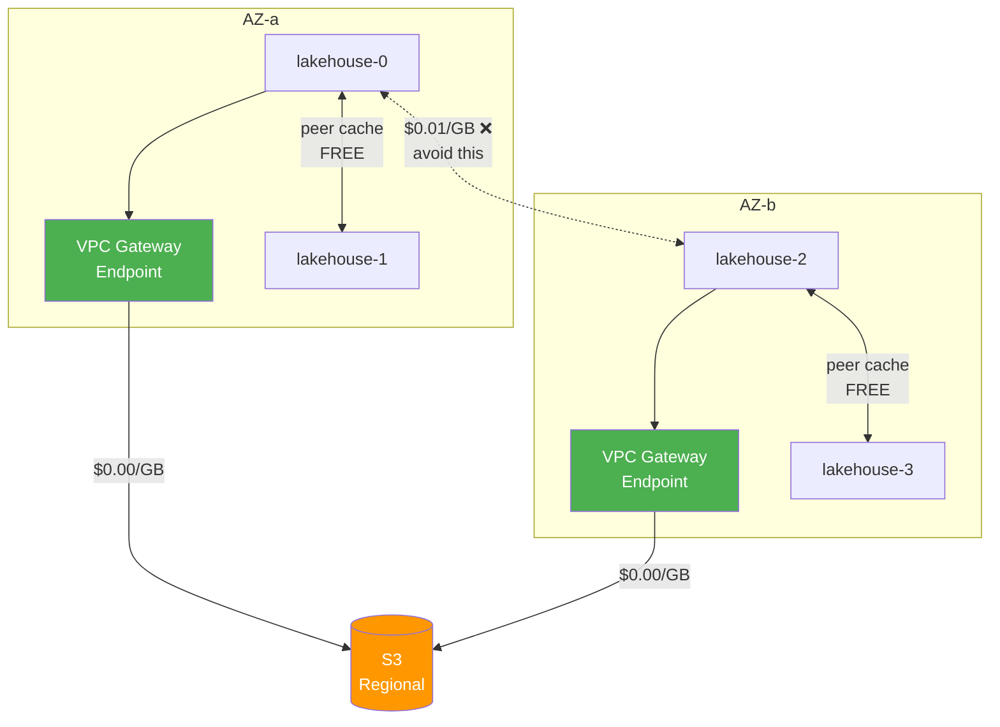
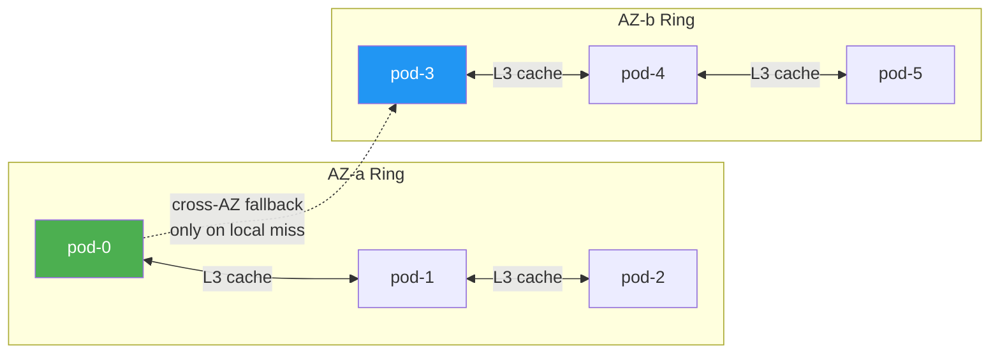
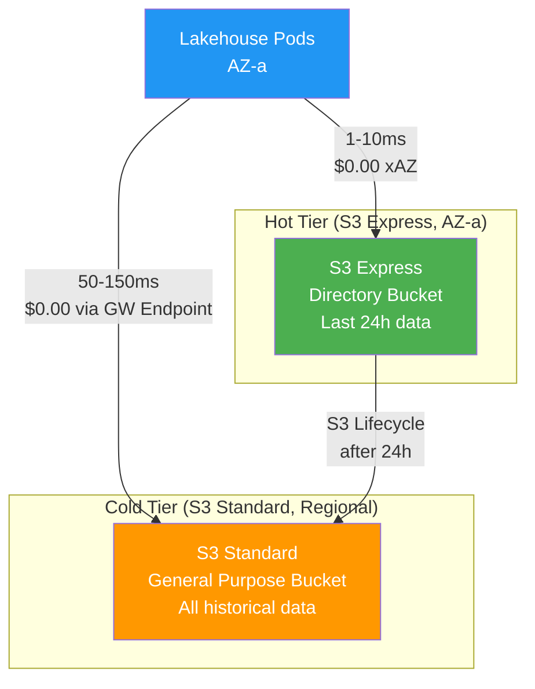

# Cross-AZ Cost Optimization

Victoria Lakehouse is designed to minimize or eliminate cross-AZ data transfer costs in AWS deployments. This page documents the cost problem, available mitigations, and recommended configurations for achieving near-zero inter-AZ transfer costs.



## The Cost Problem

AWS charges $0.01/GB per direction for data transferred between Availability Zones within the same region. For a system that reads terabytes from S3 daily, unoptimized cross-AZ traffic can add hundreds or thousands of dollars per month.

### Where Cross-AZ Costs Originate

S3 is a **regional service** — data transfer between S3 and EC2 within the same region is **$0.00/GB** regardless of AZ. The real costs come from inter-pod traffic and NAT Gateway processing:

| Traffic Source | Direction | Cost | Volume |
|---|---|---|---|
| S3 via NAT Gateway | Pod → NAT → S3 | $0.045/GB (NAT processing) | High (all S3 reads) |
| Peer cache (L3) | Pod ↔ Pod cross-AZ | $0.01/GB each way | Medium (cache misses) |
| Buffer bridge queries | Select → Insert cross-AZ | $0.01/GB each way | Low-Medium |
| S3 via VPC Gateway Endpoint | Pod → Gateway → S3 | **$0.00/GB** | Zero cost |
| S3 direct (same region) | Pod → S3 | **$0.00/GB** | Zero cost |

### Cost at Scale (Without VPC Gateway Endpoint, via NAT Gateway)

| Daily S3 Reads | NAT Gateway Cost | With VPC Gateway Endpoint | Monthly Savings |
|---|---|---|---|
| 100 GB/day | $135/mo | $0/mo | $135/mo |
| 1 TB/day | $1,350/mo | $0/mo | $1,350/mo |
| 10 TB/day | $13,500/mo | $0/mo | $13,500/mo |

### Cross-AZ Peer/Pod Traffic Cost

| Daily Cross-AZ Pod Traffic | Monthly Cost ($0.02/GB round-trip) |
|---|---|
| 10 GB/day | $6/mo |
| 100 GB/day | $60/mo |
| 1 TB/day | $600/mo |

## Mitigation Strategies

### Strategy 1: VPC Gateway Endpoint for S3 (Required)

**Impact: Eliminates S3 data transfer costs entirely. Cost: $0.**

S3 data transfer within the same region is already free ($0.00/GB). The Gateway Endpoint's primary benefit is **avoiding NAT Gateway processing fees** ($0.045/GB), which are often the largest hidden cost in S3-heavy workloads. Without a Gateway Endpoint, all S3 traffic routes through your NAT Gateway at $0.045/GB — 4.5x more expensive than cross-AZ EC2 charges.

```bash
# Create VPC Gateway Endpoint for S3
aws ec2 create-vpc-endpoint \
  --vpc-id vpc-abc123 \
  --service-name com.amazonaws.us-east-1.s3 \
  --route-table-ids rtb-xyz789

# Verify: should show the endpoint in route tables
aws ec2 describe-vpc-endpoints --filters Name=service-name,Values=com.amazonaws.us-east-1.s3
```

EKS clusters should already have this if configured correctly. Verify:

```bash
kubectl exec -it lakehouse-0 -- wget -qO- http://169.254.169.254/latest/meta-data/network/interfaces/macs/ 2>/dev/null
# Traffic should NOT go through NAT Gateway
```

**Without a VPC Gateway Endpoint**, all S3 traffic routes through a NAT Gateway at **$0.045/GB**. At 1 TB/day of S3 reads, that's **$1,350/month** completely wasted on NAT processing.

### Strategy 2: AZ-Aware Peer Cache (Recommended)

**Impact: Eliminates cross-AZ peer cache traffic. Cost: $0 (configuration only).**

The peer cache (L3) uses a consistent hash ring to distribute cached Parquet files across the fleet. By default, the hash ring includes pods from all AZs, meaning a cache fetch may cross AZ boundaries at $0.01/GB each direction.

**AZ-aware peer cache** partitions the hash ring by AZ. Pods prefer same-AZ peers for cache lookups, only crossing AZ boundaries on same-AZ miss.

```yaml
# values.yaml
lakehouseConfig:
  peer-cache:
    az-aware: true
    cross-az-fallback: true  # fall back to cross-AZ on local miss
    az-label: "topology.kubernetes.io/zone"
```



**How it works:**

1. Pod discovers its own AZ from Kubernetes downward API (`topology.kubernetes.io/zone`)
2. Hash ring is partitioned: same-AZ peers are primary, cross-AZ peers are fallback
3. Cache lookup sequence: L1 memory → L2 disk → **L3 same-AZ peer** → L3 cross-AZ peer → S3
4. Cross-AZ fallback is configurable — disable for zero cross-AZ peer traffic at the cost of lower fleet-wide cache hit rate

**Cost impact at scale (6 pods, 2 per AZ, 50% L3 hit rate, 500 GB/day reads):**

| Configuration | Cross-AZ L3 Traffic | Monthly Cost |
|---|---|---|
| AZ-unaware (default) | ~167 GB/day | $100/mo |
| AZ-aware (with fallback) | ~20 GB/day | $12/mo |
| AZ-aware (no fallback) | 0 GB/day | $0/mo |

### Strategy 3: AZ-Aware Buffer Bridge (Recommended)

**Impact: Eliminates cross-AZ buffer query traffic.**

When select pods query insert pods for unflushed data (`/internal/buffer/query`), they should prefer insert pods in the same AZ.

```yaml
lakehouseConfig:
  select:
    buffer-bridge:
      az-aware: true
      # Query same-AZ insert pods first, then cross-AZ if needed
      cross-az-fallback: true
```

Since buffer data is typically small (seconds of unflushed rows), the cost savings are modest but the latency improvement is significant (same-AZ: <1ms, cross-AZ: 1-5ms).

### Strategy 4: S3 Express One Zone (Optional, Advanced)

**Impact: Single-digit ms S3 latency, zero cross-AZ S3 traffic. Cost: Higher storage price.**

S3 Express One Zone stores data in a single AZ with up to 10x lower latency and 80% lower request costs than Standard S3. By co-locating S3 Express directory buckets with compute pods in the same AZ, you guarantee zero cross-AZ S3 traffic.

| Feature | S3 Standard | S3 Express One Zone |
|---|---|---|
| Storage cost | $0.023/GB/mo | $0.16/GB/mo (7x more) |
| GET request cost | $0.0004/1000 | $0.0002/1000 (50% less) |
| PUT request cost | $0.005/1000 | $0.0025/1000 (50% less) |
| First-byte latency | 50-150ms | 1-10ms (single-digit ms) |
| Requests/second | Standard limits | Up to 2M req/s per bucket |
| Durability | 11 nines (multi-AZ) | Single-AZ only |
| Cross-AZ transfer | $0.00 (regional service) | **$0.00 even from different AZs** |

**S3 Express One Zone has zero cross-AZ data transfer charges** — even when accessed from a compute instance in a different AZ than the directory bucket. This was confirmed in the AWS launch announcement. Combined with 10x lower latency and 50% lower request costs, it's ideal as a hot tier.

**Recommended hybrid approach:**



- **Insert path**: Flush Parquet files to S3 Express (1-10ms, same-AZ)
- **S3 Lifecycle rule**: Move files older than 24h to S3 Standard (multi-AZ durability)
- **Read path**: Hot queries hit S3 Express, cold queries hit S3 Standard via Gateway Endpoint

**Cost trade-off analysis (S3 Express as hot tier):**

| Stored Hot Data | Express Storage Cost | Standard Storage Cost | Express Request Savings | Net Monthly |
|---|---|---|---|---|
| 10 GB | $1.60/mo | $0.23/mo | ~$0.10/mo | +$1.27/mo (not worth it) |
| 100 GB | $16/mo | $2.30/mo | ~$1/mo | +$12.70/mo |
| 1 TB | $160/mo | $23/mo | ~$10/mo | +$127/mo |
| 10 TB | $1,600/mo | $230/mo | ~$100/mo | +$1,270/mo |

The 7x storage premium is offset by 50% request cost savings and 10x latency improvement. Use S3 Express only for the hot window (hours, not days) to keep stored volume small.

**When to use S3 Express:**
- Query latency is critical (SLA < 100ms for point lookups)
- Insert pods need fast flush confirmation
- You're willing to pay 7x storage for the hot window (usually 1-24h of data)

**When NOT to use S3 Express:**
- Cost-first deployments (Standard + Gateway Endpoint is already $0 transfer)
- Data durability is paramount (S3 Express is single-AZ)
- Cold storage / archival queries (latency tolerance is higher)

### Strategy 5: Topology-Aware Pod Scheduling (Recommended)

**Impact: Ensures related pods run in optimal AZ placement.**

Use Kubernetes topology spread constraints and pod affinity to control AZ placement:

```yaml
# Ensure even distribution across AZs
topologySpreadConstraints:
  - maxSkew: 1
    topologyKey: topology.kubernetes.io/zone
    whenUnsatisfiable: DoNotSchedule
    labelSelector:
      matchLabels:
        app: lakehouse-logs

# Co-locate insert and select pods in same AZs
affinity:
  podAffinity:
    preferredDuringSchedulingIgnoredDuringExecution:
      - weight: 100
        podAffinityTerm:
          labelSelector:
            matchLabels:
              app: lakehouse-logs
              role: insert
          topologyKey: topology.kubernetes.io/zone
```

This ensures:
- Insert and select pods share AZs (buffer bridge stays intra-AZ)
- Pods spread evenly across AZs for HA
- Peer cache has sufficient same-AZ peers

### Strategy 6: Minimize Request Count (Cost Optimization)

S3 GET request costs ($0.0004/1000) are low per request but add up at scale. Victoria Lakehouse already minimizes requests through its pruning cascade:

| Pruning Level | Requests Avoided |
|---|---|
| L1: Hot boundary suppression | 100% (no S3 access) |
| L2: Manifest fast path | 100% (no file opens) |
| L3: Row group stats | Skip non-matching row groups |
| L4: Bloom filters | Skip row groups without target value |
| L1/L2/L3 cache | Avoid repeated S3 GETs |

**Additional optimizations:**
- **Column projection**: Only read requested columns, not entire row groups
- **Metadata caching**: Cache Parquet footers and bloom filters in L1 (tiny, reused constantly)
- **Singleflight coalescence**: Deduplicate concurrent requests for the same S3 key
- **Read-ahead**: Prefetch adjacent row groups during sequential scans

## AutoMQ Comparison

[AutoMQ](https://www.automq.com/) is a Kafka replacement that achieves zero cross-AZ traffic through its S3-based shared storage architecture. While AutoMQ operates in a different domain (streaming/messaging vs. observability cold storage), several of their patterns are directly applicable.

### AutoMQ's Cross-AZ Elimination Techniques

| Technique | AutoMQ Approach | Lakehouse Equivalent |
|---|---|---|
| Shared S3 storage | S3 replaces inter-broker replication | S3 is already the storage layer |
| AZ-aware proxy | Proxy layer routes to same-AZ brokers | AZ-aware peer cache + buffer bridge |
| Read-only AZ replicas | Per-AZ replicas read from S3 on-demand | Per-AZ pods read from S3 via Gateway Endpoint |
| S3 erasure coding | S3 handles multi-AZ durability internally | Same — no app-level replication needed |
| CIDR-based AZ detection | Map client IP → AZ via CIDR blocks | Kubernetes downward API (`topology.kubernetes.io/zone`) |

### Key Differences

| Aspect | AutoMQ | Victoria Lakehouse |
|---|---|---|
| Domain | Streaming (Kafka replacement) | Observability cold storage |
| Write path cross-AZ | Proxy routes writes to same-AZ broker via S3 | Insert pods flush directly to S3 (no inter-pod write traffic) |
| Read path cross-AZ | Read-only replicas per AZ read from S3 | Each pod reads from S3 independently (Gateway Endpoint) |
| Inter-node traffic | Kafka replication eliminated by S3 | No replication needed (stateless read-only pods) |
| Cost model | Eliminates Kafka's 60-70% cross-AZ replication cost | Eliminates peer cache + buffer bridge cross-AZ traffic |

### What Lakehouse Adopts from AutoMQ's Approach

1. **AZ-aware routing**: Route internal traffic (peer cache, buffer bridge) to same-AZ peers first
2. **S3 as the cross-AZ bridge**: Instead of pods communicating across AZs, each pod reads from S3 independently — S3 handles multi-AZ internally
3. **CIDR/topology-based AZ detection**: Use Kubernetes labels to identify pod AZ
4. **Monitoring inter-AZ traffic**: Expose metrics for cross-AZ bytes transferred

## Recommended Configuration

### Zero Cross-AZ Target

For deployments where cross-AZ transfer cost must be exactly $0:

```yaml
# 1. VPC Gateway Endpoint (AWS infrastructure)
# Create via AWS CLI/Terraform — see Strategy 1

# 2. Helm values
lakehouseConfig:
  peer-cache:
    az-aware: true
    cross-az-fallback: false  # NEVER cross AZ for cache
    az-label: "topology.kubernetes.io/zone"
  select:
    buffer-bridge:
      az-aware: true
      cross-az-fallback: false

# 3. Pod scheduling
topologySpreadConstraints:
  - maxSkew: 1
    topologyKey: topology.kubernetes.io/zone
    whenUnsatisfiable: DoNotSchedule
```

**Trade-off**: Lower fleet-wide cache hit rate (each AZ has independent L3 cache). Compensate with larger L2 disk cache per pod.

### Balanced Configuration (Recommended)

For most deployments — near-zero cross-AZ with good cache utilization:

```yaml
lakehouseConfig:
  peer-cache:
    az-aware: true
    cross-az-fallback: true  # allow cross-AZ on local miss
    az-label: "topology.kubernetes.io/zone"
  select:
    buffer-bridge:
      az-aware: true
      cross-az-fallback: true
```

Cross-AZ traffic is limited to L3 cache misses that hit a cross-AZ peer before falling through to S3. At typical cache hit rates, this is 5-10% of total traffic.

## Monitoring Cross-AZ Traffic

Victoria Lakehouse exposes metrics to track cross-AZ data transfer:

| Metric | Description |
|---|---|
| `lakehouse_peer_cache_bytes_total{az="same"}` | Bytes transferred to same-AZ peers |
| `lakehouse_peer_cache_bytes_total{az="cross"}` | Bytes transferred to cross-AZ peers |
| `lakehouse_buffer_bridge_bytes_total{az="same"}` | Buffer bridge bytes, same-AZ |
| `lakehouse_buffer_bridge_bytes_total{az="cross"}` | Buffer bridge bytes, cross-AZ |
| `lakehouse_s3_bytes_downloaded_total` | Total bytes from S3 (free via Gateway Endpoint) |

**Alert rule** for unexpected cross-AZ traffic:

```yaml
- alert: LakehouseCrossAZTrafficHigh
  expr: rate(lakehouse_peer_cache_bytes_total{az="cross"}[5m]) > 10e6  # 10 MB/s
  for: 15m
  labels:
    severity: warning
  annotations:
    summary: "High cross-AZ peer cache traffic"
    description: "Cross-AZ peer cache traffic exceeds 10 MB/s. Check AZ-aware routing configuration."
```

## Cost Summary

| Strategy | Implementation | Cross-AZ Savings | Complexity |
|---|---|---|---|
| VPC Gateway Endpoint | AWS infra (one-time) | **100% of S3 traffic** | Low |
| AZ-aware peer cache | Config change | 90-100% of L3 traffic | Low |
| AZ-aware buffer bridge | Config change | 90-100% of buffer traffic | Low |
| S3 Express One Zone | Additional bucket + lifecycle | Latency improvement | Medium |
| Topology-aware scheduling | K8s manifests | Enables other strategies | Low |

**Bottom line**: VPC Gateway Endpoint + AZ-aware peer cache achieves near-zero cross-AZ costs with minimal effort. S3 Express One Zone is an advanced optimization for latency-sensitive deployments.

## Industry Case Studies

### Grafana Loki/Mimir — 77% Cross-AZ Reduction

Grafana achieved 77% cross-AZ cost reduction in Loki and Mimir through zone-aware replication:
- Each ingester belongs to a zone, and the distributor routes writes to prefer same-zone ingesters
- Query routing prefers same-zone replicas for reads
- The savings came from reducing inter-component traffic, not S3 access (S3 is already regional/free)

### Thanos — Zone-Aware Store Gateway

Thanos uses zone-aware store gateway replication, preferring local store instances for queries. This keeps query traffic within the same AZ.

### CockroachDB — Leaseholder Preferences

CockroachDB uses leaseholder preferences to keep reads local to specific AZs, avoiding cross-AZ round trips for read-heavy workloads.

### Apache Iceberg/Trino — Metadata Hot Tier

Iceberg's recommended pattern: keep metadata (manifest files) on S3 Express One Zone for fast scan planning, data files on Standard S3. This minimizes the latency-sensitive portion while keeping bulk storage cheap.

### Lessons for Victoria Lakehouse

All these systems converge on the same pattern:
1. **Route internal traffic (RPCs, cache, replication) to same-AZ first**
2. **Use S3/object storage as the cross-AZ bridge** — it handles multi-AZ internally
3. **Hot metadata/index on fast storage, cold data on cheap storage**
4. **Monitor and alert on cross-AZ traffic** to catch configuration drift

## Cloud Provider Comparison

While the strategies above focus on AWS, the concepts apply to other clouds:

| Strategy | AWS | GCP | Azure |
|---|---|---|---|
| Free S3/GCS/Blob access | VPC Gateway Endpoint | Private Google Access (free) | Private Endpoint (free) |
| Single-zone storage | S3 Express One Zone | Regional bucket (single-region) | ZRS/LRS |
| Cross-AZ transfer cost | $0.01/GB each way | $0.01/GB each way | $0.01/GB each way |
| AZ detection | `topology.kubernetes.io/zone` | Same | Same |
