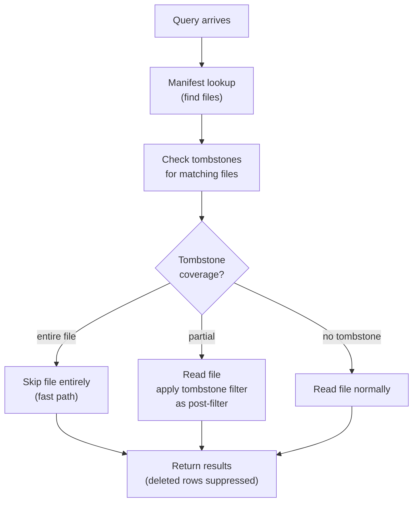
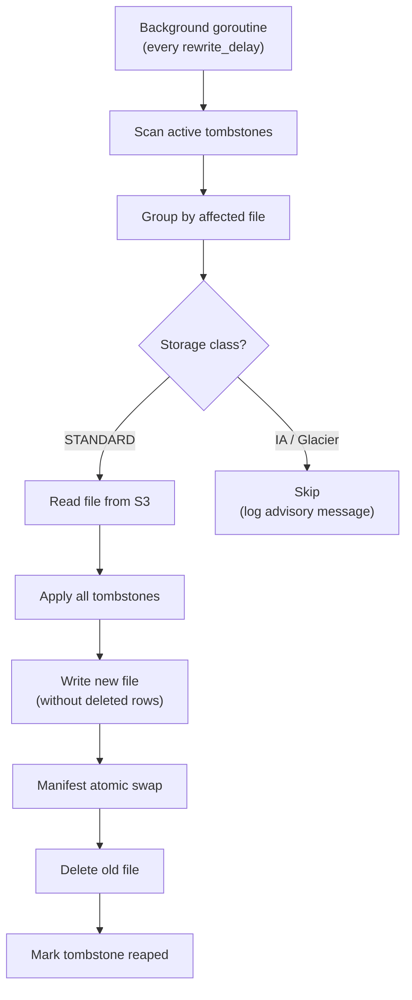

# Cost-Aware Deletion Strategy

> **Status:** Implemented in v0.10.0 (logs) and v0.11.0 (traces). Tombstone store, HTTP handlers, query-time filtering, mode-aware background rewriter, storage-class-aware scheduler, and verify endpoint are all functional.

## Supported Modes

| Mode | Delete Endpoint Prefix | Rewriter Row Type | Field Mapping |
|---|---|---|---|
| `logs` | `/delete/logsql/*` | `schema.LogRow` | `body`, `service.name`, `level`, etc. |
| `traces` | `/delete/tracessql/*` | `schema.TraceRow` | `span.name`, `trace_id`, `status.code`, etc. |

Both modes share the same tombstone store, scheduler, storage-class detection, and three-tier deletion strategy. Only the HTTP prefix, Parquet row type, and field mapping differ.

## Problem

Deleting records from Parquet files on S3 is inherently expensive because Parquet is immutable — you must read the file, filter out deleted rows, and write a new file. On S3 Glacier, this means retrieval fees ($0.03-$0.09/GB) plus rewrite costs. At scale, naive deletion of a single record from a 2-year-old Glacier file could cost more than storing it for another decade.

Victoria Lakehouse supports VL/VT-compatible delete APIs with the same LogsQL query syntax — but implements them intelligently at the storage layer based on the S3 storage class of the underlying data.

## Design: Three-Tier Deletion

### Tier 1: Tombstone (Default, Zero-Cost)

For data on any S3 class, the default deletion mode is **tombstone-based soft delete**:

1. User issues delete query: `POST /delete/logsql/delete?query=service.name:="leaked-credentials"&start=...&end=...`
2. Lakehouse evaluates the query against the manifest to identify affected files
3. Instead of rewriting files, a **tombstone record** is written to the manifest:
   ```json
   {
     "ID": "3f1c0f6e-2a5c-4f0a-9a1e-7b2d9c8e4a11",
     "Query": "service.name:=\"leaked-credentials\"",
     "StartNs": 1735689600000000000,
     "EndNs": 1748736000000000000,
     "AffectedKeys": ["logs/dt=2025-03-15/hour=14/00001.parquet"],
     "CreatedAt": "2026-05-05T10:00:00Z",
     "Mode": "auto"
   }
   ```
   That is the record verbatim: it is what `{prefix}_tombstones/{id}.json` holds
   and what a restore reads back (progress fields — `Reaped`, `Clean`,
   `Superseded` — are added as the rewrite advances).
4. On every read query, tombstones are evaluated as post-filters — matching rows are suppressed from results, and from the `field_values` / `streams` / `stream_ids` enumerations that feed field pickers (see [Operations → Where tombstones are applied](operations.md#where-tombstones-are-applied))
5. **Cost: $0** — no S3 reads, no rewrites, no retrieval fees

**Tombstones are stored in:**
- In-memory (instant filter application)
- Written through to disk on every change (survives `kill -9`, not just a graceful shutdown)
- Written through to S3 as `{prefix}_tombstones/{id}.json` in the same call, retried on failure (survives pod loss)

Startup restores the union of the disk and S3 copies. The full guarantee, the
conflict-resolution rule and the boot-time self-check are documented in
[Operations → Tombstone Management](operations.md#tombstone-management) and
[Durability §3.1](durability.md#31-deletes-and-rewrites).

**The un-delete window is honoured everywhere.** A `hide` tombstone's rows are
never physically removed, and a `permanent`/`auto` tombstone's rows are removed
only after `rewrite_delay` — by the rewriter, and equally by compaction, which
otherwise carries the rows forward into its merged output and hands the
tombstone over to that output.

### Tier 2: Rewrite (S3 Standard Only)

For data still on S3 Standard (typically <90 days old), physical deletion is cheap:

1. Tombstone is created first (immediate visibility suppression)
2. Background job identifies tombstoned files on S3 Standard class
3. Files are read, filtered, rewritten without deleted rows
4. Manifest atomically swaps old file → new file
5. Old file deleted from S3

**Cost:** S3 GET + PUT + storage delta. At $0.0004/1K GETs + $0.005/1K PUTs, rewriting 100 files costs ~$0.05.

**When this runs:**
- Automatically for S3 Standard files (configurable delay, default 1 hour after tombstone)
- Never for S3-IA or Glacier files (cost-prohibited)
- Batch mode: accumulate multiple tombstones before rewriting a file

### Tier 3: Lifecycle Expiry (Glacier/Archive)

For data on S3-IA, Glacier Instant, or Glacier Deep:

1. Tombstone suppresses reads immediately (Tier 1)
2. Physical data remains on S3 until lifecycle policy expires it
3. **No rewrite ever happens** — the data ages out naturally

**User options:**
- Accept tombstone-only (recommended): data invisible but physically present until lifecycle expires
- Force-delete (explicit opt-in, warning about costs): triggers Glacier retrieval + rewrite
- Accelerate lifecycle: move specific prefixes to shorter expiry

## API Surface

The delete API uses a mode-specific prefix: `/delete/logsql/*` for logs mode, `/delete/tracessql/*` for traces mode. All endpoints accept the same parameters.

### Tenant Scope

Every delete belongs to a tenant. A request is resolved to its tenant exactly
like a select request: the `AccountID` / `ProjectID` headers, which the tenant
middleware fills from `X-Scope-OrgID` (aliases) or the
`X-Scope-AccountID` / `X-Scope-ProjectID` pair; a request without them is the
default tenant `0:0`. An unparseable tenant header is `400 cannot obtain
tenantID`, as for a select. That tenant:

- **creates** tombstones scoped to itself, over its own objects (for `0:0`
  that includes objects written before tenant prefixes existed, which the read
  path also serves to `0:0`);
- **lists, reads, verifies against and un-deletes** only its own tombstones —
  those scoped to exactly that tenant. Any other id answers `404`, so another
  tenant's delete can be neither read nor removed;
- **estimates** over its own objects and sees the **leftovers** of its own
  objects and tombstones (`"scope": "tenant"`).

A request that presents the global-read credential
(`tenant.global_read_header` / `global_read_value`, or `global_read_token` —
the credential that widens a select to every tenant) is the operator view
(`"scope": "instance"`): it sees and may un-delete every tombstone, including
records from releases before tenant scope (which carry no tenant and act on
every tenant) and cluster delete tasks that name several tenants, and the
instance-wide leftovers. Its deletes are still scoped to the tenant in its
headers: no request creates an instance-wide tombstone. Without a configured
credential there is no operator view.

A tombstone's tenants limit everything it does: query-time suppression (rows,
field values, streams, the count and metadata fast paths, buffered rows), the
rewriter (it only ever lists and rewrites objects of its tenants) and
compaction (it drops a tombstone's rows only while merging that tenant's
objects). Objects are attributed to tenants by their key, the same way the read
path selects them. A tombstone of tenant A never costs tenant B a fast path.

### Delete Endpoint

```
POST /delete/{logsql|tracessql}/delete
  ?query=<LogsQL filter>
  &start=<unix nanoseconds>
  &end=<unix nanoseconds>
  &mode=hide|permanent|auto   (default: the configured delete.default_mode, "auto")
```

`start` and `end` are UNIX timestamps in **nanoseconds** — the same unit the
manifest and the Parquet files store — and are parsed as integers: a request
carrying `start=2025-01-01` is rejected with `400 invalid start parameter`.
Produce them from a date with `date -u -d '2025-01-01' +%s`000000000 (GNU date)
or `date -ujf '%Y-%m-%d' 2025-01-01 +%s`000000000 (BSD/macOS date).

**Examples:**

```bash
# Delete logs matching a query (2025-01-01 .. 2025-06-01)
curl -X POST 'http://lakehouse:9428/delete/logsql/delete?query=service.name:="leaked-creds"&start=1735689600000000000&end=1748736000000000000'

# Delete traces matching a query
curl -X POST 'http://lakehouse:10428/delete/tracessql/delete?query=trace_id:="abc123"&start=1735689600000000000&end=1748736000000000000'
```

**Mode behavior:**
- `hide`: always soft-delete only (cheapest, instant; rows stay in the objects and come back if the tombstone is removed)
- `permanent`: physical deletion — the affected files are rewritten without the matching rows once the un-delete window has passed
- `auto` (default): hide immediately, then rewrite the S3 Standard files only (files on IA/Glacier stay suppressed until lifecycle expiry)

### Cost Estimation Endpoint

Before executing a delete, users can estimate the cost:

```
POST /delete/{logsql|tracessql}/estimate
  ?query=<LogsQL filter>
  &start=<unix nanoseconds>
  &end=<unix nanoseconds>

Response:
{
  "affected_files": 47,
  "affected_rows_estimate": 12500,
  "storage_classes": {
    "STANDARD": {"files": 12, "bytes": 156000000, "rewrite_cost": "$0.02"},
    "STANDARD_IA": {"files": 20, "bytes": 890000000, "rewrite_cost": "$11.13"},
    "GLACIER_INSTANT": {"files": 10, "bytes": 450000000, "rewrite_cost": "$40.50"},
    "GLACIER_DEEP": {"files": 5, "bytes": 230000000, "rewrite_cost": "$120.75"}
  },
  "recommended_mode": "auto",
  "auto_behavior": "Tombstone all 47 files immediately. Rewrite 12 STANDARD files (cost: $0.02). Leave 35 files on IA/Glacier with tombstone suppression until lifecycle expiry."
}
```

### Tombstone Management

```
GET /delete/{logsql|tracessql}/tombstones
  ?active=true                    # Only show active (non-reaped) tombstones

DELETE /delete/{logsql|tracessql}/tombstone/{id}
  # Removes a tombstone (un-deletes data if file still exists)

GET /delete/{logsql|tracessql}/tombstone/{id}/status
  # Shows rewrite progress for this tombstone
```

The listing reports `"scope": "tenant"` (the caller's own tombstones) or
`"scope": "instance"` (every tombstone, global-read credential). Each record
carries `Tenants`, the tenants it acts on; a record without it is from a release
before tenant scope and acts on every tenant.

### Leftovers Endpoint

```
GET /delete/{logsql|tracessql}/leftovers
  ?limit=<max entries per list>   (default 1000, maximum 10000)
```

Read-only listing of what this instance is still holding on to: keys the
manifest retired so a refresh cannot adopt them back (`delete_owed` marks the
ones whose objects are still in the bucket and this process owes; `deleted`
marks the ones already gone, held only until a listing older than the delete
can no longer be applied), uploads claimed but not published (`held` marks a
replacement whose swap is not durable yet), and the durable records of
unfinished rewrites with their state. A tenant caller sees the entries of its
own objects and the rewrites of its own tombstones (`"scope": "tenant"`); the
global-read credential sees the whole instance (`"scope": "instance"`), like
the tombstone listing. The alerts on retired-key
eviction, on non-durable records and on unfinished rewrites all point at it; see
[Operations → What this instance still owes](operations.md#what-this-instance-still-owes-prefixleftovers).

### Verify Endpoint

```
POST /delete/{logsql|tracessql}/verify
  ?query=<LogsQL filter>
  &start=<unix nanoseconds>
  &end=<unix nanoseconds>
```

Confirms that deleted data is no longer visible through queries. Returns verification status and affected file count.

## Query-Time Tombstone Evaluation

Tombstones are evaluated during the normal read path:



**Performance impact:**
- Full-file tombstones: zero cost (file skipped at manifest level)
- Partial tombstones: one additional filter per affected file (~microseconds)
- Tombstone count in steady state: typically <100 (most get reaped after rewrite)

## Storage Class Detection

Lakehouse detects the S3 storage class of each file via:

1. **HeadObject on first access** — `StorageClass` header in response
2. **Cached in manifest** — storage class stored per-file, refreshed on lifecycle transitions
3. **Lifecycle prediction** — if lifecycle rules are configured, predict class from file age

```yaml
lakehouse:
  delete:
    auto_rewrite_classes: ["STANDARD"]           # Only rewrite these classes
    rewrite_delay: 1h                             # Wait before rewriting (batch tombstones)
    rewrite_batch_size: 50                        # Max files per rewrite job
    force_glacier_header: "X-Force-Glacier-Delete" # Required header for forced Glacier rewrite
    persist_path: /data/lakehouse/tombstones      # Durable volume — holds the local tombstone copy
    cost_warning_threshold: 10.0                  # Warn user if estimated cost ($) exceeds this
```

## Cost Comparison: Delete Operations

| Operation | Lakehouse (Tombstone) | Lakehouse (Rewrite, Standard) | Loki | Tempo |
|---|---|---|---|---|
| **Delete single record** | **$0** (instant) | $0.001 (1 file rewrite) | Not supported | Not supported (whole trace only) |
| **Delete by query (1K matches)** | **$0** (instant) | $0.05 (batch rewrite) | Not supported | N/A |
| **Delete from Glacier** | **$0** (tombstone only) | $40-120 (retrieval + rewrite) | N/A | N/A |
| **GDPR "right to erasure"** | **$0** immediate (tombstone satisfies GDPR) | Optional physical delete for compliance | Export + reimport (manual) | Not supported at record level |
| **Retention-based expiry** | S3 Lifecycle (free) | S3 Lifecycle (free) | Compactor retention (CPU cost) | Compactor (CPU cost) |

## GDPR / Compliance Considerations

Tombstone-based deletion **satisfies GDPR right to erasure** requirements because:

1. Data is immediately inaccessible through all query interfaces
2. No API, tool, or user can retrieve tombstoned records
3. Physical deletion occurs automatically when S3 lifecycle expires the file
4. For strict compliance requirements, forced rewrite of S3 Standard files provides immediate physical deletion

**Audit trail:**
- Every tombstone records who deleted what and when
- Tombstone metadata persisted to S3 for compliance auditing
- Optional webhook/SQS notification on delete operations

## Comparison: Why Loki/Tempo Can't Do This

| Capability | Lakehouse | Loki | Tempo |
|---|---|---|---|
| Record-level delete | Tombstone + selective rewrite | Not supported (whole stream only) | Whole trace only |
| Query-based delete | Full LogsQL filter support | Not supported | TraceID only |
| Cost-aware deletion | Per-storage-class strategy | N/A (all S3 Standard) | N/A |
| Glacier-safe delete | Tombstone suppression (no retrieval) | Can't use Glacier (compaction) | Can't use Glacier (compaction) |
| GDPR compliance | Immediate tombstone + audit trail | Manual stream deletion | Manual trace deletion |
| Un-delete | Remove tombstone | Not possible | Not possible |
| Delete cost estimation | Built-in API | N/A | N/A |

## Cluster Delete Protocol (`/internal/delete/*`)

A VictoriaLogs or VictoriaTraces cluster deletes through its storage nodes:
`vlselect`/`vtselect` fans `/internal/delete/run_task`, `stop_task` and
`active_tasks` out to every storage node. The lakehouse serves this protocol
through upstream's own code, behind the same switch: the logs binary mounts
VictoriaLogs' `vlselect.RequestHandler` for `/internal/delete/*`, so the flag,
its help text and its answers are upstream's. The traces binary carries a
verbatim copy of VictoriaTraces' gate (checked against the vendored source by a
test) until it serves `/select/*` through `vtselect` as well — VT's and VL's
select packages register the same flag names and cannot be linked into one
binary.

- **`-internaldelete.enable`** (default `false`, same name and default as
  upstream). While it is off, every `/internal/delete/*` request answers
  upstream's own error — `400 requests to /internal/delete/* are disabled; pass
  -internaldelete.enable command-line flag for enabling them` — exactly like a
  VictoriaLogs or VictoriaTraces node started with its defaults, whatever
  `delete.enabled` says.
- With the flag on, the lakehouse also requires **`delete.enabled: true`**,
  because the protocol writes into the lakehouse tombstone store.
- **`run_task`** registers a tombstone with the task's id, scoped to exactly
  the task's `tenant_ids`, over every row not newer than the task's timestamp
  that matches its filter (upstream's semantics), with `delete.default_mode`.
  A task naming no tenant is accepted and deletes nothing, as upstream; no
  tombstone is created for it (an empty scope would act on every tenant). A
  task id that is already registered is refused with upstream's error.
- **`stop_task`** removes the task's tombstone by id — an un-delete, refused
  while a rewrite of its files is unfinished; an unknown id is a no-op, as
  upstream. **`active_tasks`** lists the active tombstones in upstream's task
  shape (`task_id`, `tenant_ids`, `filter`, `start_time`).

Mounting `vlselect.RequestHandler` also registers VictoriaLogs' other select
flags in the logs binary, so `-help` lists `-search.maxQueryDuration`,
`-search.maxConcurrentRequests`, `-search.maxQueueDuration`, `-select.disable`,
`-internalselect.disable`, `-delete.enable`, `-search.logSlowQueryDuration` and
`-vmalert.proxyURL`. The lakehouse's own `/select/*` handling does not read the
search and select ones yet — `query.timeout` and `query.max_concurrent` govern
the lakehouse select path — so setting any of them makes lakehouse-logs refuse
to start instead of silently ignoring it (as before vlselect was linked, when
they were undefined). Moving `/select/*` onto upstream's handler, which will
honour them, is tracked separately. `-delete.enable` is honoured: see the next
section.

## Upstream Delete API (`/delete/*`)

VictoriaLogs and VictoriaTraces delete through `/delete/run_task`,
`/delete/stop_task` and `/delete/active_tasks`. The lakehouse serves them
through upstream's code as well: the logs binary mounts VictoriaLogs'
`vlselect.RequestHandler` for `/delete/`, the traces binary a copy of
VictoriaTraces' gate and delete handler, held to the vendored source by a test,
whose storage calls go through the same dispatch as the cluster protocol.

- **`-delete.enable`** (default `false`; upstream's name, default and help).
  While it is off, every `/delete/*` path the lakehouse does not serve itself
  answers upstream's own error — `400 requests to /delete/* are disabled; pass
  -delete.enable command-line flag for enabling them` — exactly like an
  upstream node started with its defaults.
- With the flag on, the lakehouse also requires **`delete.enabled: true`**.
- **`run_task`** takes upstream's parameters (`filter`, the tenant from the
  request headers) and answers upstream's `{"task_id":"…"}`; the task becomes a
  tombstone scoped to the request's tenant, exactly as a cluster `run_task` for
  that one tenant. `stop_task` and `active_tasks` behave as in the cluster
  protocol above.

`-delete.enable` and `delete.enabled` are different switches. `delete.enabled`
(lakehouse config) turns on the tombstone machinery — query-time suppression,
the rewriter — and the lakehouse's own API under `/delete/logsql/*` and
`/delete/tracessql/*`. `-delete.enable` (upstream flag) additionally serves
upstream's API, which writes into the same tombstone store. As upstream,
`stop_task` and `active_tasks` are not tenant-scoped — the upstream API is an
administrator's surface — while every task `run_task` creates is scoped to the
requesting tenant. Expose `/delete/*` only to administrators when the flag is
on; tenants use the lakehouse API, which is tenant-scoped throughout.

Differences from upstream once enabled: rows are hidden the moment the task is
registered and removed physically by the rewriter according to
`delete.default_mode` (upstream removes them in a background pass), and
`active_tasks` lists a task until its tombstone retires rather than until the
background pass finishes.

## Traces Delete Support

The same three-tier deletion strategy applies to `lakehouse-traces`. All endpoints use the `/delete/tracessql/*` prefix instead of `/delete/logsql/*`.

### Trace Field Matching

Tombstone queries match against trace span fields:

| Query Pattern | Matches Against |
|---|---|
| `service.name:="payment-service"` | TraceRow.ServiceName |
| `trace_id:="abc123"` | TraceRow.TraceID |
| `span.name:="HTTP GET"` | TraceRow.SpanName |
| `status.code:="ERROR"` | TraceRow.StatusCode (as string) |
| `k8s.namespace.name:="prod"` | TraceRow.K8sNamespaceName |
| `http.method:="POST"` | TraceRow.Attributes["http.method"] |
| `*` or empty | All rows in time range |

The `body` field in wildcard/fallback queries maps to `SpanName` for traces (vs `Body` for logs).

### Mode-Aware Rewriter

The background rewriter is mode-aware:
- **Logs mode**: reads/writes `schema.LogRow` Parquet files, filters via `logRowToMap`
- **Traces mode**: reads/writes `schema.TraceRow` Parquet files, filters via `traceRowToMap`

Both modes share the same scheduler, storage-class detection, and tombstone store — only the Parquet row type and field mapping differ.

### Cross-Signal Deletion

To delete data matching across both logs and traces (e.g., GDPR erasure of a user's activity):

1. Issue delete to logs: `POST /delete/logsql/delete?query=user_id:="user-123"&start=...&end=...`
2. Issue delete to traces: `POST /delete/tracessql/delete?query=user_id:="user-123"&start=...&end=...`

Each operates independently on its respective Parquet files. Both share the same tombstone store if running in `all` mode.

## Implementation Notes

### Tombstone Storage Format

```
s3://{bucket}/{prefix}_tombstones/
  {id}.json   # One object per tombstone
```

`{prefix}` is the deployment's S3 prefix: `s3.prefix` if set, otherwise the
default tenant prefix followed by the signal (`logs/` or `traces/`). Tombstones
are **not** stored per tenant — in multi-tenant mode every tenant's tombstones
share that one prefix (typically `logs/_tombstones/`), not the
`{AccountID}/{ProjectID}/<signal>/` prefix its data lives under. The
`_tombstones/` segment is on the orphan sweep's never-delete list, so the sweep
cannot reclaim a live tombstone record.

Tombstones are small JSON objects (<1 KB). Each one is written on creation and
rewritten whenever its rewrite progress changes — including the per-file rewrite
record (`Superseded`) written before a replacement is uploaded and cleared once
the superseded object is deleted; the object is deleted when the tombstone is
un-deleted or retired. They are loaded into memory at startup.

### Rewrite Job Scheduling



### Metrics

| Metric | Type | Description |
|---|---|---|
| `lakehouse_delete_tombstones_active` | Gauge | Active tombstones |
| `lakehouse_delete_tombstones_total` | Counter | Total tombstones created |
| `lakehouse_delete_rewrite_total` | Counter | Physical rewrites completed |
| `lakehouse_delete_rewrite_bytes_saved` | Counter | Bytes freed by rewrites |
| `lakehouse_delete_rewrite_skipped_glacier` | Counter | Rewrites skipped (Glacier) |
| `lakehouse_delete_rows_suppressed_total` | Counter | Rows filtered by tombstones at query time |
