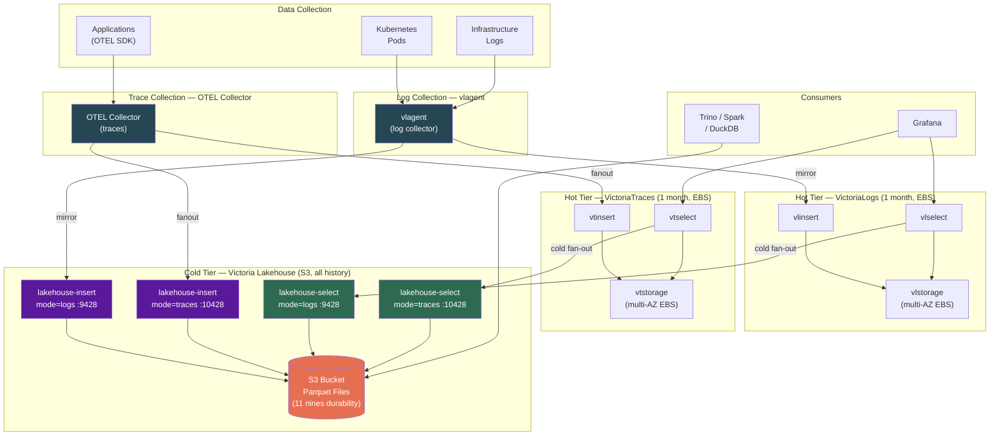
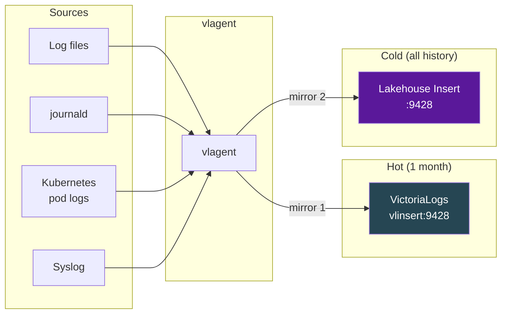
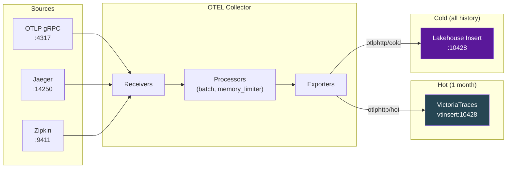
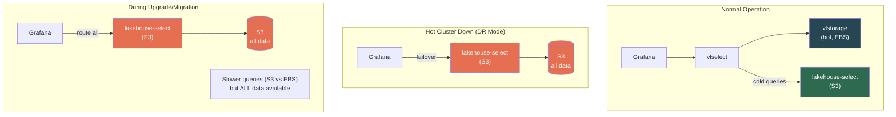
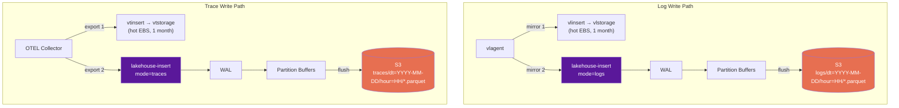
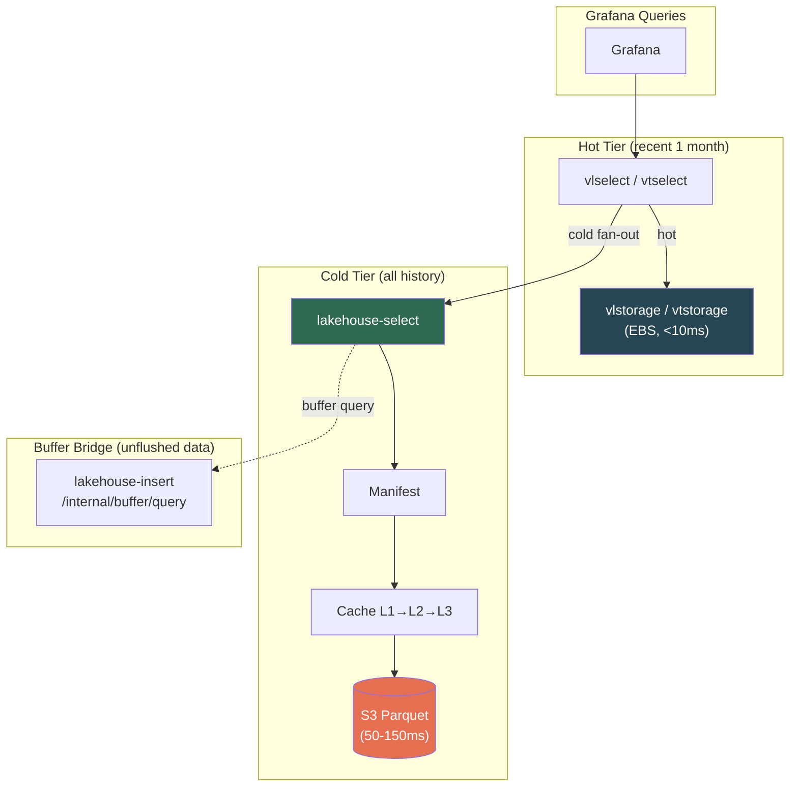

# Deployment Architecture

Victoria Lakehouse fits into observability infrastructure as a **cold storage tier** alongside hot VictoriaLogs/VictoriaTraces clusters. This document describes the production architecture including data collection, hot/cold tiering, disaster recovery, and analytics access.

## High-Level Architecture



## Data Flow Summary

| Signal | Collector | Hot Tier | Cold Tier | Retention |
|---|---|---|---|---|
| Logs | vlagent | VictoriaLogs (multi-AZ EBS) | Victoria Lakehouse (S3 Parquet) | Hot: 1 month, Cold: unlimited |
| Traces | OTEL Collector | VictoriaTraces (multi-AZ EBS) | Victoria Lakehouse (S3 Parquet) | Hot: 1 month, Cold: unlimited |

Both collectors **mirror** (duplicate) traffic to hot and cold tiers simultaneously. No data passes through the hot tier to reach cold storage — they are independent write paths.

## Logs: vlagent Pipeline

[vlagent](https://docs.victoriametrics.com/victorialogs/vlagent/) is VictoriaMetrics' lightweight log collector. It collects logs from files, journald, syslog, and Kubernetes pods, then forwards to VictoriaLogs-compatible endpoints.

### Architecture



### vlagent Configuration

vlagent uses `remoteWrite` with multiple destinations for mirroring:

```yaml
# vlagent.yaml — mirror logs to hot VictoriaLogs + cold Lakehouse
server:
  log_level: info

scrape_configs:
  # Kubernetes pod logs
  - job_name: kubernetes-pods
    kubernetes_sd_configs:
      - role: pod
    pipeline_stages:
      - docker: {}
      - match:
          selector: '{namespace=~".+"}'
          stages:
            - labels:
                namespace:
                pod:
                container:

  # Syslog input
  - job_name: syslog
    syslog:
      listen_address: 0.0.0.0:1514
      labels:
        job: syslog

  # File-based logs
  - job_name: application-logs
    static_configs:
      - targets: [localhost]
        labels:
          job: app
          __path__: /var/log/app/*.log

# Mirror to both hot and cold
remoteWrite:
  # Hot tier — VictoriaLogs (1 month retention)
  - url: http://vlinsert.monitoring.svc.cluster.local:9428/insert/jsonline
    name: hot-victorialogs
    queue_config:
      capacity: 10000
      max_shards: 10
      min_shards: 1
      max_samples_per_send: 5000
      batch_send_deadline: 5s

  # Cold tier — Victoria Lakehouse (unlimited retention)
  - url: http://lakehouse-insert.monitoring.svc.cluster.local:9428/insert/jsonline
    name: cold-lakehouse
    queue_config:
      capacity: 10000
      max_shards: 10
      min_shards: 1
      max_samples_per_send: 5000
      batch_send_deadline: 10s
```

### vlagent Helm Values (Kubernetes)

```yaml
# values-vlagent.yaml
vlagent:
  image:
    repository: victoriametrics/vlagent
    tag: latest

  config:
    remoteWrite:
      # Hot VictoriaLogs cluster
      - url: http://vlinsert.monitoring.svc.cluster.local:9428/insert/jsonline
        name: hot-victorialogs
      # Cold Victoria Lakehouse
      - url: http://lakehouse-insert.monitoring.svc.cluster.local:9428/insert/jsonline
        name: cold-lakehouse

    kubernetes:
      enabled: true
      namespaceSelector: {}

  resources:
    requests:
      cpu: 100m
      memory: 128Mi
    limits:
      memory: 512Mi

  tolerations:
    - operator: Exists
      effect: NoSchedule
```

### Multi-AZ Hot Cluster Configuration

For production, run VictoriaLogs in cluster mode across availability zones:

```yaml
# VictoriaLogs cluster (hot tier, 1 month retention)
vlinsert:
  replicaCount: 3
  affinity:
    podAntiAffinity:
      requiredDuringSchedulingIgnoredDuringExecution:
        - topologyKey: topology.kubernetes.io/zone
          labelSelector:
            matchLabels:
              app: vlinsert
  extraArgs:
    storageNode: "vlstorage-0.vlstorage.monitoring.svc:9428,vlstorage-1.vlstorage.monitoring.svc:9428,vlstorage-2.vlstorage.monitoring.svc:9428"

vlstorage:
  replicaCount: 3
  persistence:
    enabled: true
    storageClass: gp3
    size: 500Gi
  extraArgs:
    retentionPeriod: 30d
  affinity:
    podAntiAffinity:
      requiredDuringSchedulingIgnoredDuringExecution:
        - topologyKey: topology.kubernetes.io/zone

vlselect:
  replicaCount: 3
  extraArgs:
    # Fan out to both hot vlstorage and cold lakehouse
    storageNode: "vlstorage-0.vlstorage.monitoring.svc:9428,vlstorage-1.vlstorage.monitoring.svc:9428,vlstorage-2.vlstorage.monitoring.svc:9428,lakehouse-select.monitoring.svc:9428"
```

## Traces: OTEL Collector Pipeline

The [OpenTelemetry Collector](https://opentelemetry.io/docs/collector/) receives, processes, and exports telemetry data. For traces, it fans out to both VictoriaTraces (hot) and Victoria Lakehouse (cold) using the `fanout` connector or multiple exporters.

### Architecture



### OTEL Collector Configuration

```yaml
# otel-collector-config.yaml — fan out traces to hot VictoriaTraces + cold Lakehouse
receivers:
  otlp:
    protocols:
      grpc:
        endpoint: 0.0.0.0:4317
      http:
        endpoint: 0.0.0.0:4318

  jaeger:
    protocols:
      grpc:
        endpoint: 0.0.0.0:14250
      thrift_http:
        endpoint: 0.0.0.0:14268

  zipkin:
    endpoint: 0.0.0.0:9411

processors:
  batch:
    send_batch_size: 10000
    timeout: 5s

  memory_limiter:
    check_interval: 1s
    limit_mib: 1024
    spike_limit_mib: 256

  resource:
    attributes:
      - key: environment
        value: production
        action: upsert

exporters:
  # Hot tier — VictoriaTraces (OTLP HTTP, 1 month retention)
  otlphttp/hot:
    endpoint: http://vtinsert.monitoring.svc.cluster.local:10428
    tls:
      insecure: true
    retry_on_failure:
      enabled: true
      initial_interval: 5s
      max_interval: 30s
      max_elapsed_time: 300s

  # Cold tier — Victoria Lakehouse (OTLP HTTP, unlimited retention)
  otlphttp/cold:
    endpoint: http://lakehouse-insert.monitoring.svc.cluster.local:10428
    tls:
      insecure: true
    retry_on_failure:
      enabled: true
      initial_interval: 5s
      max_interval: 30s
      max_elapsed_time: 300s
    sending_queue:
      enabled: true
      num_consumers: 10
      queue_size: 5000

service:
  pipelines:
    traces:
      receivers: [otlp, jaeger, zipkin]
      processors: [memory_limiter, batch, resource]
      exporters: [otlphttp/hot, otlphttp/cold]

  telemetry:
    logs:
      level: info
    metrics:
      address: 0.0.0.0:8888
```

### OTEL Collector Helm Values (Kubernetes)

```yaml
# values-otel-collector.yaml
mode: deployment

config:
  receivers:
    otlp:
      protocols:
        grpc:
          endpoint: 0.0.0.0:4317
        http:
          endpoint: 0.0.0.0:4318

  processors:
    batch:
      send_batch_size: 10000
      timeout: 5s
    memory_limiter:
      check_interval: 1s
      limit_mib: 1024

  exporters:
    otlphttp/hot:
      endpoint: http://vtinsert.monitoring.svc.cluster.local:10428
      tls:
        insecure: true
    otlphttp/cold:
      endpoint: http://lakehouse-insert.monitoring.svc.cluster.local:10428
      tls:
        insecure: true
      sending_queue:
        enabled: true
        queue_size: 5000

  service:
    pipelines:
      traces:
        receivers: [otlp]
        processors: [memory_limiter, batch]
        exporters: [otlphttp/hot, otlphttp/cold]

replicaCount: 3

resources:
  requests:
    cpu: 200m
    memory: 256Mi
  limits:
    memory: 1Gi

autoscaling:
  enabled: true
  minReplicas: 3
  maxReplicas: 10
  targetCPUUtilizationPercentage: 70
```

### Multi-AZ Hot Traces Cluster

```yaml
# VictoriaTraces cluster (hot tier, 1 month retention)
vtinsert:
  replicaCount: 3
  affinity:
    podAntiAffinity:
      requiredDuringSchedulingIgnoredDuringExecution:
        - topologyKey: topology.kubernetes.io/zone

vtstorage:
  replicaCount: 3
  persistence:
    enabled: true
    storageClass: gp3
    size: 500Gi
  extraArgs:
    retentionPeriod: 30d

vtselect:
  replicaCount: 3
  extraArgs:
    # Fan out to both hot vtstorage and cold lakehouse
    storageNode: "vtstorage-0.vtstorage.monitoring.svc:10428,vtstorage-1.vtstorage.monitoring.svc:10428,vtstorage-2.vtstorage.monitoring.svc:10428,lakehouse-select.monitoring.svc:10428"
```

## Disaster Recovery

Victoria Lakehouse serves as a **disaster recovery** (DR) backend for the hot cluster. If the hot VictoriaLogs/VictoriaTraces cluster is unavailable (outage, upgrade, migration), Lakehouse continues serving all historical data from S3.

### DR Architecture



### DR Scenarios

| Scenario | Behavior | Query Latency |
|---|---|---|
| **Normal operation** | vlselect fans out to vlstorage (hot) + lakehouse (cold). Hot queries <10ms, cold queries <500ms | Hot: <10ms, Cold: <500ms |
| **Hot cluster down** | Grafana/vmauth routes all queries to lakehouse-select. All data available from S3 | 50-500ms (S3-backed) |
| **Hot cluster upgrade** | Drain vlselect, route queries to lakehouse during maintenance window | 50-500ms during window |
| **AZ failure** | Multi-AZ hot cluster continues on remaining AZs. Lakehouse unaffected (S3 is multi-AZ by default) | Unchanged |
| **Region failure** | S3 cross-region replication enables lakehouse in DR region | Based on DR region S3 latency |

### Grafana DR Routing with vmauth

Use vmauth to automatically fail over to lakehouse when the hot cluster is unavailable:

```yaml
# vmauth-dr-config.yaml
unauthorized_user:
  url_map:
    # Try hot cluster first, fall back to lakehouse
    - src_paths:
        - "/select/.*"
      url_prefix:
        - "http://vlselect.monitoring.svc:9428/"
        - "http://lakehouse-select.monitoring.svc:9428/"
      load_balancing_policy: first_available
      retry_status_codes: [502, 503]

    - src_paths:
        - "/insert/.*"
      url_prefix:
        - "http://lakehouse-insert.monitoring.svc:9428/"
```

### DR Playbook

**Failover to Lakehouse:**

1. Update vmauth/Grafana datasource URL to point directly at lakehouse-select
2. Verify data availability: `curl http://lakehouse-select:9428/manifest/range`
3. Monitor query latency: expect 50-500ms vs normal <10ms for recent data
4. Data remains available — slower but complete

**Failback to Hot Cluster:**

1. Restore hot VictoriaLogs/VictoriaTraces cluster
2. Verify hot tier data: `curl http://vlselect:9428/health`
3. Re-register lakehouse as `-storageNode` on vlselect
4. Update vmauth/Grafana back to normal routing
5. Hot tier handles recent queries, lakehouse handles cold as usual

## Write Path Architecture



## Read Path Architecture



## Complete Kubernetes Deployment

A complete deployment includes these components:

```
monitoring/
├── vlagent/                    # Log collection (DaemonSet)
│   └── values.yaml
├── otel-collector/             # Trace collection (Deployment)
│   └── values.yaml
├── victorialogs-cluster/       # Hot logs (1 month, multi-AZ)
│   └── values.yaml
├── victoriatraces-cluster/     # Hot traces (1 month, multi-AZ)
│   └── values.yaml
├── victoria-lakehouse-logs/    # Cold logs (S3, unlimited)
│   └── values.yaml
├── victoria-lakehouse-traces/  # Cold traces (S3, unlimited)
│   └── values.yaml
└── grafana/
    └── values.yaml             # Datasources for hot + cold
```

### Lakehouse Helm Values (Logs)

```yaml
# victoria-lakehouse-logs/values.yaml
mode: logs

s3:
  bucket: obs-archive
  region: us-east-1

insertComponent:
  enabled: true
  replicaCount: 2
  persistence:
    enabled: true
    size: 50Gi

select:
  enabled: true
  replicaCount: 3
  persistence:
    enabled: true
    size: 100Gi

vmauth:
  enabled: true

insert:
  flushInterval: 10s
  walEnabled: true
```

### Lakehouse Helm Values (Traces)

```yaml
# victoria-lakehouse-traces/values.yaml
mode: traces

s3:
  bucket: obs-archive
  region: us-east-1

insertComponent:
  enabled: true
  replicaCount: 2
  persistence:
    enabled: true
    size: 50Gi

select:
  enabled: true
  replicaCount: 3
  persistence:
    enabled: true
    size: 100Gi

vmauth:
  enabled: true

insert:
  flushInterval: 10s
  walEnabled: true
```

### Grafana Datasources

```yaml
# grafana/provisioning/datasources.yaml
apiVersion: 1
datasources:
  # Hot logs (recent 1 month, fast)
  - name: VictoriaLogs
    type: victorialogs-datasource
    access: proxy
    url: http://vlselect.monitoring.svc:9428
    isDefault: true

  # Cold logs (all history, S3-backed)
  - name: Cold Logs (Lakehouse)
    type: victorialogs-datasource
    access: proxy
    url: http://lakehouse-logs-select.monitoring.svc:9428

  # Unified logs (vlselect fans out to hot + cold automatically)
  # This is the recommended setup — vlselect handles routing
  - name: All Logs (Unified)
    type: victorialogs-datasource
    access: proxy
    url: http://vlselect.monitoring.svc:9428
    jsonData:
      note: "vlselect registered with lakehouse as -storageNode"

  # Hot traces (recent 1 month)
  - name: VictoriaTraces
    type: jaeger
    access: proxy
    url: http://vtselect.monitoring.svc:10428

  # Cold traces (all history)
  - name: Cold Traces (Lakehouse)
    type: jaeger
    access: proxy
    url: http://lakehouse-traces-select.monitoring.svc:10428

  # Unified traces
  - name: All Traces (Unified)
    type: jaeger
    access: proxy
    url: http://vtselect.monitoring.svc:10428
    jsonData:
      note: "vtselect registered with lakehouse as -storageNode"
```
