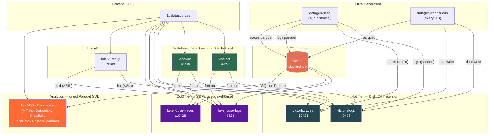

# Docker Compose Setup

Victoria Lakehouse provides a complete Docker Compose environment for local development, testing, and evaluation. The compose file at `deployment/docker/docker-compose-e2e.yml` starts all components needed for an end-to-end workflow: S3-compatible storage, data generation, hot VictoriaLogs and VictoriaTraces tiers (disk, 24h retention), cold lakehouse instances (S3 Parquet), multi-level select fan-out (vlselect/vtselect), a Loki-compatible proxy with hot+cold routing, analytics engines (DuckDB + ClickHouse) for direct Parquet SQL, and Grafana with pre-configured datasources.

## Architecture



## Quick Start

```bash
# Clone the repository
git clone https://github.com/ReliablyObserve/victoria-lakehouse.git
cd victoria-lakehouse

# Build and start all services
docker compose -f deployment/docker/docker-compose-e2e.yml up --build

# Or run in background
docker compose -f deployment/docker/docker-compose-e2e.yml up --build -d
```

Once all services are healthy, open Grafana at [http://localhost:3003](http://localhost:3003) (anonymous admin access enabled).

## Services

The compose file defines the following services on a shared `lakehouse-net` bridge network:

### MinIO (S3-compatible storage)

```yaml
minio:
  image: minio/minio:latest
  command: server /data --console-address ":9001"
  environment:
    MINIO_ROOT_USER: minioadmin
    MINIO_ROOT_PASSWORD: minioadmin
```

MinIO provides S3-compatible object storage. The `minio-init` sidecar creates the `obs-archive` bucket automatically on first start using the MinIO CLI (`mc mb local/obs-archive`).

- **API endpoint**: `http://minio:9000` (internal)
- **Console**: not exposed by default; add `ports: ["9001:9001"]` to access the web UI

### Data Generation

Two datagen services populate the environment with realistic test data:

**datagen-seed** runs once on startup and writes 48 hours of historical data:

```bash
--logs=5000 --traces=1000 --hours-back=48 --dual-write --vl-endpoint=http://victorialogs:9428 --vt-endpoint=http://victoriatraces:10428
```

This writes Parquet files directly to S3 (MinIO) and dual-writes to both hot tiers: logs to VictoriaLogs via `/insert/jsonline` and traces to VictoriaTraces via Zipkin `/api/v2/spans`.

**datagen-continuous** runs indefinitely after seeding completes, generating fresh data every 30 seconds:

```bash
--logs=500 --traces=200 --hours-back=1 --interval=30s --dual-write --vl-endpoint=http://victorialogs:9428 --vt-endpoint=http://victoriatraces:10428
```

The datagen tool produces five realistic log patterns (JSON access logs, logfmt, nginx combined, Java stack traces, OTEL-formatted) across five services (`api-gateway`, `user-service`, `order-service`, `payment-service`, `notification-service`) with full OTEL semantic convention attributes. All data is dual-written to both hot tiers (VL disk + VT disk) and cold tier (S3 Parquet) in parallel.

### Lakehouse Logs

```yaml
lakehouse-logs:
  command:
    - "-lakehouse.s3.bucket=obs-archive"
    - "-lakehouse.s3.endpoint=http://minio:9000"
    - "-lakehouse.s3.access-key=minioadmin"
    - "-lakehouse.s3.secret-key=minioadmin"
    - "-lakehouse.s3.force-path-style=true"
    - "-lakehouse.manifest.refresh-interval=30s"
    - "-lakehouse.tenant.default-account=0"
    - "-lakehouse.tenant.default-project=0"
    - "-lakehouse.tenant.global-read-header=X-Lakehouse-Global-Read"
    - "-lakehouse.tenant.global-read-value=lakehouse-e2e-global-key"
```

Serves VictoriaLogs-compatible select APIs backed by Parquet files on MinIO. Pre-configured with tenant `0/0` (default), global read access via the `X-Lakehouse-Global-Read` header, and string-based tenant auto-registration via the `X-Scope-OrgID` header. String tenants (e.g., `acme-corp`, `staging-team`) are automatically mapped to numeric IDs on first insert.

- **Internal endpoint**: `http://lakehouse-logs:9428`
- **Health check**: `GET /health` every 5 seconds

### Lakehouse Traces

```yaml
lakehouse-traces:
  command:
    - "-lakehouse.mode=traces"
    - "-lakehouse.s3.endpoint=http://minio:9000"
    - "-lakehouse.s3.force-path-style=true"
```

Serves Jaeger and Tempo-compatible trace query APIs backed by the same MinIO bucket.

- **Internal endpoint**: `http://lakehouse-traces:10428`
- **Health check**: `GET /health` every 5 seconds

### VictoriaLogs (Hot Tier)

```yaml
victorialogs:
  image: victoriametrics/victoria-logs:v1.50.0
  command:
    - "-storageDataPath=/data"
    - "-retentionPeriod=24h"
    - "-loggerLevel=INFO"
```

A standalone VictoriaLogs instance acting as the hot log tier with 24-hour retention and local disk storage. Receives dual-written logs from datagen via `/insert/jsonline`.

- **Internal endpoint**: `http://victorialogs:9428`

### VictoriaTraces (Hot Tier)

```yaml
victoriatraces:
  image: victoriametrics/victoria-traces:v0.9.2
  command:
    - "-storageDataPath=/data"
    - "-retentionPeriod=24h"
    - "-loggerLevel=INFO"
```

A standalone VictoriaTraces instance acting as the hot trace tier with 24-hour retention and local disk storage. Receives dual-written traces from datagen via Zipkin `/api/v2/spans`.

- **Internal endpoint**: `http://victoriatraces:10428`

### vlselect (Multi-Level Select — Logs)

```yaml
vlselect:
  image: victoriametrics/victoria-logs:v1.50.0
  command:
    - "-storageNode=victorialogs:9428,lakehouse-logs:9428"
```

VictoriaLogs in cluster select mode. Fans out every query to both hot (victorialogs disk) and cold (lakehouse-logs S3) storage nodes and merges results. This is the **global logs datasource** — queries transparently span both tiers.

- **Internal endpoint**: `http://vlselect:9428`

### vtselect (Multi-Level Select — Traces)

```yaml
vtselect:
  image: victoriametrics/victoria-traces:v0.9.2
  command:
    - "-storageNode=victoriatraces:10428,lakehouse-traces:10428"
```

VictoriaTraces in cluster select mode. Fans out trace queries to both hot (victoriatraces disk) and cold (lakehouse-traces S3) storage nodes. This is the **global traces datasource** — Jaeger and Tempo queries span both tiers.

- **Internal endpoint**: `http://vtselect:10428`

### Loki-VL-proxy (Hot+Cold Routing)

```yaml
loki-vl-proxy:
  image: ghcr.io/reliablyobserve/loki-vl-proxy:v1.31.2
  environment:
    VL_BACKEND_URL: "http://victorialogs:9428"
  command:
    - "-label-style=underscores"
    - "-metadata-field-mode=translated"
    - "-emit-structured-metadata=true"
    - "-stream-fields=service.name,k8s.namespace.name,k8s.pod.name,k8s.deployment.name,deployment.environment"
    - "-extra-label-fields=level,cloud.region,host.name,k8s.node.name,trace_id,span_id,scope.name"
    - "-derived-fields=[{...traceID linking config...}]"
    - "-patterns-autodetect-from-queries=true"
    - "-label-values-indexed-cache=true"
    - "-cold-enabled=true"
    - "-cold-backend=http://lakehouse-logs:9428"
    - "-cold-boundary=24h"
    - "-cold-overlap=1h"
    - "-cold-manifest-refresh=30s"
```

Translates Loki API requests to VictoriaLogs API with **hot+cold routing**: queries for the last 24 hours go to VictoriaLogs (hot tier), older queries route to lakehouse-logs (cold tier). The 1-hour overlap ensures no data gaps at the boundary. Key configuration:

- **`VL_BACKEND_URL`** — hot tier (VictoriaLogs) as primary backend
- **`-cold-enabled=true`** — enables cold storage routing
- **`-cold-backend`** — lakehouse-logs URL for cold queries
- **`-cold-boundary=24h`** — time boundary between hot and cold tiers
- **`-label-style=underscores`** — translates OTEL dot notation to Loki-compatible underscores (e.g., `service_name`)
- **`-metadata-field-mode=translated`** — full field translation for Grafana Loki Drilldown compatibility
- **`-emit-structured-metadata=true`** — emits all fields as structured metadata labels
- **`-derived-fields`** — enables trace-to-logs linking via `traceID` derived field

- **Internal endpoint**: `http://loki-vl-proxy:3100`

### ClickHouse (Analytics — S3 Parquet)

```yaml
clickhouse:
  image: clickhouse/clickhouse-server:latest
  environment:
    CLICKHOUSE_DB: default
    CLICKHOUSE_USER: default
```

ClickHouse provides SQL analytics directly on the Parquet files stored in MinIO, using the `s3()` table function. Pre-configured with named collections for MinIO credentials and views for both logs and traces datasets.

Example queries in Grafana:

```sql
-- Query logs Parquet files directly from S3
SELECT * FROM s3(
  'http://minio:9000/obs-archive/logs/dt=2026-05-12/**/*.parquet',
  'minioadmin', 'minioadmin', 'Parquet'
) LIMIT 100

-- Query traces Parquet files
SELECT * FROM s3(
  'http://minio:9000/obs-archive/traces/dt=2026-05-12/**/*.parquet',
  'minioadmin', 'minioadmin', 'Parquet'
) LIMIT 100

-- Aggregation example: error rate per service
SELECT
  "service.name" as service,
  countIf(severity_text = 'ERROR') as errors,
  count() as total,
  round(errors / total * 100, 2) as error_pct
FROM s3(
  'http://minio:9000/obs-archive/logs/**/*.parquet',
  'minioadmin', 'minioadmin', 'Parquet'
)
GROUP BY service ORDER BY errors DESC
```

- **Internal endpoint**: `http://clickhouse:9000` (native), `http://clickhouse:8123` (HTTP)

### DuckDB (Analytics — S3 Parquet via Grafana)

DuckDB runs in-memory inside the Grafana DuckDB datasource plugin (no separate server). It connects to MinIO via the `httpfs` extension, configured automatically via `initSQL` in the datasource provisioning.

Example queries in Grafana:

```sql
-- Query logs Parquet from MinIO
SELECT * FROM read_parquet('s3://obs-archive/logs/dt=2026-05-12/**/*.parquet') LIMIT 100

-- Query traces Parquet from MinIO
SELECT * FROM read_parquet('s3://obs-archive/traces/dt=2026-05-12/**/*.parquet') LIMIT 100

-- Time series: log volume over time
SELECT
  time_bucket(INTERVAL '5 minutes', make_timestamp(timestamp_unix_nano / 1000)) as time,
  count(*) as log_count
FROM read_parquet('s3://obs-archive/logs/**/*.parquet')
WHERE $__timeFilter(make_timestamp(timestamp_unix_nano / 1000))
GROUP BY 1 ORDER BY 1
```

### Other Analytics Engines (External)

The Docker Compose includes DuckDB and ClickHouse pre-configured. Additional engines can query the same S3 Parquet files externally:

| Engine | Grafana Plugin | How to Connect | License |
|---|---|---|---|
| **DuckDB** | `motherduck-duckdb-datasource` (unsigned) | Included in compose | Free |
| **ClickHouse** | `grafana-clickhouse-datasource` (official) | Included in compose | Free |
| **[Trino](https://trino.io/)** | [`trino-datasource`](https://grafana.com/grafana/plugins/trino-datasource/) (community-signed) | Add Trino container + Hive connector | Free |
| **[Databricks](https://www.databricks.com/)** | `grafana-databricks-datasource` (official) | External Databricks workspace | Enterprise |
| **[Snowflake](https://www.snowflake.com/)** | `grafana-snowflake-datasource` (official) | External Snowflake account | Enterprise |
| **[StarRocks](https://www.starrocks.io/)** | Built-in MySQL datasource | Add StarRocks container | Free |
| **[Spark](https://spark.apache.org/)** | None | PySpark with `s3a://` | — |

Full engine details: [Analytics Engines](analytics-engines.md)

### Grafana

```yaml
grafana:
  image: grafana/grafana:latest-ubuntu
  ports:
    - "3003:3000"
  environment:
    GF_AUTH_ANONYMOUS_ENABLED: "true"
    GF_AUTH_ANONYMOUS_ORG_ROLE: Admin
    GF_INSTALL_PLUGINS: "victoriametrics-logs-datasource"
    GF_PLUGINS_ALLOW_LOADING_UNSIGNED_PLUGINS: "victoriametrics-logs-datasource,motherduck-duckdb-datasource"
```

The Ubuntu-based Grafana image is required for the DuckDB datasource plugin (uses glibc, not compatible with Alpine/musl). A `grafana-duckdb-init` sidecar downloads the DuckDB plugin from GitHub releases before Grafana starts.

Pre-configured with eleven datasources via provisioning files in `deployment/docker/grafana/provisioning/`:

| Datasource | Type | URL | Purpose |
|---|---|---|---|
| **VictoriaLogs Global (Hot+Cold)** | VictoriaLogs | `http://vlselect:9428` | Unified hot+cold logs via multi-level select (default) |
| **VictoriaTraces Global (Hot+Cold)** | Jaeger / Tempo | `http://vtselect:10428` | Unified hot+cold traces via multi-level select |
| VictoriaLogs Hot (Disk 24h) | VictoriaLogs | `http://victorialogs:9428` | Hot tier only (disk, 24h retention) |
| VictoriaTraces Hot (Disk 24h) | Jaeger / Tempo | `http://victoriatraces:10428` | Hot tier only (disk, 24h retention) |
| Lakehouse Logs Cold (S3) | VictoriaLogs | `http://lakehouse-logs:9428` | Cold tier only (S3 Parquet) |
| Lakehouse Traces Cold (S3) | Jaeger / Tempo | `http://lakehouse-traces:10428` | Cold tier only (S3 Parquet) |
| Loki via Proxy (Hot+Cold) | Loki | `http://loki-vl-proxy:3100` | Unified hot+cold via Loki API with Drilldown support |
| DuckDB Analytics (S3 Parquet) | DuckDB | in-memory + MinIO S3 | Direct SQL on Parquet files via DuckDB `read_parquet()` |
| ClickHouse Analytics (S3 Parquet) | ClickHouse | `http://clickhouse:9000` | SQL analytics on Parquet via `lakehouse.logs`/`lakehouse.traces` views |
| ClickHouse Logs (S3 Parquet) | ClickHouse | `http://clickhouse:9000` | Grafana Logs panel on S3 Parquet — `body`, `severity_text`, `service.name` |
| ClickHouse Traces (S3 Parquet) | ClickHouse | `http://clickhouse:9000` | Grafana Traces panel on S3 Parquet — `trace_id`, `span_id`, `duration_ns` |

- **Grafana UI**: [http://localhost:3003](http://localhost:3003)

## Volumes

The compose file defines five named volumes:

| Volume | Mount | Purpose |
|---|---|---|
| `vl-data` | `/data` on victorialogs | VictoriaLogs hot log storage (24h) |
| `vt-data` | `/data` on victoriatraces | VictoriaTraces hot trace storage (24h) |
| `lakehouse-cache-logs` | `/data/lakehouse` on lakehouse-logs | L2 disk cache + manifest persistence |
| `lakehouse-cache-traces` | `/data/lakehouse` on lakehouse-traces | L2 disk cache + manifest persistence |
| `grafana-data` | `/var/lib/grafana` on grafana | Grafana state |
| `grafana-plugins` | `/var/lib/grafana/plugins` on grafana | DuckDB plugin install |

## Startup Order

The compose file uses health checks and `depends_on` conditions to ensure correct startup order:

1. **minio** starts and becomes healthy
2. **minio-init** creates the `obs-archive` bucket, then exits
3. **victorialogs** and **victoriatraces** start and become healthy (hot tiers)
4. **datagen-seed** writes historical data to MinIO, VictoriaLogs, and VictoriaTraces, then exits
5. **lakehouse-logs** and **lakehouse-traces** start (depend on seed completion)
6. **datagen-continuous** begins generating fresh data every 30 seconds (dual-write to all tiers)
7. **vlselect** and **vtselect** start (depend on hot + cold tiers being healthy)
8. **loki-vl-proxy** starts (depends on lakehouse-logs and victorialogs for hot+cold routing)
9. **grafana** starts last (depends on vlselect, vtselect, and loki-vl-proxy)

## Verifying the Setup

After all services are healthy:

```bash
# Check lakehouse health
curl http://localhost:9428/health    # if ports are exposed
docker compose -f deployment/docker/docker-compose-e2e.yml exec lakehouse-logs \
  /usr/local/bin/healthcheck http://localhost:9428/health

# Check data availability
docker compose -f deployment/docker/docker-compose-e2e.yml exec lakehouse-logs \
  wget -qO- http://localhost:9428/manifest/range

# Query logs via the lakehouse
docker compose -f deployment/docker/docker-compose-e2e.yml exec lakehouse-logs \
  wget -qO- "http://localhost:9428/select/logsql/query?query=*&limit=5"
```

## Customizing for Development

To test code changes, the compose file builds from the repository root using `Dockerfile` (for lakehouse) and `Dockerfile.datagen` (for datagen):

```bash
# Rebuild after code changes
docker compose -f deployment/docker/docker-compose-e2e.yml up --build lakehouse-logs lakehouse-traces

# View logs
docker compose -f deployment/docker/docker-compose-e2e.yml logs -f lakehouse-logs

# Stop everything and clean up volumes
docker compose -f deployment/docker/docker-compose-e2e.yml down -v
```

To expose lakehouse ports directly for local development tools:

```yaml
# Add to lakehouse-logs service
ports:
  - "9428:9428"

# Add to lakehouse-traces service
ports:
  - "10428:10428"

# Add to minio service (for DuckDB/analytics access)
ports:
  - "9000:9000"
  - "9001:9001"
```

## String-Based Tenants

Both `lakehouse-logs` and `lakehouse-traces` support string-based tenant IDs via the `X-Scope-OrgID` header. The compose stack enables auto-registration, so any new OrgID is automatically mapped to a numeric `AccountID:ProjectID` pair on first insert.

### Pre-configured String Tenants

The compose stack seeds data for two string tenants alongside the numeric ones:

| OrgID | Signal | Data | Notes |
|-------|--------|------|-------|
| `acme-corp` | logs + traces | 2000 logs, 500 traces, 72h | Auto-registered on first insert |
| `staging-team` | logs + traces | 1000 logs, 250 traces, 48h | Auto-registered on first insert |
| `0:0` (default) | logs + traces | 10000 logs, 2000 traces, 72h | Numeric tenant |
| `1:1` (secondary) | logs + traces | 2000 logs, 500 traces, 72h | Numeric tenant |

### datagen `--org-id` Flag

```bash
# Send data as a string tenant
datagen --logs=1000 --org-id=my-team --lh-logs-endpoint=http://lakehouse-logs:9428

# Send data as a numeric tenant (existing behavior)
datagen --logs=1000 --account-id=1 --project-id=1 --lh-logs-endpoint=http://lakehouse-logs:9428
```

### Tenant Alias API

```bash
# List all registered aliases (both logs and traces)
curl http://localhost:29428/lakehouse/api/v1/tenants/aliases
curl http://localhost:20428/lakehouse/api/v1/tenants/aliases

# Create a manual alias
curl -X POST http://localhost:29428/lakehouse/api/v1/tenants/aliases \
  -H "Content-Type: application/json" \
  -d '{"org_id":"prod-team","account_id":5,"project_id":0}'

# Delete an alias
curl -X DELETE http://localhost:29428/lakehouse/api/v1/tenants/aliases/prod-team

# Query scoped to a string tenant
curl "http://localhost:29428/select/logsql/query?query=*&limit=10" \
  -H "X-Scope-OrgID: acme-corp"
```

### Grafana Dashboard

The **Lakehouse Tenants** dashboard (provisioned automatically) shows per-tenant storage, ingestion rates, and query activity. Requires a Prometheus datasource scraping the lakehouse metrics endpoints.
