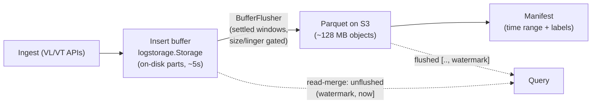

# Persistence & Durability

How Victoria Lakehouse keeps data safe across crashes and restarts, how it
produces optimally-sized S3 objects, and how it serves data that has not yet
reached S3 — **without a separate write-ahead log**.

> **No lakehouse WAL.** Earlier versions shipped a custom `internal/wal/`
> write-ahead log. It has been **removed**. Durability now comes from the
> insert buffer's own on-disk persistence (the VictoriaLogs/VictoriaTraces
> `logstorage` engine), exactly as hot VL/VT achieve it. Any reference to a
> `--lakehouse.insert.wal-*` flag, `lakehouse_insert_wal_bytes` metric, or "WAL
> replay" in older docs is obsolete.

---

## 1. The model in one paragraph

Ingested rows land in a **per-pod insert buffer**. With
`insert.buffer_engine: logstore`, that buffer is a real
`logstorage.Storage` (the same engine hot VL/VT run): it writes its rows to
**on-disk parts every flush interval (~5s) and restores them on open**. Those
parts are the durability substrate — they survive a crash the same way hot
VL/VT data does. A background **`BufferFlusher`** drains settled windows from
the buffer to **optimally-sized Parquet on S3** and records a **persisted flush
watermark**; the watermark only advances after a window's Parquet is fully
written, so a crash simply re-flushes the uncommitted window on restart
(idempotently — the manifest deduplicates). Until a row reaches S3, the **read
path serves it directly from the buffer** through the same query engine, so
reads are never stale.

---

## 2. Durability matrix — what survives what

| Event | `logstore` engine, flush **enabled** (the cutover target) | `logstore` engine, flush **disabled** (current default) | legacy `buffer` engine |
|---|---|---|---|
| **Process crash / kill -9** | Rows in the buffer's on-disk parts survive; the flush watermark re-flushes the uncommitted window on restart. Loss window ≈ buffer flush interval (~5s), matching hot VL/VT. | Buffer parts survive and serve **reads** for `buffer_retention`, but the **legacy staging** (authoritative for Parquet) loses its in-flight window — that window is never re-persisted to S3. | In-flight `[]row` staging is lost (no WAL). Loss window = up to `flush_interval`. |
| **Normal shutdown (SIGTERM)** | Buffer `Close()` flushes parts to disk; readiness gate holds `/ready`; manifest + footer-cache snapshots saved. | Same buffer `Close()`; legacy staging flush-on-shutdown. | Graceful flush of staging before exit. |
| **S3 unreachable** | Buffer keeps accepting (bounded by `buffer_retention` + disk); flush retries with backoff. | Same; legacy staging grows in memory, backpressure at `max_buffer_bytes`. | Backpressure at `max_buffer_bytes`. |
| **Already-flushed data** | Immutable Parquet on S3; survives everything. | Same. | Same. |

> **⚠️ Current default has a gap.** The buffer-authoritative flip
> (`buffer_flush_enabled`) is **off by default** and the LH WAL is deleted. So in
> the *default* configuration the in-flight window is held in the buffer for
> `buffer_retention` and served to reads, but is **not** re-flushed to S3 by the
> legacy path on crash. The two clean end-states are: **enable the flip** (full
> crash-safety, no WAL) or, if you need the legacy path authoritative,
> **`ack_mode: flush-sync`** (200 only after S3 confirms). See
> [Configuration](#7-configuration).

---

## 3. Crash recovery ("the pod dies")

1. **Where in-flight rows live.** Every ingested row is added to the buffer via
   the exported `MustAddRows`. logstorage flushes its in-memory `rowsBuffer` to
   an on-disk part on its flush interval (~5s) and **restores all parts on
   open**. So at any instant the at-risk window is only the rows newer than the
   last part flush.
2. **The flush watermark.** `BufferFlusher` persists
   `buffer_flush_watermark.json` (atomic tempfile + rename) and advances it
   **only after** every partition of a window has been written to S3 and
   registered in the manifest. On restart it reloads the watermark and
   re-flushes `(watermark, now-offset]`.
3. **Idempotent re-flush.** A re-flushed window produces new Parquet objects;
   `manifest.AddFile` is keyed so duplicate registrations are dropped, and the
   read path deduplicates spans by `(trace_id, span_id)`. Re-flushing loses
   nothing and double-counts nothing.
4. **The retention guard.** Un-flushed rows live **only** in the buffer until
   the flush commits, so the buffer must retain them across a full linger window
   **plus** restart downtime. Config validation enforces
   `buffer_retention >= 4 × buffer_flush_interval` for that margin — if retention
   were too tight, a row could age out before a crashed flusher recovers, which
   *is* data loss now that there is no WAL backstop.

This is pinned by `TestBufferFlusher_CrashRecovery` (both modules): commit a
watermark at T1, ingest `(T1, T2]`, "crash" (close + reopen the buffer from
disk), recover → the watermark reloads and the un-flushed window is re-collected
intact.

---

## 4. Normal shutdown

On SIGTERM the insert pod:

1. Stops accepting new writes and lets the buffer's `Close()` flush its parts to
   disk (durable for the next start).
2. Saves the **manifest snapshot** and **footer-cache snapshot** (bounded by
   `persist_timeout`) so the next start warms instantly instead of re-listing
   S3.
3. Holds `/ready` at `503`/`204` until disk recovery + the `MinManifestFiles`
   gate pass on the next boot, so a load balancer never routes to a pod that
   hasn't restored its buffer.

> **Hardening item:** a graceful *flusher* stop (drain the current window to S3
> on SIGTERM rather than re-flushing it on restart) is tracked as a follow-up.
> It shortens the post-restart re-flush, but is not required for correctness —
> the watermark already guarantees no loss.

---

## 5. Maintaining big S3 files

Small objects are expensive on object stores (per-request cost, read
amplification). Two mechanisms keep cold-tier Parquet at the ~128 MB target:

- **Size-gated flush.** The flusher checks frequently but **only flushes a
  window once it reaches `target_file_size` (128 MB) OR has lingered
  `buffer_flush_interval`** (the max-linger cap), whichever comes first. High
  ingest produces big objects directly; the tick cadence is *not* the flush
  cadence. This is the object-store analogue of the buffer's own (disk-oriented)
  ~5s part flush — the two are deliberately decoupled.
- **Compaction.** A background compactor merges the inevitable small L0 files
  (low-traffic windows) up through L1→L2 into 128 MB+ objects, applying
  progressively stronger zstd at each level. Once a file reaches target size it
  is never rewritten, so S3-IA/Glacier lifecycle transitions are safe.

Net write amplification stays ~1× for most data (no separate WAL copy; only
small-file compaction adds a small, amortized overhead).

---

## 6. Serving data not yet on S3 (peering reads)

A query must see rows that are still in the buffer (not yet flushed). This is the
**read-merge**:

- The select path queries the manifest for flushed Parquet **and** the unflushed
  window from the insert buffers.
- **Single-node (`role=all`):** the local buffer is queried directly through the
  **same `logstorage` engine** — zero struct→DataBlock conversion.
- **Multi-pod:** the **BufferBridge** fans out over HTTP to every insert pod's
  buffer (each returns only its own rows, so there is no double-count), used when
  `HasPeers()` is true.
- **No double-emission.** The buffer is served only for
  `(parquetWatermark, now]`, where `parquetWatermark` is the max `MaxTimeNs` of
  the Parquet just scanned. Aggregations (`count()`/`stats`) therefore never
  count a row twice. Trace-retrieval queries (Jaeger/Tempo span fetch) ignore the
  watermark and serve the buffer's full window, because the reader already
  deduplicates by `(trace_id, span_id)` — this is what gives cold Jaeger/Tempo
  **parity with hot VT for just-ingested traces**.

Result: zero-delay read-after-write on the recent window, served by the same
engine that owns the flushed data.

---

## 7. Configuration

| Key | Default | Meaning |
|---|---|---|
| `insert.buffer_engine` | `buffer` | `logstore` selects the logstorage-native durable buffer (Option B). `buffer` is the legacy in-memory staging. |
| `insert.buffer_dir` | `/data/lakehouse/buffer` | On-disk location of the buffer's parts. **Must be a durable volume** (not tmpfs) for crash recovery. |
| `insert.buffer_retention` | `1h` | How long the buffer keeps a row. With flush enabled this is the recovery ceiling; validated `>= 4 × buffer_flush_interval`. |
| `insert.buffer_flush_enabled` | `false` | When `true`, the buffer is the **authoritative** Parquet producer (the WAL cutover). Requires `buffer_engine: logstore`. |
| `insert.buffer_flush_interval` | `5m` | The object-store flush **cap** (max-linger). The flusher flushes on `target_file_size` OR this, whichever first. Must be `<< buffer_retention`. |
| `insert.target_file_size` | `128MB` | The size trigger for a flush and the compaction target. |
| `insert.ack_mode` | `buffer` | `buffer` acks after the in-memory/buffer add; `flush-sync` acks only after S3 confirms (zero-loss for the legacy path). |

---

## 8. E2E durability coverage & hardening roadmap

The compose e2e (`deployment/docker/docker-compose-e2e.yml`) runs hot VL/VT, cold
LH logs+traces, MinIO behind a `s3-latency` toxiproxy, and continuous + seed
datagen. **Covered today:** round-trip insert→flush→query fidelity, cold-vs-hot
parity within the flush window, S3-latency soak, cold-start warmup SLAs,
multi-tenant isolation, dual-write panic isolation, and the
buffer→logstorage→S3 chain.

**Not yet covered — the data-survival edge cases to harden** (each is a concrete,
scriptable scenario):

| Scenario | Why it matters | How to test |
|---|---|---|
| **Crash mid-window + restart** | Distinguishes recoverable in-flight loss (≤ flush interval) from silent loss/corruption. | Tail for a flush marker, `docker kill -9` the cold pod immediately after, restart, query rows inserted before the kill, assert loss ≤ one flush interval. |
| **Buffer-restore-on-restart (logstore)** | The whole no-WAL claim rests on parts restoring on open. | Ingest, `docker stop` (not flush-synced), restart, assert the recent window is queryable from the restored buffer. |
| **Watermark crash-recovery (mid-S3-write)** | Partial multipart uploads must not duplicate or lose rows. | Toxiproxy byte-level PUT failure at offset N, `kill` the pod, restart, assert `count_pre == count_post`. |
| **S3 write failure → backpressure** | Unbounded buffering on S3 error risks OOM or silent discard. | Inject 100% PUT errors, ingest, assert `rows_buffered` plateaus and ingestion rejects with a backpressure error (not OOM), then restore and verify flush. |
| **S3 read timeout → query backpressure** | Hung queries must time out, not leak goroutines. | Inject 60s GET latency, run a query, assert it errors within the query timeout and goroutine count stays bounded. |
| **Manifest refresh failure → stale fallback** | An S3 blip during refresh should keep queries serving the cached manifest. | Block `GET` on the manifest prefix past the refresh interval, query, assert success on the stale-but-available manifest. |
| **Graceful SIGTERM → final flush** | SIGTERM should drain before exit (or rely on watermark re-flush). | Ingest a unique batch, `docker stop` within a flush interval, assert the rows appear in S3 (flip-on) or are re-flushed on restart. |
| **Multi-instance peering (HA)** | Two insert pods sharing a bucket must not lose one pod's unflushed buffer for a tenant served by the other. | Two `lakehouse-*` instances, round-robin ingest, query via LB, kill one, assert results stay complete via the survivor + read-merge fan-out. |
| **Cache eviction under memory pressure** | Eviction must degrade to full-scan, not corrupt or OOM. | Saturate L1/L2 with a wide query under `mem_limit`, run a fresh query, assert correct counts and no OOM. |
| **Retention age-out vs flush race** | If `buffer_retention` is mis-sized, rows age out before flush. | Set retention near `buffer_flush_interval`, ingest, assert the config validation rejects it (or, if forced, that the loss is observable and metered). |

**Implemented so far:** a `chaos` build tag (`go test -tags 'e2e chaos' ./tests/e2e/
-run Chaos`) carries `TestChaos_BufferRestoreOnRestart` — ingest → restart the
cold-logs container → assert the pre-restart row survives (the buffer-restore row
above). The `lakehouse_insert_flush_watermark_timestamp` gauge is exported from
`saveWatermark`, so survival tests can assert against the committed boundary.

**Still to do:** flesh out the remaining table rows as `chaos` tests (S3
backpressure, manifest-stale fallback, multi-instance peering), and run the
crash-survival suite **with the flip enabled** once the clean-slate validation
lands — that is the scenario that proves the no-WAL durability claim end-to-end.

---

## See also

- [Write Path](write-path.md) — the ingest→Parquet pipeline.
- [Read Path](read-path.md) — the manifest scan + buffer read-merge.
- [Architecture: buffer-queryable-store design](architecture/buffer-queryable-store-design.md) — the logstore buffer internals.
- [Configuration](configuration.md) — all insert/buffer flags.
