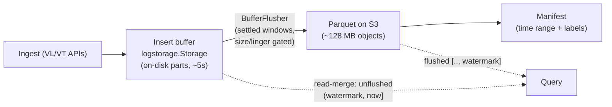

# Persistence & Durability

How Victoria Lakehouse keeps data safe across crashes and restarts, how it
produces optimally-sized S3 objects, and how it serves data that has not yet
reached S3 — **without a separate write-ahead log**.

> **No lakehouse WAL.** Earlier versions shipped a custom `internal/wal/`
> write-ahead log. It has been **removed**. Durability now comes from the
> insert buffer's own on-disk persistence (the VictoriaLogs/VictoriaTraces
> `logstorage` engine), exactly as hot VL/VT achieve it. Any reference to a
> `--lakehouse.insert.wal-*` flag, `lakehouse_insert_wal_bytes` metric, or "WAL
> replay" in older docs is obsolete.

---

## 1. The model in one paragraph

Ingested rows land in a **per-pod insert buffer**. With
`insert.buffer_engine: logstore`, that buffer is a real
`logstorage.Storage` (the same engine hot VL/VT run): it writes its rows to
**on-disk parts every flush interval (~5s) and restores them on open**. Those
parts are the durability substrate — they survive a crash the same way hot
VL/VT data does. A background **`BufferFlusher`** drains settled windows from
the buffer to **optimally-sized Parquet on S3** and records a **persisted flush
watermark**; the watermark only advances after a window's Parquet is fully
written, so a crash simply re-flushes the uncommitted window on restart
(idempotently — the manifest deduplicates). Until a row reaches S3, the **read
path serves it directly from the buffer** through the same query engine, so
reads are never stale.

```mermaid
flowchart LR
    I["Ingest (VL/VT APIs)"] --> B["Insert buffer<br/>logstorage.Storage<br/>(on-disk parts, ~5s)"]
    B -->|"BufferFlusher<br/>(settled windows,<br/>size/linger gated)"| P["Parquet on S3<br/>(~128 MB objects)"]
    P --> M["Manifest<br/>(time range + labels)"]
    B -.->|"read-merge: unflushed<br/>(watermark, now]"| Q["Query"]
    P -.->|"flushed [.., watermark]"| Q
```

---

## 2. Durability matrix — what survives what

| Event | `logstore` engine, flush **enabled** (the cutover target) | `logstore` engine, flush **disabled** (current default) | legacy `buffer` engine |
|---|---|---|---|
| **Process crash / kill -9** | Rows in the buffer's on-disk parts survive; the flush watermark re-flushes the uncommitted window on restart. Loss window ≈ buffer flush interval (~5s), matching hot VL/VT. | Buffer parts survive and serve **reads** for `buffer_retention`, but the **legacy staging** (authoritative for Parquet) loses its in-flight window — that window is never re-persisted to S3. | In-flight `[]row` staging is lost (no WAL). Loss window = up to `flush_interval`. |
| **Normal shutdown (SIGTERM)** | Buffer `Close()` flushes parts to disk; readiness gate holds `/ready`; manifest + footer-cache snapshots saved. | Same buffer `Close()`; legacy staging flush-on-shutdown. | Graceful flush of staging before exit. |
| **S3 unreachable or slow (uploads fail or time out)** | Buffer keeps accepting (bounded by `buffer_retention` + disk); the watermark does not advance, so the window is flushed again (see the note on duplicates in §2.1). | Legacy staging: every upload that fails, or that the flush does not reach before its deadline, is put back and retried by the next flush; its rows stay readable meanwhile. Past `insert.max_buffer_bytes` of unwritten rows inserts get **429** (as VictoriaLogs answers when it cannot take writes) until flushes catch up. | Same as the middle column. |
| **Already-flushed data** | Immutable Parquet on S3; survives everything. | Same. | Same. |
| **A delete (tombstone)** | Written through to local disk synchronously and to S3 in the same call before the API returns; retried until S3 confirms. Survives `kill -9`. | Same. | Same. |
| **An in-progress delete rewrite** | Two-phase (prepare → publish → commit) with a conditional publish: a crash or a concurrent compaction at any step leaves exactly one manifested copy of every kept row. See §3.1. | Same. | Same. |

> **⚠️ Current default has a gap.** The buffer-authoritative flip
> (`buffer_flush_enabled`) is **off by default** and the LH WAL is deleted. So in
> the *default* configuration the in-flight window is held in the buffer for
> `buffer_retention` and served to reads, but is **not** re-flushed to S3 by the
> legacy path on crash. The clean end-state is to **enable the flip** (full
> crash-safety, no WAL). `ack_mode: flush-sync` (200 only after S3 confirms) is
> not an alternative in this release: no binary reads `insert.ack_mode`. See
> [Configuration](#7-configuration).

### 2.1 Failed uploads

A flush writes one object per partition and tenant. When one of those
`PutObject` calls fails — or the flush's deadline passes before it gets there —
that tenant group goes back into the write buffer and the next flush writes it;
the groups that were written are never written again, so a failed flush neither
loses nor duplicates rows. Until a row is committed to the manifest it is
served to reads from the buffer (`/internal/buffer/query`, the co-located
buffer), including while its upload is in flight.

The unwritten rows are held in memory, so they are bounded: past
`insert.max_buffer_bytes` (buffered + uploading + put back) `CanWriteData`
refuses inserts with **429 Too Many Requests** — the status VictoriaLogs returns
when it cannot take writes — and clients (vlagent, OpenTelemetry Collector, any
VictoriaLogs client) back off and retry. When object storage refuses a small
probe write the answer is **503**; the probe result is reused for 10 s, not
repeated per insert request.

What is still lost: rows the final flush at shutdown cannot write (there is no
WAL on the legacy staging path) — counted in
`lakehouse_insert_rows_lost_at_shutdown_total` and logged — and, as before, the
in-memory window on `kill -9`.

Proof: `TestFlush_FailedUploadKeepsItsRows`,
`TestFlush_OnlyTheFailedTenantGroupIsRetried`,
`TestFlush_PartitionsNotReachedBeforeTheDeadlineArePutBack`,
`TestFlush_RowsStayVisibleWhileInFlight`,
`TestFlush_RandomFailuresUnderConcurrentInsertsLoseNothing` (random failures
and concurrent inserts, every row committed exactly once),
`TestCanWriteData_TooMuchUnwrittenDataIs429`,
`TestCanWriteData_ProbeIsReusedAndAnUnwritableStoreIs503`,
`TestStop_RowsTheFinalFlushCannotWriteAreCounted` — and their `TestTrace*`
twins in `lakehouse-traces`.

> **Known gap (buffer-authoritative flush).** With `buffer_flush_enabled`, a
> window whose flush fails part-way is flushed again whole on the next tick, so
> the partitions written in the failed attempt are written twice. Tracked
> separately; the legacy staging path above does not have it.

---

## 3. Crash recovery ("the pod dies")

1. **Where in-flight rows live.** Every ingested row is added to the buffer via
   the exported `MustAddRows`. logstorage flushes its in-memory `rowsBuffer` to
   an on-disk part on its flush interval (~5s) and **restores all parts on
   open**. So at any instant the at-risk window is only the rows newer than the
   last part flush.
2. **The flush watermark.** `BufferFlusher` persists
   `buffer_flush_watermark.json` (atomic tempfile + rename) and advances it
   **only after** every partition of a window has been written to S3 and
   registered in the manifest. On restart it reloads the watermark and
   re-flushes `(watermark, now-offset]`.
3. **Idempotent re-flush.** A re-flushed window produces new Parquet objects;
   `manifest.AddFile` is keyed so duplicate registrations are dropped, and the
   read path deduplicates spans by `(trace_id, span_id)`. Re-flushing loses
   nothing and double-counts nothing.
4. **The retention guard.** Un-flushed rows live **only** in the buffer until
   the flush commits, so the buffer must retain them across a full linger window
   **plus** restart downtime. Config validation enforces
   `buffer_retention >= 4 × buffer_flush_interval` for that margin — if retention
   were too tight, a row could age out before a crashed flusher recovers, which
   *is* data loss now that there is no WAL backstop.

This is pinned by `TestBufferFlusher_CrashRecovery` (both modules): commit a
watermark at T1, ingest `(T1, T2]`, "crash" (close + reopen the buffer from
disk), recover → the watermark reloads and the un-flushed window is re-collected
intact.

### 3.1 Deletes and rewrites

Deletes have two pieces of durable state — the **tombstone** (what is hidden or
scheduled for removal) and the **manifest** (which Parquet objects exist) — and
crash safety means never letting them disagree in a direction that loses rows.

**Tombstones.** Every mutation (create, un-delete, retirement of a fully
rewritten tombstone) is written through before the call returns: the local disk
copy (`{delete.persist_path}/tombstones.json`, temp file + rename) synchronously,
and the S3 copy (`{prefix}_tombstones/{id}.json`, one shared prefix for every
tenant) in the same call, queued and retried if S3 is down. Durability does
**not** depend on a graceful shutdown. On boot the store restores the **union**
of both copies, resolving per-record conflicts towards the one with the most
rewrite progress; a removal leaves a marker in the disk copy so a stale S3 copy
of an un-deleted or retired tombstone is not restored (its delete is re-issued).
Then every interrupted rewrite is resolved and a self-check compares the result
against the manifest and counts any disagreement (see
[Operations → Tombstone Management](operations.md#tombstone-management)).

**Rewrites.** Removing rows from a Parquet object means writing a filtered
replacement and dropping the original. The manifest is swapped between the two in
a single atomic step — and only if the original is still registered — and the
original is never deleted before that swap lands and is recorded. Each step is
recorded on the tombstone before the step that depends on it (`prepared` before
the upload, `published` after the swap, cleared after the original's delete;
`discarded` when a publish is refused), because the tombstone store is durable on
every change while the manifest is durable only as of its last snapshot.

**Recorded is not the same as durable.** Writing the record into the store is
what the next step reads, but a restart reads the *durable copies*, so no object
is deleted until the record authorising it has been **acknowledged by the target
a restore would read** — S3 when it is configured, the local disk otherwise. The
prepared record must be durable before the replacement is uploaded; the published
record before peers are told and before the original is deleted; the discarded
record before the abandoned replacement is deleted. When the write cannot be
confirmed the rewrite is deferred with everything left exactly as it is
(`lakehouse_delete_rewrite_deferred_total{reason="not_durable"}`), the
replacement stays **held** so no compaction can merge it while an undo is still
possible, and the next pass retries. A record restored at boot is a *merge* of
what the copies held, so it counts as durable nowhere until it has been written
back — otherwise a disk copy that outran S3 would authorise a delete S3 knows
nothing about.

**Nothing is inferred from an empty manifest.** "This key is not in the manifest"
means "the object is gone" only once this process has applied a bucket listing:
before the first refresh the manifest is a snapshot that may be older than the
object — or empty, on a node that lost its disk — so no tombstone retires and no
key is recorded as reaped until then
(`..._deferred_total{reason="unlisted"}`). The same holds for one key after a
listing: an undone rewrite's source is the live copy of its rows again, but its
entry only returns with the next refresh, so it is exempt until a listing that
*began after the undo* has been applied (`reason="awaiting_listing"`). And a node
whose S3 restore failed holds records that may be older than what S3 has, so it
resolves, finishes and retires nothing until the read succeeds
(`reason="restore_pending"`, `lakehouse_delete_tombstone_restore_pending`).

**The manifest refresh.** Every `manifest.refresh_interval` (and at startup) the
manifest is rebuilt from a bucket listing. A listing cannot tell a live file from
an object the manifest let go of, so the manifest remembers **retired** keys (a
publish replaced them, or an output was abandoned) and **pending** keys
(uploaded, not yet published) and the refresh adopts neither. A retired key is
held until a listing that began after the retirement proves the object gone —
not until the delete lands, because the listing already in flight was answered
before it.
Without that, every "unmanifested object is reclaimed by the orphan sweep" claim
below was false within one refresh interval: the refresh re-adopted the object
first — serving its rows twice, bringing deleted rows back once the tombstone
retired, and hiding it from the sweep for good. See
[Manifest System → What the refresh does not adopt](manifest-system.md#what-the-refresh-does-not-adopt).

A crash is followed by a restart in one of three states — the manifest snapshot
taken at the crash, a snapshot older than the rewrite, or no disk at all
(tombstones from S3, manifest from the listing) — and the refresh runs before the
scheduler gets another turn. Every row below holds in all three:

| crash point / interleaving | state left behind | how it converges |
|---|---|---|
| after `prepared` is recorded, before the upload | no replacement; source manifested (or adopted by the refresh) | restart undoes the rewrite (the replacement key is retired); the rewrite runs again |
| after the upload, before the publish | replacement in the bucket, `prepared` | restart retires the replacement, so the refresh does not adopt it next to the source; the next pass deletes it; the rewrite runs again |
| after the swap, before `published` is recorded | a snapshot may hold the swap; nothing outside the process saw it | restart reverses the swap: the replacement is retired, the source (retired by this swap only) is served again; the rewrite runs again |
| after `published` is recorded | replacement live; source retired | restart retires the source (a snapshot older than the swap would list it; the refresh would re-adopt it); the next pass deletes it and clears the record |
| after peers and pmeta are told | as above | as above |
| after the original is deleted | replacement live; record cleared | nothing to resolve; the refresh drops the original from an old snapshot |
| the original's delete fails (no crash) | source retired, record `published` | every pass retries the delete; the refresh never re-adopts the source meanwhile; the tombstone retires only after the delete lands |
| the publish fails or is refused, and the replacement's delete fails | record `discarded`, replacement retired | every pass retries the delete; the refresh never adopts the replacement |
| the refresh runs between any two steps of a live rewrite or compaction | pending output, or retired source | neither is adopted; a file published while the listing ran is kept |
| a compaction merged the original between the rewrite's read and its publish | the compacted output is manifested; the rewrite's swap is refused | the rewrite discards its replacement; the tombstone follows the rows into the compacted output and rewrites it if it still holds them |
| a rewrite replaced a source between a compaction's read and its publish | the replacement is manifested; the compaction's swap is refused | the compaction abandons (retires and deletes) its output and re-selects on the next tick |
| a compaction's source delete fails | output live; source retired | the compaction scheduler retries the delete every scan; the refresh never re-adopts the source |
| a compaction published its output, then died before updating the tombstone | the output holds the tombstone's rows; nothing on the tombstone names it | before retiring, the scheduler re-reads every file overlapping the range, finds the output and rewrites it |
| the record of a step cannot be written durably (S3 rejecting the tombstone writes) | the step before it stands; no object deleted | the rewrite is deferred with the replacement held; every pass retries the write and then the step |
| the scheduler ticks before this process has listed the bucket (a restart with no disk, or a snapshot older than the delete) | keys missing from the manifest that the bucket still holds | nothing is reaped and no tombstone retires until a listing has been applied; the refresh then adopts the objects and the rewrite runs |
| the tombstone store's S3 copy cannot be read at boot | the node holds only what its disk had (possibly nothing) | it enforces what it has, resolves and retires nothing, and retries the read every minute until it succeeds |
| two writers draw the same object key | one of them would overwrite a live file | keys are claimed before anything is written and redrawn on a collision; a publish onto a key the manifest already serves is refused |

Every one of these converges without operator action; none can leave a kept row
in no readable object, serve it twice, or retire a tombstone while a file still
holds its rows. Compaction never physically removes rows of a `hide` tombstone
or of one still inside `rewrite_delay`, and records an output clean for a
tombstone only if the merge applied it, so an un-delete always restores them.
The rewriter refuses to run without a manifest to publish into.

The rows are tests: `TestRewriteCrashMatrix_WithManifestRefresh` (every step of
the publish and discard paths × the three restart modes, refresh first),
`TestRewriteCrashMatrix_DurableRecordWritesFailing` (the same matrix with every
tombstone record after `prepared` rejected by S3),
`TestRewriteCrashMatrix_PassBeforeTheFirstRefresh` (the scheduler ticking before
this process has listed the bucket),
`TestRewriteCrashMatrix_TombstoneRestoreListFailing`,
`TestRewriteDurability_*`, `TestRewrite_ReplacementKeyCollision*`,
`TestRewriteRefreshAtEveryStep`, `TestRewriteRefresh_*` and
`TestResumeRewrites_RetriesUntilTheDeleteLands` in `internal/delete`;
`TestDeleteRace_*`, `TestDeleteRefresh_*` and the property suite
`TestDeleteLifecycleProperties` (random deletes, un-deletes, compactions, failing
deletes, refreshes and snapshot restarts) in `internal/compaction`; and the
refresh merge rules in `internal/manifest/refresh_retired_test.go`.

Two combinations fall outside the table: a node that loses its disk while S3
writes of the tombstone store are also failing restores an older record from S3;
and retired keys covering a *compaction's* leftover source are persisted with the
manifest snapshot, so a crash between that compaction and the next snapshot can
let the refresh adopt the leftover source again — the compaction crash window
that predates this change (see
[Operations → Known bounds](operations.md#where-tombstones-are-applied)).

**Rolling back is one-directional.** This release reads the previous release's
tombstone files; the previous release cannot read this one's disk envelope and
drops the rewrite records from the S3 copies it can read, so a rewrite that is
unfinished at the moment of a rollback is never resolved. Drain
`lakehouse_delete_rewrites_unfinished` and
`lakehouse_delete_tombstone_persist_pending` to zero first — the procedure is in
[Operations → Rolling back](operations.md#rolling-back), and
`GET {prefix}/leftovers` lists what is still outstanding.

---

## 4. Normal shutdown

On SIGTERM the insert pod:

1. Stops accepting new writes and lets the buffer's `Close()` flush its parts to
   disk (durable for the next start).
2. Saves the **manifest snapshot** and **footer-cache snapshot** (bounded by
   `persist_timeout`) so the next start warms instantly instead of re-listing
   S3.
3. Holds `/ready` at `503`/`204` until disk recovery + the `MinManifestFiles`
   gate pass on the next boot, so a load balancer never routes to a pod that
   hasn't restored its buffer.
4. Drains any tombstone S3 write a transient failure left owed. This is a
   backstop, not the durability mechanism — tombstones were already written
   through on every change — so a pod that never reaches this step loses
   nothing.

> **Hardening item:** a graceful *flusher* stop (drain the current window to S3
> on SIGTERM rather than re-flushing it on restart) is tracked as a follow-up.
> It shortens the post-restart re-flush, but is not required for correctness —
> the watermark already guarantees no loss.

---

## 5. Maintaining big S3 files

Small objects are expensive on object stores (per-request cost, read
amplification). Two mechanisms keep cold-tier Parquet at the ~128 MB target:

- **Size-gated flush.** The flusher checks frequently but **only flushes a
  window once it reaches `target_file_size` (128 MB) OR has lingered
  `buffer_flush_interval`** (the max-linger cap), whichever comes first. High
  ingest produces big objects directly; the tick cadence is *not* the flush
  cadence. This is the object-store analogue of the buffer's own (disk-oriented)
  ~5s part flush — the two are deliberately decoupled.
- **Compaction.** A background compactor merges the inevitable small L0 files
  (low-traffic windows) up through L1→L2 into 128 MB+ objects, applying
  progressively stronger zstd at each level. Once a file reaches target size it
  is never rewritten, so S3-IA/Glacier lifecycle transitions are safe.

Net write amplification stays ~1× for most data (no separate WAL copy; only
small-file compaction adds a small, amortized overhead).

---

## 6. Serving data not yet on S3 (peering reads)

A query must see rows that are still in the buffer (not yet flushed). This is the
**read-merge**:

- The select path queries the manifest for flushed Parquet **and** the unflushed
  window from the insert buffers.
- **Single-node (`role=all`):** the local buffer is queried directly through the
  **same `logstorage` engine** — zero struct→DataBlock conversion.
- **Multi-pod:** the **BufferBridge** fans out over HTTP to every insert pod's
  buffer (each returns only its own rows, so there is no double-count), used when
  `HasPeers()` is true.
- **No double-emission.** The buffer is served only for
  `(parquetWatermark, now]`, where `parquetWatermark` is the max `MaxTimeNs` of
  the Parquet just scanned. Aggregations (`count()`/`stats`) therefore never
  count a row twice. Trace-retrieval queries (Jaeger/Tempo span fetch) ignore the
  watermark and serve the buffer's full window, because the reader already
  deduplicates by `(trace_id, span_id)` — this is what gives cold Jaeger/Tempo
  **parity with hot VT for just-ingested traces**.

Result: zero-delay read-after-write on the recent window, served by the same
engine that owns the flushed data.

---

## 7. Configuration

| Key | Default | Meaning |
|---|---|---|
| `insert.buffer_engine` | `buffer` | `logstore` selects the logstorage-native durable buffer (Option B). `buffer` is the legacy in-memory staging. |
| `insert.buffer_dir` | `/data/lakehouse/buffer` | On-disk location of the buffer's parts. **Must be a durable volume** (not tmpfs) for crash recovery. |
| `insert.buffer_retention` | `1h` | How long the buffer keeps a row. With flush enabled this is the recovery ceiling; validated `>= 4 × buffer_flush_interval`. |
| `insert.buffer_flush_enabled` | `false` | When `true`, the buffer is the **authoritative** Parquet producer (the WAL cutover). Requires `buffer_engine: logstore`. |
| `insert.buffer_flush_interval` | `5m` | The object-store flush **cap** (max-linger). The flusher flushes on `target_file_size` OR this, whichever first. Must be `<< buffer_retention`. |
| `insert.target_file_size` | `128MB` | The size trigger for a flush and the compaction target. |
| `insert.ack_mode` | `buffer` | Designed as `buffer` (ack after the buffer add) or `flush-sync` (ack only after S3 confirms). **Not read by either binary in this release** — it is validated and a profile sets it, but no code path acts on it, so every insert is acknowledged once buffered. |
| `delete.persist_path` | `/data/lakehouse/tombstones` | Directory holding the local tombstone copy. **Must be a durable volume** — it is the copy that survives a `kill -9` when S3 is also unreachable. |

---

## See also

- [Write Path](write-path.md) — the ingest→Parquet pipeline.
- [Read Path](read-path.md) — the manifest scan + buffer read-merge.
- [Lifecycle & readiness](operations/lifecycle.md) — restart behavior, `/ready` semantics, warmup.
- [Configuration](configuration.md) — all insert/buffer flags.
- [Deletion strategy](deletion-strategy.md) — tombstone modes, cost model, rewrite scheduling.
- [Operations → Deletion Operations](operations.md#deletion-operations) — tombstone durability guarantee, the rewrite steps, and where tombstones are applied.
