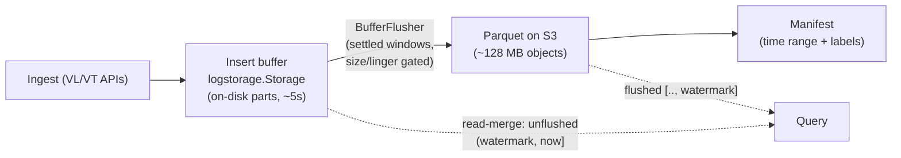

# Persistence & Durability

How Victoria Lakehouse keeps data safe across crashes and restarts, how it
produces optimally-sized S3 objects, and how it serves data that has not yet
reached S3 — **without a separate write-ahead log**.

> **No lakehouse WAL.** Earlier versions shipped a custom `internal/wal/`
> write-ahead log. It has been **removed**. Durability now comes from the
> insert buffer's own on-disk persistence (the VictoriaLogs/VictoriaTraces
> `logstorage` engine), exactly as hot VL/VT achieve it. Any reference to a
> `--lakehouse.insert.wal-*` flag, `lakehouse_insert_wal_bytes` metric, or "WAL
> replay" in older docs is obsolete.

---

## 1. The model in one paragraph

Ingested rows land in a **per-pod insert buffer**. With
`insert.buffer_engine: logstore`, that buffer is a real
`logstorage.Storage` (the same engine hot VL/VT run): it writes its rows to
**on-disk parts every flush interval (~5s) and restores them on open**. Those
parts are the durability substrate — they survive a crash the same way hot
VL/VT data does. A background **`BufferFlusher`** drains settled windows from
the buffer to **optimally-sized Parquet on S3** and records a **persisted flush
watermark**; the watermark only advances after a window's Parquet is fully
written, so a crash simply re-flushes the uncommitted window on restart
(idempotently — the manifest deduplicates). Until a row reaches S3, the **read
path serves it directly from the buffer** through the same query engine, so
reads are never stale.

```mermaid
flowchart LR
    I["Ingest (VL/VT APIs)"] --> B["Insert buffer<br/>logstorage.Storage<br/>(on-disk parts, ~5s)"]
    B -->|"BufferFlusher<br/>(settled windows,<br/>size/linger gated)"| P["Parquet on S3<br/>(~128 MB objects)"]
    P --> M["Manifest<br/>(time range + labels)"]
    B -.->|"read-merge: unflushed<br/>(watermark, now]"| Q["Query"]
    P -.->|"flushed [.., watermark]"| Q
```

---

## 2. Durability matrix — what survives what

| Event | `logstore` engine, flush **enabled** (the cutover target) | `logstore` engine, flush **disabled** (current default) | legacy `buffer` engine |
|---|---|---|---|
| **Process crash / kill -9** | Rows in the buffer's on-disk parts survive; the flush watermark re-flushes the uncommitted window on restart. Loss window ≈ buffer flush interval (~5s), matching hot VL/VT. | Buffer parts survive and serve **reads** for `buffer_retention`, but the **legacy staging** (authoritative for Parquet) loses its in-flight window — that window is never re-persisted to S3. | In-flight `[]row` staging is lost (no WAL). Loss window = up to `flush_interval`. |
| **Normal shutdown (SIGTERM)** | Buffer `Close()` flushes parts to disk; readiness gate holds `/ready`; manifest + footer-cache snapshots saved. | Same buffer `Close()`; legacy staging flush-on-shutdown. | Graceful flush of staging before exit. |
| **S3 unreachable** | Buffer keeps accepting (bounded by `buffer_retention` + disk); flush retries with backoff. | Same; legacy staging grows in memory, backpressure at `max_buffer_bytes`. | Backpressure at `max_buffer_bytes`. |
| **Already-flushed data** | Immutable Parquet on S3; survives everything. | Same. | Same. |
| **A delete (tombstone)** | Written through to local disk synchronously and to S3 in the same call before the API returns; retried until S3 confirms. Survives `kill -9`. | Same. | Same. |
| **An in-progress delete rewrite** | Two-phase (prepare → publish → commit) with a conditional publish: a crash or a concurrent compaction at any step leaves exactly one manifested copy of every kept row. See §3.1. | Same. | Same. |

> **⚠️ Current default has a gap.** The buffer-authoritative flip
> (`buffer_flush_enabled`) is **off by default** and the LH WAL is deleted. So in
> the *default* configuration the in-flight window is held in the buffer for
> `buffer_retention` and served to reads, but is **not** re-flushed to S3 by the
> legacy path on crash. The two clean end-states are: **enable the flip** (full
> crash-safety, no WAL) or, if you need the legacy path authoritative,
> **`ack_mode: flush-sync`** (200 only after S3 confirms). See
> [Configuration](#7-configuration).

---

## 3. Crash recovery ("the pod dies")

1. **Where in-flight rows live.** Every ingested row is added to the buffer via
   the exported `MustAddRows`. logstorage flushes its in-memory `rowsBuffer` to
   an on-disk part on its flush interval (~5s) and **restores all parts on
   open**. So at any instant the at-risk window is only the rows newer than the
   last part flush.
2. **The flush watermark.** `BufferFlusher` persists
   `buffer_flush_watermark.json` (atomic tempfile + rename) and advances it
   **only after** every partition of a window has been written to S3 and
   registered in the manifest. On restart it reloads the watermark and
   re-flushes `(watermark, now-offset]`.
3. **Idempotent re-flush.** A re-flushed window produces new Parquet objects;
   `manifest.AddFile` is keyed so duplicate registrations are dropped, and the
   read path deduplicates spans by `(trace_id, span_id)`. Re-flushing loses
   nothing and double-counts nothing.
4. **The retention guard.** Un-flushed rows live **only** in the buffer until
   the flush commits, so the buffer must retain them across a full linger window
   **plus** restart downtime. Config validation enforces
   `buffer_retention >= 4 × buffer_flush_interval` for that margin — if retention
   were too tight, a row could age out before a crashed flusher recovers, which
   *is* data loss now that there is no WAL backstop.

This is pinned by `TestBufferFlusher_CrashRecovery` (both modules): commit a
watermark at T1, ingest `(T1, T2]`, "crash" (close + reopen the buffer from
disk), recover → the watermark reloads and the un-flushed window is re-collected
intact.

### 3.1 Deletes and rewrites

Deletes have two pieces of durable state — the **tombstone** (what is hidden or
scheduled for removal) and the **manifest** (which Parquet objects exist) — and
crash safety means never letting them disagree in a direction that loses rows.

**Tombstones.** Every mutation (create, un-delete, retirement of a fully
rewritten tombstone) is written through before the call returns: the local disk
copy (`{delete.persist_path}/tombstones.json`, temp file + rename) synchronously,
and the S3 copy (`{tenant_prefix}_tombstones/{id}.json`) in the same call, queued
and retried if S3 is down. Durability does **not** depend on a graceful
shutdown. On boot the store restores the **union** of both copies, resolving
per-record conflicts towards the one with the most rewrite progress, then a
self-check compares the result against the manifest and counts any disagreement
(see [Operations → Tombstone Management](operations.md#tombstone-management)).

**Rewrites.** Removing rows from a Parquet object means writing a filtered
replacement and dropping the original. The manifest is swapped between the two in
a single atomic step — and only if the original is still registered — and the
original is never deleted before that swap lands:

| crash point / interleaving | state left behind | how it converges |
|---|---|---|
| after the replacement is uploaded | original still manifested; replacement unmanifested | the orphan sweep reclaims the replacement after `orphan_ttl`; the tombstone is retried |
| after the manifest swap | replacement manifested; original unmanifested | the orphan sweep reclaims the original; the kept rows are served from the replacement |
| after the original is deleted, before the tombstone records it | replacement manifested; tombstone still lists the key as pending | the scheduler sees the key is gone, marks it reaped, re-reads the files in the range and completes the tombstone |
| a compaction merged the original between the rewrite's read and its publish | the compacted output is manifested; the rewrite's swap is refused | the rewrite discards its replacement; the tombstone follows the rows into the compacted output and rewrites it if it still holds them |
| a rewrite replaced a source between a compaction's read and its publish | the replacement is manifested; the compaction's swap is refused | the compaction discards its output and re-selects on the next tick |
| a compaction published its output, then died before updating the tombstone | the output holds the tombstone's rows; nothing on the tombstone names it | before retiring, the scheduler re-reads every file overlapping the range, finds the output and rewrites it |

Every one of these converges without operator action; none can leave a kept row
in no readable object, store it twice, or retire a tombstone while a file still
holds its rows. Compaction never physically removes rows of a `hide` tombstone
or of one still inside `rewrite_delay`, so an un-delete always restores them.
The one thing that would break this is rewriting without a manifest to publish
into, so the rewriter refuses to run in that configuration rather than
orphaning its output. Each row of this table is a test in
`internal/delete/rewrite_crash_test.go` or `internal/compaction/delete_race_test.go`.

---

## 4. Normal shutdown

On SIGTERM the insert pod:

1. Stops accepting new writes and lets the buffer's `Close()` flush its parts to
   disk (durable for the next start).
2. Saves the **manifest snapshot** and **footer-cache snapshot** (bounded by
   `persist_timeout`) so the next start warms instantly instead of re-listing
   S3.
3. Holds `/ready` at `503`/`204` until disk recovery + the `MinManifestFiles`
   gate pass on the next boot, so a load balancer never routes to a pod that
   hasn't restored its buffer.
4. Drains any tombstone S3 write a transient failure left owed. This is a
   backstop, not the durability mechanism — tombstones were already written
   through on every change — so a pod that never reaches this step loses
   nothing.

> **Hardening item:** a graceful *flusher* stop (drain the current window to S3
> on SIGTERM rather than re-flushing it on restart) is tracked as a follow-up.
> It shortens the post-restart re-flush, but is not required for correctness —
> the watermark already guarantees no loss.

---

## 5. Maintaining big S3 files

Small objects are expensive on object stores (per-request cost, read
amplification). Two mechanisms keep cold-tier Parquet at the ~128 MB target:

- **Size-gated flush.** The flusher checks frequently but **only flushes a
  window once it reaches `target_file_size` (128 MB) OR has lingered
  `buffer_flush_interval`** (the max-linger cap), whichever comes first. High
  ingest produces big objects directly; the tick cadence is *not* the flush
  cadence. This is the object-store analogue of the buffer's own (disk-oriented)
  ~5s part flush — the two are deliberately decoupled.
- **Compaction.** A background compactor merges the inevitable small L0 files
  (low-traffic windows) up through L1→L2 into 128 MB+ objects, applying
  progressively stronger zstd at each level. Once a file reaches target size it
  is never rewritten, so S3-IA/Glacier lifecycle transitions are safe.

Net write amplification stays ~1× for most data (no separate WAL copy; only
small-file compaction adds a small, amortized overhead).

---

## 6. Serving data not yet on S3 (peering reads)

A query must see rows that are still in the buffer (not yet flushed). This is the
**read-merge**:

- The select path queries the manifest for flushed Parquet **and** the unflushed
  window from the insert buffers.
- **Single-node (`role=all`):** the local buffer is queried directly through the
  **same `logstorage` engine** — zero struct→DataBlock conversion.
- **Multi-pod:** the **BufferBridge** fans out over HTTP to every insert pod's
  buffer (each returns only its own rows, so there is no double-count), used when
  `HasPeers()` is true.
- **No double-emission.** The buffer is served only for
  `(parquetWatermark, now]`, where `parquetWatermark` is the max `MaxTimeNs` of
  the Parquet just scanned. Aggregations (`count()`/`stats`) therefore never
  count a row twice. Trace-retrieval queries (Jaeger/Tempo span fetch) ignore the
  watermark and serve the buffer's full window, because the reader already
  deduplicates by `(trace_id, span_id)` — this is what gives cold Jaeger/Tempo
  **parity with hot VT for just-ingested traces**.

Result: zero-delay read-after-write on the recent window, served by the same
engine that owns the flushed data.

---

## 7. Configuration

| Key | Default | Meaning |
|---|---|---|
| `insert.buffer_engine` | `buffer` | `logstore` selects the logstorage-native durable buffer (Option B). `buffer` is the legacy in-memory staging. |
| `insert.buffer_dir` | `/data/lakehouse/buffer` | On-disk location of the buffer's parts. **Must be a durable volume** (not tmpfs) for crash recovery. |
| `insert.buffer_retention` | `1h` | How long the buffer keeps a row. With flush enabled this is the recovery ceiling; validated `>= 4 × buffer_flush_interval`. |
| `insert.buffer_flush_enabled` | `false` | When `true`, the buffer is the **authoritative** Parquet producer (the WAL cutover). Requires `buffer_engine: logstore`. |
| `insert.buffer_flush_interval` | `5m` | The object-store flush **cap** (max-linger). The flusher flushes on `target_file_size` OR this, whichever first. Must be `<< buffer_retention`. |
| `insert.target_file_size` | `128MB` | The size trigger for a flush and the compaction target. |
| `insert.ack_mode` | `buffer` | `buffer` acks after the in-memory/buffer add; `flush-sync` acks only after S3 confirms (zero-loss for the legacy path). |
| `delete.persist_path` | `/data/lakehouse/tombstones` | Directory holding the local tombstone copy. **Must be a durable volume** — it is the copy that survives a `kill -9` when S3 is also unreachable. |

---

## See also

- [Write Path](write-path.md) — the ingest→Parquet pipeline.
- [Read Path](read-path.md) — the manifest scan + buffer read-merge.
- [Lifecycle & readiness](operations/lifecycle.md) — restart behavior, `/ready` semantics, warmup.
- [Configuration](configuration.md) — all insert/buffer flags.
- [Deletion strategy](deletion-strategy.md) — tombstone modes, cost model, rewrite scheduling.
- [Operations → Deletion Operations](operations.md#deletion-operations) — tombstone durability guarantee, the rewrite steps, and where tombstones are applied.
