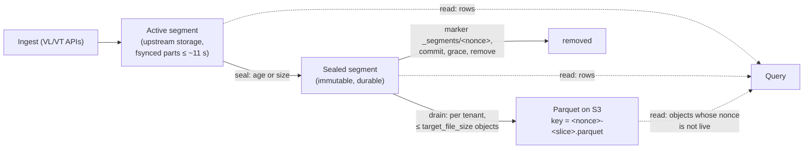

# Persistence & Durability

How Victoria Lakehouse keeps data safe across crashes and restarts, what an
acknowledged insert guarantees, how it produces optimally-sized S3 objects, and
how it serves data that has not yet reached S3 — exactly once, at every instant.

There is no write-ahead log of the Lakehouse's own. Durability is the insert
buffer's persistence, and the insert buffer **is** the VictoriaLogs/VictoriaTraces
storage engine, used the way upstream uses it.

---

## 1. The model in one paragraph

The insert buffer is a short sequence of **segments**. A segment is an upstream
`logstorage.Storage` in its own directory under `insert.buffer_dir`
(`seg-<seq>-<nonce>`), cut by **ingest time**: every acknowledged row goes into
the one **active** segment, whatever its `_time`. After `insert.buffer_flush_interval`
(or earlier, once the segment holds about `insert.target_file_size` while few
segments wait) the flusher **seals** the segment: the active segment is closed
and reopened, which makes every row of it durable and the segment immutable, and
a new active segment takes the writes. A **sealed** segment is **drained
completely** to Parquet on S3 — per tenant, in objects of at most
`target_file_size` — a **commit marker** is written to the bucket, the commit is
recorded locally, and the segment is **removed** after a short grace period.
Because a segment holds the rows that *arrived* in its time, late and backfilled
rows are written with the segment they arrived in: nothing depends on a row's
timestamp being recent.

Every object a segment produces carries the segment's **nonce** in its key
(`<nonce>-<slice>.parquet`). A query takes a snapshot of the live segments before
it lists objects, serves their rows from the segments and **drops their objects
from the scan**, so each row is answered once before, during and after the
segment's drain — there is no time boundary between "buffer" and "S3" to get
wrong.

```mermaid
flowchart LR
    I["Ingest (VL/VT APIs)"] --> A["Active segment<br/>(upstream storage,<br/>fsynced parts ≤ ~11 s)"]
    A -->|"seal: age or size"| S["Sealed segment<br/>(immutable, durable)"]
    S -->|"drain: per tenant,<br/>≤ target_file_size objects"| P["Parquet on S3<br/>key = &lt;nonce&gt;-&lt;slice&gt;.parquet"]
    S -->|"marker _segments/&lt;nonce&gt;,<br/>commit, grace, remove"| X["removed"]
    A -.->|"read: rows"| Q["Query"]
    S -.->|"read: rows"| Q
    P -.->|"read: objects whose nonce<br/>is not live"| Q
```

---

## 2. What an acknowledgement means

The insert adapter adds the rows to the active segment with upstream's own
`MustAddRows`, and answers the request. The guarantees are exactly those of hot
VictoriaLogs/VictoriaTraces:

- **Durable within upstream's window.** The rows are in upstream's in-memory
  buffer at the ack. Upstream turns them into an in-memory part within 1 s and
  writes that part to an fsynced on-disk part at the first flush tick (every
  **5 s**) after the part is 5 s old, so a row is on disk **within about 10 s**
  (11 s in theory). A crash (`kill -9`, power loss) loses at most those last
  seconds — the same window hot VL/VT lose, with the same settings. Measured
  with `kill -9` on a single small batch: rows 8 s old were lost and rows 10 s
  old were kept, in every trial, for this release and for hot VictoriaLogs
  v1.52.0 / VictoriaTraces v0.12.0 alike. Everything older is on the pod's
  disk and is restored when the pod starts.
- **Refused only as upstream refuses.** When the buffer's volume has less than
  its free-space floor (1 GiB) the storage is read-only and inserts get **429 Too
  Many Requests** with upstream's message (`cannot add rows into storage in
  read-only mode; the storage can be in read-only mode because of lack of free
  disk space at insert.buffer_dir=<dir>`), counted in
  `lakehouse_insert_rejected_total{reason="read_only"}`. Nothing else refuses a
  write.
- **An object-store outage refuses nothing.** The rows wait in sealed segments
  on the pod's disk and are written when the store is back (see §2.1). If the
  outage outlasts the disk, the 429 above is the backpressure.
- **No hidden failure.** A failure inside the buffer is not recovered in the
  adapter: as in upstream it fails the request, so the client retries instead of
  receiving an ack for rows that were stored nowhere.
- **What upstream drops at ingest, the Lakehouse drops too.** A row whose
  `_time` is more than 2 days in the future (`-futureRetention` of upstream) is
  rejected by the storage with upstream's warning and counter. There is no limit
  into the past (the buffer's retention is 100 years): backfilled rows of any
  age are kept until they are written, and the Lakehouse's own retention then
  applies to the objects.
- **Admission.** The logs binary drops, before the buffer, the rows of
  trace-shaped streams (span data sent to the logs endpoint:
  `lakehouse_logs_trace_shaped_rows_dropped_at_ingest_total`) and of streams over
  the tenant's cardinality limit. The traces binary applies the cardinality gate
  only. VictoriaTraces' `trace_id_idx` rows stay in the buffer, as in hot
  VictoriaTraces, and are dropped when the buffer is flushed (the `_trace_idx`
  footer index replaces them; counted in
  `lakehouse_vt_internal_rows_dropped_total{kind="trace_id_idx"}`).
  `lakehouse_insert_rows_total` counts the rows admitted into the buffer.

Proof: `TestInsertAdapter_EveryAdmittedRowReachesTheBuffer`,
`TestInsertAdapter_DropsTraceShapedAndOverLimitStreamsKeepsTheRest`,
`TestInsertAdapter_CanWriteData`, `TestInsertAdapter_BufferPanicPropagates`,
`TestInsertAdapter_RowsAreInTheSegments`, `TestLogsBuffer_FieldsNamedLikeTraceIndexRowsAreKept`
(logs) and `TestVTInsertAdapter_EverySpanReachesTheBuffer`,
`TestVTInsertAdapter_DropsOverLimitStreamsKeepsTheRest`,
`TestVTInsertAdapter_CanWriteData`, `TestVTInsertAdapter_BufferPanicPropagates`,
`TestVTInsertAdapter_DropsTraceIDIndexRow` (traces).

### 2.0 Durability matrix — what survives what

| Event | What happens |
|---|---|
| **`kill -9` / power loss** | Rows older than upstream's flush window (about 11 s at worst) are in fsynced parts and are restored when the pod starts; the restarted flusher drains every segment it finds. Loss window = upstream's, as in hot VL/VT. |
| **Normal shutdown (SIGTERM)** | The flusher stops (a drain cut short resumes after the restart) and the buffer closes: upstream writes the in-memory rows of every segment to disk. Nothing is lost. The manifest snapshot is saved before and after the close. |
| **Object store unreachable or slow** | Nothing is refused. Sealed segments wait on disk; each failed drain is retried with the same bytes after a back-off (1 s doubling to 30 s). Past the volume's free-space floor inserts get 429. |
| **Pod restarts while a segment drains** | The segment is found again; groups already stored are recognised (§3) and not sent again. |
| **Pod loses its disk before a segment drained** | The rows of undrained segments are lost (§2.4). |
| **Already-written data** | Immutable Parquet on S3; survives everything. |
| **A delete (tombstone)** | Written through to local disk and to S3 before the API returns; survives `kill -9`. See §3.1. |
| **An in-progress delete rewrite** | Two-phase with a conditional publish: a crash or a concurrent compaction leaves exactly one manifested copy of every kept row. See §3.1. |

### 2.1 Failed uploads

A drain writes one object per (tenant, hour partition, slice). The slices of a
tenant are planned from the segment's per-second row counts — at most
`target_file_size` worth of rows each (`estBytesPerRow` × rows), never crossing
an hour partition, a single second with more rows than the limit being one
slice — so **memory is bounded by the slice**, not by the segment, however large
the segment is. Keys are `<nonce>-<slice>`: the same in every process, because a
sealed segment is immutable.

The invariant: **an object's bytes never change once uploaded, and no key is
uploaded twice with different content.** To keep it:

- Before a segment's first upload the state file (`buffer_flush_state.json`, with
  a `.prev` mirror; temp file, fsync, rename, fsync of the directory) records it
  as *draining* (`draining_seq`). Committing a segment records `committed_through_seq`.
- After each PUT a "stored" mark (segment, tenant, partition, slice) is appended
  to `buffer_flush_state.json.stored` and fsynced before the object is committed
  to the manifest, so anything compaction can see has a durable mark. A failed
  mark write never fails the group — the object is stored and committed at once
  — but is counted (`lakehouse_buffer_flush_errors_total{stage="mark"}`).
- A group that fails in this process is kept, encoded, and retried as it is
  (same key, same bytes); a successful PUT is committed to the manifest at once.
- A failed drain backs off (1 s, doubling to 30 s) and resumes where it stopped;
  a segment is never skipped, so segments are written in order.
- When every group is stored or settled, the **marker** `{prefix}_segments/<nonce>`
  is written to the bucket, then the commit is recorded locally, then the
  segment stays readable for the grace period (`2 × manifest.refresh_interval +
  30 s`) and is removed. A segment committed locally always has its marker.

Each group is *settled*, in order, by: its stored mark; the manifest having
retired its key (its rows live in what replaced it — counted in
`lakehouse_insert_rows_superseded_total`); the manifest having the key; or —
**only for a segment a previous process was draining** — an object-store HEAD
finding the object (a listing adopts it later). A HEAD error waits for the next
attempt: the flusher never guesses. (HEAD needs `s3:ListBucket`, else S3 answers
403 for an absent key and recovery waits with `stage="head"` climbing; it also
needs the read-after-write consistency S3 provides.) Every other group is
collected from the segment and uploaded.

The dirty pmeta bundles (the bloom facet cannot be rebuilt from the manifest) are
written after each drain and retried on every tick.

Proof (both modules; every test also asserts through the `faultyUploader` that no
key was ever stored with two different byte sequences):
`TestSegments_FailedPutIsRetriedWithTheSameBytes`,
`TestSegments_FailedUploadIsKeptForTheRetry`, `TestSegments_HeadErrorWaits`,
`TestSegments_RetiredGroupIsSettled`, `TestSegments_AdoptedObjectIsNotUploadedAgain`,
`TestSegments_RandomFailuresUnderConcurrentIngestLoseNothing`,
`TestSegments_GroupsAreBoundedInRows`, `TestPlanSlices`,
`TestSegments_UnreadableStateStopsTheFlusher`, `TestSegments_TwoNodesNeverShareKeys`,
`TestSegments_KeepFilter`, `TestBufferFlusher_PersistsThePmetaBundles`.

### 2.2 Restart and the read handoff

The shutdown order matters for what the next boot can see:

1. `runShutdown` saves a first manifest snapshot before the long `Stop()` calls, so a SIGKILL during them still leaves a recent snapshot.
2. `store.Close()` stops the flusher, then closes the insert buffer.
3. The manifest snapshot is saved **again**: the objects the flusher wrote since the first snapshot are in no earlier snapshot, and without the second save the next boot would learn them only from the S3 listing. The saves are serialised and write through a unique temp file renamed into place, so a first save that outlived its timeout cannot corrupt the second.

After a restart the pod reopens every segment directory it finds — each is
sealed, none takes new rows — and starts a new active segment. The flusher's
state says which segments are already committed; the rest are drained. Rows are
visible from the first query: a segment's rows are served from the segment, its
objects (known from the snapshot or the listing, with exact or inferred time
bounds alike) are dropped from the scan, and once the segment is removed the
objects alone answer. Restart does not depend on the manifest being refreshed,
and no time boundary is computed from object metadata, so an object learned
from the listing with only its partition hour as time range cannot hide or
double any row.

**Inferred bounds.** An object the manifest knows only from a listing has no
recorded time range. The manifest infers the partition hour for it and marks the
entry `bounds_inferred`; an entry whose bounds are exactly the partition hour
(written that way by older versions) is treated as inferred too. Inferred bounds
are good enough to prune (they are a superset of the truth) but no metadata-only
answer (manifest fast path, count pushdown, 404 recovery, field-value
aggregates) uses such an object: it goes to the scan path. The startup warmup
resolves the exact bounds of the objects of the last 6 hours (newest first, at
most 512, bounded to 30 s) from the pmeta file-meta facet or with one ranged read
of the object's footer — never data pages, never the whole object — so the first
query after a restart can answer from metadata.

Proof: `TestBufferRestart_SameHourBufferedRowsVisibleExactlyOnce` (snapshot
before/after the drain, listing only, a crash before the drain),
`TestBufferRestart_NoDoubleCountAcrossRestarts`,
`TestBufferRestart_LegacyHourWideSnapshotEntry`,
`TestBufferRestart_MetadataAnsweredObjectsAreNotCountedTwice`,
`TestBufferRestart_AcrossUTCMidnight`, `TestBufferRestart_Property_EveryRowVisibleExactlyOnce`,
`TestResolveBounds_*` (the exact-bounds resolution),
`TestInferredObjectIsNotAnsweredFromMetadata` and the other tests of `inferred_bounds_test.go`.

### 2.3 The read handoff, exactly once

Every query takes a `bufferView` **before** it uses its object list:

- **Co-located buffer (no insert peers):** a snapshot of the live segments, held
  until the query ends, and their nonces.
- **Select pod with insert peers:** the rows every insert pod returned through
  `/internal/buffer/query` and, in the response header
  `X-Lakehouse-Buffer-Segments`, the nonces of the segments they were read from.
  A peer that fails contributes neither rows nor nonces, so none of its objects
  is dropped.

The scan then drops every object whose key carries one of those nonces
(`lakehouse_buffer_view_excluded_objects_total`). A segment is removed only when
it is committed, its grace has passed and no snapshot holds it; a peer keeps a
committed segment readable for the grace so that a select node has listed its
objects before the peer stops serving the rows. The rows are served with **no
time watermark**: a late row, a backfilled row or a restarted pod needs no
special case, and a trace-by-ID lookup is the same code path as any other query.

Proof: `TestBufferView_EachRowOnceThroughTheWholeHandoff` (active, sealed, after
each group of the drain, committed, late rows, segment removed, restart),
`TestBufferView_ConcurrentQueriesDuringDrains`,
`TestBufferView_ExcludeOnlyLiveSegmentObjects`, `TestBufferView_BridgedPeerHandoff`,
`TestBufferView_PeerWithoutNoncesExcludesNothing`, `TestBufferView_TraceByIDThroughTheHandoff`,
`TestBufferView_SegmentsInOnePartitionAreReadTogether`,
`TestBufferBridge_NoncesComeWithTheRows`, `TestSegmentsHeader_ListsTheNonces`,
`TestSegmentsHeader_SentWithAnEmptyAnswer`, `TestParseSegments`.

### 2.4 Compaction and delete rewrites leave live segments alone

Compaction merges, and a delete rewrite replaces, objects into objects **without**
the segment's nonce. While the segment is live that would serve its rows twice
(from the segment and from the merged object). So every merge path — the
compaction scan, a forced recompaction, a Tier A steal by the partition's
secondary owner — and the delete rewriter consult a **segment guard** (listed
once per scan, steal run or rewrite pass): an object that carries a nonce is merged or rewritten only after the
segment's marker has been in the bucket for twice the grace period (the pod stops
serving the segment at the grace; the margin covers clock skew and listing lag),
or once the nonce is older than 7 days (an owner that never committed — it lost
its disk). A failed marker listing releases nothing
(`lakehouse_compaction_segment_guard_errors_total`); a deferred rewrite is
counted (`lakehouse_delete_rewrite_deferred_total{reason="segment_live"}`) and the
tombstone's query-time filter keeps the rows hidden meanwhile. Markers older than
8 days are deleted by the compaction scan.

Proof: `TestSegmentGuard_Released`, `TestSegmentGuard_ReleasedFilesKeepsOnlyTheFreeOnes`,
`TestSegmentGuard_ReleasedFilesCopiesOnlyWhenItDrops`,
`TestSegmentNonceOfKey` (`internal/manifest`);
`TestScheduler_LeavesTheObjectsOfLiveBufferSegmentsAlone`,
`TestOrphanSweep_TierA_LeavesTheObjectsOfLiveBufferSegmentsAlone`,
`TestScheduler_DeletesMarkersOfSegmentsPastTheReleaseAge` (`internal/compaction`);
`TestSchedulerRunOnce_WaitsForTheBufferSegmentOfAnObject` (`internal/delete`).

### 2.5 Residuals, stated plainly

- **Loss of a pod's disk before its segments are drained.** The buffer is the
  only copy of acknowledged rows until they are in Parquet; the insert
  StatefulSet's volume claim is the protection (it is on by default in the Helm
  chart). A pod that loses the volume loses the rows of its undrained segments —
  at most `buffer_flush_interval` plus the drain time of ingest in steady state,
  plus whatever backlog an object-store outage built.
- **A PUT still in flight from a dead process** can land after the recovery HEAD
  said the object was absent; the restarted flusher then uploads the same key,
  possibly with different bytes (it collects the group again).
- **A failed mark write** (counted, `stage="mark"`), followed by compaction of
  that object and its retired record being forgotten before a restart, makes
  recovery send that group again next to the compacted object.
- **A drain later than 7 days.** After an object-store outage of days the
  segment's objects are released to compaction by age alone; a segment drained
  after that may be merged before its own commit.
- **Multi-node (#37).** A group whose object was stored but has neither a mark
  nor a manifest entry here can be uploaded again if another peer adopted it,
  compacted it and deleted it while this node was down.
- **A buffer directory of an earlier release** (upstream parts directly under
  `insert.buffer_dir`) is moved aside to `legacy-<unix>/` with a warning at
  startup. It is not read or flushed (the earlier release wrote those rows to
  Parquet); delete it when it is no longer needed.

---

## 3. Crash recovery ("the pod dies")

1. **Where in-flight rows live.** Every acknowledged row is in a segment of
   `insert.buffer_dir`. Upstream writes in-memory parts older than 5 s to an
   on-disk part at every 5 s tick and restores every part on open, so the at-risk window is the rows
   newer than the last part flush.
2. **The flusher's state.** `buffer_flush_state.json` (mirrored to `.prev`)
   holds `committed_through_seq` and `draining_seq`. A missing state means
   nothing is committed: every segment found is drained. A state file that exists
   but cannot be read, with no readable `.prev`, stops the process with a message
   saying how to proceed — it never guesses, because guessing would skip or
   repeat data.
3. **Resuming without rewriting.** The segment being drained is found again; each
   group is settled by its mark, the manifest or a HEAD (§2.1); only absent groups
   are uploaded. Objects are never rewritten, so re-draining loses nothing and
   writes no row twice, except in the residual cases of §2.5.

The crash matrix — a restart at every step of a drain (before the draining
record, after it, after the first PUT before its mark, after a mark, after all
PUTs, with the marker PUT failing, after the marker before the commit, after the
commit) — is pinned by `TestSegments_CrashMatrix` (both modules); a restart with
no flush state at all by `TestSegments_RestartBeforeAnyCommitDrainsEverything`;
late and backfilled rows by `TestSegments_LateRowsReachParquet` and
`TestSegments_BackfillIsKept`; ingest while a drain runs by
`TestSegments_IngestDuringDrainLosesNothing`; the seal policy and the removal
after the grace by `TestSegments_SealPolicy` and
`TestSegments_ReapRespectsGraceAndSnapshots`; the moved-aside old directory by
`TestSegments_SingleStoreBufferIsMovedAside`. The end-to-end form, with the real
containers, is `TestChaos_RestartRestoresTheBuffer` and
`TestChaos_Kill9LosesNothingBeyondTheUpstreamWindow` (`tests/e2e`, tags `e2e chaos`).

### 3.1 Deletes and rewrites

Deletes have two pieces of durable state — the **tombstone** (what is hidden or
scheduled for removal) and the **manifest** (which Parquet objects exist) — and
crash safety means never letting them disagree in a direction that loses rows.

**Tombstones.** Every mutation (create, un-delete, retirement of a fully
rewritten tombstone) is written through before the call returns: the local disk
copy (`{delete.persist_path}/tombstones.json`, temp file + rename) synchronously,
and the S3 copy (`{prefix}_tombstones/{id}.json`, one shared prefix for every
tenant) in the same call, queued and retried if S3 is down. Durability does
**not** depend on a graceful shutdown. On boot the store restores the **union**
of both copies, resolving per-record conflicts towards the one with the most
rewrite progress; a removal leaves a marker in the disk copy so a stale S3 copy
of an un-deleted or retired tombstone is not restored (its delete is re-issued).
Then every interrupted rewrite is resolved and a self-check compares the result
against the manifest and counts any disagreement (see
[Operations → Tombstone Management](operations.md#tombstone-management)).

**Rewrites.** Removing rows from a Parquet object means writing a filtered
replacement and dropping the original. The manifest is swapped between the two in
a single atomic step — and only if the original is still registered — and the
original is never deleted before that swap lands and is recorded. Each step is
recorded on the tombstone before the step that depends on it (`prepared` before
the upload, `published` after the swap, cleared after the original's delete;
`discarded` when a publish is refused), because the tombstone store is durable on
every change while the manifest is durable only as of its last snapshot.

**Recorded is not the same as durable.** Writing the record into the store is
what the next step reads, but a restart reads the *durable copies*, so no object
is deleted until the record authorising it has been **acknowledged by the target
a restore would read** — S3 when it is configured, the local disk otherwise. The
prepared record must be durable before the replacement is uploaded; the published
record before peers are told and before the original is deleted; the discarded
record before the abandoned replacement is deleted. When the write cannot be
confirmed the rewrite is deferred with everything left exactly as it is
(`lakehouse_delete_rewrite_deferred_total{reason="not_durable"}`), the
replacement stays **held** so no compaction can merge it while an undo is still
possible, and the next pass retries. A record restored at boot is a *merge* of
what the copies held, so it counts as durable nowhere until it has been written
back — otherwise a disk copy that outran S3 would authorise a delete S3 knows
nothing about.

**Nothing is inferred from an empty manifest.** "This key is not in the manifest"
means "the object is gone" only once this process has applied a bucket listing:
before the first refresh the manifest is a snapshot that may be older than the
object — or empty, on a node that lost its disk — so no tombstone retires and no
key is recorded as reaped until then
(`..._deferred_total{reason="unlisted"}`). The same holds for one key after a
listing: an undone rewrite's source is the live copy of its rows again, but its
entry only returns with the next refresh, so it is exempt until a listing that
*began after the undo* has been applied (`reason="awaiting_listing"`). And a node
whose S3 restore failed holds records that may be older than what S3 has, so it
resolves, finishes and retires nothing until the read succeeds
(`reason="restore_pending"`, `lakehouse_delete_tombstone_restore_pending`).

**The manifest refresh.** Every `manifest.refresh_interval` (and at startup) the
manifest is rebuilt from a bucket listing. A listing cannot tell a live file from
an object the manifest let go of, so the manifest remembers **retired** keys (a
publish replaced them, or an output was abandoned) and **pending** keys
(uploaded, not yet published) and the refresh adopts neither. A retired key is
held until a listing that began after the retirement proves the object gone —
not until the delete lands, because the listing already in flight was answered
before it.
Without that, every "unmanifested object is reclaimed by the orphan sweep" claim
below was false within one refresh interval: the refresh re-adopted the object
first — serving its rows twice, bringing deleted rows back once the tombstone
retired, and hiding it from the sweep for good. See
[Manifest System → What the refresh does not adopt](manifest-system.md#what-the-refresh-does-not-adopt).

A crash is followed by a restart in one of three states — the manifest snapshot
taken at the crash, a snapshot older than the rewrite, or no disk at all
(tombstones from S3, manifest from the listing) — and the refresh runs before the
scheduler gets another turn. Every row below holds in all three:

| crash point / interleaving | state left behind | how it converges |
|---|---|---|
| after `prepared` is recorded, before the upload | no replacement; source manifested (or adopted by the refresh) | restart undoes the rewrite (the replacement key is retired); the rewrite runs again |
| after the upload, before the publish | replacement in the bucket, `prepared` | restart retires the replacement, so the refresh does not adopt it next to the source; the next pass deletes it; the rewrite runs again |
| after the swap, before `published` is recorded | a snapshot may hold the swap; nothing outside the process saw it | restart reverses the swap: the replacement is retired, the source (retired by this swap only) is served again; the rewrite runs again |
| after `published` is recorded | replacement live; source retired | restart retires the source (a snapshot older than the swap would list it; the refresh would re-adopt it); the next pass deletes it and clears the record |
| after peers and pmeta are told | as above | as above |
| after the original is deleted | replacement live; record cleared | nothing to resolve; the refresh drops the original from an old snapshot |
| the original's delete fails (no crash) | source retired, record `published` | every pass retries the delete; the refresh never re-adopts the source meanwhile; the tombstone retires only after the delete lands |
| the publish fails or is refused, and the replacement's delete fails | record `discarded`, replacement retired | every pass retries the delete; the refresh never adopts the replacement |
| the refresh runs between any two steps of a live rewrite or compaction | pending output, or retired source | neither is adopted; a file published while the listing ran is kept |
| a compaction merged the original between the rewrite's read and its publish | the compacted output is manifested; the rewrite's swap is refused | the rewrite discards its replacement; the tombstone follows the rows into the compacted output and rewrites it if it still holds them |
| a rewrite replaced a source between a compaction's read and its publish | the replacement is manifested; the compaction's swap is refused | the compaction abandons (retires and deletes) its output and re-selects on the next tick |
| a compaction's source delete fails | output live; source retired | the compaction scheduler retries the delete every scan; the refresh never re-adopts the source |
| a compaction published its output, then died before updating the tombstone | the output holds the tombstone's rows; nothing on the tombstone names it | before retiring, the scheduler re-reads every file overlapping the range, finds the output and rewrites it |
| the record of a step cannot be written durably (S3 rejecting the tombstone writes) | the step before it stands; no object deleted | the rewrite is deferred with the replacement held; every pass retries the write and then the step |
| the scheduler ticks before this process has listed the bucket (a restart with no disk, or a snapshot older than the delete) | keys missing from the manifest that the bucket still holds | nothing is reaped and no tombstone retires until a listing has been applied; the refresh then adopts the objects and the rewrite runs |
| the tombstone store's S3 copy cannot be read at boot | the node holds only what its disk had (possibly nothing) | it enforces what it has, resolves and retires nothing, and retries the read every minute until it succeeds |
| two writers draw the same object key | one of them would overwrite a live file | keys are claimed before anything is written and redrawn on a collision; a publish onto a key the manifest already serves is refused |

Every one of these converges without operator action; none can leave a kept row
in no readable object, serve it twice, or retire a tombstone while a file still
holds its rows. Compaction never physically removes rows of a `hide` tombstone
or of one still inside `rewrite_delay`, and records an output clean for a
tombstone only if the merge applied it, so an un-delete always restores them.
The rewriter refuses to run without a manifest to publish into.

The rows are tests: `TestRewriteCrashMatrix_WithManifestRefresh` (every step of
the publish and discard paths × the three restart modes, refresh first),
`TestRewriteCrashMatrix_DurableRecordWritesFailing` (the same matrix with every
tombstone record after `prepared` rejected by S3),
`TestRewriteCrashMatrix_PassBeforeTheFirstRefresh` (the scheduler ticking before
this process has listed the bucket),
`TestRewriteCrashMatrix_TombstoneRestoreListFailing`,
`TestRewriteDurability_*`, `TestRewrite_ReplacementKeyCollision*`,
`TestRewriteRefreshAtEveryStep`, `TestRewriteRefresh_*` and
`TestResumeRewrites_RetriesUntilTheDeleteLands` in `internal/delete`;
`TestDeleteRace_*`, `TestDeleteRefresh_*` and the property suite
`TestDeleteLifecycleProperties` (random deletes, un-deletes, compactions, failing
deletes, refreshes and snapshot restarts) in `internal/compaction`; and the
refresh merge rules in `internal/manifest/refresh_retired_test.go`.

Two combinations fall outside the table: a node that loses its disk while S3
writes of the tombstone store are also failing restores an older record from S3;
and retired keys covering a *compaction's* leftover source are persisted with the
manifest snapshot, so a crash between that compaction and the next snapshot can
let the refresh adopt the leftover source again — the compaction crash window
that predates this change (see
[Operations → Known bounds](operations.md#where-tombstones-are-applied)).

**Rolling back is one-directional.** This release reads the previous release's
tombstone files; the previous release cannot read this one's disk envelope and
drops the rewrite records from the S3 copies it can read, so a rewrite that is
unfinished at the moment of a rollback is never resolved. Drain
`lakehouse_delete_rewrites_unfinished` and
`lakehouse_delete_tombstone_persist_pending` to zero first — the procedure is in
[Operations → Rolling back](operations.md#rolling-back), and
`GET {prefix}/leftovers` lists what is still outstanding.

---

## 4. Normal shutdown

On SIGTERM the insert pod:

1. Stops accepting new writes.
2. Saves the **manifest snapshot** and **footer-cache snapshot** (bounded by
   `persist_timeout`) so the next start warms instantly instead of re-listing S3.
3. Stops the **flusher** (a drain cut short resumes after the restart) and closes
   the insert buffer: upstream writes the in-memory rows of every segment to disk.
4. Drains any tombstone S3 write a transient failure left owed. This is a
   backstop, not the durability mechanism — tombstones were already written
   through on every change.
5. Saves the **manifest snapshot a second time**. The first snapshot (step 2)
   cannot contain the objects the flusher wrote while the `Stop()` calls ran; the
   second lets the next boot start with their exact time bounds instead of
   bounds inferred from the S3 listing (see §2.2).

Readiness holds `/ready` at `503`/`204` until disk recovery plus the
`MinManifestFiles` gate pass on the next boot.

---

## 5. Maintaining big S3 files

Small objects are expensive on object stores (per-request cost, read
amplification). Two mechanisms keep cold-tier Parquet near the 128 MB target:

- **Size-aware segments.** A segment is sealed after `buffer_flush_interval`, or
  earlier once it holds about `target_file_size` of rows while fewer than 64
  segments wait (past that, only age seals, so an outage builds a few large
  segments rather than many small ones). It is then cut into objects of at most
  `target_file_size`. High ingest produces big objects directly; the tick cadence
  is *not* the flush cadence.
- **Compaction.** A background compactor merges the inevitable small level-0
  objects (low-traffic segments) up through L1→L2 into 128 MB+ objects, applying
  progressively stronger zstd at each level. Once a file reaches target size it
  is never rewritten, so S3-IA/Glacier lifecycle transitions are safe.

Net write amplification stays ~1× for most data (no separate WAL copy; only
small-file compaction adds a small, amortized overhead).

---

## 6. Serving data not yet on S3 (peering reads)

A query must see rows that are still in the buffer. This is the read handoff of
§2.3:

- **Single-node (`role=all`):** the local segments are queried directly through
  the **same `logstorage` engine**, with no struct→DataBlock conversion.
- **Multi-pod:** the **BufferBridge** fans out over HTTP to every insert pod
  (each returns only its own rows and the nonces of its segments, so there is no
  double count), used when `HasPeers()` is true. Select pods hold no buffer and
  need no volume for it.
- **No double emission.** The scan drops the objects of the segments the view
  serves, so aggregations (`count()`/`stats`) never count a row twice. A
  trace-by-ID fetch (Jaeger/Tempo) takes the same path — this is what gives cold
  Jaeger/Tempo **parity with hot VT for just-ingested traces**.

Result: zero-delay read-after-write on the recent window, served by the same
engine that owns the flushed data.

---

## 7. Configuration

| Key | Default | Meaning |
|---|---|---|
| `insert.buffer_dir` | `/data/lakehouse/buffer` | The insert buffer: one directory per segment. **Must be a persistent volume** (a StatefulSet PVC); size it for `buffer_flush_interval` + drain + grace of ingest plus the outage you want to ride out ([Sizing](operations/sizing.md)). |
| `insert.buffer_flush_interval` | `5m` | The longest a segment stays open: sealed this long after it opened (earlier at `target_file_size`), then written whole and removed after a grace. |
| `insert.target_file_size` | `128MB` | The object size target and the early-seal trigger; compaction target. |
| `delete.persist_path` | `/data/lakehouse/tombstones` | Directory holding the local tombstone copy. **Must be a durable volume** — it is the copy that survives a `kill -9` when S3 is also unreachable. |

The settings of earlier releases' staging buffer — `insert.buffer_engine`,
`buffer_flush_enabled`, `buffer_retention`, `ack_mode`, `flush_interval` (and the
`-lakehouse.insert.flush-interval` flag), `max_buffer_rows`, `max_buffer_bytes`,
`flush_linger`, `flush_max_rows`, `peer_replicate*` — have been removed. A config
file that still sets one is refused at startup with a message naming the key.

---

## See also

- [Write Path](write-path.md) — the ingest→Parquet pipeline.
- [Read Path](read-path.md) — the manifest scan + the buffer read handoff.
- [Sizing](operations/sizing.md) — the buffer's disk formula and numbers.
- [Lifecycle & readiness](operations/lifecycle.md) — restart behavior, `/ready` semantics, warmup.
- [Configuration](configuration.md) — all insert/buffer flags.
- [Deletion strategy](deletion-strategy.md) — tombstone modes, cost model, rewrite scheduling.
- [Operations → Deletion Operations](operations.md#deletion-operations) — tombstone durability guarantee, the rewrite steps, and where tombstones are applied.
