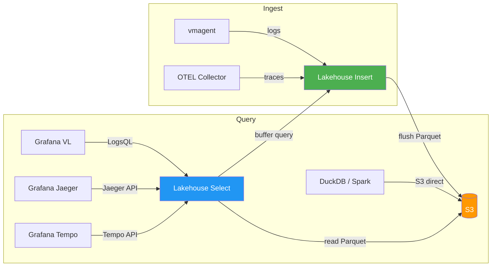
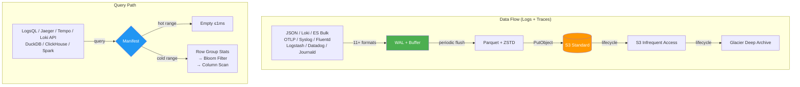

# Getting Started

Victoria Lakehouse is 100% API-compatible with VictoriaLogs and VictoriaTraces. It reimplements the VL/VT storage interface with Parquet on S3, exposing identical HTTP endpoints, LogsQL query syntax, insert APIs, and binary DataBlock protocol. It registers as a `-storageNode` on vlselect/vtselect and works transparently alongside existing VL/VT clusters.

It ships as two dedicated binaries — `lakehouse-logs` and `lakehouse-traces` — each with independent VL/VT dependency versions and optional role separation for independent scaling of insert and select workloads.

## How It Works

Victoria Lakehouse handles both logs and traces through the same architecture — the same ingest pipeline, same S3 storage, same Parquet format, same cache tiers. The only difference is the schema profile and query API surface.





> **Note**: Tempo API support is provided by VictoriaTraces upstream. Lakehouse inherits VT's Tempo handlers automatically via the storage dispatch layer — no custom implementation needed.

## Prerequisites

- S3-compatible storage (AWS S3, MinIO, Cloudflare R2) with Parquet files in Hive partition layout
- Go 1.23+ (for building from source)
- Docker (for container deployment)
- Helm 3 (for Kubernetes deployment)

## Installation

### Binary

```bash
# Build from source
git clone https://github.com/ReliablyObserve/victoria-lakehouse.git
cd victoria-lakehouse
make build-logs    # or: make build-traces

# Run logs
./bin/lakehouse-logs \
  --lakehouse.s3.bucket=obs-archive \
  --lakehouse.s3.region=us-east-1

# Run traces
./bin/lakehouse-traces \
  --lakehouse.s3.bucket=obs-archive \
  --lakehouse.s3.region=us-east-1
```

### Docker

```bash
# Logs
docker run -p 9428:9428 \
  ghcr.io/reliablyobserve/lakehouse-logs:latest \
  --lakehouse.s3.bucket=obs-archive \
  --lakehouse.s3.region=us-east-1

# Traces
docker run -p 10428:10428 \
  ghcr.io/reliablyobserve/lakehouse-traces:latest \
  --lakehouse.s3.bucket=obs-archive \
  --lakehouse.s3.region=us-east-1
```

For MinIO (local development):

```bash
docker run -p 9428:9428 \
  ghcr.io/reliablyobserve/lakehouse-logs:latest \
  --lakehouse.s3.bucket=obs-archive \
  --lakehouse.s3.endpoint=http://minio:9000 \
  --lakehouse.s3.access-key=minioadmin \
  --lakehouse.s3.secret-key=minioadmin \
  --lakehouse.s3.force-path-style=true
```

### Docker Compose (E2E with MinIO)

```bash
docker compose -f deployment/docker/docker-compose-e2e.yml up
```

This starts:
- MinIO (S3-compatible) on port 9000/9001
- Victoria Lakehouse (logs mode) on port 9428
- Victoria Lakehouse (traces mode) on port 10428

### Helm

```bash
# Logs mode
helm install lakehouse-logs oci://ghcr.io/reliablyobserve/charts/victoria-lakehouse \
  --set mode=logs \
  --set s3.bucket=obs-archive \
  --set s3.region=us-east-1

# Traces mode
helm install lakehouse-traces oci://ghcr.io/reliablyobserve/charts/victoria-lakehouse \
  --set mode=traces \
  --set s3.bucket=obs-archive \
  --set s3.region=us-east-1
```

With auto-discovery (recommended for cluster mode):

```bash
helm install lakehouse-logs oci://ghcr.io/reliablyobserve/charts/victoria-lakehouse \
  --set mode=logs \
  --set s3.bucket=obs-archive \
  --set s3.region=us-east-1 \
  --set discovery.headlessService=vlstorage.monitoring.svc.cluster.local \
  --set discovery.partitionAuthKey=secret
```

## Ingesting Data

Victoria Lakehouse accepts data through all VL-compatible insert APIs. It uses VictoriaLogs' native `vlinsert` handlers directly — full protocol parity with VL upstream:

| Protocol | Endpoint | Typical Source |
|---|---|---|
| NDJSON (VL native) | `/insert/jsonline` | vlagent, curl |
| Loki push (JSON + protobuf) | `/insert/loki/api/v1/push` | Promtail, Grafana Agent |
| Elasticsearch bulk | `/insert/elasticsearch/_bulk` | Filebeat, Fluentd |
| Syslog (RFC 5424) | `/insert/syslog` | rsyslog, syslog-ng |
| systemd journal | `/insert/journald` | journald export |
| Datadog logs | `/insert/datadog/api/v2/logs` | Datadog Agent |
| OTLP logs | `/insert/opentelemetry/v1/logs` | OTEL Collector |
| Splunk HEC | `/insert/splunk/services/collector/event` | Splunk forwarders |
| VL native binary | `/insert/native` | VL-to-VL replication |

```bash
# JSON line format (VL-native)
curl -X POST http://localhost:9428/insert/jsonline -d '
{"_time":"2026-05-04T10:00:00Z","_msg":"request completed","level":"info","service.name":"api-gw","trace_id":"abc123"}
{"_time":"2026-05-04T10:00:01Z","_msg":"database query slow","level":"warn","service.name":"user-svc"}'

# Loki push format
curl -X POST http://localhost:9428/insert/loki/api/v1/push -d '{
  "streams": [{
    "stream": {"service": "api-gw", "env": "prod"},
    "values": [["1714816800000000000", "request completed"]]
  }]
}'

# Elasticsearch bulk format
curl -X POST http://localhost:9428/insert/elasticsearch/_bulk -d '
{"index":{}}
{"_time":"2026-05-04T10:00:00Z","_msg":"hello world","service.name":"test"}'

# OTLP logs (OTEL Collector)
curl -X POST http://localhost:9428/insert/opentelemetry/v1/logs \
  -H 'Content-Type: application/json' -d '{
  "resourceLogs": [{
    "resource": {"attributes": [{"key": "service.name", "value": {"stringValue": "api-gw"}}]},
    "scopeLogs": [{"logRecords": [{"body": {"stringValue": "request completed"}}]}]
  }]
}'

# Syslog
echo '<165>1 2026-05-04T10:00:00Z myhost myapp 1234 - - request completed' | \
  curl -X POST http://localhost:9428/insert/syslog --data-binary @-
```

Data flows through the WAL (crash safety) into per-partition buffers, then flushes as Parquet files to S3. Queries see data immediately via the buffer query bridge.

## Deployment Patterns

### Pattern 1: Hot + Cold with vlagent and OTEL Collector (Recommended)

The recommended production architecture mirrors data to both hot and cold tiers simultaneously using vlagent (logs) and OTEL Collector (traces):

```bash
# vlagent mirrors logs to:
#   1. Hot VictoriaLogs cluster (1 month retention, EBS)
#   2. Victoria Lakehouse (unlimited retention, S3)

# OTEL Collector fans out traces to:
#   1. Hot VictoriaTraces cluster (1 month retention, EBS)
#   2. Victoria Lakehouse (unlimited retention, S3)
```

**vlagent config (logs):**

```yaml
remoteWrite:
  # Hot tier — VictoriaLogs (1 month, EBS)
  - url: http://vlinsert.monitoring.svc:9428/insert/jsonline
    name: hot-victorialogs
  # Cold tier — Victoria Lakehouse (unlimited, S3)
  - url: http://lakehouse-insert.monitoring.svc:9428/insert/jsonline
    name: cold-lakehouse
```

**OTEL Collector config (traces):**

```yaml
exporters:
  otlphttp/hot:
    endpoint: http://vtinsert.monitoring.svc:10428
  otlphttp/cold:
    endpoint: http://lakehouse-insert.monitoring.svc:10428

service:
  pipelines:
    traces:
      receivers: [otlp]
      processors: [memory_limiter, batch]
      exporters: [otlphttp/hot, otlphttp/cold]
```

**vlselect fans out to hot + cold automatically:**

```bash
vlselect --storageNode=vlstorage-0:9428,vlstorage-1:9428,vlstorage-2:9428,lakehouse-select:9428
vtselect --storageNode=vtstorage-0:10428,vtstorage-1:10428,vtstorage-2:10428,lakehouse-select:10428
```

For complete vlagent and OTEL Collector configurations, see [Deployment Architecture](deployment-architecture.md).

### Pattern 2: Multi-Select Storage Node

Register Victoria Lakehouse as a `-storageNode` on vlselect/vtselect:

```bash
# VictoriaLogs cluster
vlselect --storageNode=vlstorage-1:9428,vlstorage-2:9428,lakehouse-logs:9428

# VictoriaTraces cluster
vtselect --storageNode=vtstorage-1:10428,vtstorage-2:10428,lakehouse-traces:10428
```

Victoria Lakehouse auto-discovers the hot boundary by polling storage nodes' `/internal/partition/list` endpoint. Queries within the hot range get an empty response in <1ms.

### Pattern 3: Direct Grafana Query (Standalone)

Point Grafana datasources directly at Victoria Lakehouse:

```yaml
datasources:
  - name: Cold Logs
    type: victorialogs-datasource
    url: http://lakehouse-logs:9428

  - name: Cold Traces (Jaeger)
    type: jaeger
    url: http://lakehouse-traces:10428

  # Tempo datasource — requires VT with Tempo API support
  - name: Cold Traces (Tempo)
    type: tempo
    url: http://lakehouse-traces:10428
```

### Pattern 4: Scaled Insert + Select

Run insert and select as separate deployments for independent scaling:

```bash
# Insert pods (write to S3)
lakehouse-logs --lakehouse.role=insert \
  --lakehouse.s3.bucket=obs-archive

# Select pods (read from S3 + query insert buffers)
lakehouse-logs --lakehouse.role=select \
  --lakehouse.s3.bucket=obs-archive \
  --lakehouse.select.insert-headless-service=lakehouse-insert.monitoring.svc.cluster.local
```

Select pods discover insert pods via headless DNS and query their `/internal/buffer/query` endpoint for unflushed data.

### Pattern 5: Loki-VL-proxy Upstream (Hot+Cold)

Route queries through Loki-VL-proxy with automatic hot+cold routing:

```bash
loki-vl-proxy \
  -backend-url=http://victorialogs:9428 \
  -label-style=underscores \
  -metadata-field-mode=translated \
  -emit-structured-metadata=true \
  -stream-fields=service.name,k8s.namespace.name,k8s.pod.name,deployment.environment \
  -extra-label-fields=level,cloud.region,host.name,trace_id,span_id \
  -patterns-autodetect-from-queries=true \
  -label-values-indexed-cache=true \
  -cold-enabled=true \
  -cold-backend=http://lakehouse-logs:9428 \
  -cold-boundary=24h \
  -cold-overlap=1h
```

Queries for the last 24h go to VictoriaLogs (hot), older queries route to lakehouse (cold). The 1h overlap ensures no data gaps at the boundary. Use `-metadata-field-mode=translated` for full Grafana Loki Drilldown compatibility.

### Pattern 6: Disaster Recovery / Maintenance Fallback

Victoria Lakehouse serves as DR backend when the hot cluster is unavailable:

```yaml
# vmauth DR routing — try hot first, fall back to lakehouse
unauthorized_user:
  url_map:
    - src_paths: ["/select/.*"]
      url_prefix:
        - "http://vlselect.monitoring.svc:9428/"
        - "http://lakehouse-select.monitoring.svc:9428/"
      load_balancing_policy: first_available
      retry_status_codes: [502, 503]
```

During hot cluster maintenance or outage, queries automatically fail over to lakehouse. Slower (S3-backed, 50-500ms) but all data remains available.

See [Deployment Architecture — Disaster Recovery](deployment-architecture.md#disaster-recovery) for detailed DR playbook.

## YAML Config File

Instead of flags, use a YAML config:

```yaml
# /etc/lakehouse/config.yaml
lakehouse:
  mode: logs
  s3:
    bucket: obs-archive
    region: us-east-1
  cache:
    memory_limit: 1GB
    disk_path: /data/lakehouse/cache
    disk_limit: 100GB
  discovery:
    headless_service: vlstorage.monitoring.svc.cluster.local
    partition_auth_key: secret
```

```bash
lakehouse --lakehouse.config=/etc/lakehouse/config.yaml
```

CLI flags override YAML values.

## Verifying the Setup

After starting, check these endpoints:

```bash
# Liveness (always 200 once HTTP server starts)
curl http://localhost:9428/health

# Readiness (200 after startup warmup completes)
curl http://localhost:9428/ready

# Data range served
curl http://localhost:9428/manifest/range

# Build and config info
curl http://localhost:9428/lakehouse/info

# Prometheus metrics
curl http://localhost:9428/metrics
```

## Enabling Compaction for Production

For production deployments with ongoing inserts, enable background compaction to merge small L0 flush files into larger L1/L2 files. This improves query performance over time by reducing file count and improving row group density.

```bash
lakehouse-logs \
  --lakehouse.s3.bucket=obs-archive \
  --lakehouse.compaction.enabled=true \
  --lakehouse.compaction.leader-election=auto
```

Compaction only runs on the elected leader. In Kubernetes, the Helm chart automatically creates the required ServiceAccount and RBAC for `auto` (K8s Lease) mode. For non-Kubernetes deployments, `leader-election=s3` uses an S3 lock file.

See [Operations — Compaction](operations.md#compaction) for thresholds, monitoring, and troubleshooting.

## Next Steps

- [Deployment Architecture](deployment-architecture.md) — vlagent, OTEL Collector, hot/cold tiers, DR
- [Configuration Reference](configuration.md) — all 65+ flags with defaults
- [Architecture](architecture.md) — internal design, Parquet schema, query flow
- [Operations](operations.md) — day-2 operations, scaling, troubleshooting
- [Use Cases](use-cases.md) — DR, compliance, capacity planning, cost allocation
- [Analytics](analytics.md) — DuckDB, Trino, Spark, ClickHouse, Pandas examples
- [Security](security.md) — hardening, network policies, credential handling
