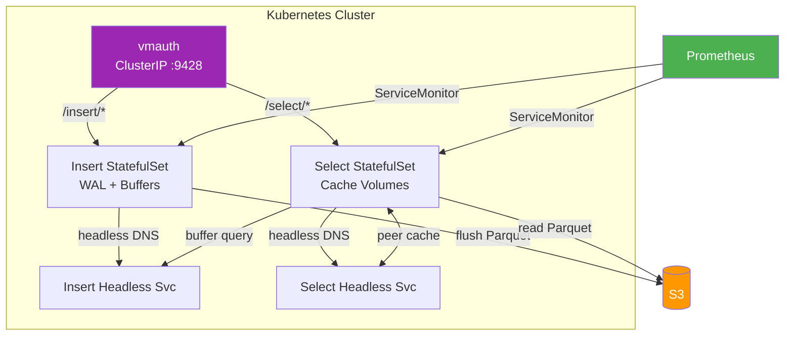

# Kubernetes Deployment

Victoria Lakehouse ships a production-ready Helm chart at `charts/victoria-lakehouse/` that deploys separate insert and select StatefulSets, headless services for peer discovery and buffer queries, optional vmauth routing, HPA/VPA autoscaling, PodDisruptionBudgets, and ServiceMonitor for Prometheus.

## Prerequisites

- Kubernetes 1.24+
- Helm 3.10+
- S3-compatible storage (AWS S3, MinIO, Cloudflare R2)
- IAM credentials or IRSA for S3 access

## Quick Install

```bash
# Logs mode
helm install lakehouse-logs oci://ghcr.io/reliablyobserve/charts/victoria-lakehouse \
  --set lakehouseConfig.mode=logs \
  --set lakehouseConfig.s3.bucket=obs-archive \
  --set lakehouseConfig.s3.region=us-east-1

# Traces mode (separate release)
helm install lakehouse-traces oci://ghcr.io/reliablyobserve/charts/victoria-lakehouse \
  --set lakehouseConfig.mode=traces \
  --set lakehouseConfig.s3.bucket=obs-archive \
  --set lakehouseConfig.s3.region=us-east-1
```

## Configuration Profiles

Set a profile globally or per-signal/per-role to tune 40+ settings with one value:

```yaml
# values.yaml — global profile
lakehouseConfig:
  profile: max-durability
  s3:
    bucket: obs-archive

# Per-signal: logs are business-critical, traces are best-effort
logs:
  profile: max-durability
traces:
  profile: max-cost-savings

# Per-role: fast queries for reads, durable writes
logs:
  insert:
    profile: max-durability
  select:
    profile: max-performance
```

Resolution order: per-role > per-signal > global. See [Getting Started — Configuration Profiles](getting-started.md#configuration-profiles) for the full profile reference.

## Architecture



## Chart Structure

The Helm chart deploys these Kubernetes resources:

| Template | Resource | Purpose |
|---|---|---|
| `insert-statefulset.yaml` | StatefulSet | Insert pods with WAL + partition buffers |
| `select-statefulset.yaml` | StatefulSet | Select pods with cache volumes |
| `insert-service.yaml` | Service (ClusterIP) | Insert endpoint for data ingestion |
| `select-service.yaml` | Service (ClusterIP) | Select endpoint for queries |
| `insert-headless-service.yaml` | Headless Service | Buffer query discovery for select pods |
| `select-headless-service.yaml` | Headless Service | Peer cache discovery |
| `configmap.yaml` | ConfigMap | Lakehouse YAML configuration |
| `vmauth-deployment.yaml` | Deployment | vmauth reverse proxy (optional) |
| `vmauth-service.yaml` | Service | vmauth endpoint |
| `vmauth-secret.yaml` | Secret | vmauth config |
| `hpa.yaml` | HPA | Horizontal pod autoscaler (optional) |
| `vpa.yaml` | VPA | Vertical pod autoscaler (optional) |
| `pdb.yaml` | PDB | Pod disruption budget (optional) |
| `servicemonitor.yaml` | ServiceMonitor | Prometheus scraping (optional) |
| `ingress.yaml` | Ingress | External access (optional) |
| `serviceaccount.yaml` | ServiceAccount | Per-component service accounts |
| `compaction-rbac.yaml` | Role/RoleBinding | RBAC for K8s Lease leader election |

## Key Values

### S3 Configuration

```yaml
lakehouseConfig:
  mode: logs          # "logs" or "traces"
  s3:
    bucket: obs-archive
    region: us-east-1
    prefix: ""                    # optional key prefix
    endpoint: ""                  # custom endpoint (MinIO, R2)
    access_key: ""                # or use IRSA
    secret_key: ""
    force_path_style: false       # true for MinIO
    max_connections: 128
    timeout: 30s
```

For AWS IRSA (recommended), leave `access_key`/`secret_key` empty and annotate the service account:

```yaml
select:
  serviceAccount:
    annotations:
      eks.amazonaws.com/role-arn: arn:aws:iam::123456789012:role/lakehouse-role
insertComponent:
  serviceAccount:
    annotations:
      eks.amazonaws.com/role-arn: arn:aws:iam::123456789012:role/lakehouse-role
```

### Insert and Select Scaling

```yaml
insertComponent:
  enabled: true
  replicaCount: 2
  persistence:
    enabled: true
    size: 50Gi                   # WAL + buffer storage
    storageClass: gp3
  resources:
    requests:
      cpu: 500m
      memory: 1Gi
    limits:
      memory: 2Gi

select:
  enabled: true
  replicaCount: 3
  persistence:
    enabled: true
    size: 100Gi                  # L2 disk cache
    storageClass: gp3
  resources:
    requests:
      cpu: 1
      memory: 2Gi
    limits:
      memory: 4Gi
```

### Cache Tuning

```yaml
lakehouseConfig:
  cache:
    memory_limit: 1GB            # L1 memory LRU per pod
    eviction_watermark: 0.8      # L2 eviction at 80% disk usage
  peer:
    auth_key: "shared-secret"    # peer cache authentication
    timeout: 5s
    max_connections: 32
```

### Buffer Query Bridge

Select pods discover insert pods via headless service DNS and query unflushed data:

```yaml
lakehouseConfig:
  select:
    buffer_query_enabled: true
    insert_headless_service: "lakehouse-logs-insert-headless.monitoring.svc.cluster.local"
    buffer_query_timeout: 2s
```

### Discovery and Hot Boundary

```yaml
lakehouseConfig:
  discovery:
    headless_service: vlstorage.monitoring.svc.cluster.local
    partition_auth_key: "auth-key"
    peer_headless_service: "lakehouse-logs-select-headless.monitoring.svc.cluster.local"
    refresh_interval: 5m
    timeout: 10s
```

### Compaction

```yaml
compaction:
  enabled: true
  interval: 5m
  leaderElection: auto           # auto, k8s, s3, none
  minFilesL0: 10
  minFilesL1: 10
  minAge: 1h
```

When `leaderElection` is `auto` or `k8s`, the chart creates RBAC resources (`compaction-rbac.yaml`) granting `get/create/update` on Lease objects in the `coordination.k8s.io/v1` API group.

## Multi-AZ Topology

Spread pods across availability zones for fault tolerance:

```yaml
select:
  replicaCount: 3
  topologySpreadConstraints:
    - maxSkew: 1
      topologyKey: topology.kubernetes.io/zone
      whenUnsatisfiable: DoNotSchedule
      labelSelector:
        matchLabels:
          app.kubernetes.io/component: select

insertComponent:
  replicaCount: 2
  affinity:
    podAntiAffinity:
      requiredDuringSchedulingIgnoredDuringExecution:
        - topologyKey: topology.kubernetes.io/zone
          labelSelector:
            matchLabels:
              app.kubernetes.io/component: insert
```

## Pod Topology Example

A production deployment for logs in a 3-AZ cluster:

```
monitoring namespace:
  lakehouse-logs-insert-0  (us-east-1a)  [WAL + buffers -> S3]
  lakehouse-logs-insert-1  (us-east-1b)  [WAL + buffers -> S3]
  lakehouse-logs-select-0  (us-east-1a)  [L2 cache, peer cache]
  lakehouse-logs-select-1  (us-east-1b)  [L2 cache, peer cache]
  lakehouse-logs-select-2  (us-east-1c)  [L2 cache, peer cache]
  lakehouse-logs-vmauth-*  (any)         [routes insert/select]
```

Each select pod runs with:
- A PVC for L2 disk cache (default 50Gi)
- Headless service membership for peer cache discovery
- Startup probe with 120 failures allowed (10 minutes warmup)
- Termination grace period of 60 seconds for in-flight query draining

## vmauth Routing

Enable vmauth to provide a single endpoint that routes insert and select traffic:

```yaml
vmauth:
  enabled: true
  replicaCount: 2
  service:
    type: ClusterIP
    port: 8427
```

The chart auto-generates vmauth config that routes `/insert/` paths to insert pods and `/select/` paths to select pods.

## Monitoring

Enable ServiceMonitor for Prometheus scraping:

```yaml
select:
  serviceMonitor:
    enabled: true
    interval: 30s
    labels:
      release: prometheus
insertComponent:
  serviceMonitor:
    enabled: true
    interval: 30s
    labels:
      release: prometheus
```

## Health Probes

Both insert and select pods expose `/health` (liveness) and `/ready` (readiness) endpoints. The chart configures:

```yaml
select:
  probe:
    liveness:
      initialDelaySeconds: 5
      periodSeconds: 10
      failureThreshold: 3
    readiness:
      initialDelaySeconds: 2
      periodSeconds: 5
      failureThreshold: 60    # 5min warmup window
    startup:
      periodSeconds: 5
      failureThreshold: 120   # 10min startup window
  terminationGracePeriodSeconds: 60
```

## Security Defaults

The chart ships with restrictive security context by default:

```yaml
common:
  podSecurityContext:
    runAsNonRoot: true
    runAsUser: 65534
    runAsGroup: 65534
    fsGroup: 65534
    seccompProfile:
      type: RuntimeDefault
  securityContext:
    readOnlyRootFilesystem: true
    allowPrivilegeEscalation: false
    capabilities:
      drop: ["ALL"]
```

## Registering with vlselect/vtselect

After deploying lakehouse, register its select service as a storage node on the hot cluster:

```bash
# VictoriaLogs
vlselect --storageNode=vlstorage-0:9428,vlstorage-1:9428,lakehouse-logs-select.monitoring.svc:9428

# VictoriaTraces
vtselect --storageNode=vtstorage-0:10428,vtstorage-1:10428,lakehouse-traces-select.monitoring.svc:10428
```

Grafana queries through vlselect/vtselect will automatically fan out to both hot and cold tiers.
