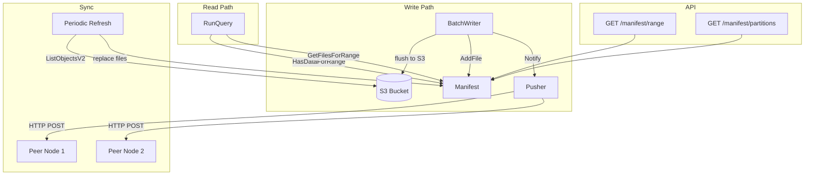
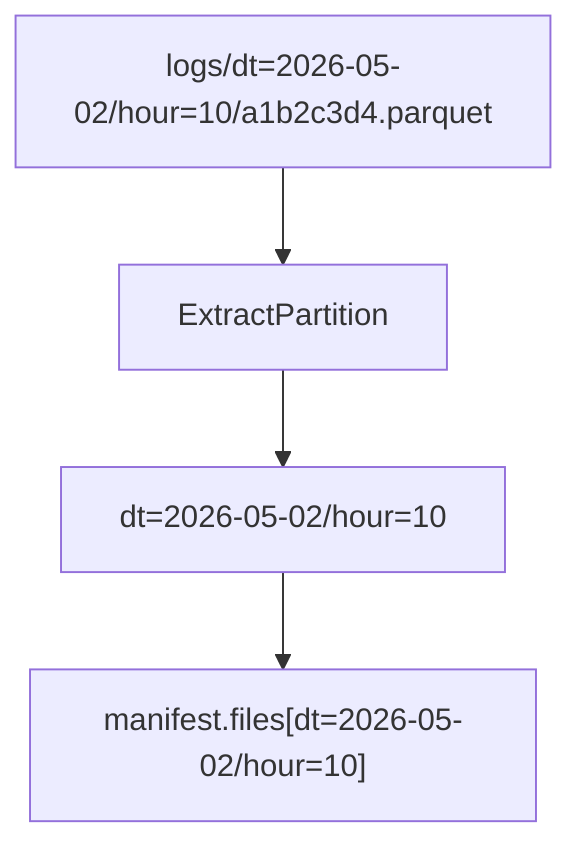
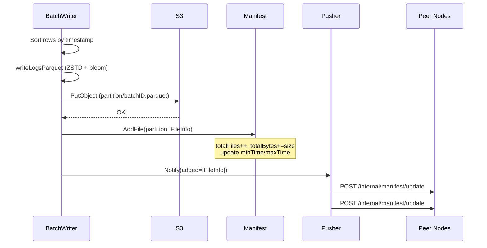
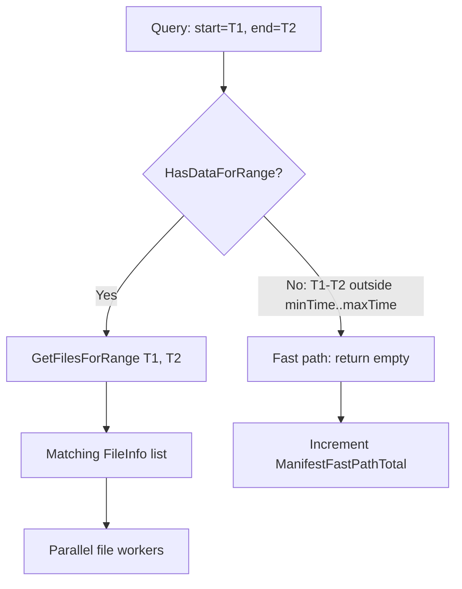
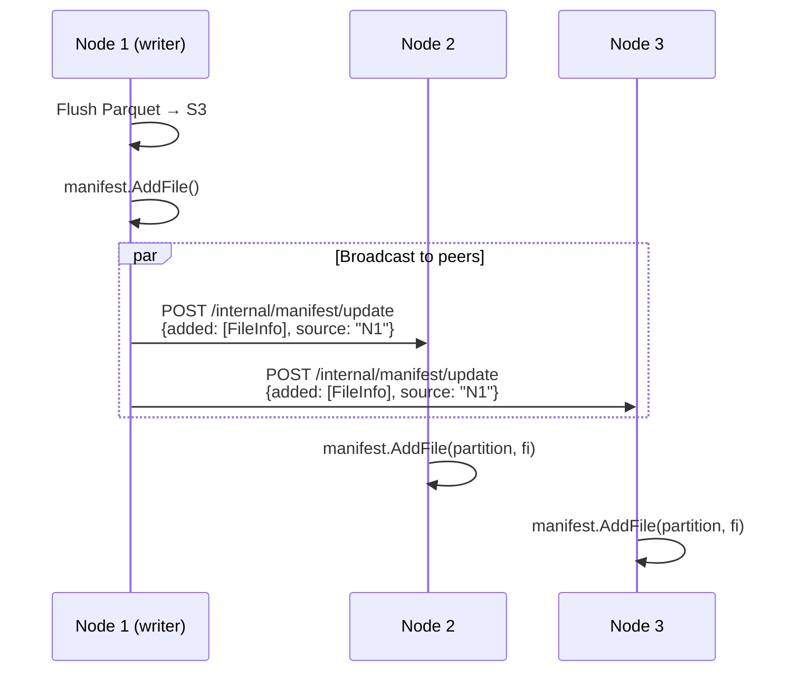
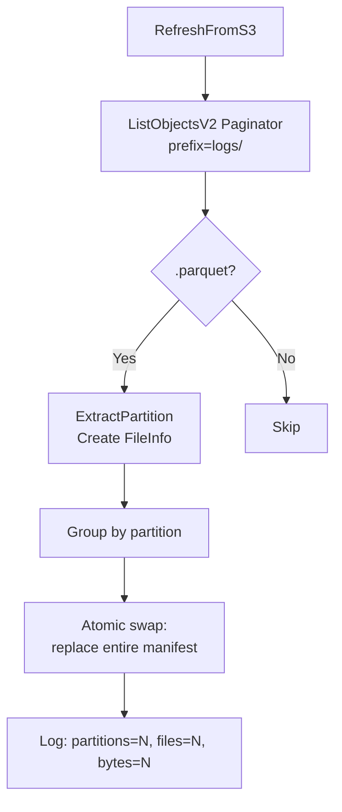
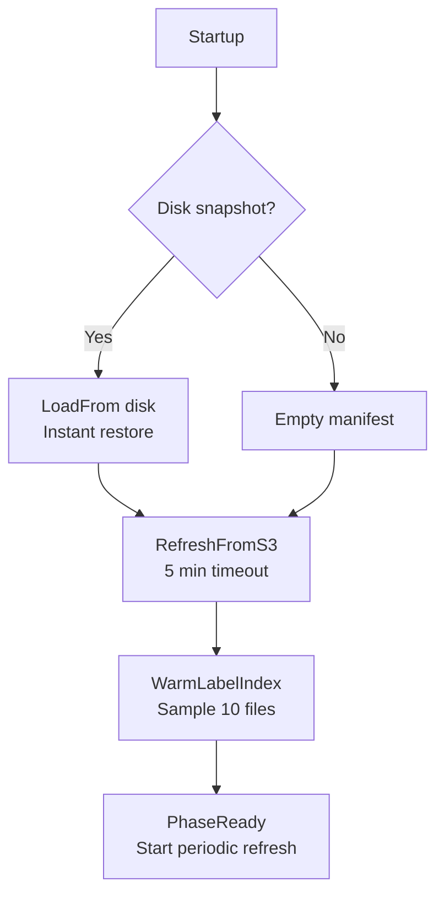

# Manifest System

The partition manifest is the bridge between the write and read paths. It tracks every Parquet file in S3, organized by Hive partition keys, and enables sub-millisecond "nothing here" responses for queries outside the data range.

## Architecture Overview



## Data Structures

### FileInfo

Each tracked file has a `FileInfo` record:

```
FileInfo {
    Key               string              // S3 object key
    Size              int64               // Object size in bytes
    RowCount          int64               // Number of rows (from write path)
    MinTimeNs         int64               // Earliest timestamp (nanoseconds)
    MaxTimeNs         int64               // Latest timestamp (nanoseconds)
    RawBytes          int64               // Uncompressed size
    SchemaFingerprint string              // Schema version hash
    CompactionLevel   int                 // Compaction pass count
    Labels            map[string][]string // Label values in file
}
```

**Methods:**
- `CompressionRatio()` — returns `RawBytes / Size`
- `MatchesLabel(field, value)` — checks if `Labels[field]` contains `value`

### Manifest

The `Manifest` struct holds all files in a thread-safe map:

```
Manifest {
    files       map[string][]FileInfo  // partition key → files
    minTime     time.Time              // Earliest data across all files
    maxTime     time.Time              // Latest data across all files
    totalFiles  int                    // Global file count
    totalBytes  int64                  // Global byte count
    lastRefresh time.Time              // Last S3 scan timestamp
    prefix      string                 // S3 key prefix (e.g., "logs/")
    bucket      string                 // S3 bucket name
}
```

## Partition Key Format

Files are grouped by Hive-style partition keys: `dt=YYYY-MM-DD/hour=HH`



**Key functions:**
- `ExtractPartition(key)` — extracts `dt=.../hour=...` from an S3 path
- `ParsePartitionTime(partition)` — parses partition to `time.Time`
- `partitionFromNano(ns)` — generates partition key from nanosecond timestamp

## Write Path Integration

When the BatchWriter flushes a Parquet file to S3, it immediately registers it in the manifest:



**FileInfo populated on flush:**
```
FileInfo{
    Key:               "logs/dt=2026-05-02/hour=10/a1b2c3d4.parquet",
    Size:              len(compressed),
    RowCount:          len(rows),
    MinTimeNs:         rows[0].TimestampUnixNano,
    MaxTimeNs:         rows[last].TimestampUnixNano,
    RawBytes:          result.RawBytes,
    SchemaFingerprint: schemaFingerprint(mode),
    Labels:            extractLogLabels(rows),
}
```

Files are queryable immediately after `AddFile` — no refresh cycle needed for locally written data.

## Read Path Integration

Queries use the manifest to find relevant files and skip irrelevant time ranges:



### Fast Path

`HasDataForRange(startNs, endNs)` compares the query range against the manifest's global `minTime`/`maxTime`. If there's no overlap, the query returns immediately (< 1 ms). This handles the common case where queries target the hot VL/VT range and Lakehouse has no data there.

### File Selection

`GetFilesForRange(startNs, endNs)` iterates partitions, matches those overlapping the query range, and returns all `FileInfo` entries. Results are sorted by key for deterministic processing.

### Smart Cache Pinning

During a query, all matching files are pinned in the SmartCache to prevent eviction while the query is in flight:

```
for each file in manifest files:
    smartCache.Pin(file.Key, queryID)

defer:
    for each file:
        smartCache.Unpin(file.Key, queryID)
```

## Peer Synchronization

**File:** `internal/manifest/push.go`

When a node writes new files, it broadcasts the update to all peers via HTTP:



### Update Protocol

```
POST /internal/manifest/update
Authorization: Bearer {peer.auth_key}
Content-Type: application/json

{
    "added": [{
        "key": "logs/dt=2026-05-02/hour=10/a1b2.parquet",
        "size": 1048576,
        "row_count": 5000,
        "min_time_ns": 1714694400000000000,
        "max_time_ns": 1714698000000000000,
        "labels": {"service.name": ["api-server", "web-frontend"]}
    }],
    "removed": ["logs/dt=2026-05-01/hour=08/old.parquet"],
    "source": "10.0.0.5:9428"
}
```

The receiving node verifies the Bearer token, then applies additions and removals to its local manifest.

### Compaction Integration

The compaction scheduler also uses `Pusher.Notify()` after merging files — broadcasting both the new merged file (added) and the replaced source files (removed).

## S3 Refresh

**Full scan** via `RefreshFromS3(ctx, client)`:



- Uses AWS SDK v2 paginator (handles 1000-item pages)
- Filters to `.parquet` files only
- Atomically replaces the entire manifest under write lock
- Recalculates `minTime`, `maxTime`, `totalFiles`, `totalBytes`

**Limitation:** S3 refresh only populates `Key` and `Size` fields. Rich metadata (`RowCount`, `MinTimeNs`, `MaxTimeNs`, `Labels`) is only available for files registered through the write path.

### Refresh Schedule

Periodic refresh runs on a configurable interval:

| Config | Default | Flag |
|--------|---------|------|
| `manifest.refresh_interval` | `5m` | `--lakehouse.manifest.refresh-interval` |

## Startup Sequence



On startup:
1. Load disk snapshot if available (fast, < 100 ms)
2. Full S3 refresh (may take seconds for large buckets)
3. Sample files to build label index for field discovery
4. Mark ready and start periodic refresh ticker

## Persistence

**File format:** JSON

```go
type persistedManifest struct {
    Files       map[string][]FileInfo  // Partition → files
    MinTimeNs   int64
    MaxTimeNs   int64
    TotalFiles_ int
    TotalBytes_ int64
    SavedAt     time.Time
}
```

- `SaveTo(path)` — atomic write (temp file + rename), permissions `0o600`
- `LoadFrom(path)` — reads JSON, restores all fields under lock, no-op if file missing

## API Endpoints

### GET /manifest/range

Returns the global data range and totals:

```json
{
    "min_time": 1714694400000000000,
    "max_time": 1714780800000000000,
    "min_date": "2026-05-02",
    "max_date": "2026-05-03",
    "total_files": 1247,
    "total_bytes": 52428800000
}
```

Used by external consumers (Loki-VL-proxy, monitoring) for routing decisions.

### GET /manifest/partitions

Returns per-partition summaries with optional date filtering:

```
GET /manifest/partitions?start=2026-05-01&end=2026-05-05
```

```json
{
    "partitions": [
        {"date": "2026-05-02", "hours": [10, 11, 14, 23], "files": 12, "bytes": 5242880},
        {"date": "2026-05-03", "hours": [0, 1, 2], "files": 6, "bytes": 2621440}
    ]
}
```

## Thread Safety

All manifest operations are protected by `sync.RWMutex`:

| Operation | Lock Type |
|-----------|-----------|
| AddFile, RemoveFile | Write lock |
| RefreshFromS3, LoadFrom | Write lock |
| GetFilesForRange, HasDataForRange | Read lock |
| TotalFiles, TotalBytes, MinTime, MaxTime | Read lock |
| AllFiles, GetPartitions | Read lock |

Concurrent reads are fully parallel. Writes serialize against each other and block reads momentarily.

## Metrics

| Metric | Type | Description |
|--------|------|-------------|
| `lakehouse_manifest_files` | Gauge | Current tracked file count |
| `lakehouse_manifest_bytes` | Gauge | Current tracked total bytes |
| `lakehouse_manifest_fast_path_total` | Counter | Queries with no overlapping data |
| `lakehouse_manifest_refresh_duration_seconds` | Histogram | S3 refresh latency |
| `lakehouse_manifest_push_total` | Counter | Updates sent to peers |
| `lakehouse_manifest_push_peers` | Gauge | Peer count in cluster |
| `lakehouse_manifest_push_errors_total` | Counter | Failed push attempts |
| `lakehouse_manifest_update_received_total` | Counter | Updates received from peers |
