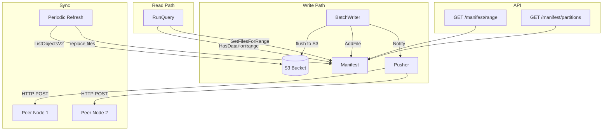
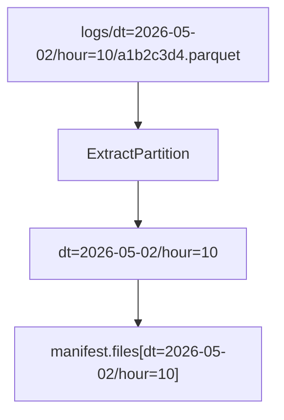
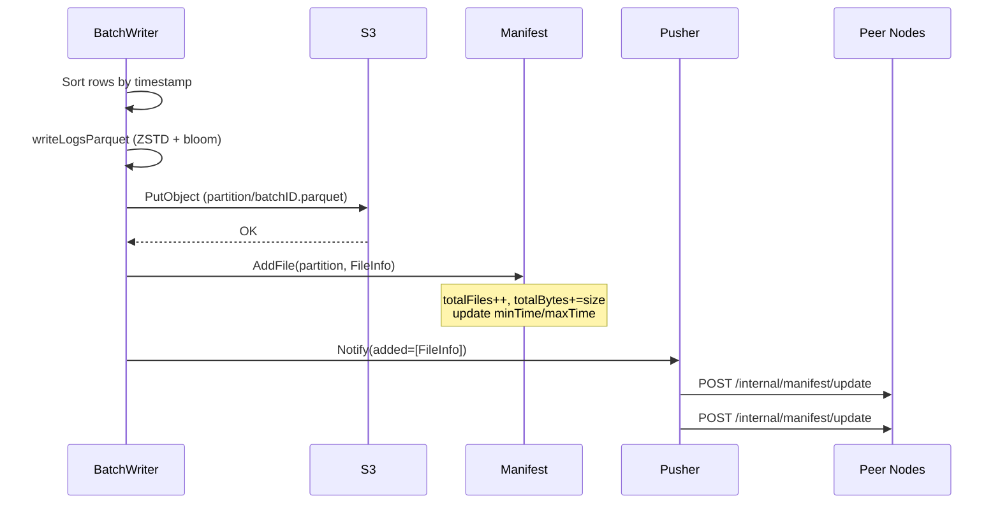
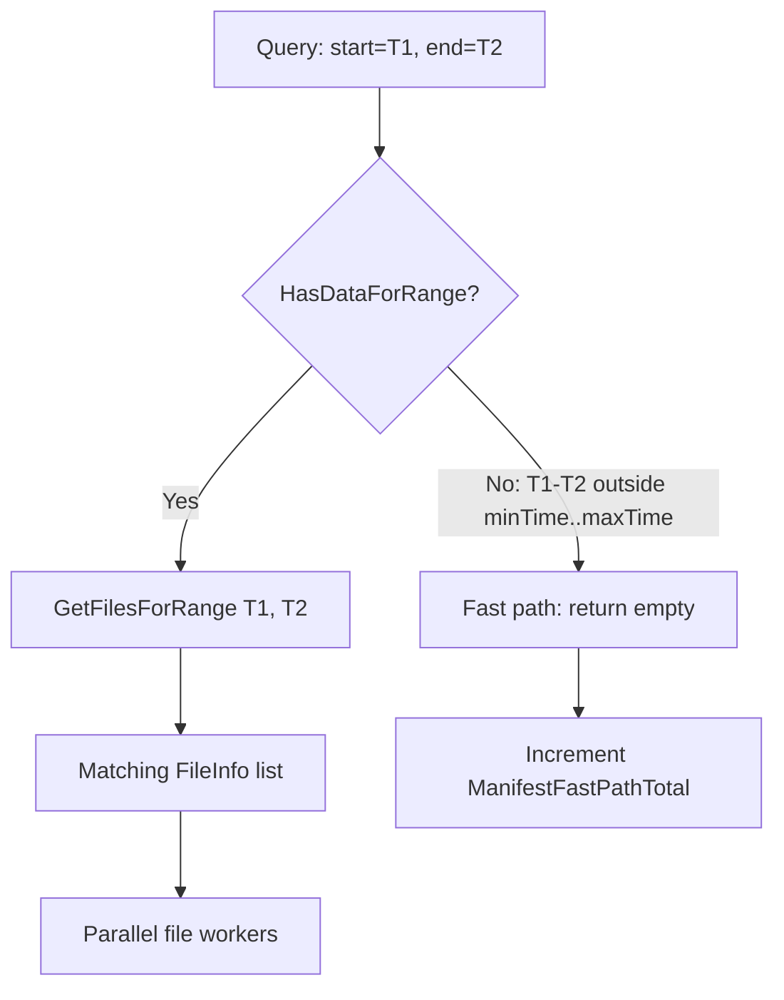
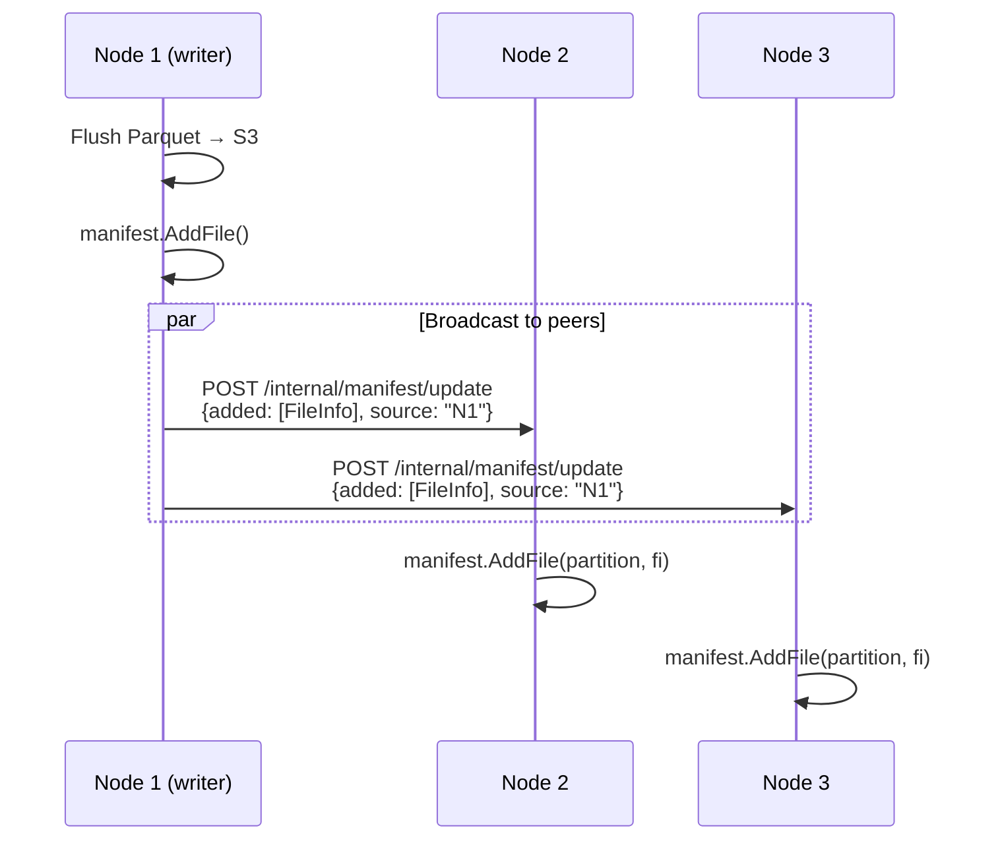
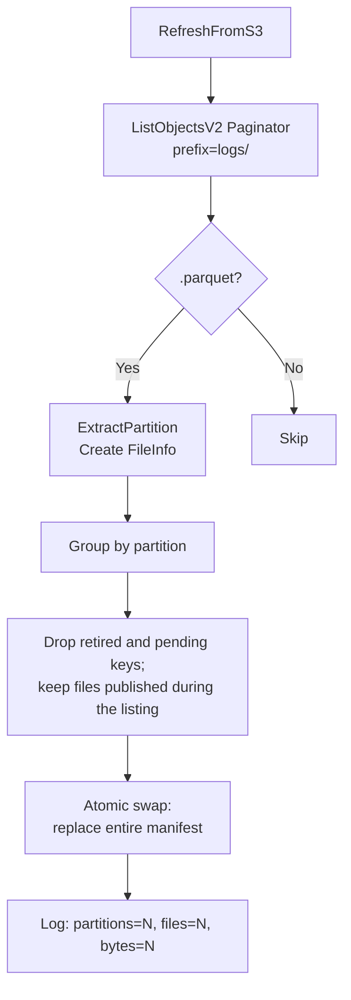
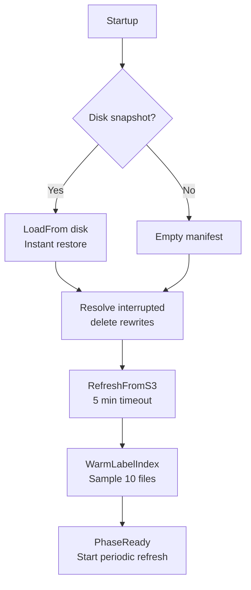

# Manifest System

The partition manifest is the bridge between the write and read paths. It tracks every Parquet file in S3, organized by Hive partition keys, and enables sub-millisecond "nothing here" responses for queries outside the data range.

## Architecture Overview


```mermaid
graph TD
    subgraph Write Path
        BW[BatchWriter] -->|flush to S3| S3[(S3 Bucket)]
        BW -->|AddFile| M[Manifest]
        BW -->|Notify| PUSH[Pusher]
    end

    subgraph Read Path
        RQ[RunQuery] -->|HasDataForRange| M
        RQ -->|GetFilesForRange| M
    end

    subgraph Sync
        PUSH -->|HTTP POST| PEER1[Peer Node 1]
        PUSH -->|HTTP POST| PEER2[Peer Node 2]
        REFRESH[Periodic Refresh] -->|ListObjectsV2| S3
        REFRESH -->|replace files| M
    end

    subgraph API
        MR[GET /manifest/range] --> M
        MP[GET /manifest/partitions] --> M
    end
```

## Data Structures

### FileInfo

Each tracked file has a `FileInfo` record:

```
FileInfo {
    Key               string              // S3 object key
    Size              int64               // Object size in bytes
    RowCount          int64               // Number of rows (from write path)
    MinTimeNs         int64               // Earliest timestamp (nanoseconds)
    MaxTimeNs         int64               // Latest timestamp (nanoseconds)
    RawBytes          int64               // Uncompressed size
    SchemaFingerprint string              // Schema version hash
    CompactionLevel   int                 // Compaction pass count
    Labels            map[string][]string // Label values in file
}
```

**Methods:**
- `CompressionRatio()` — returns `RawBytes / Size`
- `MatchesLabel(field, value)` — checks if `Labels[field]` contains `value`

### Manifest

The `Manifest` struct holds all files in a thread-safe map:

```
Manifest {
    files       map[string][]FileInfo  // partition key → files
    minTime     time.Time              // Earliest data across all files
    maxTime     time.Time              // Latest data across all files
    totalFiles  int                    // Global file count
    totalBytes  int64                  // Global byte count
    lastRefresh time.Time              // Last S3 scan timestamp
    prefix      string                 // S3 key prefix (e.g., "logs/")
    bucket      string                 // S3 bucket name
}
```

## Partition Key Format

Files are grouped by Hive-style partition keys: `dt=YYYY-MM-DD/hour=HH`


```mermaid
graph TD
    S3KEY["logs/dt=2026-05-02/hour=10/a1b2c3d4.parquet"]
    S3KEY --> EXTRACT[ExtractPartition]
    EXTRACT --> PART["dt=2026-05-02/hour=10"]
    PART --> MAP["manifest.files[dt=2026-05-02/hour=10]"]
```

**Key functions:**
- `ExtractPartition(key)` — extracts `dt=.../hour=...` from an S3 path
- `ParsePartitionTime(partition)` — parses partition to `time.Time`
- `partitionFromNano(ns)` — generates partition key from nanosecond timestamp

## Write Path Integration

When the BatchWriter flushes a Parquet file to S3, it immediately registers it in the manifest:


```mermaid
sequenceDiagram
    participant BW as BatchWriter
    participant S3 as S3
    participant M as Manifest
    participant PUSH as Pusher
    participant PEER as Peer Nodes

    BW->>BW: Sort rows by timestamp
    BW->>BW: writeLogsParquet (ZSTD + bloom)
    BW->>S3: PutObject (partition/batchID.parquet)
    S3-->>BW: OK

    BW->>M: AddFile(partition, FileInfo)
    Note over M: totalFiles++, totalBytes+=size<br/>update minTime/maxTime

    BW->>PUSH: Notify(added=[FileInfo])
    PUSH->>PEER: POST /internal/manifest/update
    PUSH->>PEER: POST /internal/manifest/update
```

**FileInfo populated on flush:**
```
FileInfo{
    Key:               "logs/dt=2026-05-02/hour=10/a1b2c3d4.parquet",
    Size:              len(compressed),
    RowCount:          len(rows),
    MinTimeNs:         rows[0].TimestampUnixNano,
    MaxTimeNs:         rows[last].TimestampUnixNano,
    RawBytes:          result.RawBytes,
    SchemaFingerprint: schemaFingerprint(mode),
    Labels:            extractLogLabels(rows),
}
```

Files are queryable immediately after `AddFile` — no refresh cycle needed for locally written data.

## Read Path Integration

Queries use the manifest to find relevant files and skip irrelevant time ranges:


```mermaid
flowchart TD
    Q[Query: start=T1, end=T2] --> FP{HasDataForRange?}
    FP -->|No: T1-T2 outside minTime..maxTime| FAST[Fast path: return empty]
    FP -->|Yes| GFR[GetFilesForRange T1, T2]
    GFR --> FILES[Matching FileInfo list]
    FILES --> WORKERS[Parallel file workers]

    FAST --> METRIC[Increment ManifestFastPathTotal]
```

### Fast Path

`HasDataForRange(startNs, endNs)` compares the query range against the manifest's global `minTime`/`maxTime`. If there's no overlap, the query returns immediately (< 1 ms). This handles the common case where queries target the hot VL/VT range and Lakehouse has no data there.

### File Selection

`GetFilesForRange(startNs, endNs)` iterates partitions, matches those overlapping the query range, and returns all `FileInfo` entries. Results are sorted by key for deterministic processing.

### Smart Cache Pinning

During a query, all matching files are pinned in the SmartCache to prevent eviction while the query is in flight:

```
for each file in manifest files:
    smartCache.Pin(file.Key, queryID)

defer:
    for each file:
        smartCache.Unpin(file.Key, queryID)
```

## Peer Synchronization

**File:** `internal/manifest/push.go`

When a node writes new files, it broadcasts the update to all peers via HTTP:


```mermaid
sequenceDiagram
    participant N1 as Node 1 (writer)
    participant N2 as Node 2
    participant N3 as Node 3

    N1->>N1: Flush Parquet → S3
    N1->>N1: manifest.AddFile()
    par Broadcast to peers
        N1->>N2: POST /internal/manifest/update<br/>{added: [FileInfo], source: "N1"}
        N1->>N3: POST /internal/manifest/update<br/>{added: [FileInfo], source: "N1"}
    end
    N2->>N2: manifest.AddFile(partition, fi)
    N3->>N3: manifest.AddFile(partition, fi)
```

### Update Protocol

```
POST /internal/manifest/update
Authorization: Bearer {peer.auth_key}
Content-Type: application/json

{
    "added": [{
        "key": "logs/dt=2026-05-02/hour=10/a1b2.parquet",
        "size": 1048576,
        "row_count": 5000,
        "min_time_ns": 1714694400000000000,
        "max_time_ns": 1714698000000000000,
        "labels": {"service.name": ["api-server", "web-frontend"]}
    }],
    "removed": ["logs/dt=2026-05-01/hour=08/old.parquet"],
    "source": "10.0.0.5:9428"
}
```

The receiving node verifies the Bearer token, then applies additions and removals to its local manifest.

### Compaction Integration

The compaction scheduler also uses `Pusher.Notify()` after merging files — broadcasting both the new merged file (added) and the replaced source files (removed).

**Superseded sources.** Compaction writes the merged output, removes the sources from the manifest and deletes their objects. An S3 `ListObjectsV2` that started before those deletes still returns the sources, so the refresh applying that listing would put their rows back next to the merged output that already holds them — every row read twice and every field value counted twice until the next refresh. The publish (`ReplaceFiles`) therefore retires each source key, and the refresh does not adopt a retired key.

The retirement outlives the delete. `Manifest.ConfirmDeleted(key)`, called when `Delete` returns success, clears `Reclaim` — nothing more is owed, so the scheduler's reclaim stops retrying it — but keeps the record, marked `Deleted`. Forgetting it there would reopen the exact window it exists for: the in-flight listing was answered from the bucket as it was *before* the delete. What forgets a key is the first accepted listing that **began after the retirement** and came back without it; no listing still in flight can report an object such a listing could not see. A rejected listing (cliff guard) settles nothing. The backstops are `retiredKeyTTL` and `maxRetiredKeys`, which evict the provably-gone keys first and an owed key last.

So the set is bounded by the objects a listing might still report — roughly one refresh interval of deletes, plus anything whose delete failed. `lakehouse_manifest_retired_delete_owed` and `lakehouse_manifest_retired_delete_landed` split it; the second should drain every refresh.

This is the only place redundancy is decided. The field-enumeration paths (`field_names`, `field_values`, `streams`, `stream_field_values`) used to guess it instead, dropping any object whose time range fell inside a higher-compaction-level neighbour's. On a partition that is both compacted and still being written — a live tenant with backfilled history — that hid the newest flush from every enumeration while `/select/logsql/query` still returned its rows.

## S3 Refresh

**Full scan** via `RefreshFromS3(ctx, client)`:


```mermaid
flowchart TD
    START[RefreshFromS3] --> LIST["ListObjectsV2 Paginator<br/>prefix=logs/"]
    LIST --> FILTER{".parquet?"}

    FILTER -->|Yes| EXTRACT[ExtractPartition<br/>Create FileInfo]
    FILTER -->|No| SKIP[Skip]
    EXTRACT --> GROUP[Group by partition]
    GROUP --> EXCL["Drop retired and pending keys;<br/>keep files published during the listing"]
    EXCL --> REPLACE[Atomic swap:<br/>replace entire manifest]
    REPLACE --> LOG["Log: partitions=N, files=N, bytes=N"]
```

- Uses AWS SDK v2 paginator (handles 1000-item pages)
- Filters to `.parquet` files only
- Keeps the full tracked entry (every enrichment field) for keys it already knows
- Atomically replaces the entire manifest under write lock, unless the cliff guard rejects a listing that lost more than half the files
- Recalculates `minTime`, `maxTime`, `totalFiles`, `totalBytes`
- `ApplyListing(objects, listStart)` applies a listing from any other lister the same way

**Limitation:** S3 refresh only populates `Key` and `Size` fields for keys it did not already track. Rich metadata (`RowCount`, `MinTimeNs`, `MaxTimeNs`, `Labels`) is only available for files registered through the write path.

### What the refresh does not adopt

A listing cannot tell a live file from an object the manifest deliberately let
go of, so the manifest remembers two kinds of key the refresh must leave out:

| kind | written by | why adopting it is wrong | forgotten when |
|------|------------|--------------------------|----------------|
| **retired** | `ReplaceFile` / `ReplaceFiles` (the source a rewrite or compaction publish replaced), `RemoveFileIfPresent`, `AbandonPending` (an output whose publish was refused), `RemoveFile` (retention, a peer's push), `Retire` | its rows would be served next to the replacement's copy, deleted rows would reappear once the tombstone retires, and the orphan sweep — which only reclaims unmanifested objects — would never see it | a listing that began after the retirement no longer contains it; a reclaim confirms its delete; or after 7 days (cap 100,000, oldest first) |
| **pending** | `MarkPending`, before a rewrite or compaction uploads an output | its rows would be served next to its still-registered source, and the publish that follows would be dropped as a duplicate key, losing its row counts and labels | its publish, or `AbandonPending` |

Keys the manifest never knew — files flushed by a peer, or flushed after the
snapshot a node restarted from — are still adopted; that is what the refresh is
for. And a file registered while a listing ran is kept even though that
listing cannot contain it, so a publish is never hidden until the next refresh.

A retired key with `Reclaim` set is an object this node owes a delete (its
first delete failed). The compaction scheduler retries those deletes on every
scan (`ReclaimRetired`, at most 1,000 per scan). Retired keys are persisted with
the snapshot; pending keys are not — whether an interrupted upload was published
is not something a periodic snapshot can know, so the delete rewriter records
that durably on the tombstone instead (see
[Operations → Background Rewriter](operations.md#background-rewriter)).

### Refresh Schedule

Periodic refresh runs on a configurable interval:

| Config | Default | Flag |
|--------|---------|------|
| `manifest.refresh_interval` | `5m` | `--lakehouse.manifest.refresh-interval` |

## Startup Sequence


```mermaid
flowchart TD
    BOOT[Startup] --> DISK{Disk snapshot?}
    DISK -->|Yes| LOAD[LoadFrom disk<br/>Instant restore]
    DISK -->|No| EMPTY[Empty manifest]
    LOAD --> RESOLVE[Resolve interrupted<br/>delete rewrites]
    EMPTY --> RESOLVE
    RESOLVE --> S3[RefreshFromS3<br/>5 min timeout]
    S3 --> WARM[WarmLabelIndex<br/>Sample 10 files]
    WARM --> READY[PhaseReady<br/>Start periodic refresh]
```

On startup:
1. Load disk snapshot if available (fast, < 100 ms)
2. Apply every delete rewrite a previous process left unfinished to the manifest's view (retire the objects the refresh must not adopt)
3. Full S3 refresh (may take seconds for large buckets)
4. Sample files to build label index for field discovery
5. Mark ready and start periodic refresh ticker

## Persistence

**File format:** binary gob with a magic prefix and an early
stat-size cap.

```go
type persistedManifest struct {
    Files       map[string][]FileInfo  // Partition → files
    MinTimeNs   int64
    MaxTimeNs   int64
    TotalFiles_ int
    TotalBytes_ int64
    SavedAt     time.Time
    Retired     []RetiredKey // absent in older snapshots
}
```

- `SaveTo(path)` — atomic write (temp file + rename), permissions `0o600`. Writes the binary-format magic so the loader auto-detects it; legacy JSON snapshots are still readable for forward upgrades.
- `LoadFrom(path)` — streams the gob decoder directly off the file via `io.LimitReader`, so peak RSS during a multi-PB restart is bounded by the streaming buffer rather than a full slurp. Early-rejects any file > 50 GiB (size cap configured in `internal/manifest/manifest.go`).
- `SavedAt()` exposes the persisted timestamp; the lifecycle code publishes it as `lakehouse_manifest_snapshot_age_seconds` so operators can alert when persist is silently failing.

### Cross-process lookup helper

`Manifest.GetFileByKey(key)` is a public O(1) lookup that returns the
matching `FileInfo` and a presence boolean. Used by lifecycle code
(footer-cache snapshot prefetch) that needs to translate a list of
keys back into FileInfo entries before scheduling S3 work; safe for
concurrent use, takes the manifest's read lock internally.

## API Endpoints

### GET /manifest/range

Returns the global data range and totals:

```json
{
    "min_time": 1714694400000000000,
    "max_time": 1714780800000000000,
    "min_date": "2026-05-02",
    "max_date": "2026-05-03",
    "total_files": 1247,
    "total_bytes": 52428800000
}
```

Used by external consumers (Loki-VL-proxy, monitoring) for routing decisions.

### GET /manifest/partitions

Returns per-partition summaries with optional date filtering:

```
GET /manifest/partitions?start=2026-05-01&end=2026-05-05
```

```json
{
    "partitions": [
        {"date": "2026-05-02", "hours": [10, 11, 14, 23], "files": 12, "bytes": 5242880},
        {"date": "2026-05-03", "hours": [0, 1, 2], "files": 6, "bytes": 2621440}
    ]
}
```

## Thread Safety

All manifest operations are protected by `sync.RWMutex`:

| Operation | Lock Type |
|-----------|-----------|
| AddFile, RemoveFile | Write lock |
| RefreshFromS3, LoadFrom | Write lock |
| GetFilesForRange, HasDataForRange | Read lock |
| TotalFiles, TotalBytes, MinTime, MaxTime | Read lock |
| AllFiles, GetPartitions | Read lock |

Concurrent reads are fully parallel. Writes serialize against each other and block reads momentarily.

## Metrics

| Metric | Type | Description |
|--------|------|-------------|
| `lakehouse_manifest_files` | Gauge | Current tracked file count |
| `lakehouse_manifest_bytes` | Gauge | Current tracked total bytes |
| `lakehouse_manifest_fast_path_total` | Counter | Queries with no overlapping data |
| `lakehouse_manifest_refresh_duration_seconds` | Histogram | S3 refresh latency |
| `lakehouse_manifest_retired_keys` | Gauge | Keys kept out of the refresh while their objects may still exist; drains as deletes land |
| `lakehouse_manifest_refresh_skipped_total{reason}` | Counter | Listed objects left out (`retired`, `pending`) and files kept although the listing lacked them (`published_during_listing`) |
| `lakehouse_manifest_retired_evicted_total{reason}` | Counter | Retired keys forgotten by the age (`ttl`) or size (`cap`) bound instead of by their delete; should stay 0 |
| `lakehouse_manifest_retired_reclaimed_total` / `lakehouse_manifest_retired_reclaim_errors_total` | Counter | Retried deletes of superseded and abandoned objects |
| `lakehouse_manifest_push_total` | Counter | Updates sent to peers |
| `lakehouse_manifest_push_peers` | Gauge | Peer count in cluster |
| `lakehouse_manifest_push_errors_total` | Counter | Failed push attempts |
| `lakehouse_manifest_update_received_total` | Counter | Updates received from peers |
