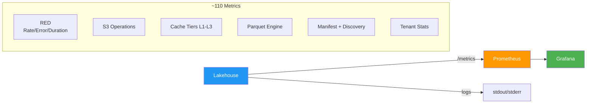

# Observability

## Metrics

Victoria Lakehouse exposes ~110 Prometheus metrics at `/metrics` using the `lakehouse_` prefix. Metrics use the same library as VL/VT: `github.com/VictoriaMetrics/metrics`.



### RED Metrics (Client-Facing)

| Metric | Type | Labels | Description |
|---|---|---|---|
| `lakehouse_http_requests_total` | Counter | `path`, `code` | Requests per endpoint per status |
| `lakehouse_http_request_duration_seconds` | Summary | `path` | Latency (0.5/0.9/0.95/0.99 quantiles) |
| `lakehouse_http_errors_total` | Counter | `path`, `code` | Failed requests |
| `lakehouse_concurrent_select_current` | Gauge | | Active queries |
| `lakehouse_concurrent_select_capacity` | Gauge | | Max query slots |
| `lakehouse_slow_queries_total` | Counter | | Queries exceeding threshold |

### S3 Metrics

| Metric | Type | Labels | Description |
|---|---|---|---|
| `lakehouse_s3_requests_total` | Counter | `op` | S3 API calls (GET/HEAD/LIST) |
| `lakehouse_s3_request_duration_seconds` | Summary | `op` | S3 latency |
| `lakehouse_s3_errors_total` | Counter | `op`, `code` | S3 errors |
| `lakehouse_s3_bytes_read_total` | Counter | | Bytes from S3 |
| `lakehouse_s3_throttle_total` | Counter | | 429/503 throttles |
| `lakehouse_s3_circuit_breaker_state` | Gauge | | 0=closed, 1=half, 2=open |

### Cache Metrics

| Metric | Type | Labels | Description |
|---|---|---|---|
| `lakehouse_cache_hits_total` | Counter | `tier` | Hits per tier (L1-L4) |
| `lakehouse_cache_misses_total` | Counter | `tier` | Misses per tier |
| `lakehouse_cache_hit_ratio` | Gauge | `tier` | Rolling hit ratio |
| `lakehouse_cache_memory_bytes` | Gauge | | L1 current size |
| `lakehouse_cache_disk_bytes` | Gauge | | L2 current size |
| `lakehouse_cache_singleflight_dedup_total` | Counter | | Coalesced fetches |

### Peer Cache Metrics

| Metric | Type | Labels | Description |
|---|---|---|---|
| `lakehouse_peer_requests_total` | Counter | `op`, `peer` | Requests to peers |
| `lakehouse_peer_hits_total` | Counter | `peer` | Peer cache hits |
| `lakehouse_peer_ring_members` | Gauge | | Fleet size |
| `lakehouse_peer_bytes_transferred_total` | Counter | `direction` | Network bytes |

### Manifest & Discovery Metrics

| Metric | Type | Description |
|---|---|---|
| `lakehouse_manifest_files` | Gauge | Parquet files tracked |
| `lakehouse_manifest_fast_path_total` | Counter | Queries short-circuited |
| `lakehouse_discovery_hot_boundary_seconds` | Gauge | Auto-discovered boundary |
| `lakehouse_discovery_hot_boundary_gap_days` | Gauge | Gap between cold and hot |

### Smart Cache Metrics

| Metric | Type | Labels | Description |
|---|---|---|---|
| `lakehouse_cache_hit_ratio` | Gauge | | Overall cache hit ratio |
| `lakehouse_cache_entries_total` | Gauge | | Total entries in smart cache |
| `lakehouse_cache_bytes_used` | Gauge | | Bytes currently cached |
| `lakehouse_cache_bytes_limit` | Gauge | | Configured cache byte limit |
| `lakehouse_cache_evictions_total` | Counter | `reason` | Evictions (ttl, size, manual) |
| `lakehouse_cache_hot_entries` | Gauge | | Entries marked as "hot" |
| `lakehouse_cache_pinned_entries` | Gauge | | Entries pinned by active queries |
| `lakehouse_cache_recommended_bytes` | Counter | `method` | Cache sizing recommendations (ingestion, query) |
| `lakehouse_cache_coverage_hours` | Gauge | | Estimated hours of query data cached |
| `lakehouse_cache_prefetch_hit_ratio` | Gauge | | Prefetched data that was actually used |
| `lakehouse_cache_owned_entries` | Gauge | | Entries owned by this node (hash routing) |
| `lakehouse_cache_owned_bytes` | Gauge | | Bytes owned by this node |
| `lakehouse_cache_effective_bytes` | Gauge | | Effective cache capacity including peer |

### Cross-Signal Metrics

| Metric | Type | Description |
|---|---|---|
| `lakehouse_cache_cross_eviction_sent_total` | Counter | Eviction hints sent to other signal |
| `lakehouse_cache_cross_eviction_received_total` | Counter | Eviction hints received |
| `lakehouse_cache_cross_eviction_pending` | Gauge | Pending eviction hint queue |
| `lakehouse_cache_cross_eviction_applied_total` | Counter | Eviction hints applied (deprioritized entries) |
| `lakehouse_cache_cross_prefetch_sent_total` | Counter | Prefetch hints sent to other signal |
| `lakehouse_cache_cross_prefetch_received_total` | Counter | Prefetch hints received |

### Parquet Engine Metrics

| Metric | Type | Labels | Description |
|---|---|---|---|
| `lakehouse_parquet_row_groups_skipped_total` | Counter | `reason` | Skipped by stats/bloom |
| `lakehouse_parquet_bloom_checks_total` | Counter | `result` | Bloom lookups |
| `lakehouse_parquet_column_bytes_read_total` | Counter | | Parquet I/O |

### Compaction Metrics (M9)

| Metric | Type | Labels | Description |
|---|---|---|---|
| `lakehouse_compaction_runs_total` | Counter | | Compaction cycles started |
| `lakehouse_compaction_files_input_total` | Counter | | Source files read across all compactions |
| `lakehouse_compaction_files_output_total` | Counter | | Output files written |
| `lakehouse_compaction_bytes_read_total` | Counter | | Bytes downloaded from S3 for compaction |
| `lakehouse_compaction_bytes_written_total` | Counter | | Bytes uploaded to S3 after compaction |
| `lakehouse_compaction_rows_merged_total` | Counter | | Total rows processed by compaction |
| `lakehouse_compaction_duration_seconds` | Histogram | | Per-partition compaction time |
| `lakehouse_compaction_errors_total` | Counter | | Failed compaction attempts |
| `lakehouse_compaction_level_files` | Gauge | `level` | Current file count at each compaction level |
| `lakehouse_compaction_skipped_total` | Counter | `reason` | Skipped partitions (`locked`, `not_leader`, `below_threshold`, `too_recent`, `schema_mismatch`) |
| `lakehouse_logs_severity_text_backfilled_at_compaction_total` | Counter | | Rows whose empty `severity_text` was recovered from `severity_number` or the stream-tag `level` value during a compaction pass — historical-data heal counter (see Lifecycle doc) |
| `lakehouse_logs_trace_shaped_rows_dropped_at_compaction_total` | Counter | | Trace-shape rows the compactor stripped from a merged output |
| `lakehouse_logs_trace_shaped_rows_dropped_at_ingest_total` | Counter | | Trace-shape rows refused at insert time |
| `lakehouse_logs_trace_shaped_rows_dropped_total` | Counter | | Read-side trace-shape filter drops (historical files) |

### Leader Election Metrics (M9)

| Metric | Type | Labels | Description |
|---|---|---|---|
| `lakehouse_election_leader` | Gauge | | 1 if this instance is the current leader, 0 otherwise |
| `lakehouse_election_transitions_total` | Counter | | Total leadership transitions |
| `lakehouse_election_health_checks_total` | Counter | `result` | Liveness check outcomes (`alive`, `dead`, `timeout`) — S3 election mode |

### Manifest Push Metrics (M9)

| Metric | Type | Labels | Description |
|---|---|---|---|
| `lakehouse_manifest_push_total` | Counter | | Push notifications sent to peers after flush/compaction |
| `lakehouse_manifest_push_errors_total` | Counter | | Failed push attempts |
| `lakehouse_manifest_push_peers` | Gauge | | Number of peers currently notified |
| `lakehouse_manifest_update_received_total` | Counter | | Manifest update notifications received from peers |

### Tenant Metrics

Per-tenant metrics subject to cardinality cap (`stats.metrics_cardinality_limit`, default 100).

| Metric | Type | Labels | Description |
|---|---|---|---|
| `lakehouse_tenant_files` | Gauge | `tenant` | Files per tenant |
| `lakehouse_tenant_bytes` | Gauge | `tenant` | Compressed bytes per tenant |
| `lakehouse_tenant_raw_bytes` | Gauge | `tenant` | Uncompressed bytes per tenant |
| `lakehouse_tenant_rows_total` | Counter | `tenant` | Cumulative rows per tenant |
| `lakehouse_tenant_ingestion_bytes_total` | Counter | `tenant` | Cumulative bytes ingested per tenant |
| `lakehouse_tenant_queries_total` | Counter | `tenant` | Cumulative queries per tenant |
| `lakehouse_tenant_last_write_timestamp` | Gauge | `tenant` | Unix seconds of last write |
| `lakehouse_tenant_last_query_timestamp` | Gauge | `tenant` | Unix seconds of last query |

### Global Storage Metrics

| Metric | Type | Labels | Description |
|---|---|---|---|
| `lakehouse_storage_files_total` | Gauge | | Total files across all tenants |
| `lakehouse_storage_bytes_total` | Gauge | | Total compressed bytes |
| `lakehouse_storage_raw_bytes_total` | Gauge | | Total uncompressed bytes |
| `lakehouse_storage_compression_ratio` | Gauge | | Global average compression ratio |
| `lakehouse_storage_rows_total` | Gauge | | Total rows |
| `lakehouse_storage_partitions_total` | Gauge | | Total partitions |
| `lakehouse_storage_oldest_data_seconds` | Gauge | | Unix timestamp of oldest data |
| `lakehouse_storage_newest_data_seconds` | Gauge | | Unix timestamp of newest data |
| `lakehouse_storage_tenants_total` | Gauge | | Number of active tenants |
| `lakehouse_storage_bytes_by_class` | Gauge | `class` | Bytes per storage class |
| `lakehouse_storage_files_by_class` | Gauge | `class` | Files per storage class |
| `lakehouse_storage_cost_monthly_usd` | Gauge | | Estimated monthly cost |
| `lakehouse_storage_cost_by_class_usd` | Gauge | `class` | Cost per storage class |
| `lakehouse_storage_ingestion_rate_bytes` | Gauge | | Rolling ingestion rate (bytes/sec) |

### Cardinality Limiter Metrics

| Metric | Type | Description |
|---|---|---|
| `lakehouse_metrics_cardinality_limit` | Gauge | Configured tenant cardinality cap |
| `lakehouse_metrics_cardinality_tracked` | Gauge | Currently tracked tenants |
| `lakehouse_metrics_cardinality_overflow_total` | Counter | Tenants dropped due to cap |

### Stats Sync Metrics

| Metric | Type | Description |
|---|---|---|
| `lakehouse_stats_push_total` | Counter | Delta broadcasts sent to peers |
| `lakehouse_stats_push_errors_total` | Counter | Failed broadcasts |
| `lakehouse_stats_push_bytes_total` | Counter | Bytes transmitted in sync |
| `lakehouse_stats_snapshot_total` | Counter | S3 snapshots written |
| `lakehouse_stats_snapshot_errors_total` | Counter | Failed snapshots |
| `lakehouse_stats_merges_total` | Counter | CRDT merge operations |
| `lakehouse_stats_headobject_total` | Counter | HeadObject verification calls |

### Startup Metrics

| Metric | Type | Description |
|---|---|---|
| `lakehouse_startup_phase` | Gauge | Current phase (0-3) |
| `lakehouse_startup_total_seconds` | Gauge | Total startup time |
| `lakehouse_ready` | Gauge | 1=ready, 0=warming |
| `lakehouse_info` | Gauge | Build info (version, mode, topology) |

### Lifecycle / restart honesty Metrics

| Metric | Type | Description |
|---|---|---|
| `lakehouse_serving_ready` | Gauge | 1 once disk recovery + buffer restore + MinManifestFiles gate are all satisfied (the `204 serving_warming` boundary) |
| `lakehouse_warmup_complete` | Gauge | 1 after background warmup finishes (the `200 ready` boundary) |
| `lakehouse_manifest_files` | Gauge | Current manifest file count (auto-tunes the footer-cache cap; alerts on regression vs. shutdown count) |
| `lakehouse_manifest_snapshot_age_seconds` | Gauge | Seconds since the last successful manifest persist — alert when > 6 × persist_interval (a silent disk-full will surface here first) |
| `lakehouse_min_manifest_files_gate` | Gauge | Configured `cfg.Startup.MinManifestFiles` threshold (0 = gate disabled) |
| `lakehouse_buffer_bridge_az_requests_total` | Counter (`az_type`) | Buffer-bridge fan-out calls labeled `same_az` / `cross_az` / `self`. The `self` label appears for single-node deployments that loop back to their own writer buffer |
| `lakehouse_buffer_bridge_fallback_total` | Counter | Times the bridge fell back to a different AZ tier after the preferred one returned no peers |

### Cache snapshot Metrics

| Metric | Type | Description |
|---|---|---|
| `lakehouse_footer_cache_entries` | Gauge | Cache size — should equal previous shutdown's persisted count shortly after restart once the async prefetch completes |
| `lakehouse_footer_cache_hits_total` | Counter | Should run > 90% of total cache lookups in steady state |
| `lakehouse_footer_cache_evictions_total` | Counter | LRU evictions; spikes indicate the cap is undersized relative to the working set |

## Dashboards

Victoria Lakehouse ships Grafana dashboards in `dashboards/`:

| Dashboard | Description |
|---|---|
| `victoria-lakehouse.json` | Single-instance overview (7 rows) |
| `victoria-lakehouse-cluster.json` | Fleet monitoring (adds peer cache, per-instance) |
| `vm/victoria-lakehouse.json` | VictoriaMetrics datasource variant |
| `vm/victoria-lakehouse-cluster.json` | VM datasource cluster variant |

Dashboard rows: Stats -> RED -> S3 -> Cache -> Parquet Engine -> Manifest -> Prefetch.

Supplementary panels are available for adding a "Cold Storage" row to existing VL/VT community dashboards.

## Alerting Rules

Shipped in `alerts/alerts-lakehouse.yml`:

| Alert | Severity | Condition |
|---|---|---|
| `LakehouseHighErrorRate` | warning | Error rate >5% for 5m |
| `LakehouseS3CircuitBreakerOpen` | critical | Circuit breaker open for 1m |
| `LakehouseHotBoundaryGap` | warning | Gap >1 day between cold/hot for 10m |
| `LakehouseCacheDiskFull` | warning | L2 disk >95% for 5m |
| `LakehouseNotReady` | critical | Not ready for >5m |
| `LakehouseSlowQueries` | warning | Sustained slow queries for 10m |
| `LakehouseManifestStale` | warning | Not refreshed in >2h for 15m |
| `LakehouseDiscoveryFailed` | critical | No storage nodes found for 10m |
| `LakehouseS3ThrottleSustained` | warning | Sustained S3 throttling for 5m |
| `LakehousePeerDown` | warning | High peer error rate for 5m |

## Structured Logging

Victoria Lakehouse uses `slog` with JSON output:

```json
{
  "time": "2026-05-02T14:30:00Z",
  "level": "INFO",
  "msg": "starting victoria-lakehouse",
  "version": "0.1.0",
  "mode": "logs",
  "topology": "auto",
  "listen": ":9428",
  "s3_bucket": "obs-archive"
}
```

Log level controlled by `--loggerLevel` (DEBUG/INFO/WARN/ERROR).
