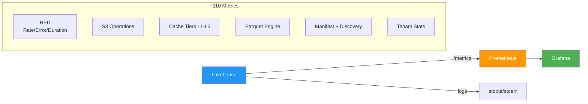

# Observability

## Metrics

Victoria Lakehouse exposes ~110 Prometheus metrics at `/metrics` using the `lakehouse_` prefix. Metrics use the same library as VL/VT: `github.com/VictoriaMetrics/metrics`.


```mermaid
graph LR
    L[Lakehouse] -->|/metrics| P[Prometheus]
    P --> G[Grafana]
    L -->|logs| STDOUT[stdout/stderr]

    subgraph "~110 Metrics"
    R[RED<br/>Rate/Error/Duration]
    S[S3 Operations]
    C[Cache Tiers L1-L3]
    PQ[Parquet Engine]
    M[Manifest + Discovery]
    T[Tenant Stats]
    end

    style L fill:#2196F3,color:#fff
    style P fill:#FF9800,color:#fff
    style G fill:#4CAF50,color:#fff
```

### RED Metrics (Client-Facing)

| Metric | Type | Labels | Description |
|---|---|---|---|
| `lakehouse_http_requests_total` | Counter | `path`, `code` | Requests per endpoint per status |
| `lakehouse_http_request_duration_seconds` | Summary | `path` | Latency (0.5/0.9/0.95/0.99 quantiles) |
| `lakehouse_http_errors_total` | Counter | `path`, `code` | Failed requests |
| `lakehouse_concurrent_select_current` | Gauge | | Active queries |
| `lakehouse_concurrent_select_capacity` | Gauge | | Max query slots |
| `lakehouse_slow_queries_total` | Counter | | Queries exceeding threshold |

### S3 Metrics

| Metric | Type | Labels | Description |
|---|---|---|---|
| `lakehouse_s3_requests_total` | Counter | `op` | S3 API calls (GET/HEAD/LIST) |
| `lakehouse_s3_request_duration_seconds` | Summary | `op` | S3 latency |
| `lakehouse_s3_errors_total` | Counter | `op`, `code` | S3 errors |
| `lakehouse_s3_bytes_read_total` | Counter | | Bytes from S3 |
| `lakehouse_s3_throttle_total` | Counter | | 429/503 throttles |
| `lakehouse_s3_circuit_breaker_state` | Gauge | | 0=closed, 1=half, 2=open |

### Cache Metrics

| Metric | Type | Labels | Description |
|---|---|---|---|
| `lakehouse_cache_hits_total` | Counter | `tier` | Hits per tier (L1-L4) |
| `lakehouse_cache_misses_total` | Counter | `tier` | Misses per tier |
| `lakehouse_cache_hit_ratio` | Gauge | `tier` | Rolling hit ratio |
| `lakehouse_cache_memory_bytes` | Gauge | | L1 current size |
| `lakehouse_cache_disk_bytes` | Gauge | | L2 current size |
| `lakehouse_cache_singleflight_dedup_total` | Counter | | Coalesced fetches |

### Peer Cache Metrics

| Metric | Type | Labels | Description |
|---|---|---|---|
| `lakehouse_peer_requests_total` | Counter | `op`, `peer` | Requests to peers |
| `lakehouse_peer_hits_total` | Counter | `peer` | Peer cache hits |
| `lakehouse_peer_ring_members` | Gauge | | Fleet size |
| `lakehouse_peer_bytes_transferred_total` | Counter | `direction` | Network bytes |

### Manifest & Discovery Metrics

| Metric | Type | Description |
|---|---|---|
| `lakehouse_manifest_files` | Gauge | Parquet files tracked |
| `lakehouse_manifest_tenant_bucket_list_errors_total` | Counter (label: `bucket`) | Failed LISTs of a tenant's dedicated bucket during a refresh. One unreachable bucket fails the whole refresh — the manifest then keeps its previous state for every tenant — so any sustained rate means the fleet's view of S3 is frozen. The series of each registered dedicated bucket is exported at zero |
| `lakehouse_manifest_fast_path_total` | Counter | Queries short-circuited |
| `lakehouse_discovery_hot_boundary_seconds` | Gauge | Auto-discovered boundary |
| `lakehouse_discovery_hot_boundary_gap_days` | Gauge | Gap between cold and hot |

### Smart Cache Metrics

| Metric | Type | Labels | Description |
|---|---|---|---|
| `lakehouse_cache_hit_ratio` | Gauge | | Overall cache hit ratio |
| `lakehouse_cache_entries_total` | Gauge | | Total entries in smart cache |
| `lakehouse_cache_bytes_used` | Gauge | | Bytes currently cached |
| `lakehouse_cache_bytes_limit` | Gauge | | Configured cache byte limit |
| `lakehouse_cache_evictions_total` | Counter | `reason` | Evictions (ttl, size, manual) |
| `lakehouse_cache_hot_entries` | Gauge | | Entries marked as "hot" |
| `lakehouse_cache_pinned_entries` | Gauge | | Entries pinned by active queries |
| `lakehouse_cache_recommended_bytes` | Counter | `method` | Cache sizing recommendations (ingestion, query) |
| `lakehouse_cache_coverage_hours` | Gauge | | Estimated hours of query data cached |
| `lakehouse_cache_prefetch_hit_ratio` | Gauge | | Prefetched data that was actually used |
| `lakehouse_cache_owned_entries` | Gauge | | Entries owned by this node (hash routing) |
| `lakehouse_cache_owned_bytes` | Gauge | | Bytes owned by this node |
| `lakehouse_cache_effective_bytes` | Gauge | | Effective cache capacity including peer |

### Cross-Signal Metrics

| Metric | Type | Description |
|---|---|---|
| `lakehouse_cache_cross_eviction_sent_total` | Counter | Eviction hints sent to other signal |
| `lakehouse_cache_cross_eviction_received_total` | Counter | Eviction hints received |
| `lakehouse_cache_cross_eviction_pending` | Gauge | Pending eviction hint queue |
| `lakehouse_cache_cross_eviction_applied_total` | Counter | Eviction hints applied (deprioritized entries) |
| `lakehouse_cache_cross_prefetch_sent_total` | Counter | Prefetch hints sent to other signal |
| `lakehouse_cache_cross_prefetch_received_total` | Counter | Prefetch hints received |

### Insert / Write Path Metrics

| Metric | Type | Labels | Description |
|---|---|---|---|
| `lakehouse_insert_rows_total` | Counter | | Rows admitted into the insert buffer (after the admission filter) |
| `lakehouse_buffer_pending_rows` | Gauge | | Rows in segments not yet fully written to object storage. Grows while object storage is slow or unreachable; the rows are safe on the buffer volume |
| `lakehouse_buffer_segments` | Gauge | `state` | Insert-buffer segments: `active` (taking writes, always 1), `pending` (sealed, not yet fully written), `committed` (written, kept readable for the grace period), `retired` (past the grace; only queries that started before then still read it, and it is removed when the last of them ends) |
| `lakehouse_buffer_segments_sealed_total` / `lakehouse_buffer_segments_committed_total` | Counter | | Segments sealed and fully written since the process started |
| `lakehouse_buffer_oldest_pending_age_seconds` | Gauge | | Age of the oldest segment not yet fully written: how far object storage lags behind ingest |
| `lakehouse_insert_flush_committed_segment` | Gauge | | Sequence number of the newest segment fully written (every older one is too) |
| `lakehouse_buffer_view_excluded_objects_total` | Counter | | Objects a query skipped because the segment they were written from was served from the buffer in that query: each row is answered once |
| `lakehouse_compaction_segment_guard_errors_total` | Counter | | Compaction scans that could not list the segment markers; the objects of unconfirmed segments were left alone |
| `lakehouse_insert_flush_total` / `lakehouse_insert_flush_errors_total` | Counter | | Segments completely written to object storage, and drains that stopped on an error (they resume, with the same bytes, after a back-off) |
| `lakehouse_insert_rows_superseded_total` | Counter | | Rows of flush groups skipped because their object's key had been retired (compacted, rewritten or removed) since an earlier attempt stored it: whatever replaced it carries those rows. Counts only groups skipped for that reason; a group whose object is still live is skipped without being counted. Should stay near 0 |
| `lakehouse_buffer_flush_errors_total` | Counter | `stage` | Buffer-flusher failures by stage. `intent`: recording the segment as draining failed. `collect`: reading a group from the segment failed. `head`: an object-store existence check failed while recovering a segment a previous process was draining (needs `s3:ListBucket`, else S3 answers 403 for absent keys). `upload`: a PUT or Parquet encode failed, or the context was cancelled; counted once per attempt. `marker`: the segment's commit marker could not be written. `commit`: recording the segment as committed failed. `mark`: a durable stored mark could not be written (not retried; that group depends on HEAD after a restart). All but `mark` are retried with the same bytes. Should stay near 0 |
| `lakehouse_vt_internal_rows_dropped_total` | Counter | `kind` | VictoriaTraces-internal rows dropped when a segment is drained: `trace_id_idx` (the `_trace_idx` footer index replaces them) |
| `lakehouse_delete_rewrite_deferred_total` | Counter | `reason` | Delete rewrites postponed: `segment_live` (an object's insert-buffer segment is still served from the buffer; the tombstone filter keeps the rows hidden meanwhile) |
| `lakehouse_insert_rejected_total` | Counter | `reason` | Insert requests refused by the insert adapter: `read_only` (429, the buffer volume is below its free-space floor, with upstream's message). An unreachable object store refuses nothing |
| `lakehouse_insert_flush_duration_seconds` | Histogram | | Time a segment's drain took |

### Parquet Engine Metrics

| Metric | Type | Labels | Description |
|---|---|---|---|
| `lakehouse_parquet_row_groups_skipped_total` | Counter | `reason` | Objects or row groups skipped before decoding, by the stage that pruned them: `label_index`, `column_stats` (manifest file pre-filters), `footer_prefetch` (footer-only file skip), `stats` (row-group time range), `bloom`, `pushdown`, `token_bloom` (row-group checks). Every reason is exported at zero from process start |
| `lakehouse_parquet_bloom_checks_total` | Counter | `result` | Bloom lookups |
| `lakehouse_parquet_column_bytes_read_total` | Counter | | Parquet I/O |

### Compaction Metrics (M9)

| Metric | Type | Labels | Description |
|---|---|---|---|
| `lakehouse_compaction_runs_total` | Counter | | Compaction cycles started |
| `lakehouse_compaction_files_input_total` | Counter | | Source files read across all compactions |
| `lakehouse_compaction_files_output_total` | Counter | | Output files written |
| `lakehouse_compaction_bytes_read_total` | Counter | | Bytes downloaded from S3 for compaction |
| `lakehouse_compaction_bytes_written_total` | Counter | | Bytes uploaded to S3 after compaction |
| `lakehouse_compaction_rows_merged_total` | Counter | | Total rows processed by compaction |
| `lakehouse_compaction_duration_seconds` | Histogram | | Per-partition compaction time |
| `lakehouse_compaction_errors_total` | Counter | | Failed compaction attempts |
| `lakehouse_compaction_level_files` | Gauge | `level` | Current file count at each compaction level |
| `lakehouse_compaction_frozen_files` | Gauge | `reason` | Files the last scan kept out of compaction: `storage_class` (the class from the bucket listing is not rewritable), `age` (partition older than the first mirrored lifecycle transition minus 48 h) or `size_age` (no lifecycle rule and the partition is older than `compaction.size_merge_max_age`; only stale-schema heal still runs) |
| `lakehouse_compaction_scan_budget_exhausted_total` | Counter | | Scans that stopped starting merges because they had run for the scan interval (the scan budget) |
| `lakehouse_compaction_skipped_total` | Counter | `reason` | Skipped partitions (`locked`, `not_leader`, `below_threshold`, `too_recent`, `schema_mismatch`) |
| `lakehouse_logs_severity_text_backfilled_at_compaction_total` | Counter | | Rows whose empty `severity_text` was recovered from `severity_number` or the stream-tag `level` value during a compaction pass — historical-data heal counter (see Lifecycle doc) |
| `lakehouse_logs_trace_shaped_rows_dropped_at_compaction_total` | Counter | | Trace-shape rows the compactor stripped from a merged output |
| `lakehouse_logs_trace_shaped_rows_dropped_at_ingest_total` | Counter | | Trace-shape rows refused at insert time |
| `lakehouse_logs_trace_shaped_rows_dropped_total` | Counter | | Read-side trace-shape filter drops (historical files) |

### Leader Election Metrics (M9)

| Metric | Type | Labels | Description |
|---|---|---|---|

### Manifest Push Metrics (M9)

| Metric | Type | Labels | Description |
|---|---|---|---|
| `lakehouse_manifest_push_total` | Counter | | Push notifications sent to peers after flush/compaction |
| `lakehouse_manifest_push_errors_total` | Counter | | Failed push attempts |
| `lakehouse_manifest_push_peers` | Gauge | | Number of peers currently notified |
| `lakehouse_manifest_update_received_total` | Counter | | Manifest update notifications received from peers |

### Tenant Metrics

Per-tenant metrics subject to cardinality cap (`stats.metrics_cardinality_limit`, default 100).

| Metric | Type | Labels | Description |
|---|---|---|---|
| `lakehouse_tenant_files` | Gauge | `tenant` | Files per tenant |
| `lakehouse_tenant_bytes` | Gauge | `tenant` | Compressed bytes per tenant |
| `lakehouse_tenant_raw_bytes` | Gauge | `tenant` | Uncompressed bytes per tenant |
| `lakehouse_tenant_rows_total` | Counter | `tenant` | Cumulative rows per tenant |
| `lakehouse_tenant_ingestion_bytes_total` | Counter | `tenant` | Cumulative bytes ingested per tenant |
| `lakehouse_tenant_queries_total` | Counter | `tenant` | Cumulative queries per tenant |
| `lakehouse_tenant_last_write_timestamp` | Gauge | `tenant` | Unix seconds of last write |
| `lakehouse_tenant_last_query_timestamp` | Gauge | `tenant` | Unix seconds of last query |

Read scoping (see [multi-tenancy — Read Scoping](multi-tenancy.md#read-scoping-which-data-a-request-sees)); these are not per-tenant and not subject to the cap:

| Metric | Type | Labels | Description |
|---|---|---|---|
| `lakehouse_tenant_scope_violations_total` | Counter | `site` | Objects or buffered rows the read path selected for a request but that belong to another tenant, dropped before answering. Expected to stay 0; `site` names the read path (`query`, `field_names`, `field_values`, `streams`, `stream_ids`, `catalog_field_names`, `trace_index_lookup`, `bridge_logs`, `bridge_traces`). |
| `lakehouse_field_values_files_total` | Counter | `path` | Objects behind `field_values` / `streams` / `stream_ids` answers: `aggregate` = answered from the object's exact per-value label counts in the manifest (no S3 read), `scan` = window-confined column scan. See [read-path — Field enumeration](read-path.md#field-enumeration). |
| `lakehouse_catalog_value_lookups_total` | Counter | `source` | Field-enumeration requests answered entirely from memory (`catalog`) vs. those that read at least one object (`scan`). |
| `lakehouse_global_read_queries_total` | Counter | | Select requests that presented a valid global-read credential and were answered across all tenants |
| `lakehouse_tenant_auto_registered_total` | Counter | | String tenants (`X-Scope-OrgID`) that an ingest request registered, each with a fresh AccountID from the reserved auto-register range (`tenant.auto_register_min_id` to `tenant.auto_register_max_id`). See [multi-tenancy — Auto-register range](multi-tenancy.md#auto-register-range-and-the-shared-registry). |
| `lakehouse_tenant_alloc_conflicts_total` | Counter | | Lost conditional writes (HTTP 412) on the shared alias registry `_meta/tenant-aliases.json`: another pod or request changed it between the read and the write. Each one is retried after a re-read and merge; a steady rate means many pods register new OrgIDs at once. |
| `lakehouse_tenant_alloc_failed_total` | Counter | | Auto-registrations given up on: the retry bound was reached, the registry could not be read or written, or the range is exhausted. The ingest request got 503 and nothing was registered. |
| `lakehouse_tenant_alias_rejected_total` | Counter | `source` | Alias entries refused because their AccountID:ProjectID already belongs to another OrgID, or their OrgID to another ID, or they contradict a configured alias. `source` is `admin` (alias API, answered 409), `sync` (peer gossip) or `registry` (entries read from the shared registry). Expected to stay 0; any increase means two writers disagree about a tenant's ID. |
| `lakehouse_tenant_unknown_orgid_reads_total` | Counter | | Read requests naming an OrgID no alias knows. They are answered as a tenant without data and never register the name. |

### Global Storage Metrics

| Metric | Type | Labels | Description |
|---|---|---|---|
| `lakehouse_storage_files_total` | Gauge | | Total files across all tenants |
| `lakehouse_storage_bytes_total` | Gauge | | Total compressed bytes |
| `lakehouse_storage_raw_bytes_total` | Gauge | | Total uncompressed bytes |
| `lakehouse_storage_compression_ratio` | Gauge | | Global average compression ratio |
| `lakehouse_storage_rows_total` | Gauge | | Total rows |
| `lakehouse_storage_partitions_total` | Gauge | | Total partitions |
| `lakehouse_storage_oldest_data_seconds` | Gauge | | Unix timestamp of oldest data |
| `lakehouse_storage_newest_data_seconds` | Gauge | | Unix timestamp of newest data |
| `lakehouse_storage_tenants_total` | Gauge | | Number of active tenants |
| `lakehouse_storage_bytes_by_class` | Gauge | `class` | Bytes per storage class |
| `lakehouse_storage_files_by_class` | Gauge | `class` | Files per storage class |
| `lakehouse_storage_cost_monthly_usd` | Gauge | | Estimated monthly cost |
| `lakehouse_storage_cost_by_class_usd` | Gauge | `class` | Cost per storage class |
| `lakehouse_storage_ingestion_rate_bytes` | Gauge | | Rolling ingestion rate (bytes/sec) |

### Cardinality Limiter Metrics

| Metric | Type | Description |
|---|---|---|
| `lakehouse_metrics_cardinality_limit` | Gauge | Configured tenant cardinality cap |
| `lakehouse_metrics_cardinality_tracked` | Gauge | Currently tracked tenants |
| `lakehouse_metrics_cardinality_overflow_total` | Counter | Tenants dropped due to cap |

### Stats Sync Metrics

| Metric | Type | Description |
|---|---|---|
| `lakehouse_stats_push_total` | Counter | Delta broadcasts sent to peers |
| `lakehouse_stats_push_errors_total` | Counter | Failed broadcasts |
| `lakehouse_stats_push_bytes_total` | Counter | Bytes transmitted in sync |
| `lakehouse_stats_snapshot_total` | Counter | S3 snapshots written |
| `lakehouse_stats_snapshot_errors_total` | Counter | Failed snapshots |
| `lakehouse_stats_merges_total` | Counter | CRDT merge operations |
| `lakehouse_stats_headobject_total` | Counter | HeadObject verification calls |

### Startup Metrics

| Metric | Type | Description |
|---|---|---|
| `lakehouse_startup_phase` | Gauge | Current phase: 0 init, 1 disk recovery, 2 stale check, 3 S3 refresh, 4 peer sync, 5 cache warmup, 6 ready. Background warmup completion advances this to 6. |
| `lakehouse_startup_total_seconds` | Gauge | Total startup time |
| `lakehouse_ready` | Gauge | 1=ready, 0=warming |
| `lakehouse_info` | Gauge | Build info (version, mode, topology) |

### Lifecycle / restart honesty Metrics

| Metric | Type | Description |
|---|---|---|
| `lakehouse_serving_ready` | Gauge | 1 once disk recovery + buffer restore + MinManifestFiles gate are all satisfied (the `204 serving_warming` boundary) |
| `lakehouse_warmup_complete` | Gauge | 1 after background warmup finishes (the `200 ready` boundary) |
| `lakehouse_manifest_files` | Gauge | Current manifest file count (auto-tunes the footer-cache cap; alerts on regression vs. shutdown count) |
| `lakehouse_manifest_snapshot_age_seconds` | Gauge | Seconds since the last successful manifest persist — alert when > 6 × persist_interval (a silent disk-full will surface here first) |
| `lakehouse_min_manifest_files_gate` | Gauge | Configured `cfg.Startup.MinManifestFiles` threshold (0 = gate disabled) |
| `lakehouse_buffer_bridge_az_requests_total` | Counter (`az_type`) | Buffer-bridge fan-out calls labeled `same_az` / `cross_az` / `self`. The `self` label appears for single-node deployments that loop back to their own writer buffer |
| `lakehouse_buffer_bridge_fallback_total` | Counter | Times the bridge fell back to a different AZ tier after the preferred one returned no peers |
| `lakehouse_buffer_bridge_errors_total` | Counter (`reason`) | Peer answers the buffer bridge dropped — `request` (unreachable, timed out), `auth` (the peer refused this pod's peer key with 401/403: `peer.auth_key` differs between pods, or an `all_tenants` read reached a pod without a key; a configuration error worth an alert), `status` (any other non-200), `scope` (no tenant-scope echo), `decode` (the row stream broke off). Each one leaves that peer's unflushed rows out of a query or field enumeration; a stream that breaks off is dropped whole, never used as a partial answer |

### Cache snapshot Metrics

| Metric | Type | Description |
|---|---|---|
| `lakehouse_footer_cache_entries` | Gauge | Cache size — should equal previous shutdown's persisted count shortly after restart once the async prefetch completes |
| `lakehouse_footer_cache_hits_total` | Counter | Should run > 90% of total cache lookups in steady state |
| `lakehouse_footer_cache_evictions_total` | Counter | LRU evictions; spikes indicate the cap is undersized relative to the working set |

## Dashboards

Victoria Lakehouse ships Grafana dashboards in `dashboards/`:

| Dashboard | Description |
|---|---|
| `victoria-lakehouse.json` | Single-instance overview (7 rows) |
| `victoria-lakehouse-cluster.json` | Fleet monitoring (adds peer cache, per-instance) |
| `vm/victoria-lakehouse.json` | VictoriaMetrics datasource variant |
| `vm/victoria-lakehouse-cluster.json` | VM datasource cluster variant |

Dashboard rows: Stats -> RED -> S3 -> Cache -> Parquet Engine -> Manifest -> Prefetch.

Supplementary panels are available for adding a "Cold Storage" row to existing VL/VT community dashboards.

## Alerting Rules

Shipped in `alerts/alerts-lakehouse.yml`:

| Alert | Severity | Condition |
|---|---|---|
| `LakehouseHighErrorRate` | warning | Error rate >5% for 5m |
| `LakehouseS3CircuitBreakerOpen` | critical | Circuit breaker open for 1m |
| `LakehouseHotBoundaryGap` | warning | Gap >1 day between cold/hot for 10m |
| `LakehouseCacheDiskFull` | warning | L2 disk >95% for 5m |
| `LakehouseNotReady` | critical | Not ready for >5m |
| `LakehouseSlowQueries` | warning | Sustained slow queries for 10m |
| `LakehouseManifestStale` | warning | Not refreshed in >2h for 15m |
| `LakehouseDiscoveryFailed` | critical | No storage nodes found for 10m |
| `LakehouseS3ThrottleSustained` | warning | Sustained S3 throttling for 5m |
| `LakehousePeerDown` | warning | High peer error rate for 5m |
| `LakehouseTenantScopeViolation` | critical | Any `lakehouse_tenant_scope_violations_total` increase in 5m |
| `LakehouseTenantBucketListFailing` | critical | A tenant's dedicated bucket failed to list for 10m (`lakehouse_manifest_tenant_bucket_list_errors_total`) |

## Structured Logging

Victoria Lakehouse uses `slog` with JSON output:

```json
{
  "time": "2026-05-02T14:30:00Z",
  "level": "INFO",
  "msg": "starting victoria-lakehouse",
  "version": "0.1.0",
  "mode": "logs",
  "topology": "auto",
  "listen": ":9428",
  "s3_bucket": "obs-archive"
}
```

Log level controlled by `--loggerLevel` (DEBUG/INFO/WARN/ERROR).
