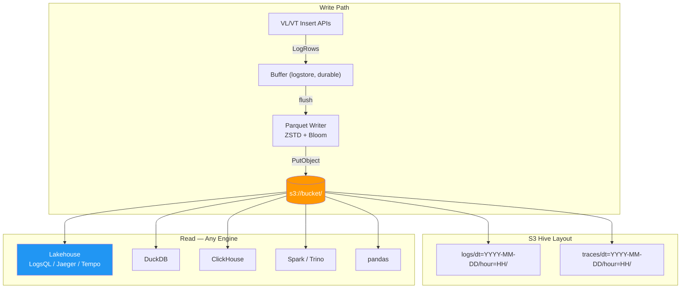

# Open Parquet Format

Victoria Lakehouse stores all observability data as standard Apache Parquet files with ZSTD compression and Hive-style partitioning. There is no proprietary format, no catalog server requirement, and no vendor lock-in. Any tool that reads Parquet -- DuckDB, Spark, Trino, ClickHouse, Pandas, or `parquet-tools` -- can query this data directly from S3.

## S3 Layout

Files are organized using Hive partitioning by date and hour:

```
s3://obs-archive/
  logs/
    dt=2026-01-15/hour=00/00001-abc.parquet
    dt=2026-01-15/hour=01/00002-def.parquet
    dt=2026-01-15/hour=23/00003-ghi.parquet
  traces/
    dt=2026-01-15/hour=00/00001-jkl.parquet
    dt=2026-01-15/hour=14/00002-mno.parquet
```

After compaction, merged files are named with level prefixes: `compacted-L1-<uuid8>.parquet` and `compacted-L2-<uuid8>.parquet`.

All query engines that support Hive partitioning (DuckDB, Spark, Trino) will automatically prune partitions when filtering by `dt` or `hour`, reading only the directories that match the query time range.



## Logs Schema

The log Parquet schema is defined in `internal/schema/row.go` as the `LogRow` struct. Column names use OTEL semantic convention dot-notation directly.

### Promoted Columns

These columns exist as top-level Parquet columns with their own column statistics and optional bloom filters:

| Parquet Column | Go Type | Parquet Type | Bloom Filter | Notes |
|---|---|---|---|---|
| `timestamp_unix_nano` | `int64` | INT64 | No | Nanosecond epoch, always present |
| `body` | `string` | BYTE_ARRAY | No | Full log message text |
| `severity_text` | `string` | BYTE_ARRAY (DICT) | No | INFO, WARN, ERROR, DEBUG |
| `severity_number` | `int32` | INT32 | No | OTEL severity number (5-17) |
| `service.name` | `string` | BYTE_ARRAY (DICT) | Yes | Primary service identifier |
| `k8s.namespace.name` | `string` | BYTE_ARRAY (DICT) | No | Kubernetes namespace |
| `k8s.pod.name` | `string` | BYTE_ARRAY (DICT) | No | Kubernetes pod name |
| `k8s.deployment.name` | `string` | BYTE_ARRAY (DICT) | No | Kubernetes deployment |
| `k8s.node.name` | `string` | BYTE_ARRAY (DICT) | No | Kubernetes node |
| `deployment.environment` | `string` | BYTE_ARRAY (DICT) | No | production, staging, canary |
| `cloud.region` | `string` | BYTE_ARRAY (DICT) | No | AWS/GCP region |
| `host.name` | `string` | BYTE_ARRAY (DICT) | No | Hostname |
| `trace_id` | `string` | BYTE_ARRAY | Yes | Trace correlation ID |
| `span_id` | `string` | BYTE_ARRAY | No | Span correlation ID |
| `_stream` | `string` | BYTE_ARRAY | No | VL stream identity label set |
| `_stream_id` | `string` | BYTE_ARRAY | No | VL stream hash |
| `scope.name` | `string` | BYTE_ARRAY | No | Instrumentation scope name |

### MAP Columns

Non-promoted attributes are stored in MAP columns using Parquet's `MAP<STRING,STRING>` logical type:

| Parquet Column | Contents |
|---|---|
| `resource.attributes` | All OTEL resource attributes not promoted to top-level columns |
| `log.attributes` | All OTEL log record attributes (e.g., `http.method`, `request_id`, `exception.type`) |

MAP columns allow storing arbitrary key-value pairs without schema changes. The schema registry resolves VL field names to MAP lookups at query time: `resource_attr:X` queries `resource.attributes[X]`, and unknown dotted names try `resource.attributes` first, then `log.attributes`.

## Traces Schema

The trace Parquet schema is defined as the `TraceRow` struct. It includes span-specific columns alongside shared resource attributes.

### Promoted Columns

| Parquet Column | Go Type | Parquet Type | Bloom Filter | Notes |
|---|---|---|---|---|
| `timestamp_unix_nano` | `int64` | INT64 | No | Span end time (nanoseconds) |
| `start_time_unix_nano` | `int64` | INT64 | No | Span start time |
| `trace_id` | `string` | BYTE_ARRAY | Yes | Primary lookup key |
| `span_id` | `string` | BYTE_ARRAY | No | Span identity |
| `parent_span_id` | `string` | BYTE_ARRAY | No | Parent span for tree construction |
| `span.name` | `string` | BYTE_ARRAY (DICT) | No | Operation name |
| `span.kind` | `int32` | INT32 | No | CLIENT=1, SERVER=2, etc. |
| `status.code` | `int32` | INT32 | No | 0=Unset, 1=OK, 2=Error |
| `status.message` | `string` | BYTE_ARRAY | No | Error details |
| `duration_ns` | `int64` | INT64 | No | Span duration (nanoseconds) |
| `service.name` | `string` | BYTE_ARRAY (DICT) | Yes | Service that produced the span |
| `scope.name` | `string` | BYTE_ARRAY | No | Instrumentation library name |

### MAP Columns

| Parquet Column | Contents |
|---|---|
| `resource.attributes` | Resource-level attributes (environment, region, host, K8s metadata) |
| `span.attributes` | Span-level attributes (HTTP method, status code, URL, DB system, DB statement) |
| `scope.attributes` | Instrumentation scope attributes |

## Row Groups and Column Statistics

Each Parquet file contains row groups of approximately 10,000 rows (configurable via `--lakehouse.insert.row-group-size`). Each row group stores per-column statistics:

- **Min/max values**: Used for range pruning. Queries with time range filters skip row groups whose `timestamp_unix_nano` min/max does not overlap the query range.
- **Null count**: Number of null values in the column for the row group.
- **Distinct count**: Approximate cardinality (when available).

These statistics are stored in the Parquet column index and are read without scanning row data.

## Bloom Filters

Bloom filters are written for columns marked `HasBloom: true` in the schema registry: `service.name` and `trace_id` (for both logs and traces). They enable exact-match queries to skip entire row groups with zero false negatives.

The bloom filter check is performed by `bloomFilterSkip()` in the query engine. For a query like `trace_id:="abc123"`, the engine:

1. Extracts the exact-match value from the LogsQL query string
2. Reads the bloom filter from the Parquet column chunk metadata
3. Calls `bf.Check(value)` -- if the result is `false`, the row group is guaranteed to not contain the value and is skipped entirely

False positive rate is controlled by the Parquet writer's bloom filter configuration (typically 1% FPR).

## Compression

All files use ZSTD compression. The compression level is configurable via `--lakehouse.insert.compression-level` with these trade-offs:

| Level | Encode Speed | Ratio (real data) | Best For |
|---|---|---|---|
| 1 (fastest) | ~340 MB/s | 4.4x logs / 6.9x traces | High ingest rate (>500 MB/s) |
| 3 | ~320 MB/s | 4.6x logs / 7.9x traces | Maximum write speed |
| 7 (default) | ~260 MB/s | 6.1x logs / 9.4x traces | Best cost/performance compromise |
| 11+ (best) | ~63 MB/s | 6.2x logs / 9.7x traces | Never recommended (<2% gain, 5x slower) |

Ratios measured on real E2E data (377K logs, 159K traces). See [ZSTD Benchmark](zstd-compression-benchmark.md).

Low-cardinality string columns (`service.name`, `k8s.namespace.name`) achieve 50-200x compression due to Parquet's dictionary encoding combined with ZSTD. High-entropy columns (`body`, `trace_id`) compress 2-4x.

## Writer Library

Files are written with [parquet-go](https://github.com/parquet-go/parquet-go). The library version appears in each file's footer as the `created_by` string (`parquet-tools meta` prints it), which is the only place the writer identifies itself -- it carries no meaning for readers and no Lakehouse metadata.

### parquet-go v0.32.0

Nothing on disk changed when the writer moved from parquet-go v0.30.1 to v0.32.0. The same rows written by both versions with the same writer options produce files that are **byte-identical apart from the `created_by` string**: for a 5,000-row logs file the two builds differ in exactly 2 of 237,050 bytes, both inside `...version 0.30.1(build )` / `...version 0.32.0(build )`.

The footer metadata was compared field by field with pyarrow (`ParquetFile.metadata`) across every row group and every column chunk -- encodings, compression codec, value counts, dictionary-page presence, null counts and min/max statistics, 2,084 lines of it. The only difference is the `created_by` line.

Structural readback goldens in both modules assert the same thing from the Go side, on files produced by the production writer (ZSTD, 10,000-row row groups, dictionary columns, split-block row-group blooms, the trace-index footer key-value entry): row counts, row-group boundaries, per-column encodings and codecs, bloom presence, bloom hit/miss against fixed samples of known-present and known-absent keys, page-index presence, per-row-group page counts, footer key-value keys and the time column's min/max are identical between the two versions for every writer shape.

**Readers are unaffected.** The multi-engine readback gate (pyarrow and DuckDB reading every generated file, checking aggregates against writer-side truth plus row-level equality, encodings and page index) passes unchanged on v0.32.0.

Three upstream writer defects were fixed between the two versions: page counts belonging to one row group being overwritten by a later row group, bloom filters mis-sized when a row group is closed by the row limit, and the dictionary fallback dropping values. None of them was reachable from the Lakehouse writers, which build files through `Write(rows)` -- filters there are sized at flush time from the values actually written. Measured on v0.30.1 and v0.32.0 alike: blooms come out at 12,512 bytes for a 10,000-row group (10 bits per value), with a 1.0-1.3% false-positive rate and no false negatives, and a 200,000-distinct-value dictionary column reads back complete and in order. Regression tests in both modules now pin all three properties.

## Querying with External Tools

### DuckDB

```sql
-- Read logs from a specific day
SELECT severity_text, COUNT(*) as cnt
FROM read_parquet('s3://obs-archive/logs/dt=2026-05-01/hour=*//*.parquet',
                  hive_partitioning=true)
GROUP BY severity_text
ORDER BY cnt DESC;

-- Point lookup using bloom filter (fast)
SELECT timestamp_unix_nano, body, "service.name"
FROM read_parquet('s3://obs-archive/logs/dt=2026-05-*/hour=*//*.parquet',
                  hive_partitioning=true)
WHERE "service.name" = 'api-gateway'
  AND severity_text = 'ERROR'
LIMIT 50;

-- Extract values from MAP columns
SELECT timestamp_unix_nano,
       "log.attributes"['http.status_code'] as status,
       "log.attributes"['request_id'] as req_id
FROM read_parquet('s3://obs-archive/logs/dt=2026-05-01/hour=*//*.parquet',
                  hive_partitioning=true)
WHERE "log.attributes"['http.status_code'] = '500';

-- Trace latency percentiles
SELECT "service.name",
       QUANTILE_CONT(duration_ns / 1e6, 0.95) as p95_ms
FROM read_parquet('s3://obs-archive/traces/dt=2026-05-01/hour=*//*.parquet',
                  hive_partitioning=true)
GROUP BY "service.name"
ORDER BY p95_ms DESC;
```

### Trino

```sql
-- Register as external Hive table
CREATE TABLE lakehouse.observability.logs (
    timestamp_unix_nano BIGINT,
    body VARCHAR,
    severity_text VARCHAR,
    "service.name" VARCHAR,
    "resource.attributes" MAP(VARCHAR, VARCHAR),
    "log.attributes" MAP(VARCHAR, VARCHAR),
    dt VARCHAR,
    hour INTEGER
) WITH (
    external_location = 's3://obs-archive/logs/',
    format = 'PARQUET',
    partitioned_by = ARRAY['dt', 'hour']
);

-- Partition discovery
CALL lakehouse.system.sync_partition_metadata('observability', 'logs', 'FULL');

-- Query with partition pruning
SELECT "service.name", COUNT(*)
FROM lakehouse.observability.logs
WHERE dt = '2026-05-01'
GROUP BY "service.name";
```

### Apache Spark

```python
logs = spark.read.parquet("s3a://obs-archive/logs/")
logs.filter(logs.severity_text == "ERROR") \
    .groupBy("service.name") \
    .count() \
    .show()
```

### ClickHouse

```sql
SELECT severity_text, count()
FROM s3('https://obs-archive.s3.amazonaws.com/logs/dt=2026-05-01/hour=*//*.parquet',
        'access_key', 'secret_key', 'Parquet')
GROUP BY severity_text;
```

### parquet-tools (Inspection)

```bash
# View schema
parquet-tools schema s3://obs-archive/logs/dt=2026-05-01/hour=00/00001-abc.parquet

# View row group metadata (statistics, bloom filter info)
parquet-tools meta s3://obs-archive/logs/dt=2026-05-01/hour=00/00001-abc.parquet

# Dump first 10 rows
parquet-tools head -n 10 s3://obs-archive/logs/dt=2026-05-01/hour=00/00001-abc.parquet
```

## Schema Evolution

The schema registry supports adding new promoted columns at runtime via `--lakehouse.schema.extra-promoted`. New columns appear as top-level Parquet columns in future files. Older files without those columns return empty values for the missing columns -- no backfill required.

Schema fingerprint matching in the compaction pipeline ensures only files with identical schemas are merged. Mixed-schema partitions compact the majority fingerprint group and leave the rest for the next cycle.

## Column Naming Convention

Parquet column names use OTEL semantic convention dot-notation directly (e.g., `service.name`, `k8s.namespace.name`). This means:

- Zero translation required for OTEL Collector Parquet exporters
- SQL engines that need quoting handle this naturally: `"service.name"` in DuckDB/Trino, backticks in Spark
- The schema registry maps these to VL/VT internal names at query time (e.g., `service.name` stays as-is for logs, maps to `resource_attr:service.name` for VT traces)
