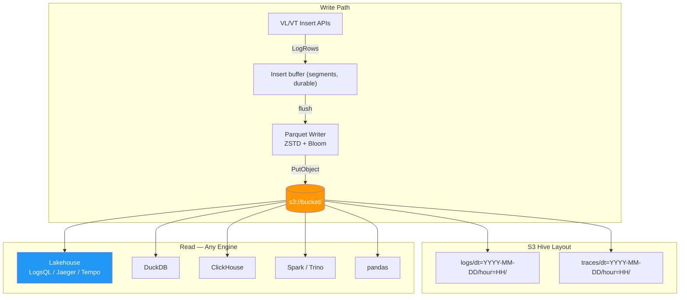

# Open Parquet Format

Victoria Lakehouse stores all observability data as standard Apache Parquet files with ZSTD compression and Hive-style partitioning. There is no proprietary format, no catalog server requirement, and no vendor lock-in. Parquet readers can query this data directly from S3: DuckDB, Spark, Trino, ClickHouse, pyarrow, pandas, Polars and DataFusion each run a documented example against real Lakehouse files in CI, and [Querying with External Tools](#querying-with-external-tools) lists exactly which combinations work today and which have an open issue.

## S3 Layout

Files are organized by tenant, signal, date and hour (Hive-style partitioning):

```
s3://obs-archive/
  4401/1/                      <- {AccountID}/{ProjectID}/ (tenant.prefix_template)
    logs/
      dt=2026-01-15/hour=00/5480d91da04c0ca1.parquet
      dt=2026-01-15/hour=01/compacted-L2-c6c43713.parquet
      dt=2026-01-15/hour=01/_pmeta.bundle      <- Lakehouse metadata, not Parquet
    traces/
      dt=2026-01-15/hour=00/0066259c01d4a553.parquet
      dt=2026-01-15/hour=14/compacted-L3-9fed8c15.parquet
```

Flushed files have a random hexadecimal name. After compaction, merged files are named `compacted-L<level>-<id>.parquet`.

All query engines that support Hive partitioning (DuckDB, Spark, Trino, ClickHouse, pyarrow, DataFusion, Polars) can prune partitions when filtering by `dt` or `hour`, reading only the directories that match the query time range. The next sections list the engines proven on real Lakehouse files and the ones that currently are not.


```mermaid
graph TD
    subgraph "Write Path"
    VL["VL/VT Insert APIs"] -->|LogRows| B["Insert buffer (segments, durable)"]
    B -->|flush| PW[Parquet Writer<br/>ZSTD + Bloom]
    PW -->|PutObject| S3
    end

    subgraph "S3 Hive Layout"
    S3[("s3://bucket/")] --> L["logs/dt=YYYY-MM-DD/hour=HH/"]
    S3 --> T["traces/dt=YYYY-MM-DD/hour=HH/"]
    end

    subgraph "Read — Any Engine"
    S3 --> LH["Lakehouse<br/>LogsQL / Jaeger / Tempo"]
    S3 --> DDB[DuckDB]
    S3 --> CH[ClickHouse]
    S3 --> SP[Spark / Trino]
    S3 --> PD[pandas]
    end

    style S3 fill:#FF9800,color:#fff
    style LH fill:#2196F3,color:#fff
```

## Logs Schema

The log Parquet schema is defined in `internal/schema/row.go` as the `LogRow` struct. Column names use OTEL semantic convention dot-notation directly.

### Promoted Columns

These columns exist as top-level Parquet columns with their own column statistics and optional bloom filters:

| Parquet Column | Go Type | Parquet Type | Bloom Filter | Notes |
|---|---|---|---|---|
| `timestamp_unix_nano` | `int64` | INT64 | No | Nanosecond epoch, always present |
| `body` | `string` | BYTE_ARRAY | No | Full log message text |
| `severity_text` | `string` | BYTE_ARRAY (DICT) | No | INFO, WARN, ERROR, DEBUG |
| `severity_number` | `int32` | INT32 | No | OTEL severity number (5-17) |
| `service.name` | `string` | BYTE_ARRAY (DICT) | Yes | Primary service identifier |
| `k8s.namespace.name` | `string` | BYTE_ARRAY (DICT) | No | Kubernetes namespace |
| `k8s.pod.name` | `string` | BYTE_ARRAY (DICT) | No | Kubernetes pod name |
| `k8s.deployment.name` | `string` | BYTE_ARRAY (DICT) | No | Kubernetes deployment |
| `k8s.node.name` | `string` | BYTE_ARRAY (DICT) | No | Kubernetes node |
| `deployment.environment` | `string` | BYTE_ARRAY (DICT) | No | production, staging, canary |
| `cloud.region` | `string` | BYTE_ARRAY (DICT) | No | AWS/GCP region |
| `host.name` | `string` | BYTE_ARRAY (DICT) | No | Hostname |
| `trace_id` | `string` | BYTE_ARRAY | Yes | Trace correlation ID |
| `span_id` | `string` | BYTE_ARRAY | No | Span correlation ID |
| `_stream` | `string` | BYTE_ARRAY | No | VL stream identity label set |
| `_stream_id` | `string` | BYTE_ARRAY | No | VL stream hash |
| `scope.name` | `string` | BYTE_ARRAY | No | Instrumentation scope name |

### MAP Columns

Non-promoted attributes are stored in MAP columns using Parquet's `MAP<STRING,STRING>` logical type:

| Parquet Column | Contents |
|---|---|
| `resource.attributes` | All OTEL resource attributes not promoted to top-level columns |
| `log.attributes` | All OTEL log record attributes (e.g., `http.method`, `request_id`, `exception.type`) |

MAP columns allow storing arbitrary key-value pairs without schema changes. The schema registry resolves VL field names to MAP lookups at query time: `resource_attr:X` queries `resource.attributes[X]`, and unknown dotted names try `resource.attributes` first, then `log.attributes`.

## Traces Schema

The trace Parquet schema is defined as the `TraceRow` struct. It includes span-specific columns alongside shared resource attributes.

### Promoted Columns

| Parquet Column | Go Type | Parquet Type | Bloom Filter | Notes |
|---|---|---|---|---|
| `timestamp_unix_nano` | `int64` | INT64 | No | Span end time (nanoseconds) |
| `start_time_unix_nano` | `int64` | INT64 | No | Span start time |
| `body` | `string` | BYTE_ARRAY (OPTIONAL) | Token bloom | Actual native `_msg`; absent in legacy objects |
| `trace_id` | `string` | BYTE_ARRAY | Yes | Primary lookup key |
| `span_id` | `string` | BYTE_ARRAY | No | Span identity |
| `parent_span_id` | `string` | BYTE_ARRAY | No | Parent span for tree construction |
| `span.name` | `string` | BYTE_ARRAY (DICT) | No | Operation name |
| `span.kind` | `int32` | INT32 | No | CLIENT=1, SERVER=2, etc. |
| `status.code` | `int32` | INT32 | No | 0=Unset, 1=OK, 2=Error |
| `status.message` | `string` | BYTE_ARRAY | No | Error details |
| `duration_ns` | `int64` | INT64 | No | Span duration (nanoseconds) |
| `service.name` | `string` | BYTE_ARRAY (DICT) | Yes | Service that produced the span |
| `scope.name` | `string` | BYTE_ARRAY | No | Instrumentation library name |
| `span.events_json` | `string` | BYTE_ARRAY (OPTIONAL, UTF-8) | No | The span's events as a JSON array; NULL when the span has none. See [Span events, links and scope attributes](#span-events-links-and-scope-attributes) |
| `span.links_json` | `string` | BYTE_ARRAY (OPTIONAL, UTF-8) | No | The span's links as a JSON array; NULL when the span has none |

Legacy objects without `body` retain an absent native message through reads and compaction; unavailable historical values are not fabricated. A customer span attribute named `_msg` remains a distinct `span_attr:_msg` map key. An ambiguous legacy map `_msg` is kept as that attribute rather than reclassified as a native message.

### MAP Columns

| Parquet Column | Contents |
|---|---|
| `resource.attributes` | Resource-level attributes (environment, region, host, K8s metadata) |
| `span.attributes` | Span-level attributes (HTTP method, status code, URL, DB system, DB statement) |
| `scope.attributes` | Instrumentation scope attributes (the OpenTelemetry `InstrumentationScope.attributes`; the scope name is `scope.name`, the scope version is the `scope_version` entry of `span.attributes`) |

### Span events, links and scope attributes

A span's events (`exception` events with their stack trace, log events), its links and the attributes of its instrumentation scope are stored with the span, exactly as VictoriaTraces stores them, and read back as the fields VictoriaTraces returns (`event:event_name:0`, `link:link_span_id:0`, `scope_attr:<key>`). Scope attributes live in the `scope.attributes` MAP column. Events and links are two optional string columns, `span.events_json` and `span.links_json`, each holding one JSON array per span:

```json
[
  {"event_name": "exception",
   "event_time_unix_nano": "1760000000123456789",
   "event_dropped_attributes_count": "0",
   "event_attr:exception.type": "java.io.IOException",
   "event_attr:exception.stacktrace": "java.io.IOException: boom\n\tat a.B.c(B.java:7)"},
  {"event_name": "retry", "event_time_unix_nano": "1760000000123456999", "event_attr:attempt": "2"}
]
```

- Element `i` of the array is event (or link) `i`. Its keys are the VictoriaTraces field names without the `event:` / `link:` prefix and the `:<i>` suffix: `event_time_unix_nano`, `event_name`, `event_dropped_attributes_count` and `event_attr:<attribute key>` for events; `link_trace_id`, `link_span_id`, `link_trace_state`, `link_flags`, `link_dropped_attributes_count` and `link_attr:<attribute key>` for links.
- Every value is a string, as VictoriaTraces stores it (timestamps and counts are decimal text; an empty attribute value is `"-"`). A field the span did not carry is absent from the element, not `null`.
- A span without events has `NULL` in `span.events_json`; there is no empty array. The same holds for links.
- Elements are in event order and keys are written in sorted order, so the same span always produces the same bytes. An element whose index is not its position in the array (a gap, or fields that arrived without the `:<i>` suffix through the jsonline path) carries the reserved key `"$idx"` with the original suffix; a field name that itself starts with `$` is written with one more `$`.
- The two columns are plain `BYTE_ARRAY` (UTF-8) with ZSTD and no dictionary, no bloom filter and no Lakehouse-specific framing: every engine reads them as strings, and any JSON function decodes them. Files written before the columns existed do not have them at all; engines that union such files with newer ones (DuckDB `union_by_name = true`, Spark `mergeSchema`) read `NULL`.
- Compaction and delete rewrites carry both columns through unchanged.

The two columns are only read for queries that name an event or link field (trace-by-ID, `event:*` / `link:*` filters, `field_values`, a wildcard read); searches, metrics and service/operation listings never touch them.

DuckDB, the spans that recorded an `exception` event with its type and stack trace (the CI gate `scripts/ci/parquet-readback` runs this kind of query under DuckDB and pyarrow and compares it with the counts the writer recorded):

```sql
SELECT trace_id, span_id,
       json_extract_string(e, '$."event_attr:exception.type"')       AS exception_type,
       json_extract_string(e, '$."event_attr:exception.stacktrace"') AS stacktrace
FROM (
  SELECT trace_id, span_id, unnest(from_json("span.events_json", '["JSON"]')) AS e
  FROM read_parquet('s3://obs-archive/4401/1/traces/dt=*/hour=*/*.parquet', hive_partitioning = true)
  WHERE "span.events_json" IS NOT NULL
)
WHERE json_extract_string(e, '$.event_name') = 'exception';
```

Links, and the scope attributes, the same way:

```sql
SELECT trace_id, span_id,
       json_extract_string(l, '$.link_trace_id') AS linked_trace_id,
       json_extract_string(l, '$.link_span_id')  AS linked_span_id
FROM (
  SELECT trace_id, span_id, unnest(from_json("span.links_json", '["JSON"]')) AS l
  FROM read_parquet('s3://obs-archive/4401/1/traces/dt=*/hour=*/*.parquet', hive_partitioning = true)
  WHERE "span.links_json" IS NOT NULL
);

SELECT "scope.attributes"['otel.scope.name'] AS scope, count(*) FROM spans GROUP BY 1;
```

pyarrow:

```python
import json
import pyarrow.dataset as ds

spans = ds.dataset("obs-archive/4401/1/traces", filesystem=s3, format="parquet", partitioning="hive")
table = spans.to_table(columns=["trace_id", "span_id", "span.events_json"])
for trace_id, span_id, events in zip(*(table.column(c).to_pylist() for c in table.column_names)):
    for event in json.loads(events) if events else []:
        if event["event_name"] == "exception":
            print(trace_id, span_id, event.get("event_attr:exception.type"))
```

Any engine with JSON functions decodes the same strings. The CI gate runs DuckDB and pyarrow; the ClickHouse, Trino and Spark examples of this page do not read these two columns yet.

## Row Groups and Column Statistics

Each Parquet file contains row groups of approximately 10,000 rows (configurable via `--lakehouse.insert.row-group-size`). Each row group stores per-column statistics:

- **Min/max values**: Used for range pruning. Queries with time range filters skip row groups whose `timestamp_unix_nano` min/max does not overlap the query range.
- **Null count**: Number of null values in the column for the row group.
- **Distinct count**: Approximate cardinality (when available).

These statistics are stored in the Parquet column index and are read without scanning row data.

## Bloom Filters

Bloom filters are written per row group, as Parquet split-block bloom filters (SBBF), for the columns marked `HasBloom: true` in the schema registry plus any operator slot columns. They enable exact-match queries to skip entire row groups with zero false negatives.

- **Logs: 10 columns.** `trace_id`, `span_id`, `service.name`, `service.instance.id`, `service.version`, `container.id`, `host.name`, `k8s.pod.name`, `k8s.node.name`, `exception.type`.
- **Traces: 19 columns defined, 14 present in the CI fixture.** `trace_id`, `span_id`, `span.name`, `service.name`, `service.instance.id`, `container.id`, `host.name`, `k8s.pod.name`, `k8s.node.name`, `url.full`, `client.address`, `server.address`, `network.peer.address`, `rpc.method`, and five more that a file carries only when its spans have that attribute: `db.collection.name`, `db.operation.name`, `messaging.destination.name`, `code.function.name`, `exception.type`.

`span_id` has a filter like the others (it is only left out of Lakehouse's own file-level `_bloom.bin` index, because it is unique per span). The body of a log record has token blooms in the footer key-values (`_bloom_body_rg_N`), not an SBBF.

A filter holds about 10 bits per distinct value of the column in the row group and is rounded up to whole 32-byte blocks: 25 values or fewer give 32 bytes, 60 values give 96 bytes, 120 values give 160 bytes. Only some of those sizes are powers of two, and some readers need one (see ClickHouse below).

The bloom filter check is performed by `bloomFilterSkip()` in the query engine. For a query like `trace_id:="abc123"`, the engine:

1. Extracts the exact-match value from the LogsQL query string
2. Reads the bloom filter from the Parquet column chunk metadata
3. Calls `bf.Check(value)` -- if the result is `false`, the row group is guaranteed to not contain the value and is skipped entirely

False positive rate is controlled by the Parquet writer's bloom filter configuration (typically 1% FPR).

## Compression

All files use ZSTD compression. The compression level is configurable via `--lakehouse.insert.compression-level` with these trade-offs:

| Level | Encode Speed | Ratio (real data) | Best For |
|---|---|---|---|
| 1 (fastest) | ~340 MB/s | 4.4x logs / 6.9x traces | High ingest rate (>500 MB/s) |
| 3 | ~320 MB/s | 4.6x logs / 7.9x traces | Maximum write speed |
| 7 (default) | ~260 MB/s | 6.1x logs / 9.4x traces | Best cost/performance compromise |
| 11+ (best) | ~63 MB/s | 6.2x logs / 9.7x traces | Never recommended (<2% gain, 5x slower) |

Ratios measured on real E2E data (377K logs, 159K traces). See [ZSTD Benchmark](zstd-compression-benchmark.md).

Low-cardinality string columns (`service.name`, `k8s.namespace.name`) achieve 50-200x compression due to Parquet's dictionary encoding combined with ZSTD. High-entropy columns (`body`, `trace_id`) compress 2-4x.

## Footer key/value entries

Lakehouse metadata that belongs to one file lives in standard Parquet footer key/value entries, which every reader exposes (`pyarrow` `ParquetFile.metadata.metadata`, DuckDB `parquet_kv_metadata()`) and ignores otherwise:

| Key | Written by | Value |
|---|---|---|
| `_trace_idx` | traces writers | the file's trace IDs with their time bounds |
| `_bloom_body_rg_N` | flush writers | token bloom of row group N's message bodies |
| `lakehouse.dedicated_slots` | all writers, when slots are configured | the Tier-2 slot-to-attribute binding |
| `lh.trace_id_hex` | all writers (flush, compaction, delete rewrite; both binaries) | ASCII `1` when every `trace_id` value in the file is lowercase hex (or empty), `0` otherwise; see [read-path.md](read-path.md#attested-lowercase-hex-trace_id-files-lhtrace_id_hex) |

`lh.trace_id_hex` is plain ASCII, so the footer stays valid UTF-8 for every reader.

## Writer Library

Files are written with [parquet-go](https://github.com/parquet-go/parquet-go). Every Lakehouse writer (flush, compaction and delete rewrite, in both binaries) sets the footer's `created_by` string to `victoria-lakehouse version <release>(build )`, where `<release>` is the version the binary was built as (`dev` for an unstamped build). `parquet-tools meta` prints it. It is the only place the writer identifies itself; it carries no meaning for readers and no Lakehouse metadata. The parquet-go version behind a release is the one in that release's `go.mod`.

`created_by` is fixed by Lakehouse rather than left to the library on purpose. parquet-go's default reads the library version from the Go build information, which is present or absent depending on the toolchain and build mode: Go 1.27 fills it in for test binaries (`github.com/parquet-go/parquet-go version 0.32.0(build )`), Go 1.26 did not (`github.com/parquet-go/parquet-go`). The same rows then came out 23 bytes longer or shorter per file, which moved the field-metadata perf rows' `s3_bytes` counters between CI runs on different toolchains (by 17 bytes on the `fv_level` compacted `window=whole` cells: the footer tail reads scale with object size). With a fixed string, the bytes of a file depend only on the rows, the writer options and the release.

Readers do not interpret the application name: pyarrow and DuckDB apply version-specific statistics workarounds only to `parquet-mr` and `parquet-cpp` files, and the readback gate below writes its files with the same `created_by`.

### parquet-go v0.32.0

Nothing on disk changed when the writer moved from parquet-go v0.30.1 to v0.32.0. The same rows written by both versions with the same writer options produce files that are **byte-identical apart from the `created_by` string**: for a 5,000-row logs file the two builds differ in exactly 2 of 237,050 bytes, both inside `...version 0.30.1(build )` / `...version 0.32.0(build )`.

The footer metadata was compared field by field with pyarrow (`ParquetFile.metadata`) across every row group and every column chunk -- encodings, compression codec, value counts, dictionary-page presence, null counts and min/max statistics, 2,084 lines of it. The only difference is the `created_by` line.

Structural readback goldens in both modules assert the same thing from the Go side, on files produced by the production writer (ZSTD, 10,000-row row groups, dictionary columns, split-block row-group blooms, the trace-index footer key-value entry): row counts, row-group boundaries, per-column encodings and codecs, bloom presence, bloom hit/miss against fixed samples of known-present and known-absent keys, page-index presence, per-row-group page counts, footer key-value keys and the time column's min/max are identical between the two versions for every writer shape.

**Readers are unaffected.** The multi-engine readback gate (pyarrow and DuckDB reading every generated file, checking aggregates against writer-side truth plus row-level equality, encodings and page index) passes unchanged on v0.32.0.

Three upstream writer defects were fixed between the two versions: page counts belonging to one row group being overwritten by a later row group, bloom filters mis-sized when a row group is closed by the row limit, and the dictionary fallback dropping values. None of them was reachable from the Lakehouse writers, which build files through `Write(rows)` -- filters there are sized at flush time from the values actually written. Measured on v0.30.1 and v0.32.0 alike: blooms come out at 12,512 bytes for a 10,000-row group (10 bits per value), with a 1.0-1.3% false-positive rate and no false negatives, and a 200,000-distinct-value dictionary column reads back complete and in order. Regression tests in both modules now pin all three properties.

### Write reproducibility

For logs the writer is **byte-reproducible**: writing the same rows twice with the same options produces identical files, asserted in both modules by `TestLogsParquetWriteIsByteReproducible`. That is what makes a byte-level comparison across library versions meaningful — once the writer itself is deterministic, any remaining difference belongs to parquet-go.

The trace writer is byte-reproducible too, asserted in both modules by `TestTracesParquetWriteIsByteReproducible`. It used not to be: the `_trace_idx` footer key-value entry was serialised by iterating a Go map, so its entry order varied from run to run. The index is now emitted sorted by trace ID (readers are unaffected; the index is self-describing and was never read in order).

Compacted objects are held to the same property: `TestFieldMetadataCompactedLayoutIsByteReproducible` (logs) and `TestFieldMetadataTracesCompactedLayoutIsByteReproducible` (traces) build the compacted deployment of the field-metadata dataset twice and require byte-identical objects in every partition, with the Lakehouse `created_by`.

`footerMetadataDiff` (same test files) reports which footer fields differ between two Parquet files — `created_by`, format version, row counts, footer key set, and per row group per column the path, codec, value count, encodings, dictionary-page presence, null and distinct counts and min/max statistics. Point `PARQUET_FOOTER_BASELINE` at a file written by another parquet-go version and `TestFooterMetadataDiffAgainstBaseline` re-runs that comparison and prints the exact field list, so the next library bump records what moved instead of asserting from memory that nothing did. At v0.30.1 -> v0.32.0 the list was `created_by` and nothing else.

The structural goldens report differences the same way: `diffGolden` names each field that changed (`columns[3].encodings[0]`, `bloom_probes[1].present_hits`, `rows_per_row_group[0]`) rather than printing two multi-thousand-line JSON documents, and `TestGoldenDiffNamesTamperedFields` proves that sensitivity by mutating a copy of a real golden — one encoding, one bloom probe count, one row-group boundary — and requiring each mutation to be named.

## Querying with External Tools

Any engine that reads Parquet from S3 can query a tenant's data directly, with no Lakehouse process in the path. This section gives one working example per engine, for logs and for traces, and the facts every engine needs: where the files are, how the partitions are named, what the columns look like, and what each engine does differently.

### What the engines see

```
s3://<bucket>/<AccountID>/<ProjectID>/<signal>/dt=<YYYY-MM-DD>/hour=<HH>/<file>.parquet
```

- `<signal>` is `logs` or `traces`. `<AccountID>/<ProjectID>` is the default tenant prefix (`tenant.prefix_template`). A string tenant (`X-Scope-OrgID`) lives under the numeric tenant its alias resolves to, so `acme-corp` configured as `1001:0` is `1001/0/`.
- `dt` and `hour` exist only in the path (Hive style). They are not columns in the file; engines add them when Hive partitioning is on.
- Flushed files have a random hexadecimal name; compacted files are `compacted-L<n>-<id>.parquet`. Both are plain Parquet with the same columns.
- There is **no table catalog**: no Iceberg, Delta or Hive Metastore. Point the engine at the tenant prefix or at the glob `dt=*/hour=*/*.parquet`.
- Other objects sit next to the data (`_pmeta.bundle`, `_meta/`, `_segments/` commit markers of the insert buffer, `_tombstones/`, `_write_check`). They are not Parquet, so globs end in `*.parquet`; engines that scan a directory skip names that start with `_`.
- Lakehouse stores its own metadata (the trace-ID index, token blooms) in the Parquet footer key-value area and in `_pmeta.bundle`. A reader that ignores footer key-values never sees it, and nothing else depends on it. Two readers do currently refuse some files because of how those footer values are encoded; see the coverage table.

Facts about the objects that matter to a reader that does not go through Lakehouse:

- **Tombstoned rows stay visible until the file is rewritten.** A delete through the API writes a tombstone (`_tombstones/`) and Lakehouse hides the rows at query time. The Parquet objects are not touched until the rewrite (`delete.rewrite_delay`, or a compaction that picks the file up), so a direct reader still sees deleted rows until then. If deletes must be honoured, read through Lakehouse or wait for the rewrite.
- **`ded_s01` to `ded_s08` are operator-configured attribute slots.** When a custom attribute is bound to a slot (`--lakehouse.schema.extra-promoted`), its values are in a generic column `ded_sNN`; the binding is recorded in the footer key-value `lakehouse.dedicated_slots`. A reader that ignores footer key-values sees the slot name, not the attribute name.
- **A listing taken during a compaction can see a row twice.** Compaction publishes the merged object first and deletes its inputs afterwards. Lakehouse reads through its manifest and never sees both; a reader that lists the prefix between the two steps does. Spans can be de-duplicated on `(trace_id, span_id)`; log records have no unique key, so read data older than the compaction age (`compaction.min_age`) or retry a count that looks high.
- **Footer key-values are not UTF-8** in the files Lakehouse writes today: `_trace_idx` in every traces file and `_bloom_body_rg_N` in every logs file that has a body bloom, raw or compacted. Readers that decode them as text (Polars, DataFusion) refuse the files ([#340](https://github.com/ReliablyObserve/victoria-lakehouse/issues/340)).

Column facts that hold for every engine:

| Fact | Detail |
|---|---|
| Time | `timestamp_unix_nano` is a plain `INT64`: nanoseconds since the Unix epoch, UTC. It is not a Parquet `TIMESTAMP`, so convert it where you need a date (`make_timestamp(ns // 1000)`, `from_unixtime_nanos(ns)`, `fromUnixTimestamp64Nano(ns)`, `timestamp_micros(ns DIV 1000)`). Compare the integer to keep nanosecond precision. Trino's `date_format` works on milliseconds and rounds, so `23:59:59.999999999` formats as the next day; derive the UTC day by integer division (`ns / 86400000000000`) as the Trino example does. Traces also have `start_time_unix_nano` and `duration_ns`. |
| Tenant | `account_id` and `project_id` are unsigned 32-bit (`INT32` with the `UINT_32` annotation). Tenants above 2^31 read back negative in engines that ignore the annotation. |
| Logs | `body` is the message, `severity_text` / `service.name` / `trace_id` are columns; attributes that are not promoted columns are in the `MAP<STRING,STRING>` columns `resource.attributes`, `log.attributes` and `scope.attributes`. |
| Traces | `trace_id`, `span_id`, `parent_span_id`, `span.name`, `service.name`, `status.code`, `span.kind`, `duration_ns`; attributes in the maps `resource.attributes`, `span.attributes`, `scope.attributes`. |
| Names | OpenTelemetry dot-notation column names (`service.name`, `log.attributes`) need quoting: `"service.name"` in DuckDB, ClickHouse, Trino, DataFusion, backticks in Spark. |
| Maps | DuckDB `m['k']`, ClickHouse `m['k']`, Spark `m['k']`, Trino `element_at(m, 'k')`, DataFusion `map_extract(m, 'k')[1]`, pyarrow `pc.map_lookup(m, 'k', 'first')`, pandas a list of `(key, value)` tuples per row, Polars `List(Struct(key, value))`. |
| Partition columns | Engines infer `dt` and `hour` differently: `dt` is a date in DuckDB, ClickHouse and Spark; `hour` keeps its leading zero as text in DuckDB and ClickHouse and is the integer 9 in pyarrow and Spark. Comparing `dt` with a `'YYYY-MM-DD'` literal, or casting it to text first, works everywhere, which is what the examples do. |

### How CI keeps these examples honest

Every fenced block that follows a `<!-- ci:engine=... signal=... -->` marker is executed by the `parquet-readers` workflow against files Lakehouse wrote, and its output is compared with Lakehouse's own answers. Only the example values are replaced as plain text (`localhost:9000`, `obs-archive`, `minioadmin`, `4401/1`, the time window `1767225600000000000`..`1767229200000000000`, the trace ID `0af7651916cd43dd8448eb211c80319c` and the day `2026-01-01`); the statements are not edited. Nothing in this section is a claim that was not run, except the vendor examples under "Managed cloud engines", which are labelled as such.

The check set, per engine and signal: `count`, `by_service`, `field_filter`, `time_range` (nanosecond window), `map_filter`, `trace_by_id` (span count of one trace; rows of one trace ID in logs), `dt_filter`, `ts_bounds` (exact minimum and maximum nanosecond value), `utc_check` (the UTC day of every timestamp equals its `dt=` directory), `tenant`. SQL examples name each check with a `-- q: <name>` comment; Python examples assign it to `q_<name>`. The fixture is ingested by the datagen tool for three tenants (numeric `4401:1`, the string alias `acme-corp` and `AccountID 3000000000`, which is above 2^31) and run on raw flushed files and on compacted files. Partition pruning is proven by a prefix that holds one real day plus a partition whose only object is garbage: the `dt` filter must still answer, and the unfiltered count on the same prefix must fail.


### DuckDB

Needs the `httpfs` extension. `hive_partitioning = true` adds `dt` and `hour`; DuckDB also uses the row-group bloom filters for equality filters.

<!-- ci:engine=duckdb signal=logs -->
```sql
INSTALL httpfs;
LOAD httpfs;
SET s3_endpoint = 'localhost:9000';
SET s3_access_key_id = 'minioadmin';
SET s3_secret_access_key = 'minioadmin';
SET s3_use_ssl = false;
SET s3_url_style = 'path';

CREATE VIEW logs AS
SELECT * FROM read_parquet('s3://obs-archive/4401/1/logs/dt=*/hour=*/*.parquet',
                           hive_partitioning = true, filename = true);

-- q: count
SELECT count(*) FROM logs;
-- q: by_service
SELECT "service.name", count(*) FROM logs GROUP BY 1;
-- q: field_filter
SELECT count(*) FROM logs WHERE severity_text = 'ERROR' AND "service.name" = 'api-gateway';
-- q: time_range
SELECT count(*) FROM logs
WHERE timestamp_unix_nano >= 1767225600000000000 AND timestamp_unix_nano < 1767229200000000000;
-- q: map_filter
SELECT count(*) FROM logs WHERE "log.attributes"['format'] = 'nginx';
-- q: trace_by_id
SELECT count(*) FROM logs WHERE trace_id = '0af7651916cd43dd8448eb211c80319c';
-- q: dt_filter
SELECT count(*) FROM logs WHERE dt = '2026-01-01';
-- q: ts_bounds
SELECT min(timestamp_unix_nano), max(timestamp_unix_nano) FROM logs;
-- q: utc_check
SELECT count(*) FROM logs
WHERE strftime(make_timestamp(timestamp_unix_nano // 1000), '%Y-%m-%d') <> CAST(dt AS VARCHAR);
-- q: files
SELECT DISTINCT filename FROM logs;
-- q: tenant
SELECT DISTINCT account_id, project_id FROM logs;
```

<!-- ci:engine=duckdb signal=traces -->
```sql
INSTALL httpfs;
LOAD httpfs;
SET s3_endpoint = 'localhost:9000';
SET s3_access_key_id = 'minioadmin';
SET s3_secret_access_key = 'minioadmin';
SET s3_use_ssl = false;
SET s3_url_style = 'path';

CREATE VIEW spans AS
SELECT * FROM read_parquet('s3://obs-archive/4401/1/traces/dt=*/hour=*/*.parquet',
                           hive_partitioning = true, filename = true);

-- q: count
SELECT count(*) FROM spans;
-- q: by_service
SELECT "service.name", count(*) FROM spans GROUP BY 1;
-- q: field_filter
SELECT count(*) FROM spans WHERE "status.code" = 2 AND "service.name" = 'api-gateway';
-- q: time_range
SELECT count(*) FROM spans
WHERE timestamp_unix_nano >= 1767225600000000000 AND timestamp_unix_nano < 1767229200000000000;
-- q: map_filter
SELECT count(*) FROM spans WHERE "span.attributes"['rpc.system'] = 'grpc';
-- q: trace_by_id
SELECT count(*) FROM spans WHERE trace_id = '0af7651916cd43dd8448eb211c80319c';
-- q: dt_filter
SELECT count(*) FROM spans WHERE dt = '2026-01-01';
-- q: ts_bounds
SELECT min(timestamp_unix_nano), max(timestamp_unix_nano) FROM spans;
-- q: utc_check
SELECT count(*) FROM spans
WHERE strftime(make_timestamp(timestamp_unix_nano // 1000), '%Y-%m-%d') <> CAST(dt AS VARCHAR);
-- q: files
SELECT DISTINCT filename FROM spans;
-- q: tenant
SELECT DISTINCT account_id, project_id FROM spans;
```

### pyarrow

The dataset API discovers the Hive partitions, ignores the `_`-prefixed objects and prunes on `dt` / `hour` before any data is read.

<!-- ci:engine=pyarrow signal=logs -->
```python
import pyarrow as pa
import pyarrow.compute as pc
import pyarrow.dataset as ds
from pyarrow import fs

s3 = fs.S3FileSystem(endpoint_override="localhost:9000", scheme="http",
                     access_key="minioadmin", secret_key="minioadmin")
logs = ds.dataset("obs-archive/4401/1/logs", filesystem=s3, format="parquet", partitioning="hive")

q_count = logs.count_rows()
q_by_service = logs.to_table(columns=["service.name"]).group_by("service.name").aggregate([([], "count_all")])
q_field_filter = logs.count_rows(
    filter=(pc.field("severity_text") == "ERROR") & (pc.field("service.name") == "api-gateway"))
q_time_range = logs.count_rows(
    filter=(pc.field("timestamp_unix_nano") >= 1767225600000000000)
    & (pc.field("timestamp_unix_nano") < 1767229200000000000))
attrs = logs.to_table(columns=["log.attributes"])["log.attributes"]
q_map_filter = pc.sum(pc.equal(pc.map_lookup(attrs, pa.scalar("format"), "first"), "nginx")).as_py() or 0
q_trace_by_id = logs.count_rows(filter=pc.field("trace_id") == "0af7651916cd43dd8448eb211c80319c")
q_dt_filter = logs.count_rows(filter=pc.field("dt") == "2026-01-01")
ts = logs.to_table(columns=["timestamp_unix_nano", "dt"])
q_ts_bounds = pc.min_max(ts["timestamp_unix_nano"])
utc_day = pc.strftime(pc.cast(ts["timestamp_unix_nano"], pa.timestamp("ns", "UTC")), "%Y-%m-%d")
q_utc_check = pc.sum(pc.not_equal(utc_day, ts["dt"])).as_py() or 0
q_tenant = logs.to_table(columns=["account_id", "project_id"]).group_by(["account_id", "project_id"]).aggregate([])
q_files = logs.files
```

<!-- ci:engine=pyarrow signal=traces -->
```python
import pyarrow as pa
import pyarrow.compute as pc
import pyarrow.dataset as ds
from pyarrow import fs

s3 = fs.S3FileSystem(endpoint_override="localhost:9000", scheme="http",
                     access_key="minioadmin", secret_key="minioadmin")
spans = ds.dataset("obs-archive/4401/1/traces", filesystem=s3, format="parquet", partitioning="hive")

q_count = spans.count_rows()
q_by_service = spans.to_table(columns=["service.name"]).group_by("service.name").aggregate([([], "count_all")])
q_field_filter = spans.count_rows(
    filter=(pc.field("status.code") == 2) & (pc.field("service.name") == "api-gateway"))
q_time_range = spans.count_rows(
    filter=(pc.field("timestamp_unix_nano") >= 1767225600000000000)
    & (pc.field("timestamp_unix_nano") < 1767229200000000000))
attrs = spans.to_table(columns=["span.attributes"])["span.attributes"]
q_map_filter = pc.sum(pc.equal(pc.map_lookup(attrs, pa.scalar("rpc.system"), "first"), "grpc")).as_py() or 0
q_trace_by_id = spans.count_rows(filter=pc.field("trace_id") == "0af7651916cd43dd8448eb211c80319c")
q_dt_filter = spans.count_rows(filter=pc.field("dt") == "2026-01-01")
ts = spans.to_table(columns=["timestamp_unix_nano", "dt"])
q_ts_bounds = pc.min_max(ts["timestamp_unix_nano"])
utc_day = pc.strftime(pc.cast(ts["timestamp_unix_nano"], pa.timestamp("ns", "UTC")), "%Y-%m-%d")
q_utc_check = pc.sum(pc.not_equal(utc_day, ts["dt"])).as_py() or 0
q_tenant = spans.to_table(columns=["account_id", "project_id"]).group_by(["account_id", "project_id"]).aggregate([])
q_files = spans.files
```

### pandas

Loads everything it selects into memory; pass `columns=` and `filters=` on real data. `filters=` on `dt` is pruned by pyarrow. Map columns arrive as lists of `(key, value)` tuples.

<!-- ci:engine=pandas signal=logs -->
```python
import pandas as pd

s3 = {"key": "minioadmin", "secret": "minioadmin",
      "client_kwargs": {"endpoint_url": "http://localhost:9000"}}
path = "s3://obs-archive/4401/1/logs/"
logs = pd.read_parquet(path, storage_options=s3)

q_count = len(logs)
q_by_service = logs.groupby("service.name").size().reset_index()
q_field_filter = int(((logs["severity_text"] == "ERROR") & (logs["service.name"] == "api-gateway")).sum())
q_time_range = int(logs["timestamp_unix_nano"].between(1767225600000000000, 1767229200000000000, inclusive="left").sum())
q_map_filter = int((logs["log.attributes"].map(lambda m: dict(m).get("format")) == "nginx").sum())
q_trace_by_id = int((logs["trace_id"] == "0af7651916cd43dd8448eb211c80319c").sum())
q_dt_filter = len(pd.read_parquet(path, storage_options=s3, columns=["trace_id"], filters=[("dt", "==", "2026-01-01")]))
q_ts_bounds = [logs["timestamp_unix_nano"].min(), logs["timestamp_unix_nano"].max()]
day = pd.to_datetime(logs["timestamp_unix_nano"], unit="ns", utc=True).dt.strftime("%Y-%m-%d")
q_utc_check = int((day != logs["dt"].astype(str)).sum())
q_tenant = logs[["account_id", "project_id"]].drop_duplicates()
```

<!-- ci:engine=pandas signal=traces -->
```python
import pandas as pd

s3 = {"key": "minioadmin", "secret": "minioadmin",
      "client_kwargs": {"endpoint_url": "http://localhost:9000"}}
path = "s3://obs-archive/4401/1/traces/"
spans = pd.read_parquet(path, storage_options=s3)

q_count = len(spans)
q_by_service = spans.groupby("service.name").size().reset_index()
q_field_filter = int(((spans["status.code"] == 2) & (spans["service.name"] == "api-gateway")).sum())
q_time_range = int(spans["timestamp_unix_nano"].between(1767225600000000000, 1767229200000000000, inclusive="left").sum())
q_map_filter = int((spans["span.attributes"].map(lambda m: dict(m).get("rpc.system")) == "grpc").sum())
q_trace_by_id = int((spans["trace_id"] == "0af7651916cd43dd8448eb211c80319c").sum())
q_dt_filter = len(pd.read_parquet(path, storage_options=s3, columns=["trace_id"], filters=[("dt", "==", "2026-01-01")]))
q_ts_bounds = [spans["timestamp_unix_nano"].min(), spans["timestamp_unix_nano"].max()]
day = pd.to_datetime(spans["timestamp_unix_nano"], unit="ns", utc=True).dt.strftime("%Y-%m-%d")
q_utc_check = int((day != spans["dt"].astype(str)).sum())
q_tenant = spans[["account_id", "project_id"]].drop_duplicates()
```

### Polars

Lazy `scan_parquet` with a glob. Maps are `List(Struct(key, value))`.

<!-- ci:engine=polars signal=logs -->
```python
import polars as pl

s3 = {"aws_access_key_id": "minioadmin", "aws_secret_access_key": "minioadmin",
      "aws_endpoint_url": "http://localhost:9000", "aws_region": "us-east-1", "aws_allow_http": "true"}
logs = pl.scan_parquet("s3://obs-archive/4401/1/logs/dt=*/hour=*/*.parquet",
                       hive_partitioning=True, storage_options=s3,
                       include_file_paths="file")
ts = pl.col("timestamp_unix_nano")
nginx = (pl.col("log.attributes")
         .list.eval(pl.element().struct.field("value").filter(pl.element().struct.field("key") == "format"))
         .list.first())

q_count = logs.select(pl.len()).collect()
q_by_service = logs.group_by("service.name").len().collect()
q_field_filter = logs.filter((pl.col("severity_text") == "ERROR") & (pl.col("service.name") == "api-gateway")).select(pl.len()).collect()
q_time_range = logs.filter((ts >= 1767225600000000000) & (ts < 1767229200000000000)).select(pl.len()).collect()
q_map_filter = logs.filter(nginx == "nginx").select(pl.len()).collect()
q_trace_by_id = logs.filter(pl.col("trace_id") == "0af7651916cd43dd8448eb211c80319c").select(pl.len()).collect()
q_dt_filter = logs.filter(pl.col("dt").cast(pl.String) == "2026-01-01").select(pl.len()).collect()
q_ts_bounds = logs.select(ts.min().alias("min"), ts.max().alias("max")).collect()
day = pl.from_epoch(ts, time_unit="ns").dt.strftime("%Y-%m-%d")
q_utc_check = logs.filter(day != pl.col("dt").cast(pl.String)).select(pl.len()).collect()
q_tenant = logs.select("account_id", "project_id").unique().collect()
q_files = logs.select("file").unique().collect()
```

<!-- ci:engine=polars signal=traces -->
```python
import polars as pl

s3 = {"aws_access_key_id": "minioadmin", "aws_secret_access_key": "minioadmin",
      "aws_endpoint_url": "http://localhost:9000", "aws_region": "us-east-1", "aws_allow_http": "true"}
spans = pl.scan_parquet("s3://obs-archive/4401/1/traces/dt=*/hour=*/*.parquet",
                        hive_partitioning=True, storage_options=s3,
                        include_file_paths="file")
ts = pl.col("timestamp_unix_nano")
grpc = (pl.col("span.attributes")
        .list.eval(pl.element().struct.field("value").filter(pl.element().struct.field("key") == "rpc.system"))
        .list.first())

q_count = spans.select(pl.len()).collect()
q_by_service = spans.group_by("service.name").len().collect()
q_field_filter = spans.filter((pl.col("status.code") == 2) & (pl.col("service.name") == "api-gateway")).select(pl.len()).collect()
q_time_range = spans.filter((ts >= 1767225600000000000) & (ts < 1767229200000000000)).select(pl.len()).collect()
q_map_filter = spans.filter(grpc == "grpc").select(pl.len()).collect()
q_trace_by_id = spans.filter(pl.col("trace_id") == "0af7651916cd43dd8448eb211c80319c").select(pl.len()).collect()
q_dt_filter = spans.filter(pl.col("dt").cast(pl.String) == "2026-01-01").select(pl.len()).collect()
q_ts_bounds = spans.select(ts.min().alias("min"), ts.max().alias("max")).collect()
day = pl.from_epoch(ts, time_unit="ns").dt.strftime("%Y-%m-%d")
q_utc_check = spans.filter(day != pl.col("dt").cast(pl.String)).select(pl.len()).collect()
q_tenant = spans.select("account_id", "project_id").unique().collect()
q_files = spans.select("file").unique().collect()
```

### Apache DataFusion

Partition columns are declared in `table_partition_cols`. `map_extract` returns a list, hence the `[1]`.

<!-- ci:engine=datafusion signal=logs -->
```python
from datafusion import SessionContext
from datafusion.object_store import AmazonS3

ctx = SessionContext()
ctx.register_object_store("s3://obs-archive/", AmazonS3(
    bucket_name="obs-archive", region="us-east-1", endpoint="http://localhost:9000",
    access_key_id="minioadmin", secret_access_key="minioadmin", allow_http=True))
ctx.register_parquet("logs", "s3://obs-archive/4401/1/logs/",
                     table_partition_cols=[("dt", "string"), ("hour", "string")],
                     file_extension=".parquet")

q_count = ctx.sql("SELECT count(*) FROM logs")
q_by_service = ctx.sql('SELECT "service.name", count(*) FROM logs GROUP BY 1')
q_field_filter = ctx.sql("""SELECT count(*) FROM logs
    WHERE severity_text = 'ERROR' AND "service.name" = 'api-gateway'""")
q_time_range = ctx.sql("""SELECT count(*) FROM logs
    WHERE timestamp_unix_nano >= 1767225600000000000 AND timestamp_unix_nano < 1767229200000000000""")
q_map_filter = ctx.sql("""SELECT count(*) FROM logs
    WHERE map_extract("log.attributes", 'format')[1] = 'nginx'""")
q_trace_by_id = ctx.sql("SELECT count(*) FROM logs WHERE trace_id = '0af7651916cd43dd8448eb211c80319c'")
q_dt_filter = ctx.sql("SELECT count(*) FROM logs WHERE dt = '2026-01-01'")
q_ts_bounds = ctx.sql("SELECT min(timestamp_unix_nano), max(timestamp_unix_nano) FROM logs")
q_utc_check = ctx.sql("""SELECT count(*) FROM logs
    WHERE to_char(arrow_cast(timestamp_unix_nano, 'Timestamp(Nanosecond, None)'), '%Y-%m-%d') <> dt""")
q_tenant = ctx.sql("SELECT DISTINCT account_id, project_id FROM logs")
```

<!-- ci:engine=datafusion signal=traces -->
```python
from datafusion import SessionContext
from datafusion.object_store import AmazonS3

ctx = SessionContext()
ctx.register_object_store("s3://obs-archive/", AmazonS3(
    bucket_name="obs-archive", region="us-east-1", endpoint="http://localhost:9000",
    access_key_id="minioadmin", secret_access_key="minioadmin", allow_http=True))
ctx.register_parquet("spans", "s3://obs-archive/4401/1/traces/",
                     table_partition_cols=[("dt", "string"), ("hour", "string")],
                     file_extension=".parquet")

q_count = ctx.sql("SELECT count(*) FROM spans")
q_by_service = ctx.sql('SELECT "service.name", count(*) FROM spans GROUP BY 1')
q_field_filter = ctx.sql("""SELECT count(*) FROM spans
    WHERE "status.code" = 2 AND "service.name" = 'api-gateway'""")
q_time_range = ctx.sql("""SELECT count(*) FROM spans
    WHERE timestamp_unix_nano >= 1767225600000000000 AND timestamp_unix_nano < 1767229200000000000""")
q_map_filter = ctx.sql("""SELECT count(*) FROM spans
    WHERE map_extract("span.attributes", 'rpc.system')[1] = 'grpc'""")
q_trace_by_id = ctx.sql("SELECT count(*) FROM spans WHERE trace_id = '0af7651916cd43dd8448eb211c80319c'")
q_dt_filter = ctx.sql("SELECT count(*) FROM spans WHERE dt = '2026-01-01'")
q_ts_bounds = ctx.sql("SELECT min(timestamp_unix_nano), max(timestamp_unix_nano) FROM spans")
q_utc_check = ctx.sql("""SELECT count(*) FROM spans
    WHERE to_char(arrow_cast(timestamp_unix_nano, 'Timestamp(Nanosecond, None)'), '%Y-%m-%d') <> dt""")
q_tenant = ctx.sql("SELECT DISTINCT account_id, project_id FROM spans")
```

### ClickHouse

The S3 table engine with `use_hive_partitioning = 1`; the `s3()` table function takes the same arguments. In a container, use the S3 service address that container can reach (the CI run substitutes it).

**Caveat ([#341](https://github.com/ReliablyObserve/victoria-lakehouse/issues/341)): equality filters on any bloom column.** ClickHouse requires the size of a split-block bloom filter to be a power of two and fails the query with `Given length of bitset is illegal` otherwise. Lakehouse writes filters of every size from 32 bytes up (see [Bloom Filters](#bloom-filters)), so the failure is not limited to `trace_id`: any `column = 'value'` filter on any of the bloom columns fails on a file where that column's filter is, for example, 96 or 160 bytes, which is any row group with 52 to 76 or 103 to 128 distinct values of it (and so on). A column with few distinct values (`service.name`: 32 bytes) is unaffected. The CI matrix reads the filter size of every object and expects the error in exactly the cells where a filter that size is touched. The workaround is the second table of the examples below, with `input_format_parquet_bloom_filter_push_down = 0`.

<!-- ci:engine=clickhouse signal=logs -->
```sql
CREATE OR REPLACE TABLE logs ENGINE = S3(
    'http://localhost:9000/obs-archive/4401/1/logs/dt=*/hour=*/*.parquet',
    'minioadmin', 'minioadmin', 'Parquet')
SETTINGS use_hive_partitioning = 1;

-- q: count
SELECT count() FROM logs;
-- q: by_service
SELECT "service.name", count() FROM logs GROUP BY 1;
-- q: field_filter
SELECT count() FROM logs WHERE severity_text = 'ERROR' AND "service.name" = 'api-gateway';
-- q: time_range
SELECT count() FROM logs
WHERE timestamp_unix_nano >= 1767225600000000000 AND timestamp_unix_nano < 1767229200000000000;
-- q: map_filter
SELECT count() FROM logs WHERE "log.attributes"['format'] = 'nginx';
-- q: trace_by_id
SELECT count() FROM logs WHERE trace_id = '0af7651916cd43dd8448eb211c80319c';
-- Workaround for the bloom-filter failure above: the same table with bloom push down off.
CREATE OR REPLACE TABLE logs_nobloom ENGINE = S3(
    'http://localhost:9000/obs-archive/4401/1/logs/dt=*/hour=*/*.parquet',
    'minioadmin', 'minioadmin', 'Parquet')
SETTINGS use_hive_partitioning = 1, input_format_parquet_bloom_filter_push_down = 0;
-- q: trace_by_id_nobloom
SELECT count() FROM logs_nobloom WHERE trace_id = '0af7651916cd43dd8448eb211c80319c';
-- q: dt_filter
SELECT count() FROM logs WHERE dt = '2026-01-01';
-- q: ts_bounds
SELECT min(timestamp_unix_nano), max(timestamp_unix_nano) FROM logs;
-- q: utc_check
SELECT count() FROM logs
WHERE toString(toDate(fromUnixTimestamp64Nano(timestamp_unix_nano), 'UTC')) != toString(dt);
-- q: files
SELECT DISTINCT _path FROM logs;
-- q: tenant
SELECT DISTINCT account_id, project_id FROM logs;
```

<!-- ci:engine=clickhouse signal=traces -->
```sql
CREATE OR REPLACE TABLE spans ENGINE = S3(
    'http://localhost:9000/obs-archive/4401/1/traces/dt=*/hour=*/*.parquet',
    'minioadmin', 'minioadmin', 'Parquet')
SETTINGS use_hive_partitioning = 1;

-- q: count
SELECT count() FROM spans;
-- q: by_service
SELECT "service.name", count() FROM spans GROUP BY 1;
-- q: field_filter
SELECT count() FROM spans WHERE "status.code" = 2 AND "service.name" = 'api-gateway';
-- q: time_range
SELECT count() FROM spans
WHERE timestamp_unix_nano >= 1767225600000000000 AND timestamp_unix_nano < 1767229200000000000;
-- q: map_filter
SELECT count() FROM spans WHERE "span.attributes"['rpc.system'] = 'grpc';
-- q: trace_by_id
SELECT count() FROM spans WHERE trace_id = '0af7651916cd43dd8448eb211c80319c';
-- Workaround for the bloom-filter failure above: the same table with bloom push down off.
CREATE OR REPLACE TABLE spans_nobloom ENGINE = S3(
    'http://localhost:9000/obs-archive/4401/1/traces/dt=*/hour=*/*.parquet',
    'minioadmin', 'minioadmin', 'Parquet')
SETTINGS use_hive_partitioning = 1, input_format_parquet_bloom_filter_push_down = 0;
-- q: trace_by_id_nobloom
SELECT count() FROM spans_nobloom WHERE trace_id = '0af7651916cd43dd8448eb211c80319c';
-- q: dt_filter
SELECT count() FROM spans WHERE dt = '2026-01-01';
-- q: ts_bounds
SELECT min(timestamp_unix_nano), max(timestamp_unix_nano) FROM spans;
-- q: utc_check
SELECT count() FROM spans
WHERE toString(toDate(fromUnixTimestamp64Nano(timestamp_unix_nano), 'UTC')) != toString(dt);
-- q: files
SELECT DISTINCT _path FROM spans;
-- q: tenant
SELECT DISTINCT account_id, project_id FROM spans;
```

### Trino

The Hive connector with a file metastore reads the layout as an external table; declare only the columns you need. Partitions are registered by `sync_partition_metadata`.

Trino's Hive connector reads the Hive-style layout directly. The connector below uses a file metastore (no Hive Metastore service) and the native S3 file system:

```properties
# etc/catalog/hive.properties
connector.name=hive
hive.metastore=file
hive.metastore.catalog.dir=s3://trino-meta/
fs.native-s3.enabled=true
s3.endpoint=http://localhost:9000
s3.region=us-east-1
s3.path-style-access=true
s3.aws-access-key=minioadmin
s3.aws-secret-key=minioadmin
```

<!-- ci:engine=trino signal=logs -->
```sql
CREATE SCHEMA IF NOT EXISTS hive.lh WITH (location = 's3://obs-archive/');
DROP TABLE IF EXISTS hive.lh.logs;
CREATE TABLE hive.lh.logs (
    account_id BIGINT,
    project_id BIGINT,
    timestamp_unix_nano BIGINT,
    severity_text VARCHAR,
    "service.name" VARCHAR,
    trace_id VARCHAR,
    "log.attributes" MAP(VARCHAR, VARCHAR),
    dt VARCHAR,
    hour VARCHAR
) WITH (
    external_location = 's3://obs-archive/4401/1/logs/',
    format = 'PARQUET',
    partitioned_by = ARRAY['dt', 'hour']
);
CALL hive.system.sync_partition_metadata('lh', 'logs', 'ADD');

-- q: count
SELECT count(*) FROM hive.lh.logs;
-- q: by_service
SELECT "service.name", count(*) FROM hive.lh.logs GROUP BY 1;
-- q: field_filter
SELECT count(*) FROM hive.lh.logs WHERE severity_text = 'ERROR' AND "service.name" = 'api-gateway';
-- q: time_range
SELECT count(*) FROM hive.lh.logs
WHERE timestamp_unix_nano >= 1767225600000000000 AND timestamp_unix_nano < 1767229200000000000;
-- q: map_filter
SELECT count(*) FROM hive.lh.logs WHERE element_at("log.attributes", 'format') = 'nginx';
-- q: trace_by_id
SELECT count(*) FROM hive.lh.logs WHERE trace_id = '0af7651916cd43dd8448eb211c80319c';
-- q: dt_filter
SELECT count(*) FROM hive.lh.logs WHERE dt = '2026-01-01';
-- q: ts_bounds
SELECT min(timestamp_unix_nano), max(timestamp_unix_nano) FROM hive.lh.logs;
-- q: utc_check
SELECT count(*) FROM hive.lh.logs
WHERE timestamp_unix_nano / 86400000000000 <> date_diff('day', DATE '1970-01-01', CAST(dt AS DATE));
-- q: tenant
SELECT DISTINCT account_id, project_id FROM hive.lh.logs;
-- q: tenant_masked
SELECT DISTINCT bitwise_and(account_id, 4294967295), project_id FROM hive.lh.logs;
-- q: files
SELECT DISTINCT "$path" FROM hive.lh.logs;
```

<!-- ci:engine=trino signal=traces -->
```sql
CREATE SCHEMA IF NOT EXISTS hive.lh WITH (location = 's3://obs-archive/');
DROP TABLE IF EXISTS hive.lh.spans;
CREATE TABLE hive.lh.spans (
    account_id BIGINT,
    project_id BIGINT,
    timestamp_unix_nano BIGINT,
    trace_id VARCHAR,
    "service.name" VARCHAR,
    "status.code" INTEGER,
    "span.attributes" MAP(VARCHAR, VARCHAR),
    dt VARCHAR,
    hour VARCHAR
) WITH (
    external_location = 's3://obs-archive/4401/1/traces/',
    format = 'PARQUET',
    partitioned_by = ARRAY['dt', 'hour']
);
CALL hive.system.sync_partition_metadata('lh', 'spans', 'ADD');

-- q: count
SELECT count(*) FROM hive.lh.spans;
-- q: by_service
SELECT "service.name", count(*) FROM hive.lh.spans GROUP BY 1;
-- q: field_filter
SELECT count(*) FROM hive.lh.spans WHERE "status.code" = 2 AND "service.name" = 'api-gateway';
-- q: time_range
SELECT count(*) FROM hive.lh.spans
WHERE timestamp_unix_nano >= 1767225600000000000 AND timestamp_unix_nano < 1767229200000000000;
-- q: map_filter
SELECT count(*) FROM hive.lh.spans WHERE element_at("span.attributes", 'rpc.system') = 'grpc';
-- q: trace_by_id
SELECT count(*) FROM hive.lh.spans WHERE trace_id = '0af7651916cd43dd8448eb211c80319c';
-- q: dt_filter
SELECT count(*) FROM hive.lh.spans WHERE dt = '2026-01-01';
-- q: ts_bounds
SELECT min(timestamp_unix_nano), max(timestamp_unix_nano) FROM hive.lh.spans;
-- q: utc_check
SELECT count(*) FROM hive.lh.spans
WHERE timestamp_unix_nano / 86400000000000 <> date_diff('day', DATE '1970-01-01', CAST(dt AS DATE));
-- q: tenant
SELECT DISTINCT account_id, project_id FROM hive.lh.spans;
-- q: tenant_masked
SELECT DISTINCT bitwise_and(account_id, 4294967295), project_id FROM hive.lh.spans;
-- q: files
SELECT DISTINCT "$path" FROM hive.lh.spans;
```

### Apache Spark

Run it with `spark-submit --packages org.apache.hadoop:hadoop-aws:3.4.1` (the `spark.jars.packages` setting in the builder does the same when you start the JVM from plain Python). Spark infers `dt` and `hour` from the paths.

<!-- ci:engine=spark signal=logs -->
```python
from pyspark.sql import SparkSession

spark = (SparkSession.builder
         .config("spark.jars.packages", "org.apache.hadoop:hadoop-aws:3.4.1")
         .config("spark.hadoop.fs.s3a.endpoint", "http://localhost:9000")
         .config("spark.hadoop.fs.s3a.access.key", "minioadmin")
         .config("spark.hadoop.fs.s3a.secret.key", "minioadmin")
         .config("spark.hadoop.fs.s3a.path.style.access", "true")
         .config("spark.sql.session.timeZone", "UTC")
         .getOrCreate())

spark.read.parquet("s3a://obs-archive/4401/1/logs/").createOrReplaceTempView("logs")

q_count = spark.sql("SELECT count(*) FROM logs")
q_by_service = spark.sql("SELECT `service.name`, count(*) FROM logs GROUP BY 1")
q_field_filter = spark.sql("SELECT count(*) FROM logs WHERE severity_text = 'ERROR' AND `service.name` = 'api-gateway'")
q_time_range = spark.sql("""SELECT count(*) FROM logs
    WHERE timestamp_unix_nano >= 1767225600000000000 AND timestamp_unix_nano < 1767229200000000000""")
q_map_filter = spark.sql("SELECT count(*) FROM logs WHERE `log.attributes`['format'] = 'nginx'")
q_trace_by_id = spark.sql("SELECT count(*) FROM logs WHERE trace_id = '0af7651916cd43dd8448eb211c80319c'")
q_dt_filter = spark.sql("SELECT count(*) FROM logs WHERE dt = '2026-01-01'")
q_ts_bounds = spark.sql("SELECT min(timestamp_unix_nano), max(timestamp_unix_nano) FROM logs")
q_utc_check = spark.sql("""SELECT count(*) FROM logs
    WHERE date_format(timestamp_micros(timestamp_unix_nano DIV 1000), 'yyyy-MM-dd') <> CAST(dt AS STRING)""")
q_tenant = spark.sql("SELECT DISTINCT account_id, project_id FROM logs")
q_files = spark.sql("SELECT DISTINCT input_file_name() FROM logs")
```

<!-- ci:engine=spark signal=traces -->
```python
from pyspark.sql import SparkSession

spark = (SparkSession.builder
         .config("spark.jars.packages", "org.apache.hadoop:hadoop-aws:3.4.1")
         .config("spark.hadoop.fs.s3a.endpoint", "http://localhost:9000")
         .config("spark.hadoop.fs.s3a.access.key", "minioadmin")
         .config("spark.hadoop.fs.s3a.secret.key", "minioadmin")
         .config("spark.hadoop.fs.s3a.path.style.access", "true")
         .config("spark.sql.session.timeZone", "UTC")
         .getOrCreate())

spark.read.parquet("s3a://obs-archive/4401/1/traces/").createOrReplaceTempView("spans")

q_count = spark.sql("SELECT count(*) FROM spans")
q_by_service = spark.sql("SELECT `service.name`, count(*) FROM spans GROUP BY 1")
q_field_filter = spark.sql("SELECT count(*) FROM spans WHERE `status.code` = 2 AND `service.name` = 'api-gateway'")
q_time_range = spark.sql("""SELECT count(*) FROM spans
    WHERE timestamp_unix_nano >= 1767225600000000000 AND timestamp_unix_nano < 1767229200000000000""")
q_map_filter = spark.sql("SELECT count(*) FROM spans WHERE `span.attributes`['rpc.system'] = 'grpc'")
q_trace_by_id = spark.sql("SELECT count(*) FROM spans WHERE trace_id = '0af7651916cd43dd8448eb211c80319c'")
q_dt_filter = spark.sql("SELECT count(*) FROM spans WHERE dt = '2026-01-01'")
q_ts_bounds = spark.sql("SELECT min(timestamp_unix_nano), max(timestamp_unix_nano) FROM spans")
q_utc_check = spark.sql("""SELECT count(*) FROM spans
    WHERE date_format(timestamp_micros(timestamp_unix_nano DIV 1000), 'yyyy-MM-dd') <> CAST(dt AS STRING)""")
q_tenant = spark.sql("SELECT DISTINCT account_id, project_id FROM spans")
q_files = spark.sql("SELECT DISTINCT input_file_name() FROM spans")
```

### parquet-tools

Inspection of one object, not a query engine: schema, footer metadata and a few rows. It downloads the object through boto3, so it honours `AWS_ENDPOINT_URL`.

<!-- ci:engine=parquet-tools signal=logs -->
```bash
export AWS_ACCESS_KEY_ID=minioadmin AWS_SECRET_ACCESS_KEY=minioadmin
export AWS_ENDPOINT_URL=http://localhost:9000 AWS_DEFAULT_REGION=us-east-1
parquet-tools inspect s3://obs-archive/4401/1/logs/dt=2026-01-01/hour=00/0123456789abcdef.parquet
parquet-tools show -n 3 s3://obs-archive/4401/1/logs/dt=2026-01-01/hour=00/0123456789abcdef.parquet
```

<!-- ci:engine=parquet-tools signal=traces -->
```bash
export AWS_ACCESS_KEY_ID=minioadmin AWS_SECRET_ACCESS_KEY=minioadmin
export AWS_ENDPOINT_URL=http://localhost:9000 AWS_DEFAULT_REGION=us-east-1
parquet-tools inspect s3://obs-archive/4401/1/traces/dt=2026-01-01/hour=00/0123456789abcdef.parquet
parquet-tools show -n 3 s3://obs-archive/4401/1/traces/dt=2026-01-01/hour=00/0123456789abcdef.parquet
```

### Managed cloud engines (documented, not CI-tested)

These are written from the vendors' documentation. None of them runs in CI, so none is claimed as verified. Where a tested engine shares the reader or the SQL dialect, it is named; for BigQuery and Snowflake no tested engine shares their Parquet reader, so nothing in the matrix speaks for them.

**Amazon Athena** (Trino SQL dialect; closest tested engine: Trino). Hive external table over the tenant prefix:

```sql
CREATE EXTERNAL TABLE lh_logs (
  account_id int, project_id int, timestamp_unix_nano bigint,
  body string, severity_text string, trace_id string,
  `service.name` string, `log.attributes` map<string,string>
)
PARTITIONED BY (dt string, hour string)
STORED AS PARQUET
LOCATION 's3://obs-archive/4401/1/logs/';
MSCK REPAIR TABLE lh_logs;
```

Athena is Trino, so a tenant above 2^31 reads back negative whatever type you declare (the Trino example in CI declares `BIGINT` and still reads `3000000000` as `-1294967296`). Do not declare `bigint` to work around it; mask in the query instead: `SELECT DISTINCT bitwise_and(account_id, 4294967295) FROM lh_logs`. Dotted column names in Hive DDL are untested here.

**Google BigQuery** (BigQuery Omni over S3, or an external table over GCS after a copy): `CREATE EXTERNAL TABLE ... WITH PARTITION COLUMNS ... OPTIONS (format = 'PARQUET', uris = ['s3://obs-archive/4401/1/logs/*'], hive_partition_uri_prefix = 's3://obs-archive/4401/1/logs')`, with an AWS connection. Dotted column names need BigQuery flexible column names. Untested.

**Snowflake**: an external table over a stage on the tenant prefix, with `dt` and `hour` derived from `METADATA$FILENAME` in `PARTITION BY`. Untested.

**Databricks / Spark SQL** (closest tested engine: Spark): the Spark examples above run unchanged on a cluster that can reach the bucket; a Unity Catalog external location replaces the `fs.s3a.*` settings. Untested on Databricks itself.

### Reader coverage

<!-- readers-table:start -->
| Engine | Version | Logs | Traces | Raw files | Compacted files | Partition pruning | CI-tested | CI job |
|---|---|---|---|---|---|---|---|---|
| DuckDB | 1.5.6 | yes | yes | yes | yes | yes | yes | `readers-inprocess` |
| pyarrow | 25.0.1 | yes | yes | yes | yes | yes | yes | `readers-inprocess` |
| pandas | 2.3.3 | yes | yes | yes | yes | yes | yes | `readers-inprocess` |
| Polars | 1.44.2 | partial (#340) | no (#340) | no (#340) | partial (#340) | partial (#340) | yes | `readers-inprocess` |
| Apache DataFusion | 54.0.0 | partial (#340) | no (#340) | no (#340) | partial (#340) | partial (#340, engine caveat) | yes | `readers-inprocess` |
| ClickHouse | 25.8.33.6 | partial (#341) | partial (#341) | partial (#341) | partial (#341) | yes | yes | `readers-clickhouse` |
| Trino | 476 | partial (#342) | partial (#342) | partial (#342) | partial (#342) | yes | yes | `readers-trino` |
| Apache Spark | 4.0.0 | yes | yes | yes | yes | yes | yes | `readers-spark` |
| parquet-tools | 0.2.16 | inspect | inspect | yes | yes | n/a | yes | `readers-inprocess` |
| Amazon Athena | n/a | documented | documented | documented | documented | documented | no, documented only | closest tested engine: trino |
| Google BigQuery | n/a | documented | documented | documented | documented | documented | no, documented only | none |
| Snowflake | n/a | documented | documented | documented | documented | documented | no, documented only | none |
| Databricks / Spark SQL | n/a | documented | documented | documented | documented | documented | no, documented only | closest tested engine: spark |

Known gaps behind the `no` and `partial` cells (each cell still runs in CI and must keep failing until its issue is fixed):

- polars, [#340](https://github.com/ReliablyObserve/victoria-lakehouse/issues/340): files with a non-UTF-8 footer value. the traces footer KV _trace_idx and the logs footer KV _bloom_body_rg_N hold raw bytes, not UTF-8; Polars refuses a file that carries either. Every traces object and every raw logs object does; a compacted logs object only sometimes (compaction keeps the body token blooms of some files, #344)
- datafusion, [#340](https://github.com/ReliablyObserve/victoria-lakehouse/issues/340): files with a non-UTF-8 footer value. the traces footer KV _trace_idx and the logs footer KV _bloom_body_rg_N hold raw bytes, not UTF-8; DataFusion (arrow-rs) refuses a file that carries either. Every traces object and every raw logs object does; a compacted logs object only sometimes (compaction keeps the body token blooms of some files, #344)
- datafusion, engine caveat: needs an explicit schema. engine behaviour, not a Lakehouse defect: register_parquet infers the schema from every file footer before any partition filter applies, so one unreadable object in an unrelated partition fails the registration. Pass an explicit schema= to avoid the listing-time footer reads
- clickhouse, [#341](https://github.com/ReliablyObserve/victoria-lakehouse/issues/341): equality filters on a bloom column need bloom push down off. split-block bloom filters whose size is not a power of two (96 bytes for 60 values, 160 after compaction) are written for every bloom column with enough distinct values; ClickHouse fails an equality filter on such a column. The workaround is input_format_parquet_bloom_filter_push_down = 0
- trino, [#342](https://github.com/ReliablyObserve/victoria-lakehouse/issues/342): tenant IDs >= 2^31 need a mask. Trino reads UINT_32 account_id 3000000000 as -1294967296 and 4294967294 as -2
<!-- readers-table:end -->

`CI job` is a job of [`.github/workflows/parquet-readers.yaml`](https://github.com/ReliablyObserve/victoria-lakehouse/blob/main/.github/workflows/parquet-readers.yaml); the table is generated from `tests/readers/engines.json` and the known-gap list in `tests/readers/gaps.py`, and CI fails when it drifts. The older `parquet-readback` job (pyarrow and DuckDB over synthetic files written with the production writer options) still guards every encoding change; this matrix adds the other engines and real ingested data.


## Schema Evolution

The schema registry supports adding new promoted columns at runtime via `--lakehouse.schema.extra-promoted`. New columns appear as top-level Parquet columns in future files. Older files without those columns return empty values for the missing columns -- no backfill required.

Schema fingerprint matching in the compaction pipeline ensures only files with identical schemas are merged. Mixed-schema partitions compact the majority fingerprint group and leave the rest for the next cycle.

## Column Naming Convention

Parquet column names use OTEL semantic convention dot-notation directly (e.g., `service.name`, `k8s.namespace.name`). This means:

- Zero translation required for OTEL Collector Parquet exporters
- SQL engines that need quoting handle this naturally: `"service.name"` in DuckDB/Trino, backticks in Spark
- The schema registry maps these to VL/VT internal names at query time (e.g., `service.name` stays as-is for logs, maps to `resource_attr:service.name` for VT traces)
