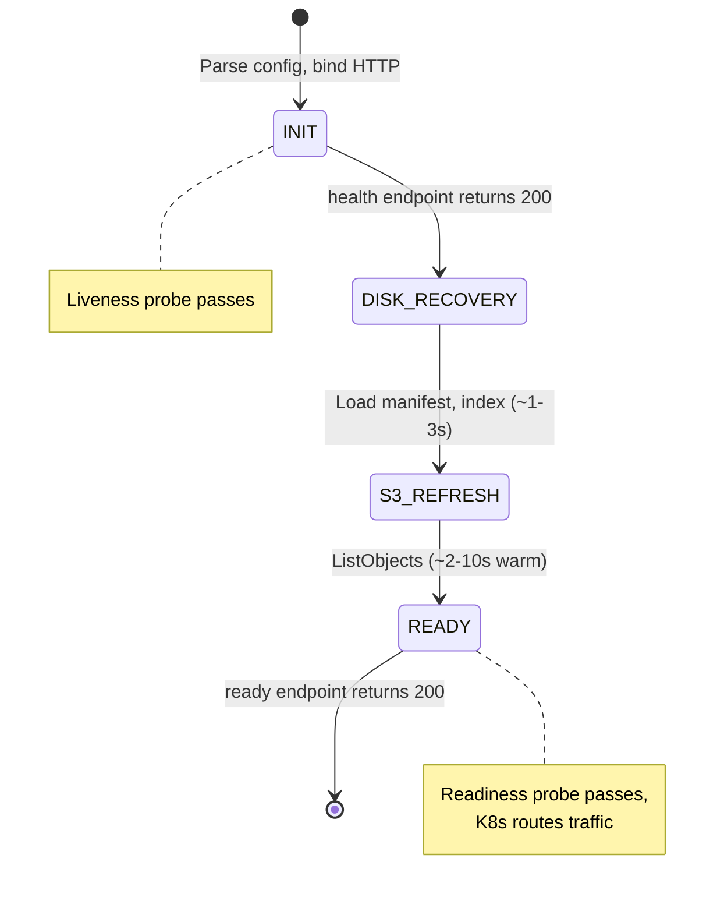
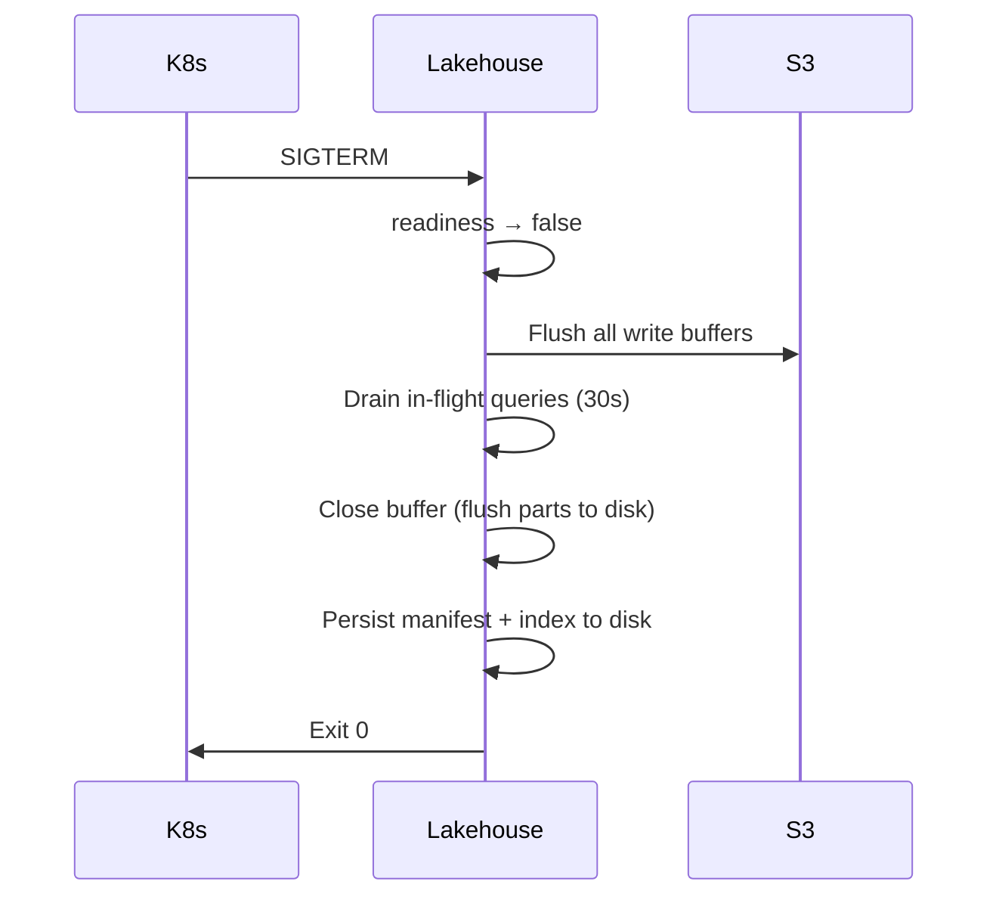
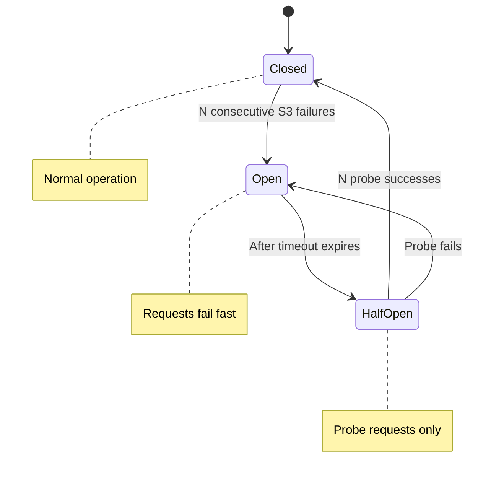

# Operations

## Health Endpoints

| Endpoint | Purpose | Returns 200 |
|---|---|---|
| `/health` | Liveness probe | Always (once HTTP binds) |
| `/ready` | Readiness probe | After startup warmup completes |
| `/lakehouse/info` | Build/config info | Always |
| `/manifest/range` | Data range served | Always |
| `/metrics` | Prometheus metrics | Always |
| `/internal/buffer/query` | Buffer query (insert pods) | When insert role enabled |

## Startup Behavior

Victoria Lakehouse goes through 4 phases on startup:



1. **INIT** — parse config, bind HTTP port. `/health` returns 200.
2. **DISK_RECOVERY** — load persisted manifest, label index, and footers from disk (~1-3s warm, N/A cold).
3. **S3_REFRESH** — incremental S3 ListObjects for new files since last persist (~2-10s warm, 30-60s cold).
4. **READY** — `/ready` returns 200. Kubernetes routes traffic.

Monitor: `lakehouse_startup_phase` gauge, `lakehouse_startup_total_seconds` gauge.

### Early Serving

Set `--lakehouse.startup.serve-stale=true` to serve from persisted cache (Phase 1) before S3 refresh completes. Queries may return slightly stale results until refresh finishes.

### Warmup Safety Valve

`--lakehouse.startup.max-warmup-time=5m` aborts warmup and goes ready with whatever was loaded. Background refresh continues.

## Write Path Operations

### Buffer durability (no WAL)

There is no lakehouse WAL. With `--lakehouse.insert.buffer-engine=logstore` the
insert buffer persists rows as on-disk parts and re-flushes any uncommitted
window on restart (see [Persistence & Durability](durability.md)). Operators
should monitor:
- **Buffer dir**: `--lakehouse.insert.buffer-dir` must be on durable storage (not tmpfs) — it is the crash-recovery substrate.
- **Retention vs flush cap**: `--lakehouse.insert.buffer-retention` must stay `>= 4x --lakehouse.insert.buffer-flush-interval` (enforced at startup) so un-flushed rows survive a linger window plus restart downtime.
- **Restore on start**: check logs for buffer-restore + the `/ready` readiness gate clearing before the pod takes traffic.

### Buffer Query Bridge

When running separate insert and select pods:
- Select pods discover insert pods via `--lakehouse.select.insert-headless-service`
- Buffer query timeout is configurable via `--lakehouse.select.buffer-query-timeout` (default 2s)
- Endpoint errors are silently ignored — degraded to S3-only results rather than failing the query

### Flush Pipeline

- **Periodic flush**: every `--lakehouse.insert.flush-interval` (default 10s)
- **Adaptive flush**: when per-partition estimate reaches `--lakehouse.insert.target-file-size` (default 128MB)
- **Graceful shutdown flush**: all buffers flushed before process exit (preStop hook)

## Graceful Shutdown



On SIGTERM:
1. Stop accepting new queries (readiness -> false)
2. Flush all pending write buffers to S3
3. Drain in-flight queries (30s timeout)
4. Close the insert buffer (flush its parts to disk; any un-flushed window re-flushes on restart from the persisted watermark)
5. Persist manifest, label index, peer ring to disk
6. Close S3 and peer connections
7. Exit

Set `terminationGracePeriodSeconds: 60` in Kubernetes (30s drain + 30s persist).

## Cache Management

### L1 Memory Cache

- Stores footers (~1KB), bloom filters (~10KB), hot pages
- LRU eviction at `--lakehouse.cache.memory-limit`
- Monitor: `lakehouse_cache_memory_bytes` vs `lakehouse_cache_memory_limit_bytes`

### L2 Disk Cache

- Stores full Parquet files from S3
- LRU eviction at `--lakehouse.cache.eviction-watermark` (default 80%) of disk limit
- Monitor: `lakehouse_cache_disk_bytes` vs `lakehouse_cache_disk_limit_bytes`
- Alert: `LakehouseCacheDiskFull` if >95% full

### L3 Peer Cache

- Consistent hash routes keys to peer instances
- Requires headless service and `--lakehouse.peer-auth-key`
- Monitor: `lakehouse_peer_ring_members`, `lakehouse_peer_hits_total`

### Cache Coalescence

`singleflight.Group` ensures only one S3 fetch per cache key, even under concurrent queries for the same data. Monitor: `lakehouse_cache_singleflight_dedup_total`.

## Manifest Refresh

The partition manifest tracks all Parquet files in S3. It refreshes:
- **Polling**: every `--lakehouse.manifest.refresh-interval` (default 5m) via S3 ListObjects
- **SQS** (optional): near-real-time updates from S3 event notifications

Monitor: `lakehouse_manifest_files`, `lakehouse_manifest_refresh_total`, `lakehouse_manifest_sqs_events_total`.

## Hot Boundary Discovery

Victoria Lakehouse polls vlstorage/vtstorage nodes to learn the hot tier's data range:
- Refreshes every `--lakehouse.discovery.refresh-interval` (default 5m)
- Monitor: `lakehouse_discovery_hot_boundary_seconds`, `lakehouse_discovery_hot_boundary_gap_days`
- Alert: `LakehouseHotBoundaryGap` if gap > 1 day between cold and hot data

## Circuit Breaker



S3 failures trigger a circuit breaker:
- **Closed** (normal): requests flow through
- **Open** (after N failures): requests fail fast for `--lakehouse.circuit-breaker.timeout`
- **Half-open**: probe requests; N successes close the breaker

Monitor: `lakehouse_s3_circuit_breaker_state` (0=closed, 1=half-open, 2=open).
Alert: `LakehouseS3CircuitBreakerOpen`.

## Scaling

### Vertical

- **CPU**: driven by Parquet decompression and filter evaluation. 0.5-2 vCPU per instance typical.
- **Memory**: L1 cache + query working set. 512MB-2GB per instance typical.
- **Disk**: L2 cache. Size to hold 2-4 weeks of frequently queried data.

### Horizontal

- Add replicas to increase query throughput
- Peer cache distributes L2 across fleet (3x effective cache)
- Manifest and label index replicated on each instance (lightweight)
- No coordination required between instances

### Sizing Guide

| Dataset | Replicas | CPU/instance | Memory/instance | L2 Disk |
|---|---|---|---|---|
| 100GB S3 | 3 (1/AZ) | 0.5 vCPU | 512MB | 10GB |
| 1TB S3 | 6 (2/AZ) | 1 vCPU | 1GB | 50GB |
| 10TB S3 | 12 (4/AZ) | 2 vCPU | 2GB | 100GB |
| 100TB S3 | 24 (8/AZ) | 2 vCPU | 4GB | 200GB |

## Compaction

### Enabling Compaction

Compaction is disabled by default. Enable it for production deployments:

```bash
lakehouse \
  --lakehouse.compaction.enabled=true \
  --lakehouse.compaction.leader-election=auto \
  --lakehouse.compaction.min-files-l0=10 \
  --lakehouse.compaction.min-files-l1=10
```

Or in YAML:

```yaml
lakehouse:
  compaction:
    enabled: true
    leader_election: auto
    min_files_l0: 10
    min_files_l1: 10
    interval: 5m
    min_age: 1h
```

Compaction is only meaningful when inserts are active. For read-only (select-only) instances, leave compaction disabled.

### Monitoring Compaction

Key metrics to watch:

| Metric | Alert condition |
|---|---|
| `lakehouse_compaction_errors_total` (rate) | Any sustained errors |
| `lakehouse_compaction_level_files{level="0"}` | Should trend down over time |
| `lakehouse_compaction_duration_seconds` (p95) | >60s may indicate S3 saturation |
| `lakehouse_election_leader` | Should be 1 on exactly one instance in the fleet |

### Compaction Hints & Stats

`GET /lakehouse/api/v1/stats/compaction` returns a manifest-derived (no file reads) view of how well-compacted the data is, plus a **prioritized work-list** of partitions worth recompacting first for the best storage win. It is the data behind the UI's compaction panel and the source the manual trigger and the scheduler both act on.

```jsonc
{
  "total_files": 1280, "total_bytes": 53687091200, "total_raw_bytes": 268435456000,
  "compression_ratio": 5.0,
  "total_bloom_bytes": 412876800,                  // footer-bloom footprint across all files
  "bloom_columns": ["service.name", "trace_id", "k8s.node.name", "..."],  // mode's footer bloom set
  "bloom_fp_rate": 0.01,
  "by_level": [
    { "level": 0, "files": 40,  "bytes": 2147483648,  "avg_file_bytes": 53687091, "compression_ratio": 3.1, "configured_zstd": 3,  "bloom_bytes": 16777216 },
    { "level": 2, "files": 900, "bytes": 48318382080, "avg_file_bytes": 53687091, "compression_ratio": 5.4, "configured_zstd": 11, "bloom_bytes": 396099584 }
  ],
  "compacted_bytes": 48318382080,   // >= L2, well rolled-up
  "pending_bytes":   5368709120,    // L0/L1, awaiting rollup
  "stale_schema_files": 12, "stale_schema_bytes": 644245094,
  "fragmented_partitions": 3,
  "estimated_reclaimable_bytes": 1234567890,
  "candidates": [
    {
      "partition": "dt=2026-06-01/hour=00", "files": 4, "max_level": 2,
      "stale_files": 3, "max_level_files": 4,
      "bytes": 214748364, "estimated_savings_bytes": 19327352,
      "estimated_bytes_after": 195421012,        // bytes - estimated_savings
      "next_level": 3, "next_level_zstd": 11,     // what a recompaction would write
      "reasons": ["stale_schema", "fragmented"]
    }
  ]
}
```

A partition becomes a **candidate** when it is `stale_schema` (files written under an older schema fingerprint — they predate the current dedicated-column layout) and/or `fragmented` (two or more files stuck at the top level, which the level policy never re-picks). Candidates are sorted by `estimated_savings_bytes` descending. `configured_zstd` / `next_level_zstd` reflect `compaction.compression_level_by_output_level`, so the panel shows the zstd level already applied and the harder level a recompaction would apply.

`total_bloom_bytes` and per-level `bloom_bytes` report the **footer-bloom footprint** — the on-disk size of the per-row-group skip blooms, captured at write time so the endpoint stays file-read-free; `bloom_columns` is the mode's bloom set and `bloom_fp_rate` the configured false-positive rate. (Files written before the capture landed show `bloom_bytes: 0` and heal as they recompact.) Compaction **retains the combined bloom** of all merged inputs in pmeta, so a compacted file stays file-level bloom-prunable across everything it absorbed — a `trace_id` lookup can still skip it.

The scheduler consumes these hints automatically: on each scan it recompacts stale/fragmented partitions it owns even when the normal L0/L1 level policy would not pick them.

### Manual Recompaction Trigger

`POST /lakehouse/compaction/recompact` forces recompaction of a single partition now, bypassing the level-policy eligibility gate — for acting on a specific candidate from the stats above.

```bash
curl -XPOST http://<instance>:<port>/lakehouse/compaction/recompact \
  -d '{"partition": "dt=2026-06-01/hour=00"}'        # level optional; 0/omitted derives from the hint
```

```jsonc
{ "partition": "dt=2026-06-01/hour=00", "output_level": 3,
  "input_files": 4, "output_files": 1, "rows_merged": 1048576, "bytes_written": 195421012 }
```

It runs the **same merge path** as a scheduled compaction (synchronously) and honors **HRW partition ownership**: an instance that does not own the partition returns `403` naming the owner, so in a fleet two pods never both rewrite the same partition — POST to any instance and it forwards/rejects based on ownership. Responses:

| Status | Cause |
|---|---|
| `200` | Recompacted; body carries the result |
| `400` | Missing/invalid `partition`, or fewer than two compactable files (nothing to merge) |
| `403` | This instance is not the HRW owner of the partition (body names the owner) |
| `503` | Compaction is disabled on this instance |

### Leader Election Troubleshooting

**K8s mode — "not becoming leader"**

1. Check that the Helm chart RBAC was applied: the ServiceAccount needs `get/create/update` on `leases.coordination.k8s.io`.
2. Check `lakehouse_election_transitions_total` — transitions should occur when pods restart.
3. Increase `--lakehouse.compaction.lease-duration` if instances are losing leadership due to transient API server latency.

**S3 mode — lock not being released after crash**

The lock TTL (`--lakehouse.compaction.s3-lock-ttl`, default 60s) controls when a stale lock may be stolen. After a crash, the next instance will take over within one TTL. To recover faster, reduce the TTL or manually delete the lock file `{prefix}.election-lock`.

**`none` mode — multiple instances all compact**

This is expected for `none` mode. Only use `none` for single-instance deployments. For fleets, use `auto`, `k8s`, or `s3`.

## Deletion Operations

### Tombstone Management

Tombstones are persisted to disk and S3. On startup, the store loads from disk first, then syncs from S3 for cluster-wide consistency.

**Key metrics:**
- `lakehouse_delete_tombstones_active` — active tombstones in memory
- `lakehouse_delete_tombstones_total` — lifetime tombstones created
- `lakehouse_delete_rows_suppressed_total` — rows filtered at query time
- `lakehouse_delete_rewrite_total` — physical rewrites completed
- `lakehouse_delete_rewrite_skipped_glacier_total` — rewrites skipped due to storage class

**Configuration:**

```yaml
lakehouse:
  delete:
    enabled: true
    default_mode: auto
    auto_rewrite_classes: [STANDARD]
    rewrite_delay: 1h
    rewrite_batch_size: 50
    rewrite_max_concurrent: 2
    persist_path: /data/lakehouse/tombstones
    cost_warning_threshold: 10.0
    verify_interval: 6h
    lifecycle_rules: []
```

### Background Rewriter

The rewriter processes tombstones with mode `permanent` or `auto` against S3 Standard files:

1. Scans active tombstones past `rewrite_delay`
2. Checks file storage class (HeadObject or lifecycle prediction)
3. Skips non-Standard files (Glacier, IA) — tombstone-only suppression
4. Downloads, filters rows, rewrites, uploads replacement, updates manifest
5. Marks tombstone as reaped once all affected files are processed

**Rewriter is mode-aware**: uses `schema.LogRow` for logs mode, `schema.TraceRow` for traces mode.

### Un-Delete (Restoring Data)

Remove a tombstone to restore data visibility:

```bash
curl -X DELETE http://lakehouse:9428/delete/logsql/tombstone/{id}
```

If the file has not been physically rewritten yet, the original data becomes visible again immediately. If already rewritten, the rows are permanently gone.

### Cost Estimation Before Delete

Always estimate before large deletes:

```bash
curl -X POST 'http://lakehouse:9428/delete/logsql/estimate?query=service.name:="leaked"&start=2025-01-01&end=2025-06-01'
```

Response includes per-storage-class file counts and estimated rewrite costs. Use `mode=hide` to avoid any physical rewrites if cost is too high.

### Verify Endpoint

After deletion, verify data is suppressed:

```bash
curl -X POST 'http://lakehouse:9428/delete/logsql/verify?query=service.name:="leaked"&start=2025-01-01&end=2025-06-01'
```

Normal mode (default): runs the query through the normal read path — if results are empty, deletion is working. Deep mode (`mode=deep`): scans affected files directly for compliance auditing.

## Troubleshooting

### Queries return empty when data exists

1. Check manifest: `curl /manifest/range` — does the time range overlap?
2. Check hot boundary: `lakehouse_discovery_hot_boundary_seconds` — is it suppressing your data?
3. Check S3 access: `lakehouse_s3_errors_total` for permission/connectivity issues
4. Check circuit breaker: `lakehouse_s3_circuit_breaker_state` — is it open?

### High query latency

1. Check cache hit rates: `lakehouse_cache_hit_ratio` by tier
2. Check S3 latency: `lakehouse_s3_request_duration_seconds`
3. Check row group skip rate: `lakehouse_parquet_row_groups_skipped_total` — low skip rate means queries scan too much data
4. Check query concurrency: `lakehouse_concurrent_select_current` vs `_capacity`

### Startup takes too long

1. Check startup phase: `lakehouse_startup_phase`
2. For cold start: full S3 ListObjects can take 30-60s with large datasets
3. Enable `--lakehouse.startup.serve-stale=true` for faster readiness
4. Reduce `--lakehouse.startup.warmup-window` to warm fewer partitions
5. Set `--lakehouse.startup.max-warmup-time` as safety valve

### Insert returns 503

1. Check `CanWriteData()` — S3 connectivity issue, or the buffer is at its disk/retention ceiling
2. If the buffer is backpressured: the flush pipeline may be stalled (check S3 write errors)
3. Investigate S3 permissions/latency, or raise `--lakehouse.insert.buffer-retention` (keeping `>= 4x buffer-flush-interval`)

### Recently ingested data not visible in queries

1. Check flush interval: data is visible in S3 after `--lakehouse.insert.flush-interval`
2. If buffer query bridge is enabled, data should be visible immediately via insert pod buffers
3. Check `--lakehouse.select.buffer-query-enabled` is `true`
4. Check `--lakehouse.select.insert-headless-service` resolves to insert pods
5. Check buffer query timeout: `--lakehouse.select.buffer-query-timeout` (default 2s)

### After a restart, recent data is briefly missing then reappears

1. On restart the `logstore` buffer restores its on-disk parts and the flusher re-flushes `(watermark, now-offset]` — recent rows are served from the restored buffer via the read-merge while that completes.
2. If a row is permanently missing after a crash, check that `--lakehouse.insert.buffer-dir` is a durable volume (not tmpfs) and that `buffer-retention >= 4x buffer-flush-interval`.
3. See [Persistence & Durability](durability.md) for the crash-recovery model.
