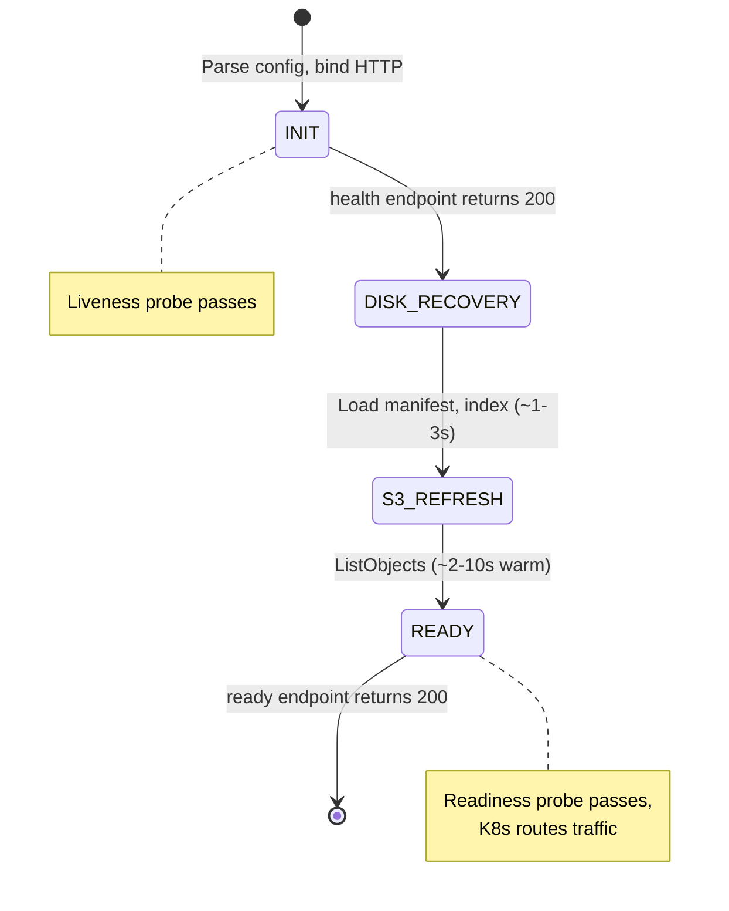
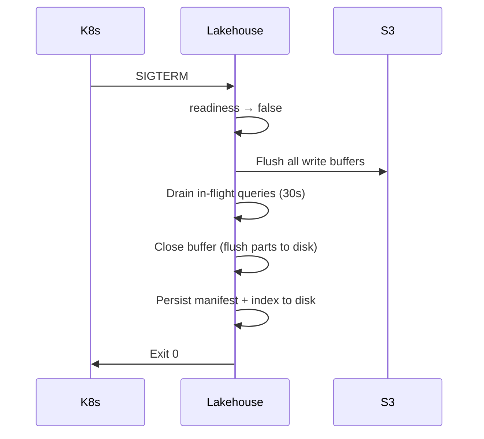
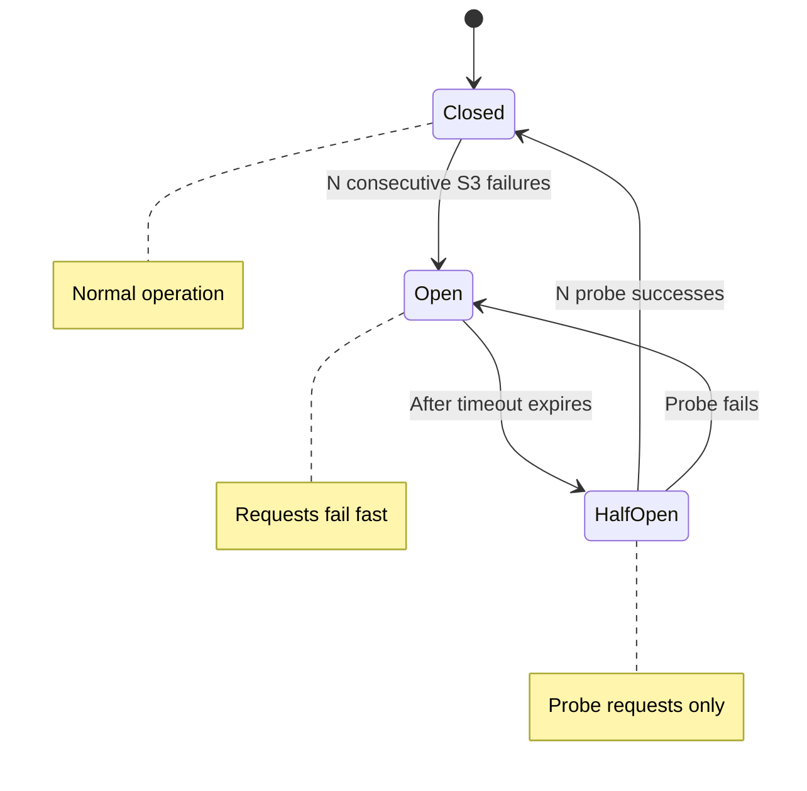

# Operations

## Health Endpoints

| Endpoint | Purpose | Returns 200 |
|---|---|---|
| `/health` | Liveness probe | Always (once HTTP binds) |
| `/ready` | Readiness probe | After startup warmup completes |
| `/lakehouse/info` | Build/config info | Always |
| `/manifest/range` | Data range served | Always |
| `/metrics` | Prometheus metrics | Always |
| `/internal/buffer/query` | Buffer query (insert pods) | When insert role enabled |

## Startup Behavior

Victoria Lakehouse goes through 4 phases on startup:


```mermaid
stateDiagram-v2
    [*] --> INIT: Parse config, bind HTTP
    INIT --> DISK_RECOVERY: health endpoint returns 200
    DISK_RECOVERY --> S3_REFRESH: Load manifest, index (~1-3s)
    S3_REFRESH --> READY: ListObjects (~2-10s warm)
    READY --> [*]: ready endpoint returns 200

    note right of INIT: Liveness probe passes
    note right of READY: Readiness probe passes,<br/>K8s routes traffic
```

1. **INIT** — parse config, bind HTTP port. `/health` returns 200.
2. **DISK_RECOVERY** — load persisted manifest, label index, and footers from disk (~1-3s warm, N/A cold).
3. **S3_REFRESH** — incremental S3 ListObjects for new files since last persist (~2-10s warm, 30-60s cold).
4. **READY** — `/ready` returns 200. Kubernetes routes traffic.

Monitor: `lakehouse_startup_phase` gauge, `lakehouse_startup_total_seconds` gauge.

### Early Serving

Set `--lakehouse.startup.serve-stale=true` to serve from persisted cache (Phase 1) before S3 refresh completes. Queries may return slightly stale results until refresh finishes.

### Warmup Safety Valve

`--lakehouse.startup.max-warmup-time=5m` aborts warmup and goes ready with whatever was loaded. Background refresh continues.

## Write Path Operations

### Buffer durability (no WAL)

There is no lakehouse WAL. With `--lakehouse.insert.buffer-engine=logstore` the
insert buffer persists rows as on-disk parts and re-flushes any uncommitted
window on restart (see [Persistence & Durability](durability.md)). Operators
should monitor:
- **Buffer dir**: `--lakehouse.insert.buffer-dir` must be on durable storage (not tmpfs) — it is the crash-recovery substrate.
- **Retention vs flush cap**: `--lakehouse.insert.buffer-retention` must stay `>= 4x --lakehouse.insert.buffer-flush-interval` (enforced at startup) so un-flushed rows survive a linger window plus restart downtime.
- **Restore on start**: check logs for buffer-restore + the `/ready` readiness gate clearing before the pod takes traffic.

### Buffer Query Bridge

When running separate insert and select pods:
- Select pods discover insert pods via `--lakehouse.select.insert-headless-service`
- Buffer query timeout is configurable via `--lakehouse.select.buffer-query-timeout` (default 2s)
- Endpoint errors are silently ignored — degraded to S3-only results rather than failing the query

### Flush Pipeline

- **Periodic flush**: every `--lakehouse.insert.flush-interval` (default 10s)
- **Adaptive flush**: when per-partition estimate reaches `--lakehouse.insert.target-file-size` (default 128MB)
- **Graceful shutdown flush**: all buffers flushed before process exit (preStop hook)

## Graceful Shutdown


```mermaid
sequenceDiagram
    participant K8s
    participant Lakehouse
    participant S3

    K8s->>Lakehouse: SIGTERM
    Lakehouse->>Lakehouse: readiness → false
    Lakehouse->>S3: Flush all write buffers
    Lakehouse->>Lakehouse: Drain in-flight queries (30s)
    Lakehouse->>Lakehouse: Close buffer (flush parts to disk)
    Lakehouse->>Lakehouse: Persist manifest + index to disk
    Lakehouse->>K8s: Exit 0
```

On SIGTERM:
1. Stop accepting new queries (readiness -> false)
2. Flush all pending write buffers to S3
3. Drain in-flight queries (30s timeout)
4. Close the insert buffer (flush its parts to disk; any un-flushed window re-flushes on restart from the persisted watermark)
5. Persist manifest, label index, peer ring to disk
6. Close S3 and peer connections
7. Exit

Set `terminationGracePeriodSeconds: 60` in Kubernetes (30s drain + 30s persist).

## Cache Management

### L1 Memory Cache

- Stores footers (~1KB), bloom filters (~10KB), hot pages
- LRU eviction at `--lakehouse.cache.memory-limit`
- Monitor: `lakehouse_cache_memory_bytes` vs `lakehouse_cache_memory_limit_bytes`

### L2 Disk Cache

- Stores full Parquet files from S3
- LRU eviction at `--lakehouse.cache.eviction-watermark` (default 80%) of disk limit
- Monitor: `lakehouse_cache_disk_bytes` vs `lakehouse_cache_disk_limit_bytes`
- Alert: `LakehouseCacheDiskFull` if >95% full

### L3 Peer Cache

- Consistent hash routes keys to peer instances
- Requires headless service and `--lakehouse.peer-auth-key`
- Monitor: `lakehouse_peer_ring_members`, `lakehouse_peer_hits_total`

### Cache Coalescence

`singleflight.Group` ensures only one S3 fetch per cache key, even under concurrent queries for the same data. Monitor: `lakehouse_cache_singleflight_dedup_total`.

## Manifest Refresh

The partition manifest tracks all Parquet files in S3. It refreshes:
- **Polling**: every `--lakehouse.manifest.refresh-interval` (default 5m) via S3 ListObjects
- **SQS** (optional): near-real-time updates from S3 event notifications

Monitor: `lakehouse_manifest_files`, `lakehouse_manifest_refresh_total`, `lakehouse_manifest_sqs_events_total`.

## Hot Boundary Discovery

Victoria Lakehouse polls vlstorage/vtstorage nodes to learn the hot tier's data range:
- Refreshes every `--lakehouse.discovery.refresh-interval` (default 5m)
- Monitor: `lakehouse_discovery_hot_boundary_seconds`, `lakehouse_discovery_hot_boundary_gap_days`
- Alert: `LakehouseHotBoundaryGap` if gap > 1 day between cold and hot data

## Circuit Breaker


```mermaid
stateDiagram-v2
    [*] --> Closed
    Closed --> Open: N consecutive S3 failures
    Open --> HalfOpen: After timeout expires
    HalfOpen --> Closed: N probe successes
    HalfOpen --> Open: Probe fails

    note right of Closed: Normal operation
    note right of Open: Requests fail fast
    note right of HalfOpen: Probe requests only
```

S3 failures trigger a circuit breaker:
- **Closed** (normal): requests flow through
- **Open** (after N failures): requests fail fast for `--lakehouse.circuit-breaker.timeout`
- **Half-open**: probe requests; N successes close the breaker

Monitor: `lakehouse_s3_circuit_breaker_state` (0=closed, 1=half-open, 2=open).
Alert: `LakehouseS3CircuitBreakerOpen`.

## Scaling

### Vertical

- **CPU**: driven by Parquet decompression and filter evaluation. 0.5-2 vCPU per instance typical.
- **Memory**: L1 cache + query working set. 512MB-2GB per instance typical.
- **Disk**: L2 cache. Size to hold 2-4 weeks of frequently queried data.

### Horizontal

- Add replicas to increase query throughput
- Peer cache distributes L2 across fleet (3x effective cache)
- Manifest and label index replicated on each instance (lightweight)
- No coordination required between instances

### Sizing Guide

| Dataset | Replicas | CPU/instance | Memory/instance | L2 Disk |
|---|---|---|---|---|
| 100GB S3 | 3 (1/AZ) | 0.5 vCPU | 512MB | 10GB |
| 1TB S3 | 6 (2/AZ) | 1 vCPU | 1GB | 50GB |
| 10TB S3 | 12 (4/AZ) | 2 vCPU | 2GB | 100GB |
| 100TB S3 | 24 (8/AZ) | 2 vCPU | 4GB | 200GB |

## Compaction

### Enabling Compaction

Compaction is disabled by default. Enable it for production deployments:

```bash
lakehouse \
  --lakehouse.compaction.enabled=true \
  --lakehouse.compaction.leader-election=auto \
  --lakehouse.compaction.min-files-l0=10 \
  --lakehouse.compaction.min-files-l1=10
```

Or in YAML:

```yaml
lakehouse:
  compaction:
    enabled: true
    leader_election: auto
    min_files_l0: 10
    min_files_l1: 10
    interval: 5m
    min_age: 1h
```

Compaction is only meaningful when inserts are active. For read-only (select-only) instances, leave compaction disabled.

### Monitoring Compaction

Key metrics to watch:

| Metric | Alert condition |
|---|---|
| `lakehouse_compaction_errors_total` (rate) | Any sustained errors |
| `lakehouse_compaction_level_files{level="0"}` | Should trend down over time |
| `lakehouse_compaction_duration_seconds` (p95) | >60s may indicate S3 saturation |
| `lakehouse_election_leader` | Should be 1 on exactly one instance in the fleet |

### Compaction Hints & Stats

`GET /lakehouse/api/v1/stats/compaction` returns a manifest-derived (no file reads) view of how well-compacted the data is, plus a **prioritized work-list** of partitions worth recompacting first for the best storage win. It is the data behind the UI's compaction panel and the source the manual trigger and the scheduler both act on.

```jsonc
{
  "total_files": 1280, "total_bytes": 53687091200, "total_raw_bytes": 268435456000,
  "compression_ratio": 5.0,
  "total_bloom_bytes": 412876800,                  // footer-bloom footprint across all files
  "bloom_columns": ["service.name", "trace_id", "k8s.node.name", "..."],  // mode's footer bloom set
  "bloom_fp_rate": 0.01,
  "by_level": [
    { "level": 0, "files": 40,  "bytes": 2147483648,  "avg_file_bytes": 53687091, "compression_ratio": 3.1, "configured_zstd": 3,  "bloom_bytes": 16777216 },
    { "level": 2, "files": 900, "bytes": 48318382080, "avg_file_bytes": 53687091, "compression_ratio": 5.4, "configured_zstd": 11, "bloom_bytes": 396099584 }
  ],
  "compacted_bytes": 48318382080,   // >= L2, well rolled-up
  "pending_bytes":   5368709120,    // L0/L1, awaiting rollup
  "stale_schema_files": 12, "stale_schema_bytes": 644245094,
  "fragmented_partitions": 3,
  "estimated_reclaimable_bytes": 1234567890,
  "candidates": [
    {
      "partition": "dt=2026-06-01/hour=00", "files": 4, "max_level": 2,
      "stale_files": 3, "max_level_files": 4,
      "bytes": 214748364, "estimated_savings_bytes": 19327352,
      "estimated_bytes_after": 195421012,        // bytes - estimated_savings
      "next_level": 3, "next_level_zstd": 11,     // what a recompaction would write
      "reasons": ["stale_schema", "fragmented"]
    }
  ]
}
```

A partition becomes a **candidate** when it is `stale_schema` (files written under an older schema fingerprint — they predate the current dedicated-column layout) and/or `fragmented` (two or more files stuck at the top level, which the level policy never re-picks). Candidates are sorted by `estimated_savings_bytes` descending. `configured_zstd` / `next_level_zstd` reflect `compaction.compression_level_by_output_level`, so the panel shows the zstd level already applied and the harder level a recompaction would apply.

`total_bloom_bytes` and per-level `bloom_bytes` report the **footer-bloom footprint** — the on-disk size of the per-row-group skip blooms, captured at write time so the endpoint stays file-read-free; `bloom_columns` is the mode's bloom set and `bloom_fp_rate` the configured false-positive rate. (Files written before the capture landed show `bloom_bytes: 0` and heal as they recompact.) Compaction **retains the combined bloom** of all merged inputs in pmeta, so a compacted file stays file-level bloom-prunable across everything it absorbed — a `trace_id` lookup can still skip it.

The scheduler consumes these hints automatically: on each scan it recompacts stale/fragmented partitions it owns even when the normal L0/L1 level policy would not pick them.

### Manual Recompaction Trigger

`POST /lakehouse/compaction/recompact` forces recompaction of a single partition now, bypassing the level-policy eligibility gate — for acting on a specific candidate from the stats above.

```bash
curl -XPOST http://<instance>:<port>/lakehouse/compaction/recompact \
  -d '{"partition": "dt=2026-06-01/hour=00"}'        # level optional; 0/omitted derives from the hint
```

```jsonc
{ "partition": "dt=2026-06-01/hour=00", "output_level": 3,
  "input_files": 4, "output_files": 1, "rows_merged": 1048576, "bytes_written": 195421012 }
```

It runs the **same merge path** as a scheduled compaction (synchronously) and honors **HRW partition ownership**: an instance that does not own the partition returns `403` naming the owner, so in a fleet two pods never both rewrite the same partition — POST to any instance and it forwards/rejects based on ownership. Responses:

| Status | Cause |
|---|---|
| `200` | Recompacted; body carries the result |
| `400` | Missing/invalid `partition`, or fewer than two compactable files (nothing to merge) |
| `403` | This instance is not the HRW owner of the partition (body names the owner) |
| `503` | Compaction is disabled on this instance |

### Leader Election Troubleshooting

**K8s mode — "not becoming leader"**

1. Check that the Helm chart RBAC was applied: the ServiceAccount needs `get/create/update` on `leases.coordination.k8s.io`.
2. Check `lakehouse_election_transitions_total` — transitions should occur when pods restart.
3. Increase `--lakehouse.compaction.lease-duration` if instances are losing leadership due to transient API server latency.

**S3 mode — lock not being released after crash**

The lock TTL (`--lakehouse.compaction.s3-lock-ttl`, default 60s) controls when a stale lock may be stolen. After a crash, the next instance will take over within one TTL. To recover faster, reduce the TTL or manually delete the lock file `{prefix}.election-lock`.

**`none` mode — multiple instances all compact**

This is expected for `none` mode. Only use `none` for single-instance deployments. For fleets, use `auto`, `k8s`, or `s3`.

## Deletion Operations

### Tombstone Management

**Durability guarantee.** Every tombstone mutation — create, un-delete, and the
retirement of a fully rewritten tombstone — is written through to durable
storage before the API call returns:

- the **local disk copy** (`{persist_path}/tombstones.json`, written to a
  temporary file and renamed) is written synchronously, so a `SIGKILL`
  immediately after the delete API returns cannot lose the record;
- the **S3 copy** (`{prefix}_tombstones/{id}.json`, where `{prefix}` is the
  deployment's S3 prefix — `s3.prefix`, or else the default tenant prefix plus
  the signal, e.g. `logs/`) is attempted in the same call. Tombstones are not
  stored per tenant: in multi-tenant mode every tenant's tombstones live under
  the one prefix (typically `logs/_tombstones/` or `traces/_tombstones/`). If S3 is unavailable the record is queued,
  `lakehouse_delete_tombstone_persist_pending` rises above zero, and the write
  is retried on the next mutation, on every rewrite-scheduler tick, and at
  shutdown. The disk copy is authoritative for that node in the meantime.

Nothing about durability depends on a graceful shutdown.

**Startup** restores the **union** of the disk and S3 copies; neither source
replaces the other. When the two disagree about the same tombstone, the merge
never walks progress back: a key recorded as rewritten anywhere is rewritten
everywhere (the file it named is gone), and the files each copy lists as
pending are combined, so neither copy's discoveries are lost. A single
unreadable S3 object is skipped and counted rather than aborting the restore.

Immediately after the manifest is restored, a **self-check** compares the two
and logs plus counts every disagreement under
`lakehouse_delete_startup_inconsistencies_total{kind=...}`:

| kind | meaning | consequence |
|------|---------|-------------|
| `persistence_disabled` | the store has no durable target | deletes are lost on an ungraceful restart |
| `s3_restore_failed` | the S3 copy of the store could not be read (LIST or an object) | **deletes made on other nodes are not enforced here** and no interrupted rewrite is resolved or tombstone retired until it succeeds; retried every minute and on every rewrite pass (`lakehouse_delete_tombstone_restore_pending`) |
| `reaped_key_still_manifested` | a key the tombstone records as gone is one the manifest still serves — another node's record, or a rewrite that was undone | the key is put back on the tombstone's work list and rewritten again; rows stay hidden by the query filter meanwhile |
| `pending_key_missing_from_manifest` | the manifest snapshot does not list a key the tombstone still has work for | nothing is inferred from it: the scheduler waits for a bucket listing in this process (and, for a key an undo restored, for a listing that began after the undo) before treating the object as gone |
| `removed_tombstone_still_in_s3` | an un-deleted or retired tombstone's S3 copy survived a crash | the stale copy is ignored and its delete re-issued (see *Un-Delete*) |
| `unreadable_tombstone_object` | an object under `_tombstones/` could not be parsed | that one record was skipped |

Before the self-check, every **interrupted rewrite** is resolved against the
restored manifest (see *Background Rewriter*), counted as
`lakehouse_delete_rewrite_interrupted_total{outcome="undone"|"published"|"discarded"}`.

Findings are reported, not repaired: every repair is a data movement that
belongs to the rewrite scheduler's normal retry path.

**Key metrics:**
- `lakehouse_delete_tombstones_active` — active tombstones in memory
- `lakehouse_delete_tombstones_total` — lifetime tombstones created
- `lakehouse_delete_tombstones_completed_total` — tombstones retired because every file they covered has been rewritten
- `lakehouse_delete_rows_suppressed_total` — rows filtered at query time
- `lakehouse_delete_rewrite_total` — physical rewrites completed
- `lakehouse_delete_rewrite_manifest_updated_total` — rewrites published into the manifest
- `lakehouse_delete_rewrite_manifest_errors_total` — manifest hand-offs that failed; the rewrite is retried and the superseded object is **not** deleted
- `lakehouse_delete_rewrite_skipped_no_manifest_total` — rewrites refused because no manifest was wired in (see below)
- `lakehouse_delete_rewrite_superseded_total` — rewrites discarded because a concurrent compaction merged their source first; the tombstone follows the rows
- `lakehouse_delete_tombstone_keys_discovered_total` — files added to a tombstone's work list because they overlap its range (compaction outputs carrying its rows, late files)
- `lakehouse_delete_catalog_rebuilds_total{result}` — pmeta field-catalog value rebuilds after rows were removed
- `lakehouse_compaction_publish_conflicts_total` — compactions abandoned at publish because a source was replaced mid-merge
- `lakehouse_delete_rewrite_old_object_errors_total` — deletes of superseded objects that failed after a successful publish; the rewrite's record and the object's retirement in the manifest stay until a later pass deletes it, and the tombstone does not retire before that
- `lakehouse_delete_rewrite_abandoned_object_errors_total` — deletes of replacements whose publish was refused or failed; retried the same way
- `lakehouse_delete_rewrite_interrupted_total{outcome}` — rewrites found unfinished (after a crash) and how they were resolved
- `lakehouse_manifest_retired_keys`, `lakehouse_manifest_refresh_skipped_total{reason}`, `lakehouse_manifest_retired_evicted_total{reason}`, `lakehouse_manifest_retired_reclaimed_total` / `..._reclaim_errors_total` — objects the manifest refresh keeps out while their deletes are outstanding (see [Manifest System → What the refresh does not adopt](manifest-system.md#what-the-refresh-does-not-adopt))
- `lakehouse_delete_rewrite_skipped_glacier_total` — rewrites skipped due to storage class
- `lakehouse_delete_tombstone_persist_total{target="disk"|"s3"}` / `..._errors_total` — durability writes
- `lakehouse_delete_tombstone_persist_pending` — records whose S3 copy is behind; steady state 0
- `lakehouse_delete_tombstone_not_durable_total` — steps that could not proceed because the change authorising them was not durable yet; the objects are kept and the next pass retries
- `lakehouse_delete_rewrite_deferred_total{reason="not_durable"|"unlisted"|"awaiting_listing"|"restore_pending"}` — rewrite work postponed rather than done, by why
- `lakehouse_delete_rewrites_unfinished` — rewrite records whose objects are not settled yet; **drain to 0 before rolling back** (see *Rolling back*)
- `lakehouse_delete_tombstone_restore_pending` / `lakehouse_delete_tombstone_restore_attempts_total{result="failed"|"recovered"}` — whether this node has read the S3 copy of the store, and the retries
- `lakehouse_delete_rewrite_key_collisions_total`, `lakehouse_manifest_key_claim_rejected_total{reason}` — object keys that were already in use and had to be redrawn; a sustained rate means something other than chance is generating them
- `lakehouse_manifest_held_keys` — replacements another publish may not supersede yet (their swap is not durable)
- `lakehouse_manifest_retired_delete_owed` — how much of the retired set is this process's own outstanding deletes
- `lakehouse_manifest_retired_delete_landed` — the part whose objects are already deleted, held only until a bucket listing older than the delete can no longer be applied; it should drain at every refresh, so a value that keeps climbing means refreshes are not being accepted
- `lakehouse_manifest_retired_settled_total` — retired keys an accepted listing proved gone. This is the drain signal: on a node compacting faster than it refreshes the gauge above never reads zero even while draining perfectly, so alert on this counter standing still, not on the gauge being non-zero
- `lakehouse_delete_tombstone_removed_markers_evicted_total` — removed-tombstone markers dropped by their TTL or cap (never while their S3 delete is owed)
- `lakehouse_delete_compaction_rows_removed_total` / `lakehouse_delete_compaction_keys_reaped_total` — rows and source keys compaction reaped
- `lakehouse_delete_fields_scan_fallback_total{endpoint=...}` — requests that gave up a fast path a tombstone cannot be applied to because one overlapped: metadata-only field enumeration (`field_names`, `field_values`, `streams`, `stream_ids`) and the pure-buffer aggregate path (`pure_buffer`)

**Alert on** a sustained non-zero `lakehouse_delete_tombstone_persist_pending`
(only the local disk copy would survive a pod move), on any increase in
`lakehouse_delete_rewrite_manifest_errors_total`, on superseded or abandoned
objects whose deletes keep failing, on a retired key evicted by its size bound
(`lakehouse_manifest_retired_evicted_total{reason!="ttl"}`, and critically on
`reason="cap_delete_owed"` and `reason="cap_delete_landed"`), on `lakehouse_delete_tombstone_restore_pending`
(this node is not enforcing other nodes' deletes), on
`lakehouse_delete_tombstone_not_durable_total` and on
`lakehouse_delete_rewrites_unfinished` staying above zero for hours — all ship
as rules in `alerts/alerts-lakehouse.yml`, and all of them name
`GET {prefix}/leftovers` as the way to see what is outstanding.

### What this instance still owes: `{prefix}/leftovers`

```bash
curl 'http://lakehouse:9428/delete/logsql/leftovers'        # traces: /delete/tracessql/leftovers
curl 'http://lakehouse:9428/delete/logsql/leftovers?limit=50'
```

A read-only listing of everything this instance is holding on to, which is what
the alerts above tell an operator to look at:

- `retired_keys` — objects the manifest has stopped serving. `delete_owed: true`
  means this process superseded the object and owes its deletion;
  `deleted: true` means the object is already gone and the entry is held only
  so a bucket listing that began before the delete cannot adopt it back (it
  clears at the next refresh); `replaced_by` names the file that took its
  place.
- `pending_keys` — uploads claimed but not published. `held: true` means a
  replacement whose swap is not durable yet, which compaction may not merge.
- `unfinished_rewrites` — the durable rewrite records, with `state`
  (`prepared`, `published` or `discarded`) and the objects each one names.
- `counts`, plus `truncated`/`limit`: the lists are capped (default 1000
  entries, maximum 10000) while the counts are always the full totals.
- `tombstone_store` — whether write-through persistence is armed, how many
  records are owed to S3, and whether the S3 restore is still pending.

It is **instance-wide, not tenant-scoped** (`"scope": "instance"` in the
payload) — like the tombstone listing next to it, because tombstones and the
retired/pending sets are per instance, not per tenant. Treat it as an operator
endpoint. It is read-only: nothing here deletes or repairs anything, because
every repair is a data movement that belongs to the scheduler's retry path.

### Rolling back

Upgrading is safe in one direction only, and the difference matters when a
rewrite is in flight:

- **Old files, new binary:** this release reads the previous release's
  `tombstones.json` (a bare id → record map) and its `_tombstones/{id}.json`
  objects unchanged. Nothing to do.
- **New files, old binary:** the previous release cannot read this release's
  `tombstones.json` envelope at all (it carries the removed-tombstone markers),
  and the per-id S3 objects it *can* read lose the rewrite records
  (`Superseded`). A rewrite that is half-finished when you roll back is then
  never resolved: a replacement stays unmanifested until the orphan sweep
  reclaims it, or a superseded object keeps its rows.

So before rolling back to a release older than this one:

1. Stop issuing deletes, and wait for `lakehouse_delete_rewrites_unfinished` to
   reach **0** on every instance (`{prefix}/leftovers` shows what is left).
2. Wait for `lakehouse_delete_tombstone_persist_pending` to reach **0**, so
   every record is in S3 — the only copy the old binary will read.
3. Check `lakehouse_manifest_retired_delete_owed` is 0, or delete the listed
   objects yourself: the old binary does not carry the retired set forward in
   its snapshot, and a refresh would serve those objects again.

**Configuration:**

```yaml
lakehouse:
  delete:
    enabled: true
    default_mode: auto
    auto_rewrite_classes: [STANDARD]
    rewrite_delay: 1h
    rewrite_batch_size: 50
    rewrite_max_concurrent: 2
    persist_path: /data/lakehouse/tombstones
    cost_warning_threshold: 10.0
    verify_interval: 6h
    lifecycle_rules: []
```

### Background Rewriter

The rewriter processes tombstones with mode `permanent` or `auto` against S3 Standard files:

1. Scans active tombstones that are **eligible for physical removal** (below)
2. Adds to the tombstone's work list every file that now overlaps its time
   range — not only the files that existed when the delete was issued
3. Checks file storage class (HeadObject or lifecycle prediction) and skips
   non-Standard files (Glacier, IA) — tombstone-only suppression
4. Rewrites each pending file in recorded steps (below), after first settling
   any rewrite an earlier pass or a crashed process left unfinished
5. Re-reads the files overlapping the range once more, and retires the
   tombstone only if every one of them has been handled

**Eligibility — the un-delete window.** A `hide` tombstone is never eligible: it
is reversible by contract, so no path may physically drop its rows. A
`permanent` or `auto` tombstone becomes eligible once `rewrite_delay` has passed
since the delete; until then an operator can still un-delete it and get every
row back. The rewriter and compaction evaluate the same rule
(`Tombstone.EligibleForPhysicalRemoval`), so neither can remove rows the other
would still protect.

**Why the work list is re-read.** A tombstone's affected-file list is a snapshot
from when the delete was issued. Compaction can move the tombstone's rows into a
new file (while the tombstone is inside its un-delete window, or concurrently
with a rewrite pass), and a file can land in the range after the delete.
Retiring on the old snapshot would stop the query-time filter from hiding rows
that were never removed. New entries are counted in
`lakehouse_delete_tombstone_keys_discovered_total`.

Each file goes through a **recorded rewrite**. Before each step that something
later depends on, the rewrite writes its progress onto the tombstone — a durable
record keyed by the source file, persisted like every tombstone change (disk
synchronously, S3 in the same call). The manifest, by contrast, is only as
durable as its last snapshot, so after a crash the record — not the manifest —
says what happened:

| step | what happens | if the process dies here |
|------|--------------|--------------------------|
| record `prepared` | the replacement key is chosen and written onto the tombstone; nothing is uploaded yet | restart **undoes** the rewrite: the replacement key is retired in the manifest (a refresh will not adopt it) and the rewrite runs again |
| upload | the filtered replacement is uploaded under its new key — in the source object's own directory, so a tenant's rows stay under its `{AccountID}/{ProjectID}/<signal>/` prefix; the manifest marks it *pending*, so a manifest refresh in the meantime does not adopt it | same: undone; the replacement object is deleted by the next pass |
| publish | the manifest swaps the old key for the new one in a single atomic step, and retires the old key | still `prepared`: undone — even if a snapshot captured the swap, the swap is reversed and the source is served again; peers, pmeta and the source's delete all wait for the next step, so nothing outside the process saw the replacement |
| record `published` | the publish and the key's bookkeeping (source reaped, replacement clean) are recorded | restart **finishes** the rewrite: the source is retired (a refresh will not re-adopt it) and deleted by the next pass; the replacement is served from the manifest or adopted by the refresh |
| hand-off | pmeta and peers are told | same: finished |
| commit | the superseded object is deleted, then the record is cleared | if the delete failed, the record stays and every later pass retries it; the tombstone does not retire while any record remains |

A publish that is refused or fails records `discarded`, retires the replacement,
and deletes it; a failed delete is retried the same way. A restart resolves
every record before the first manifest refresh runs, so no restart mode — a
snapshot taken at the crash, a snapshot older than the rewrite, or a lost disk
with tombstones restored from S3 — can serve a row twice or lose one.

The superseded object is **never** deleted before the manifest points at its
replacement and that publish is recorded. A manifest hand-off that fails leaves
the key un-reaped, so the next tick retries it. An **un-delete** of a tombstone
with an unfinished rewrite is refused with `409 Conflict` — the record lives on
the tombstone, and removing it mid-rewrite would drop the only trace of a
replacement object; retry once the rewrite settles (seconds, unless deletes are
failing). Stopping a delete task through the VictoriaLogs-compatible delete-task
API removes the same tombstone and is refused the same way, with an error.

**Publishes are conditional.** The swap happens only if the source file is
still registered. If a compaction merged the same file between the rewrite's
read and its publish, the rewrite discards its replacement
(`lakehouse_delete_rewrite_superseded_total`) — registering it would store the
kept rows twice and bring the deleted rows back through the compacted copy — and
the tombstone follows the rows into the compacted output. Compaction's publish
is conditional in the same way: if any of its sources was replaced mid-merge it
abandons its output (`lakehouse_compaction_publish_conflicts_total`) and
re-selects on the next tick.

**A replacement is as prunable as the file it replaces.** The rewriter writes
with the compactor's writer: the same zstd level, the SBBF column blooms that
external Parquet readers use, the Tier-2 slot binding, and for traces a
`_trace_idx` footer index recomputed for the spans that survive. Row count, time
bounds, raw and per-column sizes, label sets and label aggregates are recomputed
from the kept rows; the manifest serves several of those without opening the
file, so inheriting any of them would keep reporting deleted rows.

**Publishing reaches pmeta and peers.** After the manifest swap and before the
superseded object is deleted, the rewrite is handed to the same consumers a
compaction output goes to: the pmeta facets (the superseded file's per-file
entries out, the replacement's in) and the peer manifest push. The pmeta field
catalog is additionally rebuilt for the partition, because its value sets are a
union that a row removal cannot shrink; without the rebuild, a value only the
deleted rows carried would reappear in `field_values` once the tombstone
retires. The rebuild also runs when a tombstone retires (covering compaction-
driven removal) and is skipped — counted as
`lakehouse_delete_catalog_rebuilds_total{result="skipped_unlabeled_file"}` — for a
partition containing a file whose manifest entry has no labels, because
replaying it would shrink the catalog to a partial list.

**The rewriter refuses to run without a manifest.** A rewrite that cannot be
published would leave the replacement unmanaged and strand the manifest on a
deleted key. Refusing counts
`lakehouse_delete_rewrite_skipped_no_manifest_total` and leaves the safe state:
the rows are hidden by the query-time filter but not yet removed.

**Compaction is a second reaper.** It already rewrites every row it touches, so
for every tombstone that is eligible for physical removal it drops the matching
rows from the merged output. For tombstones that are not — `hide`, or still
inside the un-delete window — it carries the rows forward untouched. Either
way the tombstone's bookkeeping follows the rows: the merged-away sources are
marked reaped and the output is added to the tombstone's work list, marked done
only if compaction actually filtered that tombstone's rows out of it. A
tombstone can therefore complete because compaction did the work, but never
while a compacted file still holds its rows. Keys under a never-delete prefix
(`_meta/`, `_tombstones/`, `_compaction_lock`) are left alone.

**Rewriter is mode-aware**: uses `schema.LogRow` for logs mode, `schema.TraceRow` for traces mode.

### Where tombstones are applied

| path | behaviour |
|------|-----------|
| log/span query results | rows matching an active tombstone are filtered out |
| aggregates over the unflushed window (`stats`, counts) | the pure-buffer fast path — the whole query, pipes included, run in the co-located buffer's engine — is skipped while a tombstone overlaps the window, because its aggregated result carries no row the tombstone filter could drop; the raw rows are filtered instead (`lakehouse_delete_fields_scan_fallback_total{endpoint="pure_buffer"}`) |
| `field_values`, `streams`, `stream_ids` | a tombstoned row's values are not enumerated. The row scans read whole files, so they apply every tombstone overlapping the scanned files' rows, not only the query window. The pmeta catalog is bypassed while a tombstone overlaps the partition hours the query touches (it answers with whole-hour value sets), and the label index — which is not time-scoped — while any tombstone is active; these requests then fall back to a column-projected row scan until the tombstone retires — counted in `lakehouse_delete_fields_scan_fallback_total{endpoint}` |
| `field_names` | names are still returned. On the logs binary hit **counts** are reported as unknown (`0`) whenever a tombstone overlaps the rows they were counted from — the whole of every counted file, which can extend past the query window — rather than counts that still include the deleted rows. The traces binary never reports per-field counts (every name carries `1`), so there is no count a tombstone could make wrong |
| compaction output | rows of tombstones eligible for physical removal are dropped; `hide` and in-window rows are carried forward |

**Known bounds**, stated rather than papered over:

- `field_names` can stay *over-inclusive* — a field carried only by deleted rows
  still appears in the list until the rewrite replaces the file. Hit counts for
  that window come from the Parquet column index, which is row-count metadata,
  so applying a per-row predicate there would turn a footer walk into a full
  scan of every candidate file. Reporting the counts as unknown is the honest
  answer; the names settle once the background rewriter runs.
- The legacy label index (used when pmeta is off) is not time-scoped: it lists
  values seen at any time, including values that do not occur in the queried
  window. While any tombstone is active it is not consulted at all, so it can
  no longer list a deleted value; the cost is a row scan for unfiltered
  `field_values` requests until every tombstone has retired.
- A tombstone whose range overlaps a file in a storage class the rewriter does
  not touch (`auto_rewrite_classes`, Glacier or IA by default) never retires:
  that file is skipped every pass and keeps the tombstone active, which is what
  keeps its rows hidden. This is by design; it shows as an active tombstone in
  the listing, not as an inconsistency.
- The pmeta catalog is corrected in memory when rows are removed and persisted
  with the next bundle write. A crash in between can leave the persisted catalog
  listing a removed value until that partition's next rewrite or compaction.
- Cardinality sketches (HLL) for high-cardinality fields are not decremented
  when rows are removed; the distinct-count estimate can over-count deleted
  values.
- Rows ingested into a tombstone's range after it retires are not covered: a
  delete removes data that existed when it ran.
- **Multi-instance deployments.** Tombstones live in each instance's memory and
  reach other instances only through the S3 copy they restore at startup; there
  is no live propagation, of a delete or of an un-delete. Until the other
  instances restart, query-time suppression applies on the instance that
  received the delete, and an un-deleted tombstone keeps hiding rows on the
  others. Every instance with the rewriter enabled runs the scheduler over the
  tombstones it restored, so two instances can rewrite the same file: the
  conditional publish and the rewrite records work within one instance, but
  manifest updates pushed to peers are applied unconditionally, so a rewrite on
  one instance racing a rewrite — or the compaction owner of that partition — on
  another can leave both outputs registered (the kept rows stored twice) in a
  narrow window, and an interrupted rewrite's record can be resolved by an
  instance that did not start it. Run the rewriter on one instance per
  bucket prefix. Before this change the same races lost the kept rows outright.
- The delete API is not tenant-scoped: a tombstone's query is evaluated against
  every tenant's rows in its time range. Tenant isolation of the delete path is
  tracked with the cold-tier tenant-scope fix.
- **Crash recovery bounds.** A rewrite's record is durable on every change, so
  every crash window of a rewrite is covered in every restart mode. Two
  combinations are not: a node that loses its local disk while S3 writes of the
  tombstone store are also failing restores an older record from S3; and the
  manifest's retired keys — which cover a *compaction's* merged sources whose
  delete failed — are persisted as of the last manifest snapshot
  (`manifest.persist_interval`), so a crash between such a compaction and the
  next snapshot can let the refresh adopt a leftover source again (the
  pre-existing compaction crash window, now closed for every non-crash
  failure).

**Watching it.** The shipped dashboard (`dashboards/victoria-lakehouse.json`) has
a *Deletes* row covering tombstone lifecycle, rewrite outcomes, durability, rows
and files reaped, field-enumeration fallbacks, the consistency checks, objects
awaiting deletion, the manifest refresh's exclusions and interrupted rewrites,
and
`alerts/alerts-lakehouse.yml` ships a `lakehouse-deletes` rule group for the
conditions above. `GET /delete/logsql/tombstones` (or `/delete/tracessql/…`)
reports `persistence.enabled` and `persistence.pending_s3_writes` next to the
listed tombstones.

### Un-Delete (Restoring Data)

Remove a tombstone to restore data visibility:

```bash
curl -X DELETE http://lakehouse:9428/delete/logsql/tombstone/{id}
```

If the file has not been physically rewritten yet, the original data becomes visible again immediately. If already rewritten, the rows are permanently gone.

The removal is persisted the same way the creation was (disk synchronously, S3
in the same call with retry). If the S3 delete fails, that retry is owed in
memory only, so the removal also leaves a marker (tombstone id → removal time)
in the node's `tombstones.json`: a restart before the retry lands ignores the
stale S3 copy instead of restoring it, and re-issues its delete (counted as
`lakehouse_delete_startup_inconsistencies_total{kind="removed_tombstone_still_in_s3"}`).
Retiring a fully rewritten tombstone leaves the same marker. A marker is kept
while its S3 delete is owed and otherwise for 30 days, capped at 10,000
(evictions: `lakehouse_delete_tombstone_removed_markers_evicted_total`).

Two bounds follow from where the marker lives. It is on the node's local disk,
so a node that boots without it (a new pod, a replaced volume) restores from S3
alone and brings back a removed tombstone whose S3 delete never landed — watch
`lakehouse_delete_tombstone_persist_pending` before replacing a volume. And an
un-delete is not propagated to other running instances: each loads the store
at startup, so in a multi-instance deployment un-delete on one instance, wait
for its `lakehouse_delete_tombstone_persist_pending` to reach zero, then restart
the others (see *Known bounds*).

### Cost Estimation Before Delete

Always estimate before large deletes:

```bash
curl -X POST 'http://lakehouse:9428/delete/logsql/estimate?query=service.name:="leaked"&start=1735689600000000000&end=1748736000000000000'
```

`start` and `end` are UNIX timestamps in **nanoseconds** on every delete
endpoint (`400 invalid start parameter` otherwise); the values above are
2025-01-01 and 2025-06-01. Produce them with `date -u -d '2025-01-01'
+%s`000000000 (GNU date) or `date -ujf '%Y-%m-%d' 2025-01-01 +%s`000000000
(BSD/macOS date).

Response includes per-storage-class file counts and estimated rewrite costs. Use `mode=hide` to avoid any physical rewrites if cost is too high.

### Verify Endpoint

After deletion, verify data is suppressed:

```bash
curl -X POST 'http://lakehouse:9428/delete/logsql/verify?query=service.name:="leaked"&start=1735689600000000000&end=1748736000000000000'
```

Normal mode (default): runs the query through the normal read path — if results are empty, deletion is working. Deep mode (`mode=deep`): scans affected files directly for compliance auditing.

## Troubleshooting

### Queries return empty when data exists

1. Check manifest: `curl /manifest/range` — does the time range overlap?
2. Check hot boundary: `lakehouse_discovery_hot_boundary_seconds` — is it suppressing your data?
3. Check S3 access: `lakehouse_s3_errors_total` for permission/connectivity issues
4. Check circuit breaker: `lakehouse_s3_circuit_breaker_state` — is it open?

### High query latency

1. Check cache hit rates: `lakehouse_cache_hit_ratio` by tier
2. Check S3 latency: `lakehouse_s3_request_duration_seconds`
3. Check row group skip rate: `lakehouse_parquet_row_groups_skipped_total` — low skip rate means queries scan too much data
4. Check query concurrency: `lakehouse_concurrent_select_current` vs `_capacity`

### Startup takes too long

1. Check startup phase: `lakehouse_startup_phase`
2. For cold start: full S3 ListObjects can take 30-60s with large datasets
3. Enable `--lakehouse.startup.serve-stale=true` for faster readiness
4. Reduce `--lakehouse.startup.warmup-window` to warm fewer partitions
5. Set `--lakehouse.startup.max-warmup-time` as safety valve

### Insert returns 503

1. Check `CanWriteData()` — S3 connectivity issue, or the buffer is at its disk/retention ceiling
2. If the buffer is backpressured: the flush pipeline may be stalled (check S3 write errors)
3. Investigate S3 permissions/latency, or raise `--lakehouse.insert.buffer-retention` (keeping `>= 4x buffer-flush-interval`)

### Recently ingested data not visible in queries

1. Check flush interval: data is visible in S3 after `--lakehouse.insert.flush-interval`
2. If buffer query bridge is enabled, data should be visible immediately via insert pod buffers
3. Check `--lakehouse.select.buffer-query-enabled` is `true`
4. Check `--lakehouse.select.insert-headless-service` resolves to insert pods
5. Check buffer query timeout: `--lakehouse.select.buffer-query-timeout` (default 2s)

### After a restart, recent data is briefly missing then reappears

1. On restart the `logstore` buffer restores its on-disk parts and the flusher re-flushes `(watermark, now-offset]` — recent rows are served from the restored buffer via the read-merge while that completes.
2. If a row is permanently missing after a crash, check that `--lakehouse.insert.buffer-dir` is a durable volume (not tmpfs) and that `buffer-retention >= 4x buffer-flush-interval`.
3. See [Persistence & Durability](durability.md) for the crash-recovery model.
