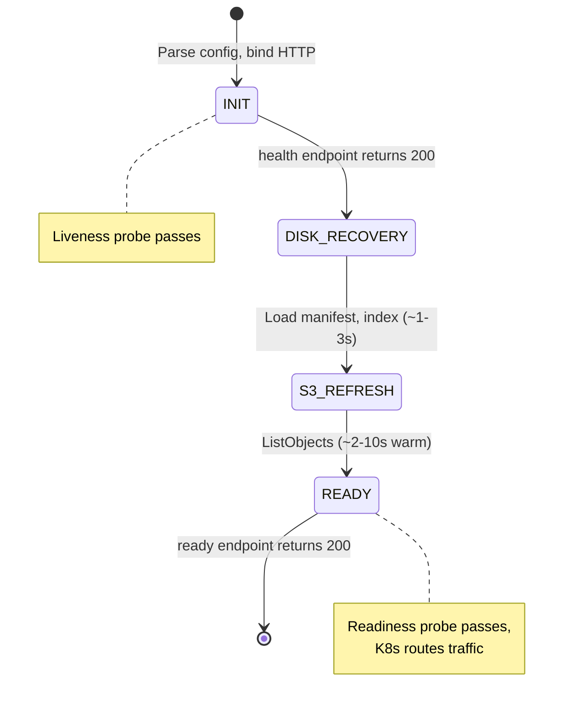
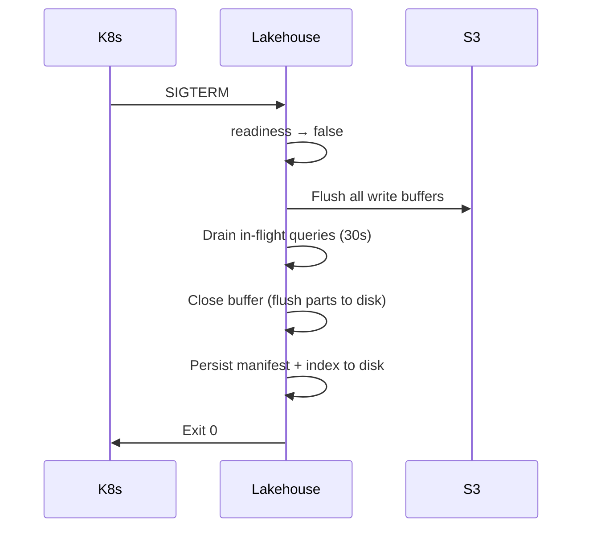
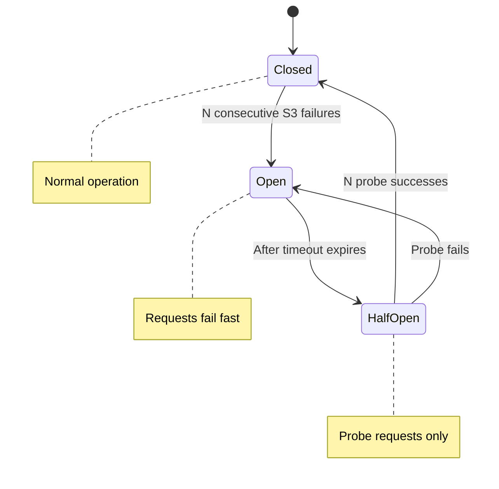

# Operations

## Health Endpoints

| Endpoint | Purpose | Returns 200 |
|---|---|---|
| `/health` | Liveness probe | Always (once HTTP binds) |
| `/ready` | Readiness probe | After startup warmup completes |
| `/lakehouse/info` | Build/config info | Always |
| `/manifest/range` | Data range served | Always |
| `/metrics` | Prometheus metrics | Always |
| `/internal/buffer/query` | Buffer query (insert pods) | When insert role enabled |

## Startup Behavior

Victoria Lakehouse goes through 4 phases on startup:


```mermaid
stateDiagram-v2
    [*] --> INIT: Parse config, bind HTTP
    INIT --> DISK_RECOVERY: health endpoint returns 200
    DISK_RECOVERY --> S3_REFRESH: Load manifest, index (~1-3s)
    S3_REFRESH --> READY: ListObjects (~2-10s warm)
    READY --> [*]: ready endpoint returns 200

    note right of INIT: Liveness probe passes
    note right of READY: Readiness probe passes,<br/>K8s routes traffic
```

1. **INIT** — parse config, bind HTTP port. `/health` returns 200.
2. **DISK_RECOVERY** — load persisted manifest, label index, and footers from disk (~1-3s warm, N/A cold).
3. **S3_REFRESH** — incremental S3 ListObjects for new files since last persist (~2-10s warm, 30-60s cold).
4. **READY** — `/ready` returns 200. Kubernetes routes traffic.

Monitor: `lakehouse_startup_phase` gauge, `lakehouse_startup_total_seconds` gauge.

### Early Serving

Set `--lakehouse.startup.serve-stale=true` to serve from persisted cache (Phase 1) before S3 refresh completes. Queries may return slightly stale results until refresh finishes.

### Warmup Safety Valve

`--lakehouse.startup.max-warmup-time=5m` aborts warmup and goes ready with whatever was loaded. Background refresh continues.

## Write Path Operations

### Buffer durability (no WAL)

There is no lakehouse WAL. The insert buffer is a sequence of upstream
`logstorage` segments under `insert.buffer_dir`; acknowledged rows are fsynced
within upstream's 5 s window, and the flusher drains every segment it finds on
restart (see [Persistence & Durability](durability.md)). Operators should
monitor:
- **Buffer dir**: `insert.buffer_dir` must be on a persistent volume (a StatefulSet PVC; the Helm chart provides one) — it is the only copy of acknowledged rows until they are in Parquet.
- **Backlog**: `lakehouse_buffer_segments{state="pending"}`, `lakehouse_buffer_pending_rows` and `lakehouse_buffer_oldest_pending_age_seconds`. A growing backlog means object storage is slower than ingest or unreachable; the rows are safe on disk meanwhile (alert `LakehouseBufferNotDraining`).
- **Disk floor**: below its free-space floor (1 GiB) the buffer volume makes inserts get 429 (`lakehouse_insert_rejected_total{reason="read_only"}`, alert `LakehouseInsertRefusedDiskFloor`). Size the volume as in [Sizing](operations/sizing.md).
- **Restore on start**: check logs for the segments found and the `/ready` readiness gate clearing before the pod takes traffic. A buffer directory of an earlier release is moved aside to `legacy-<unix>/` with a warning; delete it when no longer needed.

### Buffer Query Bridge

When running separate insert and select pods:
- Select pods discover insert pods via `--lakehouse.select.insert-headless-service`
- Buffer query timeout is configurable via `--lakehouse.select.buffer-query-timeout` (default 2s)
- Endpoint errors are silently ignored — degraded to S3-only results rather than failing the query

### Flush Pipeline

- **Age seal**: a segment is sealed `insert.buffer_flush_interval` (default 5m) after its first row and then drained completely to Parquet.
- **Size seal**: earlier, once the segment holds about `insert.target_file_size` (default 128MB) of rows while fewer than 64 segments are pending.
- **Graceful shutdown**: the flusher stops and the buffer closes (upstream persists every segment); the next start drains what is left.

## Graceful Shutdown


```mermaid
sequenceDiagram
    participant K8s
    participant Lakehouse
    participant S3

    K8s->>Lakehouse: SIGTERM
    Lakehouse->>Lakehouse: readiness → false
    Lakehouse->>S3: Flush all write buffers
    Lakehouse->>Lakehouse: Drain in-flight queries (30s)
    Lakehouse->>Lakehouse: Close buffer (flush parts to disk)
    Lakehouse->>Lakehouse: Persist manifest + index to disk
    Lakehouse->>K8s: Exit 0
```

On SIGTERM:
1. Stop accepting new queries (readiness -> false)
2. Stop the buffer flusher (a drain cut short resumes after the restart)
3. Drain in-flight queries (30s timeout)
4. Close the insert buffer (upstream flushes every segment's parts to disk; segments not yet written to S3 are drained on the next start)
5. Persist manifest, label index, peer ring to disk
6. Close S3 and peer connections
7. Exit

Set `terminationGracePeriodSeconds: 60` in Kubernetes (30s drain + 30s persist).

## Cache Management

### L1 Memory Cache

- Stores footers (~1KB), bloom filters (~10KB), hot pages
- LRU eviction at `--lakehouse.cache.memory-limit`
- Monitor: `lakehouse_cache_memory_bytes` vs `lakehouse_cache_memory_limit_bytes`

### L2 Disk Cache

- Stores full Parquet files from S3
- LRU eviction at `--lakehouse.cache.eviction-watermark` (default 80%) of disk limit
- Monitor: `lakehouse_cache_disk_bytes` vs `lakehouse_cache_disk_limit_bytes`
- Alert: `LakehouseCacheDiskFull` if >95% full

### L3 Peer Cache

- Consistent hash routes keys to peer instances
- Requires headless service and `--lakehouse.peer-auth-key`
- Monitor: `lakehouse_peer_ring_members`, `lakehouse_peer_hits_total`

### Cache Coalescence

`singleflight.Group` ensures only one S3 fetch per cache key, even under concurrent queries for the same data. Monitor: `lakehouse_cache_singleflight_dedup_total`.

## Manifest Refresh

The partition manifest tracks all Parquet files in S3. It refreshes:
- **Polling**: every `--lakehouse.manifest.refresh-interval` (default 5m) via S3 ListObjects
- **SQS** (optional): near-real-time updates from S3 event notifications

Monitor: `lakehouse_manifest_files`, `lakehouse_manifest_refresh_total`, `lakehouse_manifest_sqs_events_total`.

## Hot Boundary Discovery

Victoria Lakehouse polls vlstorage/vtstorage nodes to learn the hot tier's data range:
- Refreshes every `--lakehouse.discovery.refresh-interval` (default 5m)
- Monitor: `lakehouse_discovery_hot_boundary_seconds`, `lakehouse_discovery_hot_boundary_gap_days`
- Alert: `LakehouseHotBoundaryGap` if gap > 1 day between cold and hot data

## Circuit Breaker


```mermaid
stateDiagram-v2
    [*] --> Closed
    Closed --> Open: N consecutive S3 failures
    Open --> HalfOpen: After timeout expires
    HalfOpen --> Closed: N probe successes
    HalfOpen --> Open: Probe fails

    note right of Closed: Normal operation
    note right of Open: Requests fail fast
    note right of HalfOpen: Probe requests only
```

S3 failures trigger a circuit breaker:
- **Closed** (normal): requests flow through
- **Open** (after N failures): requests fail fast for `--lakehouse.circuit-breaker.timeout`
- **Half-open**: probe requests; N successes close the breaker

Monitor: `lakehouse_s3_circuit_breaker_state` (0=closed, 1=half-open, 2=open).
Alert: `LakehouseS3CircuitBreakerOpen`.

## Scaling

### Vertical

- **CPU**: driven by Parquet decompression and filter evaluation. 0.5-2 vCPU per instance typical.
- **Memory**: L1 cache + query working set. 512MB-2GB per instance typical.
- **Disk**: L2 cache. Size to hold 2-4 weeks of frequently queried data.

### Horizontal

- Add replicas to increase query throughput
- Peer cache distributes L2 across fleet (3x effective cache)
- Manifest and label index replicated on each instance (lightweight)
- No coordination required between instances

### Sizing Guide

| Dataset | Replicas | CPU/instance | Memory/instance | L2 Disk |
|---|---|---|---|---|
| 100GB S3 | 3 (1/AZ) | 0.5 vCPU | 512MB | 10GB |
| 1TB S3 | 6 (2/AZ) | 1 vCPU | 1GB | 50GB |
| 10TB S3 | 12 (4/AZ) | 2 vCPU | 2GB | 100GB |
| 100TB S3 | 24 (8/AZ) | 2 vCPU | 4GB | 200GB |

## Compaction

### Compaction on or off

Compaction is on by default in both binaries. Every pod runs the scheduler, and
highest-random-weight (HRW) ownership over the live peer set assigns each partition to
exactly one pod, so no leader election is involved. Tune it in the config file:

```yaml
lakehouse:
  compaction:
    interval: 5m
    max_concurrent: 1        # merges per tenant per scan
    min_files_l0: 10
    min_files_l1: 10
    min_age: 1h
```

The scan interval, daily rollup age and row-group schedule also have flags, for example
`-lakehouse.compaction.interval=5m`. `compaction.enabled: false` in the config file and
`-lakehouse.compaction.enabled=false` do not turn compaction off; a config file that
selects the `max-cost-savings` or `dev` profile does. See
[Configuration — Compaction on or off](configuration.md#compaction-on-or-off).

Compaction is only meaningful where inserts are active.

### Upgrading to the span events and links columns

The traces binary stores span events and links in the optional columns `span.events_json` and `span.links_json` ([format](open-parquet-format.md#span-events-links-and-scope-attributes)). A pod running an older version reads an object through its own row struct, so:

- an older pod that **compacts** or **delete-rewrites** an object written by the newer version drops the two columns from the output permanently, and the events and links of those spans are gone;
- an older **select** pod shows the two columns as plain fields of the span.

Nothing in the older version can be told to leave such objects alone, so the only safe order is: stop the old pods from rewriting, then let the new version write.

1. **Turn compaction off on the OLD pods first, as a separate rollout, and wait until it is in effect everywhere.** Compaction can only be turned off through the profile, and the config file is the way to set it:
   - set `profile: max-cost-savings` or `profile: dev` **in the config file** (`lakehouse.profile`), and do not set `compaction.enabled: true`. `compaction.enabled: false` does nothing (the key is enable-only), and `-lakehouse.profile=max-cost-savings` or `=dev` on the command line leaves compaction on (a profile flag gap). See [Compaction on or off](configuration.md#compaction-on-or-off);
   - under Helm set `lakehouseConfig.profile` to one of them **and** `lakehouseConfig.compaction.enabled: false` (the chart writes `enabled: true` by default, which wins);
   - both profiles change other defaults too (flush interval, cache sizes, durability knobs; see the [profile table](configuration.md#configuration-profiles)). Read it before choosing, and put the old values back afterwards.
   - A long `compaction.min_age` is a weaker alternative and only works if it is **longer than the age of the oldest span ingested during the rollout**: `min_age` is measured from the partition's hour, not from the file's age, so a late or back-filled span in an old partition is merged at once. And `POST /lakehouse/compaction/recompact` ignores `min_age` altogether: make no manual recompaction during the rollout.
2. **Settle the deletes.** A delete rewrite is the second path that drops the columns. Before rolling out, drain the pending tombstones or confirm there are none: `GET /delete/logsql/tombstones` (`/delete/tracessql/tombstones` on the traces binary) and, with `--delete.enable`, `/delete/active_tasks`. Create no new delete until every pod runs the new version.
3. **Roll out the new version.** Only now do pods write the new columns.
4. **Turn compaction back on** once every pod runs the new version: restore the profile or `lakehouseConfig.compaction.enabled`.

Rolling back below this version is the same hazard in reverse: do it only with compaction and deletes still off. As soon as compaction resumes on the old version, it merges objects that carry the columns, and the events and links of every object it merges are lost.

The schema fingerprint is unchanged on purpose: a deployed pod treats any other fingerprint as stale and merges it, which would make older pods seek the newer objects.

From this version on compaction and the delete rewriter leave an object alone when it holds a top-level column their row struct does not model (a column a later version adds). The compactor merges the other inputs and keeps the object, and does not plan it again; a delete rewrite of it is deferred, not failed: its tombstone stays pending (it stays in the list above and in `/delete/active_tasks`), its rows stay hidden by the tombstone, and the metadata-only fast paths (manifest counts, label aggregates) stay off for the requests of that tenant in the tombstone's range, until a pod of the newer version rewrites the object. Each such object is counted once in `lakehouse_compaction_skipped_unknown_columns_total{signal,op}`, logged once, and raises the alert `LakehouseCompactionSkippedUnknownColumns`; the delete deferrals are in `lakehouse_delete_rewrite_deferred_total{reason="unknown_columns"}`, which is not a rewrite error. This protects every later column addition. It cannot protect the transition above, because the older pods have no such check.

### How a scan plans merges

Compaction plans per **tenant and partition**, the unit it actually merges: it writes one output
per tenant (and bucket) of an hour, so it counts and selects files per tenant too. One tenant's
files never make another tenant's single file look mergeable (issue #343). For each tenant of
each owned partition, in order:

1. **Open hour.** `compaction.min_files_l0` L0 files merge into one L1 file; else
   `compaction.min_files_l1` L1 files merge into one L2 file. Only files older than
   `compaction.min_age` (partition age) count.
2. **Closed hour.** Once the partition is `compaction.daily_rollup_age` old, every file of the
   tenant in that hour that is **under 32 MiB** and carries the majority schema merges into one
   file, whatever its level; the output is one level above the highest input. Late data landing
   in an old hour therefore folds into the hour's file instead of staying as loose small files.
   Files of 32 MiB or more ("mature") are never merged by the rollup or by the fragmentation
   hint, so write amplification stays proportional to the late data, not the hour's size. The
   open-hour thresholds and the stale-schema heal can still take them.
3. **Hints.** A stale-schema pair heals whatever its size. Two or more non-mature files at the
   top level L2 or above merge as "fragmented" (see Compaction Hints & Stats).

Every merge needs at least two files: a tenant with a single file in an hour is left alone, so a
settled manifest produces **zero** merges on the next scan.

`compaction.max_concurrent` is the number of merges per tenant per scan. The scan picks open-hour
merges first, then the plans that remove the most files per byte rewritten, then the oldest
partition; fair share (keyed by the tenant in the object keys) decides who goes first when a
tenant has several plans.

**Failure backoff.** A merge that fails (a download the store cannot serve, an upload error) is
skipped for the scan interval, doubled for each consecutive failure, at most one hour. Until then
the tenant's next plan takes its slot, so one permanently failing partition cannot starve a
tenant. The entry clears on success and when the plan disappears.

**Scan budget.** A scan starts no new merge once it has run for the scan interval (the first merge
always runs), so thousands of tenants with work cannot keep one scan going for hours.
`lakehouse_compaction_scan_budget_exhausted_total` counts the scans that were cut off; the
fair-share cursor moves past the tenants served, so the next scan starts with the ones it did not
reach. The budget is `SchedulerConfig.ScanBudget`: 0 means the interval, negative disables it (it
has no config key).

### Lifecycle freeze: tiered objects are not rewritten

Rewriting an object that S3 lifecycle moved to STANDARD_IA, ONEZONE_IA, Glacier Instant/Flexible
Retrieval or Deep Archive costs a retrieval fee plus the early-deletion charge for the class's
minimum duration, and fails outright in Glacier Flexible Retrieval and Deep Archive. Compaction
keeps away from such objects, in three ways:

1. **The class S3 reports.** Every manifest refresh lists the bucket, and the listing carries each
   object's storage class, so it is recorded on the manifest entry (and updated on every refresh)
   **at zero extra requests**. An object whose class is not STANDARD / INTELLIGENT_TIERING is skipped
   (`lakehouse_compaction_frozen_files{reason="storage_class"}`). Lakehouse never issues a HEAD to
   learn a class, and the Intelligent-Tiering archive tiers are not detected.
2. **The mirrored lifecycle rules.** Between refreshes, and for objects S3 has not moved yet (it runs
   lifecycle asynchronously), the rules in the config apply: a partition older than the **first
   transition out of a rewritable class, minus 48 h** is skipped (`reason="age"`). The margin is capped at
   half the transition (a 1-day rule freezes at 12 h). Rules come from `delete.lifecycle_rules`,
   per-tenant `tenant.overrides.<tenant>.lifecycle` (replacing the global rules for that tenant) and
   `stats.s3_lifecycle_rules`; the earliest wins. Rules that only move objects to
   INTELLIGENT_TIERING never freeze anything.
3. **No-rule cap.** A tenant with no such rule gets no size merges (thresholds, rollup, fragmentation)
   on partitions older than `compaction.size_merge_max_age`, 7 days by default (0 means 7 days,
   negative removes the cap), so backfill into old data cannot keep rewriting objects whose bucket rule
   is not mirrored here. Stale-schema heal still runs (`reason="size_age"`).

The gauge reports the files the last scan skipped. The same rules apply to the manual recompact trigger
and to the orphan sweep's steal path, and Tier A now applies tombstones like a scheduled merge.

**Startup warning.** If a freeze age (global or a tenant override) is not later than
`compaction.daily_rollup_age`, Lakehouse logs a warning at startup naming the scope: the closed-hour
rollup can never run for that data, so a quiet tenant's few small files in an hour stay unmerged.
Move the first transition later, or lower `compaction.daily_rollup_age` below the freeze age.

### Measured effect of per-tenant planning (issue #343)

Simulation with the shipped defaults (`min_files_l0/l1: 10`, `min_age: 1h`,
`daily_rollup_age: 24h`, `max_concurrent: 1`, fair share 1) over an in-memory counting pool: the
planner clock advances 5 min per scan (288 scans/day) and every tenant flushes one 20-row L0 file
per scan, for 3 simulated days. **Measured** (request and byte counts of the compaction code; not
S3 latency or cost). Reproduce with `LH_COMPACTION_SIM=1 go test ./internal/compaction -run
TestSimWriteAmplification -v` (`internal/compaction/wa_sim_test.go`).

| Scenario (day 3) | | merges/day | objects written/day | PUT/scan mean (max) | GET/scan mean (max) | write amplification (bytes) | rows rewritten / ingested | L0 backlog (oldest) | highest level | total objects | merges in 5 idle scans |
|---|---|---|---|---|---|---|---|---|---|---|---|
| logs-4-tenants | before | 288 | 1152 | 4.00 (4) | 4.00 (4) | 1.19 | 11.00 | 2352 (49 h) | L578 | 2448 | 5 |
| logs-4-tenants | after | 96 | 96 | 0.33 (4) | 4.00 (48) | 0.10 | 1.00 | 0 (0 h) | L1 | 292 | 0 |
| logs-20-tenants | before | 288 | 5760 | 20.00 (20) | 20.00 (20) | 1.19 | 11.00 | 17040 (71 h) | L853 | 17080 | 5 |
| logs-20-tenants | after | 480 | 480 | 1.67 (20) | 20.00 (240) | 0.10 | 1.00 | 0 (0 h) | L1 | 1460 | 0 |
| traces-4-tenants | before | 288 | 1152 | 4.00 (4) | 4.00 (4) | 1.69 | 11.00 | 2352 (49 h) | L578 | 2448 | 5 |
| traces-4-tenants | after | 96 | 96 | 0.33 (4) | 4.00 (48) | 0.15 | 1.00 | 0 (0 h) | L1 | 292 | 0 |

Before the fix, an hour older than `daily_rollup_age` with one file per tenant was rewritten 1 to 1
on every scan (the level climbed to L853 in three days), those rewrites won every scan, and the
newer hours' L0 files were never merged (backlog 17,040 files, oldest 71 h). After it, the first
scan after ingest stops, and every later one, merges nothing. The byte ratio is for tiny
20-row objects whose footers dominate; read the rows ratio. Scaling to larger deployments is
**assumed**: if the rows-rewritten ratio of 1.00 holds for real objects, compaction reads and
writes about 1x the daily ingest (1, 10, 100 TB/day read and written), and request counts follow
tenants x hours, not TB: with 12 flushes per tenant-hour the measured pattern is 24 merges per
tenant-day of 12 GET + 1 PUT + 12 DELETE, i.e. 288 GET, 24 PUT and 288 DELETE per tenant-day.
In this synthetic load every hour closes as one L1 file per tenant, so the closed-hour rollup
is exercised by the property tests (`TestStorageHealth_CompactionProperties`), not by this table.

### Compaction health checks

The storage-health cells that guard compaction (CI job `storage-health-compaction`, registry rows
`lh.storage_health.compaction.*`):

- a second scan over a settled manifest does zero merges (`TestScan_SecondScanDoesNothing`);
- a lone file is never rewritten, objects in a non-rewritable class are never touched, and an object
  that a refresh reports as moved is skipped;
- randomized multi-day, multi-tenant runs (legacy keys, a second bucket, late data, mature
  files) keep the storage invariants after every scan, lose and duplicate no row, never mix
  tenants, converge, and then stay at zero merges;
- injected download, upload, delete and publish-conflict faults leave other tenants' merges
  running, conserve every row and converge on later scans.

### Scan cost

A scan walks the manifest in place (one partition at a time under the read lock, so a flush or a
refresh waits for at most one partition) and plans each tenant group; a settled manifest avoids copying
the full metadata of every file. **Measured** (Apple M5 Pro, `-count=10`, benchstat; reproduce with `go test
./internal/compaction -run '^$' -bench BenchmarkScanSettled -benchtime=50x -count=10`):

| Build | ns per file per scan | bytes per file | allocs per file |
|---|---|---|---|
| main (`71895244`) | 35.3 (±2%) | 260 | 0.24 |
| this change | 45.3 (±2%) | 5.2 | 0.22 |
| this change, lifecycle freeze wired | 54.0 (±12%) | 5.2 | 0.22 |

That is 1.28x and 1.53x main's time per file, with 98% fewer bytes allocated.
The main allocation is 26,003,000 bytes per 100k files (260 decimal bytes per file;
the earlier 248-byte figure mixed binary and decimal units).

**Scaling (assumed, not measured):** file counts below are assumptions, not measurements: 10x
compression, 100 tenants, objects of about 64 MiB for the large tenants and a floor of one file per
tenant-hour (2,400 files per day), which gives about 4k, 18k and 160k files per day at 1, 10 and
100 TB/day. Files = per day x days; CPU = files x 54 ns (this change) or x 35.3 ns (main); allocation =
files x 5.2 B (this change) or x 260 B (main), per scan.

| TB/day | Days | Files (assumed) | CPU per scan, this change / main | Allocated per scan, this change / main |
|---|---|---|---|---|
| 1 | 30 | 120 k | 6.5 ms / 4.2 ms | 0.6 MB / 31.2 MB |
| 10 | 30 | 540 k | 29.2 ms / 19.1 ms | 2.8 MB / 140.4 MB |
| 100 | 30 | 4.8 M | 259.2 ms / 169.4 ms | 25.0 MB / 1.25 GB |
| 1 | 365 | 1.46 M | 78.8 ms / 51.5 ms | 7.6 MB / 379.6 MB |
| 10 | 365 | 6.57 M | 354.8 ms / 231.9 ms | 34.2 MB / 1.71 GB |
| 100 | 365 | 58.4 M | 3.15 s / 2.06 s | 303.7 MB / 15.18 GB |

The scan costs more CPU than before but allocates about 50x less, and at the default
5-minute interval even the largest row is about 1% of one core. This covers the settled-scan walk
only; the manifest's own memory and its full-LIST refresh are separate limits (the documented ceiling
is about 50 TB/day).

### Monitoring Compaction

Key metrics to watch:

| Metric | Alert condition |
|---|---|
| `lakehouse_compaction_errors_total` (rate) | Any sustained errors |
| `lakehouse_compaction_level_files{level="0"}` | Should trend down over time |
| `lakehouse_compaction_frozen_files{reason}` | Files the last scan kept out of compaction (`storage_class`, `age`, `size_age`); a sudden rise after a lifecycle-rule change is expected |
| `rate(lakehouse_compaction_scan_budget_exhausted_total[1h])` | Scans cut off by the scan budget; sustained means more tenants with work than one scan can serve, raise `compaction.max_concurrent` or the pod count |
| `rate(lakehouse_compaction_runs_total[1h])` on a settled tenant | Should reach 0; steady merges with no new data is the #343 churn |
| `lakehouse_compaction_duration_seconds` (p95) | >60s may indicate S3 saturation |
| `lakehouse_compaction_dual_ownership_total` (rate) | Any increase: two pods compacted the same partition (ring flap or DNS lag) |

### Compaction Hints & Stats

`GET /lakehouse/api/v1/stats/compaction` returns a manifest-derived (no file reads) view of how well-compacted the data is, plus a **prioritized work-list** of partitions worth recompacting first for the best storage win. It is the data behind the UI's compaction panel and the source the manual trigger and the scheduler both act on.

```jsonc
{
  "total_files": 1280, "total_bytes": 53687091200, "total_raw_bytes": 268435456000,
  "compression_ratio": 5.0,
  "total_bloom_bytes": 412876800,                  // footer-bloom footprint across all files
  "bloom_columns": ["service.name", "trace_id", "k8s.node.name", "..."],  // mode's footer bloom set
  "bloom_fp_rate": 0.01,
  "by_level": [
    { "level": 0, "files": 40,  "bytes": 2147483648,  "avg_file_bytes": 53687091, "compression_ratio": 3.1, "configured_zstd": 3,  "bloom_bytes": 16777216 },
    { "level": 2, "files": 900, "bytes": 48318382080, "avg_file_bytes": 53687091, "compression_ratio": 5.4, "configured_zstd": 11, "bloom_bytes": 396099584 }
  ],
  "compacted_bytes": 48318382080,   // >= L2, well rolled-up
  "pending_bytes":   5368709120,    // L0/L1, awaiting rollup
  "stale_schema_files": 12, "stale_schema_bytes": 644245094,
  "fragmented_partitions": 3,
  "estimated_reclaimable_bytes": 1234567890,
  "candidates": [
    {
      "partition": "dt=2026-06-01/hour=00", "files": 4, "max_level": 2,
      "stale_files": 3, "max_level_files": 4,
      "bytes": 214748364, "estimated_savings_bytes": 19327352,
      "estimated_bytes_after": 195421012,        // bytes - estimated_savings
      "next_level": 3, "next_level_zstd": 11,     // what a recompaction would write
      "reasons": ["stale_schema", "fragmented"]
    }
  ]
}
```

A partition becomes a **candidate** when it is `stale_schema` (files written under an older schema fingerprint — they predate the current dedicated-column layout) and/or `fragmented` (two or more files stuck at the top level, which the level policy never re-picks). Candidates are sorted by `estimated_savings_bytes` descending. `configured_zstd` / `next_level_zstd` reflect `compaction.compression_level_by_output_level`, so the panel shows the zstd level already applied and the harder level a recompaction would apply.

`total_bloom_bytes` and per-level `bloom_bytes` report the **footer-bloom footprint** — the on-disk size of the per-row-group skip blooms, captured at write time so the endpoint stays file-read-free; `bloom_columns` is the mode's bloom set and `bloom_fp_rate` the configured false-positive rate. (Files written before the capture landed show `bloom_bytes: 0` and heal as they recompact.) Compaction **retains the combined bloom** of all merged inputs in pmeta, so a compacted file stays file-level bloom-prunable across everything it absorbed — a `trace_id` lookup can still skip it.

The scheduler consumes these hints automatically: on each scan it recompacts stale/fragmented partitions it owns even when the normal L0/L1 level policy would not pick them.

### Manual Recompaction Trigger

`POST /lakehouse/compaction/recompact` forces recompaction of a single partition now, bypassing the level-policy eligibility gate — for acting on a specific candidate from the stats above.

```bash
curl -XPOST http://<instance>:<port>/lakehouse/compaction/recompact \
  -d '{"partition": "dt=2026-06-01/hour=00"}'        # level optional; 0/omitted derives from the hint
```

```jsonc
{ "partition": "dt=2026-06-01/hour=00", "output_level": 3,
  "input_files": 4, "output_files": 1, "rows_merged": 1048576, "bytes_written": 195421012 }
```

It runs the **same merge path** as a scheduled compaction (synchronously) and honors **HRW partition ownership**: an instance that does not own the partition returns `403` naming the owner, so in a fleet two pods never both rewrite the same partition — POST to any instance and it forwards/rejects based on ownership. Responses:

| Status | Cause |
|---|---|
| `200` | Recompacted; body carries the result |
| `400` | Missing/invalid `partition`, or fewer than two compactable files (nothing to merge) |
| `403` | This instance is not the HRW owner of the partition (body names the owner) |
| `503` | Compaction is disabled on this instance |

### Ownership Troubleshooting

**A partition is never compacted.** Check `lakehouse_compaction_ownership_empty_peers_total`
(the pod saw an empty peer set) and `lakehouse_compaction_ownership_self_in_peers` (should
be 1: the pod is part of its own ring). A pod missing from peer discovery
(`discovery.peer_headless_service`) cannot own partitions other pods expect it to.

**Two pods compact the same partition.** `lakehouse_compaction_dual_ownership_total`
increases while the ring changes (scaling, restarts, DNS lag);
`lakehouse_compaction_ownership_changes_total` shows how often. Keep the HPA scale-down
stabilization window longer than the peer ring's 60-second stabilization period (the
`discovery.ring_stabilize_duration` key is not read in this release).

## Deletion Operations

### Tombstone Management

**Durability guarantee.** Every tombstone mutation — create, un-delete, and the
retirement of a fully rewritten tombstone — is written through to durable
storage before the API call returns:

- the **local disk copy** (`{persist_path}/tombstones.json`, written to a
  temporary file and renamed) is written synchronously, so a `SIGKILL`
  immediately after the delete API returns cannot lose the record;
- the **S3 copy** (`{prefix}_tombstones/{id}.json`, where `{prefix}` is the
  deployment's S3 prefix — `s3.prefix`, or else the default tenant prefix plus
  the signal, e.g. `logs/`) is attempted in the same call. Tombstones are not
  stored per tenant: in multi-tenant mode every tenant's tombstones live under
  the one prefix (typically `logs/_tombstones/` or `traces/_tombstones/`), and
  each record names the tenants it acts on (`Tenants`). A tombstone only ever
  hides, rewrites or compacts away rows of its own tenants, and the delete API
  shows each tenant only its own (see
  [deletion-strategy.md → Tenant Scope](deletion-strategy.md#tenant-scope)).
  A record without `Tenants` is not a tombstone: nothing creates one, and a
  restore rejects it (logged, counted as `kind="unscoped_tombstone"` below) instead
  of applying it. If S3 is unavailable the record is queued,
  `lakehouse_delete_tombstone_persist_pending` rises above zero, and the write
  is retried on the next mutation, on every rewrite-scheduler tick, and at
  shutdown. The disk copy is authoritative for that node in the meantime.

Nothing about durability depends on a graceful shutdown.

**Startup** restores the **union** of the disk and S3 copies; neither source
replaces the other. When the two disagree about the same tombstone, the merge
never walks progress back: a key recorded as rewritten anywhere is rewritten
everywhere (the file it named is gone), and the files each copy lists as
pending are combined, so neither copy's discoveries are lost. A single
unreadable S3 object is skipped and counted rather than aborting the restore.

Immediately after the manifest is restored, a **self-check** compares the two
and logs plus counts every disagreement under
`lakehouse_delete_startup_inconsistencies_total{kind=...}`:

| kind | meaning | consequence |
|------|---------|-------------|
| `persistence_disabled` | the store has no durable target | deletes are lost on an ungraceful restart |
| `s3_restore_failed` | the S3 copy of the store could not be read (LIST or an object) | **deletes made on other nodes are not enforced here** and no interrupted rewrite is resolved or tombstone retired until it succeeds; retried every minute and on every rewrite pass (`lakehouse_delete_tombstone_restore_pending`) |
| `reaped_key_still_manifested` | a key the tombstone records as gone is one the manifest still serves — another node's record, or a rewrite that was undone | the key is put back on the tombstone's work list and rewritten again; rows stay hidden by the query filter meanwhile |
| `pending_key_missing_from_manifest` | the manifest snapshot does not list a key the tombstone still has work for | nothing is inferred from it: the scheduler waits for a bucket listing in this process (and, for a key an undo restored, for a listing that began after the undo) before treating the object as gone |
| `removed_tombstone_still_in_s3` | an un-deleted or retired tombstone's S3 copy survived a crash | the stale copy is ignored and its delete re-issued (see *Un-Delete*) |
| `unreadable_tombstone_object` | an object under `_tombstones/` could not be parsed | that one record was skipped |
| `unscoped_tombstone` | a restored record (disk or S3) names no tenant, or its two copies name no tenant in common | not a tombstone: rejected, not applied, counted once per process, marked removed and its `_tombstones/{id}.json` object deleted (also counted as `removed_tombstone_still_in_s3`); the other records restore normally |

Before the self-check, every **interrupted rewrite** is resolved against the
restored manifest (see *Background Rewriter*), counted as
`lakehouse_delete_rewrite_interrupted_total{outcome="undone"|"published"|"discarded"}`.

Findings are reported, not repaired: every repair is a data movement that
belongs to the rewrite scheduler's normal retry path.

**Key metrics:**
- `lakehouse_delete_tombstones_active` — active tombstones in memory
- `lakehouse_delete_tombstones_total` — lifetime tombstones created
- `lakehouse_delete_tombstones_completed_total` — tombstones retired because every file they covered has been rewritten
- `lakehouse_delete_rows_suppressed_total` — rows filtered at query time
- `lakehouse_delete_rewrite_total` — physical rewrites completed
- `lakehouse_delete_rewrite_manifest_updated_total` — rewrites published into the manifest
- `lakehouse_delete_rewrite_manifest_errors_total` — manifest hand-offs that failed; the rewrite is retried and the superseded object is **not** deleted
- `lakehouse_delete_rewrite_skipped_no_manifest_total` — rewrites refused because no manifest was wired in (see below)
- `lakehouse_delete_rewrite_superseded_total` — rewrites discarded because a concurrent compaction merged their source first; the tombstone follows the rows
- `lakehouse_delete_tombstone_keys_discovered_total` — files added to a tombstone's work list because they overlap its range (compaction outputs carrying its rows, late files)
- `lakehouse_delete_catalog_rebuilds_total{result}` — pmeta field-catalog value rebuilds after rows were removed
- `lakehouse_compaction_publish_conflicts_total` — compactions abandoned at publish because a source was replaced mid-merge
- `lakehouse_delete_rewrite_old_object_errors_total` — deletes of superseded objects that failed after a successful publish; the rewrite's record and the object's retirement in the manifest stay until a later pass deletes it, and the tombstone does not retire before that
- `lakehouse_delete_rewrite_abandoned_object_errors_total` — deletes of replacements whose publish was refused or failed; retried the same way
- `lakehouse_delete_rewrite_interrupted_total{outcome}` — rewrites found unfinished (after a crash) and how they were resolved
- `lakehouse_manifest_retired_keys`, `lakehouse_manifest_refresh_skipped_total{reason}`, `lakehouse_manifest_retired_evicted_total{reason}`, `lakehouse_manifest_retired_reclaimed_total` / `..._reclaim_errors_total` — objects the manifest refresh keeps out while their deletes are outstanding (see [Manifest System → What the refresh does not adopt](manifest-system.md#what-the-refresh-does-not-adopt))
- `lakehouse_delete_rewrite_skipped_glacier_total` — rewrites skipped due to storage class
- `lakehouse_delete_tombstone_persist_total{target="disk"|"s3"}` / `..._errors_total` — durability writes
- `lakehouse_delete_tombstone_persist_pending` — records whose S3 copy is behind; steady state 0
- `lakehouse_delete_tombstone_not_durable_total` — steps that could not proceed because the change authorising them was not durable yet; the objects are kept and the next pass retries
- `lakehouse_delete_rewrite_deferred_total{reason="not_durable"|"unlisted"|"awaiting_listing"|"restore_pending"|"absent_but_exists"|"existence_unknown"|"unknown_columns"}` — rewrite work postponed rather than done, by why
- `lakehouse_delete_rewrites_unfinished` — rewrite records whose objects are not settled yet; **drain to 0 before rolling back** (see *Rolling back*)
- `lakehouse_delete_tombstone_restore_pending` / `lakehouse_delete_tombstone_restore_attempts_total{result="failed"|"recovered"}` — whether this node has read the S3 copy of the store, and the retries
- `lakehouse_delete_rewrite_key_collisions_total`, `lakehouse_manifest_key_claim_rejected_total{reason}` — object keys that were already in use and had to be redrawn; a sustained rate means something other than chance is generating them
- `lakehouse_manifest_held_keys` — replacements another publish may not supersede yet (their swap is not durable)
- `lakehouse_manifest_retired_delete_owed` — how much of the retired set is this process's own outstanding deletes
- `lakehouse_manifest_retired_delete_landed` — the part whose objects are already deleted, held only until a bucket listing older than the delete can no longer be applied; it should drain at every refresh, so a value that keeps climbing means refreshes are not being accepted
- `lakehouse_manifest_retired_settled_total` — retired keys an accepted listing proved gone. This is the drain signal: on a node compacting faster than it refreshes the gauge above never reads zero even while draining perfectly, so alert on this counter standing still, not on the gauge being non-zero
- `lakehouse_delete_tombstone_removed_markers_evicted_total` — removed-tombstone markers dropped by their TTL or cap (never while their S3 delete is owed)
- `lakehouse_delete_compaction_rows_removed_total` / `lakehouse_delete_compaction_keys_reaped_total` — rows and source keys compaction reaped
- `lakehouse_delete_fields_scan_fallback_total{endpoint=...}` — requests that gave up a fast path a tombstone cannot be applied to because one overlapped: metadata-only field enumeration (`field_values`, `streams`, `stream_ids`) and the pure-buffer aggregate path (`pure_buffer`). Only tombstones acting on the request's own tenants count
- `lakehouse_delete_tenant_scope_skips_total{site="rewrite"}` — objects of another tenant a tombstone record named, left untouched and recorded clean; non-zero means a defect or a hand-edited record (alert `LakehouseDeleteTenantScopeViolation`)

**Alert on** a sustained non-zero `lakehouse_delete_tombstone_persist_pending`
(only the local disk copy would survive a pod move), on any increase in
`lakehouse_delete_rewrite_manifest_errors_total`, on superseded or abandoned
objects whose deletes keep failing, on a retired key evicted by its size bound
(`lakehouse_manifest_retired_evicted_total{reason!="ttl"}`, and critically on
`reason="cap_delete_owed"` and `reason="cap_delete_landed"`), on `lakehouse_delete_tombstone_restore_pending`
(this node is not enforcing other nodes' deletes), on
`lakehouse_delete_tombstone_not_durable_total` and on
`lakehouse_delete_rewrites_unfinished` staying above zero for hours — all ship
as rules in `alerts/alerts-lakehouse.yml`, and all of them name
`GET {prefix}/leftovers` as the way to see what is outstanding.

### What this instance still owes: `{prefix}/leftovers`

```bash
curl 'http://lakehouse:9428/delete/logsql/leftovers'        # traces: /delete/tracessql/leftovers
curl 'http://lakehouse:9428/delete/logsql/leftovers?limit=50'
```

A read-only listing of everything this instance is holding on to, which is what
the alerts above tell an operator to look at:

- `retired_keys` — objects the manifest has stopped serving. `delete_owed: true`
  means this process superseded the object and owes its deletion;
  `deleted: true` means the object is already gone and the entry is held only
  so a bucket listing that began before the delete cannot adopt it back (it
  clears at the next refresh); `replaced_by` names the file that took its
  place.
- `pending_keys` — uploads claimed but not published. `held: true` means a
  replacement whose swap is not durable yet, which compaction may not merge.
- `unfinished_rewrites` — the durable rewrite records, with `state`
  (`prepared`, `published` or `discarded`) and the objects each one names.
- `counts`, plus `truncated`/`limit`: the lists are capped (default 1000
  entries, maximum 10000) while the counts are always the full totals.
- `tombstone_store` — whether write-through persistence is armed, how many
  records are owed to S3, and whether the S3 restore is still pending.

It is **tenant-scoped** like the tombstone listing next to it: a tenant caller
sees the entries of its own objects and the rewrites of its own tombstones
(`"scope": "tenant"` in the payload); only a request presenting the global-read
credential sees the whole instance (`"scope": "instance"`), which is what the
alerts above need. It is read-only: nothing here deletes or repairs anything,
because every repair is a data movement that belongs to the scheduler's retry
path.

### Rolling back

Upgrading is safe in one direction only, and the difference matters when a
rewrite is in flight:

- **Old files, new binary:** this release decodes the previous releases'
  `tombstones.json` and `_tombstones/{id}.json` formats, but a record that names
  no tenant is rejected, not applied (`kind="unscoped_tombstone"`, counted and
  logged once per process). The rejection is recorded as a removal marker in
  the disk copy and the record's `_tombstones/{id}.json` object is deleted, the
  same way an un-deleted tombstone's is, so a later restart does not bring it
  back. Re-issue such a delete for its tenant. The same applies when a record's
  disk and S3 copies name no tenant in common: the copies can only narrow a
  scope, never widen it, so such a record is rejected and removed too.
  Delete-task ids come from upstream (`vlselect`/`vtselect` or a
  `/delete/run_task` caller), so such a pair can be two peers' registrations of
  one id rather than a corrupted copy: the node that rejects the pair deletes
  the shared S3 object and keeps the rejection as a marker on its own disk,
  while the peer keeps its record from its own disk copy (markers are per
  node). Re-issue the task under a fresh id if both scopes are wanted.
- **New files, old binary:** the previous release cannot read this release's
  `tombstones.json` envelope at all (it carries the removed-tombstone markers),
  and the per-id S3 objects it *can* read lose the rewrite records
  (`Superseded`). A rewrite that is half-finished when you roll back is then
  never resolved: a replacement stays unmanifested (the orphan sweep only
  reclaims objects with a retirement record), or a superseded object keeps its
  rows.

So before rolling back to a release older than this one:

1. Stop issuing deletes, and wait for `lakehouse_delete_rewrites_unfinished` to
   reach **0** on every instance (`{prefix}/leftovers` shows what is left).
2. Wait for `lakehouse_delete_tombstone_persist_pending` to reach **0**, so
   every record is in S3 — the only copy the old binary will read.
3. Check `lakehouse_manifest_retired_delete_owed` is 0, or delete the listed
   objects yourself: the old binary does not carry the retired set forward in
   its snapshot, and a refresh would serve those objects again.

**Configuration:**

```yaml
lakehouse:
  delete:
    enabled: true
    default_mode: auto
    auto_rewrite_classes: [STANDARD]
    rewrite_delay: 1h
    rewrite_batch_size: 50
    rewrite_max_concurrent: 2
    persist_path: /data/lakehouse/tombstones
    cost_warning_threshold: 10.0
    verify_interval: 6h
    lifecycle_rules: []
```

### Background Rewriter

The rewriter processes tombstones with mode `permanent` or `auto` against S3 Standard files:

1. Scans active tombstones that are **eligible for physical removal** (below)
2. Adds to the tombstone's work list every file that now overlaps its time
   range — not only the files that existed when the delete was issued
3. Checks file storage class (HeadObject or lifecycle prediction) and skips
   non-Standard files (Glacier, IA) — tombstone-only suppression
4. Rewrites each pending file in recorded steps (below), after first settling
   any rewrite an earlier pass or a crashed process left unfinished
5. Re-reads the files overlapping the range once more, and retires the
   tombstone only if every one of them has been handled

**Eligibility — the un-delete window.** A `hide` tombstone is never eligible: it
is reversible by contract, so no path may physically drop its rows. A
`permanent` or `auto` tombstone becomes eligible once `rewrite_delay` has passed
since the delete; until then an operator can still un-delete it and get every
row back. The rewriter and compaction evaluate the same rule
(`Tombstone.EligibleForPhysicalRemoval`), so neither can remove rows the other
would still protect.

**Why the work list is re-read.** A tombstone's affected-file list is a snapshot
from when the delete was issued. Compaction can move the tombstone's rows into a
new file (while the tombstone is inside its un-delete window, or concurrently
with a rewrite pass), and a file can land in the range after the delete.
Retiring on the old snapshot would stop the query-time filter from hiding rows
that were never removed. New entries are counted in
`lakehouse_delete_tombstone_keys_discovered_total`.

Each file goes through a **recorded rewrite**. Before each step that something
later depends on, the rewrite writes its progress onto the tombstone — a durable
record keyed by the source file, persisted like every tombstone change (disk
synchronously, S3 in the same call). The manifest, by contrast, is only as
durable as its last snapshot, so after a crash the record — not the manifest —
says what happened:

| step | what happens | if the process dies here |
|------|--------------|--------------------------|
| record `prepared` | the replacement key is chosen and written onto the tombstone; nothing is uploaded yet | restart **undoes** the rewrite: the replacement key is retired in the manifest (a refresh will not adopt it) and the rewrite runs again |
| upload | the filtered replacement is uploaded under its new key — in the source object's own directory, so a tenant's rows stay under its `{AccountID}/{ProjectID}/<signal>/` prefix; the manifest marks it *pending*, so a manifest refresh in the meantime does not adopt it | same: undone; the replacement object is deleted by the next pass |
| publish | the manifest swaps the old key for the new one in a single atomic step, and retires the old key | still `prepared`: undone — even if a snapshot captured the swap, the swap is reversed and the source is served again; peers, pmeta and the source's delete all wait for the next step, so nothing outside the process saw the replacement |
| record `published` | the publish and the key's bookkeeping (source reaped, replacement clean) are recorded | restart **finishes** the rewrite: the source is retired (a refresh will not re-adopt it) and deleted by the next pass; the replacement is served from the manifest or adopted by the refresh |
| hand-off | pmeta and peers are told | same: finished |
| commit | the superseded object is deleted, then the record is cleared | if the delete failed, the record stays and every later pass retries it; the tombstone does not retire while any record remains |

A publish that is refused or fails records `discarded`, retires the replacement,
and deletes it; a failed delete is retried the same way. A restart resolves
every record before the first manifest refresh runs, so no restart mode — a
snapshot taken at the crash, a snapshot older than the rewrite, or a lost disk
with tombstones restored from S3 — can serve a row twice or lose one.

The superseded object is **never** deleted before the manifest points at its
replacement and that publish is recorded. A manifest hand-off that fails leaves
the key un-reaped, so the next tick retries it. An **un-delete** of a tombstone
with an unfinished rewrite is refused with `409 Conflict` — the record lives on
the tombstone, and removing it mid-rewrite would drop the only trace of a
replacement object; retry once the rewrite settles (seconds, unless deletes are
failing). Stopping a delete task through the VictoriaLogs-compatible delete-task
API removes the same tombstone and is refused the same way, with an error.

**Publishes are conditional.** The swap happens only if the source file is
still registered. If a compaction merged the same file between the rewrite's
read and its publish, the rewrite discards its replacement
(`lakehouse_delete_rewrite_superseded_total`) — registering it would store the
kept rows twice and bring the deleted rows back through the compacted copy — and
the tombstone follows the rows into the compacted output. Compaction's publish
is conditional in the same way: if any of its sources was replaced mid-merge it
abandons its output (`lakehouse_compaction_publish_conflicts_total`) and
re-selects on the next tick.

**A replacement is as prunable as the file it replaces.** The rewriter writes
with the compactor's writer: the same zstd level, the SBBF column blooms that
external Parquet readers use, the Tier-2 slot binding, and for traces a
`_trace_idx` footer index recomputed for the spans that survive. Row count, time
bounds, raw and per-column sizes, label sets and label aggregates are recomputed
from the kept rows; the manifest serves several of those without opening the
file, so inheriting any of them would keep reporting deleted rows.

**Publishing reaches pmeta and peers.** After the manifest swap and before the
superseded object is deleted, the rewrite is handed to the same consumers a
compaction output goes to: the pmeta facets (the superseded file's per-file
entries out, the replacement's in) and the peer manifest push. The pmeta field
catalog is additionally rebuilt for the partition, because its value sets are a
union that a row removal cannot shrink; without the rebuild, a value only the
deleted rows carried would reappear in `field_values` once the tombstone
retires. The rebuild also runs when a tombstone retires (covering compaction-
driven removal) and is skipped — counted as
`lakehouse_delete_catalog_rebuilds_total{result="skipped_unlabeled_file"}` — for a
partition containing a file whose manifest entry has no labels, because
replaying it would shrink the catalog to a partial list.

**The rewriter refuses to run without a manifest.** A rewrite that cannot be
published would leave the replacement unmanaged and strand the manifest on a
deleted key. Refusing counts
`lakehouse_delete_rewrite_skipped_no_manifest_total` and leaves the safe state:
the rows are hidden by the query-time filter but not yet removed.

**Compaction is a second reaper.** It already rewrites every row it touches, so
for every tombstone that is eligible for physical removal it drops the matching
rows from the merged output. For tombstones that are not — `hide`, or still
inside the un-delete window — it carries the rows forward untouched. Either
way the tombstone's bookkeeping follows the rows: the merged-away sources are
marked reaped and the output is added to the tombstone's work list, marked done
only if compaction actually filtered that tombstone's rows out of it. A
tombstone can therefore complete because compaction did the work, but never
while a compacted file still holds its rows. Keys under a never-delete prefix
(`_meta/`, `_tombstones/`, `_compaction_lock`) are left alone.

**Rewriter is mode-aware**: uses `schema.LogRow` for logs mode, `schema.TraceRow` for traces mode.

### Where tombstones are applied

| path | behaviour |
|------|-----------|
| log/span query results | rows matching an active tombstone are filtered out |
| aggregates over the unflushed window (`stats`, counts) | the pure-buffer fast path — the whole query, pipes included, run in the co-located buffer's engine — is skipped while a tombstone overlaps the window, because its aggregated result carries no row the tombstone filter could drop; the raw rows are filtered instead (`lakehouse_delete_fields_scan_fallback_total{endpoint="pure_buffer"}`) |
| `field_values`, `streams`, `stream_ids` | a tombstoned row's values are not enumerated and its row is not counted in hits. The row scans read whole files, so they apply every tombstone overlapping the scanned files' rows, not only the query window. An object's label counts predate the delete, so an object a tombstone of its tenant reaches is scanned instead of answered from them until the tombstone retires — counted in `lakehouse_delete_fields_scan_fallback_total{endpoint}` |
| `field_names`, `stream_field_names` | a tombstoned row's fields are not listed and its row is not counted in hits, on both binaries: `field_names` reads the rows of the window (see "`field_names` reads the rows of its window" below) and the tombstone filter runs on them like on a query; `stream_field_names` counts the rows of the matching streams the same way |
| compaction output | rows of tombstones eligible for physical removal are dropped; `hide` and in-window rows are carried forward |

**Known bounds**, stated rather than papered over:

- A tombstone whose range overlaps a file in a storage class the rewriter does
  not touch (`auto_rewrite_classes`, Glacier or IA by default) never retires:
  that file is skipped every pass and keeps the tombstone active, which is what
  keeps its rows hidden. This is by design; it shows as an active tombstone in
  the listing, not as an inconsistency.
- The pmeta catalog is corrected in memory when rows are removed and persisted
  with the next bundle write. A crash in between can leave the persisted catalog
  listing a removed value until that partition's next rewrite or compaction.
- Cardinality sketches (HLL) for high-cardinality fields are not decremented
  when rows are removed; the distinct-count estimate can over-count deleted
  values.
- Rows ingested into a tombstone's range after it retires are not covered: a
  delete removes data that existed when it ran.
- **Multi-instance deployments.** Tombstones live in each instance's memory and
  reach other instances only through the S3 copy they restore at startup; there
  is no live propagation, of a delete or of an un-delete. Until the other
  instances restart, query-time suppression applies on the instance that
  received the delete, and an un-deleted tombstone keeps hiding rows on the
  others. Every instance with the rewriter enabled runs the scheduler over the
  tombstones it restored, so two instances can rewrite the same file: the
  conditional publish and the rewrite records work within one instance, but
  manifest updates pushed to peers are applied unconditionally, so a rewrite on
  one instance racing a rewrite — or the compaction owner of that partition — on
  another can leave both outputs registered (the kept rows stored twice) in a
  narrow window, and an interrupted rewrite's record can be resolved by an
  instance that did not start it. Run the rewriter on one instance per
  bucket prefix. Before this change the same races lost the kept rows outright.
- The delete API is not tenant-scoped: a tombstone's query is evaluated against
  every tenant's rows in its time range. Tenant isolation of the delete path is
  tracked with the cold-tier tenant-scope fix.
- **Crash recovery bounds.** A rewrite's record is durable on every change, so
  every crash window of a rewrite is covered in every restart mode. Two
  combinations are not: a node that loses its local disk while S3 writes of the
  tombstone store are also failing restores an older record from S3; and the
  manifest's retired keys — which cover a *compaction's* merged sources whose
  delete failed — are persisted as of the last manifest snapshot
  (`manifest.persist_interval`), so a crash between such a compaction and the
  next snapshot can let the refresh adopt a leftover source again (the
  pre-existing compaction crash window, now closed for every non-crash
  failure).

**Watching it.** The shipped dashboard (`dashboards/victoria-lakehouse.json`) has
a *Deletes* row covering tombstone lifecycle, rewrite outcomes, durability, rows
and files reaped, field-enumeration fallbacks, the consistency checks, objects
awaiting deletion, the manifest refresh's exclusions and interrupted rewrites,
and
`alerts/alerts-lakehouse.yml` ships a `lakehouse-deletes` rule group for the
conditions above. `GET /delete/logsql/tombstones` (or `/delete/tracessql/…`)
reports `persistence.enabled` and `persistence.pending_s3_writes` next to the
listed tombstones.

### Un-Delete (Restoring Data)

Remove a tombstone to restore data visibility:

```bash
curl -X DELETE http://lakehouse:9428/delete/logsql/tombstone/{id}
```

If the file has not been physically rewritten yet, the original data becomes visible again immediately. If already rewritten, the rows are permanently gone.

The removal is persisted the same way the creation was (disk synchronously, S3
in the same call with retry). If the S3 delete fails, that retry is owed in
memory only, so the removal also leaves a marker (tombstone id → removal time)
in the node's `tombstones.json`: a restart before the retry lands ignores the
stale S3 copy instead of restoring it, and re-issues its delete (counted as
`lakehouse_delete_startup_inconsistencies_total{kind="removed_tombstone_still_in_s3"}`).
Retiring a fully rewritten tombstone leaves the same marker. A marker is kept
while its S3 delete is owed and otherwise for 30 days, capped at 10,000
(evictions: `lakehouse_delete_tombstone_removed_markers_evicted_total`).

Two bounds follow from where the marker lives. It is on the node's local disk,
so a node that boots without it (a new pod, a replaced volume) restores from S3
alone and brings back a removed tombstone whose S3 delete never landed — watch
`lakehouse_delete_tombstone_persist_pending` before replacing a volume. And an
un-delete is not propagated to other running instances: each loads the store
at startup, so in a multi-instance deployment un-delete on one instance, wait
for its `lakehouse_delete_tombstone_persist_pending` to reach zero, then restart
the others (see *Known bounds*).

### Cost Estimation Before Delete

Always estimate before large deletes:

```bash
curl -X POST 'http://lakehouse:9428/delete/logsql/estimate?query=service.name:="leaked"&start=1735689600000000000&end=1748736000000000000'
```

`start` and `end` are UNIX timestamps in **nanoseconds** on every delete
endpoint (`400 invalid start parameter` otherwise); the values above are
2025-01-01 and 2025-06-01. Produce them with `date -u -d '2025-01-01'
+%s`000000000 (GNU date) or `date -ujf '%Y-%m-%d' 2025-01-01 +%s`000000000
(BSD/macOS date).

Response includes per-storage-class file counts and estimated rewrite costs. Use `mode=hide` to avoid any physical rewrites if cost is too high.

### Verify Endpoint

After deletion, verify data is suppressed:

```bash
curl -X POST 'http://lakehouse:9428/delete/logsql/verify?query=service.name:="leaked"&start=1735689600000000000&end=1748736000000000000'
```

Normal mode (default): runs the query through the normal read path — if results are empty, deletion is working. Deep mode (`mode=deep`): scans affected files directly for compliance auditing.

## `field_names` reads the rows of its window

`/select/logsql/field_names` answers like VictoriaLogs/VictoriaTraces: from the rows. A request reads every
row of the window that the query's filter and the tenant scope select, in the insert buffer, the peers'
buffers and the Parquet objects alike, and lists each field a row carries (a MAP column's keys, VictoriaTraces'
own names such as `span_attr:*`, never a Parquet column name), credited with the matching rows of the stream
blocks that list it. The Parquet footers cannot give that answer: they know the columns of an object, not the
fields of its rows or the streams. `stream_field_names` is the tags of the matching streams, each credited with
the rows of the streams that carry it, the walk `stream_field_values` does.

What it costs: the object reads of a `query=*` over the same window (all columns, every object overlapping the
window), where the footer answer cost one ranged read of the footer per object. The per-query row ceiling
(`query.max_rows`) does not apply, the live-bytes budget and the per-process decoder limit do. Keep Explore and
Drilldown field pickers on short windows, or narrow the query with a filter; the answer for a large window is
exact but not cheap. State kept per request is the columns of each stream in the window (about 150 bytes per
stream at 40 columns, 256 Ki streams, then a block is credited on its own as upstream's block rule does).

Known bound: upstream credits a column with the rows of the *blocks* that list it. Hot storage holds a stream in
few large blocks; here the blocks of a stream are unioned across the objects of the window, which gives hot's
answer when the window covers the stream's objects. A window that cuts a stream's objects (a few minutes inside
an hour, for example) cannot see the objects outside it, so on a field that only some of a stream's rows carry
(span events and links on the traces binary) the hits and, for a field the window's stream blocks never list,
the name can differ from hot's, which counts the whole block. Logs with fields set per stream are exact in any
window.

## Troubleshooting

### Queries return empty when data exists

1. Check manifest: `curl /manifest/range` — does the time range overlap?
2. Check hot boundary: `lakehouse_discovery_hot_boundary_seconds` — is it suppressing your data?
3. Check S3 access: `lakehouse_s3_errors_total` for permission/connectivity issues
4. Check circuit breaker: `lakehouse_s3_circuit_breaker_state` — is it open?

### High query latency

1. Check cache hit rates: `lakehouse_cache_hit_ratio` by tier
2. Check S3 latency: `lakehouse_s3_request_duration_seconds`
3. Check row group skip rate: `lakehouse_parquet_row_groups_skipped_total` — low skip rate means queries scan too much data
4. Check query concurrency: `lakehouse_concurrent_select_current` vs `_capacity`

### Startup takes too long

1. Check startup phase: `lakehouse_startup_phase`
2. For cold start: full S3 ListObjects can take 30-60s with large datasets
3. Enable `--lakehouse.startup.serve-stale=true` for faster readiness
4. Reduce `--lakehouse.startup.warmup-window` to warm fewer partitions
5. Set `--lakehouse.startup.max-warmup-time` as safety valve

### Insert returns 429

(The status is 429, with upstream's read-only message.)

1. The buffer volume is below its free-space floor (`lakehouse_insert_rejected_total{reason="read_only"}`). An unreachable object store alone never refuses inserts.
2. Check whether the drain is stalled (`lakehouse_buffer_flush_errors_total{stage}`, `lakehouse_buffer_oldest_pending_age_seconds`).
3. Investigate S3 permissions/latency, or grow the buffer volume (see [Sizing](operations/sizing.md)).

### Recently ingested data not visible in queries

1. Recent rows are served from the insert buffer immediately; they reach S3 within `insert.buffer_flush_interval` plus the drain time.
2. If buffer query bridge is enabled, data should be visible immediately via insert pod buffers
3. Check `--lakehouse.select.buffer-query-enabled` is `true`
4. Check `--lakehouse.select.insert-headless-service` resolves to insert pods
5. Check buffer query timeout: `--lakehouse.select.buffer-query-timeout` (default 2s)

### After a restart, recent data is briefly missing then reappears

1. On restart the buffer reopens its segments and recent rows are served from them straight away, each exactly once, while the flusher drains them.
2. If a row is permanently missing after a crash, check that `insert.buffer_dir` is a persistent volume (not tmpfs or an emptyDir) and that the loss is not within upstream's 5 s window.
3. See [Persistence & Durability](durability.md) for the crash-recovery model.

### Persisted trace message compatibility

New trace writes retain the actual upstream `_msg` value in the optional Parquet `body` column. A customer `span_attr:_msg` remains an independent span attribute. Existing objects without `body` are readable; a message lost by the previous buffer-to-Parquet conversion cannot be reconstructed. Older ambiguous `_msg` keys inside `span.attributes` remain attribute values under `span_attr:_msg`; they are not silently attributed to the native message. Compaction carries available message values forward and never fabricates a missing value.
