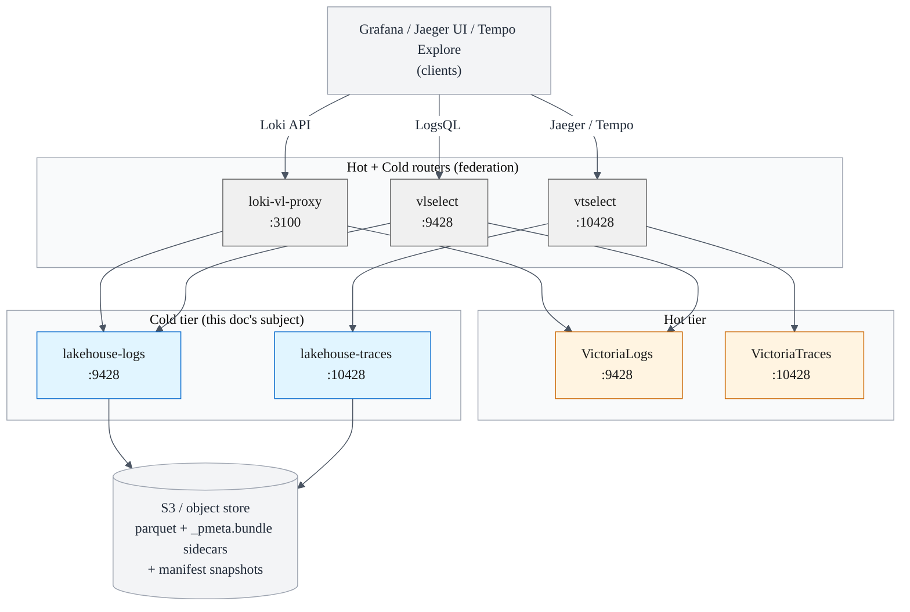
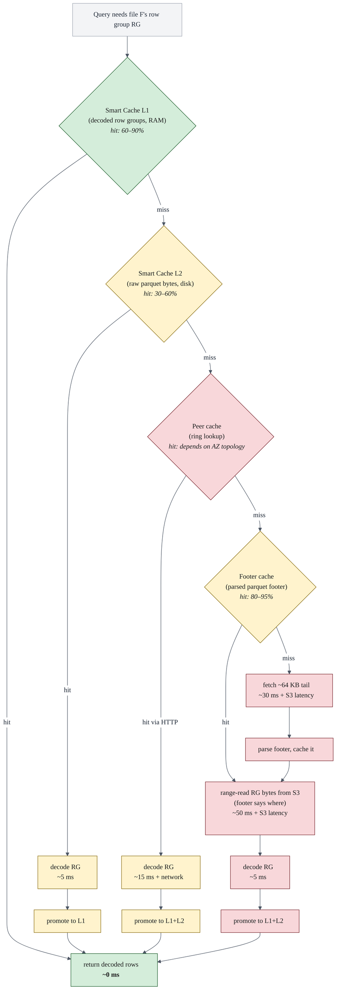

# Performance machinery

The complete inventory of speedup mechanisms in the LH cold tier, what each
costs in memory and disk, how each scales from a dev tier to a 50 M-file
PB cluster, and the configuration philosophy that keeps operators
out of the knob business unless they want to be in it.

This page is the single-source-of-truth reference; the per-package docs
(`docs/manifest-system.md`, `docs/cache-architecture.md`, etc.) zoom into
individual mechanisms. Read this first.

## Contents

1. [The shape of the system](#shape)
2. [Query lifecycle](#query-lifecycle)
3. [Write lifecycle](#write-lifecycle)
4. [Existing machinery — inventory](#existing-machinery)
   - [A. File narrowing before any S3 read](#a-file-narrowing)
   - [B. Read-side caches](#b-caches)
   - [C. Read-side parallelism + memory budgeting](#c-parallelism)
   - [D. Indexes written by the writer + compactor](#d-write-indexes)
   - [E. Write-side machinery](#e-write-side)
   - [F. Lifecycle / startup speedups](#f-lifecycle)
   - [G. Cross-tier / federated](#g-federation)
5. [Scale projections](#scale)
6. [Configuration philosophy + workload profiles](#configuration)
7. [Metrics coverage](#metrics)

---

## 1. The shape of the system {#shape}



A query that arrives at a router (`vlselect` / `vtselect` / `loki-vl-proxy`)
fans out to hot (VL or VT) **and** cold (the LH process) **in parallel** —
the union of both result sets is returned. Hot answers from in-memory
buffers + local disk; cold answers from S3 parquet narrowed through
the machinery in section 4.

## 2. Query lifecycle {#query-lifecycle}

The cascade. Each layer kills work for the next-most-expensive layer.
By the time we hit row-group decode (step 7) most files are already
gone.

```mermaid
%%{init: {'theme':'base', 'themeVariables':{'fontFamily':'-apple-system,BlinkMacSystemFont,Segoe UI,Roboto,sans-serif','primaryColor':'#f3f4f6','primaryTextColor':'#1f2937','primaryBorderColor':'#9ca3af','lineColor':'#4b5563','secondaryColor':'#e5e7eb','tertiaryColor':'#f9fafb','background':'#ffffff','mainBkg':'#f3f4f6','clusterBkg':'#f9fafb','clusterBorder':'#9ca3af','edgeLabelBackground':'#ffffff','textColor':'#1f2937'}}}%%
flowchart TD
    Q["Query arrives at LH"] --> Parse["1. Parse + registry resolve<br/><i>no I/O</i>"]
    Parse --> FastPath{"2. Pure<br/>* | stats count() ?"}
    FastPath -->|yes| FromManifest["Answer from manifest<br/>RowCount aggregate<br/><b>0 S3 reads</b>"]
    FastPath -->|no| Narrow["3. File narrowing"]

    Narrow --> Label{"3a. Inverted label index<br/>field → value → files"}
    Label -->|miss| LabelDrop["drop files NOT in set<br/><i>kills 60–90% at typical scale</i>"]
    Label -->|miss path| Stats

    LabelDrop --> Stats{"3b. ColumnStats<br/>min/max bracket"}
    Stats -->|out-of-range| StatsDrop["drop files<br/><i>kills 30–70%</i>"]
    StatsDrop --> Bloom

    Stats --> Bloom{"3c. File-level partition bloom"}
    Bloom -->|definitely-absent| BloomDrop["drop files<br/><i>kills 20–80% on selective queries</i>"]
    BloomDrop --> TraceIdx

    Bloom --> TraceIdx{"3d. _trace_idx pre-filter<br/>(traces only)"}
    TraceIdx -->|trace_id not in KV| TraceIdxDrop["drop files<br/><i>kills 100% on trace-by-id miss</i>"]
    TraceIdxDrop --> Smart

    TraceIdx --> Smart{"3e. Smart-cache fast path<br/>trace_id → known files"}
    Smart -->|cache hit| SmartHit["direct file set<br/><i>bypasses bloom + stats</i>"]
    Smart -->|miss| Prefetch

    Smart --> Prefetch["4. Footer prefetch<br/>16-way parallel, ~64KB tail<br/><i>still no row reads</i>"]
    Prefetch --> RGNarrow["5. Per-file row-group narrowing"]

    RGNarrow --> TimeRange{"5a. Time-range min/max"}
    TimeRange --> StatsRG{"5b. Column-stats per RG"}
    StatsRG --> BloomRG{"5c. Row-group bloom"}
    BloomRG --> TokenBloom{"5d. Token bloom<br/>(_msg search)"}

    TokenBloom -->|matched RGs| Decode["6. Decode row groups<br/><b>FIRST S3 byte reads</b>"]
    Decode --> Filter["7. Row filter (VL/VT)"]
    Filter --> Emit["8. Emit DataBlock"]

    classDef cheap fill:#d4edda,stroke:#155724,color:#1a1a1a
    classDef expensive fill:#f8d7da,stroke:#721c24,color:#1a1a1a
    classDef cache fill:#d1ecf1,stroke:#0c5460,color:#1a1a1a
    class Parse,FastPath,FromManifest,Label,Stats,Bloom,TraceIdx,Smart,LabelDrop,StatsDrop,BloomDrop,TraceIdxDrop,SmartHit cheap
    class Decode,Filter expensive
    class Prefetch,RGNarrow,TimeRange,StatsRG,BloomRG,TokenBloom cache
```



**The contract:** every green box reads only manifest/cached state.
Blue boxes read footers (small, cached). Red boxes read row data. The
target invariant is "most queries answer green; very few queries reach
red".

## 3. Write lifecycle {#write-lifecycle}

Every artifact the writer produces is what makes the query-side
cascade above possible.

```mermaid
%%{init: {'theme':'base', 'themeVariables':{'fontFamily':'-apple-system,BlinkMacSystemFont,Segoe UI,Roboto,sans-serif','primaryColor':'#f3f4f6','primaryTextColor':'#1f2937','primaryBorderColor':'#9ca3af','lineColor':'#4b5563','secondaryColor':'#e5e7eb','tertiaryColor':'#f9fafb','background':'#ffffff','mainBkg':'#f3f4f6','clusterBkg':'#f9fafb','clusterBorder':'#9ca3af','edgeLabelBackground':'#ffffff','textColor':'#1f2937'}}}%%
flowchart LR
    Ingest["POST /insert/...<br/>(logfmt/JSON/OTLP)"] --> Parse["1. Parse<br/><i>VL/VT upstream via patches</i>"]
    Parse --> Filter["2. Stream-shape filter<br/><i>drop trace-shaped rows from logs</i>"]
    Filter --> Gate["3. Cardinality gate<br/><i>per-tenant MaxStreams</i>"]
    Gate --> Buffer["4. Membuffer — logstorage in-memory parts<br/><i>durability (parts → PVC every flush interval) AND served via BufferBridge; no separate WAL</i>"]
    Buffer --> Flush{"5. Flush trigger<br/>size OR time?"}
    Flush -->|fire| Build["6. Build artifacts for the FUTURE reader"]

    Build --> A1["7a. extractLogLabels →<br/>FileInfo.Labels"]
    Build --> A2["7b. ColumnStats →<br/>manifest cache"]
    Build --> A3["7c. extractLogBloomValues →<br/>pmeta bloom facet"]
    Build --> A4["7d. tokenBloom →<br/>footer KV"]
    Build --> A5["7e. computeTraceIndex →<br/>_trace_idx KV (traces only)"]

    A1 --> Write["8. parquet.NewGenericWriter<br/>+ zstd[level 0=3]"]
    A2 --> Write
    A3 --> Write
    A4 --> Write
    A5 --> Write
    Write --> S3[("S3<br/>.parquet + _pmeta.bundle")]
    S3 --> Add["9. manifest.AddFile<br/><i>in-memory + PVC snapshot</i>"]

    Add --> Compact{"Background<br/>compactor"}
    Compact -->|merge L0 → L1 → L2| Re["progressive zstd<br/>(3 → 7 → 11)<br/>+ mergeFileLabels<br/>+ severity backfill"]
    Re --> S3

    classDef ingest fill:#fff4e1,stroke:#cc6600,color:#1a1a1a
    classDef build fill:#e1f5ff,stroke:#0066cc,color:#1a1a1a
    classDef storage fill:#d4edda,stroke:#155724,color:#1a1a1a
    class Ingest,Parse,Filter,Gate,Buffer,Flush ingest
    class Build,A1,A2,A3,A4,A5,Write build
    class S3,Add,Compact,Re storage
```



**Read-side cost: O(parquet rows scanned).**
**Write-side cost: O(rows ingested).**

Step 7 is where the writer pays its tax so the reader can be cheap.
Every artifact built in step 7 maps directly to a green box in the
query-lifecycle cascade above. Drop one of these artifacts and the
corresponding green box silently becomes a red box.

---

## 4. Existing machinery — inventory {#existing-machinery}

For every mechanism in sections A–G we record:

- **Code** — file + key function.
- **What it does** — one paragraph.
- **Memory cost** at PB scale (50 M files).
- **Disk cost** at PB scale.
- **Skip rate observed** in datagen — proxy for selectivity in production.

The PB-scale numbers assume the [worked example
in `docs/operations/sizing.md`](operations/sizing.md): 5 M files
per pod (10 pods in the cluster, 50 M global), `footer_max_items
= 200 000`, 1 GB L1, 100 GB L2.

### A. File narrowing — before any S3 read {#a-file-narrowing}

| Mechanism | Code | What it does | Mem @ PB | Disk @ PB | Typical skip |
|---|---|---|---:|---:|---:|
| **manifestFastPath** | `internal/storage/parquets3/storage_query.go::manifestFastPath` | `* \| stats count()` answers from `manifest.RowCount` without opening any file. | 0 (already in manifest) | 0 | 100 % of files |
| **Inverted label index** | `internal/manifest/manifest.go::GetFileKeysByLabel` + `storage_query.go::filterByLabelIndex` | Manifest holds `field → value → set-of-file-keys`. `service.name:="X"` resolves to candidates in O(1). Multi-field filters intersect sets. Files with `Labels=nil` stay in the candidate set (`be8c126`). | ~50 MB (5 M files × 5 fields × 2 values × 5 B) | 0 (rebuilt on snapshot load) | 60–90 % |
| **Column-stats min/max bracket** | `manifest.ColumnStatsContains` + `filter_pushdown.go::rowGroupMatchesFilter` | Parquet column-index min/max are cached on `FileInfo`. Row groups whose `[min, max]` don't bracket the filter value are skipped without opening the file. | ~200 MB (5 M × ~40 B per file) | 0 (cached) | 30–70 % |
| **File-level partition bloom** | `internal/pmeta` bloom facet + `storage_query.go::filterFilesByBloomIndex` (legacy `_bloom.bin` partition index as fallback) | Per-partition 1-hour-granularity bloom. Before opening a file, ask whether the queried value could possibly be there. Cap `maxBloomCardinality = 50 000`. | ~80 MB (one bloom per partition × ~5 K partitions × 16 KB) | ~300 MB on S3 (bloom facet in `_pmeta.bundle`; legacy `.bloom`/`_bloom.bin` sidecars stay readable) | 20–80 % |
| **Row-group bloom (in parquet footer)** | `parquet.SplitBlockFilter(10, …)` in `writer.go::writeLogsParquet` / `writeTracesParquet` | `service.name`, `k8s.*`, `host.name`, `trace_id`, `deployment.environment` get per-row-group blooms inside the parquet footer. `storage_query.go::bloomFilterSkip` consults them after the file is opened. | in footer cache (B) | ~5 % of parquet bytes | 10–50 % of row groups |
| **Token bloom KV per row group** | `token_bloom.go::tokenBloomSkip` + `extractSearchTokens` | Free-text tokens (`_msg:contains("OOM")`) checked against a trigram bloom in the footer KV per row group. | in footer cache | ~2 % of parquet bytes | 50–95 % on selective tokens |
| **Time-range row-group skip** | `storage_query.go::rowGroupMatchesTimeRange` | Timestamp column min/max vs query `[startNs, endNs]`. | in footer cache | 0 | 50–90 % for narrow windows |
| **Trace_idx pre-filter** (traces only) | `lakehouse-traces/storage_query.go::filterFilesByTraceIdx` (`1e3cf28`) | After bloom narrowing, drops files whose `_trace_idx` footer KV doesn't list any queried trace ID. Best-effort only — never authoritative (relaxed in `f083c8e` because the index lags fresh ingest). | in footer cache | ~500 B per file (_trace_idx KV) | up to 100 % on trace-by-id lookups |
| **Trace-id smart-cache fast path** | `smartcache.FindFilesByTraceID` | After a writer or reader has touched a trace ID, the smart cache maps it back to the file key directly. Bypasses bloom + column stats entirely. | bounded by L1 size | 0 | 100 % on cache hit |
| **`_trace_idx` footer KV positive lookup** | `lakehouse-traces/trace_index_lookup.go::LookupTraceIndex` | VT's trace-by-id Tempo handler asks for the (start, end) bound; we emit it straight from the footer KV. On miss we fall through to VT's natural `rewriteTraceIndexQuery` (per `f083c8e`). | in footer cache | (same _trace_idx as above) | sub-ms on hit |

### B. Read-side caches {#b-caches}

The cache hierarchy on every query path — what each layer holds, how
many bytes it reads from the layer below on miss, and the typical hit
rates we see in datagen.



**Headline cost.** A query that hits L1 returns in microseconds. A
query that misses everything pays one S3 footer round-trip + one
range-read + decode time. The optimisation surface is "make L1+L2
hit rate as high as possible without blowing the memory budget".


| Cache | Code | Purpose | Default size | Knob |
|---|---|---|---:|---|
| **Smart Cache L1 (memory)** | `internal/smartcache/Controller` + `internal/cache/LRU` | Decoded parquet row groups in RAM. LRU with peer-aware affinity. | 256 MiB (small), 1 GiB (PB) | `cache.memory_mb` |
| **Smart Cache L2 (disk)** | `internal/cache/DiskCache` | Raw parquet bytes on local disk; survives restarts. | 2 GiB (small), 100 GiB (PB) | `cache.disk_max_mb` |
| **Footer cache** | `internal/storage/parquets3/FooterCache` | LRU of parsed parquet footers (with `_trace_idx`, bloom, column index). | 10 000 (small), 200 000 (PB) | `cache.footer_max_items` |
| **Footer-cache disk snapshot** | `footer_cache_snapshot.go` (task 78) | LRU key-list snapshot persisted at shutdown; reloaded async after `/ready=200` so a restart doesn't refetch every footer from S3. | < 1 MiB on disk | persist_path |
| **PeerCache** | `internal/peercache` | Consistent-hash ring of peers' L1 caches. Local query knows which peer holds a key without asking. | bounded by peer count | k8s headless service |
| **Self-cache filter** | `storage_query.go::applyOwnedFilesFirst` + `LookupOwner` | Excludes files this pod owns from "fetch from peer" set; prevents peer→peer fan-out for files we already have. | — | none |

### C. Read-side parallelism + memory budgeting {#c-parallelism}

| Mechanism | Code | Effect | Default |
|---|---|---|---:|
| **File worker pool** | `storage_query.go::queryFile` + `cfg.Query.FileWorkers` | Concurrent file scans per query. | 8 |
| **Adaptive workers** | `internal/resourcebounds` + `cfg.Query.FileWorkersRequest/Limit` | Workers scale up under low load and down under cgroup memory pressure. | request 4, limit 16 |
| **Row-group decode semaphore (`rgDecodeSem`)** | `query_memory_budget.go` | Caps in-flight parquet row-group decodes; prevents OOM. | scaled from `MaxLiveBytes` |
| **Process-wide file budget (`fileBudgetSem`)** | `query_memory_budget.go` | Caps cumulative resident bytes across files (default 256 MiB) + max 8 concurrent files. | 256 MiB / 8 files |
| **Max-live-bytes budget** | `cfg.Query.MaxLiveBytes` | Per-query memory ceiling that the row-group decode pool respects. | 512 MiB |
| **Concurrent-select cap** | `cfg.Query.MaxConcurrent` | Global ceiling on simultaneous queries; reports 429 above. | 8 |
| **Footer prefetch parallel fan-out** | `footer_prefetch.go` | Before the per-file worker pool runs, fan out 16-way footer fetches for candidate files. 64 K tail + two-phase fetch for MB-scale trace footers. | 16 |
| **TraceIndex lookup parallelism** | `lakehouse-traces/trace_index_lookup.go` | 16-way concurrent footer KV reads when answering trace-by-id. | 16 |
| **Range reader** | `range_reader.go::shouldUseRangeRead` | Skips full-file download when we project < 60 % of columns; range-reads only the projected column chunks. | 60 % column threshold |

### D. Indexes written by the writer + compactor {#d-write-indexes}

| Artifact | Source | Used by | Size per file |
|---|---|---|---:|
| **pmeta bloom facet** (persisted in the partition `_pmeta.bundle`) | `extractLogBloomValues(rows)` + the pmeta `catalogObserver` | File-level skip in `filterFilesByBloomIndex`; legacy `.bloom`/`_bloom.bin` sidecars stay readable for pre-pmeta data | ~16 KiB |
| **Per-row-group bloom (in footer)** | `parquet.SplitBlockFilter(10, …)` | `bloomFilterSkip` per row group | ~5 % of file |
| **`_trace_idx` KV** (traces only) | `computeTraceIndex(rows)` + `marshalTraceIndex` | `filterFilesByTraceIdx`, `LookupTraceIndex` | ~500 B / 1 000 traces |
| **Token-bloom KV per row group** | `extractSearchTokens` + bloom build during compaction | `tokenBloomSkip` | ~2 % of file |
| **ColumnStats on `FileInfo`** | populated on flush from parquet column index | `filterByLabelIndex`, `rowGroupMatchesFilter` | ~40 B (cached) |
| **Labels on `FileInfo`** | `extractLogLabels` / `extractTraceLabels` + compactor `mergeFileLabels` (`be8c126`) | Inverted label index; survives compaction now | ~200 B (in manifest) |
| **`_trace_service_graph_stream=` rows** | Datagen / upstream marker; stored as top-level `parent` / `child` / `callCount` parquet columns | `/select/jaeger/api/dependencies` aggregation | — (regular rows) |

### E. Write side {#e-write-side}

| Mechanism | Code | Notes |
|---|---|---|
| **Progressive zstd by compaction level** | `cfg.Compaction.CompressionLevelByOutputLevel` (default `[3, 7, 11]`) + per-tenant override + `compactor.compactGroup` | Newer = faster compression, older = denser |
| **Compaction tenant isolation** | `groupFilesByTenant` + per-tenant compaction groups | Output files always single-tenant |
| **Stream-shape filter at ingest** | `streamshape.go::IsTraceShapedStream` | Drops trace rows from logs ingest at write time |
| **Tenant cardinality gate** | `vlstorage.SetCardinalityGate` | Refuses to admit rows above per-tenant `MaxStreams` |
| **Severity backfill at compaction** | `LogsSeverityTextBackfilledAtCompaction` metric | Heals historical files via `schema.DeriveSeverityText` |
| **Membuffer durability (no separate WAL)** | logstorage parts on the PVC | Unflushed rows persist via the buffer's own disk parts (written every flush interval, restored on open) |

### F. Lifecycle / startup speedups {#f-lifecycle}

| Mechanism | Code | Notes |
|---|---|---|
| **Manifest snapshot binary streaming decode** | `manifest.LoadFrom` (task 79) | Incremental decode, capped at 50 GiB |
| **Async footer cache reload** | `cmd/lakehouse-logs/main.go::footerCacheSnapshotPath` + `PrefetchFootersByKeys` | Restart skips refetching every footer |
| **Priority warmup (recent partitions first)** | `warmup.go` (task 80) | Last 24 h warm before older data |
| **BufferBridge serving unflushed data** | `buffer_bridge.go` + `SetSelfEndpoint` | Single-node self-loop, multi-node peer fan-out |
| **S3 backoff + jitter on 503 SlowDown** | `s3reader` (task 81) | Honors S3 throttle hints |
| **Manifest tenant-scoped LIST** | `manifest.refreshTenantScoped` | Replaces full-bucket walk with per-tenant LIST × per-tier signal suffix (`6c8fd99`) |
| **Manifest cliff guard** | `manifest.RefreshFromS3` (`a2c3c3f`) | Rejects refreshes that drop >50 % of files |
| **Adaptive log hints on slow query** | `internal/startup/hints.go` (task 82) | Surfaces "try lowering footer_max_items" etc. |

### G. Cross-tier / federated {#g-federation}

| Mechanism | Code |
|---|---|
| **vtselect federation (hot+cold)** | `vtselect:10428` — VT-natural router between `victoriatraces:10428` and `lakehouse-traces:10428` |
| **vlselect federation (hot+cold)** | `vlselect:9428` — same for logs (VL + LH-logs) |
| **loki-vl-proxy** | upstream 3rd-party — Loki API → LogsQL translator with windowed query cache |

---

## Where each artifact lives {#storage-medium}

Every speedup mechanism stores **state** somewhere — RAM, the pod's
local PVC, or S3. When operators size pods or buckets they need to
know which artifact lands where. This table is the master reference.

> "💾 PVC" is the per-pod persistent disk (helm chart default 50 GiB,
> bumped to 500 GiB at PB scale — see [sizing.md](operations/sizing.md)).
> "☁ S3" means the lakehouse bucket.

| # | Artifact | RAM | 💾 PVC | ☁ S3 | Lifecycle |
|---|---|:-:|:-:|:-:|---|
| 1 | **Manifest in-memory index** (`files`, `partitionMeta`, inverted label index, `sortedPartitions`, `byKey`, tenant aggregates) | ✅ primary | snapshot | — | rebuilt on `RefreshFromS3`; snapshotted on shutdown |
| 2 | **Manifest snapshot** (`manifest-snapshot.json`, binary-gob format) | — | ✅ primary | — | written at shutdown via `manifest.SaveTo` (task 73); loaded async at startup (task 79) |
| 3 | **Footer cache** (parsed parquet footers, includes embedded row-group bloom + `_trace_idx` + token bloom KVs) | ✅ primary | snapshot | — | LRU evicted under memory pressure |
| 4 | **Footer-cache snapshot** (`footer-cache-snapshot.bin`, LRU key-list only) | — | ✅ primary | — | written at shutdown (task 78); the actual footer bytes refetched from S3 by async prefetch after `/ready=200` |
| 5 | **Smart cache L1** (decoded parquet row groups) | ✅ primary | — | — | LRU; never persisted |
| 6 | **Smart cache L2** (raw parquet bytes) | — | ✅ primary | — | LRU on disk; survives restart |
| 7 | **PeerCache ring** (consistent-hash map of peer endpoints) | ✅ primary | — | — | derived from k8s headless service watch |
| 8 | **~~WAL~~ — folded into the membuffer** | — | — | — | **No separate LH WAL** (the old `internal/wal/` was removed). Durability of unflushed rows is the membuffer (#9): VL/VT-native logstorage in-memory parts persisted to the PVC every flush interval and restored on open. Crash-loss window = the last flush interval; long-term durability = the S3 Parquet flush. |
| 9 | **In-memory buffer** (unflushed rows served by `BufferBridge`) | ✅ primary | — | — | freed on flush |
| 10 | **`.parquet` data file** (row groups, column index, per-rowgroup blooms, footer KVs) | — | — | ✅ primary | written by flusher + compactor; deleted by retention |
| 11 | **`_pmeta.bundle`** (per-partition facets: file-meta, file-level bloom, field/value catalog) | mirror via `pmeta.Store` | — | ✅ primary | written by `PersistDirty` at flush; warmed at startup; self-heals from parquet footers. Legacy `.bloom`/`_bloom.bin` sidecars from pre-pmeta data stay readable |
| 12 | **Manifest's `_meta/` sidecar JSON** (legacy, read-only) | mirror on `FileInfo` | — | ✅ legacy | no longer written — file metadata is served from the pmeta file-meta facet; existing `_file_metadata.json` objects stay readable for pre-pmeta data |
| 13 | **Tombstones** (per-partition delete markers) | mirror | — | ✅ primary | loaded from S3 at startup; written by delete API |
| 14 | **Tenant aliases / policy** (`_meta/tenant-aliases.json`) | mirror | — | ✅ primary | survives across pods |
| 15 | **Tenant stats snapshot** (`stats/snapshot.json`) | mirror | — | ✅ primary | written by stats collector |
| 16 | **`_trace_idx` footer KV** (per-trace `{startNs, endNs}` aggregate per file) | inside footer cache | inside footer-cache snapshot | inside parquet file | written by `computeTraceIndex` at flush; survives compaction via merge |
| 17 | **Per-rowgroup bloom** (parquet `SplitBlockFilter` for promoted columns) | inside footer cache | — | inside parquet file | regenerated on compaction merge |
| 18 | **Token bloom KV** (trigram bloom per row group for `_msg` search tokens) | inside footer cache | — | inside parquet file | regenerated on compaction merge |
| 19 | **Lifecycle / ready state** (`lakehouse_serving_ready`, snapshot age, hint flags) | ✅ primary | — | — | pure process state |
| 20 | **Discovery cache** (peer hot/cold boundaries) | ✅ primary | snapshot in stats | — | refreshed by `manifest_push` heartbeat |

### Headline numbers at PB scale

| Where | Per pod | Cluster (10 pods) |
|---|---:|---:|
| **🧠 CPU** | steady-ingest 1–2 cores + query workload 2–4 cores burst + compaction 2–3 cores burst = **request 4 cores / limit 8 cores** | ~80 cores |
| **🧮 RAM** | manifest (1 GiB) + footer cache (10 GiB) + smart L1 (1 GiB) + membuffer (200 MiB) + lifecycle (300 MiB) = **~13 GiB** | ~130 GiB |
| **💾 PVC** | smart L2 (100 GiB) + manifest snapshot (500 MiB) + footer-cache snapshot (10 GiB) + bloom snapshot (8 GiB) + membuffer parts (2 GiB) = **~120 GiB** | per-pod (not cluster total) |
| **☁ S3** | — | parquet (PB) + `_pmeta.bundle` partition metadata (see [pb-scale-resources-pmeta](architecture/pb-scale-resources-pmeta.md)) + tombstones (~100 MiB) + tenant + stats (~10 GiB) |

The biggest in-RAM consumer is the **footer cache** (10 GiB at PB
scale). The biggest on-disk consumer is the **smart cache L2** (100
GiB), and the entire data set itself lives on S3.

CPU is **bursty, not steady**. The baseline 1–2 cores covers ingest
+ background tasks (manifest refresh, prefetch, snapshot). Query
peaks come from concurrent row-group decode (zstd unpack +
parquet column index walk) and compaction peaks from zstd encode
at the higher progressive levels. The request/limit ratio of 1:2
absorbs both peaks without throttling the steady-state.

CPU throttling at scale is most visible as
`lakehouse_compaction_partitions_in_flight` plateauing — the
compactor's per-output-level zstd budget hits the cgroup limit
and other partitions wait.

For a small/dev tier the numbers drop linearly with file count —
sub-GiB total RAM + 1–2 cores is normal.

### Per-mechanism CPU profile

| Mechanism | Steady CPU | Peak CPU | What drives the peak |
|---|---:|---:|---|
| Manifest in-memory index | < 0.05 core | 0.5 core | first-boot S3 LIST during `RefreshFromS3` |
| Manifest refresh (tenant-scoped) | 0.1 core / 30s | 0.5 core | parallel LIST fan-out (`tenantRefreshMaxParallel = 8`) |
| Inverted label index | 0 (lookup is map read) | < 0.1 core | rebuild on snapshot load |
| File-level bloom check | < 0.05 core | 0.3 core | per-query bloom marshalled into RAM check (sub-µs each) |
| Row-group bloom + column-stats skip | 0 (cached footer) | 0.1 core | first-time footer parse |
| Token bloom KV check | < 0.05 core | 0.2 core | trigram hash per query token |
| `_trace_idx` pre-filter | 0 | 0.3 core | parallel footer KV read (`traceIndexLookupParallelism = 16`) |
| **zstd decode (read)** | 0.5–1 core | **2–3 cores** | row-group decode dominates query CPU |
| **zstd encode (compaction)** | 0.5 core | **2–3 cores** | progressive schedule: L1=3 (light), L2=7 (medium), L3=11 (heavy) |
| Smart cache L1 lookup | 0 | < 0.1 core | LRU promote |
| Smart cache L2 (disk) read | 0 | 0.5 core | disk fault + memcpy |
| PeerCache HTTP fetch | 0 | 0.2 core | TCP + decompress |
| Footer prefetch fan-out | 0.05 core | 0.3 core | 16-way HTTP + parse (16 parallel goroutines) |
| BufferBridge (peer fan-out) | 0.05 core | 0.3 core | HTTP marshal + decode |
| Membuffer parts persist | 0.1 core | 0.3 core | fsync, scales with ingest rate |
| Stream-shape + cardinality gate (write) | < 0.05 core | 0.2 core | string scan per row |
| Severity / label / bloom extract (write) | 0.1 core | 0.5 core | full row scan per flush |

The two **load-bearing CPU consumers** are zstd decode (on read)
and zstd encode (on compaction). Both are CPU-bound and both
parallelise inside the file_workers / compaction.parallelism
budgets.

**zstd levels in parquet-go map to only 4 buckets** (see
`internal/compaction/compactor.go::zstdLevel`):

| Integer range | Library constant | ≈ MB/s | ≈ ratio |
|---|---|---:|---:|
| `≤ 1` | `zstd.SpeedFastest` | ~400 | 2.4× |
| `2–5` | `zstd.SpeedDefault` | ~100 | 2.8× |
| `6–10` | `zstd.SpeedBetterCompression` | ~30 | 3.1× |
| `11+` | `zstd.SpeedBestCompression` | ~15 | 3.3× |

So the default progressive schedule `[3, 7, 11]` lands in
`[Default, Better, Best]` — three of the four buckets, with L0
files getting the fastest, L2 the densest. **`[3, 9, 15]` is the
same schedule in practice**: 9 also maps to Better, 15 also maps to
Best. To move between buckets, change which bucket each level
targets — there is no continuous "more compression" knob.

The read-side cost is fixed: zstd decompresses any output level at
roughly the same speed regardless of which level was used to write.

### Re-derivation on restart

If the PVC is lost (e.g. a fresh pod scheduled on a new node), every
local-disk artifact is **rebuildable from S3**:

```mermaid
%%{init: {'theme':'base', 'themeVariables':{'fontFamily':'-apple-system,BlinkMacSystemFont,Segoe UI,Roboto,sans-serif','primaryColor':'#f3f4f6','primaryTextColor':'#1f2937','primaryBorderColor':'#9ca3af','lineColor':'#4b5563','secondaryColor':'#e5e7eb','tertiaryColor':'#f9fafb','background':'#ffffff','mainBkg':'#f3f4f6','clusterBkg':'#f9fafb','clusterBorder':'#9ca3af','edgeLabelBackground':'#ffffff','textColor':'#1f2937'}}}%%
flowchart LR
    PVCgone["💥 PVC lost"] --> S3List["S3 LIST<br/>(tenant-scoped<br/>refreshTenantScoped)"]
    S3List --> Manifest["rebuild manifest in RAM"]
    Manifest --> Bundle["fetch _pmeta.bundle<br/>per partition"]
    Bundle --> Labels["FileInfo.Labels, ColumnStats<br/>(file-meta facet)"]
    Labels --> Bloom["file-level blooms<br/>(bloom facet; legacy _bloom.bin<br/>for pre-pmeta data)"]
    Bloom --> BloomMem["in-RAM pmeta.Store"]
    BloomMem --> Footer["async footer prefetch<br/>(64KB tail per file)"]
    Footer --> Ready["/ready=200<br/>(serve_while_warming=204 in between)"]

    classDef rebuild fill:#fff3cd,stroke:#856404,color:#1a1a1a
    classDef ready fill:#d4edda,stroke:#155724,color:#1a1a1a
    class S3List,Manifest,Bundle,Labels,Bloom,BloomMem,Footer rebuild
    class Ready ready
```



The only piece that can't be rebuilt is the **membuffer** — un-flushed
ingest data on a lost PVC is lost. This is the durability tradeoff
documented in [docs/operations/lifecycle.md](operations/lifecycle.md).
Operators who can't tolerate that risk run the insert role with a
StatefulSet + PVC pinned to a node.

## 5. Scale projections {#scale}

The per-pod resource cost of each mechanism, as the global file count
scales from a dev sandbox to a PB cluster:

| Scale | Files | Manifest in-mem | Inverted label index | ColumnStats cache | Footer cache | Bloom data (S3, in `_pmeta.bundle`) | Smart cache L1 | Smart cache L2 |
|---|---:|---:|---:|---:|---:|---:|---:|---:|
| Dev / CI | 1 k | 200 KiB | 10 KiB | 40 KiB | 50 MiB | 16 MiB | 256 MiB | 2 GiB |
| Small prod | 10 k | 2 MiB | 100 KiB | 400 KiB | 500 MiB | 160 MiB | 256 MiB | 2 GiB |
| Medium | 100 k | 20 MiB | 1 MiB | 4 MiB | 2.5 GiB | 1.6 GiB | 512 MiB | 50 GiB |
| Large | 1 M | 200 MiB | 10 MiB | 40 MiB | 5 GiB | 16 GiB | 1 GiB | 100 GiB |
| PB-scale (per pod, 10 pods) | 5 M | 1 GiB | 50 MiB | 200 MiB | 10 GiB | 80 GiB total | 1 GiB | 100 GiB |
| **Total** PB cluster (10 pods × 5 M) | 50 M | 10 GiB cluster | 500 MiB cluster | 2 GiB cluster | 100 GiB cluster | 80 GiB S3 | 10 GiB cluster | 1 TiB cluster |

### CPU at each scale (per pod)

| Scale | Files | Ingest baseline | Query peak | Compaction peak | k8s `requests` / `limits` |
|---|---:|---:|---:|---:|---|
| Dev / CI | 1 k | 0.1 core | 0.5 core | 0.5 core | 250m / 1 |
| Small prod | 10 k | 0.5 core | 1 core | 1 core | 500m / 2 |
| Medium | 100 k | 1 core | 2 cores | 2 cores | 1 / 4 |
| Large | 1 M | 1–2 cores | 3 cores | 2–3 cores | 2 / 6 |
| PB-scale | 5 M per pod | 1–2 cores | 2–4 cores burst | 2–3 cores burst | 4 / 8 |

CPU caveats:

- **Steady ingest** scales with rows/sec, not files. A 1 GB/s ingest tier sits at ~1.5 cores regardless of whether the manifest holds 10 k or 5 M files.
- **Query peak** is dominated by zstd decode + parquet column index walks. Concurrent queries multiply by `cfg.Query.MaxConcurrent` (default 8) but each query respects `MaxLiveBytes` (default 512 MiB) which bounds the decode parallelism.
- **Compaction peak** scales with the progressive zstd schedule. Default `[3, 7, 11]` puts ~80 % of CPU cost in the rare L3 outputs; if you flatten to `[7, 7, 7]` the compactor uses roughly 2× more CPU but produces denser L1 files.
- **Throttling indicator**: `lakehouse_compaction_partitions_in_flight` plateauing at < the configured `cfg.Compaction.Parallelism` is the canary that the cgroup CPU limit is being hit during compaction. If the gauge sits below the configured target while compaction lag rises, give the pod more CPU.

**Read this carefully**: every entry that says "MiB" is what's loaded
into a Go process. The footer cache is the biggest in-process
allocation — every entry past line 4 in the section A table that
mentions "in footer cache" is sharing this single pool. At PB scale
the footer cache alone consumes 10 GiB per pod and the manifest
another 1 GiB; the operator-tunable knobs (`cache.memory_mb`,
`cache.disk_max_mb`, `cache.footer_max_items`) all gate this, and
the [sizing guide](operations/sizing.md) records the actual worked
examples for k8s pod limits.

The PB-scale row of the table is the failure mode the [PB-scale audit](petabyte-scale-audit.md) discusses
— without the lifecycle speedups in section F and the file
narrowing in section A, the per-query S3 budget would not survive.

---

## 6. Configuration philosophy + workload profiles {#configuration}

The product principle is:

> Operators choose **one** profile. Every other knob derives a sane
> default from there. Operators who want to override individual knobs
> can — the defaults never lie to them.

### Profiles

```yaml
# config.yaml — pick exactly one of these
profile: dev    # | small | medium | large | pb
```

Each profile sets:

| Profile | RAM | Disk | Workers | Caches | Compaction | Notes |
|---|---:|---:|---:|---|---|---|
| `dev` | 1 GiB | 10 GiB | 4 | 256 MiB L1 / 2 GiB L2 / 10 k footers | serial | datagen-shape; CI; demos |
| `small` | 2 GiB | 50 GiB | 8 | 256 MiB / 2 GiB / 10 k | serial | < 10 k files; single tenant |
| `medium` | 4 GiB | 100 GiB | 12 | 512 MiB / 50 GiB / 50 k | 2-way parallel | up to 100 k files |
| `large` | 8 GiB | 200 GiB | 16 | 1 GiB / 100 GiB / 100 k | 4-way parallel | up to 1 M files |
| `pb` | 16 GiB | 500 GiB | 24 | 1 GiB / 100 GiB / 200 k | 8-way parallel + adaptive | 5 M+ files per pod |

Each profile is enacted by `internal/config/profiles.go`.

### Per-tenant overrides

Single global profile + per-tenant overrides for the most
disruptive knobs (`MaxStreams`, `MaxRowsPerSec`, `MaxBytesPerSec`,
compression schedule). See [docs/multi-tenancy.md](multi-tenancy.md).

### Knobs operators should ever touch

- `profile` (this section)
- `tenants.<name>.MaxStreams` and friends (per-tenant)
- `s3.endpoint`, `s3.bucket`, `s3.region` (deployment)
- `peer.*` (k8s service name)

### Knobs operators should never touch (system-managed)

- `cache.memory_mb`
- `cache.disk_max_mb`
- `cache.footer_max_items`
- `query.file_workers*`
- `query.max_live_bytes`
- `compaction.parallelism`
- `manifest.refresh_interval`

The profile defaults maintain these; override individual knobs only
with a measured reason.

---

## 7. Metrics coverage {#metrics}

Every mechanism in section 4 must publish:

1. **A rate / hit-ratio metric** so operators can see it's doing work.
2. **A size / current metric** so capacity planning is observable.
3. **A skip metric** (where applicable) — how often the mechanism
   short-circuits the next-most-expensive layer.

Today's coverage:

| Section | Metric pattern | Status |
|---|---|---|
| 4A.1 manifestFastPath | `lakehouse_manifest_fast_path_total` | ✅ |
| 4A.2 inverted label index | `lakehouse_parquet_row_groups_skipped_total{reason="label_index"}` | ✅ |
| 4A.3 column-stats skip | `lakehouse_parquet_row_groups_skipped_total{reason="stats"}` | ✅ |
| 4A.4 file-level bloom | `lakehouse_parquet_files_skipped_bloom_total` | ✅ |
| 4A.5 row-group bloom | `lakehouse_parquet_row_groups_skipped_total{reason="bloom"}` | ✅ |
| 4A.6 token bloom | `lakehouse_parquet_row_groups_skipped_total{reason="token_bloom"}` | ✅ |
| 4A.8 trace_idx pre-filter | `lakehouse_trace_idx_prefilter_files_total{result="dropped\|kept_match\|kept_unindexed\|kept_error"}` | ✅ |
| 4A.9 trace-id smart cache | `lakehouse_trace_id_cache_hits_total` | ✅ |
| 4A.10 LookupTraceIndex | `lakehouse_trace_index_lookups_total{result}` | ✅ |
| 4B caches | `lakehouse_cache_*_total / _bytes` (multiple) | ✅ |
| 4C parallelism | `lakehouse_resourcebound_query_file_workers_*` | ✅ |
| 4D writer artifacts | `lakehouse_writer_{bloom_builds,bloom_values,label_extractions,label_values,trace_idx_builds,trace_idx_entries}_total{mode}` + matching `_duration_seconds` histograms | ✅ |
| 4E progressive zstd | `lakehouse_compaction_compression_ratio{output_level}` (histogram) + `lakehouse_compaction_compression_level_used{output_level}` (gauge) | ✅ |
| 4F lifecycle | `lakehouse_startup_*`, `lakehouse_manifest_*` (rich) | ✅ |
| 4G federation | none on the LH side; federation lives in vtselect/vlselect | — |

---

## Cross-references

- [docs/operations/sizing.md](operations/sizing.md) — what to set memory and disk to
- [docs/architecture/scaling-restart-scenarios.md](architecture/scaling-restart-scenarios.md) — what these caches do during restart
- [docs/cache-architecture.md](cache-architecture.md) — deep-dive on the L1/L2/footer caches
- [docs/manifest-system.md](manifest-system.md) — the manifest, including signal-suffix + cliff-guard fixes
- [docs/bloom-index.md](bloom-index.md) — file-level bloom mechanics
- [docs/petabyte-scale-audit.md](petabyte-scale-audit.md) — the audit that motivated several of the lifecycle items
- [docs/observability.md](observability.md) — the metrics surface
- [docs/configuration.md](configuration.md) — current knobs
