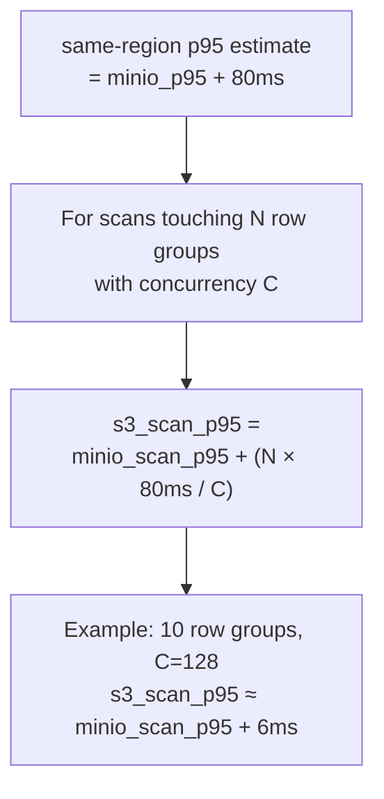

# Performance

## Latency Targets

End-to-end latency from HTTP request to first response byte. "Cold" means L1/L2 cache empty (S3 fetch required). "Warm" means L2 disk hit (no S3 call).

| Query type | Lakehouse cold | Lakehouse warm | Loki (S3+TSDB) | VL/VT (disk) |
|---|---|---|---|---|
| Exact filter (trace_id) | <2s | <500ms | 3–8s | 100–300ms |
| Exact filter (service_name) | <1.5s | <400ms | 2–5s | 80–200ms |
| Wildcard / hits volume graph | <1s | <300ms | 2–5s | 50–200ms |
| stats_query_range | <2s | <1s | 3–10s | 100–400ms |
| field_names / field_values | <500ms | <200ms | 1–3s | 20–80ms |
| Manifest fast path (no data) | <1ms | <1ms | 50–200ms | <1ms |

VL/VT values are reference baselines for hot-tier data served from local disk. Lakehouse is not intended to match disk latency; it targets 2–5x better than Loki on equivalent cold data.

---

## Benchmark Methodology

All benchmarks run locally against MinIO (Docker). MinIO eliminates S3 network variance and gives a reproducible baseline. S3 estimates are derived by adding the first-byte overhead formula below.

### Three data tiers

| Tier | File count | Approx rows | Target use |
|---|---|---|---|
| Small | 500 files | ~250K rows | Unit / CI gate |
| Medium | 10K files | ~5M rows | Integration / nightly |
| Large | 50K files | ~25M rows | Full load test |

### Benchmark modes

```bash
# Start MinIO
docker run -d -p 9000:9000 \
  -e MINIO_ROOT_USER=minioadmin \
  -e MINIO_ROOT_PASSWORD=minioadmin \
  minio/minio server /data

# Generate test data (medium tier example)
go run ./cmd/datagen \
  --endpoint=http://localhost:9000 \
  --logs=5000000 \
  --hours-back=168

# Latency benchmark (reports p50/p95/p99, fails if targets missed)
go run ./cmd/loadtest -mode=latency -target=http://localhost:9428

# Throughput stress (insert + query concurrency)
go run ./cmd/loadtest -mode=throughput -target=http://localhost:9428

# File size / compression matrix
go run ./cmd/loadtest -mode=benchmark -output=results.json

# All modes in sequence
go run ./cmd/loadtest -mode=all -target=http://localhost:9428
```

Nightly CI runs the full suite via `.github/workflows/nightly-loadtest.yaml`. Latency benchmarks fail the workflow if targets are exceeded.

### S3 latency extrapolation



---

## Tuning Guide

### Query concurrency and parallelism

| Setting | Default | Impact |
|---|---|---|
| `query.max_concurrent` | 32 | Max simultaneous queries. Excess requests return HTTP 429. Increase on multi-core nodes with high query rate. |
| `query.file_workers` | 8 | Parquet files processed in parallel per query. Higher values reduce latency on wide time ranges at the cost of memory. |
| `query.timeout` | 30s | Per-request deadline. Increase for large time-range scans; keep low for interactive dashboards. |
| `query.slow_threshold` | 5s | Queries exceeding this are logged as slow. Set to 0 to disable. |

### Cache sizing

| Setting | Default | Impact |
|---|---|---|
| `cache.memory_limit` | 512MB | L1 in-process LRU. Should hold the working set of hot Parquet footers and bloom filters. Increase to reduce L2 reads. |
| `cache.disk_path` | `/data/lakehouse/cache` | L2 disk cache location. Use a fast local SSD (gp3 or io1). |
| `cache.disk_limit` | 50GB | L2 LRU cap. Size to cover the most frequently queried time window. |
| `cache.eviction_watermark` | 0.8 | L2 eviction starts at 80% full. Lower to be more aggressive. |

Smart cache TTL settings (in `smart_cache`):

| Setting | Default | Impact |
|---|---|---|
| `smart_cache.max_age` | 24h | Entry TTL. Hot entries and pinned entries survive past this. |
| `smart_cache.hot_access_threshold` | 3 | Accesses within `hot_window` to mark an entry hot. |
| `smart_cache.hot_window` | 10m | Rolling window for hot detection. |
| `smart_cache.target_hours` | 24 | Sizing target for automatic cache budget estimation. |
| `smart_cache.query_grace_period` | 5m | Pin grace period after query completes. |

### Insert path

| Setting | Default | Impact |
|---|---|---|
| `insert.flush_interval` | 60s | How often partition buffers are flushed to S3. Lower reduces tail latency to S3; higher improves write throughput and compression. |
| `insert.target_file_size` | 128MB | Compressed size threshold that triggers an early flush. Tune with `insert.row_group_size` together. |
| `insert.row_group_size` | 10000 | Rows per Parquet row group. Larger row groups improve column stats pruning; smaller groups reduce memory per flush. |
| `insert.compression_level` | 7 | ZSTD compression level. Level 7 gives 6x+ compression at ~260 MB/s write speed. Level 3 is 5x faster writes with ~25% less compression. Level 11+ gives <2% gain at 5x slower writes — not recommended. |
| `insert.wal_enabled` | false | Enable WAL for crash recovery. Required for `ack_mode: committed`. |
| `insert.wal_max_bytes` | 512MB | WAL size cap. Writes block when full. |

### Bloom index

Bloom columns are configured per mode. Adding columns increases index memory and write overhead but enables file-skip for exact-match queries on that field.

```yaml
logs:
  bloom_columns: [trace_id, service.name, host.name, k8s.namespace.name, k8s.pod.name, k8s.deployment.name, deployment.environment]
traces:
  bloom_columns: [trace_id, service.name, span.name]
```

For high-cardinality fields (trace_id), bloom filters skip the vast majority of files on point lookups, reducing cold latency from seconds to the cost of a single file fetch.

Bloom filters now support the `in()` operator for multi-value queries (e.g., `service.name:in("api","web")`), generating one bloom check per value.

### Column projection

When a query references only a few fields (e.g., `trace_id:="abc123"`), the query engine automatically detects the referenced columns and skips deserializing unused parquet columns. This reduces I/O and CPU for narrow queries by 2-4x.

Column projection is automatic — no configuration needed. Wildcard or free-text queries fall back to reading all columns.

### Manifest partition index

`GetFilesForRange` uses a sorted partition index with binary search (O(log P)) instead of iterating all partitions linearly (O(P)). This is most impactful for large time ranges with thousands of hourly partitions.

### File size and row group recommendations

| Target file size | Row group size | Use case |
|---|---|---|
| 10 MB | 1K–5K rows | Low ingest rate, many small tenants |
| 50 MB | 10K rows | Recommended default: best balance of S3 GET efficiency and row group stats pruning |
| 100 MB | 10K–50K rows | High ingest rate, large time-range queries |

Larger files reduce S3 LIST and GET request counts. Larger row groups improve timestamp statistics pruning for time-range scans.

---

## Compression Reference

Measured on production-realistic data (ZSTD, logs and traces).

| ZSTD Level | Write speed | Logs ratio | Traces ratio |
|---|---|---|---|
| 1 | ~340 MB/s | 4.4x | 6.9x |
| 3 | ~320 MB/s | 4.6x | 7.9x |
| **7 (default)** | **~260 MB/s** | **6.1x** | **9.4x** |
| 11+ | ~63 MB/s | 6.2x | 9.7x |

Read latency is nearly flat across levels (1.3x variation). Level 7 is the default; level 11+ is not recommended (< 2% gain at 5x write cost).

Column breakdown for typical log data:
- `body` (free text): 2–4x
- `service.name` (low cardinality): 50–200x
- `timestamp_unix_nano` (monotone): 10–50x
- `trace_id` (random): 1.5–3x
- `k8s.*` fields (low cardinality): 20–100x
