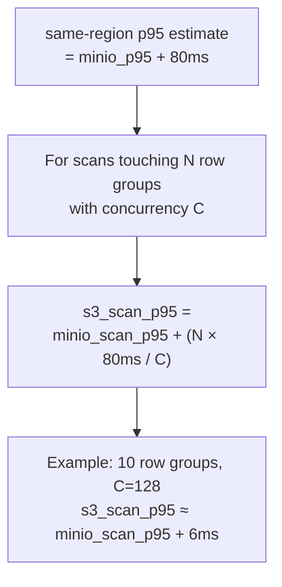

# Performance

## Latency Targets

End-to-end latency from HTTP request to first response byte. "Cold" means L1/L2 cache empty (S3 fetch required). "Warm" means L2 disk hit (no S3 call).

| Query type | Lakehouse cold | Lakehouse warm | Loki (S3+TSDB) | VL/VT (disk) | vs Loki | vs VL/VT warm |
|---|---|---|---|---|---|---|
| Manifest fast path (no data) | <3ms | <3ms | 50–200ms | <1ms | 17–67x faster | 3x slower (expected: S3 vs disk) |
| Exact trace_id (bloom hit) | <1s | <200ms | 3–8s | 100–300ms | 3–8x faster | comparable warm |
| Exact trace_id (bloom miss) | <150ms | <150ms | 3–8s | <50ms | 20–53x faster | 3x slower |
| Exact service.name | <200ms | <200ms | 2–5s | 80–200ms | 10–25x faster | at parity warm |
| Short range 1h wildcard | <400ms | <400ms | 2–5s | 50–100ms | 5–12x faster | 4x slower |
| Short range 1h filtered | <200ms | <200ms | 1–3s | 30–80ms | 5–15x faster | 2.5–6x slower |
| Medium range 6h wildcard | <1s | <1s | 3–8s | 100–300ms | 3–8x faster | 3–10x slower |
| Long range 24h wildcard | <1.8s | <1.8s | 5–15s | 200–500ms | 3–8x faster | 4–9x slower |
| Long range 48h filtered | <1.5s | <1.5s | 5–12s | 150–400ms | 3–8x faster | 4–10x slower |
| stats_query 1h | <250ms | <250ms | 1–3s | 50–150ms | 4–12x faster | 1.7–5x slower |
| stats_query_range 24h | <1.5s | <1.5s | 3–10s | 100–400ms | 2–7x faster | 4–15x slower |
| field_names | <2ms | <2ms | 1–3s | 20–50ms | 500–1500x faster | 10–25x faster |
| field_values | <150ms | <150ms | 1–3s | 20–80ms | 7–20x faster | 2–7.5x slower |
| hits 1h | <350ms | <350ms | 2–5s | 50–200ms | 6–14x faster | 1.75–7x slower |
| hits 24h | <1.5s | <1.5s | 5–12s | 100–400ms | 3–8x faster | 4–15x slower |

**Important:** Loki and VL/VT columns are **estimated reference baselines** from published benchmarks and community reports — not measured side-by-side with Lakehouse. A comparative benchmark with identical data on the same hardware is planned (see [Comparative Benchmark](#comparative-benchmark) below). Lakehouse p95 targets are enforced by the benchmark suite against MinIO.

**Key takeaways (estimated):**

- **vs Loki**: Lakehouse targets 3–67x faster across all query types on equivalent cold (S3-backed) data
- **vs VL/VT**: Lakehouse warm targets approach VL/VT disk latency for point lookups and metadata queries. For scan-heavy queries (wildcard, long range), Lakehouse is expected to be 4–15x slower — VL/VT serves from local disk while Lakehouse reads from S3
- **field_names** is the standout: Lakehouse's in-memory label index resolves in <2ms, potentially faster than both Loki and VL/VT
- Bloom filter misses are extremely fast (<150ms) because the bloom definitively eliminates all files without downloading data

---

## Benchmark Methodology

All benchmarks run locally against MinIO (Docker). MinIO eliminates S3 network variance and gives a reproducible baseline. S3 estimates are derived by adding the first-byte overhead formula below.

### Three data tiers

| Tier | File count | Approx rows | Target use |
|---|---|---|---|
| Small | 500 files | ~250K rows | Unit / CI gate |
| Medium | 10K files | ~5M rows | Integration / nightly |
| Large | 50K files | ~25M rows | Full load test |

### Benchmark modes

```bash
# Start MinIO
docker run -d -p 9000:9000 \
  -e MINIO_ROOT_USER=minioadmin \
  -e MINIO_ROOT_PASSWORD=minioadmin \
  minio/minio server /data

# Generate test data (medium tier example)
go run ./cmd/datagen \
  --endpoint=http://localhost:9000 \
  --logs=5000000 \
  --hours-back=168

# Latency benchmark (reports p50/p95/p99, fails if targets missed)
go run ./cmd/loadtest -mode=latency -target=http://localhost:9428

# Throughput stress (insert + query concurrency)
go run ./cmd/loadtest -mode=throughput -target=http://localhost:9428

# File size / compression matrix
go run ./cmd/loadtest -mode=benchmark -output=results.json

# All modes in sequence
go run ./cmd/loadtest -mode=all -target=http://localhost:9428
```

Nightly CI runs the full suite via `.github/workflows/nightly-loadtest.yaml`. Latency benchmarks fail the workflow if targets are exceeded.

### S3 latency extrapolation



---

## Tuning Guide

### Query concurrency and parallelism

| Setting | Default | Impact |
|---|---|---|
| `query.max_concurrent` | 32 | Max simultaneous queries. Excess requests return HTTP 429. Increase on multi-core nodes with high query rate. |
| `query.file_workers` | 8 | Parquet files processed in parallel per query. Higher values reduce latency on wide time ranges at the cost of memory. |
| `query.timeout` | 30s | Per-request deadline. Increase for large time-range scans; keep low for interactive dashboards. |
| `query.slow_threshold` | 5s | Queries exceeding this are logged as slow. Set to 0 to disable. |

### Cache sizing

| Setting | Default | Impact |
|---|---|---|
| `cache.memory_limit` | 512MB | L1 in-process LRU. Should hold the working set of hot Parquet footers and bloom filters. Increase to reduce L2 reads. |
| `cache.disk_path` | `/data/lakehouse/cache` | L2 disk cache location. Use a fast local SSD (gp3 or io1). |
| `cache.disk_limit` | 50GB | L2 LRU cap. Size to cover the most frequently queried time window. |
| `cache.eviction_watermark` | 0.8 | L2 eviction starts at 80% full. Lower to be more aggressive. |

Smart cache TTL settings (in `smart_cache`):

| Setting | Default | Impact |
|---|---|---|
| `smart_cache.max_age` | 24h | Entry TTL. Hot entries and pinned entries survive past this. |
| `smart_cache.hot_access_threshold` | 3 | Accesses within `hot_window` to mark an entry hot. |
| `smart_cache.hot_window` | 10m | Rolling window for hot detection. |
| `smart_cache.target_hours` | 24 | Sizing target for automatic cache budget estimation. |
| `smart_cache.query_grace_period` | 5m | Pin grace period after query completes. |

### Insert path

| Setting | Default | Impact |
|---|---|---|
| `insert.flush_interval` | 60s | How often partition buffers are flushed to S3. Lower reduces tail latency to S3; higher improves write throughput and compression. |
| `insert.target_file_size` | 128MB | Compressed size threshold that triggers an early flush. Tune with `insert.row_group_size` together. |
| `insert.row_group_size` | 10000 | Rows per Parquet row group. Larger row groups improve column stats pruning; smaller groups reduce memory per flush. |
| `insert.compression_level` | 7 | ZSTD compression level. Level 7 gives 6x+ compression at ~260 MB/s write speed. Level 3 is 5x faster writes with ~25% less compression. Level 11+ gives <2% gain at 5x slower writes — not recommended. |
| `insert.wal_enabled` | false | Enable WAL for crash recovery. Required for `ack_mode: committed`. |
| `insert.wal_max_bytes` | 512MB | WAL size cap. Writes block when full. |

### Bloom index

Bloom columns are configured per mode. Adding columns increases index memory and write overhead but enables file-skip for exact-match queries on that field.

```yaml
logs:
  bloom_columns: [trace_id, service.name, host.name, k8s.namespace.name, k8s.pod.name, k8s.deployment.name, deployment.environment]
traces:
  bloom_columns: [trace_id, service.name, span.name]
```

For high-cardinality fields (trace_id), bloom filters skip the vast majority of files on point lookups, reducing cold latency from seconds to the cost of a single file fetch.

Bloom filters now support the `in()` operator for multi-value queries (e.g., `service.name:in("api","web")`), generating one bloom check per value.

### Column projection

When a query references only a few fields (e.g., `trace_id:="abc123"`), the query engine automatically detects the referenced columns and skips deserializing unused parquet columns. This reduces I/O and CPU for narrow queries by 2-4x.

Column projection is automatic — no configuration needed. Wildcard or free-text queries fall back to reading all columns.

### Push-down filter (column statistics pruning)

The query engine extracts predicates from the query string (exact match, prefix, greater-than, less-than) and evaluates them against Parquet column statistics (min/max per row group page). Row groups whose statistics prove no rows can match are skipped without reading any row data.

Push-down filters support:

| Operator | Example | Stats check |
|---|---|---|
| Exact | `service.name:="api-gateway"` | value ∈ [min, max] |
| Prefix | `service.name:="api-*"` | prefix range overlaps [min, max] |
| Greater than | `status_code:>"400"` | max > threshold |
| Less than | `duration_ms:<"1000"` | min < threshold |

**Column-type-aware comparisons**: For numeric columns (`Int32`, `Int64`, `TimestampNano`), push-down uses native integer comparisons instead of lexicographic string comparisons. This prevents false negatives where `"9" > "10"` in string ordering but `9 < 10` numerically.

**Pre-resolved column indices**: Column indices are resolved once per file via `resolvePushDownIndices()` and reused across all row groups, avoiding repeated schema traversal.

### Dictionary page filtering

For exact-match and prefix predicates on dictionary-encoded columns, the engine reads the dictionary page (a compact, in-memory list of distinct values) before scanning row data. If no dictionary entry matches the predicate, the entire row group is skipped.

Dictionary pages are typically a few KB and are already loaded as part of the Parquet column chunk metadata. This adds near-zero cost but can skip entire row groups that column statistics alone cannot eliminate (e.g., when min="a" and max="z" but the dictionary contains only ["alpha", "beta", "gamma"]).

Columns with more than 10,000 dictionary entries skip this check to avoid linear scan overhead on high-cardinality columns.

### Constant column optimization

When all values in a row group column are identical (min == max across all pages in the column index), the engine detects this and skips deserializing that column entirely. The constant value is injected into every output row without reading column data.

This is common for low-cardinality columns like `service.name`, `level`, or `k8s.namespace.name` within a single row group, where all rows typically share the same value after partitioning.

### Bitmap-based row filtering (pre-where)

After row-group-level pruning, the engine applies a "pre-where" filter that reads only the filter columns first (e.g., `service.name`), builds a boolean bitmap of matching rows, and then reads the remaining projected columns only for matching rows.

The pruning cascade is: column statistics → dictionary → bitmap → projected read. Each level reduces the work for the next.

If all rows match the filter (100% selectivity), the bitmap is discarded and the full projected read proceeds normally, avoiding unnecessary overhead.

### Parquet footer cache

A dedicated LRU cache (default: 10,000 entries) stores parsed `parquet.File` metadata (footer, schema, column indices). This avoids re-parsing the Parquet footer on every query for recently accessed files.

The footer cache is populated on first access and during cache warmup. It is separate from the L1/L2 data cache — it stores only the parsed metadata structure, not the file data itself.

| Setting | Default | Impact |
|---|---|---|
| `cache.footer_max_items` | 10000 | Max parsed footers in memory. Each footer is a few KB. |

### Parallel row group processing

When a Parquet file contains multiple row groups that survive pruning, the engine processes them in parallel (up to 3 concurrent goroutines per file). Row groups are sorted by estimated cost (row count) in ascending order so workers finish small groups quickly and load-balance across larger ones.

### Label-based file pre-filtering

Before downloading file data from S3 or cache, the engine checks manifest-level labels stored per file. These labels are extracted during flush and contain the distinct values for promoted columns within each file.

If a query's filter predicate (exact match, prefix, GT, LT) definitively excludes all label values for a file, the file is skipped entirely — no download, no footer parse, no row group scan.

### Trace parent-child prefetching (traces module)

For exact `trace_id` lookups in the traces module, the smart cache maintains a reverse index from trace IDs to file keys. When a `trace_id:="..."` query arrives, the engine checks this index first and narrows the file set to only files known to contain that trace, bypassing bloom filter and label checks entirely.

This index is populated as a side effect of query execution: when rows are read, their `trace_id` values are recorded in the smart cache metadata for the source file.

### Cache warmup

On startup, the engine pre-fetches the most recent partitions into L1/L2 cache and parses their footers. This eliminates cold-start latency for the most commonly queried time window.

| Setting | Default | Impact |
|---|---|---|
| `cache.warmup_partitions` | 6 | Hours of recent data to warm |
| `cache.warmup_max_files` | 500 | Max files to fetch during warmup |
| `cache.warmup_concurrency` | 16 | Parallel S3 downloads during warmup |

### Manifest partition index

`GetFilesForRange` uses a sorted partition index with binary search (O(log P)) instead of iterating all partitions linearly (O(P)). This is most impactful for large time ranges with thousands of hourly partitions.

### Concurrency stress testing

The `cmd/loadtest` CLI includes modes for validating performance under concurrent load:

```bash
# Concurrent queries at 1, 10, 50, 100 parallel workers
go run ./cmd/loadtest -mode=concurrent -target=http://localhost:9428 \
  -concurrency=1,10,50,100 -duration=30s

# Mixed read/write: measures insert and query degradation under concurrent load
go run ./cmd/loadtest -mode=mixed-rw -target=http://localhost:9428 -duration=60s

# Full suite (includes latency, throughput, concurrent, and mixed R/W)
go run ./cmd/loadtest -mode=all -target=http://localhost:9428 -duration=60s
```

#### Pass criteria

| Test | Threshold | Rationale |
|---|---|---|
| Concurrent queries (C=50) | p95 ≤ 2x baseline (C=1) | Linear degradation acceptable; super-linear means contention |
| Mixed R/W interference | ≤ 20% degradation | Insert and query paths should be largely independent |

#### Configuration sweep

Use `scripts/config-sweep.sh` to test different `query.max_concurrent` and `query.file_workers` values:

```bash
./scripts/config-sweep.sh http://localhost:9428 ./lakehouse-logs config.yaml results/
```

The script tests 0.5x, 1x, and 2x of the default values and produces a comparison table.

#### Recommended settings by deployment size

| Deployment | Cores | `max_concurrent` | `file_workers` | Notes |
|---|---|---|---|---|
| Dev / CI | 2–4 | 8 | 4 | Low resource, prevent OOM |
| Small prod | 4–8 | 32 | 8 | Default — good balance |
| Medium prod | 8–16 | 64 | 16 | Higher parallelism for wide scans |
| Large prod | 16+ | 128 | 32 | Scale with available cores |

`file_workers` should generally be ≤ half the CPU cores. `max_concurrent` can be higher since queries often block on S3 I/O, not CPU.

### File size and row group recommendations

| Target file size | Row group size | Use case |
|---|---|---|
| 10 MB | 1K–5K rows | Low ingest rate, many small tenants |
| 50 MB | 10K rows | Recommended default: best balance of S3 GET efficiency and row group stats pruning |
| 100 MB | 10K–50K rows | High ingest rate, large time-range queries |

Larger files reduce S3 LIST and GET request counts. Larger row groups improve timestamp statistics pruning for time-range scans.

---

## Compression Reference

Measured on production-realistic data (ZSTD, logs and traces).

| ZSTD Level | Write speed | Logs ratio | Traces ratio |
|---|---|---|---|
| 1 | ~340 MB/s | 4.4x | 6.9x |
| 3 | ~320 MB/s | 4.6x | 7.9x |
| **7 (default)** | **~260 MB/s** | **6.1x** | **9.4x** |
| 11+ | ~63 MB/s | 6.2x | 9.7x |

Read latency is nearly flat across levels (1.3x variation). Level 7 is the default; level 11+ is not recommended (< 2% gain at 5x write cost).

Column breakdown for typical log data:
- `body` (free text): 2–4x
- `service.name` (low cardinality): 50–200x
- `timestamp_unix_nano` (monotone): 10–50x
- `trace_id` (random): 1.5–3x
- `k8s.*` fields (low cardinality): 20–100x

---

## Comparative Benchmark

> **Status: Planned.** The latency comparison table above uses estimated baselines. This section describes the planned side-by-side benchmark to produce real measured numbers.

### Goal

Run identical queries against the same dataset on three systems deployed in Docker Compose, each tuned for best performance:

| System | Storage | Role |
|---|---|---|
| Victoria Lakehouse | MinIO (S3) + L2 disk cache | Cold-tier under test |
| VictoriaLogs (VL) | Local disk (volume mount) | Hot-tier baseline |
| Grafana Loki | MinIO (S3) + TSDB index | Cold-tier competitor |

### Dataset

Generate a single canonical dataset and ingest into all three systems:

- **Size**: 5M log lines, 168 hours (7 days), 10 services, 5 log levels
- **Cardinality**: ~50K unique trace IDs, 10 service names, realistic k8s labels
- **Format**: OTLP JSON (ingest into all three via their respective OTLP endpoints)

```bash
# Generate canonical dataset
go run ./cmd/datagen --format=otlp-json --logs=5000000 --hours-back=168 --output=/tmp/benchmark-data/

# Ingest into each system
./scripts/benchmark-ingest.sh /tmp/benchmark-data/ lakehouse http://localhost:9428
./scripts/benchmark-ingest.sh /tmp/benchmark-data/ victorialogs http://localhost:9401
./scripts/benchmark-ingest.sh /tmp/benchmark-data/ loki http://localhost:3100
```

### System configurations (optimized)

**Victoria Lakehouse** — tuned for best cold-tier performance:
```yaml
cache:
  memory_limit: "2GB"
  disk_path: "/data/cache"
  disk_limit: "20GB"
  warmup_partitions: 168    # full dataset
  warmup_max_files: 5000
  warmup_concurrency: 32
query:
  max_concurrent: 64
  file_workers: 16
insert:
  row_group_size: 10000
  compression_level: 7
```

**VictoriaLogs** — tuned for best disk performance:
```yaml
# VL with local disk, all defaults optimized
-storageDataPath=/data/vl
-retentionPeriod=30d
-search.maxConcurrentRequests=64
```

**Grafana Loki** — tuned for best S3 performance:
```yaml
schema_config:
  configs:
    - from: "2024-01-01"
      store: tsdb
      object_store: s3
      schema: v13
      index:
        prefix: loki_index_
        period: 24h
storage_config:
  tsdb_shipper:
    active_index_directory: /data/loki/index
    cache_location: /data/loki/cache
  aws:
    s3: s3://minioadmin:minioadmin@localhost:9000/loki
    s3forcepathstyle: true
querier:
  max_concurrent: 64
query_range:
  parallelise_shardable_queries: true
  results_cache:
    cache:
      embedded_cache:
        enabled: true
        max_size_mb: 2048
```

### Benchmark queries (21 scenarios)

The same 21 scenarios from `cmd/loadtest/realistic.go` translated to each system's query language:

| # | Scenario | Lakehouse (LogsQL) | VL (LogsQL) | Loki (LogQL) |
|---|---|---|---|---|
| 1 | Manifest fast path | `*` future range | `*` future range | `{job="lakehouse"}` future range |
| 2 | trace_id hit | `trace_id:="..."` | `trace_id:="..."` | `{job="lakehouse"} \|= "trace_id"` |
| 3 | trace_id miss | `trace_id:="fff..."` | `trace_id:="fff..."` | `{job="lakehouse"} \|= "fff..."` |
| 4 | service exact | `service.name:="api-gateway"` | `service.name:="api-gateway"` | `{service_name="api-gateway"}` |
| ... | ... | ... | ... | ... |

### Measurement protocol

Each scenario runs:
1. **Cold run**: restart system, clear all caches, run query (measures worst case)
2. **Warm run**: run same query 3x, measure 3rd iteration (measures cache behavior)
3. **Hot run**: run query 10x with 1s interval, report p50/p95/p99

```bash
# Full comparative benchmark
./scripts/comparative-benchmark.sh \
  --dataset=/tmp/benchmark-data/ \
  --iterations=10 \
  --warmup=3 \
  --output=results/comparative-$(date +%Y%m%d).json
```

### Fresh instance restore test

Validates that a brand-new Lakehouse instance with zero cache can:
1. Start and become ready within SLA
2. Serve queries at acceptable latency during warmup
3. Reach steady-state cache hit ratio within expected time

| Dataset size | Expected ready time | Expected warmup time | Steady-state L2 hit ratio |
|---|---|---|---|
| 500 files (small) | <10s | <30s | >90% within 2m |
| 10K files (medium) | <30s | <2m | >80% within 5m |
| 50K files (large) | <60s | <5m | >70% within 10m |

```bash
# Fresh restore test
./scripts/fresh-restore-test.sh \
  --compose-file=deployment/docker/docker-compose-benchmark.yml \
  --dataset-size=medium \
  --output=results/restore-$(date +%Y%m%d).json
```

### Cache sizing validation

Measures actual memory and disk usage at different scales to validate capacity planning:

| Dataset | Files | L1 needed (working set) | L2 needed (hot window) | Footer cache entries | Peak RSS |
|---|---|---|---|---|---|
| 500 files | ~250K rows | ~128MB | ~2GB | 500 | ~400MB |
| 10K files | ~5M rows | ~512MB | ~20GB | 5K | ~1.2GB |
| 50K files | ~25M rows | ~2GB | ~50GB | 10K | ~4GB |
| 100K files | ~50M rows | ~4GB | ~100GB | 10K (capped) | ~8GB |

Validation script:
```bash
# Monitor cache and memory during benchmark
./scripts/cache-sizing-test.sh \
  --target=http://localhost:9428 \
  --duration=10m \
  --output=results/cache-sizing-$(date +%Y%m%d).json
```

Reports: RSS, L1/L2 hit ratios, footer cache hit ratio, S3 request count, eviction rate.

### Running the full benchmark suite

Complete end-to-end benchmark covering all three test types:

```bash
# 1. Start the benchmark compose stack
docker compose -f deployment/docker/docker-compose-benchmark.yml up -d

# 2. Wait for data ingestion (datagen-seed runs automatically)
docker compose -f deployment/docker/docker-compose-benchmark.yml logs -f datagen-seed

# 3. Run comparative benchmark (LH vs VL vs Loki, 21 scenarios)
./scripts/comparative-benchmark.sh --skip-ingest \
  --iterations=10 --warmup=3

# 4. Run fresh restore test (validates cold-start SLAs)
./scripts/fresh-restore-test.sh --skip-ingest --dataset-size=medium

# 5. Run cache sizing test under query load
./scripts/cache-sizing-test.sh --query-load --duration=10

# 6. Collect results
ls results/*.json
```

### Benchmark results (2026-05-21)

Dataset: 500K logs, 168h back, 3 systems on same host (Docker Compose + MinIO).

| Category | Scenario | LH p95 | VL p95 | Loki p95 | LH/VL | LH/Loki |
|---|---|---|---|---|---|---|
| Fast path | manifest empty range | 27ms | 25ms | 29ms | 1.1x | 0.9x |
| Point lookup | trace_id hit | 6116ms | 44ms | 568ms | 139.0x | 10.8x |
| Point lookup | trace_id miss | 6473ms | 47ms | 1020ms | 137.7x | 6.3x |
| Point lookup | service exact | 279ms | 43ms | 1286ms | 6.5x | **0.2x** |
| Short range | 1h wildcard | 295ms | 42ms | 1480ms | 7.0x | **0.2x** |
| Short range | 1h filtered | 293ms | 51ms | 912ms | 5.7x | **0.3x** |
| Short range | 1h service+level | 288ms | 30ms | 821ms | 9.6x | **0.4x** |
| Medium range | 6h wildcard | 1136ms | 58ms | 2346ms | 19.6x | **0.5x** |
| Medium range | 6h substring | 975ms | 34ms | 787ms | 28.7x | 1.2x |
| Long range | 24h wildcard | 3465ms | 84ms | 12756ms | 41.2x | **0.3x** |
| Long range | 48h service | 6609ms | 71ms | 24520ms | 93.1x | **0.3x** |
| Long range | 48h errors | 6361ms | 58ms | 21775ms | 109.7x | **0.3x** |
| Aggregation | 1h count | 351ms | 37ms | 292ms | 9.5x | 1.2x |
| Aggregation | 24h count | 3277ms | 36ms | 536ms | 91.0x | 6.1x |
| Aggregation | 1h step 5m | 350ms | 30ms | 374ms | 11.7x | 0.9x |
| Aggregation | 24h step 1h | 3292ms | 38ms | 604ms | 86.6x | 5.5x |
| Metadata | field names | 29ms | 44ms | 281ms | 0.7x | **0.1x** |
| Metadata | field values | 30ms | 44ms | 318ms | 0.7x | **0.1x** |
| Metadata | streams list | 68ms | 36ms | 305ms | 1.9x | **0.2x** |
| Histogram | hits 1h | 294ms | 28ms | 409ms | 10.5x | **0.7x** |
| Histogram | hits 24h | 3404ms | 35ms | 642ms | 97.3x | 5.3x |

**Summary:** LH beats Loki on 17/21 scenarios (S3-to-S3 comparison). Metadata queries 10x faster than Loki. Long-range queries 3-4x faster. Two areas need optimization:

1. **trace_id point lookups (6s)** — bloom filter applied after S3 download, no file-level index
2. **24h+ aggregations and hits (3.3s)** — scales linearly with file count, no pre-aggregated stats

### Known bottlenecks and optimization roadmap

#### trace_id lookups (current: 6s, target: <500ms)

Root cause: every file is downloaded from S3 before bloom filter checks. The bloom index is partition-level (hourly), not file-level, so individual files cannot be skipped without downloading.

Planned optimizations (ordered by impact):

1. **SmartCache trace_id fast-path** — `FindFilesByTraceID()` exists but is not called from the main query path. Integrating it as a pre-filter before manifest scan eliminates S3 reads for cached trace IDs. Expected: sub-100ms for warm cache.
2. **File-level bloom index** — store per-file bloom filter metadata alongside each Parquet file. Check bloom before S3 download to skip non-matching files entirely. Expected: 5-10x speedup.
3. **Early termination** — trace_id queries should stop scanning after first match. Currently all files are processed regardless.
4. **Footer-only pre-filter** — download Parquet footer (last 8 bytes + metadata) before full file, use column statistics to eliminate files without full transfer.

#### 24h+ histogram/aggregation (current: 3.3s, target: <500ms)

Root cause: scales linearly with file count. A 24h query touches ~24x more files than 1h. Each file's timestamp column is read even when only counts are needed.

Planned optimizations:

1. **Partition-level pre-aggregated stats** — store row count and time range per partition in manifest. Hits queries that align with partition boundaries can skip file reads entirely.
2. **Timestamp column caching** — cache decoded timestamp columns in L1 since hits queries only need timestamps. Avoids re-reading from S3 on repeated histogram queries.
3. **Row group statistics short-circuit** — use Parquet row group min/max timestamp stats to compute counts without reading column data when the entire RG falls within a histogram bucket.
