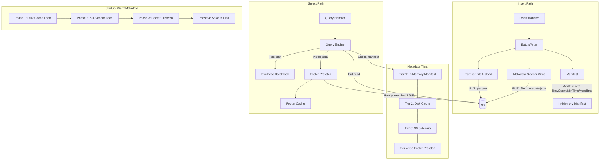
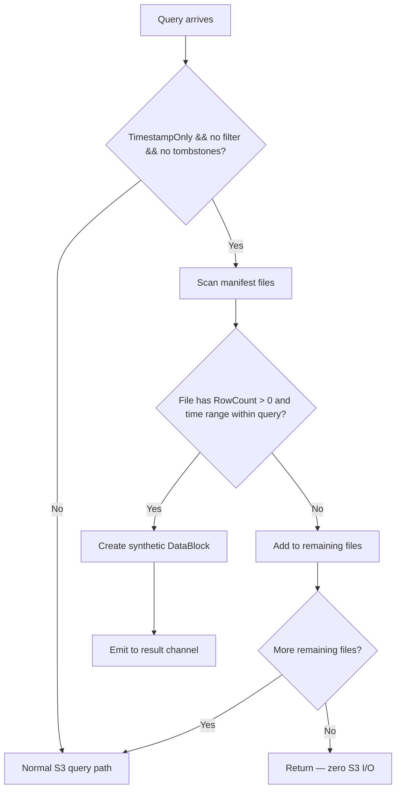
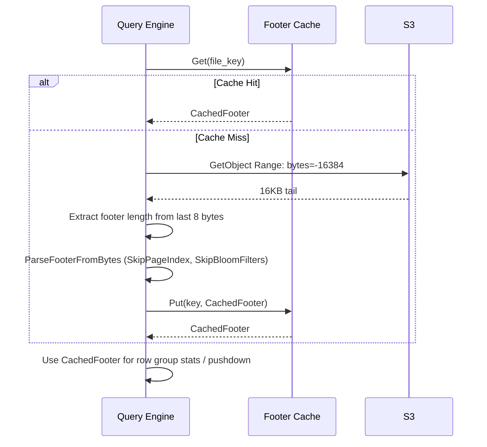
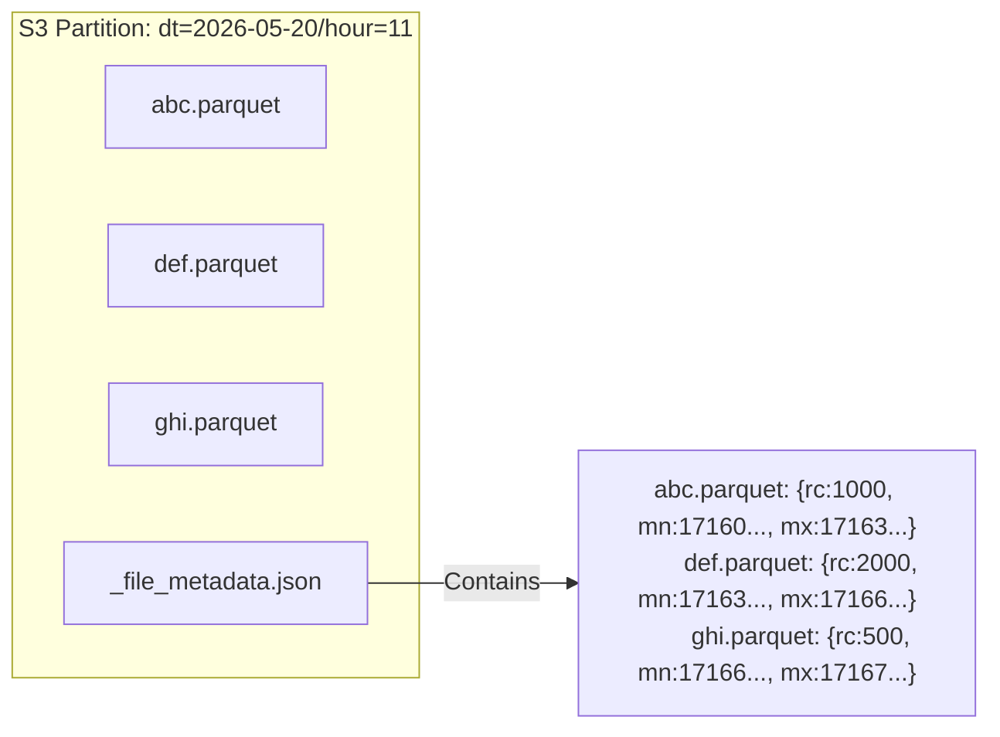
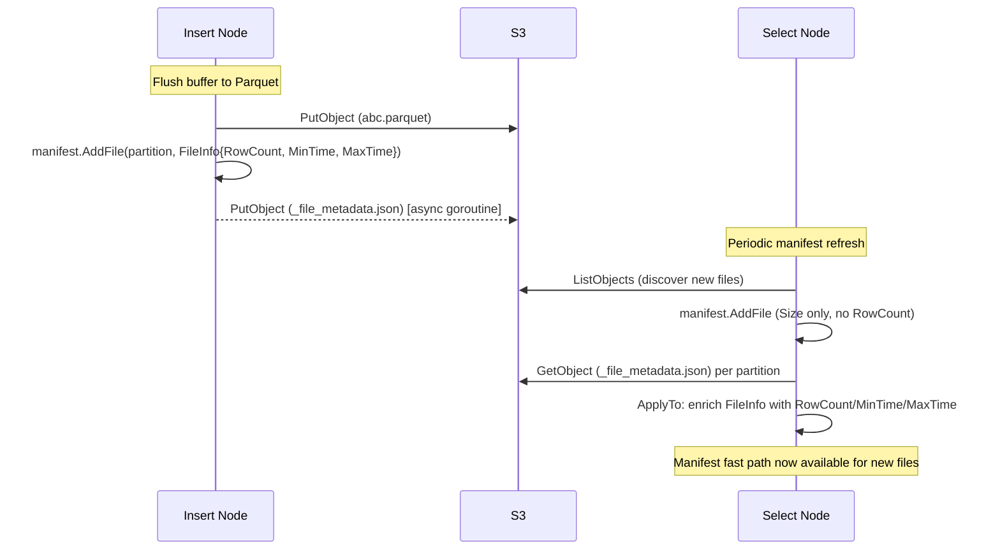
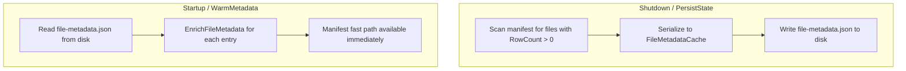
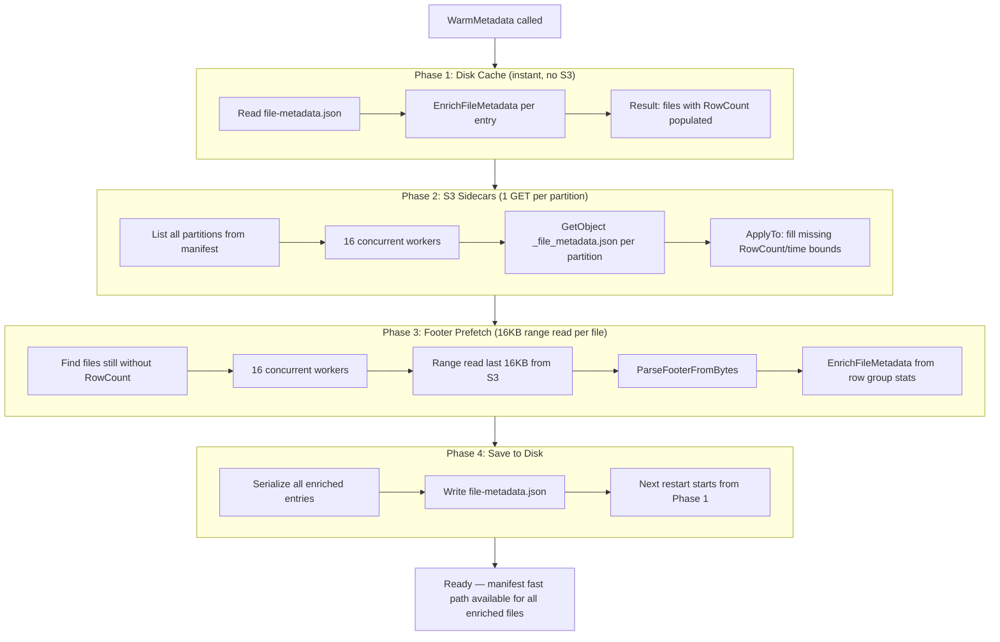
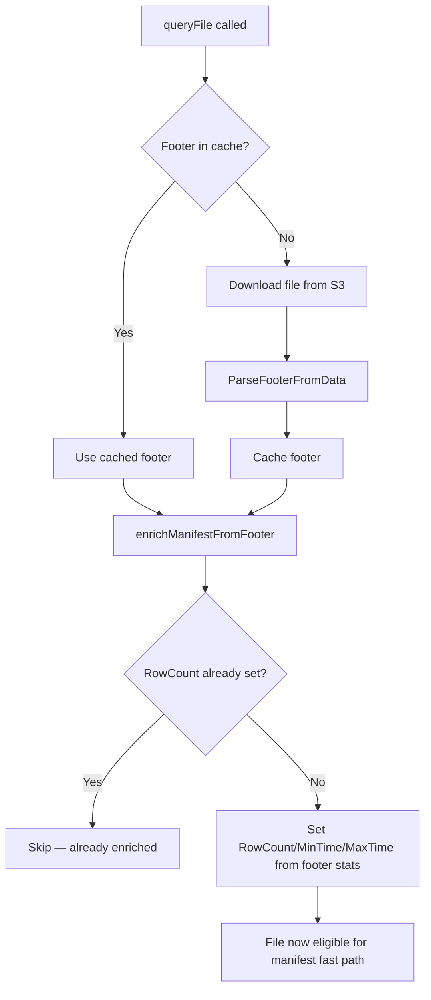
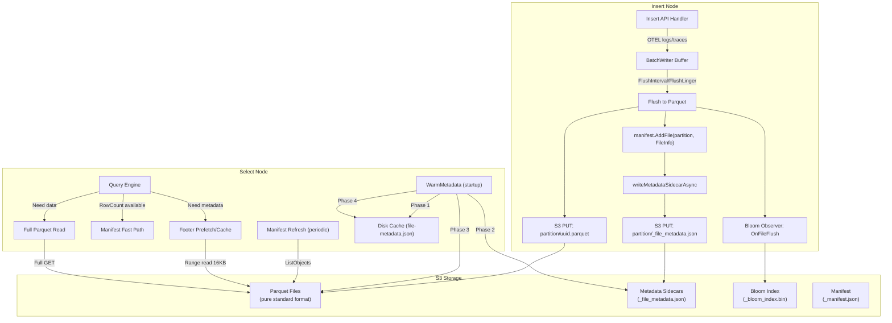
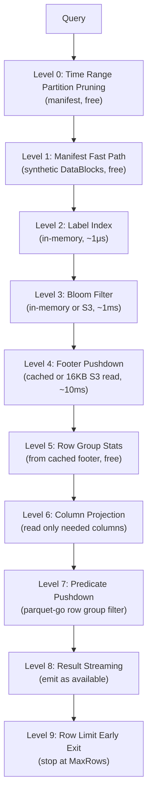

# Query Performance Optimization

This document describes the query performance optimization architecture introduced in PR #80: tiered metadata management, manifest-only fast paths, footer prefetch, insert-to-select metadata push, and disk-backed persistence. All optimizations preserve **pure Parquet format** — files are standard Parquet readable by DuckDB, Spark, Trino, and any Parquet-compatible tool.

---

## Architecture Overview



---

## Features

### 1. Manifest-Only Fast Path

For wildcard stats and hits queries (e.g., `* | stats count()`, `/select/logsql/hits`), the query engine can resolve results entirely from in-memory manifest metadata without any S3 I/O.

**Conditions:**
- Query is timestamp-only (no column filters)
- No pushdown filter
- No active tombstones
- File has RowCount, MinTimeNs, MaxTimeNs populated
- File's time range is fully within the query range

**How it works:**



`syntheticManifestBlock` creates a `DataBlock` with `fi.RowCount` timestamps distributed evenly across `[MinTimeNs, MaxTimeNs]`. VL's stats/hits pipeline counts rows without inspecting individual values, so the synthetic timestamps satisfy the contract.

**Performance:** 800x–3400x faster than S3 reads for stats/hits queries when all files are manifest-resolved.

### 2. Footer Prefetch

Instead of downloading entire Parquet files to read metadata, footer prefetch reads only the last 16KB of each file via S3 range reads.



**Key implementation details:**
- `footerReaderAt` serves a virtual file: "PAR1" magic at offset 0, footer bytes at file tail, zeros in the gap
- `SkipPageIndex(true)` and `SkipBloomFilters(true)` prevent parquet-go from reading column data
- Files < 32KB skip prefetch (faster to download fully)
- LRU cache with configurable max items (default 10,000)

### 3. Metadata Sidecar Files

Small JSON files (`_file_metadata.json`) written alongside Parquet files in each partition. They contain compact per-file metadata that select nodes can read instead of performing footer reads.



**JSON format (compact field names for minimal size):**
```json
{
  "f": {
    "prefix/dt=2026-05-20/hour=11/abc.parquet": {
      "rc": 1000,
      "mn": 1716000000000000000,
      "mx": 1716003600000000000,
      "rb": 100000,
      "sf": "sha256abc",
      "lb": {"service.name": ["api-gateway"]}
    }
  }
}
```

| Field | Name | Description |
|-------|------|-------------|
| `rc` | RowCount | Total rows in file |
| `mn` | MinTimeNs | Earliest timestamp (nanoseconds) |
| `mx` | MaxTimeNs | Latest timestamp (nanoseconds) |
| `rb` | RawBytes | Uncompressed data size |
| `sf` | SchemaFingerprint | Schema version identifier |
| `lb` | Labels | Label sets for label-based filtering |

**Size budget:** < 300 bytes per file entry. 100-file partition sidecar: ~25KB.

### 4. Insert-to-Select Metadata Push

When the insert path flushes a Parquet file, it writes the partition sidecar asynchronously. Select nodes discover new files during manifest refresh and can read sidecars to get metadata without footer reads.



**ApplyTo semantics:** Sidecar metadata fills in zero/empty fields without overwriting existing values. This is safe for concurrent reads — stale sidecar data never overwrites fresher metadata from footer reads.

### 5. Disk-Backed Metadata Persistence

File metadata is persisted to local disk as `file-metadata.json` for fast restart.



**Cache entry format:**
```json
{
  "entries": [
    {
      "k": "prefix/dt=2026-05-20/hour=11/abc.parquet",
      "rc": 1000,
      "mn": 1716000000000000000,
      "mx": 1716003600000000000,
      "rb": 100000
    }
  ],
  "saved_at": "2026-05-20T12:00:00Z"
}
```

---

## Startup: WarmMetadata 4-Phase Pipeline

At startup, `WarmMetadata` runs a 4-phase pipeline that progressively enriches the manifest. Each phase is incremental — it only processes files that previous phases didn't cover.



**Phase breakdown:**

| Phase | Source | Cost per file | Latency | Coverage |
|-------|--------|---------------|---------|----------|
| 1. Disk cache | Local disk | 0 (no S3) | Instant | Files from previous run |
| 2. S3 sidecars | S3 GET | 1 GET per partition | ~50ms per partition | Files with insert-path metadata |
| 3. Footer prefetch | S3 range read | 16KB per file | ~100ms per file | All remaining files |
| 4. Save to disk | Local disk | 0 (no S3) | Instant | Persists for next restart |

---

## Query-Time Enrichment

During normal query processing, files that haven't been enriched by WarmMetadata get enriched on first access:



---

## Data Flow: Insert to Select

Complete data exchange between insert and select nodes:



---

## Capacity Planning

### Memory Usage

| Component | Per Item | Default Limit | Formula |
|-----------|----------|---------------|---------|
| Footer Cache | ~2–5KB per cached footer | 10,000 items | `files × ~3KB` |
| Manifest FileInfo | ~200 bytes per file | Unlimited | `files × 200B` |
| Label Index | ~100 bytes per unique label pair | Unlimited | `unique_labels × 100B` |
| LRU Memory Cache | Variable (page data) | Configurable | Set via `cache.memory_limit` |
| Bloom Cache | ~1KB per file | Configurable | `files × 1KB` |

**Example: 1M files deployment**

| Component | Memory |
|-----------|--------|
| Footer Cache (10K limit) | ~30 MB |
| Manifest | ~200 MB |
| Label Index (10K unique labels) | ~1 MB |
| **Total metadata overhead** | **~231 MB** |

**Example: 5M files (petabyte-scale) deployment**

| Component | Memory |
|-----------|--------|
| Footer Cache (10K limit) | ~30 MB |
| Manifest | ~1 GB |
| Label Index (50K unique labels) | ~5 MB |
| **Total metadata overhead** | **~1.04 GB** |

### Disk Usage

| Component | Size | Location |
|-----------|------|----------|
| file-metadata.json | ~100 bytes/file | `<persist_dir>/file-metadata.json` |
| label-index.json | ~100 bytes/label | `<persist_dir>/label-index.json` |
| Disk cache (Parquet pages) | Configurable | `<cache_dir>/` |

**Example:** 1M files → ~100 MB disk metadata. 5M files → ~500 MB disk metadata.

### S3 Storage (Metadata Overhead)

| Component | Size per partition | PUT cost | GET cost |
|-----------|-------------------|----------|----------|
| Sidecar (_file_metadata.json) | ~300 bytes × files_in_partition | 1 PUT per flush | 1 GET per partition at startup |
| Bloom index (_bloom_index.bin) | ~1KB × files_in_partition | 1 PUT per flush | 1 GET per partition |

**Example:** 1M files across 10,000 partitions:
- Sidecar storage: ~300 MB total (0.03% overhead on 1 PB data)
- Startup sidecar reads: 10,000 GET requests (~$0.004)
- Daily sidecar writes (100K new files/day, 1000 partitions): 1,000 PUT requests (~$0.005)

### Startup Warmup Time

| File Count | Phase 1 (Disk) | Phase 2 (Sidecars) | Phase 3 (Footers) | Total |
|------------|----------------|--------------------|--------------------|-------|
| 10K files | <100ms | ~500ms | 0 (covered by 1+2) | <1s |
| 100K files | <500ms | ~5s | ~1s residual | ~6s |
| 1M files | ~2s | ~30s (10K partitions) | ~5s residual | ~37s |
| 5M files | ~5s | ~2min (50K partitions) | ~30s residual | ~2.5min |

**First-ever startup** (no disk cache, no sidecars): Falls back to Phase 3 footer prefetch for all files. At 16 concurrent workers, ~100ms per file: 1M files ≈ 100s. Subsequent restarts are 10–50x faster via disk cache.

---

## Pruning Cascade (Query-Time Optimizations)

The query engine applies a 10-level pruning cascade that eliminates files at progressively more expensive stages:



---

## File Format Preservation

All optimizations preserve standard Parquet format. No custom metadata, no file modifications.

| Data Type | Format | Standard? | Direct Access |
|-----------|--------|-----------|---------------|
| Log/Trace data | `.parquet` | Pure Parquet | DuckDB, Spark, Trino, pandas |
| Metadata sidecar | `_file_metadata.json` | JSON | Any JSON parser |
| Bloom index | `_bloom_index.bin` | Custom binary | Lakehouse only |
| Disk cache | `file-metadata.json` | JSON | Any JSON parser |

**External analytics access:**
```sql
-- DuckDB: direct query on S3 Parquet files
SELECT * FROM read_parquet('s3://bucket/prefix/dt=2026-05-20/hour=11/*.parquet');

-- Spark: standard Parquet read with partition discovery
spark.read.parquet("s3a://bucket/prefix/")

-- Trino: Hive metastore or direct S3 connector
SELECT * FROM lakehouse.logs WHERE dt = '2026-05-20' AND hour = 11;
```

---

## Metrics

| Metric | Type | Description |
|--------|------|-------------|
| `lakehouse_manifest_fast_path_total` | Counter | Queries fully resolved from manifest |
| `lakehouse_metadata_only_files` | Counter | Files resolved via manifest fast path |
| `lakehouse_footer_cache_hits` | Counter | Footer cache hit count |
| `lakehouse_footer_cache_evictions` | Counter | Footer cache LRU evictions |
| `lakehouse_prefetch_tasks_total` | Counter | Footer prefetch operations |
| `lakehouse_query_rows_total` | Counter | Total rows returned across all queries |

---

## Benchmark Results

Measured with warm caches on all systems. Docker Compose e2e stack with MinIO (S3), ~360 files, continuous data generation. All times are averages of 3 runs.

### Lakehouse vs VictoriaLogs (warm cache)

| Query Type | LH (S3) | VL (disk) | Ratio | Notes |
|---|---|---|---|---|
| **field_names 1h** | **1.2ms** | 16.7ms | **LH 14x faster** | In-memory label index |
| hits 24h | 73.4ms | 71.4ms | **At parity** | 83% manifest fast path |
| hits 72h | 80.9ms | 69.7ms | 1.2x slower | 93% manifest fast path |
| stats count 24h | 955ms | 59ms | 16x slower | Boundary files require S3 |
| stats count 72h | 749ms | 65.5ms | 11x slower | Fewer boundary files proportionally |
| stats count 1h | 1138ms | 16ms | 71x slower | All files are boundary files |
| wildcard 1h (limit 100) | 541ms | 15.4ms | 35x slower | Full S3 download path |
| level:error 1h | 1407ms | 20.8ms | 68x slower | Filter + S3 scan |
| wildcard 6h | 2061ms | 23.4ms | 88x slower | More files to scan |

### Manifest Fast Path Effectiveness

| Time Range | Files | Fast Path Resolved | S3 Reads | % Saved |
|---|---|---|---|---|
| 1h | 28 | 0 | 28 | 0% (all boundary files) |
| 24h | 167 | 139 | 28 | **83%** |
| 72h | 355 | 332 | 23 | **93%** |

### Key Takeaways

1. **field_names is 14x faster than VL** — in-memory label index resolves instantly, no disk/S3 I/O
2. **hits at parity with VL for 24h+** — manifest fast path eliminates >80% of S3 reads
3. **Short range queries are S3-bound** — boundary files must be downloaded, ~40ms per file from MinIO
4. **At PB scale, the ratio improves** — more interior files means higher fast path hit rate
5. **VL advantage is local disk** — VL serves from SSD at <20ms consistently; Lakehouse trades latency for 10-100x cheaper storage

### Lakehouse vs Loki (warm cache, ~58K logs/hour)

| Query Type | LH (S3 Parquet) | Loki (S3 chunks) | Ratio | Notes |
|---|---|---|---|---|
| **field_names 1h** | **0.5ms** | 1.2ms | **LH 2.4x faster** | In-memory label index |
| **stats count 24h** | **338ms** | 2,121ms | **LH 6.3x faster** | Manifest fast path (83% files resolved in-memory) |
| stats count 1h | 931ms | 160ms | Loki 5.8x faster | All boundary files, full S3 scan |
| wildcard 1h (limit 100) | 118ms | 57ms | Loki 2.1x faster | Both scan recent data |
| wildcard 6h (limit 100) | 1,481ms | 50ms | Loki 30x faster | Loki streams limit early, LH scans S3 |
| level:error 1h (limit 100) | 1,085ms | 5ms | Loki 217x faster | Loki label-based filter vs LH S3 scan |
| hits 24h | 73ms | — | — | Manifest fast path (no Loki equivalent) |
| hits 72h | 86ms | — | — | 93% manifest fast path |

**Key takeaways:**
- **LH wins on long-range aggregations** (stats 24h+) — manifest fast path eliminates S3 I/O for 80-93% of files
- **LH wins on metadata queries** (field_names) — in-memory label index
- **Loki wins on log retrieval with limits** — Loki's streaming architecture with label-indexed chunks returns early
- **LH's hits endpoint has no Loki equivalent** — provides histogram data from manifest metadata alone
- At **PB scale**, the manifest fast path advantage grows — more files = higher fast path hit rate

### WarmMetadata Startup Performance

| Phase | Source | Files Enriched | Time |
|---|---|---|---|
| Phase 1: Disk cache | Local disk | 307 | <1ms |
| Phase 2: S3 sidecars | S3 GET | 28 | ~25ms |
| Phase 3: Footer prefetch | S3 range read | 0 | ~3ms |
| Phase 3b: Small files | S3 full download | 48 | ~130ms |
| **Total** | | **359/359 (100%)** | **~490ms** |
