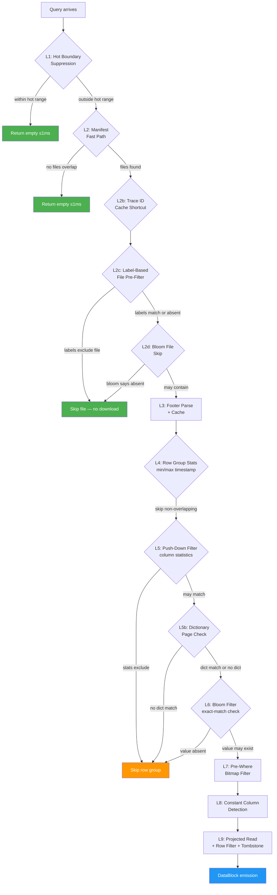
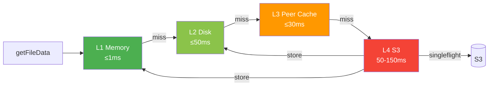

# Read Path

This document describes how Victoria Lakehouse resolves and executes queries against S3-backed Parquet files. The read path is implemented in `internal/storage/parquets3/storage.go` and orchestrates a multi-stage pruning cascade that minimizes I/O at every level.

## Query Entry Point

All read queries enter through `RunQuery()`, which accepts a `QueryContext` containing the time range, LogsQL query string, and optional column projection. The method streams results by calling a `WriteDataBlockFunc` callback for each batch of matching rows.

```go
RunQuery(ctx, qctx, writeBlock)
```

The query context carries:
- `StartNs` / `EndNs` -- nanosecond time range boundaries
- `Query` -- the raw LogsQL, Jaeger, or Tempo query string
- `RequestedColumns` -- optional column projection list

## Pruning Cascade

Victoria Lakehouse applies a ten-level pruning cascade, each eliminating work before the next level begins. The cascade is split into three phases: file-level pruning (avoids downloading data), row-group-level pruning (avoids reading row data), and row-level pruning (minimizes deserialized rows).



### Level 1: Hot Boundary Suppression

Before touching any manifest or S3 data, the query checks the discovery layer's hot boundary. If the query time range falls entirely within the hot tier's data range (as reported by vlstorage/vtstorage nodes), the query returns empty immediately.

```
discovery.GetHotBoundary() -> {MinTime, MaxTime}
if query [start, end] within [MinTime, MaxTime] -> return empty (<1ms)
```

This prevents redundant queries when vlselect fans out to both hot storage and lakehouse simultaneously.

### Level 2: Manifest Fast Path

The partition manifest maintains an in-memory index of all Parquet files and their time ranges. `HasDataForRange()` performs an O(1) check against the global min/max timestamps.

```
manifest.HasDataForRange(startNs, endNs) -> bool
  - If no files overlap the query range -> return empty (<1ms)
  - If overlap exists -> manifest.GetFilesForRange(startNs, endNs) -> []FileInfo
```

Each `FileInfo` contains the S3 key, file size, and label values extracted during flush.

### Level 2b: Trace ID Cache Shortcut (traces module)

For exact `trace_id` lookups, the smart cache maintains a reverse index (trace ID → file keys). If the index knows which files contain the trace, the file set is narrowed immediately — bypassing bloom and label checks.

```go
if tid := extractExactMatch(queryStr, "trace_id"); tid != "" {
    if cached := s.smartCache.FindFilesByTraceID(tid); len(cached) > 0 {
        files = narrowToCache(files, cached)
    }
}
```

### Level 2c: Label-Based File Pre-Filter

Each `FileInfo` carries label values extracted during flush (the distinct values of promoted columns within that file). The engine evaluates query predicates against these labels. If a predicate definitively excludes all label values for a file, the file is skipped without downloading it.

Supports exact match, prefix, greater-than, and less-than operators. Files with no labels for a queried column are conservatively included.

### Level 2d: Bloom File Skip

For exact-match queries on bloom-enabled columns, the engine checks partition-level bloom filters to skip entire files. This runs before any file data is downloaded.

### Level 3: Footer Parse and Cache

The Parquet footer (file metadata, schema, column indices) is parsed once per file access and stored in an LRU cache (`FooterCache`, default 10K entries). On subsequent accesses, the parsed `parquet.File` is reused without re-parsing.

The footer cache is also populated during cache warmup on startup.

### Level 4: Row Group Timestamp Pruning

For each Parquet file, the engine reads the column index of the `timestamp_unix_nano` column. Row groups whose min/max timestamp ranges do not overlap with the query range are skipped entirely.

```go
rowGroupMatchesTimeRange(rg, tsColIdx, startNs, endNs)
  -> reads ColumnIndex min/max for timestamp column
  -> skip if rgMax < startNs or rgMin >= endNs
```

This uses the Parquet column index metadata — no row data is read.

### Level 5: Push-Down Filter (Column Statistics)

For predicates on promoted columns, the engine evaluates column min/max statistics to determine if any row in the row group could match. Numeric columns use native int64 comparisons; string columns use lexicographic comparisons.

| Operator | Stats check |
|---|---|
| Exact | value ∈ [min, max] |
| Prefix | prefix range overlaps [min, max] |
| Greater than | max > threshold |
| Less than | min < threshold |

Column indices are pre-resolved once per file (`resolvePushDownIndices()`) to avoid repeated schema traversal across row groups.

### Level 5b: Dictionary Page Check

For exact-match and prefix predicates on dictionary-encoded columns, the engine reads the dictionary page (a compact in-memory list of distinct values). If no dictionary entry matches the predicate, the entire row group is skipped.

This adds near-zero cost (dictionary pages are a few KB) but catches cases that column statistics alone cannot — e.g., when min="a" and max="z" but only ["alpha", "beta", "gamma"] exist. Columns with >10K dictionary entries skip this check.

### Level 6: Bloom Filter Checks

For exact-match queries on bloom-enabled columns (`service.name`, `trace_id`), the engine checks bloom filters before scanning row data.

```go
bloomFilterSkip(file, rowGroup, checks) -> bool
  for each bloom check:
    read BloomFilter from column chunk
    if bf.Check(value) == false -> skip entire row group
```

Bloom filters provide definite negative answers: if the bloom filter says a value is absent, the row group is guaranteed to not contain it. The columns with bloom filters configured are defined in the schema registry:

- **Logs**: `service.name`, `trace_id`, `host.name`, `k8s.namespace.name`, `k8s.pod.name`, `k8s.deployment.name`, `deployment.environment`
- **Traces**: `trace_id`, `service.name`, `span.name`

### Level 7: Pre-Where Bitmap Filter

After row-group-level pruning passes, the engine reads only the filter columns first and builds a boolean bitmap of matching rows. The projected read (Level 9) then skips rows where `bitmap[i] == false`.

If all rows match (100% selectivity), the bitmap is discarded to avoid overhead.

### Level 8: Constant Column Detection

The engine examines column index statistics to find columns where min == max across all pages in the row group. These columns are skipped during deserialization; the constant value is injected into every output row. This is common for `service.name`, `level`, and `k8s.*` columns within a single row group.

### Level 9: Projected Read, Row Filtering, and Tombstone Check

After all pruning, the engine reads row data from surviving row groups.

**Column projection**: Only referenced columns (plus `timestamp_unix_nano` always) are deserialized. Wildcard queries fall back to reading all columns.

**Row-level timestamp filtering**: Each row's `timestamp_unix_nano` is checked against the exact query range boundaries, since row group statistics only provide coarse pruning.

**Tombstone filtering**: If a `TombstoneStore` is configured (for soft deletes), `filterTombstonedRows()` removes rows matching any active tombstone before emitting results.

**Parallel row group processing**: When multiple row groups survive pruning within a file, they are processed in parallel (up to 3 goroutines). Row groups are sorted by estimated cost (row count ascending) for optimal load balancing.

## Cache Hierarchy

File data retrieval follows a four-tier cache hierarchy in `getFileData()`:



| Tier | Backend | Latency | Implementation |
|---|---|---|---|
| L1 | Memory LRU (`sync.Map` + linked list) | <1ms | `internal/cache/lru.go` |
| L2 | Local disk (EBS) | <50ms | `internal/cache/disk.go` |
| L3 | Peer cache (HTTP, consistent hash ring) | <30ms | `internal/peercache/` |
| L4 | S3 (range reads via `io.ReaderAt`) | 50-150ms | `internal/s3reader/` |

The lookup sequence:

1. **L1 Memory** -- `memCache.Get(key)`. Returns byte slice copy from LRU cache.
2. **L2 Disk** -- `diskCache.Get(key)`. Returns file path; data is read with `os.ReadFile` and promoted to L1.
3. **L3 Peer** -- `peerCache.Lookup(key)` determines the owning peer via consistent hash ring. If the current instance is not the owner, it fetches from `GET /internal/cache/fetch?key=...` on the peer.
4. **S3 Download** -- Wrapped in a singleflight group (`cache.Group`) to prevent duplicate downloads when multiple queries need the same uncached file. After download, data is stored in both L2 disk and L1 memory.

## Schema Resolution

The `SchemaRegistry` (`internal/schema/registry.go`) translates between Parquet column names (OTEL dot-notation) and VL/VT internal field names. Resolution follows a priority order:

1. **Promoted column lookup** -- direct map lookup in `byInternal` or `byParquet` (O(1))
2. **VT prefix convention** -- `resource_attr:X` maps to `resource.attributes` MAP column
3. **Span/scope prefix** -- `span_attr:X` and `scope_attr:X` map to their respective MAP columns
4. **VL dotted convention** -- unknown dotted names try `resource.attributes`, then `log.attributes`

## Buffer Bridge Fan-Out

When select pods are configured with `--lakehouse.select.insert-headless-service`, the read path fans out to insert pods after querying S3. Insert pods expose their unflushed partition buffers via `GET /internal/buffer/query?start=X&end=Y&mode=logs`.

```
RunQuery:
  1. Query S3 Parquet files (via manifest + cache)
  2. bufferBridge.QueryLogs(ctx, startNs, endNs) -> []LogRow
  3. Convert buffer rows to DataBlock, emit via writeBlock
```

Buffer bridge errors are silently ignored for graceful degradation -- S3 data is always available even if insert pods are temporarily unreachable.

## DataBlock Emission

The final output is a columnar `DataBlock` containing:
- `RowsCount` -- number of rows in this batch
- `Columns` -- slice of `BlockColumn`, each with a `Name` (VL/VT internal name) and `Values` (string slice)

Row data is read in batches of 256 rows from each row group, converted to strings via `valueToString()`, and emitted through the callback. Parquet `FixedLenByteArray` values (like `trace_id`) are hex-encoded if they contain non-printable bytes.

## Metrics

The read path emits Prometheus metrics at each stage:

| Metric | Description |
|---|---|
| `lakehouse_manifest_fast_path_total` | Queries resolved by manifest without file access |
| `lakehouse_parquet_files_opened` | Files opened for scanning |
| `lakehouse_parquet_row_groups_skipped` | Row groups skipped by reason label: `stats`, `bloom`, `pushdown`, `label_index` |
| `lakehouse_parquet_row_groups_scanned` | Row groups fully scanned |
| `lakehouse_parquet_column_bytes_read` | Total bytes of Parquet file data read |
| `lakehouse_footer_cache_hits_total` | Footer cache hits (parsed `parquet.File` reused) |
| `lakehouse_footer_cache_evictions_total` | Footer cache LRU evictions |
| `lakehouse_cache_hits_total` | Data cache hits by tier (L1, L2, L3) |
| `lakehouse_cache_misses_total` | Data cache misses by tier |
| `lakehouse_s3_requests_total` | S3 API calls |
| `lakehouse_query_duration_seconds` | End-to-end query latency histogram |
| `lakehouse_query_rows_total` | Total rows emitted across all queries |
| `lakehouse_concurrent_selects` | Currently in-flight select queries |
| `lakehouse_prefetch_tasks_total` | Cache warmup/prefetch tasks completed by type |
| `lakehouse_prefetch_bytes_total` | Total bytes loaded during warmup/prefetch |
