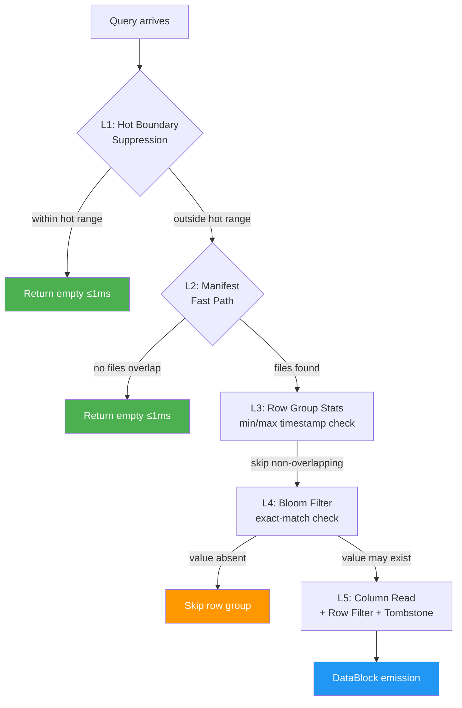
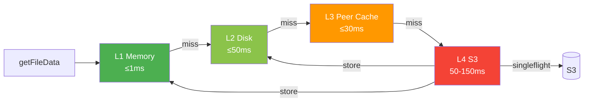

# Read Path

This document describes how Victoria Lakehouse resolves and executes queries against S3-backed Parquet files. The read path is implemented in `internal/storage/parquets3/storage.go` and orchestrates a multi-stage pruning cascade that minimizes I/O at every level.

## Query Entry Point

All read queries enter through `RunQuery()`, which accepts a `QueryContext` containing the time range, LogsQL query string, and optional column projection. The method streams results by calling a `WriteDataBlockFunc` callback for each batch of matching rows.

```go
RunQuery(ctx, qctx, writeBlock)
```

The query context carries:
- `StartNs` / `EndNs` -- nanosecond time range boundaries
- `Query` -- the raw LogsQL or Jaeger query string
- `RequestedColumns` -- optional column projection list

## Pruning Cascade

Victoria Lakehouse applies five levels of pruning, each eliminating work before the next level begins.



### Level 1: Hot Boundary Suppression

Before touching any manifest or S3 data, the query checks the discovery layer's hot boundary. If the query time range falls entirely within the hot tier's data range (as reported by vlstorage/vtstorage nodes), the query returns empty immediately.

```
discovery.GetHotBoundary() -> {MinTime, MaxTime}
if query [start, end] within [MinTime, MaxTime] -> return empty (<1ms)
```

This prevents redundant queries when vlselect fans out to both hot storage and lakehouse simultaneously.

### Level 2: Manifest Fast Path

The partition manifest maintains an in-memory index of all Parquet files and their time ranges. `HasDataForRange()` performs an O(1) check against the global min/max timestamps.

```
manifest.HasDataForRange(startNs, endNs) -> bool
  - If no files overlap the query range -> return empty (<1ms)
  - If overlap exists -> manifest.GetFilesForRange(startNs, endNs) -> []FileInfo
```

Each `FileInfo` contains the S3 key, file size, and label values extracted during flush. The manifest can also skip files whose labels do not match query predicates (label-based pruning from `FileInfo.Labels`).

### Level 3: Row Group Statistics Pruning

For each Parquet file, the engine reads the column index of the `timestamp_unix_nano` column. Row groups whose min/max timestamp ranges do not overlap with the query range are skipped entirely.

```go
rowGroupMatchesTimeRange(rg, tsColIdx, startNs, endNs)
  -> reads ColumnIndex min/max for timestamp column
  -> skip if rgMax < startNs or rgMin >= endNs
```

This is implemented in `rowGroupMatchesTimeRange()` and uses the Parquet column index metadata -- no row data is read.

### Level 4: Bloom Filter Checks

For exact-match queries on bloom-enabled columns (`service.name`, `trace_id`), the engine checks bloom filters before scanning row data. The `buildBloomChecks()` method extracts exact-match values from the query string by parsing `field:="value"` patterns.

```go
bloomFilterSkip(file, rowGroup, checks) -> bool
  for each bloom check:
    read BloomFilter from column chunk
    if bf.Check(value) == false -> skip entire row group
```

Bloom filters provide definite negative answers: if the bloom filter says a value is absent, the row group is guaranteed to not contain it. The columns with bloom filters configured are defined in the schema registry:

- **Logs**: `service.name`, `trace_id`
- **Traces**: `trace_id`, `service.name`

### Level 5: Column Projection and Row-Level Filtering

After all skip checks pass, the engine reads row data from the surviving row groups.

**Column projection**: When `RequestedColumns` is set, only those columns (plus `timestamp_unix_nano` always) are included in the output `DataBlock`. The `projectColumns()` method resolves internal names to Parquet column indices via the schema registry, reducing memory allocation and data transfer.

**Row-level timestamp filtering**: Each row's `timestamp_unix_nano` is checked against the exact query range boundaries, since row group statistics only provide coarse pruning.

**Tombstone filtering**: If a `TombstoneStore` is configured (for soft deletes), `filterTombstonedRows()` removes rows matching any active tombstone before emitting results.

## Cache Hierarchy

File data retrieval follows a four-tier cache hierarchy in `getFileData()`:



| Tier | Backend | Latency | Implementation |
|---|---|---|---|
| L1 | Memory LRU (`sync.Map` + linked list) | <1ms | `internal/cache/lru.go` |
| L2 | Local disk (EBS) | <50ms | `internal/cache/disk.go` |
| L3 | Peer cache (HTTP, consistent hash ring) | <30ms | `internal/peercache/` |
| L4 | S3 (range reads via `io.ReaderAt`) | 50-150ms | `internal/s3reader/` |

The lookup sequence:

1. **L1 Memory** -- `memCache.Get(key)`. Returns byte slice copy from LRU cache.
2. **L2 Disk** -- `diskCache.Get(key)`. Returns file path; data is read with `os.ReadFile` and promoted to L1.
3. **L3 Peer** -- `peerCache.Lookup(key)` determines the owning peer via consistent hash ring. If the current instance is not the owner, it fetches from `GET /internal/cache/fetch?key=...` on the peer.
4. **S3 Download** -- Wrapped in a singleflight group (`cache.Group`) to prevent duplicate downloads when multiple queries need the same uncached file. After download, data is stored in both L2 disk and L1 memory.

## Schema Resolution

The `SchemaRegistry` (`internal/schema/registry.go`) translates between Parquet column names (OTEL dot-notation) and VL/VT internal field names. Resolution follows a priority order:

1. **Promoted column lookup** -- direct map lookup in `byInternal` or `byParquet` (O(1))
2. **VT prefix convention** -- `resource_attr:X` maps to `resource.attributes` MAP column
3. **Span/scope prefix** -- `span_attr:X` and `scope_attr:X` map to their respective MAP columns
4. **VL dotted convention** -- unknown dotted names try `resource.attributes`, then `log.attributes`

## Buffer Bridge Fan-Out

When select pods are configured with `--lakehouse.select.insert-headless-service`, the read path fans out to insert pods after querying S3. Insert pods expose their unflushed partition buffers via `GET /internal/buffer/query?start=X&end=Y&mode=logs`.

```
RunQuery:
  1. Query S3 Parquet files (via manifest + cache)
  2. bufferBridge.QueryLogs(ctx, startNs, endNs) -> []LogRow
  3. Convert buffer rows to DataBlock, emit via writeBlock
```

Buffer bridge errors are silently ignored for graceful degradation -- S3 data is always available even if insert pods are temporarily unreachable.

## DataBlock Emission

The final output is a columnar `DataBlock` containing:
- `RowsCount` -- number of rows in this batch
- `Columns` -- slice of `BlockColumn`, each with a `Name` (VL/VT internal name) and `Values` (string slice)

Row data is read in batches of 256 rows from each row group, converted to strings via `valueToString()`, and emitted through the callback. Parquet `FixedLenByteArray` values (like `trace_id`) are hex-encoded if they contain non-printable bytes.

## Metrics

The read path emits Prometheus metrics at each stage:

| Metric | Description |
|---|---|
| `lakehouse_manifest_fast_path_total` | Queries resolved by manifest without file access |
| `lakehouse_parquet_files_opened` | Files opened for scanning |
| `lakehouse_parquet_row_groups_skipped` | Row groups skipped (by stats or bloom) |
| `lakehouse_parquet_row_groups_scanned` | Row groups fully scanned |
| `lakehouse_cache_hits_total` | Cache hits by tier (L1, L2, L3) |
| `lakehouse_cache_misses_total` | Cache misses by tier |
| `lakehouse_s3_requests_total` | S3 API calls |
| `lakehouse_query_duration_seconds` | End-to-end query latency histogram |
| `lakehouse_concurrent_selects` | Currently in-flight select queries |
