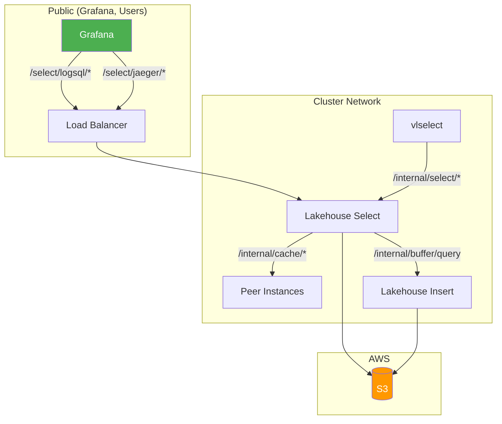

# Security

## Container Hardening

Victoria Lakehouse uses a hardened container image:

- **Base image**: `gcr.io/distroless/static-debian12:nonroot` — no shell, no package manager, no libc
- **Non-root execution**: runs as UID 65534 (`nonroot` user)
- **Stripped binary**: built with `-s -w` linker flags (no debug symbols)
- **Static binary**: `CGO_ENABLED=0` — no dynamic library dependencies
- **Multi-stage build**: builder stage discarded, only binary copied to runtime

## Kubernetes Security Context

Default Helm chart values enforce a secure-by-default posture:

```yaml
securityContext:
  runAsNonRoot: true
  runAsUser: 65534
  runAsGroup: 65534
  fsGroup: 65534
  seccompProfile:
    type: RuntimeDefault

containerSecurityContext:
  readOnlyRootFilesystem: true
  allowPrivilegeEscalation: false
  capabilities:
    drop: ["ALL"]
  runAsNonRoot: true
  runAsUser: 65534
  runAsGroup: 65534
  seccompProfile:
    type: RuntimeDefault
```

- **Read-only root filesystem**: only `/data/lakehouse` (PVC mount) is writable
- **No privilege escalation**: `allowPrivilegeEscalation: false`
- **All capabilities dropped**: `capabilities.drop: ["ALL"]`
- **Seccomp**: `RuntimeDefault` profile active

## CI Security Gates

| Gate | Tool | What It Checks |
|---|---|---|
| Dependency vulnerabilities | `govulncheck` | Known CVEs in Go dependencies |
| Static analysis | `gosec` | Go-specific security issues (OWASP) |
| Container vulnerabilities | `Trivy` | OS-level + app-level CVEs in image |
| Secret scanning | `gitleaks` | Accidentally committed credentials |
| Code analysis | `CodeQL` | Semantic vulnerability patterns (weekly) |

## Credential Handling

### S3 Credentials

**Preferred**: IAM roles via IRSA (Kubernetes) or instance profiles (EC2). No credentials in config.

**Static credentials** (`--lakehouse.s3.access-key/secret-key`) are supported for development (MinIO) but should not be used in production. These values are never logged or exposed in metrics.

### Discovery Auth Key

`--lakehouse.discovery.partition-auth-key` authenticates requests to vlstorage/vtstorage `/internal/partition/list` endpoints. Must match the `-partitionManageAuthKey` value on storage nodes.

### Peer Cache Auth Key

`--lakehouse.peer-auth-key` authenticates internal peer cache HTTP requests. Required when running multiple instances with peer cache enabled.

## Network Boundaries



### Internal Endpoints (cluster-only)

These endpoints should NOT be exposed externally:

| Endpoint | Purpose |
|---|---|
| `/internal/select/*` | Cluster protocol (binary DataBlock) |
| `/internal/cache/fetch` | Peer cache data transfer |
| `/internal/cache/has` | Peer cache probe |
| `/internal/cache/stats` | Peer cache metrics |

Use Kubernetes NetworkPolicy to restrict `/internal/*` to cluster CIDR.

### Public Endpoints

| Endpoint | Purpose |
|---|---|
| `/select/logsql/*` | Query API (VL/VT compatible) |
| `/health` | Liveness |
| `/ready` | Readiness |
| `/manifest/range` | Data range info |
| `/lakehouse/info` | Build info |
| `/metrics` | Prometheus scrape |

## Tenant Isolation

Victoria Lakehouse uses **S3 prefix isolation** for multi-tenancy — the same pattern as Grafana Loki and Grafana Tempo. Each tenant's data lives in a separate S3 prefix, providing physical data separation.

### Prefix Isolation (Default)

```
--lakehouse.tenant.prefix-template="{AccountID}/{ProjectID}/"
--lakehouse.tenant.default-account=0
--lakehouse.tenant.default-project=0
```

`AccountID` and `ProjectID` are extracted from vmauth headers (`X-Scope-AccountID`, `X-Scope-ProjectID`). A query from tenant-A cannot access tenant-B's S3 prefix. Single-tenant deployments use the default `0/0/` prefix.

S3 layout per tenant:
```
s3://obs-archive/{AccountID}/{ProjectID}/logs/dt=YYYY-MM-DD/hour=HH/*.parquet
s3://obs-archive/{AccountID}/{ProjectID}/traces/dt=YYYY-MM-DD/hour=HH/*.parquet
```

### Enterprise: Bucket-Per-Tenant Isolation

For regulated environments requiring IAM-level hard isolation (HIPAA, SOC2, FedRAMP):

```
--lakehouse.tenant.isolation=bucket
--lakehouse.tenant.bucket-template="obs-{AccountID}-{ProjectID}"
```

Each tenant gets its own S3 bucket with independent:
- IAM policies (cross-account access control)
- KMS encryption keys
- Lifecycle rules (different retention per tenant)
- S3 Access Logs for compliance audit
- CloudTrail object-level logging

### Security Properties

| Property | Prefix Isolation | Bucket Isolation |
|---|---|---|
| Data separation | Physical (S3 path) | Physical (S3 bucket) |
| IAM boundary | Shared bucket IAM | Per-bucket IAM |
| Encryption keys | Shared KMS key | Per-tenant KMS |
| Audit trail | S3 Access Logs by prefix | Per-bucket Access Logs |
| Cost attribution | S3 Inventory by prefix | Per-bucket billing |
| Parquet tool access | Per-tenant glob pattern | Per-tenant bucket |

Full documentation: [Multi-Tenancy](multi-tenancy.md)

## S3 Access

Victoria Lakehouse requires read-only S3 access:

```json
{
  "Version": "2012-10-17",
  "Statement": [
    {
      "Effect": "Allow",
      "Action": [
        "s3:GetObject",
        "s3:ListBucket",
        "s3:HeadObject"
      ],
      "Resource": [
        "arn:aws:s3:::obs-archive",
        "arn:aws:s3:::obs-archive/*"
      ]
    }
  ]
}
```

No write access required. Victoria Lakehouse is a read-only consumer of Parquet files.

For SQS event notifications, add:

```json
{
  "Effect": "Allow",
  "Action": [
    "sqs:ReceiveMessage",
    "sqs:DeleteMessage",
    "sqs:GetQueueAttributes"
  ],
  "Resource": "arn:aws:sqs:us-east-1:123456:lakehouse-s3-events"
}
```
