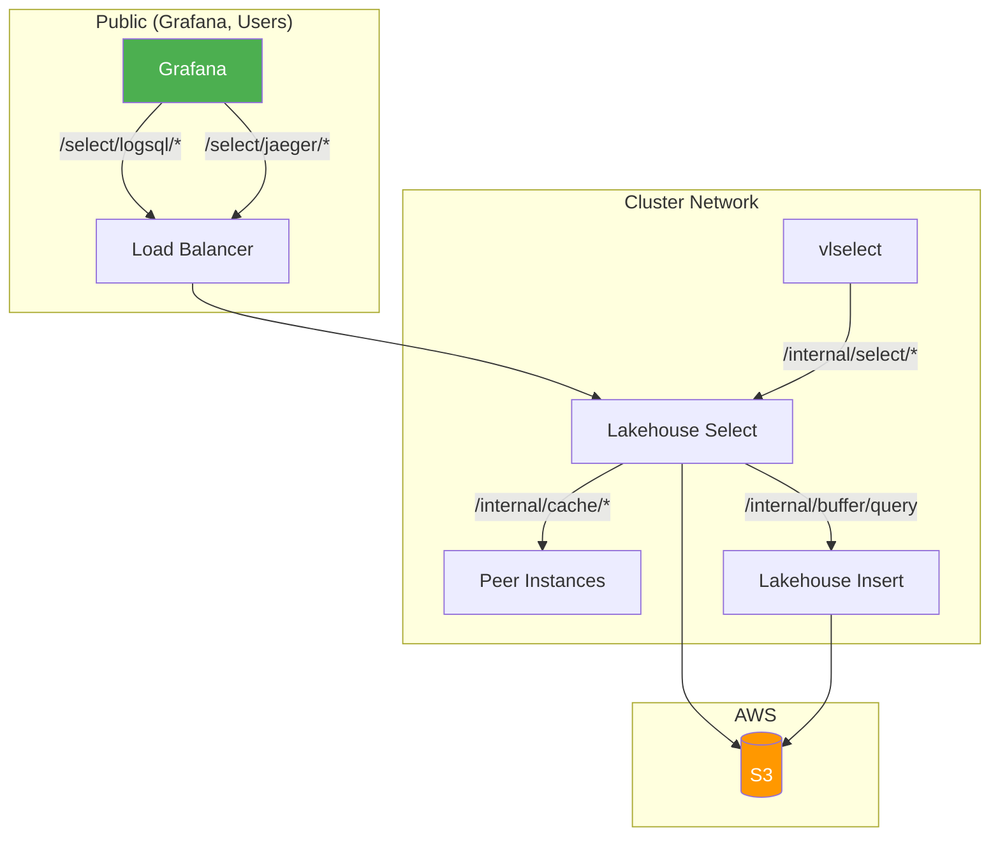

# Security

## Container Hardening

Victoria Lakehouse uses a hardened container image:

- **Base image**: `gcr.io/distroless/static-debian12:nonroot` — no shell, no package manager, no libc
- **Non-root execution**: runs as UID 65534 (`nonroot` user)
- **Stripped binary**: built with `-s -w` linker flags (no debug symbols)
- **Static binary**: `CGO_ENABLED=0` — no dynamic library dependencies
- **Multi-stage build**: builder stage discarded, only binary copied to runtime

## Kubernetes Security Context

Default Helm chart values enforce a secure-by-default posture:

```yaml
securityContext:
  runAsNonRoot: true
  runAsUser: 65534
  runAsGroup: 65534
  fsGroup: 65534
  seccompProfile:
    type: RuntimeDefault

containerSecurityContext:
  readOnlyRootFilesystem: true
  allowPrivilegeEscalation: false
  capabilities:
    drop: ["ALL"]
  runAsNonRoot: true
  runAsUser: 65534
  runAsGroup: 65534
  seccompProfile:
    type: RuntimeDefault
```

- **Read-only root filesystem**: only `/data/lakehouse` (PVC mount) is writable
- **No privilege escalation**: `allowPrivilegeEscalation: false`
- **All capabilities dropped**: `capabilities.drop: ["ALL"]`
- **Seccomp**: `RuntimeDefault` profile active

## CI Security Gates

| Gate | Tool | What It Checks |
|---|---|---|
| Dependency vulnerabilities | `govulncheck` | Known CVEs in Go dependencies |
| Static analysis | `gosec` | Go-specific security issues (OWASP) |
| Container vulnerabilities | `Trivy` | OS-level + app-level CVEs in image |
| Secret scanning | `gitleaks` | Accidentally committed credentials |
| Code analysis | `CodeQL` | Semantic vulnerability patterns (weekly) |

## Credential Handling

### S3 Credentials

**Preferred**: IAM roles via IRSA (Kubernetes) or instance profiles (EC2). No credentials in config.

**Static credentials** (`--lakehouse.s3.access-key/secret-key`) are supported for development (MinIO) but should not be used in production. These values are never logged or exposed in metrics.

### Discovery Auth Key

`--lakehouse.discovery.partition-auth-key` authenticates requests to vlstorage/vtstorage `/internal/partition/list` endpoints (polled with `POST`, the only method VictoriaTraces v0.12.0 accepts there; the key stays in the URL query). Must match the `-partitionManageAuthKey` value on storage nodes.

### Peer Key

`peer.auth_key` (or `-lakehouse.peer.auth-key`, which overrides it) is the key the pods present to each other's
internal endpoints and require on their own: the buffer bridge (`/internal/buffer/query`), the peer cache, manifest
push, stats and tenant sync. Set the same key on every pod of a deployment. See
[Internal endpoints and the peer key](#internal-endpoints-and-the-peer-key).

## Network Boundaries


```mermaid
graph TD
    subgraph "Public (Grafana, Users)"
    G[Grafana] -->|/select/logsql/*| LB[Load Balancer]
    G -->|/select/jaeger/*| LB
    end

    subgraph "Cluster Network"
    LB --> S[Lakehouse Select]
    S -->|/internal/cache/*| P[Peer Instances]
    S -->|/internal/buffer/query| I[Lakehouse Insert]
    VL[vlselect] -->|/internal/select/*| S
    end

    subgraph "AWS"
    S --> S3[(S3)]
    I --> S3
    end

    style G fill:#4CAF50,color:#fff
    style S3 fill:#FF9800,color:#fff
```

### Internal Endpoints (cluster-only)

These endpoints should NOT be exposed externally:

| Endpoint | Served by | Purpose | Protection |
|---|---|---|---|
| `/internal/select/*` | select pods | VictoriaLogs' cluster protocol (binary DataBlock), for a `vlselect`/`vtselect` in front | upstream's: network, `-httpAuth.*`, `-internalselect.disable` |
| `/internal/buffer/query` | insert pods | the select pods' buffer bridge: each tenant's not yet flushed rows | peer key, `-internalselect.disable` |
| `/internal/cache/fetch`, `/internal/cache/has` | every pod | peer cache data transfer and probe | peer key (`X-Peer-Auth-Key`) |
| `/internal/cache/stats`, `/internal/cache/clear` | every pod | peer cache metrics and reset | peer key |
| `/internal/manifest/update`, `/internal/stats/sync`, `/internal/tenant/sync` | every pod | manifest push, stats and tenant gossip | peer key |

Use Kubernetes NetworkPolicy to restrict `/internal/*` to the cluster CIDR, and put vmauth in front of the
pods for clients (the chart's vmauth routes only `/insert/*` and `/internal/insert` to insert pods).

### Internal endpoints and the peer key

VictoriaLogs and VictoriaTraces protect their own internal endpoints (`/internal/select/*`, `/internal/insert`) by
the network: the cluster components "must run in a protected internal network", with
[vmauth](https://docs.victoriametrics.com/victoriametrics/vmauth/) in front for clients, `-httpAuth.*` for basic
auth, and `-internalselect.disable` / `-internalinsert.disable` to turn the endpoints off. Without these the
endpoints take no credential: anyone who can reach a `vlstorage` node can read any tenant through
`/internal/select/*`. Lakehouse follows that model and adds the peer key, because its insert pods are also the
ingest endpoint: clients that may only write reach the same port as `/internal/buffer/query`.

`/internal/buffer/query` answers like this:

| Pod's peer key | Request | Answer |
|---|---|---|
| set | no `Authorization: Bearer`, or another key | **401** `Expected to receive non-empty Authorization: Bearer <key> when peer.auth_key is set` / `The provided Bearer key doesn't match peer.auth_key` (upstream's status for a missing or wrong key) |
| set | the key, one tenant (`account_id` + `project_id`) | 200, that tenant's unflushed rows only |
| set | the key, `all_tenants=true` | 200, every tenant's unflushed rows (a select pod's global-read query) |
| not set | one tenant | 200, that tenant's unflushed rows only, without a credential (as upstream's `/internal/select/*`) |
| not set | `all_tenants=true` | **403** `all_tenants=true is served only to an authenticated peer; set the same peer.auth_key on every pod` |
| any | `-internalselect.disable` on the insert pod | **400** `requests to /internal/buffer/query are disabled with -internalselect.disable command-line flag` (upstream's answer and status), before anything else is looked at |

The select pods' bridge sends `Authorization: Bearer <peer.auth_key>` on every request. A peer that refuses it
(401/403) is counted in `lakehouse_buffer_bridge_errors_total{reason="auth"}` and raises
`LakehouseBufferBridgeAuthRefused`: the queries that hit it were answered without that pod's unflushed rows.

**Risk without a key.** With no peer key (the default, as in upstream), anyone who can reach an insert pod's
port can read any single tenant's unflushed rows by naming its `AccountID`/`ProjectID`: the rows of the active and
sealed buffer segments plus the grace period after they are written (about 15 minutes at the defaults). Every
tenant at once (`all_tenants=true`) is never served without a key. This is the exposure of upstream's
`/internal/select/*` on `vlstorage`, on a port that ingest clients can reach. Keep the pods on a protected
network, or set the key; global-read queries need the key to see unflushed rows at all.

**Setting the key.**

- Config file: `peer: {auth_key: <key>}`, the same on every pod of both roles.
- Flag: `-lakehouse.peer.auth-key=<key>`, which overrides the config file. VictoriaMetrics' flag handling
  expands `%{ENV_VAR}` in it (`-lakehouse.peer.auth-key=%{LAKEHOUSE_PEER_AUTH_KEY}`) and hides flags named
  `*key*` from `/flags` and `/metrics`.
- Helm: create a Secret and set `peerAuth.existingSecret` (and `peerAuth.secretKey`, default `peer-auth-key`):

  ```sh
  kubectl create secret generic lakehouse-peer --from-literal=peer-auth-key="$(openssl rand -hex 32)"
  helm upgrade --install lh charts/victoria-lakehouse --set peerAuth.existingSecret=lakehouse-peer
  ```

  Every Lakehouse pod gets the key as `LAKEHOUSE_PEER_AUTH_KEY` and passes it with the flag; it never enters the
  ConfigMap. `lakehouseConfig.peer.auth_key` also works but renders the key into the ConfigMap; setting both is
  refused. Rotate by updating the Secret and restarting every pod; pods holding different keys refuse each
  other's bridge requests until all have restarted.

**Turning it off.** Upstream's `-internalselect.disable` turns off `/internal/buffer/query` on insert pods and
`/internal/select/*` on select pods. Select pods then see an insert pod's rows only once they are in object
storage; set `select.buffer_query_enabled: false` on them so they do not ask.

**`-httpAuth.*`.** VictoriaMetrics' HTTP server applies `-httpAuth.username`/`-httpAuth.password` to every path
except `/health`, `/metrics`, `/flags` and a few others, including `/internal/*`. Lakehouse's peer clients (the
buffer bridge, the peer cache, manifest, stats and tenant sync) do not send basic auth, so on a deployment that
sets `-httpAuth.*` on its pods those channels are refused (tracked in #396). Use the peer key between pods and put
basic auth or vmauth in front for clients.

### Public Endpoints

| Endpoint | Purpose |
|---|---|
| `/select/logsql/*` | Query API (VL/VT compatible) |
| `/health` | Liveness |
| `/ready` | Readiness |
| `/manifest/range` | Data range info |
| `/lakehouse/info` | Build info |
| `/metrics` | Prometheus scrape |

## Tenant Isolation

Victoria Lakehouse uses **S3 prefix isolation** for multi-tenancy — the same pattern as Grafana Loki and Grafana Tempo. Each tenant's data lives in a separate S3 prefix, providing physical data separation.

### Prefix Isolation (Default)

```
--lakehouse.tenant.prefix-template="{AccountID}/{ProjectID}/"
--lakehouse.tenant.default-account=0
--lakehouse.tenant.default-project=0
```

`AccountID` and `ProjectID` are extracted from vmauth headers (`X-Scope-AccountID`, `X-Scope-ProjectID`). A query from tenant-A cannot access tenant-B's S3 prefix. Single-tenant deployments use the default `0/0/` prefix.

S3 layout per tenant:
```
s3://obs-archive/{AccountID}/{ProjectID}/logs/dt=YYYY-MM-DD/hour=HH/*.parquet
s3://obs-archive/{AccountID}/{ProjectID}/traces/dt=YYYY-MM-DD/hour=HH/*.parquet
```

### Enterprise: Bucket-Per-Tenant Isolation

For regulated environments requiring IAM-level hard isolation (HIPAA, SOC2, FedRAMP):

```
--lakehouse.tenant.isolation=bucket
--lakehouse.tenant.bucket-template="obs-{AccountID}-{ProjectID}"
```

Each tenant gets its own S3 bucket with independent:
- IAM policies (cross-account access control)
- KMS encryption keys
- Lifecycle rules (different retention per tenant)
- S3 Access Logs for compliance audit
- CloudTrail object-level logging

### Security Properties

| Property | Prefix Isolation | Bucket Isolation |
|---|---|---|
| Data separation | Physical (S3 path) | Physical (S3 bucket) |
| IAM boundary | Shared bucket IAM | Per-bucket IAM |
| Encryption keys | Shared KMS key | Per-tenant KMS |
| Audit trail | S3 Access Logs by prefix | Per-bucket Access Logs |
| Cost attribution | S3 Inventory by prefix | Per-bucket billing |
| Parquet tool access | Per-tenant glob pattern | Per-tenant bucket |

Full documentation: [Multi-Tenancy](multi-tenancy.md)

## S3 Access

Victoria Lakehouse requires read-only S3 access:

```json
{
  "Version": "2012-10-17",
  "Statement": [
    {
      "Effect": "Allow",
      "Action": [
        "s3:GetObject",
        "s3:ListBucket",
        "s3:HeadObject"
      ],
      "Resource": [
        "arn:aws:s3:::obs-archive",
        "arn:aws:s3:::obs-archive/*"
      ]
    }
  ]
}
```

No write access required. Victoria Lakehouse is a read-only consumer of Parquet files.

For SQS event notifications, add:

```json
{
  "Effect": "Allow",
  "Action": [
    "sqs:ReceiveMessage",
    "sqs:DeleteMessage",
    "sqs:GetQueueAttributes"
  ],
  "Resource": "arn:aws:sqs:us-east-1:123456:lakehouse-s3-events"
}
```
