# Storage & Parquet Flow

End-to-end data flow through Victoria Lakehouse, from VL/VT upstream input through Parquet storage to query output.

## System Overview

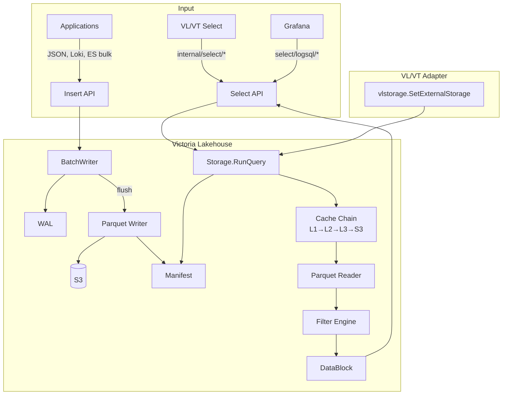

## Write Path

### Complete Flow

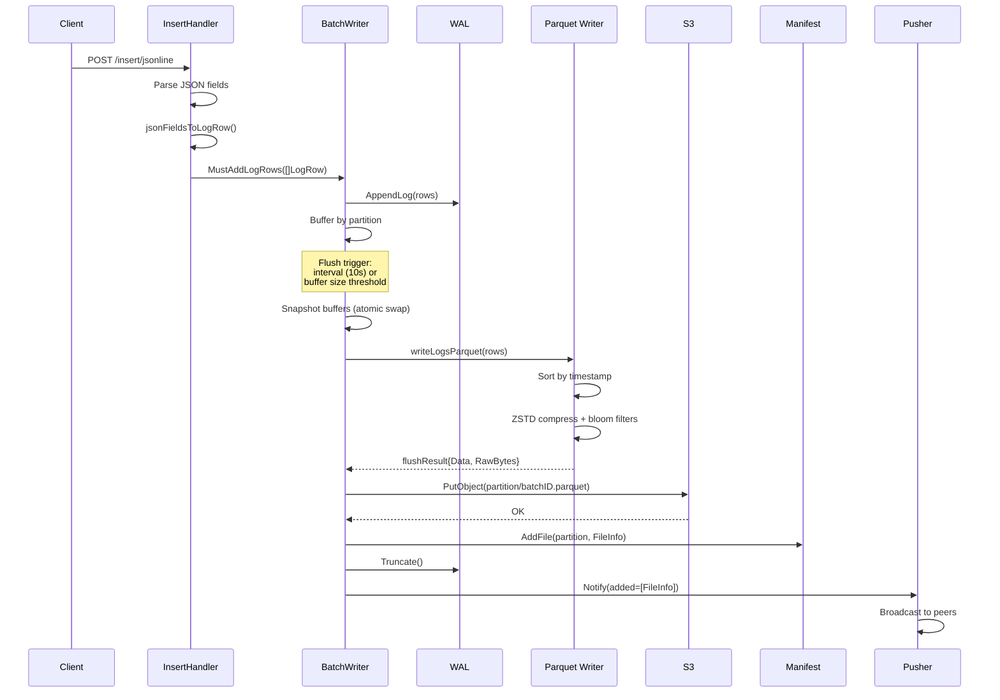

### Insert API

**File:** `internal/insertapi/handler.go`

Three ingestion endpoints, each parsing a different format into the same `LogRow` struct:

| Endpoint | Format | Parser |
|----------|--------|--------|
| `POST /insert/jsonline` | Newline-delimited JSON | `parseJSONLine` |
| `POST /insert/loki/api/v1/push` | Loki push protobuf/JSON | `lokiPushRequest` |
| `POST /insert/elasticsearch/_bulk` | Elasticsearch bulk | ES bulk parser |

**Field Promotion:**

Each parser separates fields into promoted (top-level Parquet columns) and unpromoted (MAP columns):

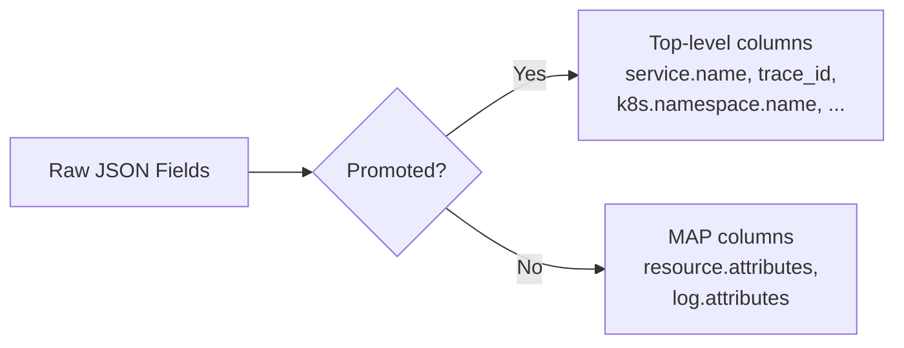

Promoted fields (logs): `_time`, `_msg`, `level`, `service.name`, `k8s.namespace.name`, `k8s.pod.name`, `k8s.deployment.name`, `k8s.node.name`, `deployment.environment`, `cloud.region`, `host.name`, `trace_id`, `span_id`, `scope.name`

### BatchWriter

**File:** `internal/storage/parquets3/writer.go`

Buffers rows in memory, partitioned by time:

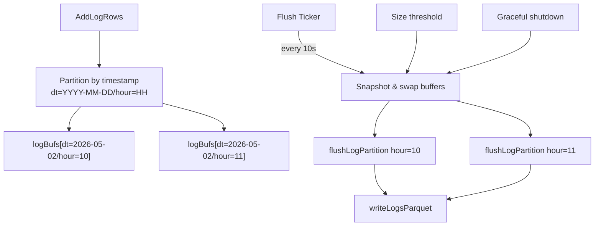

**Flush triggers:**
- **Periodic:** `FlushInterval` (default 10s)
- **Size:** when buffer exceeds `TargetFileSize` (default 128 MB)
- **Shutdown:** `FlushAll()` called from graceful shutdown hook

### Parquet Writing

Each flush produces a single Parquet file per partition:

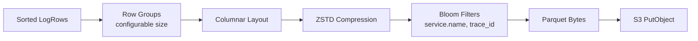

**S3 key format:** `{prefix}{partition}/{batchID}.parquet`
- Example: `logs/dt=2026-05-02/hour=10/a1b2c3d4e5f6g7h8.parquet`
- `batchID` is a random 8-byte hex string

**Compression levels:**
- 1-5: ZSTD default speed
- 6-10: ZSTD better compression
- 11+: ZSTD best compression

### WAL (Write-Ahead Log)

**File:** `internal/wal/wal.go`

Optional durability layer. When enabled, rows are appended to the WAL before buffering:

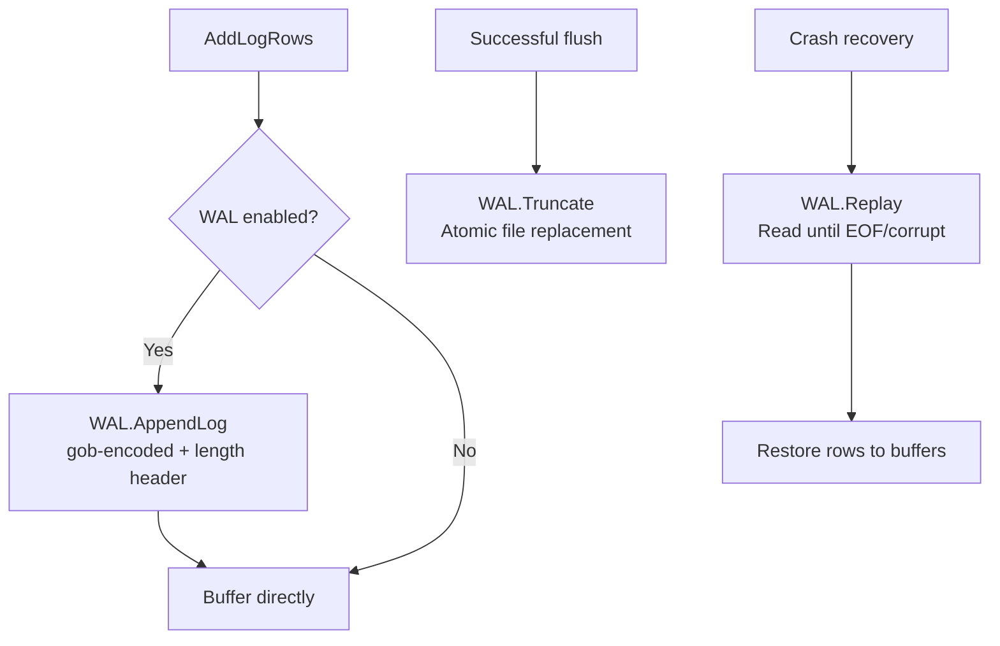

**Wire format:** `[4-byte LE length][1-byte mode: 'L'|'T'][gob-encoded row]`

**Recovery:** On startup, replay reads entries until first EOF or corrupt record (crash boundary). This restores any rows that were buffered but not yet flushed to S3.

| Config | Default | Flag |
|--------|---------|------|
| `insert.wal_enabled` | `false` | `--lakehouse.insert.wal-enabled` |
| `insert.wal_dir` | `/data/lakehouse/wal` | `--lakehouse.insert.wal-dir` |
| `insert.wal_max_bytes` | `512MB` | `--lakehouse.insert.wal-max-bytes` |

## Read Path

### Complete Flow

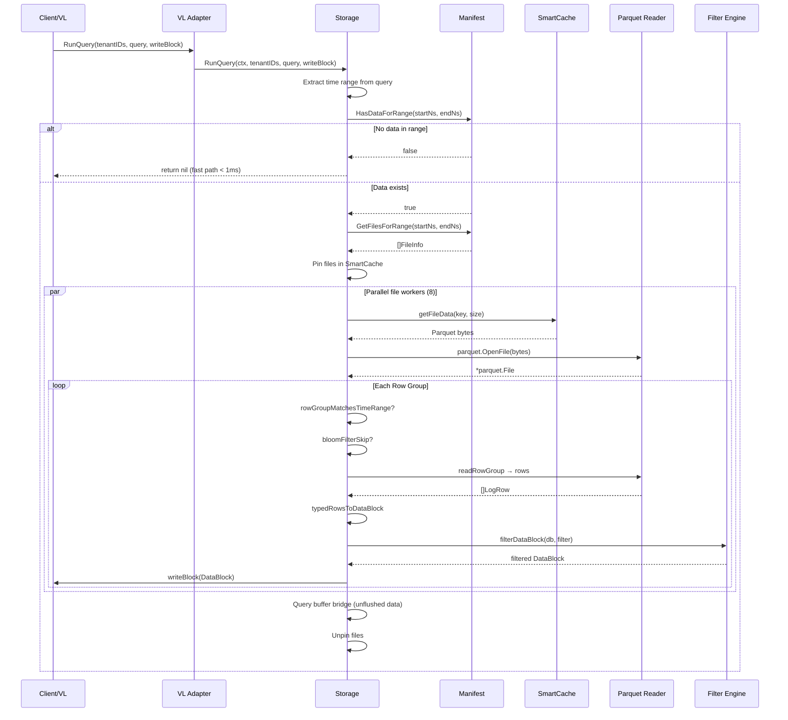

### VL/VT Adapter

**File:** `internal/vlstorage/vlstorage.go`

The adapter bridges VictoriaLogs' internal storage dispatch to our Parquet backend:

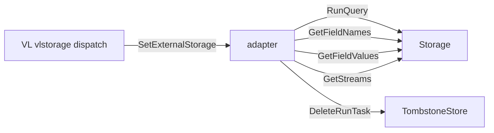

- `vlstorage.SetExternalStorage(&adapter{store, tombstones})` wires our storage into VL's dispatch
- All VL `/select/logsql/*` and `/internal/select/*` endpoints automatically route through our Parquet backend
- No VL/VT code is modified — only the storage dispatch seam is replaced

### Manifest Lookup

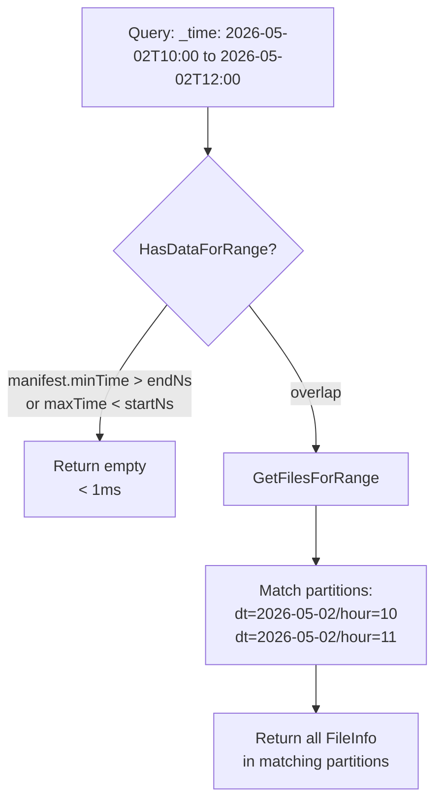

### Parallel File Processing

Files are processed in parallel via a worker pool:

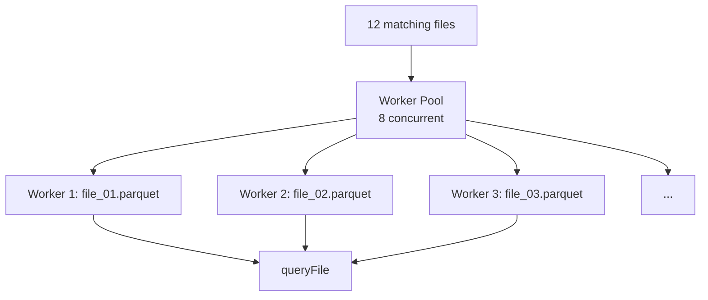

| Config | Default | Flag |
|--------|---------|------|
| `query.file_workers` | `8` | `--lakehouse.query.file-workers` |
| `query.max_concurrent` | (unlimited) | `--lakehouse.query.max-concurrent` |
| `query.timeout` | (none) | `--lakehouse.query.timeout` |
| `query.max_rows` | `0` (unlimited) | `--lakehouse.query.max-rows` |

### Single File Query

**File:** `internal/storage/parquets3/storage_query.go`

Each file goes through a multi-stage filtering pipeline:

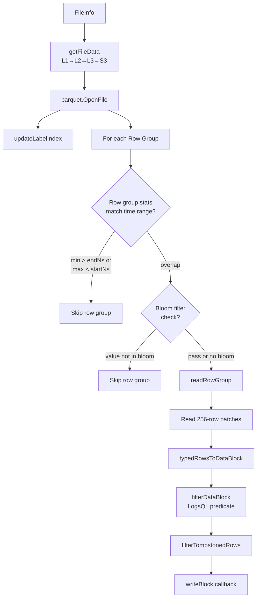

#### Row Group Stats Skip

Parquet stores min/max statistics per column per row group. The `rowGroupMatchesTimeRange` function checks `timestamp_unix_nano` column stats:

```
If rowGroup.min_timestamp > query.endNs → skip
If rowGroup.max_timestamp < query.startNs → skip
Otherwise → scan this row group
```

#### Bloom Filter Skip

For columns with bloom filters (service.name, trace_id), exact-match queries check the bloom filter before scanning:

```
buildBloomChecks(queryStr) → [{column: "service.name", value: "api-server"}]
For each check:
    If bloomFilter.Check(value) == false → skip entire row group
```

#### Row Reading

Rows are read in batches of 256 using `parquet.GenericRowGroupReader`. Each batch is converted to a DataBlock via `typedRowsToDataBlock`.

### typedRowsToDataBlock

**File:** `internal/storage/parquets3/storage_query.go`

Converts Parquet-native typed rows into VL's columnar DataBlock format:

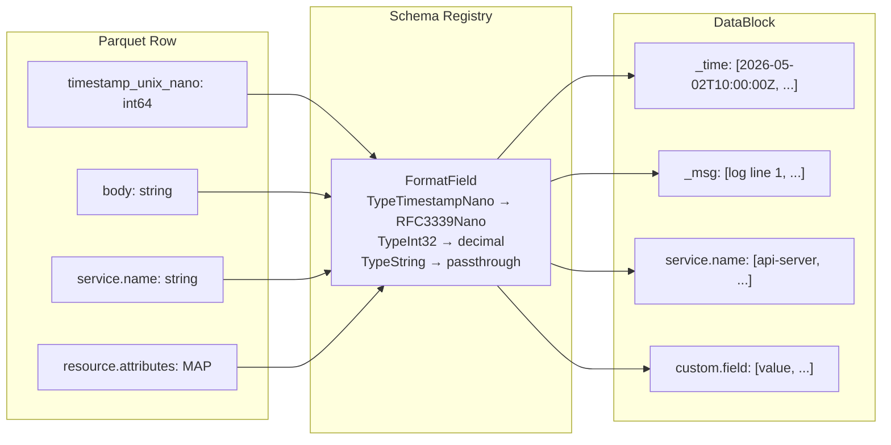

**Processing steps:**
1. Collect unique column names across all rows
2. For each row, call `toFields(row)` → `[]field{name, value}`
3. Format each field value via `registry.FormatField(name, rawValue)`
4. Accumulate into columnar `map[name][]values`
5. Set columns on DataBlock

### Filter Evaluation

**File:** `internal/storage/parquets3/filter.go`

LogsQL filter predicates are evaluated against DataBlock rows:

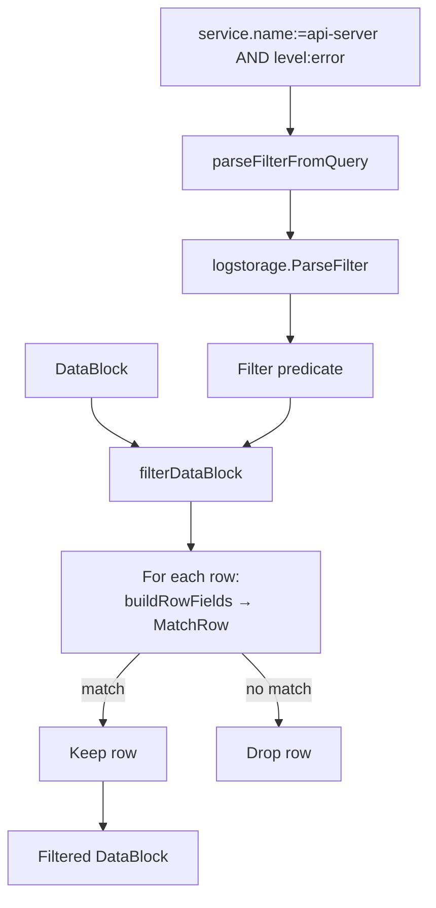

Uses VL's native `logstorage.Filter.MatchRow()` for evaluation — full LogsQL compatibility including substring, exact match, regex, NOT, AND, OR.

### Buffer Bridge

**File:** `internal/storage/parquets3/buffer_bridge.go`

For zero-delay reads, select pods query insert pods for unflushed data:

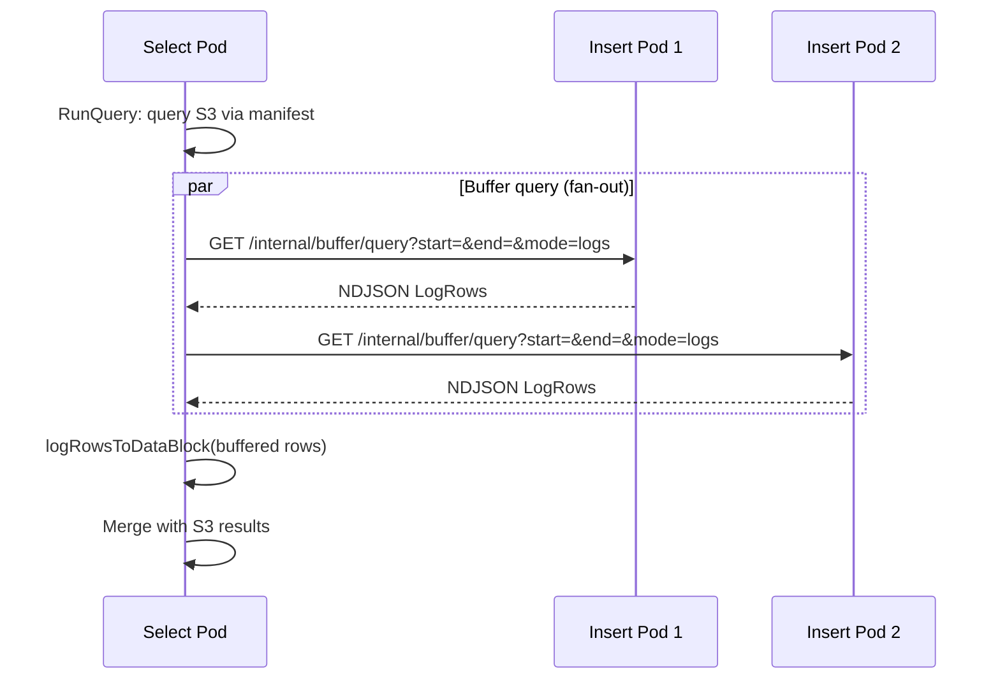

Insert pods are discovered via Kubernetes headless service DNS (`SelectConfig.InsertHeadlessService`).

## Schema Registry

**File:** `internal/schema/registry.go`

Bidirectional mapping between OTLP Parquet column names and VL/VT internal names:

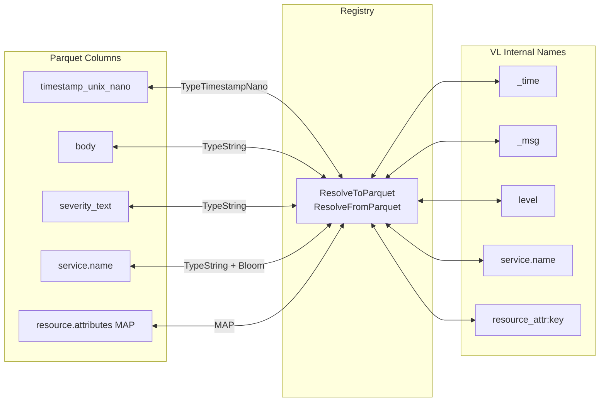

### FieldType System

Each column has a `FieldType` that controls formatting:

| FieldType | Parquet Type | Output Format | Example |
|-----------|-------------|---------------|---------|
| TypeTimestampNano | int64 | RFC3339Nano | `2026-05-02T10:00:00.123456789Z` |
| TypeInt32 | int32 | Decimal | `200` |
| TypeInt64 | int64 | Decimal | `1714694400000000000` |
| TypeFloat64 | float64 | %g format | `3.14` |
| TypeBool | bool | true/false | `true` |
| TypeString | string | Passthrough | `api-server` |

### Profiles

**LogsProfile** — 17 promoted columns:
`timestamp_unix_nano`, `body`, `severity_text`, `severity_number`, `service.name`, `k8s.namespace.name`, `k8s.pod.name`, `k8s.deployment.name`, `k8s.node.name`, `deployment.environment`, `cloud.region`, `host.name`, `trace_id`, `span_id`, `scope.name`, `_stream`, `_stream_id`

MAP columns: `resource.attributes`, `log.attributes`

Bloom filters: `service.name`, `trace_id`

**TracesProfile** — similar with span-specific fields (`span.name`, `span.kind`, `status.code`, `duration_ns`, `parent_span_id`, `start_time_unix_nano`)

MAP columns: `resource.attributes`, `span.attributes`, `scope.attributes`

## Data Row Structs

**File:** `internal/schema/row.go`

### LogRow

```
LogRow {
    TimestampUnixNano  int64              // Primary timestamp
    Body               string             // Log message (_msg)
    SeverityText       string             // level
    SeverityNumber     int32              // OTEL severity number
    ServiceName        string             // Promoted + bloom
    K8sNamespaceName   string             // Promoted
    K8sPodName         string             // Promoted
    K8sDeploymentName  string             // Promoted
    K8sNodeName        string             // Promoted
    DeployEnv          string             // Promoted
    CloudRegion        string             // Promoted
    HostName           string             // Promoted
    TraceID            string             // Promoted + bloom
    SpanID             string             // Promoted
    Stream             string             // _stream label
    StreamID           string             // _stream_id
    ScopeName          string             // Promoted
    ResourceAttributes map[string]string  // MAP column
    LogAttributes      map[string]string  // MAP column
}
```

### TraceRow

```
TraceRow {
    TimestampUnixNano    int64              // Primary timestamp
    StartTimeUnixNano    int64              // Span start
    TraceID              string             // Promoted + bloom
    SpanID               string             // Promoted
    ParentSpanID         string             // Promoted
    SpanName             string             // Promoted
    SpanKind             int32              // Promoted (OTEL enum)
    ServiceName          string             // Promoted + bloom
    StatusCode           int32              // Promoted (OTEL enum)
    StatusMessage        string             // Promoted
    DurationNs           int64              // Promoted
    ScopeName            string             // Promoted
    ... k8s/cloud fields ...
    ResourceAttributes   map[string]string  // MAP column
    SpanAttributes       map[string]string  // MAP column
    ScopeAttributes      map[string]string  // MAP column
}
```

## Tombstone Filtering

Deleted data is suppressed at query time via tombstones:

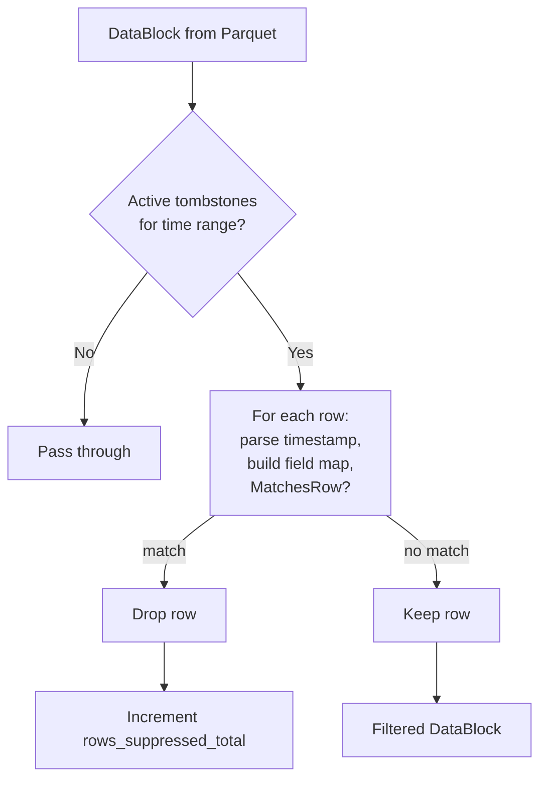

## Startup Sequence

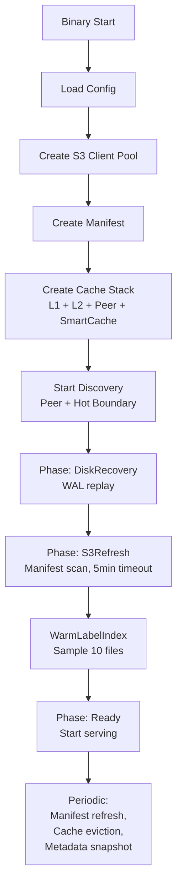

## Insert Configuration

| Config | Default | Flag |
|--------|---------|------|
| `insert.flush_interval` | `10s` | `--lakehouse.insert.flush-interval` |
| `insert.max_buffer_rows` | `50000` | `--lakehouse.insert.max-buffer-rows` |
| `insert.max_buffer_bytes` | `256MB` | `--lakehouse.insert.max-buffer-bytes` |
| `insert.target_file_size` | `128MB` | `--lakehouse.insert.target-file-size` |
| `insert.row_group_size` | `10000` | `--lakehouse.insert.row-group-size` |
| `insert.bloom_columns` | `service.name,trace_id` | `--lakehouse.insert.bloom-columns` |
| `insert.compression_level` | `7` | `--lakehouse.insert.compression-level` |

## Query Configuration

| Config | Default | Flag |
|--------|---------|------|
| `query.file_workers` | `8` | `--lakehouse.query.file-workers` |
| `query.max_concurrent` | (unlimited) | `--lakehouse.query.max-concurrent` |
| `query.timeout` | (none) | `--lakehouse.query.timeout` |
| `query.max_rows` | `0` (unlimited) | `--lakehouse.query.max-rows` |
| `query.slow_threshold` | (none) | `--lakehouse.query.slow-threshold` |
