# Storage & Parquet Flow

End-to-end data flow through Victoria Lakehouse, from VL/VT upstream input through Parquet storage to query output.

## System Overview

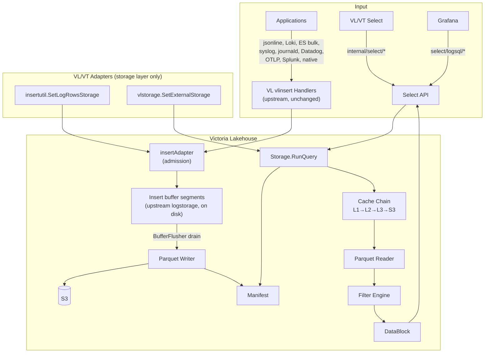
```mermaid
graph TD
    subgraph Input
        APP[Applications] -->|"jsonline, Loki, ES bulk,<br/>syslog, journald, Datadog,<br/>OTLP, Splunk, native"| INS["VL vlinsert Handlers<br/>(upstream, unchanged)"]
        VL["VL/VT Select"] -->|"internal/select/*"| SEL[Select API]
        GF[Grafana] -->|"select/logsql/*"| SEL
    end

    subgraph Victoria Lakehouse
        INS --> INSAD["insertAdapter<br/>(admission)"]
        INSAD --> BUF["Insert buffer segments<br/>(upstream logstorage, on disk)"]
        BUF -->|BufferFlusher drain| PQ[Parquet Writer]
        PQ --> S3[(S3)]
        PQ --> MAN[Manifest]

        SEL --> STOR[Storage.RunQuery]
        STOR --> MAN
        STOR --> CACHE[Cache Chain<br/>L1→L2→L3→S3]
        CACHE --> PQR[Parquet Reader]
        PQR --> FILT[Filter Engine]
        FILT --> DB[DataBlock]
        DB --> SEL
    end

    subgraph "VL/VT Adapters (storage layer only)"
        VLIAD["insertutil.SetLogRowsStorage"] --> INSAD
        VLAD[vlstorage.SetExternalStorage] --> STOR
    end
```

## Write Path

### Complete Flow

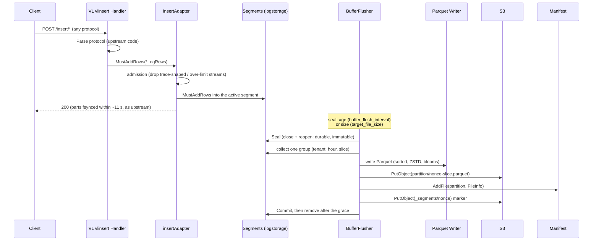
```mermaid
sequenceDiagram
    participant C as Client
    participant VLH as VL vlinsert Handler
    participant A as insertAdapter
    participant SEG as Segments (logstorage)
    participant F as BufferFlusher
    participant PW as Parquet Writer
    participant S3 as S3
    participant M as Manifest

    C->>VLH: POST /insert/* (any protocol)
    VLH->>VLH: Parse protocol (upstream code)
    VLH->>A: MustAddRows(*LogRows)
    A->>A: admission (drop trace-shaped / over-limit streams)
    A->>SEG: MustAddRows into the active segment
    A-->>C: 200 (parts fsynced within ~11 s, as upstream)

    Note over F: seal: age (buffer_flush_interval)<br/>or size (target_file_size)

    F->>SEG: Seal (close + reopen: durable, immutable)
    F->>SEG: collect one group (tenant, hour, slice)
    F->>PW: write Parquet (sorted, ZSTD, blooms)
    F->>S3: PutObject(partition/nonce-slice.parquet)
    F->>M: AddFile(partition, FileInfo)
    F->>S3: PutObject(_segments/nonce) marker
    F->>SEG: Commit, then remove after the grace
```

### Insert API

**Files:** VL upstream `vlinsert` handlers (unchanged) + `internal/vlstorage/insert.go` (adapter)

Victoria Lakehouse uses VL's native `vlinsert` handlers via `insertutil.SetLogRowsStorage()`. The insert adapter implements the `insertutil.LogRowsStorage` interface (`MustAddRows` + `CanWriteData`). All protocol parsing is VL upstream code — Lakehouse only provides the storage backend.

All VL insert protocols are supported:

| Endpoint | Format |
|----------|--------|
| `POST /insert/jsonline` | Newline-delimited JSON |
| `POST /insert/loki/api/v1/push` | Loki push (JSON + protobuf) |
| `POST /insert/elasticsearch/_bulk` | Elasticsearch bulk |
| `POST /insert/syslog` | Syslog (RFC 5424) |
| `POST /insert/journald` | systemd journal |
| `POST /insert/datadog/api/v2/logs` | Datadog logs API |
| `POST /insert/opentelemetry/v1/logs` | OTLP logs |
| `POST /insert/splunk/services/collector/event` | Splunk HEC |
| `POST /insert/native` | VL native binary format |

The adapter hands VL's `*logstorage.LogRows` to the insert buffer unchanged. When a sealed segment is drained, `DataBlockToLogRows` converts its rows into `[]schema.LogRow`, mapping fields to promoted Parquet columns or MAP columns:

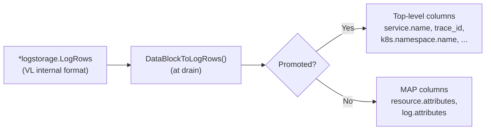
```mermaid
graph LR
    LR["*logstorage.LogRows<br/>(VL internal format)"] --> CONV["DataBlockToLogRows()<br/>(at drain)"]
    CONV --> PROM{Promoted?}
    PROM -->|Yes| TOP[Top-level columns<br/>service.name, trace_id,<br/>k8s.namespace.name, ...]
    PROM -->|No| MAP[MAP columns<br/>resource.attributes,<br/>log.attributes]
```

Promoted fields (logs): `_time`, `_msg`, `level`, `service.name`, `k8s.namespace.name`, `k8s.pod.name`, `k8s.deployment.name`, `k8s.node.name`, `deployment.environment`, `cloud.region`, `host.name`, `trace_id`, `span_id`, `scope.name`

#### Traces Insert Adapter

**File:** `lakehouse-traces/internal/vlstorage/insert.go`

The traces binary uses the identical pattern. At drain, `DataBlockToTraceRows()` maps VL fields to trace-specific promoted columns:

Promoted fields (traces): `trace_id`, `span_id`, `parent_span_id`, `span.name`, `service.name`, `duration_ns`, `start_time_unix_nano`, `status.code`, `status.message`, `span.kind`, `http.method`, `http.status_code`, `http.url`, `db.system`, `db.statement`, `k8s.namespace.name`, `k8s.pod.name`, `k8s.deployment.name`, `k8s.node.name`, `deployment.environment`, `cloud.region`, `host.name`, `scope.name`

Non-promoted fields go to `span.attributes` MAP column.

### Insert buffer and BufferFlusher

**Files:** `internal/membuffer/segments.go`, `internal/storage/parquets3/buffer_flusher.go` (and the traces-module copies)

The buffer is a sequence of upstream `logstorage.Storage` segments cut by ingest time. The flusher drains each sealed segment completely, per tenant, in groups of at most `target_file_size` that never cross an hour partition:

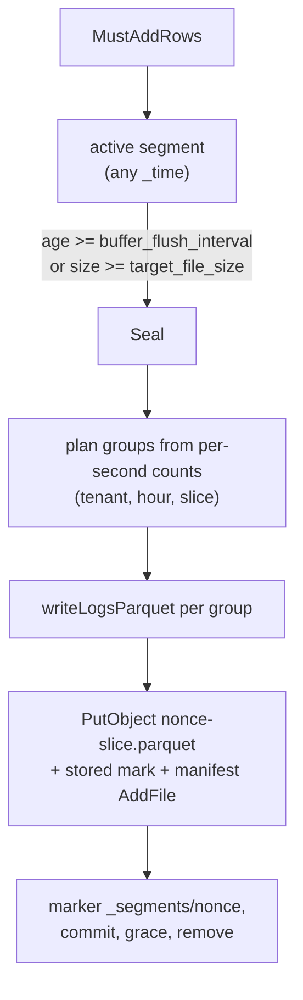
```mermaid
flowchart TD
    ADD[MustAddRows] --> ACT["active segment<br/>(any _time)"]
    ACT -->|"age >= buffer_flush_interval<br/>or size >= target_file_size"| SEAL[Seal]
    SEAL --> PLAN["plan groups from per-second counts<br/>(tenant, hour, slice)"]
    PLAN --> WRITE[writeLogsParquet per group]
    WRITE --> PUT["PutObject nonce-slice.parquet<br/>+ stored mark + manifest AddFile"]
    PUT --> MARK["marker _segments/nonce,<br/>commit, grace, remove"]
```

**Seal triggers:**
- **Age:** `insert.buffer_flush_interval` (default 5m)
- **Size:** about `insert.target_file_size` (default 128 MB) of rows while fewer than 64 segments are pending
- **Shutdown:** the flusher stops and the buffer closes; the next start drains what is left

### Parquet Writing

Each group produces a single Parquet file:

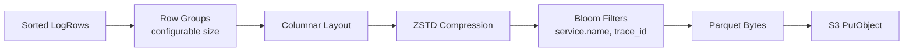
```mermaid
flowchart LR
    ROWS[Sorted LogRows] --> RG[Row Groups<br/>configurable size]
    RG --> COLS[Columnar Layout]
    COLS --> ZSTD[ZSTD Compression]
    ZSTD --> BLOOM[Bloom Filters<br/>service.name, trace_id]
    BLOOM --> BYTES[Parquet Bytes]
    BYTES --> S3[S3 PutObject]
```

**S3 key format:** `{prefix}{partition}/{nonce}-{slice}.parquet`
- Example: `logs/dt=2026-05-02/hour=10/6710a3f1c0de5b21-0000000000000002.parquet`
- `nonce` identifies the buffer segment (8 hex of Unix seconds plus 8 random hex); `slice` numbers the group inside it. The same key always carries the same bytes.

**Compression levels:**
- 1-5: ZSTD default speed
- 6-10: ZSTD better compression
- 11+: ZSTD best compression

### Buffer durability (no WAL)

There is **no separate lakehouse write-ahead log**. Durability comes from the insert
buffer itself: upstream `logstorage.Storage` segments that write rows to **on-disk
parts every ~5s and restore them on open** — the same mechanism hot VL/VT use.
The flusher's state file records which segments are committed, so on restart it
drains the rest without rewriting any object it already stored.

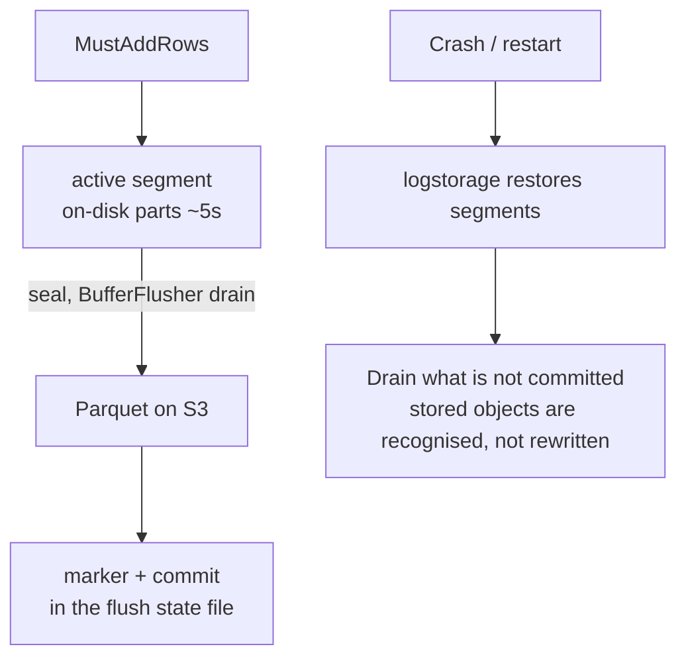
```mermaid
flowchart TD
    ADD[MustAddRows] --> BUF[active segment<br/>on-disk parts ~5s]
    BUF -->|seal, BufferFlusher drain| S3[Parquet on S3]
    S3 --> CM[marker + commit<br/>in the flush state file]
    CRASH[Crash / restart] --> RESTORE[logstorage restores segments]
    RESTORE --> REDRAIN[Drain what is not committed<br/>stored objects are recognised, not rewritten]
```

**Recovery:** on restart the buffer reopens its segments and the flusher drains
the uncommitted ones. Crash-loss window = the buffer's part flush (~5s),
matching hot VL/VT. See [Persistence & Durability](durability.md).

<!-- BEGIN GENERATED: config-keys insert.buffer_dir insert.buffer_flush_interval -->
<!-- Generated by `make config-docs` from the code; do not edit. -->

| Key | Default | Config file | Flags | Description |
|---|---|---|---|---|
| `insert.buffer_dir` | `/data/lakehouse/buffer` | set |  | The directory of the insert buffer: a sequence of upstream VictoriaLogs storages ("segments"), one directory each, holding every acknowledged row until it has been written to Parquet. |
| `insert.buffer_flush_interval` | `5m` | set |  | The longest a row waits in an open segment: the active segment is sealed this long after its first row (earlier if it reaches target_file_size while few segments wait), then written to object storage completely and removed after a short grace period. |

<!-- END GENERATED: config-keys -->

## Read Path

### Complete Flow

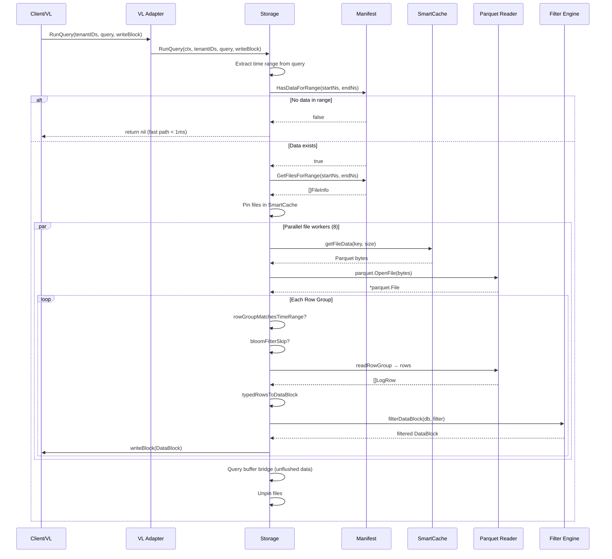
```mermaid
sequenceDiagram
    participant C as Client/VL
    participant A as VL Adapter
    participant S as Storage
    participant M as Manifest
    participant SC as SmartCache
    participant PQ as Parquet Reader
    participant F as Filter Engine

    C->>A: RunQuery(tenantIDs, query, writeBlock)
    A->>S: RunQuery(ctx, tenantIDs, query, writeBlock)
    
    S->>S: Extract time range from query
    S->>M: HasDataForRange(startNs, endNs)
    
    alt No data in range
        M-->>S: false
        S-->>C: return nil (fast path < 1ms)
    else Data exists
        M-->>S: true
        S->>M: GetFilesForRange(startNs, endNs)
        M-->>S: []FileInfo
        
        S->>S: Pin files in SmartCache
        
        par Parallel file workers (8)
            S->>SC: getFileData(key, size)
            SC-->>S: Parquet bytes
            S->>PQ: parquet.OpenFile(bytes)
            PQ-->>S: *parquet.File
            
            loop Each Row Group
                S->>S: rowGroupMatchesTimeRange?
                S->>S: bloomFilterSkip?
                S->>PQ: readRowGroup → rows
                PQ-->>S: []LogRow
                S->>S: typedRowsToDataBlock
                S->>F: filterDataBlock(db, filter)
                F-->>S: filtered DataBlock
                S->>C: writeBlock(DataBlock)
            end
        end
        
        S->>S: Query buffer bridge (unflushed data)
        S->>S: Unpin files
    end
```

### VL/VT Adapters

**Files:** `internal/vlstorage/vlstorage.go` (select adapter), `internal/vlstorage/insert.go` (insert adapter)

Both INSERT and SELECT use the same adapter pattern — Lakehouse only replaces the storage layer, never modifies VL/VT upstream code:

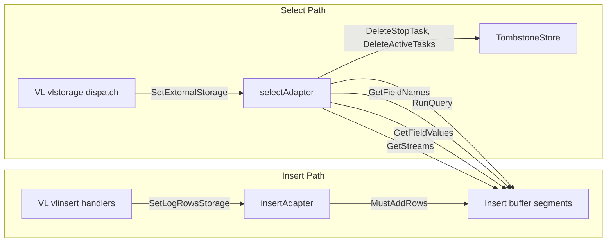
```mermaid
graph LR
    subgraph "Insert Path"
        VLI["VL vlinsert handlers"] -->|"SetLogRowsStorage"| IA["insertAdapter"]
        IA -->|"MustAddRows"| STOR[Insert buffer segments]
    end
    subgraph "Select Path"
        VLS[VL vlstorage dispatch] -->|SetExternalStorage| SA[selectAdapter]
        SA -->|RunQuery| STOR
        SA -->|GetFieldNames| STOR
        SA -->|GetFieldValues| STOR
        SA -->|GetStreams| STOR
        SA -->|"DeleteStopTask, DeleteActiveTasks"| TS[TombstoneStore]
    end
```

- `insertutil.SetLogRowsStorage(&insertAdapter{store})` wires our storage into VL's insert dispatch
- `vlstorage.SetExternalStorage(&selectAdapter{store, tombstones})` wires our storage into VL's select dispatch
- All VL `/insert/*` endpoints route through the insert adapter to our Parquet backend
- All VL `/select/logsql/*` and `/internal/select/*` endpoints route through the select adapter
- No VL/VT code is modified — only the storage dispatch seams are replaced

### Manifest Lookup

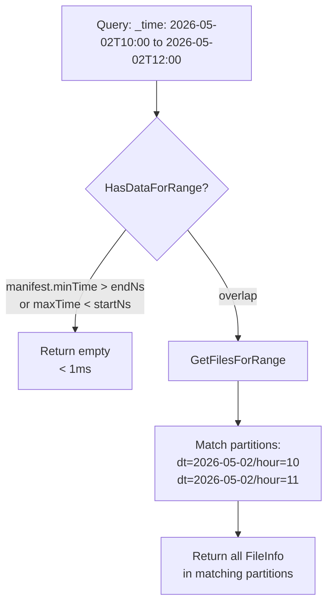
```mermaid
flowchart TD
    QUERY["Query: _time: 2026-05-02T10:00 to 2026-05-02T12:00"] 
    QUERY --> FAST{"HasDataForRange?"}
    FAST -->|manifest.minTime > endNs<br/>or maxTime < startNs| EMPTY[Return empty<br/>< 1ms]
    FAST -->|overlap| RANGE[GetFilesForRange]
    RANGE --> MATCH["Match partitions:<br/>dt=2026-05-02/hour=10<br/>dt=2026-05-02/hour=11"]
    MATCH --> FILES["Return all FileInfo<br/>in matching partitions"]
```

### Parallel File Processing

Files are processed in parallel via a worker pool:

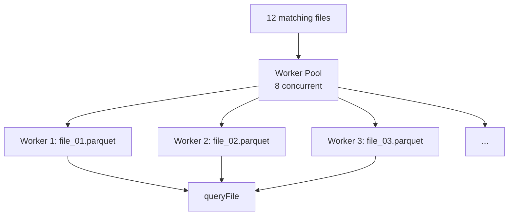
```mermaid
graph TD
    FILES["12 matching files"] --> POOL[Worker Pool<br/>8 concurrent]
    POOL --> W1[Worker 1: file_01.parquet]
    POOL --> W2[Worker 2: file_02.parquet]
    POOL --> W3[Worker 3: file_03.parquet]
    POOL --> WN["..."]
    
    W1 --> QF[queryFile]
    W2 --> QF
    W3 --> QF
```

<!-- BEGIN GENERATED: config-keys query.file_workers query.max_concurrent query.timeout query.max_rows -->
<!-- Generated by `make config-docs` from the code; do not edit. -->

| Key | Default | Config file | Flags | Description |
|---|---|---|---|---|
| `query.file_workers` | `64` | set | `-lakehouse.query.file-workers` | The deprecated per-query pool of parallel Parquet file readers, used as request and limit when file_workers_request and file_workers_limit are unset. |
| `query.max_concurrent` | `32` | set |  | Caps concurrent select queries; a query over the cap gets HTTP 429. |
| `query.timeout` | `1m` | set |  | Bounds a single query. |
| `query.max_rows` | `10000000` | set |  | The deprecated per-query row ceiling, used when max_rows_limit is unset. |

<!-- END GENERATED: config-keys -->

### Single File Query

**File:** `internal/storage/parquets3/storage_query.go`

Each file goes through a multi-stage filtering pipeline:

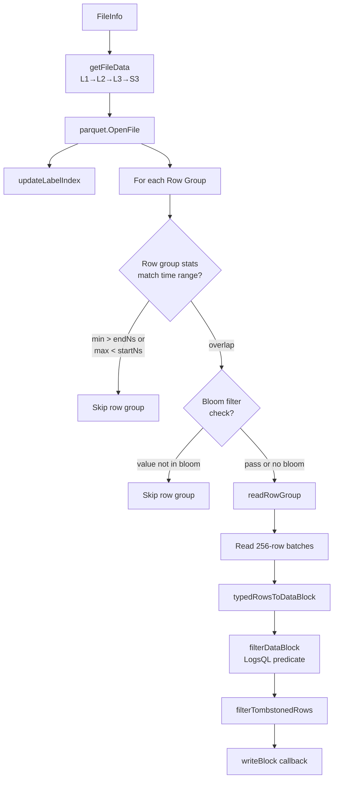
```mermaid
flowchart TD
    FILE[FileInfo] --> GET[getFileData<br/>L1→L2→L3→S3]
    GET --> OPEN[parquet.OpenFile]
    OPEN --> LABEL[updateLabelIndex]
    OPEN --> RG[For each Row Group]

    RG --> STATS{Row group stats<br/>match time range?}
    STATS -->|min > endNs or<br/>max < startNs| SKIP1[Skip row group]
    STATS -->|overlap| BLOOM{Bloom filter<br/>check?}

    BLOOM -->|value not in bloom| SKIP2[Skip row group]
    BLOOM -->|pass or no bloom| READ[readRowGroup]

    READ --> BATCH[Read 256-row batches]
    BATCH --> TYPED[typedRowsToDataBlock]
    TYPED --> FILT[filterDataBlock<br/>LogsQL predicate]
    FILT --> TOMB[filterTombstonedRows]
    TOMB --> WRITE[writeBlock callback]
```

#### Row Group Stats Skip

Parquet stores min/max statistics per column per row group. The `rowGroupMatchesTimeRange` function checks `timestamp_unix_nano` column stats:

```
If rowGroup.min_timestamp > query.endNs → skip
If rowGroup.max_timestamp < query.startNs → skip
Otherwise → scan this row group
```

#### Bloom Filter Skip

For columns with bloom filters (service.name, trace_id), exact-match queries check the bloom filter before scanning:

```
buildBloomChecks(queryStr) → [{column: "service.name", value: "api-server"}]
For each check:
    If bloomFilter.Check(value) == false → skip entire row group
```

#### Row Reading

Rows are read in batches of 256 using `parquet.GenericRowGroupReader`. Each batch is converted to a DataBlock via `typedRowsToDataBlock`.

### typedRowsToDataBlock

**File:** `internal/storage/parquets3/storage_query.go`

Converts Parquet-native typed rows into VL's columnar DataBlock format:

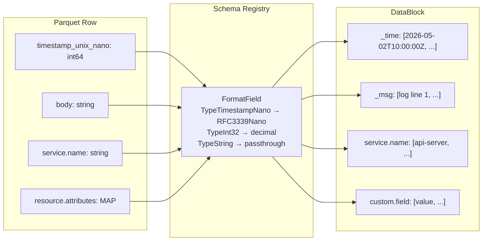
```mermaid
flowchart LR
    subgraph Parquet Row
        TS[timestamp_unix_nano: int64]
        BODY[body: string]
        SVC[service.name: string]
        RA["resource.attributes: MAP"]
    end

    subgraph Schema Registry
        FMT[FormatField<br/>TypeTimestampNano → RFC3339Nano<br/>TypeInt32 → decimal<br/>TypeString → passthrough]
    end

    subgraph DataBlock
        COL1["_time: [2026-05-02T10:00:00Z, ...]"]
        COL2["_msg: [log line 1, ...]"]
        COL3["service.name: [api-server, ...]"]
        COL4["custom.field: [value, ...]"]
    end

    TS --> FMT --> COL1
    BODY --> FMT --> COL2
    SVC --> FMT --> COL3
    RA --> FMT --> COL4
```

**Processing steps:**
1. Collect unique column names across all rows
2. For each row, call `toFields(row)` → `[]field{name, value}`
3. Format each field value via `registry.FormatField(name, rawValue)`
4. Accumulate into columnar `map[name][]values`
5. Set columns on DataBlock

### Filter Evaluation

**File:** `internal/storage/parquets3/filter.go`

LogsQL filter predicates are evaluated against DataBlock rows:

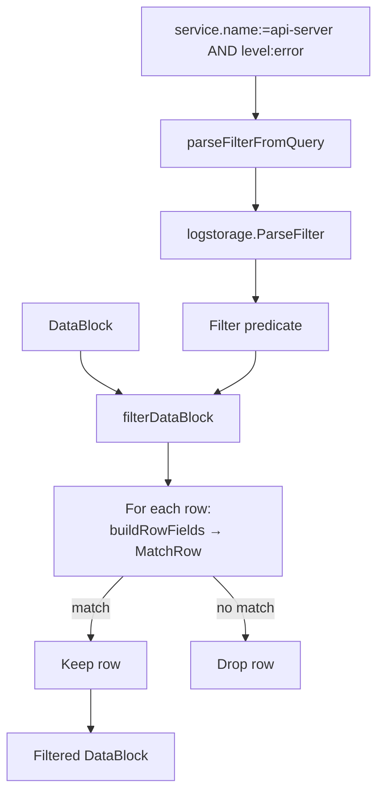
```mermaid
flowchart TD
    QUERY["service.name:=api-server AND level:error"] --> PARSE[parseFilterFromQuery]
    PARSE --> LOGSQL[logstorage.ParseFilter]
    LOGSQL --> PRED[Filter predicate]

    DB[DataBlock] --> EVAL[filterDataBlock]
    PRED --> EVAL
    EVAL --> ROW["For each row:<br/>buildRowFields → MatchRow"]
    ROW -->|match| KEEP[Keep row]
    ROW -->|no match| DROP[Drop row]
    KEEP --> RESULT[Filtered DataBlock]
```

Uses VL's native `logstorage.Filter.MatchRow()` for evaluation — full LogsQL compatibility including substring, exact match, regex, NOT, AND, OR.

### Buffer Bridge

**File:** `internal/storage/parquets3/buffer_bridge.go`

For zero-delay reads, select pods query insert pods for unflushed data. Each answer carries the rows and, in the `X-Lakehouse-Buffer-Segments` header, the nonces of the segments they came from; the scan then drops the objects those segments wrote, so no row is served twice:

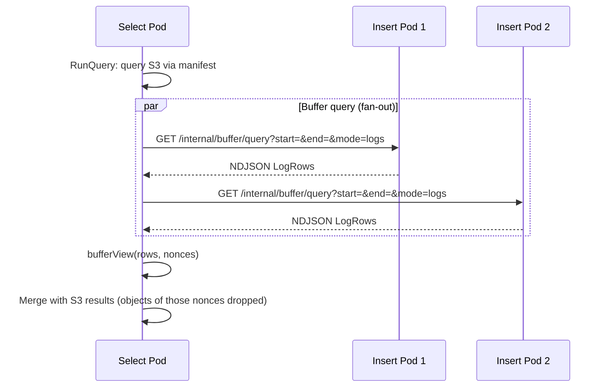
```mermaid
sequenceDiagram
    participant SEL as Select Pod
    participant INS1 as Insert Pod 1
    participant INS2 as Insert Pod 2

    SEL->>SEL: RunQuery: query S3 via manifest
    
    par Buffer query (fan-out)
        SEL->>INS1: GET /internal/buffer/query?start=&end=&mode=logs
        INS1-->>SEL: NDJSON LogRows
        SEL->>INS2: GET /internal/buffer/query?start=&end=&mode=logs
        INS2-->>SEL: NDJSON LogRows
    end
    
    SEL->>SEL: bufferView(rows, nonces)
    SEL->>SEL: Merge with S3 results (objects of those nonces dropped)
```

Insert pods are discovered via Kubernetes headless service DNS (`SelectConfig.InsertHeadlessService`).

## Schema Registry

**File:** `internal/schema/registry.go`

Bidirectional mapping between OTLP Parquet column names and VL/VT internal names:

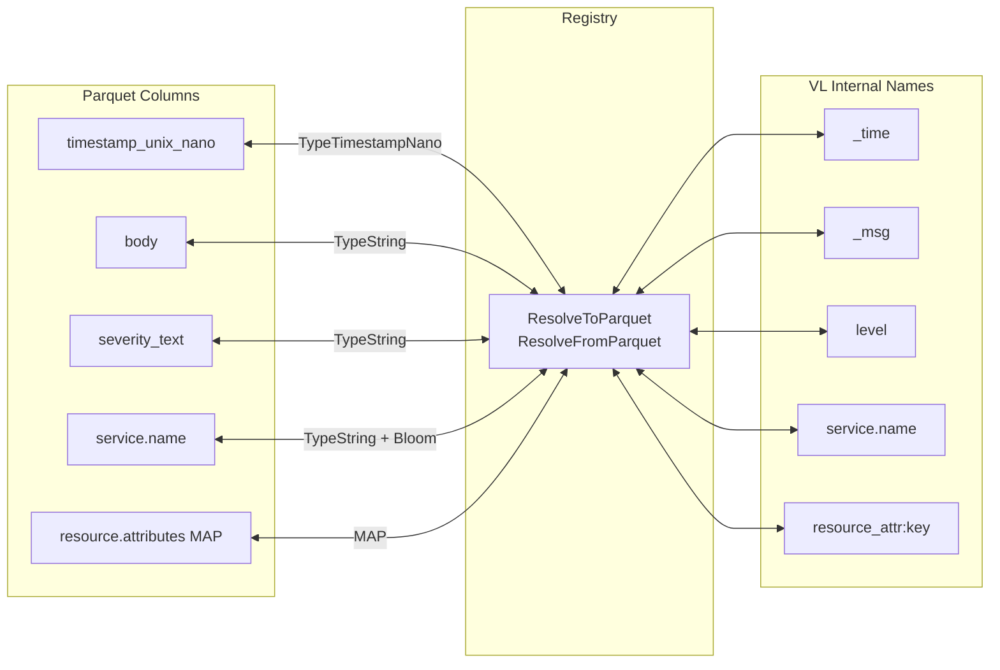
```mermaid
graph LR
    subgraph Parquet Columns
        P1[timestamp_unix_nano]
        P2[body]
        P3[severity_text]
        P4[service.name]
        P5["resource.attributes MAP"]
    end

    subgraph Registry
        R[ResolveToParquet<br/>ResolveFromParquet]
    end

    subgraph VL Internal Names
        V1[_time]
        V2[_msg]
        V3[level]
        V4[service.name]
        V5["resource_attr:key"]
    end

    P1 <-->|TypeTimestampNano| R
    P2 <-->|TypeString| R
    P3 <-->|TypeString| R
    P4 <-->|TypeString + Bloom| R
    P5 <-->|MAP| R
    R <--> V1
    R <--> V2
    R <--> V3
    R <--> V4
    R <--> V5
```

### FieldType System

Each column has a `FieldType` that controls formatting:

| FieldType | Parquet Type | Output Format | Example |
|-----------|-------------|---------------|---------|
| TypeTimestampNano | int64 | RFC3339Nano | `2026-05-02T10:00:00.123456789Z` |
| TypeInt32 | int32 | Decimal | `200` |
| TypeInt64 | int64 | Decimal | `1714694400000000000` |
| TypeFloat64 | float64 | %g format | `3.14` |
| TypeBool | bool | true/false | `true` |
| TypeString | string | Passthrough | `api-server` |

### Profiles

**LogsProfile** — 17 promoted columns:
`timestamp_unix_nano`, `body`, `severity_text`, `severity_number`, `service.name`, `k8s.namespace.name`, `k8s.pod.name`, `k8s.deployment.name`, `k8s.node.name`, `deployment.environment`, `cloud.region`, `host.name`, `trace_id`, `span_id`, `scope.name`, `_stream`, `_stream_id`

MAP columns: `resource.attributes`, `log.attributes`

Bloom filters: `service.name`, `trace_id`

**TracesProfile** — similar with span-specific fields (`span.name`, `span.kind`, `status.code`, `duration_ns`, `parent_span_id`, `start_time_unix_nano`)

MAP columns: `resource.attributes`, `span.attributes`, `scope.attributes`

## Data Row Structs

**File:** `internal/schema/row.go`

### LogRow

```
LogRow {
    TimestampUnixNano  int64              // Primary timestamp
    Body               string             // Log message (_msg)
    SeverityText       string             // level
    SeverityNumber     int32              // OTEL severity number
    ServiceName        string             // Promoted + bloom
    K8sNamespaceName   string             // Promoted
    K8sPodName         string             // Promoted
    K8sDeploymentName  string             // Promoted
    K8sNodeName        string             // Promoted
    DeployEnv          string             // Promoted
    CloudRegion        string             // Promoted
    HostName           string             // Promoted
    TraceID            string             // Promoted + bloom
    SpanID             string             // Promoted
    Stream             string             // _stream label
    StreamID           string             // _stream_id
    ScopeName          string             // Promoted
    ResourceAttributes map[string]string  // MAP column
    LogAttributes      map[string]string  // MAP column
}
```

### TraceRow

```
TraceRow {
    TimestampUnixNano    int64              // Primary timestamp
    StartTimeUnixNano    int64              // Span start
    TraceID              string             // Promoted + bloom
    SpanID               string             // Promoted
    ParentSpanID         string             // Promoted
    SpanName             string             // Promoted
    SpanKind             int32              // Promoted (OTEL enum)
    ServiceName          string             // Promoted + bloom
    StatusCode           int32              // Promoted (OTEL enum)
    StatusMessage        string             // Promoted
    DurationNs           int64              // Promoted
    ScopeName            string             // Promoted
    ... k8s/cloud fields ...
    ResourceAttributes   map[string]string  // MAP column
    SpanAttributes       map[string]string  // MAP column
    ScopeAttributes      map[string]string  // MAP column
}
```

## Tombstone Filtering

Deleted data is suppressed at query time via tombstones:

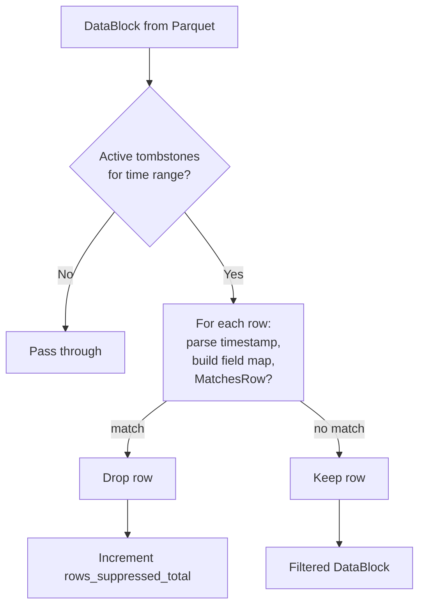
```mermaid
flowchart TD
    DB[DataBlock from Parquet] --> TOMB{Active tombstones<br/>for time range?}
    TOMB -->|No| PASS[Pass through]
    TOMB -->|Yes| CHECK[For each row:<br/>parse timestamp,<br/>build field map,<br/>MatchesRow?]
    CHECK -->|match| SUPPRESS[Drop row]
    CHECK -->|no match| KEEP[Keep row]
    KEEP --> OUT[Filtered DataBlock]
    SUPPRESS --> METRIC[Increment rows_suppressed_total]
```

## Startup Sequence

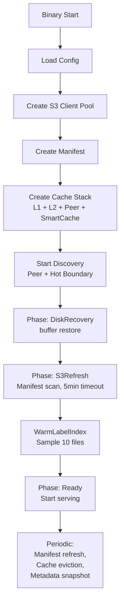
```mermaid
flowchart TD
    START[Binary Start] --> CFG[Load Config]
    CFG --> S3POOL[Create S3 Client Pool]
    S3POOL --> MAN[Create Manifest]
    MAN --> CACHE[Create Cache Stack<br/>L1 + L2 + Peer + SmartCache]
    CACHE --> DISC[Start Discovery<br/>Peer + Hot Boundary]

    DISC --> P1[Phase: DiskRecovery<br/>buffer restore]
    P1 --> P2[Phase: S3Refresh<br/>Manifest scan, 5min timeout]
    P2 --> P3[WarmLabelIndex<br/>Sample 10 files]
    P3 --> P4[Phase: Ready<br/>Start serving]

    P4 --> TICK[Periodic:<br/>Manifest refresh,<br/>Cache eviction,<br/>Metadata snapshot]
```

## Insert Configuration

<!-- BEGIN GENERATED: config-keys insert.target_file_size insert.row_group_size insert.bloom_columns insert.compression_level -->
<!-- Generated by `make config-docs` from the code; do not edit. -->

| Key | Default | Config file | Flags | Description |
|---|---|---|---|---|
| `insert.target_file_size` | `128MB` | set |  | The target size of a Parquet object, as a size string: the buffer flusher cuts a segment into objects of about this size, and a segment that reaches it (while few segments wait) is sealed early. |
| `insert.row_group_size` | `10000` | set |  | The number of rows per Parquet row group in freshly written files. |
| `insert.bloom_columns` | `[service.name, trace_id]` | set |  | Extra columns to bloom-index on write, in addition to the signal's built-in bloom columns. |
| `insert.compression_level` | `3` | set |  | The zstd level (1-22) of freshly written files; compaction recompresses older files per compaction.compression_level_by_output_level. |

<!-- END GENERATED: config-keys -->

## Query Configuration

<!-- BEGIN GENERATED: config-keys query.file_workers query.max_concurrent query.timeout query.max_rows query.slow_threshold -->
<!-- Generated by `make config-docs` from the code; do not edit. -->

| Key | Default | Config file | Flags | Description |
|---|---|---|---|---|
| `query.file_workers` | `64` | set | `-lakehouse.query.file-workers` | The deprecated per-query pool of parallel Parquet file readers, used as request and limit when file_workers_request and file_workers_limit are unset. |
| `query.max_concurrent` | `32` | set |  | Caps concurrent select queries; a query over the cap gets HTTP 429. |
| `query.timeout` | `1m` | set |  | Bounds a single query. |
| `query.max_rows` | `10000000` | set |  | The deprecated per-query row ceiling, used when max_rows_limit is unset. |
| `query.slow_threshold` | `5s` | set |  | Logs queries that run longer than this. |

<!-- END GENERATED: config-keys -->
