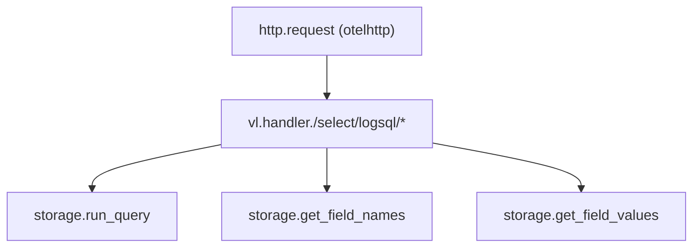
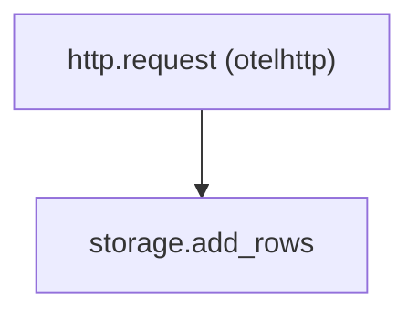

# Phase 1: Instrumentation & Baselines — Implementation Plan

> **For agentic workers:** REQUIRED SUB-SKILL: Use superpowers:subagent-driven-development (recommended) or superpowers:executing-plans to implement this plan task-by-task. Steps use checkbox (`- [ ]`) syntax for tracking.

**Goal:** Add OTEL tracing across the full HTTP→VL→storage→S3 flow for both signals, and build a benchmark CLI that produces baseline JSON files with per-stage latency breakdowns.

**Architecture:** Three-layer instrumentation (HTTP middleware, wrapVL span, TracedStorage decorator) instruments every query and insert without modifying upstream VL/VT code. A standalone benchmark CLI (`cmd/bench`) seeds data via real LH insert endpoints, queries via select endpoints, and records cold/warm/hot latency with stage-level OTEL span data. Both modules (root logs, lakehouse-traces) get identical instrumentation via the shared `internal/telemetry/` package.

**Tech Stack:** `go.opentelemetry.io/otel` (traces SDK), `go.opentelemetry.io/contrib/instrumentation/net/http/otelhttp` (HTTP middleware), OTLP gRPC exporter, `internal/telemetry/` package for init/shutdown/config, existing `cmd/loadtest` extended with baseline mode.

**Important:** All Go commands MUST use `GOWORK=off` prefix. Both modules have incompatible VL versions. Never run `go mod tidy` or `go test` without it.

---

## File Structure

### New files (shared, root module)

| File | Responsibility |
|---|---|
| `internal/telemetry/telemetry.go` | OTEL SDK init, shutdown, global tracer provider |
| `internal/telemetry/telemetry_test.go` | Tests for init/shutdown/config |
| `internal/telemetry/traced_storage.go` | `TracedStorage` decorator wrapping `storage.Storage` |
| `internal/telemetry/traced_storage_test.go` | Tests for all traced methods |
| `internal/telemetry/traced_writer.go` | `TracedWriter` decorator wrapping `vlstorage.LogWriter` |
| `internal/telemetry/traced_writer_test.go` | Tests for insert tracing |
| `internal/config/telemetry.go` | `TelemetryConfig` struct and defaults |
| `internal/config/telemetry_test.go` | Config parsing/validation tests |
| `cmd/bench/main.go` | Benchmark CLI entry point |
| `cmd/bench/seed.go` | Data seeding via LH insert APIs |
| `cmd/bench/query.go` | Query benchmarks with cold/warm/hot cycles |
| `cmd/bench/baseline.go` | Baseline JSON output format |
| `cmd/bench/baseline_test.go` | Tests for baseline format |
| `benchmarks/.gitkeep` | Directory for baseline JSON files |

### Modified files

| File | Change |
|---|---|
| `go.mod` | Add OTEL dependencies |
| `lakehouse-traces/go.mod` | Add OTEL dependencies |
| `internal/config/config.go` | Add `Telemetry TelemetryConfig` field, merge logic, defaults |
| `internal/selectapi/handler.go` | Add OTEL span in `wrapVL()` |
| `internal/vlstorage/vlstorage.go` | Wrap storage with `TracedStorage` before `SetExternalStorage` |
| `internal/vlstorage/insert.go` | Wrap writer with `TracedWriter` before `SetLogRowsStorage` |
| `lakehouse-traces/internal/vlstorage/vlstorage.go` | Same traced storage wrapping |
| `cmd/lakehouse-logs/main.go` | Init OTEL, wire `otelhttp` middleware, shutdown hook |
| `Makefile` | Add `bench` target |

---

### Task 1: Telemetry Config

**Files:**
- Create: `internal/config/telemetry.go`
- Create: `internal/config/telemetry_test.go`
- Modify: `internal/config/config.go:37-67` (Config struct)
- Modify: `internal/config/config.go:414-626` (Default function)
- Modify: `internal/config/config.go:975+` (mergeConfig function)

- [ ] **Step 1: Write the failing test**

Create `internal/config/telemetry_test.go`:

```go
package config

import (
	"testing"
	"time"
)

func TestTelemetryConfig_Defaults(t *testing.T) {
	cfg := Default()
	if cfg.Telemetry.Enabled {
		t.Error("telemetry should be disabled by default")
	}
	if cfg.Telemetry.SampleRate != 0.1 {
		t.Errorf("default sample rate: got %v, want 0.1", cfg.Telemetry.SampleRate)
	}
	if cfg.Telemetry.AlwaysSampleSlow != true {
		t.Error("always_sample_slow should default to true")
	}
	if cfg.Telemetry.BatchTimeout != 5*time.Second {
		t.Errorf("batch timeout: got %v, want 5s", cfg.Telemetry.BatchTimeout)
	}
}

func TestTelemetryConfig_YAML(t *testing.T) {
	yaml := `
lakehouse:
  telemetry:
    enabled: true
    endpoint: "http://tempo:4317"
    sample_rate: 1.0
    always_sample_slow: false
`
	cfg, err := loadFromBytes([]byte(yaml))
	if err != nil {
		t.Fatalf("load: %v", err)
	}
	if !cfg.Telemetry.Enabled {
		t.Error("telemetry should be enabled")
	}
	if cfg.Telemetry.Endpoint != "http://tempo:4317" {
		t.Errorf("endpoint: got %q, want %q", cfg.Telemetry.Endpoint, "http://tempo:4317")
	}
	if cfg.Telemetry.SampleRate != 1.0 {
		t.Errorf("sample rate: got %v, want 1.0", cfg.Telemetry.SampleRate)
	}
	if cfg.Telemetry.AlwaysSampleSlow {
		t.Error("always_sample_slow should be false")
	}
}

func TestTelemetryConfig_Merge(t *testing.T) {
	base := Default()
	overlay := &Config{
		Telemetry: TelemetryConfig{
			Enabled:  true,
			Endpoint: "http://custom:4317",
		},
	}
	merged := mergeConfig(base, overlay)
	if !merged.Telemetry.Enabled {
		t.Error("merged telemetry should be enabled")
	}
	if merged.Telemetry.Endpoint != "http://custom:4317" {
		t.Errorf("merged endpoint: got %q", merged.Telemetry.Endpoint)
	}
	if merged.Telemetry.SampleRate != 0.1 {
		t.Errorf("merged sample rate should keep default 0.1, got %v", merged.Telemetry.SampleRate)
	}
}
```

- [ ] **Step 2: Run test to verify it fails**

Run: `GOWORK=off go test ./internal/config/ -run TestTelemetry -v`
Expected: FAIL — `TelemetryConfig` type not defined

- [ ] **Step 3: Create TelemetryConfig struct**

Create `internal/config/telemetry.go`:

```go
package config

import "time"

type TelemetryConfig struct {
	Enabled          bool          `yaml:"enabled"`
	Endpoint         string        `yaml:"endpoint"`
	SampleRate       float64       `yaml:"sample_rate"`
	AlwaysSampleSlow bool          `yaml:"always_sample_slow"`
	ServiceName      string        `yaml:"service_name"`
	BatchTimeout     time.Duration `yaml:"batch_timeout"`
}
```

- [ ] **Step 4: Add Telemetry field to Config struct**

In `internal/config/config.go`, add to the Config struct (after `UI UIConfig`):

```go
Telemetry TelemetryConfig `yaml:"telemetry"`
```

- [ ] **Step 5: Add defaults in Default()**

In `internal/config/config.go` Default() function, add before the closing brace of the return:

```go
Telemetry: TelemetryConfig{
    Enabled:          false,
    SampleRate:       0.1,
    AlwaysSampleSlow: true,
    BatchTimeout:     5 * time.Second,
},
```

- [ ] **Step 6: Add merge logic in mergeConfig()**

In `internal/config/config.go` mergeConfig(), add a telemetry merge block:

```go
// Telemetry
if overlay.Telemetry.Enabled {
    base.Telemetry.Enabled = true
}
if overlay.Telemetry.Endpoint != "" {
    base.Telemetry.Endpoint = overlay.Telemetry.Endpoint
}
if overlay.Telemetry.SampleRate > 0 {
    base.Telemetry.SampleRate = overlay.Telemetry.SampleRate
}
if !overlay.Telemetry.AlwaysSampleSlow {
    base.Telemetry.AlwaysSampleSlow = false
}
if overlay.Telemetry.ServiceName != "" {
    base.Telemetry.ServiceName = overlay.Telemetry.ServiceName
}
if overlay.Telemetry.BatchTimeout > 0 {
    base.Telemetry.BatchTimeout = overlay.Telemetry.BatchTimeout
}
```

- [ ] **Step 7: Run tests to verify they pass**

Run: `GOWORK=off go test ./internal/config/ -run TestTelemetry -v`
Expected: PASS (3 tests)

- [ ] **Step 8: Run full config test suite**

Run: `GOWORK=off go test ./internal/config/ -count=1 -short`
Expected: all existing tests still pass

- [ ] **Step 9: Commit**

```bash
git add internal/config/telemetry.go internal/config/telemetry_test.go internal/config/config.go
git commit -m "feat: add telemetry configuration for OTEL tracing"
```

---

### Task 2: OTEL SDK Init/Shutdown

**Files:**
- Create: `internal/telemetry/telemetry.go`
- Create: `internal/telemetry/telemetry_test.go`
- Modify: `go.mod` (add OTEL deps)

- [ ] **Step 1: Add OTEL dependencies**

```bash
cd /Users/slawomirskowron/github/victoria-lakehouse
GOWORK=off go get go.opentelemetry.io/otel@latest \
  go.opentelemetry.io/otel/sdk@latest \
  go.opentelemetry.io/otel/sdk/trace@latest \
  go.opentelemetry.io/otel/exporters/otlp/otlptrace/otlptracegrpc@latest \
  go.opentelemetry.io/contrib/instrumentation/net/http/otelhttp@latest \
  go.opentelemetry.io/otel/trace@latest
```

- [ ] **Step 2: Write the failing test**

Create `internal/telemetry/telemetry_test.go`:

```go
package telemetry

import (
	"context"
	"testing"

	"github.com/ReliablyObserve/victoria-lakehouse/internal/config"
	"go.opentelemetry.io/otel"
	"go.opentelemetry.io/otel/trace"
	"go.opentelemetry.io/otel/trace/noop"
)

func TestInit_Disabled(t *testing.T) {
	cfg := config.TelemetryConfig{Enabled: false}
	shutdown, err := Init(context.Background(), cfg, "test-service")
	if err != nil {
		t.Fatalf("Init: %v", err)
	}
	defer shutdown(context.Background())

	tp := otel.GetTracerProvider()
	if _, ok := tp.(*noop.TracerProvider); !ok {
		t.Errorf("disabled config should use noop provider, got %T", tp)
	}
}

func TestInit_Enabled_NoEndpoint(t *testing.T) {
	cfg := config.TelemetryConfig{
		Enabled:    true,
		SampleRate: 1.0,
	}
	shutdown, err := Init(context.Background(), cfg, "test-service")
	if err != nil {
		t.Fatalf("Init: %v", err)
	}
	defer shutdown(context.Background())

	tracer := otel.Tracer("test")
	_, span := tracer.Start(context.Background(), "test-span")
	if !span.SpanContext().IsValid() {
		t.Error("span should be valid with enabled config")
	}
	span.End()
}

func TestTracer_ReturnsNamedTracer(t *testing.T) {
	cfg := config.TelemetryConfig{Enabled: true, SampleRate: 1.0}
	shutdown, err := Init(context.Background(), cfg, "test-svc")
	if err != nil {
		t.Fatalf("Init: %v", err)
	}
	defer shutdown(context.Background())

	tr := Tracer()
	if tr == nil {
		t.Fatal("Tracer() returned nil")
	}
	_, span := tr.Start(context.Background(), "op")
	if !span.SpanContext().IsValid() {
		t.Error("span from Tracer() should be valid")
	}
	span.End()
}

func TestShutdown_Idempotent(t *testing.T) {
	cfg := config.TelemetryConfig{Enabled: true, SampleRate: 1.0}
	shutdown, err := Init(context.Background(), cfg, "test-svc")
	if err != nil {
		t.Fatalf("Init: %v", err)
	}
	shutdown(context.Background())
	shutdown(context.Background())
}
```

- [ ] **Step 3: Run test to verify it fails**

Run: `GOWORK=off go test ./internal/telemetry/ -run TestInit -v`
Expected: FAIL — package doesn't exist

- [ ] **Step 4: Implement telemetry.go**

Create `internal/telemetry/telemetry.go`:

```go
package telemetry

import (
	"context"
	"sync"

	"github.com/ReliablyObserve/victoria-lakehouse/internal/config"

	"go.opentelemetry.io/otel"
	"go.opentelemetry.io/otel/exporters/otlp/otlptrace/otlptracegrpc"
	"go.opentelemetry.io/otel/sdk/resource"
	sdktrace "go.opentelemetry.io/otel/sdk/trace"
	semconv "go.opentelemetry.io/otel/semconv/v1.26.0"
	"go.opentelemetry.io/otel/trace"
	"go.opentelemetry.io/otel/trace/noop"
)

var (
	globalTracer trace.Tracer
	mu           sync.Mutex
)

func Tracer() trace.Tracer {
	mu.Lock()
	defer mu.Unlock()
	if globalTracer == nil {
		return noop.NewTracerProvider().Tracer("lakehouse")
	}
	return globalTracer
}

func Init(ctx context.Context, cfg config.TelemetryConfig, serviceName string) (func(context.Context), error) {
	if !cfg.Enabled {
		otel.SetTracerProvider(noop.NewTracerProvider())
		mu.Lock()
		globalTracer = noop.NewTracerProvider().Tracer("lakehouse")
		mu.Unlock()
		return func(context.Context) {}, nil
	}

	res, err := resource.New(ctx,
		resource.WithAttributes(semconv.ServiceName(serviceName)),
	)
	if err != nil {
		return nil, err
	}

	var exporter sdktrace.SpanExporter
	if cfg.Endpoint != "" {
		exporter, err = otlptracegrpc.New(ctx,
			otlptracegrpc.WithEndpoint(cfg.Endpoint),
			otlptracegrpc.WithInsecure(),
		)
		if err != nil {
			return nil, err
		}
	} else {
		exporter = &discardExporter{}
	}

	sampler := sdktrace.ParentBased(sdktrace.TraceIDRatioBased(cfg.SampleRate))

	tp := sdktrace.NewTracerProvider(
		sdktrace.WithResource(res),
		sdktrace.WithBatcher(exporter,
			sdktrace.WithBatchTimeout(cfg.BatchTimeout),
		),
		sdktrace.WithSampler(sampler),
	)

	otel.SetTracerProvider(tp)

	mu.Lock()
	globalTracer = tp.Tracer("lakehouse")
	mu.Unlock()

	return func(ctx context.Context) {
		_ = tp.Shutdown(ctx)
	}, nil
}

type discardExporter struct{}

func (d *discardExporter) ExportSpans(_ context.Context, _ []sdktrace.ReadOnlySpan) error {
	return nil
}
func (d *discardExporter) Shutdown(_ context.Context) error { return nil }
```

- [ ] **Step 5: Run tests to verify they pass**

Run: `GOWORK=off go test ./internal/telemetry/ -v`
Expected: PASS (4 tests)

- [ ] **Step 6: Commit**

```bash
git add internal/telemetry/telemetry.go internal/telemetry/telemetry_test.go go.mod go.sum
git commit -m "feat: add OTEL SDK initialization and shutdown"
```

---

### Task 3: TracedStorage Decorator

**Files:**
- Create: `internal/telemetry/traced_storage.go`
- Create: `internal/telemetry/traced_storage_test.go`

- [ ] **Step 1: Write the failing test**

Create `internal/telemetry/traced_storage_test.go`:

```go
package telemetry

import (
	"context"
	"testing"

	"github.com/ReliablyObserve/victoria-lakehouse/internal/config"
	"github.com/ReliablyObserve/victoria-lakehouse/internal/storage"
	"github.com/VictoriaMetrics/VictoriaLogs/lib/logstorage"
	"go.opentelemetry.io/otel"
	sdktrace "go.opentelemetry.io/otel/sdk/trace"
	"go.opentelemetry.io/otel/sdk/trace/tracetest"
)

type mockStorage struct {
	runQueryCalled      bool
	getFieldNamesCalled bool
	hasDataResult       bool
}

func (m *mockStorage) RunQuery(ctx context.Context, tenantIDs []logstorage.TenantID, q *logstorage.Query, fn logstorage.WriteDataBlockFunc) error {
	m.runQueryCalled = true
	return nil
}
func (m *mockStorage) GetFieldNames(ctx context.Context, tenantIDs []logstorage.TenantID, q *logstorage.Query) ([]logstorage.ValueWithHits, error) {
	m.getFieldNamesCalled = true
	return nil, nil
}
func (m *mockStorage) GetFieldValues(ctx context.Context, tenantIDs []logstorage.TenantID, q *logstorage.Query, fieldName string, limit uint64) ([]logstorage.ValueWithHits, error) {
	return nil, nil
}
func (m *mockStorage) GetStreamFieldNames(ctx context.Context, tenantIDs []logstorage.TenantID, q *logstorage.Query) ([]logstorage.ValueWithHits, error) {
	return nil, nil
}
func (m *mockStorage) GetStreamFieldValues(ctx context.Context, tenantIDs []logstorage.TenantID, q *logstorage.Query, fieldName string, limit uint64) ([]logstorage.ValueWithHits, error) {
	return nil, nil
}
func (m *mockStorage) GetStreams(ctx context.Context, tenantIDs []logstorage.TenantID, q *logstorage.Query, limit uint64) ([]logstorage.ValueWithHits, error) {
	return nil, nil
}
func (m *mockStorage) GetStreamIDs(ctx context.Context, tenantIDs []logstorage.TenantID, q *logstorage.Query, limit uint64) ([]logstorage.ValueWithHits, error) {
	return nil, nil
}
func (m *mockStorage) HasDataForRange(startNs, endNs int64) bool { return m.hasDataResult }
func (m *mockStorage) Close() error                              { return nil }

func setupTestTracer(t *testing.T) *tracetest.InMemoryExporter {
	t.Helper()
	exporter := tracetest.NewInMemoryExporter()
	tp := sdktrace.NewTracerProvider(sdktrace.WithSyncer(exporter))
	otel.SetTracerProvider(tp)
	cfg := config.TelemetryConfig{Enabled: true, SampleRate: 1.0}
	_ = cfg
	t.Cleanup(func() { _ = tp.Shutdown(context.Background()) })
	return exporter
}

func TestTracedStorage_RunQuery_CreatesSpan(t *testing.T) {
	exp := setupTestTracer(t)
	inner := &mockStorage{}
	ts := NewTracedStorage(inner)

	err := ts.RunQuery(context.Background(), nil, nil, nil)
	if err != nil {
		t.Fatalf("RunQuery: %v", err)
	}
	if !inner.runQueryCalled {
		t.Error("inner RunQuery not called")
	}

	spans := exp.GetSpans()
	if len(spans) == 0 {
		t.Fatal("no spans recorded")
	}
	if spans[0].Name != "storage.run_query" {
		t.Errorf("span name: got %q, want %q", spans[0].Name, "storage.run_query")
	}
}

func TestTracedStorage_GetFieldNames_CreatesSpan(t *testing.T) {
	exp := setupTestTracer(t)
	inner := &mockStorage{}
	ts := NewTracedStorage(inner)

	_, err := ts.GetFieldNames(context.Background(), nil, nil)
	if err != nil {
		t.Fatalf("GetFieldNames: %v", err)
	}
	if !inner.getFieldNamesCalled {
		t.Error("inner GetFieldNames not called")
	}

	spans := exp.GetSpans()
	if len(spans) == 0 {
		t.Fatal("no spans recorded")
	}
	if spans[0].Name != "storage.get_field_names" {
		t.Errorf("span name: got %q, want %q", spans[0].Name, "storage.get_field_names")
	}
}

func TestTracedStorage_HasDataForRange_NoSpan(t *testing.T) {
	exp := setupTestTracer(t)
	inner := &mockStorage{hasDataResult: true}
	ts := NewTracedStorage(inner)

	result := ts.HasDataForRange(0, 100)
	if !result {
		t.Error("expected true")
	}

	spans := exp.GetSpans()
	if len(spans) != 0 {
		t.Errorf("HasDataForRange should not create spans (too hot), got %d", len(spans))
	}
}

func TestTracedStorage_DelegatesAll(t *testing.T) {
	inner := &mockStorage{}
	ts := NewTracedStorage(inner)

	var s storage.Storage = ts
	_ = s
}
```

- [ ] **Step 2: Run test to verify it fails**

Run: `GOWORK=off go test ./internal/telemetry/ -run TestTracedStorage -v`
Expected: FAIL — `NewTracedStorage` not defined

- [ ] **Step 3: Implement TracedStorage**

Create `internal/telemetry/traced_storage.go`:

```go
package telemetry

import (
	"context"

	"github.com/ReliablyObserve/victoria-lakehouse/internal/storage"
	"github.com/VictoriaMetrics/VictoriaLogs/lib/logstorage"
	"go.opentelemetry.io/otel"
	"go.opentelemetry.io/otel/attribute"
	"go.opentelemetry.io/otel/trace"
)

type TracedStorage struct {
	inner storage.Storage
}

func NewTracedStorage(s storage.Storage) *TracedStorage {
	return &TracedStorage{inner: s}
}

func (t *TracedStorage) RunQuery(ctx context.Context, tenantIDs []logstorage.TenantID, q *logstorage.Query, fn logstorage.WriteDataBlockFunc) error {
	ctx, span := otel.Tracer("lakehouse").Start(ctx, "storage.run_query",
		trace.WithAttributes(
			attribute.Int("tenant_count", len(tenantIDs)),
		))
	defer span.End()
	return t.inner.RunQuery(ctx, tenantIDs, q, fn)
}

func (t *TracedStorage) GetFieldNames(ctx context.Context, tenantIDs []logstorage.TenantID, q *logstorage.Query) ([]logstorage.ValueWithHits, error) {
	ctx, span := otel.Tracer("lakehouse").Start(ctx, "storage.get_field_names")
	defer span.End()
	return t.inner.GetFieldNames(ctx, tenantIDs, q)
}

func (t *TracedStorage) GetFieldValues(ctx context.Context, tenantIDs []logstorage.TenantID, q *logstorage.Query, fieldName string, limit uint64) ([]logstorage.ValueWithHits, error) {
	ctx, span := otel.Tracer("lakehouse").Start(ctx, "storage.get_field_values",
		trace.WithAttributes(attribute.String("field", fieldName)))
	defer span.End()
	return t.inner.GetFieldValues(ctx, tenantIDs, q, fieldName, limit)
}

func (t *TracedStorage) GetStreamFieldNames(ctx context.Context, tenantIDs []logstorage.TenantID, q *logstorage.Query) ([]logstorage.ValueWithHits, error) {
	ctx, span := otel.Tracer("lakehouse").Start(ctx, "storage.get_stream_field_names")
	defer span.End()
	return t.inner.GetStreamFieldNames(ctx, tenantIDs, q)
}

func (t *TracedStorage) GetStreamFieldValues(ctx context.Context, tenantIDs []logstorage.TenantID, q *logstorage.Query, fieldName string, limit uint64) ([]logstorage.ValueWithHits, error) {
	ctx, span := otel.Tracer("lakehouse").Start(ctx, "storage.get_stream_field_values",
		trace.WithAttributes(attribute.String("field", fieldName)))
	defer span.End()
	return t.inner.GetStreamFieldValues(ctx, tenantIDs, q, fieldName, limit)
}

func (t *TracedStorage) GetStreams(ctx context.Context, tenantIDs []logstorage.TenantID, q *logstorage.Query, limit uint64) ([]logstorage.ValueWithHits, error) {
	ctx, span := otel.Tracer("lakehouse").Start(ctx, "storage.get_streams")
	defer span.End()
	return t.inner.GetStreams(ctx, tenantIDs, q, limit)
}

func (t *TracedStorage) GetStreamIDs(ctx context.Context, tenantIDs []logstorage.TenantID, q *logstorage.Query, limit uint64) ([]logstorage.ValueWithHits, error) {
	ctx, span := otel.Tracer("lakehouse").Start(ctx, "storage.get_stream_ids")
	defer span.End()
	return t.inner.GetStreamIDs(ctx, tenantIDs, q, limit)
}

func (t *TracedStorage) HasDataForRange(startNs, endNs int64) bool {
	return t.inner.HasDataForRange(startNs, endNs)
}

func (t *TracedStorage) Close() error {
	return t.inner.Close()
}
```

- [ ] **Step 4: Run tests to verify they pass**

Run: `GOWORK=off go test ./internal/telemetry/ -run TestTracedStorage -v`
Expected: PASS (4 tests)

- [ ] **Step 5: Commit**

```bash
git add internal/telemetry/traced_storage.go internal/telemetry/traced_storage_test.go
git commit -m "feat: add TracedStorage decorator for OTEL query tracing"
```

---

### Task 4: TracedWriter Decorator (Insert Path)

**Files:**
- Create: `internal/telemetry/traced_writer.go`
- Create: `internal/telemetry/traced_writer_test.go`

- [ ] **Step 1: Write the failing test**

Create `internal/telemetry/traced_writer_test.go`:

```go
package telemetry

import (
	"context"
	"testing"

	"github.com/ReliablyObserve/victoria-lakehouse/internal/schema"
	"go.opentelemetry.io/otel"
	sdktrace "go.opentelemetry.io/otel/sdk/trace"
	"go.opentelemetry.io/otel/sdk/trace/tracetest"
)

type mockWriter struct {
	addedRows int
	canWrite  error
}

func (m *mockWriter) MustAddLogRows(rows []schema.LogRow) {
	m.addedRows += len(rows)
}

func (m *mockWriter) CanWriteData() error {
	return m.canWrite
}

func TestTracedWriter_MustAddLogRows_CreatesSpan(t *testing.T) {
	exporter := tracetest.NewInMemoryExporter()
	tp := sdktrace.NewTracerProvider(sdktrace.WithSyncer(exporter))
	otel.SetTracerProvider(tp)
	t.Cleanup(func() { _ = tp.Shutdown(context.Background()) })

	inner := &mockWriter{}
	tw := NewTracedWriter(inner)

	rows := []schema.LogRow{
		{Body: "test log 1"},
		{Body: "test log 2"},
		{Body: "test log 3"},
	}
	tw.MustAddLogRows(rows)

	if inner.addedRows != 3 {
		t.Errorf("expected 3 rows added, got %d", inner.addedRows)
	}

	spans := exporter.GetSpans()
	if len(spans) == 0 {
		t.Fatal("no spans recorded")
	}
	if spans[0].Name != "storage.add_rows" {
		t.Errorf("span name: got %q, want %q", spans[0].Name, "storage.add_rows")
	}

	attrs := spans[0].Attributes
	found := false
	for _, a := range attrs {
		if string(a.Key) == "row_count" && a.Value.AsInt64() == 3 {
			found = true
		}
	}
	if !found {
		t.Error("missing row_count=3 attribute")
	}
}

func TestTracedWriter_CanWriteData_Delegates(t *testing.T) {
	inner := &mockWriter{canWrite: nil}
	tw := NewTracedWriter(inner)
	if err := tw.CanWriteData(); err != nil {
		t.Errorf("CanWriteData: %v", err)
	}
}
```

- [ ] **Step 2: Run test to verify it fails**

Run: `GOWORK=off go test ./internal/telemetry/ -run TestTracedWriter -v`
Expected: FAIL — `NewTracedWriter` not defined

- [ ] **Step 3: Implement TracedWriter**

Create `internal/telemetry/traced_writer.go`:

```go
package telemetry

import (
	"context"

	"github.com/ReliablyObserve/victoria-lakehouse/internal/schema"
	"go.opentelemetry.io/otel"
	"go.opentelemetry.io/otel/attribute"
)

type LogWriter interface {
	MustAddLogRows(rows []schema.LogRow)
	CanWriteData() error
}

type TracedWriter struct {
	inner LogWriter
}

func NewTracedWriter(w LogWriter) *TracedWriter {
	return &TracedWriter{inner: w}
}

func (t *TracedWriter) MustAddLogRows(rows []schema.LogRow) {
	_, span := otel.Tracer("lakehouse").Start(context.Background(), "storage.add_rows",
		attribute.Int("row_count", len(rows)),
	)
	defer span.End()
	t.inner.MustAddLogRows(rows)
}

func (t *TracedWriter) CanWriteData() error {
	return t.inner.CanWriteData()
}
```

Note: `MustAddLogRows` doesn't receive a context, so we use `context.Background()`. The span still participates in the global tracer.

- [ ] **Step 4: Run tests to verify they pass**

Run: `GOWORK=off go test ./internal/telemetry/ -run TestTracedWriter -v`
Expected: PASS (2 tests)

- [ ] **Step 5: Commit**

```bash
git add internal/telemetry/traced_writer.go internal/telemetry/traced_writer_test.go
git commit -m "feat: add TracedWriter decorator for OTEL insert tracing"
```

---

### Task 5: wrapVL OTEL Span Injection

**Files:**
- Modify: `internal/selectapi/handler.go:79-102` (wrapVL function)
- Modify: `internal/selectapi/verify_test.go` (verify span creation)

- [ ] **Step 1: Write the failing test**

Add to `internal/selectapi/verify_test.go`:

```go
func TestVerify_WrapVL_CreatesOTELSpan(t *testing.T) {
	exporter := tracetest.NewInMemoryExporter()
	tp := sdktrace.NewTracerProvider(sdktrace.WithSyncer(exporter))
	otel.SetTracerProvider(tp)
	t.Cleanup(func() { _ = tp.Shutdown(context.Background()) })

	cfg := testConfig()
	h := NewHandler(&mockStore{}, cfg)
	handler := h.wrapVL(func(ctx context.Context, w http.ResponseWriter, r *http.Request) {
		w.WriteHeader(http.StatusOK)
	})

	req := httptest.NewRequest("GET", "/select/logsql/query?query=*", nil)
	rec := httptest.NewRecorder()
	handler.ServeHTTP(rec, req)

	spans := exporter.GetSpans()
	found := false
	for _, s := range spans {
		if strings.HasPrefix(s.Name, "vl.handler.") {
			found = true
			break
		}
	}
	if !found {
		t.Error("wrapVL should create a vl.handler.* span")
	}
}
```

Add imports: `"strings"`, `"go.opentelemetry.io/otel"`, `sdktrace "go.opentelemetry.io/otel/sdk/trace"`, `"go.opentelemetry.io/otel/sdk/trace/tracetest"`

- [ ] **Step 2: Run test to verify it fails**

Run: `GOWORK=off go test ./internal/selectapi/ -run TestVerify_WrapVL_CreatesOTELSpan -v`
Expected: FAIL — no span created (wrapVL doesn't instrument yet)

- [ ] **Step 3: Add OTEL span to wrapVL**

Modify `internal/selectapi/handler.go` wrapVL function. Add import for `"go.opentelemetry.io/otel"` and `"go.opentelemetry.io/otel/attribute"`. Replace the function body:

```go
func (h *Handler) wrapVL(fn func(ctx context.Context, w http.ResponseWriter, r *http.Request)) http.HandlerFunc {
	return func(w http.ResponseWriter, r *http.Request) {
		select {
		case h.sem <- struct{}{}:
			defer func() { <-h.sem }()
		default:
			metrics.QueryRejectedTotal.Inc()
			http.Error(w, "too many concurrent queries, please retry later", http.StatusTooManyRequests)
			return
		}
		normalizeTimeParams(r)
		start := time.Now()
		ctx, cancel := context.WithTimeout(r.Context(), h.timeout)
		defer cancel()

		ctx, span := otel.Tracer("lakehouse").Start(ctx, "vl.handler."+r.URL.Path,
			attribute.String("http.method", r.Method),
			attribute.String("http.path", r.URL.Path),
		)
		defer span.End()

		fn(ctx, w, r)
		dur := time.Since(start)
		metrics.QueryDuration.Observe(dur.Seconds())
		if h.cfg.Query.SlowThreshold > 0 && dur >= h.cfg.Query.SlowThreshold {
			metrics.SlowQueriesTotal.Inc()
			tenantLog := h.tenantFromRequest(r)
			logger.Warnf("slow query: path=%s duration=%s%s query=%s", r.URL.Path, dur, tenantLog, r.FormValue("query"))
		}
	}
}
```

- [ ] **Step 4: Run tests to verify they pass**

Run: `GOWORK=off go test ./internal/selectapi/ -run TestVerify_WrapVL_CreatesOTELSpan -v`
Expected: PASS

- [ ] **Step 5: Run full selectapi test suite**

Run: `GOWORK=off go test ./internal/selectapi/ -count=1 -short`
Expected: all existing tests still pass

- [ ] **Step 6: Commit**

```bash
git add internal/selectapi/handler.go internal/selectapi/verify_test.go
git commit -m "feat: add OTEL span to wrapVL for query path tracing"
```

---

### Task 6: Wire OTEL into Main Binary (Logs)

**Files:**
- Modify: `cmd/lakehouse-logs/main.go` (init OTEL, otelhttp middleware, traced storage/writer)
- Modify: `internal/vlstorage/vlstorage.go` (accept optional TracedStorage)
- Modify: `internal/vlstorage/insert.go` (accept optional TracedWriter)

- [ ] **Step 1: Modify vlstorage.SetStorage to accept tracing option**

In `internal/vlstorage/vlstorage.go`, add a `SetStorageTraced` function:

```go
func SetStorageTraced(s storage.Storage, ts *delete.TombstoneStore, traced storage.Storage) {
	vlstorage.SetExternalStorage(&adapter{store: traced, tombstones: ts})
}
```

The `traced` parameter is the `TracedStorage` wrapper. If nil, fall back to `s` directly. This keeps the original `SetStorage` backward-compatible.

- [ ] **Step 2: Modify vlstorage.SetInsertStorage to accept tracing**

In `internal/vlstorage/insert.go`, add a `SetInsertStorageTraced` function:

```go
func SetInsertStorageTraced(w LogWriter, traced LogWriter) {
	insertutil.SetLogRowsStorage(&insertAdapter{writer: traced})
}
```

- [ ] **Step 3: Wire OTEL in cmd/lakehouse-logs/main.go**

In `cmd/lakehouse-logs/main.go` `run()` function, after config load and before HTTP server start:

Add imports for `"github.com/ReliablyObserve/victoria-lakehouse/internal/telemetry"` and `"go.opentelemetry.io/contrib/instrumentation/net/http/otelhttp"`.

After config load, add OTEL init:

```go
shutdownTelemetry, err := telemetry.Init(ctx, cfg.Telemetry, serviceName)
if err != nil {
    return fmt.Errorf("telemetry init: %w", err)
}
defer shutdownTelemetry(ctx)
```

Where storage is registered (around line 556), wrap with traced decorator:

```go
if cfg.InsertEnabled() || cfg.SelectEnabled() {
    if cfg.Telemetry.Enabled {
        traced := telemetry.NewTracedStorage(store)
        internalvlstorage.SetStorageTraced(store, tombstoneStore, traced)
    } else {
        internalvlstorage.SetStorage(store, tombstoneStore)
    }
}
```

Where insert storage is registered (around line 573), wrap with traced writer:

```go
if cfg.InsertEnabled() {
    if cfg.Telemetry.Enabled {
        traced := telemetry.NewTracedWriter(store)
        internalvlstorage.SetInsertStorageTraced(store, traced)
    } else {
        internalvlstorage.SetInsertStorage(store)
    }
}
```

Wrap the HTTP mux with otelhttp middleware:

```go
var handler http.Handler = mux
if cfg.Telemetry.Enabled {
    handler = otelhttp.NewHandler(mux, "lakehouse")
}
```

- [ ] **Step 4: Build to verify compilation**

Run: `GOWORK=off go build ./cmd/lakehouse-logs/`
Expected: compiles without errors

- [ ] **Step 5: Run full test suite**

Run: `GOWORK=off go test ./... -count=1 -short`
Expected: all tests pass

- [ ] **Step 6: Commit**

```bash
git add cmd/lakehouse-logs/main.go internal/vlstorage/vlstorage.go internal/vlstorage/insert.go
git commit -m "feat: wire OTEL tracing into lakehouse-logs binary"
```

---

### Task 7: Wire OTEL into Traces Module

**Files:**
- Modify: `lakehouse-traces/go.mod` (add OTEL deps)
- Modify: `lakehouse-traces/internal/vlstorage/vlstorage.go` (traced storage)

- [ ] **Step 1: Add OTEL deps to traces module**

```bash
cd /Users/slawomirskowron/github/victoria-lakehouse/lakehouse-traces
GOWORK=off go get go.opentelemetry.io/otel@latest \
  go.opentelemetry.io/otel/sdk@latest \
  go.opentelemetry.io/otel/sdk/trace@latest \
  go.opentelemetry.io/otel/exporters/otlp/otlptrace/otlptracegrpc@latest \
  go.opentelemetry.io/contrib/instrumentation/net/http/otelhttp@latest \
  go.opentelemetry.io/otel/trace@latest
```

- [ ] **Step 2: Add SetStorageTraced to traces vlstorage**

In `lakehouse-traces/internal/vlstorage/vlstorage.go`, add:

```go
func SetStorageTraced(s storage.Storage, ts *delete.TombstoneStore, traced storage.Storage) {
	vlstorage.SetExternalStorage(&adapter{store: traced, tombstones: ts})
}
```

Note: The traces module's `storage.Storage` interface is at `lakehouse-traces/internal/storage/interface.go` — verify the import path matches.

- [ ] **Step 3: Build traces module**

Run: `cd /Users/slawomirskowron/github/victoria-lakehouse/lakehouse-traces && GOWORK=off go build ./...`
Expected: compiles

- [ ] **Step 4: Run traces test suite**

Run: `cd /Users/slawomirskowron/github/victoria-lakehouse/lakehouse-traces && GOWORK=off go test ./... -count=1 -short`
Expected: all tests pass

- [ ] **Step 5: Commit**

```bash
git add lakehouse-traces/go.mod lakehouse-traces/go.sum lakehouse-traces/internal/vlstorage/vlstorage.go
git commit -m "feat: wire OTEL tracing into lakehouse-traces module"
```

---

### Task 8: Benchmark CLI — Baseline Format & Seed

**Files:**
- Create: `cmd/bench/main.go`
- Create: `cmd/bench/seed.go`
- Create: `cmd/bench/baseline.go`
- Create: `cmd/bench/baseline_test.go`
- Create: `benchmarks/.gitkeep`

- [ ] **Step 1: Write baseline format test**

Create `cmd/bench/baseline_test.go`:

```go
package main

import (
	"encoding/json"
	"testing"
	"time"
)

func TestBaseline_JSON_RoundTrip(t *testing.T) {
	b := Baseline{
		Timestamp: time.Date(2026, 5, 20, 12, 0, 0, 0, time.UTC),
		GitSHA:    "abc1234",
		Tier:      "small",
		Signal:    "logs",
		FileCount: 500,
		Write: map[string]WriteResult{
			"jsonline_1000": {
				RowsPerSec:       45000,
				P50Ms:            12,
				P95Ms:            28,
				FlushMs:          340,
				CompressionRatio: 7.2,
			},
		},
		Read: []ReadResult{
			{
				Endpoint: "/select/logsql/hits",
				Filter:   "*",
				ColdMs:   4850,
				WarmMs:   1200,
				HotMs:    890,
			},
		},
	}

	data, err := json.MarshalIndent(b, "", "  ")
	if err != nil {
		t.Fatalf("marshal: %v", err)
	}

	var decoded Baseline
	if err := json.Unmarshal(data, &decoded); err != nil {
		t.Fatalf("unmarshal: %v", err)
	}

	if decoded.Tier != "small" {
		t.Errorf("tier: got %q", decoded.Tier)
	}
	if decoded.Write["jsonline_1000"].RowsPerSec != 45000 {
		t.Errorf("write rows/sec: got %v", decoded.Write["jsonline_1000"].RowsPerSec)
	}
	if decoded.Read[0].ColdMs != 4850 {
		t.Errorf("cold_ms: got %v", decoded.Read[0].ColdMs)
	}
}

func TestBaseline_FilePath(t *testing.T) {
	path := baselineFilePath("benchmarks", "logs", "small")
	if path != "benchmarks/baseline-logs-small.json" {
		t.Errorf("got %q", path)
	}
}
```

- [ ] **Step 2: Run test to verify it fails**

Run: `GOWORK=off go test ./cmd/bench/ -run TestBaseline -v`
Expected: FAIL — package doesn't exist

- [ ] **Step 3: Create baseline.go**

Create `cmd/bench/baseline.go`:

```go
package main

import (
	"encoding/json"
	"fmt"
	"os"
	"time"
)

type Baseline struct {
	Timestamp time.Time              `json:"timestamp"`
	GitSHA    string                 `json:"git_sha"`
	Tier      string                 `json:"tier"`
	Signal    string                 `json:"signal"`
	FileCount int                    `json:"file_count"`
	Write     map[string]WriteResult `json:"write,omitempty"`
	Read      []ReadResult           `json:"read,omitempty"`
}

type WriteResult struct {
	RowsPerSec       float64 `json:"rows_per_sec"`
	P50Ms            float64 `json:"p50_ms"`
	P95Ms            float64 `json:"p95_ms"`
	FlushMs          float64 `json:"flush_ms"`
	CompressionRatio float64 `json:"compression_ratio"`
}

type ReadResult struct {
	Endpoint string  `json:"endpoint"`
	Filter   string  `json:"filter"`
	ColdMs   float64 `json:"cold_ms"`
	WarmMs   float64 `json:"warm_ms"`
	HotMs    float64 `json:"hot_ms"`
}

func baselineFilePath(dir, signal, tier string) string {
	return fmt.Sprintf("%s/baseline-%s-%s.json", dir, signal, tier)
}

func writeBaseline(path string, b *Baseline) error {
	data, err := json.MarshalIndent(b, "", "  ")
	if err != nil {
		return err
	}
	return os.WriteFile(path, data, 0o600)
}
```

- [ ] **Step 4: Create seed.go**

Create `cmd/bench/seed.go`:

```go
package main

import (
	"bytes"
	"encoding/json"
	"fmt"
	"math/rand"
	"net/http"
	"time"
)

var (
	serviceNames = []string{
		"api-gateway", "auth-service", "billing", "cache-proxy",
		"cart-service", "catalog", "checkout", "email-service",
		"frontend", "inventory", "notification", "order-service",
		"payment", "recommendation", "search", "shipping",
		"subscription", "telemetry-collector", "user-service", "webhook",
	}
	levels   = []string{"INFO", "WARN", "ERROR", "DEBUG"}
	hostPool = []string{"host-01", "host-02", "host-03", "host-04", "host-05"}
)

type seedConfig struct {
	endpoint string
	rows     int
	signal   string
}

func seedData(cfg seedConfig) error {
	rng := rand.New(rand.NewSource(time.Now().UnixNano())) // #nosec G404

	client := &http.Client{Timeout: 30 * time.Second}
	batchSize := 1000
	for sent := 0; sent < cfg.rows; sent += batchSize {
		count := batchSize
		if sent+count > cfg.rows {
			count = cfg.rows - sent
		}

		var buf bytes.Buffer
		for i := 0; i < count; i++ {
			entry := map[string]interface{}{
				"_msg":           fmt.Sprintf("benchmark log entry %d", sent+i),
				"_time":          time.Now().Add(-time.Duration(rng.Intn(3600)) * time.Second).Format(time.RFC3339Nano),
				"service.name":   serviceNames[rng.Intn(len(serviceNames))],
				"level":          levels[rng.Intn(len(levels))],
				"host.name":      hostPool[rng.Intn(len(hostPool))],
				"trace_id":       fmt.Sprintf("%032x", rng.Uint64()),
			}
			line, _ := json.Marshal(entry)
			buf.Write(line)
			buf.WriteByte('\n')
		}

		req, err := http.NewRequest("POST", cfg.endpoint+"/insert/jsonline", &buf)
		if err != nil {
			return err
		}
		req.Header.Set("Content-Type", "application/x-ndjson")

		resp, err := client.Do(req)
		if err != nil {
			return fmt.Errorf("insert batch at %d: %w", sent, err)
		}
		resp.Body.Close()
		if resp.StatusCode >= 400 {
			return fmt.Errorf("insert returned %d at batch %d", resp.StatusCode, sent)
		}
	}
	return nil
}
```

- [ ] **Step 5: Create main.go**

Create `cmd/bench/main.go`:

```go
package main

import (
	"flag"
	"fmt"
	"log"
	"os"
	"os/exec"
	"strings"
	"time"
)

func main() {
	tier := flag.String("tier", "small", "Data tier: small, medium, large")
	signal := flag.String("signal", "logs", "Signal: logs, traces, both")
	endpoint := flag.String("endpoint", "http://localhost:9428", "Lakehouse endpoint")
	output := flag.String("output", "benchmarks", "Output directory for baseline files")
	seedOnly := flag.Bool("seed-only", false, "Only seed data, don't run benchmarks")
	runs := flag.Int("runs", 3, "Number of benchmark runs (median used)")
	flag.Parse()

	tierRows := map[string]int{
		"small":  50000,
		"medium": 500000,
		"large":  2500000,
	}

	rows, ok := tierRows[*tier]
	if !ok {
		fmt.Fprintf(os.Stderr, "unknown tier: %s\n", *tier)
		os.Exit(1)
	}

	signals := []string{*signal}
	if *signal == "both" {
		signals = []string{"logs", "traces"}
	}

	for _, sig := range signals {
		log.Printf("Seeding %s data: %d rows at %s", sig, rows, *endpoint)
		if err := seedData(seedConfig{
			endpoint: *endpoint,
			rows:     rows,
			signal:   sig,
		}); err != nil {
			log.Fatalf("Seed failed: %v", err)
		}
		log.Printf("Seed complete for %s", sig)

		if *seedOnly {
			continue
		}

		log.Printf("Running %s benchmarks (%d runs)...", sig, *runs)
		baseline := runBenchmarkSuite(*endpoint, sig, *tier, rows, *runs)

		path := baselineFilePath(*output, sig, *tier)
		if err := writeBaseline(path, baseline); err != nil {
			log.Fatalf("Write baseline: %v", err)
		}
		log.Printf("Baseline written to %s", path)
	}
}

func gitSHA() string {
	out, err := exec.Command("git", "rev-parse", "--short", "HEAD").Output()
	if err != nil {
		return "unknown"
	}
	return strings.TrimSpace(string(out))
}

func runBenchmarkSuite(endpoint, signal, tier string, fileCount, runs int) *Baseline {
	b := &Baseline{
		Timestamp: time.Now().UTC(),
		GitSHA:    gitSHA(),
		Tier:      tier,
		Signal:    signal,
		FileCount: fileCount,
		Write:     make(map[string]WriteResult),
		Read:      benchmarkQueries(endpoint, signal, runs),
	}
	return b
}
```

- [ ] **Step 6: Create benchmarks directory**

```bash
mkdir -p benchmarks
touch benchmarks/.gitkeep
```

- [ ] **Step 7: Run tests**

Run: `GOWORK=off go test ./cmd/bench/ -run TestBaseline -v`
Expected: PASS

- [ ] **Step 8: Build**

Run: `GOWORK=off go build ./cmd/bench/`
Expected: compiles (note: `benchmarkQueries` not yet defined — will be in Task 9)

- [ ] **Step 9: Commit**

```bash
git add cmd/bench/ benchmarks/.gitkeep
git commit -m "feat: add benchmark CLI with baseline format and data seeder"
```

---

### Task 9: Benchmark CLI — Query Runner

**Files:**
- Create: `cmd/bench/query.go`

- [ ] **Step 1: Implement query benchmarking**

Create `cmd/bench/query.go`:

```go
package main

import (
	"fmt"
	"io"
	"log"
	"net/http"
	"net/url"
	"sort"
	"time"
)

type queryDef struct {
	endpoint string
	filter   string
	urlFn    func(base string) string
}

func logsQueries() []queryDef {
	return []queryDef{
		{
			endpoint: "/select/logsql/hits",
			filter:   "*",
			urlFn:    func(base string) string { return base + "/select/logsql/hits?query=*&step=60s" },
		},
		{
			endpoint: "/select/logsql/hits",
			filter:   `trace_id:="0000000000000001"`,
			urlFn: func(base string) string {
				return base + "/select/logsql/hits?query=" + url.QueryEscape(`trace_id:="0000000000000001"`) + "&step=60s"
			},
		},
		{
			endpoint: "/select/logsql/query",
			filter:   `service.name:="api-gateway"`,
			urlFn: func(base string) string {
				return base + "/select/logsql/query?query=" + url.QueryEscape(`service.name:="api-gateway"`) + "&limit=100"
			},
		},
		{
			endpoint: "/select/logsql/field_names",
			filter:   "none",
			urlFn:    func(base string) string { return base + "/select/logsql/field_names" },
		},
		{
			endpoint: "/select/logsql/field_values",
			filter:   "service.name",
			urlFn: func(base string) string {
				return base + "/select/logsql/field_values?field=" + url.QueryEscape("service.name")
			},
		},
		{
			endpoint: "/select/logsql/stats_query_range",
			filter:   "* | count() by (service.name)",
			urlFn: func(base string) string {
				return base + "/select/logsql/stats_query_range?query=" + url.QueryEscape("* | count() by (service.name)") + "&step=60s"
			},
		},
	}
}

func benchmarkQueries(endpoint, signal string, runs int) []ReadResult {
	queries := logsQueries()
	var results []ReadResult

	client := &http.Client{Timeout: 60 * time.Second}

	for _, q := range queries {
		log.Printf("  Benchmarking %s %s...", q.endpoint, q.filter)

		cold := benchmarkSingleQuery(client, q.urlFn(endpoint), runs)
		warm := benchmarkSingleQuery(client, q.urlFn(endpoint), runs)
		hot := benchmarkSingleQuery(client, q.urlFn(endpoint), runs)

		results = append(results, ReadResult{
			Endpoint: q.endpoint,
			Filter:   q.filter,
			ColdMs:   cold,
			WarmMs:   warm,
			HotMs:    hot,
		})
	}

	return results
}

func benchmarkSingleQuery(client *http.Client, rawURL string, runs int) float64 {
	var latencies []float64
	for i := 0; i < runs; i++ {
		start := time.Now()
		resp, err := client.Get(rawURL)
		elapsed := time.Since(start)
		if err != nil {
			log.Printf("    query error: %v", err)
			continue
		}
		_, _ = io.Copy(io.Discard, resp.Body)
		resp.Body.Close()
		latencies = append(latencies, float64(elapsed.Milliseconds()))
	}
	if len(latencies) == 0 {
		return 0
	}
	sort.Float64s(latencies)
	return latencies[len(latencies)/2]
}
```

- [ ] **Step 2: Build benchmark CLI**

Run: `GOWORK=off go build ./cmd/bench/`
Expected: compiles successfully

- [ ] **Step 3: Commit**

```bash
git add cmd/bench/query.go
git commit -m "feat: add query benchmark runner with cold/warm/hot cycles"
```

---

### Task 10: Makefile & OTEL Deps Cleanup

**Files:**
- Modify: `Makefile` (add bench target)
- Modify: `go.mod` / `go.sum` (tidy)
- Modify: `lakehouse-traces/go.mod` / `lakehouse-traces/go.sum` (tidy)

- [ ] **Step 1: Add bench target to Makefile**

Add to `Makefile`:

```makefile
.PHONY: bench
bench:
	GOWORK=off go build -o bin/lakehouse-bench ./cmd/bench/
```

- [ ] **Step 2: Tidy both modules**

```bash
cd /Users/slawomirskowron/github/victoria-lakehouse
GOWORK=off go mod tidy
cd lakehouse-traces
GOWORK=off go mod tidy
```

- [ ] **Step 3: Build all binaries**

Run: `make build`
Expected: all binaries compile including new bench binary

- [ ] **Step 4: Run full test suites**

```bash
cd /Users/slawomirskowron/github/victoria-lakehouse
GOWORK=off go test ./... -count=1 -short
cd lakehouse-traces
GOWORK=off go test ./... -count=1 -short
```

Expected: all tests pass in both modules

- [ ] **Step 5: Commit**

```bash
git add Makefile go.mod go.sum lakehouse-traces/go.mod lakehouse-traces/go.sum
git commit -m "chore: add bench build target, tidy OTEL deps"
```

---

### Task 11: Telemetry Documentation

**Files:**
- Create: `docs/telemetry.md`

- [ ] **Step 1: Write telemetry docs**

Create `docs/telemetry.md`:

```markdown
---
title: Telemetry
sidebar_position: 15
---

# Telemetry

## Configuration

```yaml
lakehouse:
  telemetry:
    enabled: true
    endpoint: "http://victoriatraces:4317"
    sample_rate: 0.1
    always_sample_slow: true
    batch_timeout: 5s
```

| Setting | Default | Description |
|---|---|---|
| `enabled` | `false` | Enable OTEL tracing |
| `endpoint` | (none) | OTLP gRPC exporter endpoint |
| `sample_rate` | `0.1` | Head-based sampling ratio (0.0–1.0). Use 1.0 for benchmarks |
| `always_sample_slow` | `true` | Force 100% sampling for queries exceeding `query.slow_threshold` |
| `service_name` | (auto) | Override service name in traces. Defaults to binary name |
| `batch_timeout` | `5s` | Span batch export interval |

## Trace Spans

### Query Path



| Span | Attributes | Description |
|---|---|---|
| `http.request` | `http.method`, `http.path`, `http.status_code` | Automatic from otelhttp middleware |
| `vl.handler.<path>` | `http.method`, `http.path` | VL handler wrapper span. Time gap to first storage span = VL internal overhead |
| `storage.run_query` | `tenant_count` | Storage query execution |
| `storage.get_field_names` | (none) | Field name enumeration |
| `storage.get_field_values` | `field` | Field value lookup |
| `storage.get_stream_field_names` | (none) | Stream field name enumeration |
| `storage.get_stream_field_values` | `field` | Stream field value lookup |
| `storage.get_streams` | (none) | Stream enumeration |
| `storage.get_stream_ids` | (none) | Stream ID lookup |

### Insert Path



| Span | Attributes | Description |
|---|---|---|
| `storage.add_rows` | `row_count` | Row insertion into partition buffer |

## Benchmark CLI

```bash
# Build
make bench

# Seed + benchmark (small tier, logs)
bin/lakehouse-bench --tier small --signal logs --endpoint http://localhost:9428

# Seed only
bin/lakehouse-bench --seed-only --tier small --signal logs --endpoint http://localhost:9428

# Custom output directory
bin/lakehouse-bench --tier medium --signal both --output results/

# More runs for stability
bin/lakehouse-bench --tier small --runs 5
```

Output: `benchmarks/baseline-{signal}-{tier}.json`
```

- [ ] **Step 2: Update CHANGELOG**

Add under `[Unreleased]` in `CHANGELOG.md`:

```markdown
- OTEL tracing: HTTP, query, and insert paths instrumented with OpenTelemetry spans
- Benchmark CLI (`cmd/bench`): seed data and measure cold/warm/hot query latency with baseline JSON output
```

- [ ] **Step 3: Commit**

```bash
git add docs/telemetry.md CHANGELOG.md
git commit -m "docs: add telemetry configuration and benchmark CLI documentation"
```

---

### Task 12: Phase 1 Exit Verification

**Files:** None (verification only)

- [ ] **Step 1: Run full root module tests**

Run: `cd /Users/slawomirskowron/github/victoria-lakehouse && GOWORK=off go test ./... -count=1 -short`
Expected: all pass

- [ ] **Step 2: Run full traces module tests**

Run: `cd /Users/slawomirskowron/github/victoria-lakehouse/lakehouse-traces && GOWORK=off go test ./... -count=1 -short`
Expected: all pass

- [ ] **Step 3: Verify all binaries build**

Run: `make build && make bench`
Expected: `bin/lakehouse-logs`, `bin/lakehouse-traces`, `bin/lakehouse-bench` all compile

- [ ] **Step 4: Verify OTEL span names**

Run: `GOWORK=off grep -r 'otel.Tracer' internal/ --include='*.go' | grep -v test`
Expected: spans in `handler.go` (vl.handler.*), `traced_storage.go` (storage.*), `traced_writer.go` (storage.add_rows)

- [ ] **Step 5: Check coverage on new telemetry package**

Run: `GOWORK=off go test ./internal/telemetry/ -coverprofile=/tmp/cover_telemetry.out && go tool cover -func=/tmp/cover_telemetry.out | tail -1`
Expected: >90% coverage

- [ ] **Step 6: Verify gofmt compliance**

Run: `GOWORK=off gofmt -s -l internal/telemetry/ internal/config/telemetry.go cmd/bench/`
Expected: no output (all files formatted)

- [ ] **Step 7: Report Phase 1 exit criteria**

Checklist:
- [ ] OTEL init/shutdown in both binaries
- [ ] HTTP→VL→storage→S3 query path traced (3 layers: otelhttp, wrapVL span, TracedStorage)
- [ ] Insert path traced (TracedWriter)
- [ ] Benchmark CLI builds and produces baseline JSON
- [ ] Both modules compile and all tests pass
- [ ] Telemetry docs written
- [ ] CHANGELOG updated
