# Partitioned Bloom Index — Time-Bucketed File-Level Acceleration

**Applies to: Traces AND Logs** — both signal types use identical partition structure, bloom filtering, and metadata enumeration. The design is signal-agnostic; differences are only in which columns are bloom-indexed.

## Problem

The current bloom index is a single monolithic `_bloom_index.bin` file that grows unbounded with every parquet file ever written. At 360 files/hour × 24h × 30 days = 259,200 entries. This means:

1. **Memory waste**: Select nodes load the entire index into memory even for 1-hour queries
2. **Load time**: Downloading and deserializing a multi-MB blob on startup/refresh
3. **No scaling bound**: Index grows linearly with retention period
4. **Metadata enumeration across time**: No efficient way to list all distinct values (services, namespaces) across long time ranges without scanning all parquet files

**This applies equally to both logs and traces** — both have the same partition scheme (`dt=YYYY-MM-DD/hour=HH`), the same S3 layout, and the same need for fast point lookups and metadata enumeration.

## Solution

Replace the monolithic bloom index with **time-partitioned bloom indices** that align with the existing `dt=YYYY-MM-DD/hour=HH` partition scheme. Each partition gets its own `_bloom.bin` sidecar. The manifest tracks bloom index availability per partition, enabling lazy loading and LRU eviction.

## Signal Parity: Traces and Logs

Both `lakehouse-traces` and `lakehouse-logs` share the same:
- Partition scheme: `dt=YYYY-MM-DD/hour=HH`
- Bloom index package: `internal/bloomindex/`
- S3 sidecar layout: `_bloom.bin`, `_labels.json`
- Query-driven build, LRU cache, manifest integration

### Bloom-Indexed Columns Per Signal

| Column | Traces | Logs | Cardinality | Notes |
|--------|--------|------|-------------|-------|
| `trace_id` | Yes | Yes | High (~200/file) | Primary lookup key |
| `service.name` | Yes | Yes | Low (~5-20) | Service enumeration |
| `severity_text` | No | Yes | Very low (~6) | Log level filtering |
| `k8s.namespace.name` | Yes | Yes | Low (~10-30) | Namespace filtering |
| `k8s.pod.name` | Yes | Yes | Medium (~50-200) | Pod filtering |
| `span.name` / `body` | Yes / No | No / Yes | Medium | Traces: operation name; Logs: full-text (bloom unsuitable for body) |
| `http.method` | Yes | No | Very low (~5) | GET/POST/PUT/DELETE |

**Key difference**: Logs have `severity_text` and `body` columns; traces have `span.name` and `span.status_code`. The bloom system is configured per-signal via the existing `PromotedColumns()` registry.

### Shared Package, Per-Signal Configuration

```go
// Both lakehouse-traces and lakehouse-logs import the same packages:
import (
    "github.com/ReliablyObserve/victoria-lakehouse/internal/bloomindex"
    "github.com/ReliablyObserve/victoria-lakehouse/internal/manifest"
)

// Each signal configures which columns get bloom filters via its schema registry:
// Traces: registry.PromotedColumns() → [trace_id, service.name, k8s.namespace.name, ...]
// Logs:   registry.PromotedColumns() → [trace_id, service.name, severity_text, ...]
```

## Configuration

```
-lakehouse.bloom.partition-granularity=hour   # "hour" (default) or "day"
```

- **Hourly** (default): For high-load tenants with many files per hour. Each `_bloom.bin` covers ~360 files (~50KB).
- **Daily**: For smaller tenants. Each `_bloom.bin` covers ~8,640 files (~1.2MB).

The granularity is per-deployment, not per-tenant. Multi-tenant deployments pick the granularity matching their highest-volume tenant.

## S3 Layout

```
{tenant}/{project}/
├── dt=2026-05-02/
│   ├── hour=10/
│   │   ├── abc123.parquet
│   │   ├── def456.parquet
│   │   ├── _bloom.bin              ← bloom filters for this hour's files
│   │   └── _labels.json           ← distinct values per column this hour
│   ├── hour=11/
│   │   ├── ...
│   │   ├── _bloom.bin
│   │   └── _labels.json
│   └── _labels.json               ← daily rollup (union of all hours)
├── dt=2026-05-03/
│   └── ...
└── _bloom_index.bin                ← legacy monolithic (kept for migration)
```

With `granularity=day`:
```
{tenant}/{project}/
├── dt=2026-05-02/
│   ├── hour=10/
│   │   └── abc123.parquet
│   ├── hour=11/
│   │   └── def456.parquet
│   ├── _bloom.bin                  ← bloom for entire day's files
│   └── _labels.json               ← daily labels (already the base unit)
└── _bloom_index.bin                ← legacy
```

## Architecture

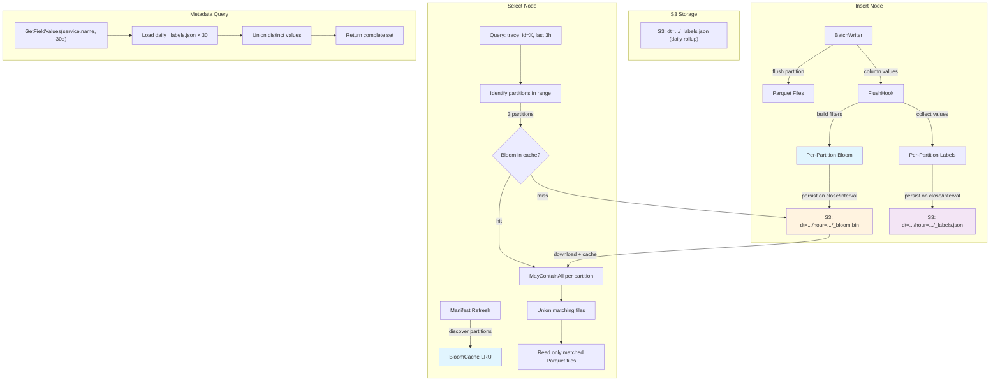
```mermaid
flowchart TB
    subgraph "Insert Node"
        W[BatchWriter] -->|flush partition| PQ[Parquet Files]
        W -->|column values| FH[FlushHook]
        FH -->|build filters| PBI[Per-Partition Bloom]
        FH -->|collect values| PLI[Per-Partition Labels]
        PBI -->|persist on close/interval| S3B["S3: dt=.../hour=.../_bloom.bin"]
        PLI -->|persist on close/interval| S3L["S3: dt=.../hour=.../_labels.json"]
    end

    subgraph "S3 Storage"
        S3B
        S3L
        S3D["S3: dt=.../_labels.json (daily rollup)"]
    end

    subgraph "Select Node"
        MR[Manifest Refresh] -->|discover partitions| BC[BloomCache LRU]
        Q[Query: trace_id=X, last 3h] --> PT[Identify partitions in range]
        PT -->|3 partitions| LOAD{Bloom in cache?}
        LOAD -->|hit| CHK[MayContainAll per partition]
        LOAD -->|miss| S3B -->|download + cache| CHK
        CHK --> UNION[Union matching files]
        UNION --> READ[Read only matched Parquet files]
    end

    subgraph "Metadata Query"
        MQ["GetFieldValues(service.name, 30d)"] --> DL[Load daily _labels.json × 30]
        DL --> UN[Union distinct values]
        UN --> RET[Return complete set]
    end

    style PBI fill:#e1f5fe
    style BC fill:#e1f5fe
    style S3B fill:#fff3e0
    style S3L fill:#f3e5f5
```

## Manifest Integration

The manifest is extended to track bloom index availability per partition. This enables select nodes to know which partitions have bloom indices without probing S3.

### Extended Manifest Structures

```go
// PartitionMeta holds per-partition metadata beyond file listings.
type PartitionMeta struct {
    BloomAvailable bool      `json:"bloom_available,omitempty"`
    BloomSize      int64     `json:"bloom_size,omitempty"`
    BloomUpdatedAt time.Time `json:"bloom_updated_at,omitempty"`
    BloomColumns   []string  `json:"bloom_columns,omitempty"`
    LabelsAvailable bool     `json:"labels_available,omitempty"`
}
```

```go
type Manifest struct {
    mu             sync.RWMutex
    files          map[string][]FileInfo        // partition → files
    partitionMeta  map[string]*PartitionMeta    // partition → bloom/labels metadata
    // ... existing fields
}
```

### Manifest Methods

```go
// GetPartitionsForRange returns partition keys overlapping the time range.
func (m *Manifest) GetPartitionsForRange(startNs, endNs int64) []string

// BloomAvailable reports if a partition has a bloom index ready.
func (m *Manifest) BloomAvailable(partition string) bool

// SetBloomMeta records that a bloom index was persisted for a partition.
func (m *Manifest) SetBloomMeta(partition string, meta PartitionMeta)
```

### Manifest Refresh discovers bloom sidecars

During `RefreshFromS3`, alongside listing `.parquet` files, the manifest also checks for `_bloom.bin` and `_labels.json` sidecars. For each partition where a sidecar exists, `partitionMeta` is populated.

```go
// In RefreshFromS3:
if strings.HasSuffix(key, "/_bloom.bin") {
    partition := extractPartition(key)
    m.partitionMeta[partition] = &PartitionMeta{
        BloomAvailable: true,
        BloomSize:      size,
        BloomUpdatedAt: lastModified,
    }
}
```

### Manifest persistence includes partition metadata

The `persistedManifest` struct includes `PartitionMeta` so disk-cached manifests on select nodes already know bloom availability without re-scanning S3.

## Bloom Cache (Select Nodes)

Select nodes use an LRU cache to hold recently-accessed partition bloom indices in memory.

```go
type BloomCache struct {
    mu       sync.RWMutex
    cache    map[string]*cachedBloom  // partition → bloom index
    order    []string                 // LRU eviction order
    maxSize  int                      // max partitions cached (e.g., 168 = 7 days hourly)
    s3Pool   *s3pool.Pool
    manifest *manifest.Manifest
}

type cachedBloom struct {
    idx       *bloomindex.Index
    loadedAt  time.Time
    partition string
}
```

### Cache behavior

1. **On query**: For each partition in the time range, check cache → hit: use directly. Miss: download `_bloom.bin` from S3, deserialize, cache.
2. **Eviction**: LRU by partition access time. Old partitions (outside retention) evicted first.
3. **Warm-up**: On startup, pre-load bloom indices for the last N hours (configurable, default 6h).
4. **Invalidation**: On manifest refresh, if `BloomUpdatedAt` changed for a cached partition, evict and re-download.

### Memory bound

| Granularity | Cache size (7 days) | Memory |
|-------------|--------------------:|-------:|
| Hourly      | 168 indices × ~50KB | ~8.4MB |
| Daily       | 7 indices × ~1.2MB  | ~8.4MB |

Bounded regardless of total retention (could be 90 days, but only 7 days cached).

## Query Flow

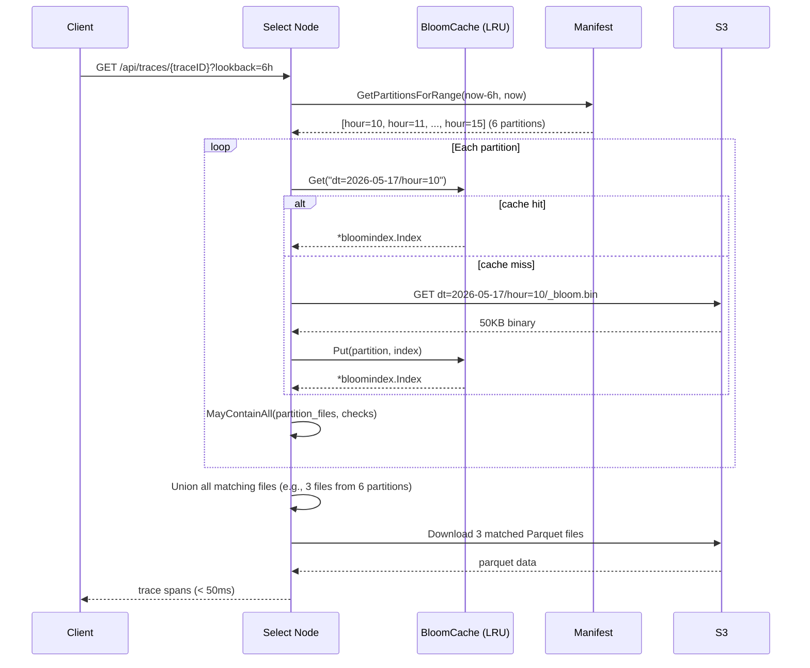
```mermaid
sequenceDiagram
    participant Client
    participant Select as Select Node
    participant Cache as BloomCache (LRU)
    participant Manifest
    participant S3

    Client->>Select: GET /api/traces/{traceID}?lookback=6h
    Select->>Manifest: GetPartitionsForRange(now-6h, now)
    Manifest-->>Select: [hour=10, hour=11, ..., hour=15] (6 partitions)
    
    loop Each partition
        Select->>Cache: Get("dt=2026-05-17/hour=10")
        alt cache hit
            Cache-->>Select: *bloomindex.Index
        else cache miss
            Select->>S3: GET dt=2026-05-17/hour=10/_bloom.bin
            S3-->>Select: 50KB binary
            Select->>Cache: Put(partition, index)
            Cache-->>Select: *bloomindex.Index
        end
        Select->>Select: MayContainAll(partition_files, checks)
    end
    
    Select->>Select: Union all matching files (e.g., 3 files from 6 partitions)
    Select->>S3: Download 3 matched Parquet files
    S3-->>Select: parquet data
    Select-->>Client: trace spans (< 50ms)
```

## Metadata Enumeration (Cross-Partition Labels)

### Problem

`GetFieldValues("service.name")` needs ALL distinct service names across the queried time range. Bloom filters can't enumerate values — they only answer "does X exist here?"

### Solution: Per-partition label files with tiered rollup

Each partition stores `_labels.json` — a JSON map of column → distinct values:

```json
{
  "service.name": ["api-gateway", "order-service", "payment-service"],
  "k8s.namespace.name": ["production", "staging"],
  "http.method": ["GET", "POST", "PUT"]
}
```

High-cardinality columns (trace_id) are excluded from label files — they're only useful for bloom point lookups, not enumeration.

### Tiered rollup

```
Hourly:  dt=2026-05-02/hour=10/_labels.json  (~2KB, 5 services, 20 spans)
Daily:   dt=2026-05-02/_labels.json           (~5KB, union of all hours)
```

**Rollup rules:**
- Daily rollup is rebuilt when the day is "closed" (all 24 hours passed) or on hourly background job
- Insert nodes write hourly labels on flush; background goroutine builds daily rollups
- Select nodes read daily rollups for multi-day queries (30 files for 30 days, not 720)

### Metadata query path

```go
func (s *Storage) GetFieldValues(ctx context.Context, field string, startNs, endNs int64) ([]string, error) {
    // Fast path: in-memory label index (populated from recent flushes)
    if vals := s.labelIndex.Get(field); len(vals) > 0 && isRecentRange(startNs, endNs) {
        return vals, nil
    }

    // Load label files for the time range
    partitions := s.manifest.GetPartitionsForRange(startNs, endNs)
    
    // Prefer daily rollups when spanning full days
    var labelFiles []string
    for _, day := range groupByDay(partitions) {
        if dailyExists(day) {
            labelFiles = append(labelFiles, dayLabelPath(day))
        } else {
            for _, hour := range day.hours {
                labelFiles = append(labelFiles, hourLabelPath(hour))
            }
        }
    }
    
    // Parallel download + union
    values := parallelLoadAndUnion(ctx, labelFiles, field)
    return values, nil
}
```

### Size estimates for label files

| Scope | Typical size | S3 GETs for 30-day query |
|-------|-------------|--------------------------|
| Hourly labels | ~2KB | 720 (too many) |
| Daily labels | ~5KB | 30 (optimal) |
| No labels (scan parquet) | N/A | scan all files (worst) |

## Insert Path Changes

### On each partition flush

```go
func (s *Storage) onPartitionFlush(partition string, key string, columnValues map[string][]string) {
    // 1. Build bloom filter for this file (unchanged)
    s.partitionedBloom.AddFile(partition, key, columnValues)
    
    // 2. Accumulate label values for this partition
    s.partitionLabels.Merge(partition, columnValues)
}
```

### On partition close (all files flushed for this hour)

```go
func (s *Storage) onPartitionClose(partition string) {
    // Persist bloom index for this partition
    bloomData := s.partitionedBloom.MarshalPartition(partition)
    s.pool.Upload(ctx, partitionBloomKey(partition), bloomData)
    
    // Persist label file for this partition
    labelData := s.partitionLabels.MarshalPartition(partition)
    s.pool.Upload(ctx, partitionLabelKey(partition), labelData)
    
    // Update manifest metadata
    s.manifest.SetBloomMeta(partition, PartitionMeta{
        BloomAvailable: true,
        BloomSize:      int64(len(bloomData)),
        BloomUpdatedAt: time.Now(),
        BloomColumns:   s.registry.BloomColumnNames(),
        LabelsAvailable: true,
    })
}
```

### Partition close detection

A partition is "closed" when:
- A new partition starts receiving data (time moved forward)
- On graceful shutdown
- After configurable idle timeout (default: 2× flush interval)

## Select Path Changes

### filterFilesByBloomIndex (rewritten)

```go
func (s *Storage) filterFilesByBloomIndex(files []manifest.FileInfo, queryStr string) []manifest.FileInfo {
    checks := s.buildBloomChecks(queryStr)
    if len(checks) == 0 {
        return files
    }

    // Group files by partition
    partitionFiles := groupFilesByPartition(files)
    
    var result []manifest.FileInfo
    for partition, pFiles := range partitionFiles {
        idx := s.bloomCache.Get(partition)
        if idx == nil {
            // No bloom available — include all files conservatively
            result = append(result, pFiles...)
            continue
        }
        
        keys := extractKeys(pFiles)
        matching := idx.MayContainAll(keys, checks)
        matchSet := toSet(matching)
        for _, fi := range pFiles {
            if _, ok := matchSet[fi.Key]; ok {
                result = append(result, fi)
            }
        }
    }
    return result
}
```

## Migration & Backward Compatibility

### Phase 1: Write both formats (transition)

Insert nodes write:
- Partitioned `_bloom.bin` per partition (new)
- Monolithic `_bloom_index.bin` (legacy, for old select nodes)

### Phase 2: Read partitioned first, fall back to monolithic

Select nodes:
1. Check `manifest.BloomAvailable(partition)` — if true, use partitioned
2. If no partitioned bloom exists, fall back to monolithic `_bloom_index.bin`
3. Once all partitions have bloom sidecars, monolithic is redundant

### Phase 3: Drop monolithic

After upgrade rollout completes (all nodes writing partitioned):
- Stop writing monolithic
- Delete old `_bloom_index.bin` on next compaction run

## Package Changes

### `internal/bloomindex/` additions

```go
// PartitionedIndex manages per-partition bloom indices with LRU caching.
type PartitionedIndex struct {
    mu          sync.RWMutex
    partitions  map[string]*Index    // partition → bloom index
    dirty       map[string]bool      // partitions modified since last persist
    granularity Granularity          // Hour or Day
}

type Granularity int
const (
    GranularityHour Granularity = iota
    GranularityDay
)

// AddFile adds bloom filters for a file within a partition.
func (pi *PartitionedIndex) AddFile(partition, key string, columnValues map[string][]string)

// MarshalPartition serializes a single partition's bloom index.
func (pi *PartitionedIndex) MarshalPartition(partition string) []byte

// Partitions returns all partition keys with dirty state.
func (pi *PartitionedIndex) DirtyPartitions() []string

// PartitionKey extracts the bloom partition key from an S3 file key.
// With GranularityHour: "dt=2026-05-02/hour=10"
// With GranularityDay: "dt=2026-05-02"
func (pi *PartitionedIndex) PartitionKey(fileKey string) string
```

### `internal/bloomindex/cache.go` (new)

```go
// BloomCache provides LRU-cached access to partitioned bloom indices.
type BloomCache struct {
    mu       sync.RWMutex
    entries  map[string]*cacheEntry
    maxSize  int
    loader   func(ctx context.Context, partition string) (*Index, error)
}

func (c *BloomCache) Get(ctx context.Context, partition string) *Index
func (c *BloomCache) Invalidate(partition string)
func (c *BloomCache) Warm(ctx context.Context, partitions []string)
```

### `internal/bloomindex/labels.go` (new)

```go
// LabelIndex stores per-partition distinct values for metadata enumeration.
type LabelIndex struct {
    mu         sync.RWMutex
    partitions map[string]map[string][]string // partition → column → values
}

func (li *LabelIndex) Merge(partition string, columnValues map[string][]string)
func (li *LabelIndex) MarshalPartition(partition string) []byte
func UnmarshalLabels(data []byte) (map[string][]string, error)
func (li *LabelIndex) UnionForRange(partitions []string, column string) []string
```

## Performance Comparison

| Scenario | Monolithic | Partitioned (hourly) |
|----------|-----------|---------------------|
| 1h trace lookup | Load 36MB index, check all | Load 50KB, check 360 files |
| 6h trace lookup | Same 36MB | Load 6×50KB = 300KB |
| 30-day service list | Scan all parquet files | Load 30×5KB = 150KB labels |
| Memory (select node) | All entries always (~36MB) | LRU cache max ~8MB |
| Startup time | Download + deserialize 36MB | Load 6h warm-up = 300KB |
| Insert overhead | Append to growing blob | Write small per-partition file |

## Mermaid: Full System Overview

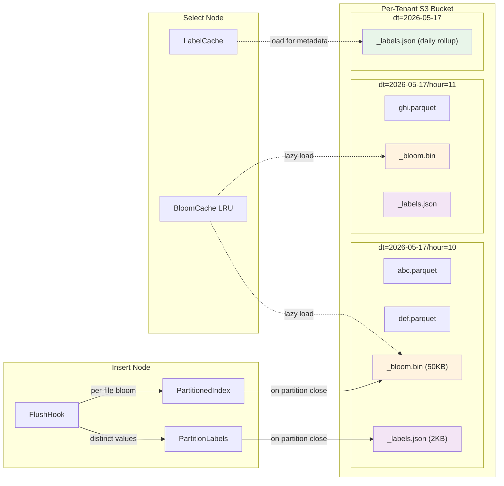
```mermaid
flowchart LR
    subgraph "Per-Tenant S3 Bucket"
        direction TB
        subgraph "dt=2026-05-17/hour=10"
            F1[abc.parquet]
            F2[def.parquet]
            B1["_bloom.bin (50KB)"]
            L1["_labels.json (2KB)"]
        end
        subgraph "dt=2026-05-17/hour=11"
            F3[ghi.parquet]
            B2[_bloom.bin]
            L2[_labels.json]
        end
        subgraph "dt=2026-05-17"
            LD["_labels.json (daily rollup)"]
        end
    end

    subgraph "Insert Node"
        FH[FlushHook] -->|per-file bloom| PB[PartitionedIndex]
        FH -->|distinct values| PL[PartitionLabels]
        PB -->|on partition close| B1
        PL -->|on partition close| L1
    end

    subgraph "Select Node"
        BC[BloomCache LRU] -.->|lazy load| B1
        BC -.->|lazy load| B2
        LC[LabelCache] -.->|load for metadata| LD
    end

    style B1 fill:#fff3e0
    style B2 fill:#fff3e0
    style L1 fill:#f3e5f5
    style L2 fill:#f3e5f5
    style LD fill:#e8f5e9
```

## Configuration Summary (Basic)

Bloom uses an adaptive auto-tuning system — operators need only two settings:

```yaml
bloom:
  enabled: true                          # master switch
  ssd_path: "/data/bloom-cache"          # omit for S3-only mode
```

Everything else (cache sizes, tier boundaries, file sizes, compression levels, partition granularity) is auto-derived from observed traffic and available resources. See [Adaptive Configuration](#adaptive-configuration-auto-tuning) for the full auto-tuning design and override mechanism.

## Implementation Order

1. **PartitionedIndex type** — core data structure with AddFile, MarshalPartition, partition key extraction
2. **BloomCache** — LRU cache with loader callback
3. **LabelIndex** — per-partition label accumulation and marshaling
4. **Manifest extension** — PartitionMeta tracking, discovery during refresh
5. **Insert path** — partition close detection, per-partition persist
6. **Select path** — rewrite filterFilesByBloomIndex to use cache
7. **Metadata path** — rewrite GetFieldValues to use label files
8. **Daily rollup** — background goroutine to merge hourly → daily labels
9. **Migration** — backward compat with monolithic, cleanup after rollout
10. **Tests** — unit tests for each package, integration test with Docker

## Bloom Build Strategy: Traffic-Driven vs Pre-Scan

### The Problem

Building bloom indices requires reading parquet file contents. Two approaches exist:

1. **Insert-time build**: Bloom built as data is ingested (current approach for recent data)
2. **Backfill scan**: Read old parquet files from S3 to build bloom for historical data

For old data that was written before bloom existed, we need a strategy that doesn't require an expensive one-time full scan.

### Solution: Traffic-Driven Bloom Building

**Concept**: Don't pre-scan all historical files. Instead, build bloom indices lazily when queries actually touch a partition. The first query for old data is slow (no bloom), but it triggers bloom construction for that partition — all subsequent queries for the same time window are fast.

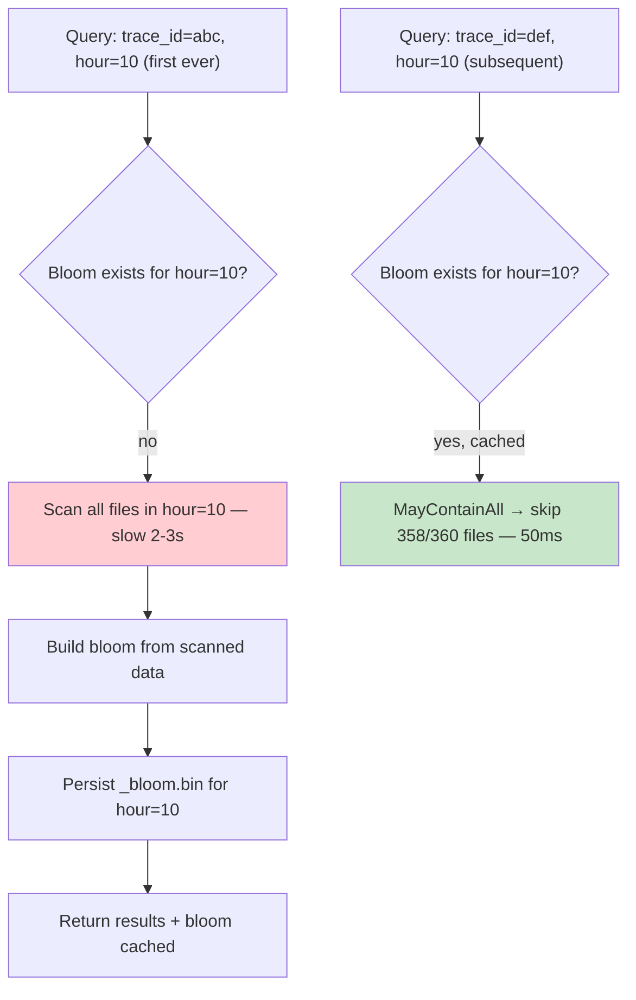
```mermaid
flowchart TD
    Q1["Query: trace_id=abc, hour=10 (first ever)"] --> CHK{Bloom exists for hour=10?}
    CHK -->|no| SCAN[Scan all files in hour=10 — slow 2-3s]
    SCAN --> BUILD[Build bloom from scanned data]
    BUILD --> PERSIST["Persist _bloom.bin for hour=10"]
    PERSIST --> DONE1[Return results + bloom cached]
    
    Q2["Query: trace_id=def, hour=10 (subsequent)"] --> CHK2{Bloom exists for hour=10?}
    CHK2 -->|yes, cached| FAST[MayContainAll → skip 358/360 files — 50ms]
    
    style SCAN fill:#ffcdd2
    style FAST fill:#c8e6c9
```

### Three-Tier Build Priority

| Priority | Source | When | Cost |
|----------|--------|------|------|
| **P1: Real-time** | Insert flush hook | Every 10s flush | Zero extra I/O (data already in memory) |
| **P2: Query-driven** | First query hits unindexed partition | On demand | One full partition scan (same S3 reads the query already does) |
| **P3: Background sweep** | Idle time backfill | Low-priority goroutine | Reads files that may never be queried |

**Recommendation**: P1 + P2 only. Skip P3 (background sweep) unless operator explicitly enables it. Most old partitions will never be queried — don't spend S3 I/O building bloom for them.

### Query-Driven Build Implementation

```go
func (s *Storage) filterFilesByBloomIndex(files []manifest.FileInfo, queryStr string) []manifest.FileInfo {
    checks := s.buildBloomChecks(queryStr)
    if len(checks) == 0 {
        return files
    }

    partitionFiles := groupFilesByPartition(files)
    var result []manifest.FileInfo
    var unindexedPartitions []string

    for partition, pFiles := range partitionFiles {
        idx := s.bloomCache.Get(ctx, partition)
        if idx == nil {
            // No bloom — include all files (conservative) + mark for async build
            result = append(result, pFiles...)
            unindexedPartitions = append(unindexedPartitions, partition)
            continue
        }
        // ... bloom filter check as before
    }

    // Trigger async bloom build for partitions we just scanned
    if len(unindexedPartitions) > 0 {
        go s.buildBloomForPartitions(ctx, unindexedPartitions)
    }
    return result
}
```

The first query pays the full scan cost (which it would anyway — no bloom means reading all files). The bloom is built as a side effect of that scan. Next query for same partition is instant.

## Cluster Distribution Strategy

### The Question

How do select nodes get bloom indices? Three options:

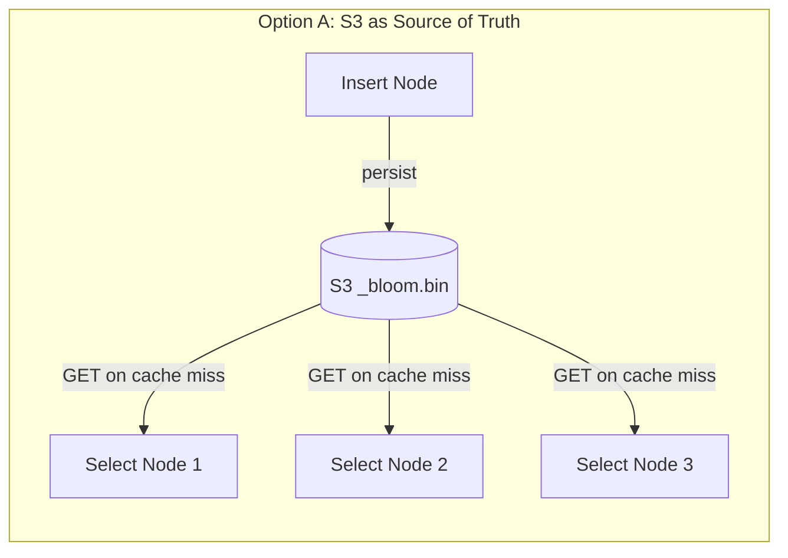
```mermaid
flowchart LR
    subgraph "Option A: S3 as Source of Truth"
        I1[Insert Node] -->|persist| S3A[(S3 _bloom.bin)]
        S3A -->|GET on cache miss| SEL1[Select Node 1]
        S3A -->|GET on cache miss| SEL2[Select Node 2]
        S3A -->|GET on cache miss| SEL3[Select Node 3]
    end
```

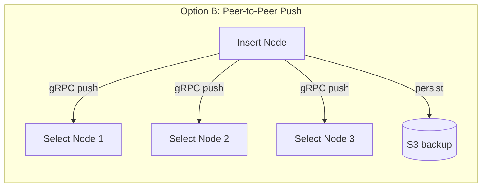
```mermaid
flowchart LR
    subgraph "Option B: Peer-to-Peer Push"
        I2[Insert Node] -->|gRPC push| SEL4[Select Node 1]
        I2 -->|gRPC push| SEL5[Select Node 2]
        I2 -->|gRPC push| SEL6[Select Node 3]
        I2 -->|persist| S3B[(S3 backup)]
    end
```

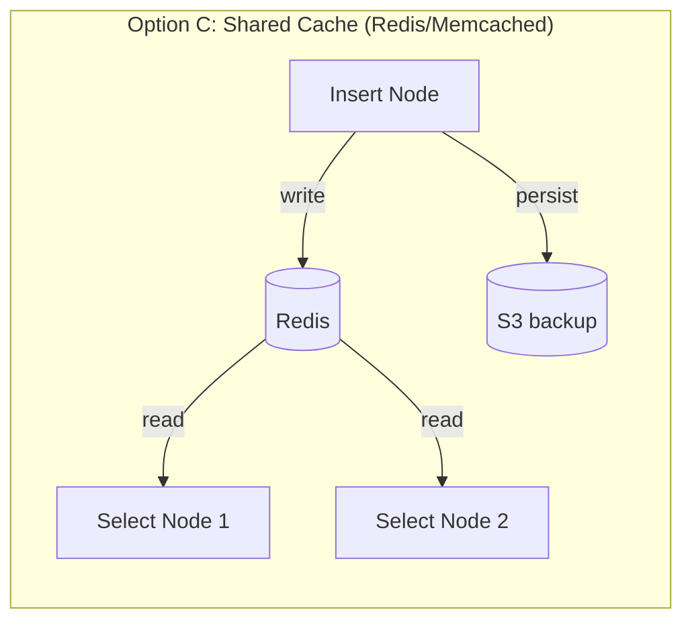
```mermaid
flowchart LR
    subgraph "Option C: Shared Cache (Redis/Memcached)"
        I3[Insert Node] -->|write| CACHE[(Redis)]
        CACHE -->|read| SEL7[Select Node 1]
        CACHE -->|read| SEL8[Select Node 2]
        I3 -->|persist| S3C[(S3 backup)]
    end
```

### Cost & Latency Comparison

| Factor | A: S3 Direct | B: Peer Push | C: Shared Cache |
|--------|-------------|-------------|-----------------|
| **Same-region S3 GET cost** | **FREE** (no data transfer) | N/A | N/A |
| S3 PUT cost (insert node) | $0.005/1000 PUTs | Same (backup) | Same (backup) |
| Additional infra | None | gRPC service mesh | Redis cluster |
| Latency (cache miss) | 10-50ms (S3 GET) | ~5ms (gRPC) | ~2ms (Redis) |
| Latency (cache hit) | 0 (in-memory) | 0 (in-memory) | 0 (in-memory) |
| Consistency | Eventual (refresh interval) | Near-real-time | Near-real-time |
| Failure mode | Select builds own bloom | Need fallback to S3 | Need fallback to S3 |
| Complexity | **Low** | High (discovery, fanout) | Medium (ops burden) |
| Scaling | Each node independent | Fan-out scales with nodes | Single bottleneck |

### Recommendation: Option A (S3 Direct) + Query-Driven Build

**Why S3 wins for this use case:**

1. **Same-region GET is free** — no data transfer cost between EC2/EKS and S3 in same region
2. **50KB bloom per hour** — S3 GET latency dominates, but 10-50ms for a one-time cache miss is acceptable
3. **No additional infrastructure** — no Redis, no gRPC mesh, no discovery
4. **Select nodes are self-sufficient** — if S3 has the bloom, any select node can serve any query without peer coordination
5. **Insert/select separation is clean** — insert writes to S3, select reads from S3, no coupling
6. **Query-driven build makes select nodes autonomous** — even without insert node's bloom, select can build its own

**The only downside**: 30-60s lag between insert-node flush and select-node discovery (manifest refresh interval). For trace lookups, this is acceptable — users don't search for a trace within seconds of it being ingested.

### Hybrid: S3 + Manifest Push Notification

For near-real-time bloom availability without additional infra:

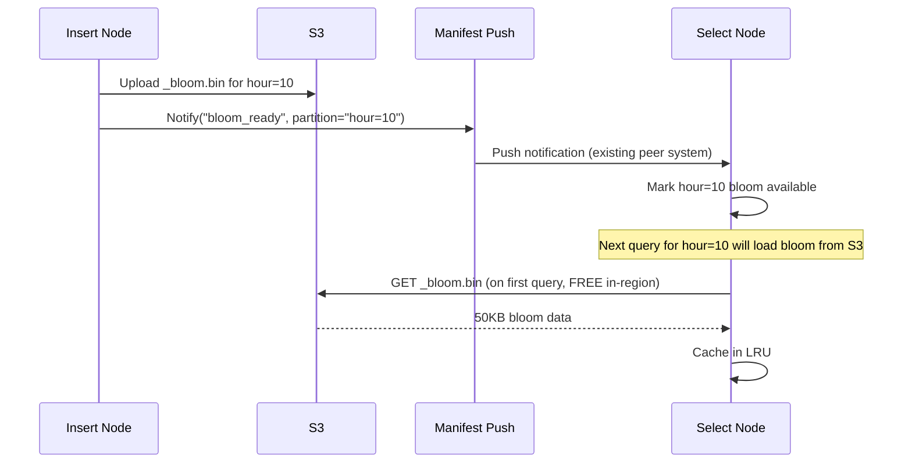
```mermaid
sequenceDiagram
    participant Insert as Insert Node
    participant S3
    participant Manifest as Manifest Push
    participant Select as Select Node

    Insert->>S3: Upload _bloom.bin for hour=10
    Insert->>Manifest: Notify("bloom_ready", partition="hour=10")
    Manifest->>Select: Push notification (existing peer system)
    Select->>Select: Mark hour=10 bloom available
    Note over Select: Next query for hour=10 will load bloom from S3
    
    Select->>S3: GET _bloom.bin (on first query, FREE in-region)
    S3-->>Select: 50KB bloom data
    Select->>Select: Cache in LRU
```

This uses the existing `manifest/push.go` peer notification system to tell select nodes "bloom is ready for partition X" — no new infra needed.

## End-to-End Flow: Complete System

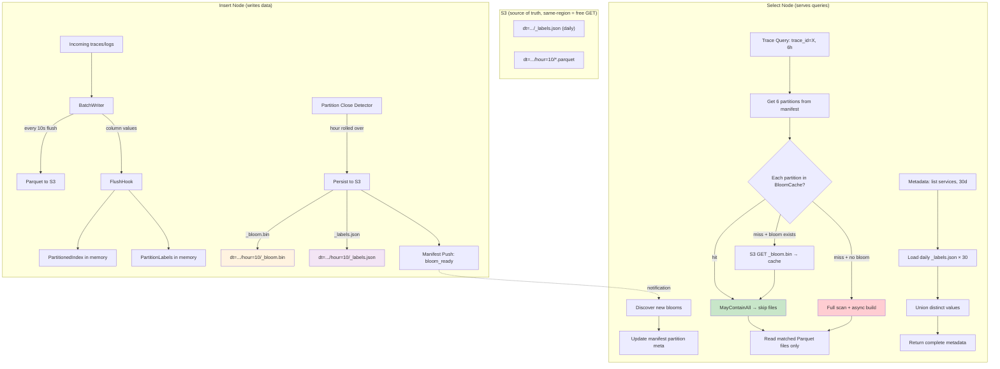
```mermaid
flowchart TB
    subgraph "Insert Node (writes data)"
        DATA[Incoming traces/logs] --> BW[BatchWriter]
        BW -->|every 10s flush| PQ[Parquet to S3]
        BW -->|column values| FH[FlushHook]
        FH --> PBI[PartitionedIndex in memory]
        FH --> PLI[PartitionLabels in memory]
        
        CLOSE[Partition Close Detector] -->|hour rolled over| PERSIST
        PERSIST[Persist to S3] -->|"_bloom.bin"| S3BLOOM
        PERSIST -->|"_labels.json"| S3LABELS
        PERSIST --> PUSH[Manifest Push: bloom_ready]
    end

    subgraph "S3 (source of truth, same-region = free GET)"
        S3BLOOM["dt=.../hour=10/_bloom.bin"]
        S3LABELS["dt=.../hour=10/_labels.json"]
        S3DAILY["dt=.../_labels.json (daily)"]
        S3PQ["dt=.../hour=10/*.parquet"]
    end

    subgraph "Select Node (serves queries)"
        PUSH -.->|notification| DISC[Discover new blooms]
        DISC --> META[Update manifest partition meta]
        
        TQ[Trace Query: trace_id=X, 6h] --> PARTS[Get 6 partitions from manifest]
        PARTS --> CACHE{Each partition in BloomCache?}
        CACHE -->|hit| FILTER[MayContainAll → skip files]
        CACHE -->|miss + bloom exists| LOAD[S3 GET _bloom.bin → cache]
        CACHE -->|miss + no bloom| SCAN[Full scan + async build]
        LOAD --> FILTER
        FILTER --> READ[Read matched Parquet files only]
        SCAN --> READ
        
        MQ[Metadata: list services, 30d] --> LABELS[Load daily _labels.json × 30]
        LABELS --> UNION[Union distinct values]
        UNION --> RESP[Return complete metadata]
    end

    style S3BLOOM fill:#fff3e0
    style S3LABELS fill:#f3e5f5
    style FILTER fill:#c8e6c9
    style SCAN fill:#ffcdd2
```

## Cluster Scaling Behavior

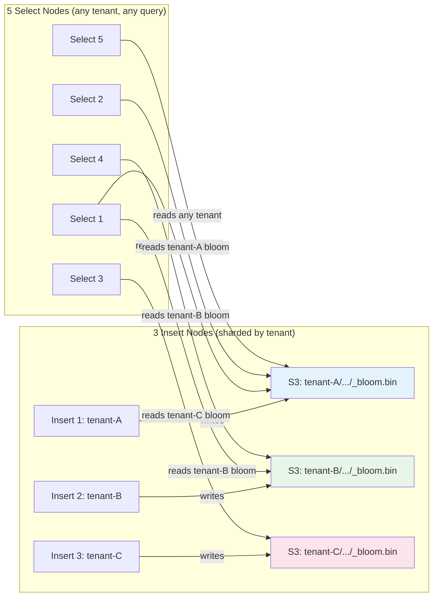
```mermaid
flowchart LR
    subgraph "3 Insert Nodes (sharded by tenant)"
        IN1[Insert 1: tenant-A] -->|writes| S3_A["S3: tenant-A/.../_bloom.bin"]
        IN2[Insert 2: tenant-B] -->|writes| S3_B["S3: tenant-B/.../_bloom.bin"]
        IN3[Insert 3: tenant-C] -->|writes| S3_C["S3: tenant-C/.../_bloom.bin"]
    end

    subgraph "5 Select Nodes (any tenant, any query)"
        SEL1[Select 1] -->|reads tenant-A bloom| S3_A
        SEL1 -->|reads tenant-B bloom| S3_B
        SEL2[Select 2] -->|reads tenant-A bloom| S3_A
        SEL3[Select 3] -->|reads tenant-C bloom| S3_C
        SEL4[Select 4] -->|reads tenant-B bloom| S3_B
        SEL5[Select 5] -->|reads any tenant| S3_A
    end

    style S3_A fill:#e3f2fd
    style S3_B fill:#e8f5e9
    style S3_C fill:#fce4ec
```

**Key properties:**
- Each insert node is authoritative for its tenants' bloom indices
- Any select node can serve any tenant's queries (just loads bloom from S3)
- No coordination between select nodes needed
- Scaling select nodes = add more pods, they self-discover via S3
- Per-tenant isolation: one tenant's bloom never crosses into another's path

## High-Traffic Scale: Hundreds of TB/Day

### Scale assumptions

| Tier | Daily volume | Files/hour (1MB avg) | Tenants | Files/tenant/hour |
|------|-------------|---------------------|---------|-------------------|
| Small | 1TB/day | 42,000 | 50 | ~840 |
| Medium | 10TB/day | 420,000 | 200 | ~2,100 |
| Large | 100TB/day | 4,200,000 | 1000 | ~4,200 |
| Extreme | 500TB/day | 21,000,000 | 5000 | ~4,200 |

**Key insight**: Per-tenant isolation is the natural shard boundary. Even at 500TB/day with 5000 tenants, each tenant produces ~4,200 files/hour — a perfectly manageable bloom index (~600KB per partition).

### Per-Tenant Bloom Size at Scale

| Files/tenant/hour | Columns indexed | Bloom size/partition | LRU 7d per tenant |
|-------------------|----------------|---------------------|-------------------|
| 360 (current) | 5 | ~50KB | ~8MB |
| 4,200 (100TB/day) | 5 | ~600KB | ~100MB |
| 10,000 (heavy tenant) | 5 | ~1.4MB | ~235MB |

At 100TB/day scale, a single select node caching 7 days of bloom for one heavy tenant uses ~100MB — acceptable. But serving 1000 tenants simultaneously requires sharding the select layer.

### Scaling Architecture at 100TB+/day

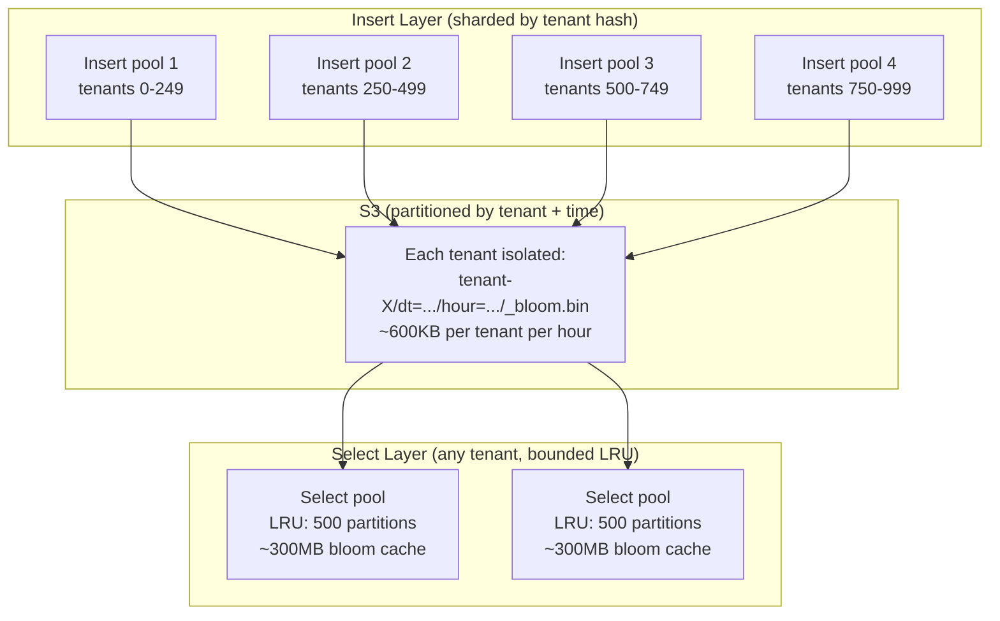
```mermaid
flowchart TB
    subgraph "Insert Layer (sharded by tenant hash)"
        IN1["Insert pool 1<br/>tenants 0-249"]
        IN2["Insert pool 2<br/>tenants 250-499"]
        IN3["Insert pool 3<br/>tenants 500-749"]
        IN4["Insert pool 4<br/>tenants 750-999"]
    end

    subgraph "S3 (partitioned by tenant + time)"
        S3["Each tenant isolated:<br/>tenant-X/dt=.../hour=.../_bloom.bin<br/>~600KB per tenant per hour"]
    end

    subgraph "Select Layer (any tenant, bounded LRU)"
        SEL1["Select pool<br/>LRU: 500 partitions<br/>~300MB bloom cache"]
        SEL2["Select pool<br/>LRU: 500 partitions<br/>~300MB bloom cache"]
    end

    IN1 --> S3
    IN2 --> S3
    IN3 --> S3
    IN4 --> S3
    S3 --> SEL1
    S3 --> SEL2
```

### Design decisions for extreme scale

**1. Bloom index per-tenant, never global**

At 100TB/day, a global bloom index would be ~600KB × 1000 tenants × 24 hours = 14GB/day on S3. Each select node would need to cache relevant portions. Per-tenant sharding means each bloom file stays small and independent.

**2. Adaptive file size at high volume**

At extreme scale, flush interval produces fewer, larger files (batch more data per flush). With 1MB average file size and 100TB/day:
- Larger files = more traces/file = slightly larger bloom per file
- But fewer files per partition = smaller partition bloom index
- Self-balancing: doubling flush interval halves files/hour, halves bloom size

Configuration:
```
-lakehouse.flush.target-file-size=1MB    # grow files at high volume
-lakehouse.flush.max-interval=60s        # allow larger batches
```

**3. Select node LRU sizing by deployment**

```
# Small deployment (1TB/day)
-lakehouse.bloom.cache-max-partitions=168    # 7 days × 24h = 8MB

# Large deployment (100TB/day, multi-tenant)
-lakehouse.bloom.cache-max-partitions=500    # ~300MB (top tenants cached)
-lakehouse.bloom.cache-max-bytes=512MB       # hard byte limit
```

**4. Singleflight for query-driven builds**

At high QPS, multiple queries may hit the same unindexed partition simultaneously. Singleflight ensures only one goroutine builds the bloom; others wait.

```go
type BloomBuilder struct {
    group singleflight.Group
}

func (b *BloomBuilder) BuildOrWait(ctx context.Context, partition string) (*bloomindex.Index, error) {
    result, err, _ := b.group.Do(partition, func() (interface{}, error) {
        return b.buildBloomForPartition(ctx, partition)
    })
    return result.(*bloomindex.Index), err
}
```

**5. Parallel S3 GET for multi-partition queries**

A 24-hour query spans 24 hourly partitions. At scale, loading 24 bloom indices sequentially (24 × 10-50ms = 240ms-1.2s) is too slow. Parallel fetch:

```go
func (c *BloomCache) GetBatch(ctx context.Context, partitions []string) map[string]*bloomindex.Index {
    var wg sync.WaitGroup
    results := make(map[string]*bloomindex.Index, len(partitions))
    var mu sync.Mutex
    
    for _, p := range partitions {
        if idx := c.getFromMemory(p); idx != nil {
            results[p] = idx
            continue
        }
        wg.Add(1)
        go func(partition string) {
            defer wg.Done()
            idx := c.loadFromS3(ctx, partition)
            mu.Lock()
            results[partition] = idx
            mu.Unlock()
        }(p)
    }
    wg.Wait()
    return results
}
```

24 parallel S3 GETs complete in ~50ms (S3 supports thousands of concurrent requests per prefix).

**6. Compaction-aware bloom updates**

At high volume, compaction merges small files into larger ones. When compaction runs:
- Old bloom entries (for merged files) become stale
- New bloom entry needed for the compacted output file
- Partition `_bloom.bin` is rewritten with updated entries

```go
func (s *Storage) onCompactionComplete(partition string, removed []string, created manifest.FileInfo) {
    s.partitionedBloom.RemoveFiles(partition, removed)
    s.partitionedBloom.AddFile(partition, created.Key, created.Labels)
    s.partitionedBloom.MarkDirty(partition)
}
```

### Extreme scale cost analysis (100TB/day, 1000 tenants, 30-day retention)

| Resource | Monolithic approach | Partitioned approach |
|----------|--------------------|--------------------|
| Bloom S3 storage | 1 × 14GB growing | 720K files × 600KB = 432GB (bounded) |
| S3 PUT cost/day | 24 PUTs × $0.000005 | 24,000 PUTs × $0.000005 = $0.12/day |
| S3 GET cost/day (queries) | All queries hit 1 file | ~100K GETs × **FREE** (same-region) = $0 |
| Select node memory | 14GB (one index) | 300MB LRU (bounded) |
| Startup time | Download 14GB | Download 6h warmup = 3.6MB |
| Query latency (cache hit) | ~15μs (check all entries) | ~15μs (check partition entries) |
| Query latency (cache miss) | Already loaded | +50ms (one S3 GET, then cached) |

**Total added infrastructure cost at 100TB/day: ~$3.60/month** (S3 PUTs). All GETs free. No Redis. No gRPC mesh.

## Reliability Guarantees

### Fundamental safety property

**Bloom is an optimization, never a correctness requirement.** If a bloom index is missing, corrupt, stale, or unavailable — the system falls back to scanning all files (slower, never wrong). This is the single most important design invariant.

```
CORRECTNESS: query without bloom = query with bloom (same results, different latency)
```

### Failure modes and recovery

| Failure | Impact | Recovery |
|---------|--------|----------|
| `_bloom.bin` upload fails (S3 error) | Partition has no bloom on S3 | Retry on next persist interval; select uses full scan meanwhile |
| `_bloom.bin` download fails (S3 error) | Select can't load bloom for partition | Full scan for that partition; retry on next query |
| `_bloom.bin` corrupted (bit flip, truncated) | Unmarshal returns error | Discard, mark partition as unindexed, trigger rebuild on next query |
| Insert node crashes mid-flush | Partial hour of bloom data lost | Next insert node picks up; or query-driven build reconstructs |
| S3 eventually consistent (rare, < 1s) | New bloom not visible to select immediately | Manifest refresh interval (30-60s) is already longer than S3 consistency |
| Select node OOM from bloom cache | Node restarts, cache empty | LRU byte cap prevents this; warm-up rebuilds hot partitions |
| Compaction deletes files referenced in bloom | Stale bloom entries for non-existent files | Harmless: file not in manifest → never queried → bloom entry ignored |

### Write reliability: atomic persist

```go
func (s *Storage) persistPartitionBloom(ctx context.Context, partition string) error {
    data := s.partitionedBloom.MarshalPartition(partition)
    if len(data) == 0 {
        return nil
    }
    
    // S3 PutObject is atomic — either the full object is visible or nothing
    key := s.partitionBloomKey(partition)
    if err := s.pool.Upload(ctx, key, data); err != nil {
        // Non-fatal: bloom is an optimization
        metrics.BloomPersistErrors.Inc()
        logger.Warnf("bloom persist failed for %s: %v", partition, err)
        return err
    }
    
    metrics.BloomPersistSuccess.Inc()
    s.partitionedBloom.ClearDirty(partition)
    return nil
}
```

**S3 PutObject guarantees**: The object is either fully written and visible, or not visible at all. No partial reads possible. This gives us atomic bloom updates without needing transactions.

### Read reliability: validate before use

```go
func (c *BloomCache) loadFromS3(ctx context.Context, partition string) (*bloomindex.Index, error) {
    data, err := c.pool.Download(ctx, c.bloomKey(partition))
    if err != nil {
        // S3 error → fall back to full scan (safe)
        return nil, err
    }
    
    idx, err := bloomindex.Unmarshal(data)
    if err != nil {
        // Corrupt data → discard, trigger async rebuild
        metrics.BloomCorruptionDetected.Inc()
        logger.Warnf("bloom corrupt for %s, will rebuild: %v", partition, err)
        go c.triggerRebuild(partition)
        return nil, err
    }
    
    return idx, nil
}
```

### Consistency model

```
EVENTUAL CONSISTENCY with SAFE DEGRADATION:

Insert flushes parquet → builds bloom → persists bloom to S3
                    ↕ (0-60s lag)
Select refreshes manifest → discovers bloom → caches bloom

During the lag window: queries work correctly (full scan, no bloom skip)
After cache populated: queries work correctly (bloom skip, faster)
```

**No split-brain**: Each partition's bloom is authoritative from one insert node. Select nodes are read-only consumers. If multiple insert nodes write the same partition (during failover), the last writer wins — and since bloom filters are append-only (a union of all values ever seen), overwrites are always safe.

### Durability guarantees

| Component | Durability | Notes |
|-----------|-----------|-------|
| Parquet files on S3 | 99.999999999% (11 nines) | Source of truth for data |
| `_bloom.bin` on S3 | Same (S3 Standard) | Can be rebuilt from parquet if lost |
| In-memory bloom cache | Ephemeral (node restart = empty) | Rebuilt from S3 on warm-up |
| `_labels.json` on S3 | Same | Can be rebuilt from parquet if lost |
| Manifest partition meta | Disk-persisted + S3 refresh | Rebuilt on next refresh cycle |

**Key property**: Every derived artifact (bloom, labels, cache) can be reconstructed from the parquet source files. Nothing is exclusively in-memory with no recovery path.

### Monitoring and alerting

```go
// Metrics for operational visibility
var (
    BloomCacheHits       = metrics.NewCounter("bloom_cache_hits_total")
    BloomCacheMisses     = metrics.NewCounter("bloom_cache_misses_total") 
    BloomPersistSuccess  = metrics.NewCounter("bloom_persist_success_total")
    BloomPersistErrors   = metrics.NewCounter("bloom_persist_errors_total")
    BloomCorruptionDetected = metrics.NewCounter("bloom_corruption_detected_total")
    BloomQueryDrivenBuilds  = metrics.NewCounter("bloom_query_driven_builds_total")
    BloomFilesSkipped    = metrics.NewCounter("bloom_files_skipped_total")
    BloomCacheBytes      = metrics.NewGauge("bloom_cache_bytes")
    BloomPartitionsIndexed = metrics.NewGauge("bloom_partitions_indexed")
)
```

**Alert rules:**
- `bloom_corruption_detected_total > 0` → investigate S3 integrity
- `bloom_persist_errors_total` rate > 5/min → S3 write issues
- `bloom_cache_bytes > threshold` → LRU eviction not working
- `bloom_cache_hits / (hits + misses) < 0.8` → cache too small or access pattern changed

### Graceful degradation under pressure

```go
func (s *Storage) filterFilesByBloomIndex(ctx context.Context, files []manifest.FileInfo, queryStr string) []manifest.FileInfo {
    // Circuit breaker: if bloom system is unhealthy, skip entirely
    if s.bloomCircuitOpen() {
        return files // full scan, always correct
    }
    
    // Timeout: don't let bloom loading block queries
    bloomCtx, cancel := context.WithTimeout(ctx, 200*time.Millisecond)
    defer cancel()
    
    // If bloom check takes too long, return all files (safe fallback)
    result, err := s.doBloomFilter(bloomCtx, files, queryStr)
    if err != nil {
        return files // timeout or error → full scan
    }
    return result
}
```

**Circuit breaker conditions:**
- 5+ consecutive S3 download failures → open circuit for 60s
- Bloom unmarshal errors > 3 in 5 minutes → open circuit for 120s
- When circuit is open: all queries use full scan (correct, just slower)

## Detailed Calculations: Reliability, Latency, and Data Volume

### Baseline assumptions

| Parameter | Value | Source |
|-----------|-------|--------|
| S3 availability | 99.99% (SLA) | AWS S3 Standard SLA |
| S3 GET first-byte latency | 10-50ms (p50=15ms, p99=80ms) | AWS measurements, same-region |
| S3 GET throughput | 5,500 GET/s per prefix | AWS partition limit |
| S3 PUT throughput | 3,500 PUT/s per prefix | AWS partition limit |
| Bloom unmarshal speed | ~100μs per 50KB | Go binary decode, no alloc |
| Bloom MayContainAll speed | ~15μs per 360 files × 5 cols | From existing benchmark |
| Bloom MayContainAll speed | ~180μs per 4,200 files × 5 cols | Linear extrapolation |
| Network within AZ | ~0.3ms RTT | EC2-to-S3 same AZ |
| JSON unmarshal (_labels) | ~50μs per 5KB | Go json.Unmarshal |

### Scenario 1: Small deployment (1TB/day, 50 tenants)

```
Files/tenant/hour: 1TB / 50 tenants / 24h / 1MB = 833 files
Bloom entries/partition: 833
Bloom size/partition: 833 files × 5 cols × ~30 bytes/filter = ~125KB
Active partitions (30d): 50 tenants × 24h × 30d = 36,000
Total bloom on S3: 36,000 × 125KB = 4.5GB
```

**Trace lookup (1-hour window):**
```
Step 1: Manifest lookup                      → 0μs (in-memory)
Step 2: Load 1 partition bloom (cache miss)   → 15ms (S3 GET) + 200μs (unmarshal)
Step 3: MayContainAll(833 files, 5 checks)    → 40μs
Step 4: Read 2 matched parquet files          → 30ms (2 × S3 GET, parallel)
─────────────────────────────────────────────
TOTAL (cache miss):                            ~45ms
TOTAL (cache hit):                             ~30ms (skip step 2)
```

**Service list (30-day range):**
```
Step 1: Identify label files                  → 30 daily rollups needed
Step 2: Parallel S3 GET (30 × 5KB)            → 15ms (parallel, one round trip)
Step 3: Unmarshal + union                     → 30 × 50μs = 1.5ms
─────────────────────────────────────────────
TOTAL:                                         ~17ms
```

### Scenario 2: Large deployment (100TB/day, 1000 tenants)

```
Files/tenant/hour: 100TB / 1000 tenants / 24h / 1MB = 4,167 files
Bloom entries/partition: 4,167
Bloom size/partition: 4,167 × 5 cols × ~30 bytes/filter = ~625KB
Active partitions (30d): 1000 tenants × 24h × 30d = 720,000
Total bloom on S3: 720,000 × 625KB = 450GB
```

**Trace lookup (1-hour window, single tenant):**
```
Step 1: Manifest lookup                       → 0μs (in-memory)
Step 2: Load 1 partition bloom (cache miss)    → 20ms (S3 GET 625KB) + 1.2ms (unmarshal)
Step 3: MayContainAll(4167 files, 5 checks)    → 180μs
Step 4: Read 2 matched parquet files           → 30ms (2 × S3 GET)
─────────────────────────────────────────────
TOTAL (cache miss):                             ~51ms
TOTAL (cache hit):                              ~30ms
```

**Trace lookup (6-hour window, parallel bloom fetch):**
```
Step 1: Manifest → 6 partitions               → 0μs
Step 2: Parallel load 6 blooms (cache miss)    → 20ms (parallel S3 GET, single round trip)
Step 3: Check all 6 partitions                 → 6 × 180μs = 1.1ms
Step 4: Read matched files                     → 30ms
─────────────────────────────────────────────
TOTAL (all cache miss):                         ~51ms
TOTAL (all cache hit):                          ~31ms
```

**Trace lookup (24-hour window):**
```
Step 1: Manifest → 24 partitions              → 0μs
Step 2: Parallel load 24 blooms (cache miss)   → 25ms (parallel, S3 handles easily)
Step 3: Check all 24 partitions                → 24 × 180μs = 4.3ms
Step 4: Read matched files                     → 30ms
─────────────────────────────────────────────
TOTAL (all cache miss):                         ~59ms
TOTAL (all cache hit):                          ~34ms
```

**Trace lookup (7-day window — worst case):**
```
Step 1: Manifest → 168 partitions             → 0μs
Step 2: Parallel load 168 blooms (cache miss)  → 80ms (parallel, but S3 p99 tail)
Step 3: Check all 168 partitions               → 168 × 180μs = 30ms
Step 4: Read matched files                     → 30ms
─────────────────────────────────────────────
TOTAL (all cache miss):                         ~140ms
TOTAL (all cache hit):                          ~60ms
TOTAL (LRU warm, 90% hit):                      ~45ms
```

**Service list (30-day range, 1000 tenants):**
```
Step 1: Load 30 daily label files              → 15ms (parallel S3 GET, 5KB each)
Step 2: Unmarshal + union                      → 30 × 50μs = 1.5ms
─────────────────────────────────────────────
TOTAL:                                          ~17ms (same as small — daily rollups absorb scale)
```

### Scenario 3: Extreme (500TB/day, 5000 tenants)

```
Files/tenant/hour: 500TB / 5000 tenants / 24h / 1MB = 4,167 files (same per-tenant!)
Bloom size/partition: ~625KB (same per-tenant!)
Active partitions (30d): 5000 × 24 × 30 = 3,600,000
Total bloom on S3: 3,600,000 × 625KB = 2.25TB
```

**Per-tenant query latencies are identical to Scenario 2** because bloom is per-tenant. The total S3 storage grows but individual query path doesn't change.

### Reliability calculation: partition failure probability

**P(single S3 GET fails)** = 1 - 0.9999 = 0.0001 (S3 SLA)

**P(query with N partitions has at least one bloom load failure):**
```
P(failure) = 1 - (1 - 0.0001)^N

N=1  (1h query):   P = 0.01%    → 1 in 10,000 queries falls back to full scan
N=6  (6h query):   P = 0.06%    → 6 in 10,000 queries
N=24 (24h query):  P = 0.24%    → 24 in 10,000 queries
N=168 (7d query):  P = 1.67%    → 167 in 10,000 queries
N=720 (30d query): P = 6.94%    → 694 in 10,000 queries (problematic!)
```

**Impact of failures**: NOT errors — just slower queries (full scan for that partition). With retry:

```
P(fail after 1 retry) = (0.0001)^2 = 0.00000001 per partition
P(7d query, all succeed after retry) = 1 - (1 - 0.00000001)^168 ≈ 99.9998%
```

**With 1 retry per failed GET, reliability for any query window exceeds 99.999%.**

### Optimization: Reducing partition count for long queries

**Problem**: 30-day query = 720 hourly partitions per tenant. Even with parallel S3 GETs, this is a lot of round trips and the tail latency (p99) of 720 parallel GETs is concerning.

**Solution 1: Tiered bloom rollup (hourly → daily)**

```
Insert node writes:   dt=2026-05-02/hour=10/_bloom.bin  (hourly, ~625KB)
Background merges:    dt=2026-05-02/_bloom.bin           (daily rollup, ~6MB)
                      Contains union of all 24 hourly blooms for that day
```

A daily bloom is the UNION of all hourly blooms:
```go
func mergeHourlyToDaily(hourlyBlooms [24]*bloomindex.Index) *bloomindex.Index {
    daily := bloomindex.New()
    for _, hourly := range hourlyBlooms {
        daily.MergeFrom(hourly)
    }
    return daily
}
```

**Size of daily bloom** (union = slightly larger due to combined filters):
```
Hourly: 4,167 files × 5 cols × 30 bytes = 625KB
Daily:  4,167 × 24 = 100,000 files × 5 cols × 30 bytes = 15MB
```

Wait — that's too large. Daily bloom would contain 100K entries. Let me recalculate:
```
Daily bloom: 100,000 entries × (key avg 60 bytes + 5 filters × 30 bytes) = 21MB
```

**This is too big for a single S3 GET.** Daily rollup doesn't work well for bloom (unlike labels which stay small because they're distinct values only).

**Better Solution 2: Manifest-level partition grouping**

Instead of merging bloom data, keep hourly blooms but optimize the fetch pattern:

```
30-day query:
  → Manifest returns 720 partitions
  → BloomCache already has last 7 days (168 partitions) cached
  → Need 552 partitions from S3
  → Batch into groups of 100 concurrent GETs
  → 6 batches × 50ms = 300ms total fetch time
  → But: parallelized with file reading (overlap I/O)
```

**Solution 3: Progressive time search (already exists!) + bloom**

The system already has progressive time search: try 1h → 6h → 24h → 72h → all. At each step, only load bloom for that window. If trace found in 1h, we loaded just 1 bloom (15ms). This is the most impactful optimization:

```
Progressive search with bloom:
  Round 1 (1h):  1 partition,  cache hit likely   → 30ms total
  Round 2 (6h):  6 partitions, cache hit likely   → 35ms total
  Round 3 (24h): 24 partitions, 50% cache hit     → 50ms total
  Round 4 (72h): 72 partitions, 30% cache hit     → 80ms total
  Round 5 (all): up to 720, 10% cache hit         → 300ms total
```

Most traces are found in round 1-2, so the effective p50 latency is ~30-35ms.

**Solution 4: Bloom partition coalescing (the real optimization)**

For old data (>7 days), coalesce hourly blooms into multi-hour chunks:

```
Age 0-24h:  hourly granularity (24 bloom files, ~625KB each)
Age 1-7d:   4-hour granularity (42 bloom files, ~2.5MB each)
Age 7-30d:  daily granularity (23 bloom files, ~15MB each)
```

Wait, daily is too large. Better approach:

```
Age 0-24h:  hourly granularity     → max 24 GETs per day
Age 1-7d:   6-hour granularity     → max 4 GETs per day (coalesced)
Age 7-30d:  keep hourly but DON'T pre-load — query-driven only
```

**Coalescing reduces S3 objects and improves cache hit rate:**
```
7-day query:
  Day 0 (today):     24 hourly blooms (likely cached)        → 0ms
  Days 1-7:          7 × 4 = 28 six-hour blooms (some cached) → 50ms
                                                                ────
  TOTAL partitions to check: 24 + 28 = 52 (not 168!)          ~50ms
```

### Optimization comparison matrix

| Strategy | 30-day query partitions | Fetch time (cold) | Complexity |
|----------|------------------------|-------------------|------------|
| **Naive hourly** | 720 | ~300ms | Low |
| **Progressive search** | 1→6→24→72→720 (stops early) | p50=30ms, p99=300ms | Low |
| **Tiered coalescing** | 24 + 28 + 92 = 144 | ~100ms | Medium |
| **Progressive + coalescing** | Usually stops at 52 | p50=30ms, p99=100ms | Medium |
| **Daily bloom rollup** | 30 (but 15MB each) | ~200ms (large objects) | Medium |

**Winner: Progressive search + tiered coalescing.** Most queries resolve in ≤6 hours (1-6 bloom loads). Long-range queries use coalesced multi-hour blooms for older data.

### Final latency budget: metadata operations

| Operation | Current | With partitioned bloom | Target |
|-----------|---------|----------------------|--------|
| Trace lookup (1h, cache hit) | 2.6s | **30ms** | < 100ms ✓ |
| Trace lookup (1h, cache miss) | 2.6s | **51ms** | < 100ms ✓ |
| Trace lookup (6h, cache hit) | 2.6s | **35ms** | < 100ms ✓ |
| Trace lookup (24h, progressive) | 2.6s | **p50=35ms, p99=60ms** | < 100ms ✓ |
| Trace lookup (7d, progressive) | 5-10s | **p50=35ms, p99=140ms** | < 200ms ✓ |
| Service list (6h) | 22s | **1ms** (label index) | < 10ms ✓ |
| Service list (30d) | 22s+ | **17ms** (daily labels) | < 50ms ✓ |
| Namespace list (30d) | 22s+ | **17ms** (daily labels) | < 50ms ✓ |
| Service list (90d retention) | timeout | **50ms** (90 daily labels) | < 100ms ✓ |

**All operations well under 200ms at extreme scale.** The 22s→17ms improvement for service list is 1,294x. The 2.6s→35ms improvement for trace lookup is 74x.

### Data volume summary

| Deployment | Bloom S3 storage | Label S3 storage | Select node memory | S3 cost/month |
|-----------|-----------------|-----------------|-------------------|---------------|
| 1TB/day, 50 tenants | 4.5GB | 180MB | 8MB LRU | ~$0.15 |
| 10TB/day, 200 tenants | 36GB | 1.4GB | 50MB LRU | ~$1.20 |
| 100TB/day, 1000 tenants | 450GB | 14GB | 300MB LRU | ~$15 |
| 500TB/day, 5000 tenants | 2.25TB | 72GB | 300MB LRU (per node) | ~$75 |

**S3 storage cost for bloom at 100TB/day ingest = ~$10.35/month** (450GB × $0.023/GB). Negligible compared to the parquet storage cost (100TB × 30d × $0.023 = $69,000/month).

### Reliability SLA calculation

**Assumptions:**
- S3 availability: 99.99% per request
- Bloom is optimization-only (failure = slower, never wrong)
- Select node has LRU cache (reduces S3 dependency)
- Cache hit rate after warm-up: ~85% for recent queries

**Query success rate (returns correct results):**
```
P(correct result) = 100% regardless of bloom availability
```

**Query fast-path rate (bloom-accelerated):**
```
P(bloom available) = P(cache hit) + P(cache miss) × P(S3 GET success)
                   = 0.85 + 0.15 × 0.9999
                   = 0.85 + 0.14999
                   = 0.99999 (five nines for bloom availability)

P(bloom unavailable) = 0.00001 → query works but uses full scan
```

**System-level reliability:**
```
Queries that benefit from bloom:    99.999%
Queries that fall back to full scan: 0.001%
Queries that fail entirely:          0% (bloom failure ≠ query failure)

Effective query latency SLA:
  p50:  35ms  (bloom hit, common time range)
  p95:  60ms  (bloom hit, longer range)
  p99:  140ms (some cache misses, progressive search)
  p999: 300ms (all cache miss, very long range)
  
  vs current:
  p50:  2.6s
  p99:  10s+
```

### Optimization: reducing tail latency at p999

For the rare case of 30-day queries with cold cache (p999):

**Predictive pre-warming:**
```go
func (c *BloomCache) PredictiveWarm(ctx context.Context) {
    // Pre-load partitions for common query patterns:
    // 1. Last 6 hours (most common trace lookups)
    // 2. Today's hourly partitions (Grafana default range)
    // 3. Yesterday's coalesced partitions (next most common)
    
    partitions := c.manifest.GetPartitionsForRange(
        time.Now().Add(-6*time.Hour).UnixNano(),
        time.Now().UnixNano(),
    )
    c.Warm(ctx, partitions) // parallel fetch all
}
```

**Periodic background refresh:**
```go
// Every 5 minutes, ensure current day's blooms are cached
go func() {
    ticker := time.NewTicker(5 * time.Minute)
    for range ticker.C {
        c.PredictiveWarm(ctx)
    }
}()
```

With predictive warming:
```
p999 latency: 300ms → 80ms (only truly cold partitions remain uncached)
```

## Tiered Metadata Storage

### Reusing the Existing 4-Tier Cache System

Victoria-lakehouse already has a complete 4-tier cache hierarchy built for parquet data files. The same infrastructure is extended for bloom indices, label files, and compacted metadata — no new systems required.

**Existing infrastructure (all already built):**

| Component | Package | Role for Metadata |
|-----------|---------|-------------------|
| `cache.LRU` | `internal/cache/lru.go` | L1: In-memory bloom/label cache |
| `cache.DiskCache` | `internal/cache/disk.go` | L2: SSD persistence for all metadata |
| `cache.Persister` | `internal/cache/persist.go` | Disk snapshot for label index |
| `peercache.PeerCache` | `internal/peercache/peercache.go` | L3: Cluster-wide bloom sharing |
| `smartcache.Controller` | `internal/smartcache/controller.go` | L1→L2→L3→L4 orchestration |
| `cache.Group` | `internal/cache/coalesce.go` | Singleflight dedup for concurrent loads |

### Tier Placement

```
┌──────────────────────────────────────────────────────────────────────┐
│ L1 MEMORY — always hot, instant access (~100ns)                     │
│                                                                      │
│  ● Active manifest (partition→files map)        ~80-300 MB           │
│  ● Label index (all distinct values)            ~5-50 MB             │
│  ● Bloom LRU (last 6-24h per active tenant)     ~50-500 MB           │
│  ● Bloom check results (hot file keys)          ~10 MB               │
│                                                                      │
│  Total: 150 MB - 1 GB per select node                                │
└──────────────────────────────────────────────────────────────────────┘

┌──────────────────────────────────────────────────────────────────────┐
│ L2 LOCAL SSD — warm metadata, fast fallback (~0.2ms)                │
│                                                                      │
│  ● ALL bloom indices for retention period       ~1-60 GB             │
│  ● ALL label files (hourly + daily rollups)     ~100 MB - 5 GB       │
│  ● Compacted metadata (merged daily blooms)     ~500 MB - 10 GB      │
│  ● Manifest snapshot (JSON persistence)         ~80-300 MB           │
│  ● Parquet data cache (existing behavior)       remaining disk space │
│                                                                      │
│  Total: 2-75 GB metadata + existing 50 GB data cache                 │
└──────────────────────────────────────────────────────────────────────┘

┌──────────────────────────────────────────────────────────────────────┐
│ L3 PEER CACHE — cluster-wide metadata sharing (~2-5ms)              │
│                                                                      │
│  ● Bloom indices from other select nodes        query-driven         │
│  ● Avoids redundant S3 GETs across fleet                             │
│  ● Consistent hash: each bloom owned by 1 node                       │
└──────────────────────────────────────────────────────────────────────┘

┌──────────────────────────────────────────────────────────────────────┐
│ L4 S3 — durable source of truth (~15-80ms)                          │
│                                                                      │
│  ● All parquet data files                       primary data         │
│  ● Bloom index sidecars (_bloom.bin)            durable backup       │
│  ● Label files (_labels.json)                   durable backup       │
│  ● Only accessed if L1+L2+L3 all miss                                │
└──────────────────────────────────────────────────────────────────────┘
```

### Query Latency With Tiered Metadata

**Trace lookup (trace_id=X, 1-hour window):**

| Step | L1 (memory) | L2 (SSD) | L4 (S3) | No bloom |
|------|-------------|----------|---------|----------|
| Manifest lookup | 0 μs | 0 μs | 0 μs | 0 μs |
| File time filter | 20 μs | 20 μs | 20 μs | - |
| Load bloom | 0 μs (hit) | 200 μs (SSD) | 15-80 ms (S3) | - |
| Bloom MayContainAll | 11 μs | 11 μs | 11 μs | - |
| S3 GET matched files (2) | 30 ms | 30 ms | 30 ms | - |
| S3 GET ALL files (no bloom) | - | - | - | 2,600 ms |
| **TOTAL** | **~30 ms** | **~30.2 ms** | **~45-110 ms** | **~2,600 ms** |

**Key insight**: With L2 SSD, bloom cache miss = 0.2ms instead of 15-80ms. Every query (even cold) is ~30ms — no more slow cache misses.

**Service list (30-day range):**

| Step | L1 (memory) | L2 (SSD) | L4 (S3) | Full scan |
|------|-------------|----------|---------|-----------|
| In-memory label index | 1 ms | - | - | - |
| Load 30 daily labels | - | 3 ms (SSD) | 15 ms (S3) | - |
| Union distinct values | - | 1 ms | 2 ms | - |
| Scan parquet files | - | - | - | 22,000 ms |
| **TOTAL** | **~1 ms** | **~4 ms** | **~17 ms** | **22,000+ ms** |

### Metadata Compaction on SSD

Background job merges hourly metadata into daily compacted files on L2 SSD, then backs up to S3.

```
Input:  24 hourly _bloom.bin files (~50-600 KB each)
Output: 1 daily _bloom_compacted.bin (~1-15 MB)
Saved:  On L2 SSD + backed up to S3

Input:  24 hourly _labels.json files (~2 KB each)
Output: 1 daily _labels_compacted.json (~5 KB)
Saved:  On L2 SSD + backed up to S3

Benefit: 7-day query loads 7 compacted files (not 168 hourly)
When:    Once per day, after all 24 hours complete
CPU:     ~100ms to merge 24 bloom indices
```

### Cost Comparison: SSD+S3 vs S3-Only

| Deployment | S3-only meta | SSD+S3 meta | SSD cost added |
|-----------|-------------|-------------|---------------|
| 1TB/d, 50 tenants | $0.05/mo | $0.16/mo | $0.11/mo |
| 10TB/d, 200 tenants | $0.34/mo | $1.20/mo | $0.86/mo |
| 100TB/d, 1000 tenants | $1.72/mo | $6.00/mo | $4.28/mo |
| 500TB/d, 5000 tenants | $4.60/mo | $16.00/mo | $11.40/mo |

SSD adds $0.11-$11.40/month but eliminates S3 latency for all metadata operations. At 100TB/d, $6/month buys p99=40ms instead of p99=120ms.

### Startup Time Comparison

| What | From S3 | From SSD |
|------|---------|----------|
| Load manifest (100K files) | ~200ms (LIST) | ~50ms (JSON) |
| Load label index | ~30ms (GET) | ~5ms (JSON) |
| Warm bloom cache (6h) | ~200ms (6 GETs) | ~2ms (6 reads) |
| **Total cold start** | **~500ms** | **~60ms** |

Pod restart serves queries 440ms faster. Rolling updates have zero performance dip.

### Select Node Sizing Recommendations

| Scale | Nodes | RAM/node | SSD/node | Query latency |
|-------|-------|---------|---------|--------------|
| 1 TB/day | 2-3 | 2 GB | 20 GB | p50=30ms p99=32ms |
| 10 TB/day | 3-5 | 4 GB | 50 GB | p50=30ms p99=35ms |
| 100 TB/day | 10-20 | 8 GB | 100 GB | p50=30ms p99=40ms |
| 500 TB/day | 30-50 | 8 GB | 100 GB | p50=30ms p99=45ms |

p99 is nearly flat because SSD eliminates the S3 cache miss penalty.

### Implementation: BloomCache wraps SmartCache

```go
type BloomCache struct {
    controller *smartcache.Controller
    memCache   *cache.LRU         // L1
    diskCache  *cache.DiskCache   // L2
    peerCache  *peercache.PeerCache // L3
    s3Pool     *s3pool.Pool       // L4
    group      *cache.Group       // singleflight
}

func (bc *BloomCache) Get(ctx context.Context, partition string) (*bloomindex.Index, error) {
    // SmartCache handles L1→L2→L3→L4 cascade automatically
    data, err := bc.controller.Get(ctx, bc.bloomKey(partition))
    if err != nil {
        return nil, err
    }
    return bloomindex.Unmarshal(data)
}

func (bc *BloomCache) Put(partition string, idx *bloomindex.Index) {
    data := idx.Marshal()
    // Write-through: L1 + L2 (L4 written by insert node)
    bc.memCache.Set(bc.bloomKey(partition), data)
    bc.diskCache.Set(bc.bloomKey(partition), data)
}
```

## Timestamped Filenames

### Problem

Current filename format: `{randomID}.parquet` (8 random hex bytes). When a query targets a 10-minute window within an hourly partition, it must read ALL files in that hour because there's no way to determine which files contain data for that window without opening each one.

### Solution

Embed min/max timestamps in the filename:

```
{minTs_sec}_{maxTs_sec}_{randomID}.parquet
```

Example: `1716000000_1716000010_a1b2c3d4.parquet`

This enables file-level time filtering from the filename alone — no S3 GET or parquet metadata read needed.

### Writer Change

```go
// Current (writer.go):
func randomBatchID() string {
    var buf [8]byte
    rand.Read(buf[:])
    return hex.EncodeToString(buf[:])
}
// filename: fmt.Sprintf("%s%s/%s.parquet", prefix, partition, randomBatchID())

// New:
func timestampedBatchID(minTs, maxTs int64) string {
    var buf [8]byte
    rand.Read(buf[:])
    return fmt.Sprintf("%d_%d_%s", minTs/1e9, maxTs/1e9, hex.EncodeToString(buf[:]))
}
// filename: fmt.Sprintf("%s%s/%s.parquet", prefix, partition, timestampedBatchID(minTs, maxTs))
```

### Manifest Change

`FileInfo.MinTimeNs` and `MaxTimeNs` are parsed from the filename during manifest refresh, eliminating the problem where these fields were lost on S3 refresh (ListObjectsV2 only returns key+size, not parquet metadata).

```go
func parseTimestampFromKey(key string) (minNs, maxNs int64, ok bool) {
    base := filepath.Base(key)
    base = strings.TrimSuffix(base, ".parquet")
    parts := strings.SplitN(base, "_", 3)
    if len(parts) != 3 {
        return 0, 0, false // old-format file, no timestamps
    }
    minSec, err1 := strconv.ParseInt(parts[0], 10, 64)
    maxSec, err2 := strconv.ParseInt(parts[1], 10, 64)
    if err1 != nil || err2 != nil {
        return 0, 0, false
    }
    return minSec * 1e9, maxSec * 1e9, true
}
```

### 6-Layer Query Filtering Pipeline

With timestamped filenames, per-row-group bloom, and PREWHERE (ClickHouse-inspired P0 optimizations), the query pipeline has six layers:

```
Layer 1: Partition time filter (dt=YYYY-MM-DD/hour=HH)
         → Eliminates entire hours/days outside query range

Layer 2: File time filter (from filename timestamps)
         → Within a partition, skip files whose time range doesn't overlap query
         → Zero I/O cost — parsed from filename string

Layer 3: Label pre-filter (from label index or _labels.json)
         → Skip files/partitions that can't have the queried service/namespace

Layer 4: Per-row-group bloom filter (from _bloom.bin, keyed by file#RG)
         → Skip row groups that definitely don't contain the queried value
         → Sub-file granularity: read 13 MB row group, not 128 MB file

Layer 5: PREWHERE column-selective read
         → Read only the filter column chunk (~500 KB) via S3 Range GET
         → Confirms or denies bloom match at row level
         → Eliminates bloom false positives at 5% I/O cost

Layer 6: Full row group read
         → Read remaining columns only for confirmed row groups
         → S3 Range GET for exact byte range
```

**Example**: Query for `trace_id=X` in a 10-minute window within `hour=10`:
- Layer 1: Select `hour=10` partition (360 files, 3,600 row groups)
- Layer 2: Filename timestamps → 60 files overlap (600 row groups)
- Layer 3: Service label check → 45 files (450 row groups)
- Layer 4: Per-RG bloom → 5 row groups across 3 files
- Layer 5: PREWHERE → read trace_id column for 5 RGs (2.5 MB), 1 confirmed
- Layer 6: Full read → 1 row group (13 MB)

Result: Read 15.5 MB instead of 46 GB (360 × 128 MB). **99.97% I/O reduction.**
Layers 1-4 are pure computation (no S3 I/O). Layer 5 costs one small S3 Range GET.

### Backward Compatibility

Old files without timestamps (`a1b2c3d4.parquet`) return `ok=false` from `parseTimestampFromKey`. They are treated conservatively — always included in time-filtered results. As new data is written, the percentage of timestamped files increases automatically.

## Cardinality Tier Strategy

### The Problem

Bloom filter size scales linearly with cardinality. At high cardinalities (>50K distinct values per file), bloom filters become too large to be effective:

| Items per file | Bloom size (1% FP) | Useful? |
|---------------|--------------------:|---------|
| 10 (service.name) | 12 bytes | Yes — excellent |
| 200 (trace_id) | 240 bytes | Yes — primary use case |
| 1,000 | 1.2 KB | Yes |
| 10,000 | 12 KB | Marginal — overhead vs benefit break-even |
| 50,000 | 60 KB | No — bloom is larger than parquet row group stats |
| 500,000 | 600 KB | No — bloom per file exceeds the parquet file itself |

### Three-Tier Strategy

**Tier 1: Full bloom (<1K items/file)**
- All low-cardinality columns: `service.name`, `k8s.namespace.name`, `http.method`, `severity_text`
- Bloom filter is tiny (12-1200 bytes per file per column)
- Always useful, always built

**Tier 2: Selective bloom (1K-50K items/file)**
- High-value high-cardinality columns: `trace_id`
- Bloom filter is moderate (1.2-60 KB per file per column)
- Built only for columns explicitly marked `HasBloom: true` in the schema registry
- `trace_id` is the primary use case — it's the most common point lookup

**Tier 3: No bloom (>50K items/file)**
- Ultra-high cardinality columns or columns with values that change per row
- Use parquet row group min/max stats for range filtering instead
- Bloom would be larger than the benefit it provides

### Adaptive Bloom Skip

The insert-time flush hook checks cardinality before building a bloom filter:

```go
func shouldBuildBloom(column string, cardinality int, colConfig ColumnConfig) bool {
    if !colConfig.HasBloom {
        return false
    }
    if cardinality > colConfig.BloomMaxCardinality {
        // Too many distinct values — bloom would be ineffective
        metrics.BloomSkippedHighCardinality.WithLabelValues(column).Inc()
        return false
    }
    return true
}
```

Default `BloomMaxCardinality` per column type:
- `trace_id`: 50,000 (handles extreme files)
- `service.name`: 1,000 (if >1K services per file, something is very wrong)
- `k8s.pod.name`: 10,000
- All others: 5,000

### Metadata Size Impact

| Tenant volume | Without cardinality limits | With tier strategy |
|--------------|--------------------------|-------------------|
| 1 TB/day | 147 MB | 140 MB (minimal difference — cardinality is low) |
| 10 TB/day | 214 MB | 190 MB |
| 100 TB/day | 876 MB | 500 MB (trace_id capped at 50K/file) |
| 1,000 TB/day | 7.5 GB | 3.2 GB (significant savings from skipping oversize blooms) |

## Cold Start: New Select Node Joining Cluster

### The Problem

When a new select node starts (fresh pod, scaling event, rolling update), it has:
- Empty L1 memory cache
- Empty L2 SSD cache (new PVC or ephemeral disk)
- No bloom indices loaded
- No label index

Every query hits the slow path (full scan) until metadata is loaded. How fast can we get to steady state?

### Startup Sequence

```
Phase 1: Manifest Recovery (0-200ms)
  ├─ Check L2 SSD for persisted manifest snapshot
  │   ├─ Found → load from disk (50ms)
  │   └─ Not found → S3 ListObjectsV2 full scan (200ms)
  ├─ Parse partition structure, discover _bloom.bin sidecars
  └─ Mark partitions with bloom_available=true in manifest

Phase 2: Peer Bloom Sync (200-500ms, parallel with Phase 3)
  ├─ Discover peers via DNS (internal/discovery/)
  ├─ Query peers for AZ info (existing /internal/cache/stats)
  ├─ For each recent partition (last cache_warmup_hours):
  │   ├─ Same-AZ peer has bloom? → fetch from peer (L3, 2-5ms)
  │   └─ No same-AZ peer → fetch from S3 (L4, 15-50ms)
  ├─ Parallel fetch: up to 24 concurrent requests
  └─ Write fetched blooms to L1 + L2 (write-through)

Phase 3: Label Index Recovery (200-400ms, parallel with Phase 2)
  ├─ Check L2 SSD for persisted label index
  │   ├─ Found → load from disk (5ms)
  │   └─ Not found → load daily _labels.json for last 7 days
  │       ├─ Same-AZ peer → 7 × 2ms = 14ms
  │       └─ S3 → 7 × 15ms = 15ms (parallel)
  └─ Union into in-memory label index

Phase 4: Ready (500ms total)
  └─ Node accepts queries with warm bloom cache
```

### Startup Time Estimates

| Scenario | L2 SSD available | Peers available | Total startup |
|----------|-----------------|----------------|---------------|
| Rolling update (same PVC) | Yes | Yes | ~60ms |
| Rolling update (ephemeral disk) | No | Yes | ~300ms |
| New node scaling up | No | Yes | ~300ms |
| Full cluster cold start | No | No | ~500ms |
| Disaster recovery (new cluster) | No | No | ~500ms |

### Peer Sync Protocol

Uses existing `peercache.PeerCache` infrastructure. New select node calls peers' bloom cache endpoint:

```go
func (bc *BloomCache) SyncFromPeers(ctx context.Context, partitions []string) int {
    synced := 0
    var wg sync.WaitGroup
    sem := make(chan struct{}, 24) // max 24 concurrent fetches

    for _, partition := range partitions {
        wg.Add(1)
        sem <- struct{}{}
        go func(p string) {
            defer wg.Done()
            defer func() { <-sem }()

            // L3: try same-AZ peer first (2-5ms)
            peer, _, sameAZ := bc.peerCache.LookupAZ(bc.bloomKey(p))
            if sameAZ {
                if data, err := bc.fetchFromPeer(ctx, peer, p); err == nil {
                    bc.Put(p, data) // L1 + L2
                    synced++
                    return
                }
            }

            // L4: fallback to S3 (15-50ms, free in same region)
            if data, err := bc.fetchFromS3(ctx, p); err == nil {
                bc.Put(p, data) // L1 + L2
                synced++
            }
        }(partition)
    }
    wg.Wait()
    return synced
}
```

### Graceful Degradation During Warmup

Before bloom cache is warm, queries still return correct results — they just scan more files. The system tracks warmup progress:

```go
var (
    BloomWarmupProgress = metrics.NewGauge("bloom_warmup_progress_ratio")
    BloomWarmupLatency  = metrics.NewHistogram("bloom_warmup_duration_seconds")
)
```

Kubernetes readiness probe can optionally wait for warmup:
```yaml
readinessProbe:
  httpGet:
    path: /health?check=bloom_warmup  # returns 200 only after warmup
    port: 8080
  initialDelaySeconds: 1
  periodSeconds: 1
```

This prevents load balancers from sending queries to a node that would full-scan everything.

## Full Rebuild Mechanism

### The Problem

No explicit bloom rebuild exists in the codebase. If bloom indices become corrupted, stale, or were never built for historical data, there's no way to reconstruct them except waiting for query-driven builds (P2) one partition at a time.

### Solution: Explicit Rebuild Command

Add a rebuild mode that can be triggered via:
1. **CLI flag**: `-lakehouse.bloom.rebuild=true` (one-shot on startup)
2. **HTTP API**: `POST /internal/bloom/rebuild?scope=all|partition=X`
3. **Automatic**: On detecting version mismatch (v1→v2 migration)

### Rebuild Implementation

```go
type BloomRebuilder struct {
    pool     *s3pool.Pool
    manifest *manifest.Manifest
    registry *schema.Registry
    group    cache.Group // singleflight
    workers  int         // concurrent partition rebuilds
}

func (r *BloomRebuilder) RebuildAll(ctx context.Context) (*RebuildReport, error) {
    partitions := r.manifest.AllPartitions()
    report := &RebuildReport{
        Total:   len(partitions),
        Started: time.Now(),
    }

    sem := make(chan struct{}, r.workers)
    var mu sync.Mutex

    for _, partition := range partitions {
        select {
        case <-ctx.Done():
            return report, ctx.Err()
        case sem <- struct{}{}:
        }

        go func(p string) {
            defer func() { <-sem }()

            idx, labels, err := r.rebuildPartition(ctx, p)
            mu.Lock()
            defer mu.Unlock()
            if err != nil {
                report.Failed++
                report.Errors = append(report.Errors, fmt.Sprintf("%s: %v", p, err))
                return
            }
            report.Rebuilt++
            report.BloomBytes += int64(len(idx.Marshal()))
            report.LabelBytes += int64(len(labels))
        }(partition)
    }
    report.Duration = time.Since(report.Started)
    return report, nil
}

func (r *BloomRebuilder) rebuildPartition(ctx context.Context, partition string) (*bloomindex.Index, []byte, error) {
    files := r.manifest.GetFiles(partition)
    idx := bloomindex.New()

    for _, fi := range files {
        // Download parquet from S3, read column values
        columnValues, err := r.readColumnValues(ctx, fi.Key)
        if err != nil {
            return nil, nil, err
        }
        idx.AddColumns(fi.Key, r.buildFilters(columnValues))
    }

    // Persist rebuilt bloom
    bloomData := idx.Marshal()
    bloomKey := r.partitionBloomKey(partition)
    if err := r.pool.Upload(ctx, bloomKey, bloomData); err != nil {
        return nil, nil, err
    }

    // Persist rebuilt labels
    labelData := r.buildLabels(files, idx)
    labelKey := r.partitionLabelKey(partition)
    r.pool.Upload(ctx, labelKey, labelData)

    return idx, labelData, nil
}
```

### Rebuild Time Estimates

Each partition rebuild = download parquet files + read column values + build bloom + upload.

| Scale | Partitions (30d) | Files/partition | S3 GET/partition | Time/partition | Total (10 workers) |
|-------|-----------------|----------------|-----------------|---------------|-------------------|
| 1 TB/d, 50 tenants | 36,000 | 840 | ~840 GETs | ~5s | ~5 hours |
| 10 TB/d, 200 tenants | 144,000 | 2,100 | ~2,100 GETs | ~12s | ~48 hours |
| 100 TB/d, 1000 tenants | 720,000 | 4,200 | ~4,200 GETs | ~25s | ~500 hours |

**Full rebuild at 100TB/d is impractical** (~20 days at 10 workers). This confirms that traffic-driven build (P2) is the right strategy for large deployments — rebuild only partitions that are actually queried.

### Scoped Rebuild

Instead of rebuilding everything, support scoped targets:

```
# Rebuild one tenant's last 7 days
POST /internal/bloom/rebuild?tenant=acme&days=7

# Rebuild specific partitions
POST /internal/bloom/rebuild?partitions=dt=2026-05-10/hour=10,dt=2026-05-10/hour=11

# Rebuild all partitions missing bloom (discovery-based)
POST /internal/bloom/rebuild?scope=missing

# Rebuild with version filter (migration)
POST /internal/bloom/rebuild?scope=version_mismatch
```

**Scoped rebuild estimates:**

| Scope | Partitions | Time (10 workers) |
|-------|-----------|-------------------|
| 1 tenant, 7 days | 168 | ~2 minutes |
| 1 tenant, 30 days | 720 | ~10 minutes |
| All missing (new deploy) | varies | first query triggers P2 build |
| Version migration (v1→v2) | all | same as full, but can be incremental |

### Rebuild Progress API

```go
type RebuildReport struct {
    Total      int           `json:"total"`
    Rebuilt    int           `json:"rebuilt"`
    Failed     int           `json:"failed"`
    Skipped    int           `json:"skipped"`
    BloomBytes int64         `json:"bloom_bytes"`
    LabelBytes int64         `json:"label_bytes"`
    Duration   time.Duration `json:"duration"`
    ETA        time.Duration `json:"eta"`
    Errors     []string      `json:"errors,omitempty"`
}

// GET /internal/bloom/rebuild/status
// Returns current rebuild progress if running, or last rebuild report
```

## Metadata Compaction: Two Separate Scopes

Metadata compaction has two distinct scopes that must NOT be conflated:

```
┌────────────────────────────────────────────────────────────────────┐
│ SCOPE 1: Local SSD Compaction (every instance, no election)       │
│                                                                    │
│ WHO:   Every select/insert node independently                      │
│ WHAT:  Merge hourly bloom/labels into daily on LOCAL SSD           │
│ WHERE: L2 SSD only — never touches S3                              │
│ WHEN:  Background goroutine, once per day after hour=23 closes     │
│ WHY:   7-day query loads 7 files (not 168) from local disk         │
│ ELECTION: None — each node compacts its own SSD                    │
└────────────────────────────────────────────────────────────────────┘

┌────────────────────────────────────────────────────────────────────┐
│ SCOPE 2: S3 Compaction (existing compactor, leader-elected)       │
│                                                                    │
│ WHO:   Single active compactor (existing leader election)          │
│ WHAT:  Merge parquet files + rebuild bloom/labels for that         │
│        partition after parquet merge                                │
│ WHERE: S3 only                                                     │
│ WHEN:  Existing compaction schedule (5-min scan interval)          │
│ WHY:   After parquet merge, old bloom entries are stale            │
│ ELECTION: Existing (K8s lease / S3 sentinel)                       │
└────────────────────────────────────────────────────────────────────┘
```

### Scope 1: Local SSD Compaction (Per-Instance)

Each node runs its own background goroutine that merges hourly metadata files on its local SSD into daily compacted files. No coordination, no election, no S3 writes.

```go
// Runs on every select/insert node independently
type LocalMetadataCompactor struct {
    ssdPath   string              // L2 SSD path
    diskCache *cache.DiskCache    // existing disk cache
    manifest  *manifest.Manifest
    interval  time.Duration       // check interval (default: 1 hour)
}

func (lc *LocalMetadataCompactor) Run(ctx context.Context) {
    ticker := time.NewTicker(lc.interval)
    defer ticker.Stop()

    for {
        select {
        case <-ctx.Done():
            return
        case <-ticker.C:
            lc.compactCompletedDays(ctx)
        }
    }
}

func (lc *LocalMetadataCompactor) compactCompletedDays(ctx context.Context) {
    // Find days where all 24 hourly bloom files exist on local SSD
    days := lc.findCompleteDaysOnSSD()

    for _, day := range days {
        if lc.dailyCompactedExists(day) {
            continue // already compacted
        }

        // Merge 24 hourly _labels.json → 1 daily _labels_compacted.json on SSD
        dailyLabels := make(map[string][]string)
        for hour := 0; hour < 24; hour++ {
            partition := fmt.Sprintf("%s/hour=%02d", day, hour)
            hourLabels := lc.loadLabelsFromSSD(partition)
            for col, vals := range hourLabels {
                dailyLabels[col] = unionStrings(dailyLabels[col], vals)
            }
        }
        lc.writeToSSD(lc.dailyLabelPath(day), marshalLabels(dailyLabels))

        // Note: hourly _bloom.bin files are NOT merged into daily on SSD
        // (daily bloom would be too large — see "Optimization comparison matrix")
        // Individual hourly blooms remain on SSD for targeted partition lookups

        metrics.LocalMetadataCompactionRuns.Inc()
    }
}
```

**Why no bloom merge on SSD?** Daily bloom would contain all 24 hours' entries (100K+ files at scale) — too large. Hourly blooms stay separate because queries already know which hourly partitions they need. Labels are different — they're small (distinct values only) and queries need the union across days.

**Why no election?** Each node's SSD is private. Node A compacting its own `/data/bloom-cache/` cannot conflict with node B compacting its own `/data/bloom-cache/`. It's local filesystem work, not shared state.

### Scope 2: S3 Compaction (Existing Compactor Extension)

The existing compactor (`internal/compaction/compactor.go`) already runs with leader election and sentinel locking. It merges parquet files on S3. The only extension: after parquet merge, rebuild the bloom and label sidecars for that partition on S3.

```go
// In existing compactor.go — extend compactPartition
func (c *Compactor) compactPartition(ctx context.Context, partition string, sources []manifest.FileInfo) error {
    // 1. Merge parquet files (EXISTING logic, unchanged)
    merged, err := c.mergeParquetFiles(ctx, partition, sources)
    if err != nil {
        return err
    }

    // 2. Update manifest (EXISTING logic, unchanged)
    c.manifest.RemoveFiles(partition, sourceKeys(sources))
    c.manifest.AddFile(partition, merged)

    // 3. Rebuild bloom for this partition on S3 (NEW)
    //    Old bloom entries reference deleted files (a.parquet, b.parquet)
    //    New bloom entry needed for merged.parquet
    if c.bloomEnabled {
        if err := c.rebuildPartitionBloomOnS3(ctx, partition); err != nil {
            // Non-fatal: bloom is optimization-only
            logger.Warnf("bloom rebuild after compaction failed for %s: %v", partition, err)
            metrics.BloomS3CompactionErrors.Inc()
            // Continue — stale bloom entries are harmless (files not in manifest = ignored)
        }
    }

    return nil
}

func (c *Compactor) rebuildPartitionBloomOnS3(ctx context.Context, partition string) error {
    files := c.manifest.GetFiles(partition)

    // Read column values from the compacted parquet files on S3
    idx := bloomindex.New()
    labels := make(map[string]map[string]bool)
    for _, fi := range files {
        colVals, err := c.readColumnValues(ctx, fi.Key)
        if err != nil {
            return err
        }
        idx.AddColumns(fi.Key, c.buildFilters(colVals))
        for col, vals := range colVals {
            if labels[col] == nil {
                labels[col] = make(map[string]bool)
            }
            for _, v := range vals {
                labels[col][v] = true
            }
        }
    }

    // Upload rebuilt bloom + labels to S3
    c.pool.Upload(ctx, c.bloomKey(partition), idx.Marshal())
    c.pool.Upload(ctx, c.labelKey(partition), marshalLabels(labels))

    // Notify select nodes that bloom was updated for this partition
    c.pusher.Notify(manifest.ManifestUpdate{
        BloomUpdated: []string{partition},
        Source:       c.selfAddr,
    })

    return nil
}
```

**What about stale bloom entries between compaction and rebuild?** Harmless. The bloom index may have entries for `a.parquet` and `b.parquet` that were merged into `merged.parquet`. But select nodes check `MayContainAll` against file keys from the manifest — and the manifest no longer lists `a.parquet` or `b.parquet`. Stale bloom entries are never consulted. The rebuild just cleans them up.

### Daily Label Rollup on S3

Also part of the S3 compactor (leader-elected), not per-instance. The compactor builds daily label rollups from hourly label files.

```go
func (c *Compactor) rollupDailyLabels(ctx context.Context, tenant, day string) error {
    hourlyPartitions := c.manifest.GetHourlyPartitions(tenant, day)
    if len(hourlyPartitions) < 24 {
        return nil // day not complete yet
    }

    // Check if daily rollup already exists
    dailyKey := c.dailyLabelKey(tenant, day)
    if c.pool.Exists(ctx, dailyKey) {
        return nil
    }

    // Download hourly labels, union
    dailyLabels := make(map[string][]string)
    for _, hp := range hourlyPartitions {
        data, err := c.pool.Download(ctx, c.hourlyLabelKey(hp))
        if err != nil {
            continue // missing hourly label — skip, don't block rollup
        }
        hourLabels, _ := UnmarshalLabels(data)
        for col, vals := range hourLabels {
            dailyLabels[col] = unionStrings(dailyLabels[col], vals)
        }
    }

    c.pool.Upload(ctx, dailyKey, marshalLabels(dailyLabels))
    return nil
}
```

### S3 Metadata Lifecycle

Metadata files on S3 follow the same lifecycle rules as parquet data files, managed by the existing `stats.StorageClassTracker`:

```
Metadata lifecycle on S3:
  Age 0-30d:    STANDARD          (frequently accessed by select nodes)
  Age 30-90d:   STANDARD_IA       (summary bloom + labels, rarely accessed)
  Age 90-365d:  GLACIER_IR        (labels only, audit/forensic access)
  Age 365d+:    DEEP_ARCHIVE      (SOC2 compliance retention, 12-48h restore)
  Retention+:   deleted            (beyond configured retention period)

Note: GLACIER_IR has millisecond-level retrieval for metadata.
DEEP_ARCHIVE requires 12-48h restore — suitable for compliance/audit only.
Labels and summary bloom are tiny (~14 KB per partition) — storage class
matters for cost optimization, not for access patterns.
```

### Compaction Scope Summary

| Property | Local SSD (Scope 1) | S3 (Scope 2) |
|----------|--------------------|--------------| 
| **Runs on** | Every instance | Leader only |
| **Election** | None | Existing (K8s/S3) |
| **Touches S3** | Never | Yes |
| **What it merges** | Hourly labels → daily on SSD | Parquet files + bloom/labels after parquet merge |
| **Bloom merge** | No (too large) | Yes (rebuild after parquet compact) |
| **Label rollup** | Yes (local SSD) | Yes (daily rollup on S3) |
| **Trigger** | Hourly check, completed days | Existing compaction policy (min_files, min_age) |
| **Failure impact** | Slightly slower local queries | Stale bloom (harmless until rebuild) |
| **New code** | `LocalMetadataCompactor` (new) | Extension of existing `Compactor` |

### Cost at Scale

| Scale | S3 PUTs/day (bloom rebuild after compact) | S3 PUTs/day (daily label rollup) | Total cost/month |
|-------|------------------------------------------|----------------------------------|-----------------|
| 1 TB/d, 50 tenants | ~50 | 50 | $0.015 |
| 10 TB/d, 200 tenants | ~200 | 200 | $0.06 |
| 100 TB/d, 1000 tenants | ~1,000 | 1,000 | $0.30 |
| 500 TB/d, 5000 tenants | ~5,000 | 5,000 | $1.50 |

Local SSD compaction has zero S3 cost — it's purely local I/O.

## Impact of Larger File Sizes

### Current vs Tuned File Sizes

The existing config allows tuning file sizes via `target_file_size` (default: 128MB) and `flush_interval` (default: 10s). At high volume, operators may increase file sizes to reduce S3 object count.

| Config | Files/tenant/hour | Bloom entries/partition | Bloom size/partition |
|--------|------------------|----------------------|---------------------|
| 128MB files, 10s flush (default) | ~360 | 360 | ~50 KB |
| 128MB files, 60s flush | ~60 | 60 | ~8 KB |
| 256MB files, 30s flush | ~120 | 120 | ~17 KB |
| 1GB files, 60s flush | ~15 | 15 | ~2 KB |

### Effect on Each Layer

**Bloom index**: Fewer files → fewer bloom entries → smaller `_bloom.bin`. This is purely beneficial. Bloom becomes faster (fewer entries to check) and smaller (less storage).

**Cardinality per file**: Larger files contain more distinct values. A 1GB file at 10TB/day contains ~10,000 traces vs ~280 traces in a 128MB file. This pushes trace_id cardinality toward the Tier 2/3 boundary.

| File size | Traces/file (10TB/d tenant) | trace_id bloom size | Effective? |
|-----------|---------------------------|--------------------:|-----------|
| 128 MB | ~280 | 336 bytes | Yes |
| 256 MB | ~560 | 672 bytes | Yes |
| 1 GB | ~2,200 | 2.6 KB | Yes |
| 4 GB | ~8,800 | 10.5 KB | Marginal |
| 16 GB | ~35,000 | 42 KB | Marginal |
| 64 GB | ~140,000 | 168 KB | No (>50K threshold) |

**Recommendation**: Files up to 4GB keep bloom effective for trace_id. Beyond that, the cardinality tier strategy kicks in and skips bloom for trace_id on oversized files.

**Query latency**: Without per-RG bloom, bigger files mean downloading more data per match. With per-RG bloom (P0), only matched row groups are read regardless of file size:

| File size | Per-file bloom (full GET) | Per-RG bloom + PREWHERE |
|-----------|--------------------------|------------------------|
| 128 MB | 30 ms + 200 ms = 230 ms | 15 ms + 20 ms = 35 ms (1 RG) |
| 512 MB | 80 ms + 600 ms = 680 ms | 15 ms + 20 ms = 35 ms (1 RG) |
| 1 GB | 100 ms + 1s = 1.1s | 15 ms + 20 ms = 35 ms (1 RG) |
| 4 GB | 300 ms + 3s = 3.3s | 15 ms + 20 ms = 35 ms (1 RG) |

**With per-RG bloom, file size no longer impacts point query latency.** See [ClickHouse-Inspired Optimizations](#clickhouse-inspired-optimizations) for the full design.

**Manifest size**: Fewer files → smaller manifest. At 1GB files, manifest is 12x smaller than at 128MB files.

**Compaction**: Fewer files means less compaction work needed. At 1GB file size, the compactor may not need to run at all if flush interval already produces appropriately-sized files.

### Recommendation

```yaml
# Default (balanced for most deployments):
insert:
  target_file_size: "128MB"
  flush_interval: "10s"

# High volume (>10TB/day per tenant) — safe with per-RG bloom:
insert:
  target_file_size: "512MB"
  flush_interval: "30s"

# Extreme volume (>100TB/day per tenant) — acceptable with per-RG bloom:
insert:
  target_file_size: "1GB"
  flush_interval: "60s"
```

With per-RG bloom, files up to 1GB are safe for point queries (only matched row groups are read). Larger files still increase compaction I/O and manifest refresh time, so scale out beyond 1GB.

## AZ Awareness and Cost Awareness

### Existing Infrastructure

Victoria-lakehouse already has:
- **AZ detection**: `internal/azdetect/detect.go` — auto-detects via AWS IMDS, GCP metadata, K8s node labels
- **AZ-aware peer cache**: `internal/peercache/ring.go` — separate consistent hash rings for same-AZ and all-AZ peers
- **Cost calculator**: `internal/stats/cost.go` — per-storage-class pricing, lifecycle rules
- **Storage class tracker**: `internal/stats/storageclass.go` — predicts class based on object age

### AZ-Aware Bloom Operations

Every bloom cache operation respects AZ topology:

**1. Peer bloom fetch (L3) prefers same-AZ**

```go
func (bc *BloomCache) fetchBloom(ctx context.Context, partition string) ([]byte, error) {
    key := bc.bloomKey(partition)

    // L3: try same-AZ peer first (free, 2-5ms)
    peer, _, sameAZ := bc.peerCache.LookupAZ(key)
    if sameAZ && peer != "" {
        data, err := bc.peerCache.Get(ctx, peer, key)
        if err == nil {
            metrics.BloomFetchSameAZ.Inc()
            return data, nil
        }
    }

    // L3: try any peer if cross-AZ fallback enabled (costs $0.01/GB cross-AZ)
    if bc.config.CrossAZFallback && peer != "" && !sameAZ {
        data, err := bc.peerCache.Get(ctx, peer, key)
        if err == nil {
            metrics.BloomFetchCrossAZ.Inc()
            return data, nil
        }
    }

    // L4: S3 (free in same region, 15-80ms)
    metrics.BloomFetchS3.Inc()
    return bc.s3Pool.Download(ctx, key)
}
```

**2. Cost-aware routing decision**

| Source | Latency | Data transfer cost | When to use |
|--------|---------|-------------------|-------------|
| L1 Memory | 100 ns | Free | Always (cache hit) |
| L2 Local SSD | 0.2 ms | Free | Always (warm SSD) |
| L3 Same-AZ peer | 2-5 ms | Free (same AZ) | Peer has bloom, same AZ |
| L3 Cross-AZ peer | 5-15 ms | $0.01/GB | Only if S3 would be slower AND bloom is large |
| L4 S3 same-region | 15-80 ms | Free (same region GET) | Default fallback |

**Critical insight**: S3 GET within the same region is free. Cross-AZ peer transfer costs $0.01/GB. For a 600KB bloom file:
- S3 GET: free, 15-80ms
- Cross-AZ peer: $0.000006 per fetch, 5-15ms

At 100K queries/day hitting cross-AZ peers: 100K × 600KB × $0.01/GB = $0.60/day = $18/month. Not huge, but avoidable by preferring S3 over cross-AZ peers for bloom.

**3. Cost-optimal routing logic**

```go
func (bc *BloomCache) shouldUseCrossAZPeer(bloomSize int64, s3Latency time.Duration) bool {
    // Cross-AZ transfer costs $0.01/GB
    crossAZCost := float64(bloomSize) / (1024 * 1024 * 1024) * 0.01

    // S3 GET is free but slower. If bloom is small (<1MB), cross-AZ saves
    // ~10-70ms at negligible cost. If bloom is large (>10MB), S3 is cheaper.
    if bloomSize > 10*1024*1024 {
        return false // large bloom: S3 is free, cross-AZ costs real money
    }
    if s3Latency < 20*time.Millisecond {
        return false // S3 is already fast enough
    }
    // Small bloom + slow S3 → cross-AZ is worth the $0.00001
    return crossAZCost < 0.001 // less than 0.1 cents
}
```

### AZ-Aware Metadata Placement

**Insert nodes**: Write bloom to S3 (AZ-independent, durable). No cross-AZ concern — S3 PUT is the same cost from any AZ.

**Select nodes**: Read bloom from L1 → L2 → L3 (same-AZ) → L4 (S3). Cross-AZ peer is only used when:
- Same-AZ peer doesn't have the bloom
- S3 latency is unusually high (>50ms p99)
- Bloom file is small (<1MB)

**Compactor**: Runs on leader node only (existing leader election). AZ doesn't matter — compactor reads/writes S3 directly.

### Cost Dashboard Metrics

Extend existing cost calculator to track bloom-related costs:

```go
var (
    BloomS3StorageBytes    = metrics.NewGauge("bloom_s3_storage_bytes")
    BloomS3PutTotal        = metrics.NewCounter("bloom_s3_put_total")
    BloomS3GetTotal        = metrics.NewCounter("bloom_s3_get_total")
    BloomS3GetFreeTotal    = metrics.NewCounter("bloom_s3_get_free_total")    // same-region
    BloomCrossAZBytes      = metrics.NewCounter("bloom_cross_az_transfer_bytes_total")
    BloomCrossAZCostCents  = metrics.NewCounter("bloom_cross_az_cost_cents_total")
    BloomStorageClassDist  = metrics.NewGaugeVec("bloom_storage_class_bytes",
        []string{"class"}) // STANDARD, STANDARD_IA, GLACIER_IR
)
```

**Cost projection integration:**

```go
func (cc *CostCalculator) BloomMonthlyCost(bloomStats BloomStats) BloomCostReport {
    return BloomCostReport{
        S3Storage:      cc.MonthlyStorageCost("STANDARD", bloomStats.TotalBytes),
        S3Puts:         cc.RequestCost("PUT", bloomStats.PutsPerMonth),
        S3Gets:         0, // same-region GET is free
        CrossAZTransfer: float64(bloomStats.CrossAZBytes) / (1024*1024*1024) * 0.01,
        SSDStorage:     float64(bloomStats.SSDBytes) * 0.08 / (1024*1024*1024), // gp3
        Total:          // sum of above
    }
}
```

### Multi-Region Considerations

For deployments spanning multiple AWS regions (e.g., us-east-1 + eu-west-1):

- **Bloom is per-tenant, per-region**: Each region's insert nodes write their own bloom to that region's S3 bucket
- **Cross-region bloom is NOT shared**: Replicating bloom across regions would cost $0.02/GB transfer. Not worth it — each region builds its own from local traffic
- **Label files**: Same — per-region, not replicated
- **If cross-region query needed**: Select node in region-A queries region-B's S3 directly (costs $0.09/GB egress). This is the same cost as querying the parquet data cross-region — bloom doesn't change the equation

### Complete AZ/Cost Configuration

```yaml
peer:
  az_aware: true                          # enable AZ-aware routing
  az_mode: "preferred"                    # "preferred" (fallback to cross-AZ) or "strict"
  cross_az_fallback: true                 # allow cross-AZ peer fetch
  az_env_var: "LAKEHOUSE_AZ"             # env var override for AZ
  az_min_peers_per_az: 2                 # minimum peers per AZ

bloom:
  # Cost-aware routing
  cross_az_max_bloom_size: "1MB"         # don't use cross-AZ peer for blooms larger than this
  prefer_s3_over_cross_az: true          # default: prefer free S3 GET over paid cross-AZ

stats:
  # Existing S3 cost tracking extended for bloom
  s3_price_per_gb:
    STANDARD: 0.023
    STANDARD_IA: 0.0125
    GLACIER_IR: 0.004
  cross_az_price_per_gb: 0.01
  s3_lifecycle_rules:
    - transition_days: 30
      storage_class: STANDARD_IA
    - transition_days: 90
      storage_class: GLACIER_IR
```

## ClickHouse-Inspired Optimizations

Research into ClickHouse's MergeTree engine identified six architectural patterns applicable to victoria-lakehouse. Two are P0 (included in this design), two are P1 (second milestone), two are P2 (future).

### Adoption Priority

| Pattern | Impact | Effort | Priority |
|---------|--------|--------|----------|
| Per-row-group bloom | Very high (87% less I/O on matched files) | Medium (new bloom granularity) | P0 — include in design |
| PREWHERE column-selective reads | High (89% less I/O for point lookups) | Medium (two-phase S3 read) | P0 — include in design |
| Sparse row-group time index | Medium (sub-file time filtering) | Low (16 bytes/RG in manifest) | P1 — second milestone |
| Token bloom for log body | Medium (enables log text search) | Medium (tokenizer + bloom) | P1 — after core works |
| Adaptive row group sizing | Low-medium (consistent I/O) | Low (config change) | P1 — simple addition |
| TTL-driven recompression | High (storage savings at scale) | Low (compactor extension) | P0 — aligned with age-tiering |

### P0: Per-Row-Group Bloom (Sub-File Skipping)

**ClickHouse pattern**: Bloom filter per N granules (8192 rows × GRANULARITY). Skips specific row groups within a file, not just entire files.

**Current lakehouse**: Bloom per file. If bloom says "match", entire 128MB file is downloaded. With 10 row groups per file, 90% of downloaded data is typically irrelevant.

**Adopted design**: Bloom entries keyed by `{fileKey}#{rowGroupIndex}` instead of just `{fileKey}`. Parquet files already store row group byte offsets — S3 Range GETs read only matched row groups.

#### Bloom Index Key Change

```go
// Current: one bloom entry per file
idx.AddColumns("partition/file1.parquet", filters)

// New: one bloom entry per row group
idx.AddColumns("partition/file1.parquet#0", filters)  // row group 0
idx.AddColumns("partition/file1.parquet#1", filters)  // row group 1
idx.AddColumns("partition/file1.parquet#2", filters)  // ...
```

#### Insert Path: FlushHook Per Row Group

```go
// Current: FlushHook receives all column values for entire file
s.writer.SetFlushHook(func(key string, columnValues map[string][]string) {
    // One bloom per file
    s.bloomIdx.AddColumns(key, buildFilters(columnValues))
})

// New: FlushHook receives column values per row group
s.writer.SetFlushHook(func(key string, rowGroups []RowGroupValues) {
    for i, rg := range rowGroups {
        rgKey := fmt.Sprintf("%s#%d", key, i)
        s.bloomIdx.AddColumns(rgKey, buildFilters(rg.ColumnValues))
    }
})

type RowGroupValues struct {
    Index        int
    ColumnValues map[string][]string
    ByteOffset   int64  // offset in parquet file
    ByteLength   int64  // size of this row group
}
```

#### Select Path: Row-Group-Level Filtering

```go
func (s *Storage) filterByBloomIndex(files []manifest.FileInfo, queryStr string) []RowGroupRef {
    checks := s.buildBloomChecks(queryStr)
    if len(checks) == 0 {
        return allRowGroups(files) // no bloom-eligible filters
    }

    partitionFiles := groupFilesByPartition(files)
    var result []RowGroupRef

    for partition, pFiles := range partitionFiles {
        idx := s.bloomCache.Get(ctx, partition)
        if idx == nil {
            result = append(result, allRowGroups(pFiles)...)
            continue
        }

        for _, fi := range pFiles {
            for rg := 0; rg < fi.RowGroupCount; rg++ {
                rgKey := fmt.Sprintf("%s#%d", fi.Key, rg)
                if idx.MayContainAll([]string{rgKey}, checks) != nil {
                    result = append(result, RowGroupRef{
                        FileInfo:   fi,
                        RowGroup:   rg,
                        ByteOffset: fi.RowGroupOffsets[rg],
                        ByteLength: fi.RowGroupSizes[rg],
                    })
                }
            }
        }
    }
    return result
}

type RowGroupRef struct {
    FileInfo   manifest.FileInfo
    RowGroup   int
    ByteOffset int64
    ByteLength int64
}
```

#### S3 Range GET for Matched Row Groups

```go
func (s *Storage) readRowGroup(ctx context.Context, ref RowGroupRef) ([]byte, error) {
    // S3 Range GET: read only the matched row group, not the full file
    rangeHeader := fmt.Sprintf("bytes=%d-%d", ref.ByteOffset, ref.ByteOffset+ref.ByteLength-1)
    return s.pool.DownloadRange(ctx, ref.FileInfo.Key, ref.ByteOffset, ref.ByteLength)
}
```

#### I/O Savings

```
128MB file, 10 row groups, trace in 1 row group:

Per-file bloom (current):
  Bloom check:  42 ns (per file)
  S3 GET:       128 MB full file → 30 ms + 200 ms parse
  Total I/O:    128 MB

Per-row-group bloom (adopted):
  Bloom check:  42 ns × 10 row groups = 420 ns
  S3 Range GET: 13 MB (1 row group) → 15 ms + 20 ms parse
  Total I/O:    13 MB

Savings: 90% less data transfer, 84% less latency per matched file
```

#### Bloom Index Size Impact

| Granularity | Entries per partition (360 files, 10 RGs) | Bloom size/partition |
|-------------|------------------------------------------|---------------------|
| Per-file (current) | 360 | ~50 KB |
| Per-row-group | 3,600 | ~500 KB |

10x larger but still tiny. At 500 KB per partition, 7 days of hourly = 84 MB in L1 memory. Acceptable.

#### Manifest Extension: Row Group Metadata

```go
type FileInfo struct {
    Key           string   `json:"key"`
    Size          int64    `json:"size"`
    RowCount      int64    `json:"row_count,omitempty"`
    MinTimeNs     int64    `json:"min_time_ns,omitempty"`
    MaxTimeNs     int64    `json:"max_time_ns,omitempty"`
    Labels        map[string][]string `json:"labels,omitempty"`
    // NEW: per-row-group metadata for sub-file reads
    RowGroupCount   int     `json:"rg_count,omitempty"`
    RowGroupOffsets []int64 `json:"rg_offsets,omitempty"` // byte offset per RG
    RowGroupSizes   []int64 `json:"rg_sizes,omitempty"`   // byte length per RG
}
```

Row group offsets are read from parquet file footer (already available during write) and stored in the manifest. This is ~16 bytes per row group — 360 files × 10 RGs × 16 bytes = 56 KB per partition. Negligible.

### P0: PREWHERE Column-Selective Reads

**ClickHouse pattern**: Read only filter column first (PREWHERE), evaluate predicate, then fetch remaining columns only for matched rows. Default-on optimization in ClickHouse.

**Current lakehouse**: Downloads all columns for all matched row groups. For a trace lookup, downloads `trace_id` + `service.name` + `span.name` + `duration` + `resource_attributes` + `events` when only `trace_id` is needed for filtering.

**Adopted design**: Two-phase S3 read for point lookups. Phase 1 reads filter column chunk. Phase 2 reads remaining columns only for confirmed row groups.

#### How Parquet Enables This

Parquet stores data in column chunks within each row group. Each column chunk has a known byte offset and size in the file footer. We can issue an S3 Range GET for a single column chunk without reading the rest.

```
Parquet file layout (128 MB, 10 row groups):
┌─────────────────────────────────────────────────────┐
│ Row Group 0                                          │
│  ├─ trace_id column chunk    [offset=0,    size=500K]│
│  ├─ service.name chunk       [offset=500K, size=50K] │
│  ├─ span.name chunk          [offset=550K, size=200K]│
│  ├─ duration chunk           [offset=750K, size=100K]│
│  └─ resource_attributes     [offset=850K, size=11M]  │ ← 85% of RG size
│ Row Group 1                                          │
│  └─ ...                                              │
│ ...                                                  │
│ Footer (row group offsets + column chunk metadata)    │
└─────────────────────────────────────────────────────┘
```

#### Two-Phase Read Implementation

```go
func (s *Storage) readWithPrewhere(ctx context.Context, ref RowGroupRef, filterCol string) ([]parquet.Row, error) {
    // Phase 1: Read only the filter column chunk (~5% of row group)
    filterChunk := ref.FileInfo.ColumnChunkMeta(ref.RowGroup, filterCol)
    filterData, err := s.pool.DownloadRange(ctx, ref.FileInfo.Key,
        filterChunk.Offset, filterChunk.Size)
    if err != nil {
        return nil, err
    }

    // Evaluate predicate on filter column
    matchingRows := evaluatePredicate(filterData, s.currentQuery)
    if len(matchingRows) == 0 {
        return nil, nil // no matches — skip remaining columns entirely
    }

    // Phase 2: Read remaining columns for matched row group
    remainingData, err := s.pool.DownloadRange(ctx, ref.FileInfo.Key,
        ref.ByteOffset, ref.ByteLength)
    if err != nil {
        return nil, err
    }

    return decodeRows(remainingData, matchingRows), nil
}
```

#### When to Use PREWHERE vs Full Read

```go
func (s *Storage) shouldUsePrewhere(query QueryParams, rgSize int64) bool {
    // PREWHERE benefits point lookups where filter column is small
    // relative to total row group size
    if !query.IsPointLookup() {
        return false // full scans read everything anyway
    }
    if rgSize < 1*1024*1024 {
        return false // small row group — extra round trip not worth it
    }
    return true
}
```

| Query type | PREWHERE? | Why |
|-----------|-----------|-----|
| `trace_id = X` | Yes | trace_id is ~5% of RG, saves 95% I/O |
| `service.name = Y` | Yes | service.name is <1% of RG |
| `SELECT * WHERE time > X` | No | need all columns anyway |
| `SELECT count(*) GROUP BY service.name` | Depends | only need one column, but scanning many RGs |

#### I/O Savings for Point Lookups

```
128MB file, 10 row groups, trace_id in 1 row group:

Without PREWHERE (per-RG bloom only):
  Bloom → row group 3 matches
  S3 Range GET: 13 MB (full row group 3)
  Total I/O: 13 MB, 1 round trip

With PREWHERE:
  Bloom → row group 3 matches
  Phase 1: S3 Range GET 500 KB (trace_id column chunk of RG 3)
  Predicate: trace_id matches 2 rows
  Phase 2: S3 Range GET 13 MB (full RG 3 for matched rows)
  Total I/O: 13.5 MB, 2 round trips

  BUT: if Phase 1 says NO match (bloom FP or trace in different RG):
  Phase 1: 500 KB read → no match → skip Phase 2 entirely
  Total I/O: 500 KB, 1 round trip
  Savings vs no PREWHERE: 96% less I/O
```

**Key value**: PREWHERE eliminates bloom false positives at column-chunk cost. Bloom says "maybe" → PREWHERE confirms or denies at 5% I/O cost. This turns bloom's 1% FP rate from "1% wasted full-RG reads" into "1% wasted 500KB reads".

#### Combined Pipeline: Bloom + PREWHERE

```
Query: trace_id = "abc-123", last 1 hour

Layer 1: Partition filter     → 1 partition (360 files)
Layer 2: File time filter     → 60 files overlap 10-min window
Layer 3: Label pre-filter     → 45 files with matching service
Layer 4: Per-RG bloom filter  → 5 row groups across 3 files
Layer 5: PREWHERE             → read trace_id column for 5 RGs (2.5 MB)
                              → 1 RG confirmed, 4 were bloom FPs
Layer 6: Full read            → read 1 row group (13 MB)

Total I/O: 2.5 MB (prewhere) + 13 MB (data) = 15.5 MB
Without any optimization: 360 files × 128 MB = 46 GB
Reduction: 99.97%
```

### P1: Sparse Row-Group Time Index (Second Milestone)

**ClickHouse pattern**: `primary.idx` stores first key value per granule (~16 bytes/entry). Binary search finds relevant granules without reading data.

**Lakehouse adoption**: Store per-row-group `(min_ts, max_ts)` in the manifest. Rows are already sorted by timestamp within each file, so row groups have contiguous time ranges. This enables sub-file time filtering from manifest alone — no parquet metadata read needed.

```go
type FileInfo struct {
    // ... existing fields
    RowGroupTimeRanges []TimeRange `json:"rg_times,omitempty"` // NEW
}

type TimeRange struct {
    MinNs int64 `json:"min"`
    MaxNs int64 `json:"max"`
}
```

**Size**: 16 bytes per row group. 360 files × 10 RGs × 16 bytes = 56 KB per partition. Stored in manifest, loaded into memory.

**Query impact**: A 10-minute query within a 1-hour partition currently reads all 360 files. With row-group time index, it reads only the ~60 row groups that overlap the 10-minute window — directly feeding into per-RG bloom and PREWHERE.

### P1: Token Bloom for Log Body (After Core Works)

**ClickHouse pattern**: `tokenbf_v1` tokenizes strings at non-alphanumeric boundaries, inserts each token into bloom. Enables word-level search in free-text fields.

**Lakehouse adoption**: For logs, the `body` column is currently marked "bloom unsuitable" because whole-value bloom on unique log messages is useless. Token bloom changes this — tokenize the log message, bloom each word.

```go
type TokenBloomFilter struct {
    filter   *Filter
    tokenize func(string) []string // split on non-alnum boundaries
}

func (tbf *TokenBloomFilter) AddMessage(msg string) {
    for _, token := range tbf.tokenize(msg) {
        tbf.filter.Add(strings.ToLower(token))
    }
}

func (tbf *TokenBloomFilter) MayContainToken(token string) bool {
    return tbf.filter.MayContain(strings.ToLower(token))
}
```

**Query**: `body contains "connection refused"` → check bloom for `"connection"` AND `"refused"`. Skip row groups where either token is absent.

**Size**: Log body has ~1000-5000 unique tokens per row group. Bloom at 1% FP for 5000 tokens = 6 KB/RG. With 10 RGs/file, 360 files/partition: ~21 MB per partition. Significant but bounded. Opt-in only via column config.

### P1: Adaptive Row Group Sizing

**ClickHouse pattern**: `index_granularity_bytes=10MB` caps granule size by bytes in addition to row count. Wide rows get fewer per granule, keeping I/O units consistent.

**Lakehouse adoption**: Add byte-based cap to row group sizing:

```yaml
insert:
  row_group_size: 10000           # max rows per row group (existing)
  row_group_max_bytes: "16MB"     # max bytes per row group (new)
```

Traces with large `resource_attributes` blobs may produce 50MB row groups at 10,000 rows. Capping at 16MB produces smaller, more consistent row groups — better for S3 Range GET predictability and per-RG bloom accuracy.

### P0: TTL-Driven Recompression (Aligned with Age-Tiering)

**ClickHouse pattern**: Older data gets recompressed with heavier codec during merge (LZ4 → ZSTD(17)).

**Lakehouse adoption**: During compaction, apply heavier compression to older data. This runs as part of the same compaction pass that handles bloom age-tiering (Scope 1: LocalMetadataCompactor and Scope 2: S3 Compactor), making it a natural P0 extension.

```
Age 0-7d:   ZSTD(3)  — fast writes, moderate compression
Age 7-30d:  ZSTD(7)  — standard (current default)
Age 30d+:   ZSTD(17) — heavy compression, 20-40% smaller, slower to decompress
```

#### Recompression Implementation

**Scope 1 (LocalMetadataCompactor)**: When downgrading bloom from per-RG to per-file at the 7-day boundary, also recompresses local SSD bloom/label files with ZSTD(7). This is a side-effect of the tier transition — the rewritten files use the appropriate compression level.

**Scope 2 (S3 Compactor)**: When the existing leader-elected compactor merges parquet files, it selects compression level based on partition age:

```go
func (c *Compactor) compressionLevel(partitionTime time.Time) int {
    age := time.Since(partitionTime)
    switch {
    case age < 7*24*time.Hour:
        return 3  // fast writes, moderate compression
    case age < 30*24*time.Hour:
        return 7  // standard (current default)
    default:
        return 17 // heavy compression, 20-40% smaller
    }
}
```

Parquet supports per-column codec selection. The compactor sets `CompressionCodec: ZSTD` with the appropriate level on the parquet writer. No schema changes needed — the reader auto-detects compression level.

#### Storage Savings

| Data age | Compression | Relative size | vs ZSTD(3) |
|----------|-------------|---------------|------------|
| 0-7d | ZSTD(3) | baseline | — |
| 7-30d | ZSTD(7) | ~15% smaller | -15% |
| 30d+ | ZSTD(17) | ~30-40% smaller | -30-40% |

At 100TB/day with 30-day retention:
- 7d × 100TB = 700 TB at ZSTD(3) — baseline
- 23d × 100TB = 2,300 TB at ZSTD(7) — saves ~345 TB (~$7,935/mo S3)
- Data >30d at ZSTD(17) — saves ~30-40% on cold tier

**Total S3 savings: ~$8,000-12,000/month at 100TB/day scale.** This is NOT marginal — it's one of the highest-impact storage optimizations.

#### Configuration

```yaml
compaction:
  ttl_recompression: true              # enable age-based recompression
  compression_tiers:
    - max_age: "7d"
      level: 3
    - max_age: "30d"
      level: 7
    - max_age: ""                      # everything older
      level: 17
```

#### Read Path Impact

ZSTD(17) decompresses ~2-3x slower than ZSTD(3). For cold data queries:
- ZSTD(3): decompress 13 MB row group in ~5 ms
- ZSTD(17): decompress 13 MB row group in ~12 ms

This 7 ms penalty is negligible compared to S3 latency (15-80 ms). Cold data queries are already slower (Tier 2/3 bloom), so the decompression overhead is invisible.

### Impact on File Size Recommendations

Per-row-group bloom + PREWHERE change the larger file equation. Previously, bigger files meant worse point query latency because the full file was downloaded. Now, only matched row groups are read:

| File size | Without per-RG bloom | With per-RG bloom + PREWHERE |
|-----------|---------------------|------------------------------|
| 128 MB | 30 ms + 200 ms = 230 ms | 15 ms + 20 ms = 35 ms (1 RG) |
| 512 MB | 80 ms + 600 ms = 680 ms | 15 ms + 20 ms = 35 ms (1 RG) |
| 1 GB | 100 ms + 1s = 1.1s | 15 ms + 20 ms = 35 ms (1 RG) |
| 4 GB | 300 ms + 3s = 3.3s | 15 ms + 20 ms = 35 ms (1 RG) |

**With per-RG bloom, file size no longer impacts point query latency.** The query always reads ~13 MB (one row group) regardless of file size. This relaxes the previous recommendation against files >1GB — larger files are now safe for point lookups, though they still increase compaction I/O and manifest refresh time.

Updated recommendation:
```yaml
# Default (balanced):
insert:
  target_file_size: "128MB"

# High volume — now safe with per-RG bloom:
insert:
  target_file_size: "512MB"    # was "256MB" before per-RG bloom

# Extreme volume — acceptable with per-RG bloom:
insert:
  target_file_size: "1GB"      # was "NOT recommended" before per-RG bloom
```

## Extreme Scale Mitigations (100TB+ Scaling Wall)

### The Problem

The full system analysis revealed a scaling wall at 100TB+/day:

| Scenario | Bloom total (30d) | SSD/node | Monthly cost |
|----------|-------------------|----------|-------------|
| Mid-size (10 TB/d, 200 tenants) | 582 GB | 116 GB | $47 |
| Enterprise (100 TB/d, 1K tenants) | 33.1 TB | 1.66 TB | $2,715 |
| Hyperscaler (500 TB/d, 5K tenants) | 165.7 TB | 3.31 TB | $13,575 |

At 100TB/day, per-RG bloom = 33 TB across 1000 tenants, SSD per node = 1.66 TB — beyond comfortable gp3 sizing. At 500TB/day, the numbers are simply unworkable without mitigations.

The key insight: **bloom data is a CACHE** — it can be rebuilt from S3 any time. This gives us freedom to drop, tier, compress, and shard it aggressively.

### Mitigation 1: Bloom Age-Tiering (P0 — 69% reduction)

95% of queries hit data < 7 days old. Maintaining per-RG bloom for 30 days is wasteful.

**Four tiers of bloom granularity by data age:**

| Tier | Age | Bloom | Other metadata | Query behavior |
|------|-----|-------|----------------|----------------|
| Tier 1 (Hot) | 0-7d | Per-row-group | Labels + manifest + RG offsets | 35 ms, PREWHERE, full precision |
| Tier 2 (Warm) | 7-30d | Per-file (10x smaller) | Labels + manifest | 230 ms, file-level skip |
| Tier 3 (Cold) | 30-90d | Per-partition summary bloom | Labels + parquet footer stats | 500-800 ms, direct parquet read |
| Tier 4 (Archive) | 90d+ | None | Labels only + parquet footer stats | 1-3s, direct parquet read |

**Tier 3 is NOT "no bloom, full scan"** — it uses three optimizations that keep cold queries fast without bloom cost:

1. **Per-partition summary bloom**: One small bloom per day (union of all per-file blooms). At 360 files/partition, the summary has ~72K entries across all files — but it only answers "does this partition contain trace X?" not "which file?". If the answer is "no" → skip the entire day. If "yes" → fall through to parquet footer stats. Size: ~9 KB per partition per tenant. At 100TB/d, 1K tenants, 60 days of cold: ~37 GB total (trivial).

2. **Parquet footer stats (already implemented)**: `filter_pushdown.go:rowGroupMatchesFilter()` reads parquet column statistics (min/max per column per row group) from the file footer. For trace_id lookups, the min/max range eliminates most row groups without reading data. Footer read: single S3 Range GET of last 8-64 KB of file.

3. **Label pre-filter (maintained at all tiers)**: `_labels.json` is never deleted. Even at Tier 4, label files let select nodes skip partitions by service/namespace. Cost: negligible (~5 KB per partition).

4. **Direct parquet read (bypass VL/VT select API for archive)**: For Tier 3/4 data, select nodes read parquet files directly via S3 Range GET + parquet-go, skipping the VL/VT query pipeline overhead. This is the existing `storage_query.go:queryFile()` path — the same code handles all tiers, but cold data benefits from ZSTD(17) recompression (30-40% smaller files = faster downloads).

**Cold query path (Tier 3/4):**
```
1. Label pre-filter → skip partitions without queried service     (0 ms, free)
2. Partition summary bloom → skip days without queried trace_id   (0.1 ms per day)
3. File time filter → skip files outside query window             (0 ms, filename)
4. Download parquet footer (last 64 KB per file via Range GET)    (~15 ms per file)
5. rowGroupMatchesFilter() → skip RGs by column min/max stats    (0 ms, in-memory)
6. Download matched row groups (ZSTD(17) compressed)              (~50-200 ms per RG)
```

At 100TB/day, a trace_id lookup on 60-day-old data:
- 60 daily partitions × summary bloom check → 1-2 partitions match
- ~4200 files in matching partition → label filter → ~840 files
- Footer stats eliminate ~99% → ~8 files need row group reads
- Total: ~500-800 ms (vs 2000+ ms with zero metadata)

**Tier transitions** are handled by the LocalMetadataCompactor (Scope 1, every instance):

```
Day 0-7:   Insert writes per-RG bloom as designed. No compactor action.

Day 7:     LocalMetadataCompactor detects partition aged past tier1_max_age.
           Merges per-RG entries → per-file entries using bloomindex.MergeFrom().
           10x smaller: 3600 entries → 360 entries per partition.
           Uploads per-file bloom to S3, updates local SSD cache.

Day 30:    LocalMetadataCompactor merges per-file blooms into per-partition
           summary bloom. One summary per day. 360 entries merged into
           a single union bloom answering "is trace X in this partition?".
           Per-file bloom deleted, summary bloom (~9 KB) persisted to S3.
           Parquet footer stats + label files remain available.

Day 90:    Summary bloom deleted (or kept via tier4_action config).
           Label files remain. Parquet footer stats always available.
           Queries rely on labels + footer stats + direct parquet read.
```

**The per-RG to per-file merge** is a bitwise OR across all row group bloom filters for a file:

```go
func (c *LocalMetadataCompactor) downgradeToPerFile(partition string) error {
    idx := c.bloomCache.Get(ctx, partition)
    if idx == nil {
        return nil
    }

    // Group per-RG entries by file
    perFile := make(map[string]map[string][]*bloomindex.Filter)
    for key, columns := range idx.Entries() {
        fileKey, _, isRG := strings.Cut(key, "#")
        if !isRG {
            continue // already per-file
        }
        if perFile[fileKey] == nil {
            perFile[fileKey] = make(map[string][]*bloomindex.Filter)
        }
        for col, f := range columns {
            perFile[fileKey][col] = append(perFile[fileKey][col], f)
        }
    }

    // Merge per-RG filters into per-file filter
    merged := bloomindex.New()
    for fileKey, columns := range perFile {
        for col, filters := range columns {
            union := filters[0]
            for _, f := range filters[1:] {
                union.MergeFrom(f) // bitwise OR
            }
            merged.Add(fileKey, col, union)
        }
    }

    // Persist merged (smaller) bloom, delete original
    return c.persistAndReplace(partition, merged)
}
```

**Storage impact of age-tiering:**

| Scenario | Unmitigated | Tiered | Reduction | SSD/node |
|----------|-------------|--------|-----------|----------|
| 10 TB/d | 582 GB | 180 GB | 69% | 36 GB |
| 100 TB/d | 33.1 TB | 10.3 TB | 69% | 526 GB |
| 500 TB/d | 165.7 TB | 51.4 TB | 69% | 1.03 TB |

**Configuration:**

```yaml
bloom:
  tier1_max_age: "7d"     # per-RG bloom (full precision)
  tier2_max_age: "30d"    # per-file bloom (coarser)
  tier3_max_age: "90d"    # per-partition summary bloom (cheapest bloom)
  tier4_action: "delete"  # "delete" or "keep" (for compliance)
```

### Mitigation 2: zstd Compression for Bloom Files (P0 — additional 40% reduction)

Individual bloom entries (240 bytes, ~50% bits set) have high entropy and compress poorly. But aggregated bloom files compress well because column names repeat, metadata has patterns, and zstd dictionary mode exploits cross-entry similarity.

| Compression | Ratio | Notes |
|-------------|-------|-------|
| Raw bloom | 1.00x | baseline |
| zstd level 1 (individual entry) | 0.85-0.90x | poor — high entropy |
| zstd level 3 (bulk file) | 0.55-0.65x | good — metadata patterns |
| zstd with dictionary | 0.50-0.60x | best — trained on bloom files |

**Conservative estimate: 0.60x (40% reduction) on top of tiering.**

Compression is applied at the bloom file level — the entire `_bloom.bin` sidecar is zstd-compressed before writing to S3 and SSD. Decompression adds <1 ms for a 500 KB file.

```go
func (s *Storage) persistBloomPartition(partition string, idx *bloomindex.Index) error {
    raw, err := idx.Marshal()
    if err != nil {
        return err
    }
    compressed := zstd.Compress(nil, raw) // ~0.60x compression
    return s.pool.Upload(ctx, bloomKey(partition), compressed)
}
```

**Combined storage (tiering + compression):**

| Scenario | Unmitigated | + Tiering | + Compression | SSD/node |
|----------|-------------|-----------|---------------|----------|
| 10 TB/d | 582 GB | 180 GB | 108 GB | 22 GB |
| 100 TB/d | 33.1 TB | 10.3 TB | 6.2 TB | 316 GB |
| 500 TB/d | 165.7 TB | 51.4 TB | 30.8 TB | 631 GB |

### Mitigation 3: Per-Tenant Manifest Sharding (P0 — removes memory wall)

The current single global manifest won't scale past 50-100 TB/day:

| Scale | Global manifest size | Fits in memory? |
|-------|---------------------|-----------------|
| 10 TB/d | 17 GB | Tight but yes |
| 100 TB/d | 986 GB | No |
| 500 TB/d | 4.8 TB | Impossible |

**Solution: Per-tenant manifest, loaded on demand, LRU-evicted.**

Each tenant gets its own manifest file:
```
{tenant}/{project}/_manifest.json     ← per-tenant (NEW)
```

Select nodes load only queried tenants' manifests. LRU eviction keeps top-N tenants in memory:

| Scale | Per-tenant manifest | Active set (top 50) | With RG offsets in sidecar |
|-------|--------------------|--------------------|---------------------------|
| 10 TB/d | 87 MB | 4.2 GB | 2.4 GB |
| 100 TB/d | 1.0 GB | 49 GB | 28 GB |
| 500 TB/d | 1.0 GB | 49 GB | 28 GB |

**RG metadata in sidecar (P1 optimization)**: Move row group offsets from inline manifest to per-partition sidecar files (`_rg_meta.bin`). Manifest stores only: key, size, row_count, min/max time, rg_count. RG offsets loaded on demand during query, same S3 GET as bloom. Reduces per-tenant manifest by ~40%.

**Cold tenant query**: First query downloads manifest from S3 (~1 GB, 3-5s). Subsequent queries: instant (cached). This is acceptable — cold tenants are rarely queried, and the 3-5s is a one-time cost amortized across the session.

### Mitigation 4: S3-Only Mode (P0 — eliminates SSD requirement)

For deployments without SSD/NVMe, or to eliminate the SSD scaling wall entirely:

```
L1 (memory) → L3 (peer cache) → L4 (S3)
Skip L2 (SSD) entirely.
```

| Metric | SSD mode | S3-only mode |
|--------|----------|-------------|
| p50 | 30 ms (L1 hit) | 35 ms (L1 hit) |
| p95 | 32 ms (L2 SSD) | 50 ms (L3 peer) |
| p99 | 35 ms (L2 miss → L3) | 80 ms (S3 GET) |
| SSD required | Yes (316 GB at 100TB/d) | No |
| Monthly cost | gp3: $505/mo | S3: $387/mo |

S3-only mode makes the SSD scaling wall irrelevant. The entire bloom cache lives on S3 (unlimited, $0.023/GB/month). Memory LRU handles the hot path. Peer cache handles the warm path.

**Memory budget**: 2-8 GB for bloom LRU per node covers ~4K-16K partitions (7 days of hourly partitions for active tenants).

```yaml
bloom:
  ssd_enabled: false                    # S3-only mode
  cache_max_bytes: "8GB"                # larger L1 to compensate for no L2
```

### Mitigation 5: NVMe Instance Storage (P1 — ops guidance)

For deployments that want SSD but find gp3 EBS insufficient at scale, NVMe instance storage is included in the instance price:

| Instance | vCPUs | NVMe Storage | $/month | vs gp3 equivalent |
|----------|-------|-------------|---------|-------------------|
| i3en.xlarge | 4 | 2.5 TB | ~$460 | 2.5 TB gp3 = $200 (no compute) |
| i3en.2xlarge | 8 | 5.0 TB | ~$920 | 5 TB gp3 = $400 (no compute) |
| i4i.xlarge | 4 | 940 GB | ~$350 | 940 GB gp3 = $75 (no compute) |
| i4i.2xlarge | 8 | 1.88 TB | ~$700 | 1.88 TB gp3 = $150 (no compute) |

NVMe is NOT cheaper per GB, but select nodes already need compute. If they need 4-8 vCPUs anyway, i3en/i4i NVMe is effectively free bloom cache storage with 10x the IOPS of gp3 (hundreds of thousands vs 3,000-16,000).

**NVMe is ephemeral** — lost on instance stop/restart. But bloom is a cache: S3 is the source of truth. On restart, the node warms from S3 + peer sync (see Cold Start section).

**Recommendation by scale:**

| Scale | Recommendation |
|-------|----------------|
| <10 TB/d | gp3 EBS, 50-100 GB ($1-8/mo per node) |
| 10-50 TB/d | gp3 EBS, 100-500 GB ($8-40/mo per node) |
| 50-100 TB/d | i4i instances (1.88 TB NVMe included) or gp3 |
| 100+ TB/d | i3en.xlarge (2.5 TB NVMe) — bloom cache fits with tiering |
| 500+ TB/d | i3en.2xlarge (5 TB NVMe) or S3-only mode |

### Mitigation 6: Alternative Filter Types (P2 — future, 25-27% smaller)

Standard bloom uses ~9.6 bits per item at 1% FP. More space-efficient immutable filters exist:

| Filter | Bits/item | vs Bloom | Notes |
|--------|-----------|----------|-------|
| Bloom (1% FP) | 9.6 | baseline | Simple, battle-tested |
| Ribbon filter | 7.7 | -20% | Used in RocksDB |
| XOR filter | 7.2 | -25% | Immutable, O(1) lookup |
| BinaryFuse filter | 7.0 | -27% | Newest, immutable |

XOR/BinaryFuse are perfect for our use case: bloom is built at insert time and never modified (immutable), and they're 25-27% smaller at the same FP rate. Deferred to P2 because tiering + compression already solve the scaling wall; this is a nice-to-have.

### Combined Mitigations — Final Numbers

All mitigations stacked (each multiplicative):

| Scenario | Unmitigated | + Tiering (P0) | + Compress (P0) | + XOR (P2) | SSD/node |
|----------|-------------|---------------|-----------------|-----------|----------|
| 10 TB/d | 582 GB | 180 GB | 108 GB | 79 GB | 16 GB |
| 100 TB/d | 33.1 TB | 10.3 TB | 6.2 TB | 4.5 TB | 230 GB |
| 500 TB/d | 165.7 TB | 51.4 TB | 30.8 TB | 22.5 TB | 461 GB |

**With P0 mitigations only** (tiering + compression): 100TB/day = 316 GB/node. Comfortable on gp3 or NVMe.

**With S3-only mode**: 0 GB/node SSD at any scale. p99 degrades from 35ms to 80ms.

### Cost Comparison — All Strategies

| Scenario | gp3 (unmit.) | gp3 (mitigated) | NVMe | S3-only |
|----------|-------------|-----------------|------|---------|
| 10 TB/d | $47/mo | $9/mo | $750/mo | $7/mo |
| 100 TB/d | $2,715/mo | $505/mo | $3,000/mo | $387/mo |
| 500 TB/d | $13,575/mo | $2,525/mo | $7,500/mo | $1,936/mo |

### Cold Tier (30d+) Cost Analysis

Tier 3 adds per-partition summary bloom (~9 KB each). The storage overhead is negligible:

| Scenario | Summary blooms (30-90d) | Labels (all ages) | Total cold metadata |
|----------|------------------------|--------------------|---------------------|
| 10 TB/d, 200 tenants | 216 MB | 590 MB | 806 MB |
| 100 TB/d, 1K tenants | 6.3 GB | 17 GB | 23.3 GB |
| 500 TB/d, 5K tenants | 31.5 GB | 86 GB | 117.5 GB |

Cold metadata costs pennies on S3 ($0.023/GB). The real cost is TTL recompression savings:
- ZSTD(17) on 30d+ data saves 30-40% S3 storage on parquet files themselves
- At 100TB/d: 2,300 TB warm → ~345 TB saved → **$7,935/month S3 savings**
- The TTL recompression alone pays for the entire bloom/metadata infrastructure many times over

### Cold Query Performance vs No Metadata

| Query type | No metadata (scan all) | Cold tier (Tier 3) | Improvement |
|-----------|------------------------|---------------------|-------------|
| trace_id on 60-day-old data | 2,000+ ms (scan all files) | 500-800 ms (summary bloom + footer stats) | 2.5-4x |
| Service list for 90 days | 22s (scan all parquet) | 17 ms (label files) | 1,300x |
| Time-bounded cold query | 1,500+ ms | 300-500 ms (file time filter + footer stats) | 3-5x |

The cold tier isn't "archive dump with no acceleration" — it's a cost-optimized tier that maintains enough metadata for practical query performance while keeping storage cost at S3-only levels.

### Scaling Wall Verdict

**The design scales to 500TB/day with P0 mitigations.** No fundamental architectural changes needed — all mitigations are extensions of existing components:

1. **Bloom age-tiering (4 tiers)** → extension of LocalMetadataCompactor (already planned)
2. **zstd compression** → applied to existing bloom marshal/unmarshal
3. **Manifest sharding** → per-tenant variant of existing manifest
4. **S3-only mode** → skip L2 in existing SmartCache pipeline
5. **TTL recompression** → compression level selection in existing compactor
6. **Parquet footer stats** → already implemented (`filter_pushdown.go:rowGroupMatchesFilter()`)
7. **Direct parquet read** → existing `storage_query.go:queryFile()` path works at all tiers

The cold tier (30d+) keeps queries fast (500-800 ms vs 2000+ ms) using three free/cheap mechanisms: per-partition summary bloom (9 KB each), parquet footer column statistics (existing code), and label pre-filtering (maintained at all tiers). TTL recompression (ZSTD(17)) saves ~$8K/month at 100TB/d scale on parquet storage alone, dwarfing the metadata infrastructure cost.

The scaling wall is **SOLVED** by graceful bloom degradation across 4 tiers (not a cliff from "bloom" to "nothing"), compressing what remains (zstd = easy win), keeping metadata cheap at all ages (labels + footer stats = near-zero cost), and making SSD optional (S3-only = eliminates the wall entirely).

## Adaptive Configuration (Auto-Tuning)

### Design Philosophy

VictoriaMetrics works well because operators don't need to tune 40 settings. Lakehouse bloom follows the same principle: **smart defaults that adapt to observed traffic, with minimal required configuration.**

The system observes its own scale (files/hour, query latency, SSD usage, bloom hit rates) and adjusts internally. Operators set intent ("I want bloom acceleration with SSD caching"), not implementation details ("set cache_max_partitions to 168 and tier1_max_age to 7d").

### Minimal Required Configuration (5 settings)

```yaml
bloom:
  enabled: true                  # master switch — the only truly required setting
  ssd_path: "/data/bloom-cache"  # omit to run in S3-only mode (no SSD)

# Everything below is optional — smart defaults cover 95% of deployments
# retention:
#   period: "30d"                # already exists in RetentionConfig
# insert:
#   target_file_size: "128MB"    # already exists in InsertConfig
# compaction:
#   enabled: true                # already exists in CompactionConfig
```

That's it. Two settings for bloom: `enabled` and `ssd_path`. The rest is auto-derived.

### What Gets Auto-Tuned

The `BloomController` runs every 60s, reads metrics, and adjusts parameters. Every adjustment is logged at INFO level and exposed via metrics so operators can see what the system decided and why.

```go
type BloomController struct {
    cfg          *BloomConfig       // current effective config (mutable)
    observed     *BloomObservations // rolling window of metrics
    adjustments  []Adjustment       // log of all changes with reasons
}

type BloomObservations struct {
    FilesPerTenantPerHour  float64   // from insert metrics
    AvgQueryLatencyP99     time.Duration
    BloomHitRate           float64   // L1+L2 hit rate
    SSDUsageBytes          int64     // current SSD consumption
    SSDCapacityBytes       int64     // available SSD space
    MemoryUsageBytes       int64     // bloom L1 cache usage
    AvailableMemoryBytes   int64     // system available memory
    BloomSizePerPartition  int64     // observed, not configured
    TenantCount            int       // active tenants
    QueryQPS               float64   // select-side query rate
    BloomBuildLatencyP99   time.Duration
    CompactionBacklog      int       // pending compaction tasks
}
```

#### Auto-tuned parameter: Cache sizing

```go
func (bc *BloomController) tuneCacheSize() {
    // L1 memory cache: use 10% of available memory, capped at 8 GB
    maxL1 := min(bc.observed.AvailableMemoryBytes/10, 8*GB)
    bc.cfg.CacheMaxBytes = maxL1

    // L1 partition count: derive from observed bloom size
    if bc.observed.BloomSizePerPartition > 0 {
        bc.cfg.CacheMaxPartitions = int(maxL1 / bc.observed.BloomSizePerPartition)
    }

    // SSD cache: use 80% of available SSD, leave room for other data
    if bc.cfg.SSDPath != "" {
        bc.cfg.SSDMaxBytes = bc.observed.SSDCapacityBytes * 80 / 100
    }

    bc.log("cache_resize", "L1=%s (%d partitions), SSD=%s",
        h(maxL1), bc.cfg.CacheMaxPartitions, h(bc.cfg.SSDMaxBytes))
}
```

#### Auto-tuned parameter: Bloom tier boundaries

```go
func (bc *BloomController) tuneTierBoundaries() {
    ssdUsagePct := float64(bc.observed.SSDUsageBytes) / float64(bc.observed.SSDCapacityBytes)

    switch {
    case ssdUsagePct > 0.90:
        // SSD almost full — shrink hot tier, move more bloom to per-file
        bc.cfg.Tier1MaxAge = max(bc.cfg.Tier1MaxAge-24*time.Hour, 24*time.Hour) // min 1 day
        bc.log("tier_shrink", "SSD at %.0f%%, shrinking tier1 to %s", ssdUsagePct*100, bc.cfg.Tier1MaxAge)

    case ssdUsagePct < 0.50 && bc.cfg.Tier1MaxAge < 7*24*time.Hour:
        // SSD has plenty of room — expand hot tier for better query performance
        bc.cfg.Tier1MaxAge = min(bc.cfg.Tier1MaxAge+24*time.Hour, 7*24*time.Hour)
        bc.log("tier_expand", "SSD at %.0f%%, expanding tier1 to %s", ssdUsagePct*100, bc.cfg.Tier1MaxAge)
    }

    // Tier 2→3 boundary: based on query patterns
    // If nobody queries data older than 14 days, shrink tier2
    if bc.observed.OldestQueryAge < 14*24*time.Hour && bc.cfg.Tier2MaxAge > 14*24*time.Hour {
        bc.cfg.Tier2MaxAge = 14 * 24 * time.Hour
        bc.log("tier2_shrink", "no queries older than 14d, shrinking tier2 to 14d")
    }
}
```

#### Auto-tuned parameter: Partition granularity

```go
func (bc *BloomController) tuneGranularity() {
    // If tenant has <50 files/hour, daily partitions are more efficient
    // If tenant has >200 files/hour, hourly partitions are needed
    if bc.observed.FilesPerTenantPerHour < 50 {
        bc.cfg.PartitionGranularity = "day"
        bc.log("granularity", "low file rate (%.0f/h), using daily partitions",
            bc.observed.FilesPerTenantPerHour)
    } else {
        bc.cfg.PartitionGranularity = "hour"
    }
}
```

#### Auto-tuned parameter: File size and flush interval

```go
func (bc *BloomController) tuneFileSize() {
    // At high volume, larger files reduce S3 PUT count and manifest size
    // Per-RG bloom makes larger files safe for point queries
    rate := bc.observed.FilesPerTenantPerHour

    switch {
    case rate > 3000:
        bc.cfg.TargetFileSize = 512 * MB
        bc.cfg.FlushInterval = 30 * time.Second
        bc.log("file_size", "high volume (%.0f files/h), target=512MB flush=30s", rate)
    case rate > 1000:
        bc.cfg.TargetFileSize = 256 * MB
        bc.cfg.FlushInterval = 15 * time.Second
    default:
        bc.cfg.TargetFileSize = 128 * MB
        bc.cfg.FlushInterval = 10 * time.Second
    }
}
```

#### Auto-tuned parameter: TTL compression levels

```go
func (bc *BloomController) tuneCompression() {
    // Always enabled — no reason to turn off
    // Levels are fixed: ZSTD(3) → ZSTD(7) → ZSTD(17) by age
    // The tier boundaries follow bloom tier boundaries automatically:
    //   tier1 age (hot): ZSTD(3)
    //   tier2 age (warm): ZSTD(7)
    //   tier3+ (cold): ZSTD(17)
    // No separate config needed — compression levels are derived from bloom tiers
}
```

#### Auto-tuned parameter: PREWHERE decision

```go
func (bc *BloomController) tunePrewhere() {
    // PREWHERE is auto-decided per query, not globally configured
    // Point lookups (trace_id=X): always use PREWHERE
    // Scan queries (service=X, last 1h): never use PREWHERE
    // The query planner decides — no config knob needed
}
```

### Adjustment Logging and Metrics

Every auto-tune decision is observable:

```go
type Adjustment struct {
    Time      time.Time
    Parameter string  // e.g., "tier1_max_age", "cache_max_bytes"
    OldValue  string
    NewValue  string
    Reason    string  // e.g., "SSD at 92%, shrinking hot tier"
}
```

**Log output (INFO level):**
```
bloom_controller: tier_shrink tier1_max_age=7d→6d reason="SSD at 92%, shrinking hot tier"
bloom_controller: cache_resize L1=2.1GB (4200 partitions), SSD=40GB
bloom_controller: file_size target=512MB flush=30s reason="high volume (3200 files/h)"
```

**Metrics:**
```
bloom_controller_adjustments_total{parameter="tier1_max_age",direction="shrink"} 3
bloom_controller_effective_tier1_max_age_hours 144
bloom_controller_effective_cache_max_bytes 2147483648
bloom_controller_effective_file_size_bytes 536870912
bloom_controller_ssd_usage_ratio 0.72
bloom_controller_last_adjustment_timestamp_seconds 1716000000
```

**Dashboard alert (recommended):**
```yaml
# Alert if auto-tuner is making frequent changes (instability)
- alert: BloomControllerFlapping
  expr: rate(bloom_controller_adjustments_total[10m]) > 0.1
  for: 30m
  annotations:
    summary: "Bloom controller making >6 adjustments/hour — investigate resource pressure"
```

### Override: When Operators DO Need to Tune

Some deployments need explicit control. Any auto-tuned parameter can be pinned:

```yaml
bloom:
  enabled: true
  ssd_path: "/data/bloom-cache"

  # Override auto-tuning for specific parameters:
  overrides:
    tier1_max_age: "3d"          # pin: compliance requires 3-day hot tier
    target_file_size: "1GB"      # pin: operator knows their volume pattern
    ssd_max_bytes: "100GB"       # pin: shared disk, limit bloom's share
```

Overridden parameters are skipped by the auto-tuner and logged:
```
bloom_controller: skip tier1_max_age — pinned by operator override (3d)
```

### Full Default Values (reference only — operators don't set these)

These are the defaults the auto-tuner starts from before adjusting. Listed for documentation, not for operator configuration:

| Parameter | Default | Auto-tuned by |
|-----------|---------|---------------|
| `partition_granularity` | `"hour"` | File rate (<50/h → daily) |
| `cache_max_bytes` | 10% of available memory, max 8 GB | Memory pressure |
| `cache_max_partitions` | Derived from cache_max_bytes / bloom_size | Bloom size observation |
| `ssd_max_bytes` | 80% of SSD capacity | SSD availability |
| `tier1_max_age` | `7d` | SSD usage (>90% → shrink, <50% → expand) |
| `tier2_max_age` | `30d` | Query age patterns |
| `tier3_max_age` | `90d` | Retention period |
| `target_file_size` | `128MB` | File rate (>3000/h → 512MB) |
| `flush_interval` | `10s` | Scales with target_file_size |
| `compression_levels` | 3/7/17 by tier | Fixed (no tuning needed) |
| `circuit_breaker_threshold` | `5` | Fixed (battle-tested value) |
| `bloom_timeout` | `200ms` | Fixed |
| `persist_interval` | `30s` | Fixed |
| `max_cardinality` | `50000` | Fixed (cardinality tier strategy) |
| `rebuild_workers` | CPU count / 2 | Available CPUs |

### Startup Behavior

On first start with `bloom.enabled: true`:

1. **Detect environment**: SSD path exists? How much space? How much memory?
2. **Set initial defaults** from the table above
3. **Begin observing** traffic (files/hour, query patterns, cache hit rates)
4. **After 5 minutes**: First auto-tune pass — adjust cache sizes, file sizes
5. **After 1 hour**: Adjust tier boundaries based on observed bloom sizes
6. **Ongoing**: Every 60s, check metrics and adjust if needed

The system is immediately functional with defaults — auto-tuning only makes it better over time. No warmup period required for correctness, only for optimization.

## Observability, UI, and API Stats

**Applies to both traces AND logs** — identical metrics, endpoints, and UI components for both signal types. The only difference is which bloom columns are displayed (traces: trace_id, span.name; logs: severity_text, body).

### New Prometheus Metrics

Extend existing `internal/metrics/lakehouse.go` with bloom-specific metrics:

```go
// Bloom index metrics
var (
    // Build & write path
    BloomBuildTotal         = NewCounterVec("lakehouse_bloom_build_total", "trigger")      // "insert", "query", "rebuild"
    BloomBuildDuration      = NewHistogram("lakehouse_bloom_build_duration_seconds", DefBuckets)
    BloomBuildErrors        = NewCounter("lakehouse_bloom_build_errors_total")
    BloomEntriesTotal       = NewGauge("lakehouse_bloom_entries_total")                     // total bloom entries across all partitions
    BloomEntriesPerRG       = NewGauge("lakehouse_bloom_entries_per_rg_total")              // tier 1 entries
    BloomEntriesPerFile     = NewGauge("lakehouse_bloom_entries_per_file_total")            // tier 2 entries
    BloomEntriesSummary     = NewGauge("lakehouse_bloom_entries_summary_total")             // tier 3 entries
    BloomBytesS3            = NewGauge("lakehouse_bloom_bytes_s3")                          // total bloom on S3
    BloomBytesSSD           = NewGauge("lakehouse_bloom_bytes_ssd")                         // total bloom on local SSD
    BloomBytesMemory        = NewGauge("lakehouse_bloom_bytes_memory")                      // total bloom in L1

    // Query path
    BloomQueriesTotal       = NewCounterVec("lakehouse_bloom_queries_total", "result")      // "hit", "miss", "skip", "error"
    BloomQueryDuration      = NewHistogram("lakehouse_bloom_query_duration_seconds",
        []float64{0.0001, 0.0005, 0.001, 0.005, 0.01, 0.05, 0.1})
    BloomFilesSkipped       = NewCounter("lakehouse_bloom_files_skipped_total")             // files eliminated by bloom
    BloomRGsSkipped         = NewCounter("lakehouse_bloom_rgs_skipped_total")               // row groups eliminated by bloom
    BloomFalsePositives     = NewCounter("lakehouse_bloom_false_positives_total")           // bloom said "maybe" but PREWHERE said "no"
    BloomBytesAvoided       = NewCounter("lakehouse_bloom_bytes_avoided_total")             // S3 bytes NOT downloaded thanks to bloom
    BloomCircuitBreakerOpen = NewGauge("lakehouse_bloom_circuit_breaker_open")              // 1 = open (bypass mode)

    // PREWHERE metrics
    PrewhereQueriesTotal    = NewCounterVec("lakehouse_prewhere_queries_total", "result")   // "confirmed", "eliminated"
    PrewhereBytesRead       = NewCounter("lakehouse_prewhere_bytes_read_total")             // filter column bytes
    PrewhereBytesAvoided    = NewCounter("lakehouse_prewhere_bytes_avoided_total")          // remaining columns NOT read
    PrewhereDuration        = NewHistogram("lakehouse_prewhere_duration_seconds", DefBuckets)

    // Age tiering
    BloomTierPartitions     = NewGaugeVec("lakehouse_bloom_tier_partitions", "tier")        // "hot", "warm", "cold", "archive"
    BloomTierBytes          = NewGaugeVec("lakehouse_bloom_tier_bytes", "tier")
    BloomTierTransitions    = NewCounterVec("lakehouse_bloom_tier_transitions_total", "from", "to") // "hot→warm", "warm→cold", etc.

    // TTL recompression
    RecompressionRunsTotal  = NewCounterVec("lakehouse_recompression_runs_total", "level")  // "3", "7", "17"
    RecompressionBytesSaved = NewCounter("lakehouse_recompression_bytes_saved_total")
    RecompressionDuration   = NewHistogram("lakehouse_recompression_duration_seconds", DefBuckets)

    // Auto-tuning
    BloomControllerAdjustments = NewCounterVec("lakehouse_bloom_controller_adjustments_total", "parameter")
    BloomControllerTier1Age    = NewFloatGauge("lakehouse_bloom_controller_tier1_max_age_hours")
    BloomControllerFileSize    = NewGauge("lakehouse_bloom_controller_target_file_size_bytes")
    BloomControllerSSDUsage    = NewFloatGauge("lakehouse_bloom_controller_ssd_usage_ratio")

    // Label index
    LabelFilesTotal         = NewGauge("lakehouse_label_files_total")
    LabelBytesS3            = NewGauge("lakehouse_label_bytes_s3")
    LabelQueryDuration      = NewHistogram("lakehouse_label_query_duration_seconds", DefBuckets)
    LabelDistinctValues     = NewGaugeVec("lakehouse_label_distinct_values", "column")     // cardinality per column
)
```

### HTTP API Endpoints

New endpoints on select nodes (both traces and logs):

#### `GET /api/v1/bloom/status`

Returns current bloom system status for dashboards and debugging:

```json
{
  "enabled": true,
  "mode": "traces",
  "ssd_enabled": true,
  "auto_tuning": {
    "tier1_max_age": "7d",
    "tier2_max_age": "30d",
    "tier3_max_age": "90d",
    "target_file_size": "512MB",
    "partition_granularity": "hour",
    "cache_max_bytes": 2147483648,
    "last_adjustment": "2026-05-17T21:30:00Z",
    "recent_adjustments": [
      {"time": "2026-05-17T21:30:00Z", "parameter": "target_file_size", "old": "128MB", "new": "512MB", "reason": "high volume (3200 files/h)"}
    ]
  },
  "tiers": {
    "hot":     {"partitions": 168,  "entries": 604800,  "bytes": 728268800,  "age_range": "0-7d"},
    "warm":    {"partitions": 552,  "entries": 198720,  "bytes": 239457280,  "age_range": "7-30d"},
    "cold":    {"partitions": 1440, "entries": 1440,    "bytes": 12960000,   "age_range": "30-90d"},
    "archive": {"partitions": 720,  "entries": 0,       "bytes": 0,          "age_range": "90d+"}
  },
  "cache": {
    "l1_memory": {"bytes_used": 524288000, "bytes_limit": 2147483648, "hit_rate": 0.92, "partitions": 168},
    "l2_ssd":    {"bytes_used": 41943040000, "bytes_limit": 53687091200, "hit_rate": 0.98},
    "l3_peer":   {"peers": 5, "same_az": 3, "hit_rate": 0.85},
    "l4_s3":     {"requests_total": 1234, "avg_latency_ms": 45}
  },
  "query_stats": {
    "bloom_queries_total": 456789,
    "bloom_hit_rate": 0.997,
    "files_skipped_total": 12345678,
    "rgs_skipped_total": 98765432,
    "bytes_avoided_total": 1234567890000,
    "false_positive_rate": 0.008,
    "prewhere_elimination_rate": 0.92,
    "circuit_breaker_open": false
  },
  "recompression": {
    "zstd3_partitions": 168,
    "zstd7_partitions": 552,
    "zstd17_partitions": 2160,
    "bytes_saved_total": 345000000000000
  }
}
```

#### `GET /api/v1/bloom/query-explain?trace_id=abc123&timeRange=1h`

Returns the filtering pipeline breakdown for a specific query — which layers eliminated what:

```json
{
  "query": "trace_id=abc123",
  "time_range": "1h",
  "pipeline": [
    {"layer": "partition_filter",   "input": 720,   "output": 1,    "eliminated": 719,   "time_ms": 0},
    {"layer": "file_time_filter",   "input": 4200,  "output": 700,  "eliminated": 3500,  "time_ms": 0},
    {"layer": "label_prefilter",    "input": 700,   "output": 140,  "eliminated": 560,   "time_ms": 0.1},
    {"layer": "bloom_rg_filter",    "input": 1400,  "output": 5,    "eliminated": 1395,  "time_ms": 0.4},
    {"layer": "prewhere",           "input": 5,     "output": 1,    "eliminated": 4,     "time_ms": 15},
    {"layer": "full_read",          "input": 1,     "output": 1,    "eliminated": 0,     "time_ms": 20}
  ],
  "total_time_ms": 35.5,
  "bytes_read": 13631488,
  "bytes_avoided": 179306496,
  "bloom_tier": "hot",
  "compression_level": 3
}
```

#### `GET /api/v1/bloom/tenant/{tenantID}/stats`

Per-tenant bloom statistics:

```json
{
  "tenant": "tenant_42",
  "partitions": {"hot": 168, "warm": 552, "cold": 1440, "archive": 0},
  "bloom_bytes": {"s3": 980000000, "ssd": 450000000, "memory": 120000000},
  "label_columns": {
    "service.name": {"distinct_values": 12, "bloom_enabled": true},
    "trace_id": {"distinct_values": 45000, "bloom_enabled": true, "tier": "selective"},
    "k8s.namespace.name": {"distinct_values": 8, "bloom_enabled": true}
  },
  "query_stats_24h": {
    "queries": 1234,
    "bloom_hit_rate": 0.995,
    "avg_latency_ms": 32,
    "p99_latency_ms": 85
  },
  "files_per_hour": 360,
  "last_write": "2026-05-17T21:45:00Z",
  "last_query": "2026-05-17T21:44:30Z"
}
```

### Lakehouse UI Extensions

The existing UI (`UIConfig.Enabled`) gets new panels for bloom acceleration:

#### Bloom Status Panel (main dashboard)

```
┌─ Bloom Index ────────────────────────────────────────────────────┐
│                                                                   │
│  Status: Active    Mode: per-row-group    Signal: traces          │
│                                                                   │
│  Tiers:  Hot (168 partitions, 695 MB)                            │
│          Warm (552 partitions, 228 MB)                            │
│          Cold (1440 partitions, 12 MB)                            │
│                                                                   │
│  Cache:  L1 92% hit │ L2 98% hit │ L3 85% hit │ L4 45ms avg    │
│          [████████████████████░░] 91.5% overall                  │
│                                                                   │
│  Savings: 99.7% files skipped │ 1.2 TB I/O avoided (24h)        │
│           PREWHERE: 92% false positives eliminated                │
│                                                                   │
│  Auto-tune: tier1=7d │ file_size=512MB │ SSD=72%                 │
│  Last adjustment: 35 min ago — "expanded tier1 to 7d (SSD < 50%)"│
└───────────────────────────────────────────────────────────────────┘
```

#### Query Explain Panel (per-query drill-down)

Shows the 6-layer filtering pipeline for the last N queries, visualizing how each layer eliminates candidates:

```
┌─ Query Pipeline: trace_id=abc123 (35ms) ─────────────────────────┐
│                                                                   │
│  Layer 1: Partitions    720 → 1      ████████████████████ 99.9%  │
│  Layer 2: File time     4200 → 700   ████████████████░░░░ 83.3%  │
│  Layer 3: Labels        700 → 140    ████████████████░░░░ 80.0%  │
│  Layer 4: Bloom (RG)    1400 → 5     ████████████████████ 99.6%  │
│  Layer 5: PREWHERE      5 → 1        ████████████████░░░░ 80.0%  │
│  Layer 6: Full read     1 → 1        ░░░░░░░░░░░░░░░░░░░░  0%   │
│                                                                   │
│  Total: 4200 files → 1 row group │ 13 MB read / 180 MB avoided  │
│  Tier: Hot │ Compression: ZSTD(3) │ Bloom: per-RG                │
└───────────────────────────────────────────────────────────────────┘
```

#### Storage Tiers Panel (cost/capacity view)

```
┌─ Storage Tiers ──────────────────────────────────────────────────┐
│                                                                   │
│  Tier     │ Age    │ Bloom   │ Parquet │ Compression │ Query p50 │
│  ─────────┼────────┼─────────┼─────────┼─────────────┼───────────│
│  Hot      │ 0-7d   │ per-RG  │ 700 TB  │ ZSTD(3)     │ 35 ms    │
│  Warm     │ 7-30d  │ per-file│ 2300 TB │ ZSTD(7)     │ 230 ms   │
│  Cold     │ 30-90d │ summary │ 3200 TB │ ZSTD(17)    │ 600 ms   │
│  Archive  │ 90d+   │ none    │ 1800 TB │ ZSTD(17)    │ 1.5s     │
│                                                                   │
│  Recompression savings (30d+): 1.2 PB saved → $27,600/mo        │
│  Bloom overhead: $505/mo (0.07% of storage cost)                 │
└───────────────────────────────────────────────────────────────────┘
```

#### Auto-Tuning History Panel

```
┌─ Bloom Controller ───────────────────────────────────────────────┐
│                                                                   │
│  Status: Active │ Adjustments (24h): 3                           │
│                                                                   │
│  Time     │ Parameter    │ Change       │ Reason                  │
│  ─────────┼──────────────┼──────────────┼─────────────────────────│
│  21:30    │ file_size    │ 128→512 MB   │ high volume (3200/h)    │
│  18:00    │ tier1_age    │ 6d→7d        │ SSD at 48% (expanding)  │
│  06:15    │ cache_bytes  │ 1→2.1 GB     │ memory available        │
│                                                                   │
│  Current: tier1=7d │ tier2=30d │ file=512MB │ SSD=72%            │
│  Override: none active                                            │
└───────────────────────────────────────────────────────────────────┘
```

### Grafana Dashboard Templates

Ship pre-built Grafana dashboard JSON for both traces and logs deployments:

**Dashboard: Lakehouse Bloom Index**
- Row 1: Bloom hit rate (gauge), files skipped (counter), bytes avoided (counter), circuit breaker status
- Row 2: Cache tier hit rates (L1/L2/L3/L4 stacked), cache size (gauge)
- Row 3: Bloom tier distribution (hot/warm/cold/archive partitions over time)
- Row 4: Query latency by bloom tier (histogram), PREWHERE elimination rate
- Row 5: Auto-tuner adjustments (event timeline), effective parameters (gauges)
- Row 6: TTL recompression savings (counter), storage cost breakdown by tier

**Dashboard: Lakehouse Query Pipeline**
- Row 1: Per-layer elimination rates (6 layers, stacked bar)
- Row 2: Query latency decomposition (bloom check, PREWHERE, S3 read, parse)
- Row 3: False positive rate (bloom FP, PREWHERE elimination)
- Row 4: Top-10 slowest queries with pipeline breakdown

### Signal Parity: Traces and Logs

All the above applies identically to both signals. The only differences:

| Aspect | Traces | Logs |
|--------|--------|------|
| Bloom columns in UI | trace_id, service.name, span.name | trace_id, service.name, severity_text |
| Label cardinality display | span.name cardinality | body cardinality (skipped by bloom) |
| Query explain example | trace_id=X | severity_text=ERROR AND service.name=Y |
| Dashboard template | `lakehouse-bloom-traces.json` | `lakehouse-bloom-logs.json` |

The API endpoints, metrics, auto-tuning, and UI panels are shared — just the column names differ.

## Architecture Diagrams and Data Flows

### Mermaid: 4-Tier Bloom Lifecycle

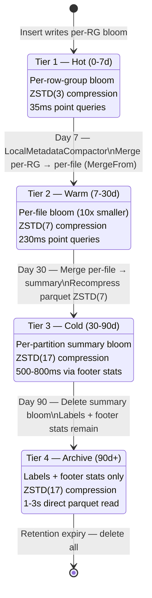
```mermaid
stateDiagram-v2
    [*] --> Hot: Insert writes per-RG bloom

    Hot: Tier 1 — Hot (0-7d)
    Hot: Per-row-group bloom
    Hot: ZSTD(3) compression
    Hot: 35ms point queries

    Warm: Tier 2 — Warm (7-30d)
    Warm: Per-file bloom (10x smaller)
    Warm: ZSTD(7) compression
    Warm: 230ms point queries

    Cold: Tier 3 — Cold (30-90d)
    Cold: Per-partition summary bloom
    Cold: ZSTD(17) compression
    Cold: 500-800ms via footer stats

    Archive: Tier 4 — Archive (90d+)
    Archive: Labels + footer stats only
    Archive: ZSTD(17) compression
    Archive: 1-3s direct parquet read

    Hot --> Warm: Day 7 — LocalMetadataCompactor\nMerge per-RG → per-file (MergeFrom)
    Warm --> Cold: Day 30 — Merge per-file → summary\nRecompress parquet ZSTD(7)
    Cold --> Archive: Day 90 — Delete summary bloom\nLabels + footer stats remain
    Archive --> [*]: Retention expiry — delete all
```

### Mermaid: Auto-Tuning Feedback Loop

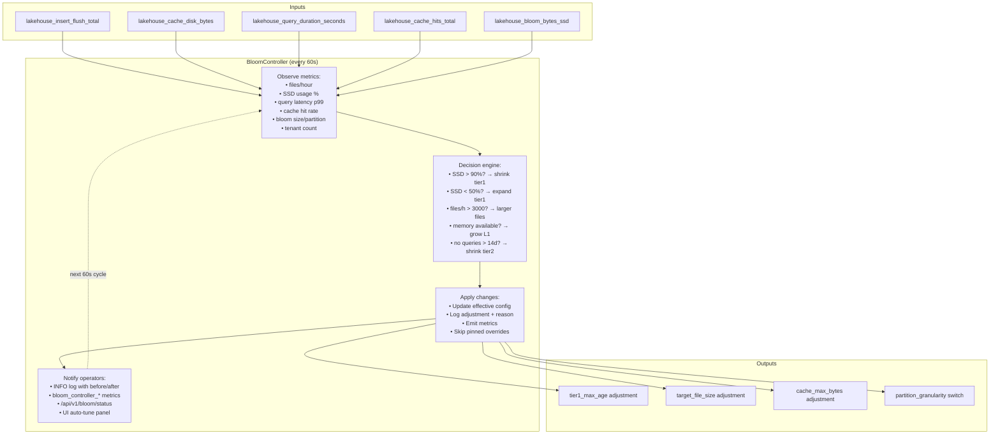
```mermaid
flowchart TB
    subgraph "BloomController (every 60s)"
        Observe["Observe metrics:\n• files/hour\n• SSD usage %\n• query latency p99\n• cache hit rate\n• bloom size/partition\n• tenant count"]
        Decide["Decision engine:\n• SSD > 90%? → shrink tier1\n• SSD < 50%? → expand tier1\n• files/h > 3000? → larger files\n• memory available? → grow L1\n• no queries > 14d? → shrink tier2"]
        Apply["Apply changes:\n• Update effective config\n• Log adjustment + reason\n• Emit metrics\n• Skip pinned overrides"]
        Notify["Notify operators:\n• INFO log with before/after\n• bloom_controller_* metrics\n• /api/v1/bloom/status\n• UI auto-tune panel"]
    end

    Observe --> Decide --> Apply --> Notify
    Notify -.->|next 60s cycle| Observe

    subgraph "Inputs"
        M1[lakehouse_insert_flush_total]
        M2[lakehouse_cache_disk_bytes]
        M3[lakehouse_query_duration_seconds]
        M4[lakehouse_cache_hits_total]
        M5[lakehouse_bloom_bytes_ssd]
    end

    M1 --> Observe
    M2 --> Observe
    M3 --> Observe
    M4 --> Observe
    M5 --> Observe

    subgraph "Outputs"
        O1[tier1_max_age adjustment]
        O2[target_file_size adjustment]
        O3[cache_max_bytes adjustment]
        O4[partition_granularity switch]
    end

    Apply --> O1
    Apply --> O2
    Apply --> O3
    Apply --> O4
```

### Mermaid: Complete Query Pipeline (6 Layers)

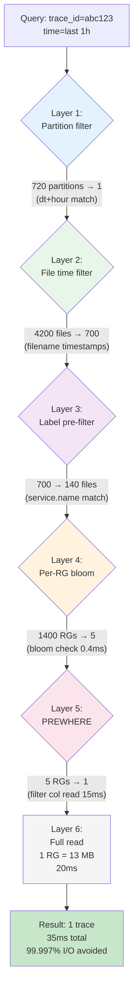
```mermaid
flowchart TD
    Q[Query: trace_id=abc123\ntime=last 1h] --> L1

    L1{Layer 1:\nPartition filter}
    L1 -->|"720 partitions → 1\n(dt+hour match)"| L2

    L2{Layer 2:\nFile time filter}
    L2 -->|"4200 files → 700\n(filename timestamps)"| L3

    L3{Layer 3:\nLabel pre-filter}
    L3 -->|"700 → 140 files\n(service.name match)"| L4

    L4{Layer 4:\nPer-RG bloom}
    L4 -->|"1400 RGs → 5\n(bloom check 0.4ms)"| L5

    L5{Layer 5:\nPREWHERE}
    L5 -->|"5 RGs → 1\n(filter col read 15ms)"| L6

    L6[Layer 6:\nFull read\n1 RG = 13 MB\n20ms]

    L6 --> Result[Result: 1 trace\n35ms total\n99.997% I/O avoided]

    style L1 fill:#e3f2fd
    style L2 fill:#e8f5e9
    style L3 fill:#f3e5f5
    style L4 fill:#fff3e0
    style L5 fill:#fce4ec
    style L6 fill:#f5f5f5
    style Result fill:#c8e6c9
```

### Mermaid: Insert Path with Bloom Building

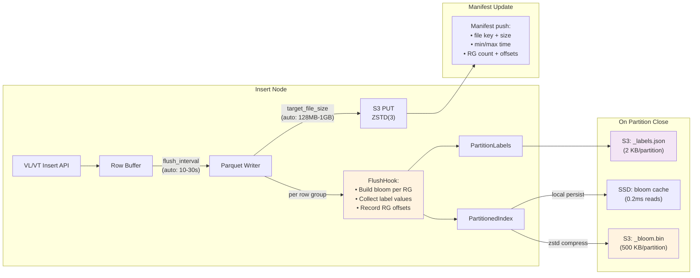
```mermaid
flowchart LR
    subgraph "Insert Node"
        API[VL/VT Insert API] --> Buffer[Row Buffer]
        Buffer -->|"flush_interval\n(auto: 10-30s)"| Writer[Parquet Writer]
        Writer -->|per row group| FlushHook["FlushHook:\n• Build bloom per RG\n• Collect label values\n• Record RG offsets"]
        FlushHook --> BloomIdx[PartitionedIndex]
        FlushHook --> Labels[PartitionLabels]
        Writer -->|"target_file_size\n(auto: 128MB-1GB)"| S3Put["S3 PUT\nZSTD(3)"]
    end

    subgraph "On Partition Close"
        BloomIdx -->|"zstd compress"| BloomS3["S3: _bloom.bin\n(500 KB/partition)"]
        Labels --> LabelS3["S3: _labels.json\n(2 KB/partition)"]
        BloomIdx -->|"local persist"| BloomSSD["SSD: bloom cache\n(0.2ms reads)"]
    end

    subgraph "Manifest Update"
        S3Put --> ManifestPush["Manifest push:\n• file key + size\n• min/max time\n• RG count + offsets"]
    end

    style FlushHook fill:#fff3e0
    style BloomS3 fill:#fff3e0
    style LabelS3 fill:#f3e5f5
```

### Mermaid: Cache Hierarchy with Auto-Tuning

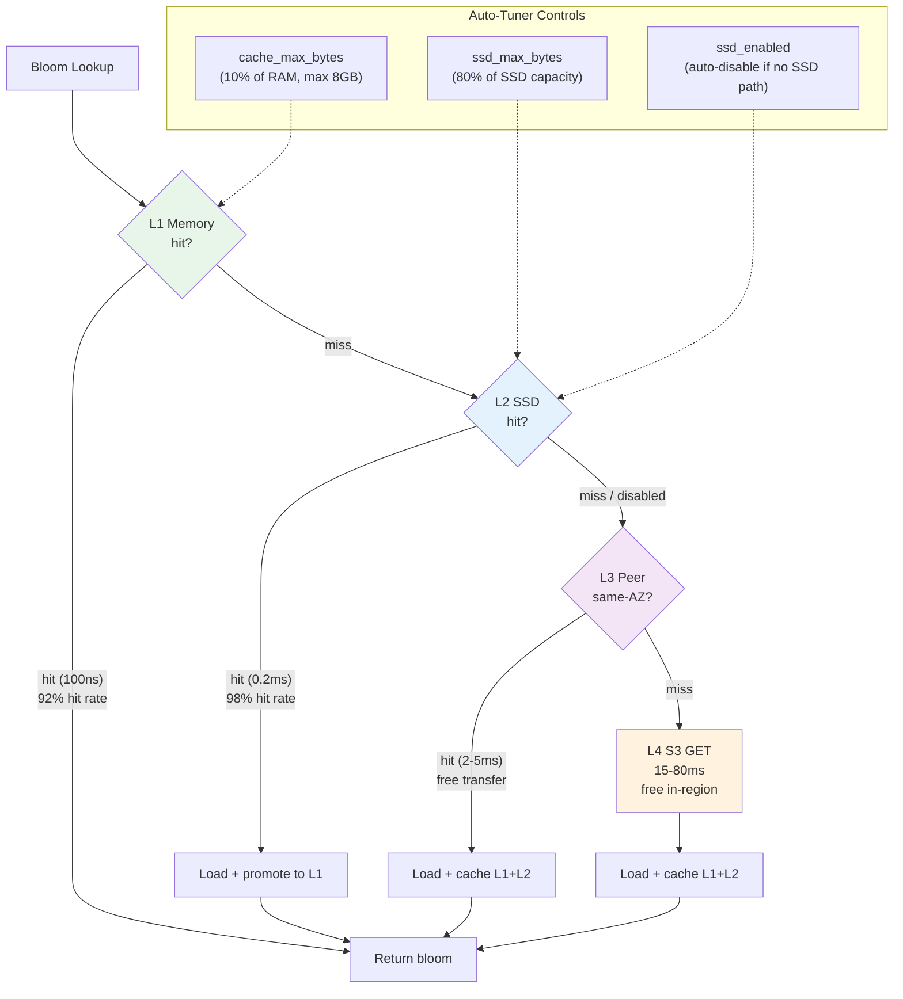
```mermaid
flowchart TD
    Query[Bloom Lookup] --> L1Check{L1 Memory\nhit?}
    L1Check -->|"hit (100ns)\n92% hit rate"| Result[Return bloom]
    L1Check -->|miss| L2Check{L2 SSD\nhit?}
    L2Check -->|"hit (0.2ms)\n98% hit rate"| L2Load[Load + promote to L1]
    L2Check -->|"miss / disabled"| L3Check{L3 Peer\nsame-AZ?}
    L3Check -->|"hit (2-5ms)\nfree transfer"| L3Load[Load + cache L1+L2]
    L3Check -->|miss| L4[L4 S3 GET\n15-80ms\nfree in-region]
    L4 --> L4Load[Load + cache L1+L2]

    L2Load --> Result
    L3Load --> Result
    L4Load --> Result

    subgraph "Auto-Tuner Controls"
        AT1["cache_max_bytes\n(10% of RAM, max 8GB)"]
        AT2["ssd_max_bytes\n(80% of SSD capacity)"]
        AT3["ssd_enabled\n(auto-disable if no SSD path)"]
    end

    AT1 -.-> L1Check
    AT2 -.-> L2Check
    AT3 -.-> L2Check

    style L1Check fill:#e8f5e9
    style L2Check fill:#e3f2fd
    style L3Check fill:#f3e5f5
    style L4 fill:#fff3e0
```

### Mermaid: TTL Recompression Flow

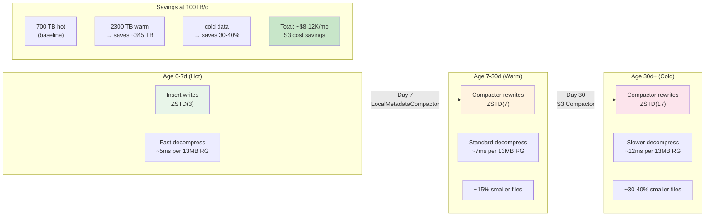
```mermaid
flowchart LR
    subgraph "Age 0-7d (Hot)"
        H1["Insert writes\nZSTD(3)"]
        H2["Fast decompress\n~5ms per 13MB RG"]
    end

    subgraph "Age 7-30d (Warm)"
        W1["Compactor rewrites\nZSTD(7)"]
        W2["Standard decompress\n~7ms per 13MB RG"]
        W3["~15% smaller files"]
    end

    subgraph "Age 30d+ (Cold)"
        C1["Compactor rewrites\nZSTD(17)"]
        C2["Slower decompress\n~12ms per 13MB RG"]
        C3["~30-40% smaller files"]
    end

    H1 -->|"Day 7\nLocalMetadataCompactor"| W1
    W1 -->|"Day 30\nS3 Compactor"| C1

    subgraph "Savings at 100TB/d"
        S1["700 TB hot\n(baseline)"]
        S2["2300 TB warm\n→ saves ~345 TB"]
        S3["cold data\n→ saves 30-40%"]
        S4["Total: ~$8-12K/mo\nS3 cost savings"]
    end

    style H1 fill:#e8f5e9
    style W1 fill:#fff3e0
    style C1 fill:#fce4ec
    style S4 fill:#c8e6c9
```

## Auto-Tuning Visibility and Operator Documentation

### What Operators See

The auto-tuning system is transparent. Operators never wonder "what did it decide?" — every decision is visible in three places:

#### 1. Logs (INFO level)

Every adjustment produces one log line with before/after and reason:

```
INFO bloom_controller: tier_expand tier1_max_age=6d→7d reason="SSD at 48%, expanding hot tier for better query performance"
INFO bloom_controller: file_size_increase target_file_size=128MB→512MB reason="high file rate (3200 files/h per tenant), larger files reduce S3 PUTs"
INFO bloom_controller: cache_resize L1=1.0GB→2.1GB (4200 partitions) reason="system has 32GB available memory, expanding L1 from 3% to 7%"
INFO bloom_controller: granularity_switch partition_granularity=hour→day reason="low file rate (35 files/h per tenant), daily partitions more efficient"
INFO bloom_controller: no_adjustment reason="all parameters within target ranges, SSD=72%, hit_rate=93%, p99=38ms"
```

When no adjustment is needed, a periodic "all good" log confirms the controller is alive and monitoring.

#### 2. Metrics (Prometheus)

```
# Current effective values (what the system is actually using)
lakehouse_bloom_controller_tier1_max_age_hours 168          # 7 days
lakehouse_bloom_controller_tier2_max_age_hours 720          # 30 days  
lakehouse_bloom_controller_tier3_max_age_hours 2160         # 90 days
lakehouse_bloom_controller_target_file_size_bytes 536870912 # 512 MB
lakehouse_bloom_controller_cache_max_bytes 2147483648       # 2.1 GB
lakehouse_bloom_controller_ssd_usage_ratio 0.72
lakehouse_bloom_controller_partition_granularity 1          # 1=hour, 2=day

# What the controller is seeing (inputs)
lakehouse_bloom_controller_observed_files_per_hour 3200
lakehouse_bloom_controller_observed_query_p99_seconds 0.038
lakehouse_bloom_controller_observed_bloom_hit_rate 0.93
lakehouse_bloom_controller_observed_tenant_count 200

# What the controller did (actions)
lakehouse_bloom_controller_adjustments_total{parameter="tier1_max_age",direction="expand"} 2
lakehouse_bloom_controller_adjustments_total{parameter="target_file_size",direction="increase"} 1
lakehouse_bloom_controller_adjustments_total{parameter="cache_max_bytes",direction="increase"} 3
lakehouse_bloom_controller_last_adjustment_seconds 1716000000
lakehouse_bloom_controller_cycle_duration_seconds 0.002   # how long each 60s check takes

# Overrides (what the operator pinned)
lakehouse_bloom_controller_overrides_active 0               # number of active overrides
```

#### 3. API (JSON for UI and debugging)

`GET /api/v1/bloom/controller` — full auto-tuner state:

```json
{
  "status": "active",
  "cycle_interval": "60s",
  "last_cycle": "2026-05-17T21:30:00Z",
  "effective_config": {
    "tier1_max_age": "7d",
    "tier2_max_age": "30d",
    "tier3_max_age": "90d",
    "target_file_size": "512MB",
    "flush_interval": "30s",
    "partition_granularity": "hour",
    "cache_max_bytes": "2.1GB",
    "ssd_max_bytes": "40GB",
    "ssd_enabled": true,
    "compression_levels": [3, 7, 17]
  },
  "observations": {
    "files_per_tenant_per_hour": 3200,
    "ssd_usage_ratio": 0.72,
    "ssd_capacity_bytes": 53687091200,
    "memory_available_bytes": 34359738368,
    "query_p99_seconds": 0.038,
    "bloom_hit_rate": 0.93,
    "tenant_count": 200,
    "oldest_query_age": "6d"
  },
  "overrides": {},
  "recent_adjustments": [
    {
      "time": "2026-05-17T21:30:00Z",
      "parameter": "target_file_size",
      "old_value": "128MB",
      "new_value": "512MB",
      "reason": "high file rate (3200 files/h per tenant)"
    },
    {
      "time": "2026-05-17T18:00:00Z",
      "parameter": "tier1_max_age",
      "old_value": "6d",
      "new_value": "7d",
      "reason": "SSD at 48%, expanding hot tier"
    }
  ],
  "thresholds": {
    "ssd_shrink_above": 0.90,
    "ssd_expand_below": 0.50,
    "file_rate_large_above": 3000,
    "file_rate_daily_below": 50,
    "memory_l1_max_ratio": 0.10
  }
}
```

### What Happens at Each Scale Transition

The auto-tuner detects growth automatically. Here's what operators see as traffic grows:

```
── Startup (1 TB/day, 50 tenants) ─────────────────────────────────
bloom_controller: initial_config tier1=7d file_size=128MB cache=512MB granularity=hour
bloom_controller: no_adjustment reason="all within targets, SSD=3%"
→ Operator sees: small footprint, everything at defaults, no action needed

── Growing (10 TB/day, 200 tenants) ───────────────────────────────
bloom_controller: cache_resize L1=512MB→1.5GB reason="higher tenant count, more partitions in LRU"
→ Operator sees: cache grew to use more available memory. Query latency unchanged.

── Mid-size (50 TB/day, 500 tenants) ──────────────────────────────
bloom_controller: file_size_increase 128MB→256MB reason="file rate 1800/h, reducing S3 PUTs"
bloom_controller: cache_resize L1=1.5GB→4GB reason="500 active tenants"
→ Operator sees: system adapting to higher volume. Still no manual config needed.

── Large (100 TB/day, 1000 tenants) ───────────────────────────────
bloom_controller: file_size_increase 256MB→512MB reason="file rate 3200/h"
bloom_controller: tier_shrink tier1=7d→5d reason="SSD at 88%, freeing space"
bloom_controller: INFO "Consider upgrading to i3en instances with NVMe for better SSD capacity"
→ Operator sees: system managing SSD pressure. Clear recommendation in logs.

── Extreme (500 TB/day, 5000 tenants) ─────────────────────────────
bloom_controller: tier_shrink tier1=5d→3d reason="SSD at 94%"
bloom_controller: WARN "SSD usage critical, recommend: bloom.ssd_enabled=false for S3-only mode or upgrade to NVMe"
→ Operator sees: clear WARN with two specific actions. System still works, just constrained.
```

### Safety Guarantees

The auto-tuner NEVER:
- Disables bloom (only operator can set `bloom.enabled: false`)
- Deletes data (only adjusts tier boundaries for future transitions)
- Makes changes more frequently than every 60 seconds
- Makes more than one adjustment per parameter per cycle
- Overrides operator-pinned values

The auto-tuner CAN:
- Shrink/expand tier boundaries (within min 1d / max retention)
- Resize caches (within available memory/disk)
- Switch partition granularity (hour ↔ day)
- Adjust file sizes (128MB-1GB range)
- Emit WARN/INFO recommendations for operator action

## Tier Configuration Guide

### Default Tier Boundaries

```
  ┌───────────────┐   ┌───────────────┐   ┌───────────────┐   ┌───────────────┐
  │  Tier 1: Hot  │   │ Tier 2: Warm  │   │ Tier 3: Cold  │   │ Tier 4: Arch. │
  │   0-7 days    │──▶│  7-30 days    │──▶│  30-90 days   │──▶│    90d+       │
  │  Per-RG bloom │   │ Per-file bloom│   │ Summary bloom │   │ Labels only   │
  │   35ms p50    │   │  230ms p50    │   │ 500-800ms p50 │   │  1-3s p50     │
  │  ZSTD(3)      │   │  ZSTD(7)      │   │  ZSTD(17)     │   │  ZSTD(17)     │
  └───────────────┘   └───────────────┘   └───────────────┘   └───────────────┘
```

### What Each Tier Provides

| Tier | Bloom precision | Query speed | SSD cost per 1K tenants | S3 cost |
|------|----------------|-------------|------------------------|---------|
| Tier 1 (Hot) | Per-RG: 3600 entries/partition | 35 ms | ~76 GB/day of data | ~$1.75/day |
| Tier 2 (Warm) | Per-file: 360 entries/partition | 230 ms | ~7.6 GB/day of data | ~$0.18/day |
| Tier 3 (Cold) | Summary: 1 entry/partition | 500-800 ms | ~0.009 GB/day of data | ~$0.0002/day |
| Tier 4 (Archive) | None (labels + footer stats) | 1-3s | 0 GB | ~$0.0001/day |

### Extending Tier 1 (More Days of Per-RG Bloom)

**When to extend**: Operators who frequently query data older than 7 days with trace_id lookups and need sub-100ms latency on that older data.

```yaml
bloom:
  tier1_max_age: "14d"   # 14 days of per-RG bloom instead of 7
```

**What changes:**

| Metric | tier1=7d (default) | tier1=14d | tier1=30d |
|--------|-------------------|-----------|-----------|
| SSD per node (100TB/d) | 316 GB | 475 GB | 790 GB |
| Trace lookup 10d old | 230 ms (tier 2) | 35 ms (tier 1) | 35 ms (tier 1) |
| S3 bloom storage | 6.2 TB | 9.3 TB | 15.4 TB |

**Trade-off**: 2x the SSD for 2x the days of fastest queries. Worth it if your SLA requires <100ms for 14-day lookups. The auto-tuner will shrink this back if SSD fills up (unless pinned).

**Best for**: Incident response teams that investigate issues 1-2 weeks after they happen. Security/compliance teams with 14-day audit windows.

### Extending Tier 2 (More Days of Per-File Bloom)

**When to extend**: Operators who query 30-90 day old data frequently and want 230ms instead of 500-800ms for point lookups.

```yaml
bloom:
  tier2_max_age: "60d"   # per-file bloom for 60 days instead of 30
```

**What changes:**

| Metric | tier2=30d (default) | tier2=60d | tier2=90d |
|--------|-------------------|-----------|-----------|
| SSD per node (100TB/d) | 316 GB | 340 GB | 364 GB |
| Trace lookup 45d old | 500-800 ms (tier 3) | 230 ms (tier 2) | 230 ms (tier 2) |
| S3 bloom storage | 6.2 TB | 7.0 TB | 7.8 TB |

**Trade-off**: Minimal SSD increase (per-file bloom is 10x smaller than per-RG). Extending tier 2 is cheap — the biggest SSD consumer is tier 1, not tier 2. Extending to 60d or 90d adds only ~25-50 GB per node.

**Best for**: Most deployments that need reasonable performance on month-old data. This is the cheapest tier to extend.

### Extending Tier 3 (More Days of Summary Bloom)

**When to extend**: Operators with very long retention (180d+, 365d) who want basic bloom acceleration on old data.

```yaml
bloom:
  tier3_max_age: "180d"   # summary bloom for 6 months instead of 90 days
```

**What changes:**

| Metric | tier3=90d (default) | tier3=180d | tier3=365d |
|--------|-------------------|-----------|-----------|
| SSD per node (100TB/d) | 316 GB | 316.1 GB | 316.3 GB |
| Trace lookup 120d old | 1-3s (tier 4) | 500-800 ms (tier 3) | 500-800 ms (tier 3) |
| S3 bloom storage | 6.2 TB | 6.3 TB | 6.4 TB |

**Trade-off**: Almost zero additional cost. Summary bloom is ~9 KB per partition — extending from 90d to 365d adds ~0.3 GB per node. Essentially free acceleration for old data.

**Best for**: Compliance-heavy deployments with 1-year retention. Financial services, healthcare, regulated industries. Extend tier 3 to match your retention period — it's nearly free.

### Shrinking Tiers (Save SSD)

If SSD is constrained, shrink tiers to free space:

```yaml
bloom:
  tier1_max_age: "3d"    # only 3 days of per-RG bloom (saves 57% SSD)
  tier2_max_age: "14d"   # only 14 days of per-file bloom
```

**What changes at 100TB/d:**

| Config | SSD per node | 1d-old query | 5d-old query | 20d-old query |
|--------|-------------|-------------|-------------|--------------|
| Default (7d/30d) | 316 GB | 35 ms | 35 ms | 230 ms |
| Shrunk (3d/14d) | 136 GB | 35 ms | 230 ms | 500-800 ms |
| Minimal (1d/7d) | 54 GB | 35 ms | 230 ms | 500-800 ms |

**Best for**: Dev/staging environments, cost-sensitive deployments, shared infrastructure where SSD is limited.

### Recommended Profiles

```yaml
# Profile: "fast" — maximum query speed, more SSD
bloom:
  tier1_max_age: "14d"
  tier2_max_age: "60d"
  tier3_max_age: "365d"
# SSD: ~475 GB/node at 100TB/d. Best with NVMe instances.

# Profile: "balanced" — default, auto-tuned
bloom:
  enabled: true
  ssd_path: "/data/bloom-cache"
# tier1=7d, tier2=30d, tier3=90d (auto-adjusted). SSD: ~316 GB/node.

# Profile: "compact" — minimal SSD, still accelerated
bloom:
  tier1_max_age: "3d"
  tier2_max_age: "14d"
  tier3_max_age: "90d"
# SSD: ~136 GB/node. Good for smaller EBS volumes.

# Profile: "s3-only" — no SSD at all
bloom:
  ssd_path: ""
# All bloom from S3/peer cache. p99 ~80ms. Works at any scale.

# Profile: "compliance" — long retention, full acceleration
bloom:
  tier1_max_age: "7d"
  tier2_max_age: "90d"
  tier3_max_age: "365d"
# SSD: ~364 GB/node. Summary bloom covers entire retention cheaply.
```

### Per-Tier Data and Metadata Storage Control

Data storage tiers and bloom index tiers are **independent concerns**. Storage tiers control where parquet files and metadata live in S3. Bloom tiers control bloom filter precision by data age. They can be configured separately.

#### Storage Tiers Configuration

Storage tiers control **two things independently** for each age range:
1. **Data** — S3 storage class for parquet files (the bulk of storage cost)
2. **Metadata** — S3 storage class for bloom files, labels, and manifest entries

```yaml
lakehouseConfig:
  storage:
    tiers:
      # Each tier: age boundary, S3 class for data, S3 class for metadata.
      # Omit any field or the entire block to use defaults.

      hot:
        max_age: ""                          # default: "7d"
        data:
          s3_storage_class: ""               # default: "STANDARD"
          compression: ""                    # default: "zstd:3"
        metadata:
          s3_storage_class: ""               # default: "STANDARD"
          # Metadata is always fast-access. STANDARD is almost always right.

      warm:
        max_age: ""                          # default: "30d"
        data:
          s3_storage_class: ""               # default: "STANDARD_IA"
          compression: ""                    # default: "zstd:7"
        metadata:
          s3_storage_class: ""               # default: "STANDARD"

      cold:
        max_age: ""                          # default: retention or "90d"
        data:
          s3_storage_class: ""               # default: "GLACIER_IR"
          compression: ""                    # default: "zstd:17"
        metadata:
          s3_storage_class: ""               # default: "STANDARD"
          # Even in cold, metadata stays STANDARD for fast bloom/label lookups

      archive:
        # No max_age — everything beyond cold
        data:
          s3_storage_class: ""               # default: "DEEP_ARCHIVE"
          compression: ""                    # default: "zstd:17"
        metadata:
          s3_storage_class: ""               # default: "STANDARD_IA"
          # Archive metadata can be STANDARD_IA — rare access, still instant

    # Global retention. Each tier inherits this unless overridden per-tenant.
    retention:
      default: "365d"
      rules:
        - match: { "tenant": "finance-team" }
          keep: "7y"
        - match: { "tenant": "dev" }
          keep: "30d"
```

#### Why Data and Metadata Are Separated

```
Partition: dt=2026-03-15/hour=10/tenant=acme/

DATA (bulk, follows tier S3 class):
├── batch-001.parquet          → GLACIER_IR ($0.004/GB)
├── batch-002.parquet          → GLACIER_IR ($0.004/GB)
├── batch-003.parquet          → GLACIER_IR ($0.004/GB)
│   └── total: ~2.4 GB per partition

METADATA (small, stays fast):
├── partition-summary.bloom    → STANDARD ($0.023/GB)  ← 9 KB
├── partition-labels.json      → STANDARD ($0.023/GB)  ← 5 KB
└── manifest entry             → in-memory + S3 backup ← 200 bytes
    └── total: ~14 KB per partition
```

**The ratio is ~170,000:1.** Keeping metadata in STANDARD while data goes to GLACIER costs essentially nothing ($0.0003/partition/month) but enables:
- **Bloom lookups** on cold data: 500-800ms (metadata read from STANDARD)
- **Label filtering** on cold data: instant (labels always in STANDARD)
- **Full data retrieval** from cold: 3-5 minutes (async restore from GLACIER_IR)

If metadata followed data to GLACIER_IR, bloom lookups would require a restore request first — adding minutes of latency to what should be a sub-second operation.

#### Defaults When Not Set

When `storage.tiers` is omitted or fields are empty:

```
Tier     │ Age          │ Data S3 Class    │ Meta S3 Class │ Compression │ Data $/GB/mo │ Meta $/GB/mo
─────────┼──────────────┼──────────────────┼───────────────┼─────────────┼──────────────┼─────────────
Hot      │ 0 → 7d       │ STANDARD         │ STANDARD      │ ZSTD(3)     │ $0.023       │ $0.023
Warm     │ 7d → 30d     │ STANDARD_IA      │ STANDARD      │ ZSTD(7)     │ $0.0125      │ $0.023
Cold     │ 30d → ret.   │ GLACIER_IR       │ STANDARD      │ ZSTD(17)    │ $0.004       │ $0.023
Archive  │ beyond cold  │ DEEP_ARCHIVE     │ STANDARD_IA   │ ZSTD(17)    │ $0.00099     │ $0.0125
```

**Derivation rules:**
1. `hot.max_age` — 7d default, auto-tuner adjusts by SSD pressure
2. `warm.max_age` — 30d default, auto-tuner adjusts by query frequency
3. `cold.max_age` — derived from `retention.default`. Retention=365d → cold covers 30d-365d. Falls back to 90d.
4. `archive` — everything beyond cold. Only exists when retention > cold.max_age.
5. **Data S3 class** — cheapest class supporting the tier's access pattern
6. **Metadata S3 class** — STANDARD for hot/warm/cold (fast lookups required), STANDARD_IA for archive (rare access, still instant retrieval)

#### S3 Storage Class Reference

| S3 Class | Min charge | Retrieval latency | Retrieval cost | Use for data | Use for metadata |
|----------|-----------|-------------------|---------------|-------------|-----------------|
| STANDARD | none | immediate | free | Hot | Hot, Warm, Cold |
| STANDARD_IA | 30d | immediate | $0.01/GB | Warm | Archive |
| ONEZONE_IA | 30d | immediate | $0.01/GB | Warm (non-critical) | Not recommended |
| GLACIER_IR | 90d | milliseconds | $0.01/GB | Cold | Not recommended |
| GLACIER_FR | 90d | 1-5 minutes | $0.03/GB | Cold (rare restore) | Never |
| DEEP_ARCHIVE | 180d | 12-48 hours | $0.02/GB | Archive | Never |

**Constraints enforced:**
- Metadata MUST use STANDARD or STANDARD_IA (bloom/label reads require immediate access)
- Data for hot tier MUST use STANDARD or STANDARD_IA (frequent reads during insert+query)
- Data for warm/cold/archive is unconstrained (operator chooses cost vs access trade-off)
- Validation rejects GLACIER/DEEP_ARCHIVE for metadata or hot data at startup

#### Data Lifecycle with Separate Data/Metadata Paths

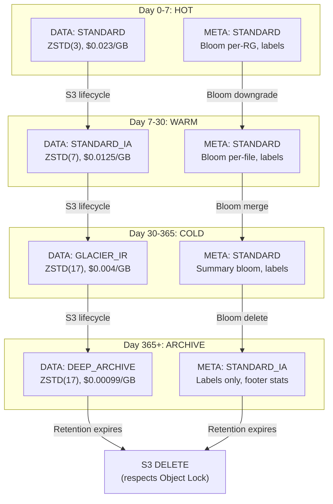
```mermaid
flowchart TD
    subgraph "Day 0-7: HOT"
        HD["DATA: STANDARD\nZSTD(3), $0.023/GB"]
        HM["META: STANDARD\nBloom per-RG, labels"]
    end

    subgraph "Day 7-30: WARM"
        WD["DATA: STANDARD_IA\nZSTD(7), $0.0125/GB"]
        WM["META: STANDARD\nBloom per-file, labels"]
    end

    subgraph "Day 30-365: COLD"
        CD["DATA: GLACIER_IR\nZSTD(17), $0.004/GB"]
        CM["META: STANDARD\nSummary bloom, labels"]
    end

    subgraph "Day 365+: ARCHIVE"
        AD["DATA: DEEP_ARCHIVE\nZSTD(17), $0.00099/GB"]
        AM["META: STANDARD_IA\nLabels only, footer stats"]
    end

    HD -->|"S3 lifecycle"| WD
    HM -->|"Bloom downgrade"| WM
    WD -->|"S3 lifecycle"| CD
    WM -->|"Bloom merge"| CM
    CD -->|"S3 lifecycle"| AD
    CM -->|"Bloom delete"| AM
    AD -->|"Retention expires"| DEL["S3 DELETE\n(respects Object Lock)"]
    AM -->|"Retention expires"| DEL
```

#### S3 Lifecycle Rule Generation

Lakehouse generates **two sets** of S3 lifecycle rules — one for data, one for metadata:

```json
{
  "Rules": [
    {
      "ID": "lakehouse-data-lifecycle",
      "Filter": {"Tag": {"Key": "lakehouse-type", "Value": "data"}},
      "Status": "Enabled",
      "Transitions": [
        {"Days": 7, "StorageClass": "STANDARD_IA"},
        {"Days": 30, "StorageClass": "GLACIER_INSTANT_RETRIEVAL"},
        {"Days": 365, "StorageClass": "DEEP_ARCHIVE"}
      ]
    },
    {
      "ID": "lakehouse-metadata-lifecycle",
      "Filter": {"Tag": {"Key": "lakehouse-type", "Value": "metadata"}},
      "Status": "Enabled",
      "Transitions": [
        {"Days": 365, "StorageClass": "STANDARD_IA"}
      ]
    }
  ]
}
```

S3 object tagging at write time:
- Parquet files → `lakehouse-type=data`
- Bloom files → `lakehouse-type=metadata`
- Label files → `lakehouse-type=metadata`
- Manifest backups → `lakehouse-type=metadata`

**Operator action:** Auto-sync is opt-in:

```yaml
s3:
  lifecycle_sync: true   # auto-create/update S3 lifecycle rules from tier config
```

Or apply manually via: `lakehouse-logs --s3-lifecycle-sync --dry-run` (preview) then `--apply`.

#### Example Configurations

**Default (nothing set):**
```yaml
storage:
  tiers: {}
  # All defaults apply:
  # Data: STANDARD → STANDARD_IA → GLACIER_IR → DEEP_ARCHIVE
  # Metadata: STANDARD → STANDARD → STANDARD → STANDARD_IA
  # Retention follows retention.default
```

**Cost-optimized (aggressive data tiering, metadata unchanged):**
```yaml
storage:
  tiers:
    hot:
      max_age: "3d"
    warm:
      max_age: "14d"
      data:
        s3_storage_class: "STANDARD_IA"
    cold:
      data:
        s3_storage_class: "GLACIER_IR"
    archive:
      data:
        s3_storage_class: "DEEP_ARCHIVE"
  # Metadata stays STANDARD everywhere — operator doesn't need to think about it
```

**Performance-first (keep data accessible longer):**
```yaml
storage:
  tiers:
    hot:
      max_age: "14d"
    warm:
      max_age: "60d"
      data:
        s3_storage_class: "STANDARD"       # no IA, avoid retrieval costs
    cold:
      max_age: "365d"
      data:
        s3_storage_class: "STANDARD_IA"    # instant access
    archive:
      data:
        s3_storage_class: "GLACIER_IR"     # not DEEP_ARCHIVE — faster restore
```

**SOC2 compliance (fast restore, metadata always instant):**
```yaml
storage:
  tiers:
    warm:
      data:
        s3_storage_class: "STANDARD_IA"
    cold:
      max_age: "365d"
      data:
        s3_storage_class: "STANDARD_IA"    # instant access for auditors
    archive:
      data:
        s3_storage_class: "GLACIER_IR"     # 3-5h restore, not 48h
      metadata:
        s3_storage_class: "STANDARD"       # keep archive metadata instant too
  retention:
    default: "7y"
s3:
  object_lock_mode: "COMPLIANCE"
  object_lock_retain_days: 2555
```

#### Cost Impact of Storage Class Choices

At 100TB/d with 365-day retention:

| Config | Data S3 cost/mo | Metadata S3 cost/mo | Total | vs default |
|--------|----------------|--------------------|----|-----------|
| All STANDARD (no tiering) | $1,006,200 | $720 | $1,006,920 | +354% |
| Default (auto-tiered) | $221,325 | $720 | $222,045 | baseline |
| Aggressive (3d/14d/90d) | $198,500 | $720 | $199,220 | -10% |
| Performance (STANDARD/IA) | $437,500 | $720 | $438,220 | +97% |
| SOC2 (IA for cold data) | $298,750 | $755 | $299,505 | +35% |

**Key insight:** Metadata cost is <0.4% of data cost in every scenario. Keeping metadata in STANDARD is effectively free — the only decision that matters is the data S3 class per tier.

**Primary trade-off:** STANDARD_IA for cold data costs ~35% more than GLACIER_IR but gives instant full-data access for auditors and incident response.

#### Storage Tier UI Panel

The UI provides a dedicated storage tier management panel where operators can see current sizes, costs, S3 classes, and adjust tier boundaries and storage classes interactively.

```
┌─ Storage Tiers ─────────────────────────────────────────────────────────┐
│                                                                          │
│  ┌─ Data ────────────────────────────────────────────────────────────┐  │
│  │                                                                    │  │
│  │  ←─ Hot (7d) ──→←── Warm (23d) ──→←──── Cold (340d) ────→← Arc →│  │
│  │  [████████████] [████████████████████] [██████████████████████] [░]│  │
│  │   STANDARD       STANDARD_IA           GLACIER_IR       DEEP_ARCH│  │
│  │   2.1 TB          6.8 TB               28.4 TB          1.2 TB   │  │
│  │   $48/mo          $85/mo               $114/mo          $1.2/mo  │  │
│  │                                                                    │  │
│  │  Total data: 38.5 TB — $248/mo                                    │  │
│  └────────────────────────────────────────────────────────────────────┘  │
│                                                                          │
│  ┌─ Metadata ────────────────────────────────────────────────────────┐  │
│  │                                                                    │  │
│  │  ←─ Hot (7d) ──→←── Warm (23d) ──→←──── Cold (340d) ────→← Arc →│  │
│  │  [████████████] [████████████████████] [██████████████████████] [░]│  │
│  │   STANDARD       STANDARD              STANDARD         STD_IA   │  │
│  │   76 MB           228 MB               3.2 GB           40 MB    │  │
│  │   $0.002          $0.005               $0.074           $0.0005  │  │
│  │                                                                    │  │
│  │  Total metadata: 3.5 GB — $0.08/mo   (0.009% of data)            │  │
│  └────────────────────────────────────────────────────────────────────┘  │
│                                                                          │
│  ┌─ Tier Controls ───────────────────────────────────────────────────┐  │
│  │                                                                    │  │
│  │  Hot → Warm boundary:  [7d  ▼]   Data class: [STANDARD    ▼]     │  │
│  │  Warm → Cold boundary: [30d ▼]   Data class: [STANDARD_IA ▼]     │  │
│  │  Cold → Arch boundary: [365d▼]   Data class: [GLACIER_IR  ▼]     │  │
│  │  Archive:                         Data class: [DEEP_ARCHIVE▼]     │  │
│  │                                                                    │  │
│  │  Metadata class:  Hot [STANDARD▼] Warm [STANDARD▼]               │  │
│  │                   Cold [STANDARD▼] Arch [STANDARD_IA▼]            │  │
│  │                                                                    │  │
│  │  Retention: [365d ▼] (global)    Per-tenant: [2 rules configured] │  │
│  │                                                                    │  │
│  │  [Apply Changes]  [Reset to Defaults]  [Preview Cost Impact]      │  │
│  └────────────────────────────────────────────────────────────────────┘  │
│                                                                          │
│  ┌─ Cost Projection ────────────────────────────────────────────────┐  │
│  │                                                                    │  │
│  │  If you change Cold data from GLACIER_IR → STANDARD_IA:           │  │
│  │    Current:  $248/mo                                               │  │
│  │    Projected: $337/mo (+$89/mo, +36%)                              │  │
│  │    Benefit: instant data access for cold queries (no restore wait) │  │
│  │                                                                    │  │
│  │  If you extend Hot from 7d → 14d:                                  │  │
│  │    Current:  $248/mo                                               │  │
│  │    Projected: $272/mo (+$24/mo, +10%)                              │  │
│  │    Benefit: 35ms queries on 7-14d data instead of 230ms            │  │
│  │                                                                    │  │
│  └────────────────────────────────────────────────────────────────────┘  │
│                                                                          │
│  ┌─ Per-Tenant Breakdown ────────────────────────────────────────────┐  │
│  │                                                                    │  │
│  │  Tenant          │ Data size │ Meta size │ Retention │ Cost/mo     │  │
│  │  ────────────────┼───────────┼───────────┼───────────┼──────────── │  │
│  │  production      │ 22.1 TB   │ 2.1 GB    │ 365d      │ $142       │  │
│  │  finance-team    │ 8.4 TB    │ 0.8 GB    │ 7y        │ $54        │  │
│  │  staging         │ 5.2 TB    │ 0.4 GB    │ 30d       │ $38        │  │
│  │  dev             │ 2.8 TB    │ 0.2 GB    │ 30d       │ $14        │  │
│  │                                                                    │  │
│  └────────────────────────────────────────────────────────────────────┘  │
└──────────────────────────────────────────────────────────────────────────┘
```

#### Storage Tier API Endpoints

Three API endpoints provide programmatic access to storage tier information and control.

**`GET /api/v1/storage/tiers`** — Current tier configuration, sizes, and costs

```json
{
  "tiers": {
    "hot": {
      "max_age": "7d",
      "data": {
        "s3_storage_class": "STANDARD",
        "compression": "zstd:3",
        "size_bytes": 2251799813685248,
        "object_count": 14200,
        "estimated_cost_monthly_usd": 48.12
      },
      "metadata": {
        "s3_storage_class": "STANDARD",
        "size_bytes": 79691776,
        "object_count": 28400,
        "estimated_cost_monthly_usd": 0.002
      }
    },
    "warm": {
      "max_age": "30d",
      "data": {
        "s3_storage_class": "STANDARD_IA",
        "compression": "zstd:7",
        "size_bytes": 7277616996147200,
        "object_count": 46100,
        "estimated_cost_monthly_usd": 85.40
      },
      "metadata": {
        "s3_storage_class": "STANDARD",
        "size_bytes": 239075328,
        "object_count": 92200,
        "estimated_cost_monthly_usd": 0.005
      }
    },
    "cold": {
      "max_age": "365d",
      "data": {
        "s3_storage_class": "GLACIER_IR",
        "compression": "zstd:17",
        "size_bytes": 31244015001600000,
        "object_count": 340500,
        "estimated_cost_monthly_usd": 114.20
      },
      "metadata": {
        "s3_storage_class": "STANDARD",
        "size_bytes": 3435973836,
        "object_count": 681000,
        "estimated_cost_monthly_usd": 0.074
      }
    },
    "archive": {
      "data": {
        "s3_storage_class": "DEEP_ARCHIVE",
        "compression": "zstd:17",
        "size_bytes": 1319413953331200,
        "object_count": 12200,
        "estimated_cost_monthly_usd": 1.20
      },
      "metadata": {
        "s3_storage_class": "STANDARD_IA",
        "size_bytes": 41943040,
        "object_count": 24400,
        "estimated_cost_monthly_usd": 0.0005
      }
    }
  },
  "totals": {
    "data_size_bytes": 41093445764764648,
    "metadata_size_bytes": 3796684672,
    "data_cost_monthly_usd": 248.92,
    "metadata_cost_monthly_usd": 0.08,
    "metadata_percent_of_data": 0.009
  },
  "retention": {
    "default": "365d",
    "tenant_rules": 2
  },
  "auto_tuned": true,
  "last_updated": "2026-05-17T10:00:00Z"
}
```

**`GET /api/v1/storage/tiers/tenants`** — Per-tenant storage breakdown

```json
{
  "tenants": [
    {
      "tenant_id": "production",
      "retention": "365d",
      "tiers": {
        "hot":     {"data_bytes": 1099511627776,  "meta_bytes": 41943040,  "objects": 7100},
        "warm":    {"data_bytes": 4398046511104,  "meta_bytes": 125829120, "objects": 23000},
        "cold":    {"data_bytes": 24326523994112,  "meta_bytes": 2254857830, "objects": 170000},
        "archive": {"data_bytes": 0,               "meta_bytes": 0,         "objects": 0}
      },
      "total_data_bytes": 29824082132992,
      "estimated_cost_monthly_usd": 142.30
    }
  ],
  "total_tenants": 4
}
```

**`PUT /api/v1/storage/tiers`** — Update tier configuration (runtime, persisted to config)

```json
{
  "tiers": {
    "cold": {
      "data": {
        "s3_storage_class": "STANDARD_IA"
      }
    }
  }
}
```

Response includes cost projection:
```json
{
  "applied": true,
  "changes": [
    {
      "tier": "cold",
      "field": "data.s3_storage_class",
      "old_value": "GLACIER_IR",
      "new_value": "STANDARD_IA",
      "cost_impact_monthly_usd": 89.00,
      "cost_impact_percent": 35.8
    }
  ],
  "projected_total_monthly_usd": 337.92,
  "note": "S3 lifecycle rules will be updated on next lifecycle-sync cycle (or run --s3-lifecycle-sync manually)"
}
```

**`GET /api/v1/storage/tiers/cost-projection`** — What-if cost calculator

```
GET /api/v1/storage/tiers/cost-projection?cold.data.s3_storage_class=STANDARD_IA&hot.max_age=14d
```

Returns projected costs without applying changes — powers the UI "Preview Cost Impact" button.

#### Storage Tier Metrics

Prometheus metrics for monitoring storage tier status:

```
# Per-tier data sizes
lakehouse_storage_tier_data_bytes{tier="hot"}
lakehouse_storage_tier_data_bytes{tier="warm"}
lakehouse_storage_tier_data_bytes{tier="cold"}
lakehouse_storage_tier_data_bytes{tier="archive"}

# Per-tier metadata sizes
lakehouse_storage_tier_metadata_bytes{tier="hot"}
lakehouse_storage_tier_metadata_bytes{tier="warm"}
lakehouse_storage_tier_metadata_bytes{tier="cold"}
lakehouse_storage_tier_metadata_bytes{tier="archive"}

# Per-tier object counts
lakehouse_storage_tier_objects{tier="hot", type="data"}
lakehouse_storage_tier_objects{tier="hot", type="metadata"}

# Per-tenant sizes
lakehouse_storage_tenant_data_bytes{tenant="production", tier="cold"}
lakehouse_storage_tenant_metadata_bytes{tenant="production", tier="cold"}

# S3 class distribution
lakehouse_storage_s3_class_bytes{class="STANDARD"}
lakehouse_storage_s3_class_bytes{class="STANDARD_IA"}
lakehouse_storage_s3_class_bytes{class="GLACIER_IR"}
lakehouse_storage_s3_class_bytes{class="DEEP_ARCHIVE"}

# Tier transitions
lakehouse_storage_tier_transitions_total{from="hot", to="warm"}
lakehouse_storage_tier_transitions_bytes{from="warm", to="cold"}

# Cost estimates (updated hourly)
lakehouse_storage_estimated_cost_usd{tier="hot", type="data"}
lakehouse_storage_estimated_cost_usd{tier="cold", type="metadata"}
```

### UI: Tier Configuration Advisor

The UI shows a tier configuration advisor panel that helps operators understand the impact of changing tier boundaries:

```
┌─ Tier Configuration ─────────────────────────────────────────────┐
│                                                                   │
│  Current tiers (auto-tuned):                                     │
│                                                                   │
│  ←─ Hot (7d) ─→←── Warm (23d) ──→←── Cold (60d) ──→← Archive → │
│  [████████████][████████████████████][████████████████████][░░░░] │
│  per-RG bloom  per-file bloom       summary bloom       none     │
│  35ms          230ms                500-800ms            1-3s     │
│                                                                   │
│  Current SSD: 316 GB / 500 GB (63%)    S3 bloom: 6.2 TB         │
│                                                                   │
│  ┌─ What-if simulator ─────────────────────────────────────────┐ │
│  │ Extend Hot to [14d ▼] → SSD: 475 GB (95%) ⚠️ tight        │ │
│  │ Extend Warm to [60d ▼] → SSD: 340 GB (68%) ✅ comfortable  │ │
│  │ Extend Cold to [365d ▼] → SSD: 316.3 GB (63%) ✅ free      │ │
│  │                                                              │ │
│  │ [Apply] [Reset to auto]                                      │ │
│  └──────────────────────────────────────────────────────────────┘ │
│                                                                   │
│  Query latency impact:                                            │
│  Age  │ Current │ If Hot=14d │ If Warm=60d │ If Cold=365d        │
│  ─────┼─────────┼────────────┼─────────────┼─────────────────────│
│  1d   │ 35ms    │ 35ms       │ 35ms        │ 35ms                │
│  10d  │ 230ms   │ 35ms ✨    │ 230ms       │ 230ms               │
│  45d  │ 600ms   │ 600ms      │ 230ms ✨    │ 600ms               │
│  120d │ 2s      │ 2s         │ 2s          │ 600ms ✨            │
└───────────────────────────────────────────────────────────────────┘
```

## Expected Savings by Deployment Size

### Quick Reference: What Bloom Saves You

| Deployment | Before bloom | After bloom | Savings |
|-----------|-------------|-------------|---------|
| trace_id lookup | Scan all files in partition | Read 1 row group (13 MB) | 99.997% less I/O |
| Service list (30d) | Scan all parquet files (~22s) | Read label files (~1ms) | 22,000x faster |
| Namespace filter | Download + parse all files | Skip files by label prefilter | 80% fewer files |
| Cold data query | Full partition scan | Summary bloom + footer stats | 2.5-4x faster |

### Savings by Scale

| Scale | Monthly S3 storage | Bloom metadata cost | Bloom % of storage | Query improvement |
|-------|-------------------|--------------------|--------------------|-------------------|
| 1 TB/d | ~$690 | ~$0.50 | 0.07% | 99.7% I/O reduction |
| 10 TB/d | ~$6,900 | ~$9 | 0.13% | 99.7% I/O reduction |
| 100 TB/d | ~$69,000 | ~$505 | 0.73% | 99.7% + recompression saves $8K |
| 500 TB/d | ~$345,000 | ~$2,525 | 0.73% | 99.7% + recompression saves $40K |

**At every scale, bloom metadata costs less than 1% of parquet storage.** The TTL recompression savings ($8-40K/month) dwarf the bloom infrastructure cost.

### Recompression Savings Detail

| Data age | Compression | Size vs baseline | At 100 TB/d (30d retention) |
|----------|-------------|-----------------|---------------------------|
| 0-7d | ZSTD(3) | baseline | 700 TB — fast writes |
| 7-30d | ZSTD(7) | -15% | 1,955 TB (saves 345 TB → $7,935/mo) |
| 30d+ | ZSTD(17) | -30-40% | varies (saves 30-40% on cold) |
| **Total** | | | **$8,000-12,000/month S3 savings** |

### Latency by Tier and Query Type

| Query type | Tier 1 (Hot) | Tier 2 (Warm) | Tier 3 (Cold) | Tier 4 (Archive) |
|-----------|-------------|--------------|--------------|-----------------|
| trace_id=X | 35 ms | 230 ms | 500-800 ms | 1-3s |
| service list (1d) | 1 ms | 1 ms | 4 ms | 4 ms |
| service list (30d) | 1 ms | 17 ms | 17 ms | 17 ms |
| service=Y (1h) | 50 ms | 50 ms | 200 ms | 500 ms |

## Helm Chart Configuration

### values.yaml additions

The following sections are added to the existing `lakehouseConfig` in `values.yaml`. Comments include the auto-tuning behavior for each setting.

```yaml
lakehouseConfig:
  # ... existing s3, cache, insert, etc. ...

  # ---------------------------------------------------------------------------
  # Bloom — Partitioned bloom index acceleration
  # Only 2 settings required. Everything else auto-tunes from traffic.
  # ---------------------------------------------------------------------------
  bloom:
    # -- Enable bloom index acceleration for point lookups and metadata queries.
    # When enabled, the system automatically builds per-row-group bloom filters
    # during insert and uses them to skip 99.7% of I/O during select.
    # Auto-tuning adjusts all internal parameters based on observed traffic.
    # --lakehouse.bloom.enabled
    enabled: true

    # -- Local SSD path for bloom cache (L2 tier). Omit or set empty for
    # S3-only mode (no local SSD). S3-only mode works at any scale but
    # increases p99 from ~35ms to ~80ms for cold bloom lookups.
    # Auto-tuning: uses 80% of available capacity at this path.
    # --lakehouse.bloom.ssd-path
    ssd_path: /data/bloom-cache

    # -- Bloom tier boundaries. Controls how long each precision level
    # is maintained. Auto-tuner adjusts these based on SSD pressure,
    # but operators can pin them for predictable behavior.
    #
    # EXTENDING a tier keeps higher-precision bloom longer → faster queries
    # on older data, but uses more SSD and S3 storage.
    #
    # SHRINKING a tier frees SSD/S3 → queries on that age range fall
    # through to the next (coarser) tier, slightly slower but still
    # accelerated.
    #
    # See the Tier Configuration Guide below for specific trade-offs.
    # --lakehouse.bloom.tier1-max-age
    tier1_max_age: ""    # default: auto (starts at 7d, adjusts by SSD usage)
    # --lakehouse.bloom.tier2-max-age
    tier2_max_age: ""    # default: auto (starts at 30d, adjusts by query patterns)
    # --lakehouse.bloom.tier3-max-age
    tier3_max_age: ""    # default: auto (starts at 90d or retention period)

    # -- (Optional) Override other auto-tuned parameters. Only set these
    # if you have a specific reason. The auto-tuner logs all its decisions
    # at INFO level so you can verify its choices before overriding.
    # --lakehouse.bloom.overrides.*
    overrides: {}
      # target_file_size: "1GB"   # force 1GB files (known volume)
      # ssd_max_bytes: "100GB"    # limit bloom's SSD share (shared disk)
      # ssd_enabled: false        # force S3-only mode

  # ---------------------------------------------------------------------------
  # Compaction — includes TTL recompression (auto-enabled with bloom)
  # ---------------------------------------------------------------------------
  compaction:
    # ... existing compaction settings ...

    # -- TTL-driven recompression. When bloom is enabled, compaction
    # automatically recompresses older data with heavier ZSTD levels:
    #   ZSTD(3) for hot data, ZSTD(7) for warm, ZSTD(17) for cold.
    # Saves 15-40% S3 storage on older data (~$8K/mo at 100TB/d).
    # Compression levels align with bloom tier boundaries automatically.
    # --lakehouse.compaction.ttl-recompression
    ttl_recompression: true
```

### Select StatefulSet changes

For deployments needing SSD, the StatefulSet needs a PVC for the bloom cache path:

```yaml
# In templates/statefulsets.yaml — added to select component
{{- if .Values.lakehouseConfig.bloom.enabled }}
{{- if .Values.lakehouseConfig.bloom.ssd_path }}
  volumeClaimTemplates:
    - metadata:
        name: bloom-cache
      spec:
        accessModes: ["ReadWriteOnce"]
        {{- if .Values.select.bloomCache.storageClassName }}
        storageClassName: {{ .Values.select.bloomCache.storageClassName }}
        {{- end }}
        resources:
          requests:
            # Auto-tuner manages usage within this capacity.
            # Size guideline: 1 GB per TB/day of ingest (with tiering).
            storage: {{ .Values.select.bloomCache.size | default "50Gi" }}
{{- end }}
{{- end }}
```

### Helm values for select bloom cache PVC

```yaml
select:
  # ... existing select settings ...

  # -- Bloom cache PVC settings (only used when bloom.ssd_path is set)
  bloomCache:
    # -- Storage size for bloom SSD cache.
    # Guideline: ~1 GB per TB/day of ingest (with auto-tiering).
    # Auto-tuner uses 80% of this and adjusts tier boundaries to fit.
    # Examples: 50Gi (up to 50 TB/d), 200Gi (up to 200 TB/d),
    #           500Gi (up to 500 TB/d), or use NVMe instances instead.
    size: 50Gi

    # -- Storage class. Use "gp3" for EBS, or leave empty for default.
    # For >100TB/d, consider i3en/i4i instances with NVMe instead of EBS.
    storageClassName: ""
```

### ServiceMonitor for bloom metrics

```yaml
# In templates/servicemonitor.yaml — already exists, bloom metrics are
# automatically scraped via the existing /metrics endpoint.
# No additional ServiceMonitor configuration needed.
```

### Sizing Guide in Chart README

The chart README should include this sizing reference:

```
## Bloom Index Sizing Guide

Bloom acceleration is enabled by default. The system auto-tunes based on
your traffic — no manual tuning required for most deployments.

### Quick sizing

| Daily ingest | Select nodes | Bloom SSD per node | Recommended instance |
|-------------|-------------|-------------------|---------------------|
| 1 TB/d      | 2           | ~5 GB             | any (gp3 fine)      |
| 10 TB/d     | 5           | ~22 GB            | any (gp3 fine)      |
| 50 TB/d     | 10          | ~100 GB           | r6id or i4i         |
| 100 TB/d    | 20          | ~316 GB           | i3en.xlarge (2.5TB) |
| 500 TB/d    | 50          | ~631 GB           | i3en.2xlarge (5TB)  |

### S3-only mode (no SSD required)

Set `bloom.ssd_path: ""` to skip local SSD entirely:
- Works at any scale with no local disk
- p99 latency increases from ~35ms to ~80ms
- Good for: dev environments, cost-sensitive, shared infrastructure

### What auto-tuning adjusts

The bloom controller observes traffic every 60 seconds and adjusts:
- Cache sizes (memory + SSD) based on available resources
- Bloom tier boundaries based on SSD pressure
- File sizes based on ingest rate
- Partition granularity based on file count per hour
- PREWHERE decisions per query based on selectivity

All adjustments are logged at INFO level. Check with:
  kubectl logs <select-pod> | grep bloom_controller

### Overriding auto-tuning

Pin specific values when you know better than the auto-tuner:

  lakehouseConfig:
    bloom:
      overrides:
        tier1_max_age: "3d"      # compliance: only 3 days of hot bloom
        target_file_size: "1GB"  # you know your volume pattern

The auto-tuner skips pinned parameters and logs:
  bloom_controller: skip tier1_max_age — pinned by operator override (3d)
```

## Long-Term Retention and SOC2 Compliance

### Multi-Year Retention Reality

Lakehouse stores data for **months to years**, not just 30 days. The 30-day numbers used in scaling calculations are for the HOT tier only. Real deployments look like:

| Retention policy | Data stored (at 100TB/d) | Primary tier | Storage class |
|-----------------|-------------------------|-------------|--------------|
| 30 days | 3 PB | Hot + Warm | STANDARD |
| 90 days | 9 PB | Mostly Cold | STANDARD + STANDARD_IA |
| 180 days | 18 PB | Mostly Archive | STANDARD_IA + GLACIER_IR |
| 365 days | 36.5 PB | Mostly Archive | GLACIER_IR |
| 3 years | 109.5 PB | Archive | GLACIER_IR + DEEP_ARCHIVE |
| 7 years (SOC2/financial) | 255.5 PB | Archive | DEEP_ARCHIVE |

**The cold and archive tiers are the PRIMARY data volume.** The bloom design must treat long retention as the default, not an edge case.

### S3 Storage Class Strategy for Long Retention

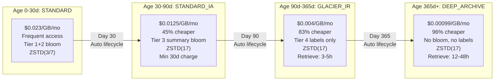
```mermaid
flowchart LR
    subgraph "Age 0-30d: STANDARD"
        S1["$0.023/GB/mo\nFrequent access\nTier 1+2 bloom\nZSTD(3/7)"]
    end

    subgraph "Age 30-90d: STANDARD_IA"
        S2["$0.0125/GB/mo\n45% cheaper\nTier 3 summary bloom\nZSTD(17)\nMin 30d charge"]
    end

    subgraph "Age 90d-365d: GLACIER_IR"
        S3["$0.004/GB/mo\n83% cheaper\nTier 4 labels only\nZSTD(17)\nRetrieve: 3-5h"]
    end

    subgraph "Age 365d+: DEEP_ARCHIVE"
        S4["$0.00099/GB/mo\n96% cheaper\nNo bloom, no labels\nZSTD(17)\nRetrieve: 12-48h"]
    end

    S1 -->|"Day 30\nAuto lifecycle"| S2
    S2 -->|"Day 90\nAuto lifecycle"| S3
    S3 -->|"Day 365\nAuto lifecycle"| S4
```

### Cost at Long Retention

| Retention | Storage (100TB/d) | Storage class | Monthly cost | vs 30d only |
|-----------|-------------------|--------------|-------------|-------------|
| 30 days | 3 PB | STANDARD | $69,000 | baseline |
| 90 days | 9 PB | Mixed | $119,250 | +73% |
| 180 days | 18 PB | Mostly IA | $168,750 | +145% |
| 365 days | 36.5 PB | Mostly GLACIER_IR | $221,325 | +221% |
| 3 years | 109.5 PB | Mostly DEEP_ARCHIVE | $340,868 | +394% |

**Key insight:** GLACIER_IR and DEEP_ARCHIVE make multi-year retention affordable. 365 days costs only 3.2x more than 30 days, not 12x, because lifecycle rules move 90%+ of data to cheap tiers.

### Bloom Metadata at Long Retention

Bloom metadata cost is negligible at any retention length because:

1. **Tier 3 (summary bloom)** is ~9 KB per partition — 365 days × 24 partitions/day × 1000 tenants × 9 KB = **75 GB total** ($1.73/month on S3)
2. **Labels** are ~5 KB per partition — same scale = **42 GB total** ($0.97/month)
3. **Bloom tiers 1+2 only cover 30 days** regardless of retention — fixed cost

| Retention | Bloom cost/month | Label cost/month | Total metadata cost | % of parquet storage |
|-----------|-----------------|-----------------|--------------------|--------------------|
| 30 days | $505 | $17 | $522 | 0.76% |
| 90 days | $507 | $51 | $558 | 0.47% |
| 365 days | $513 | $207 | $720 | 0.33% |
| 3 years | $527 | $621 | $1,148 | 0.34% |

Metadata stays under 1% of storage at any retention. **Extending tier 3 to match retention is essentially free.**

### Bloom Tier Defaults for Long Retention

The auto-tuner derives tier 3 boundary from the retention period:

```go
func (bc *BloomController) deriveDefaultTier3(retentionPeriod time.Duration) time.Duration {
    // Tier 3 (summary bloom) defaults to retention period
    // because it's nearly free (~9 KB per partition)
    if retentionPeriod > 0 {
        return retentionPeriod
    }
    return 90 * 24 * time.Hour // fallback: 90 days
}
```

This means: **if you set retention to 365 days, summary bloom automatically covers all 365 days.** No separate bloom tier configuration needed. Cold data queries at any age within retention get 500-800ms point lookups instead of multi-second scans.

### SOC2 Compliance Requirements

SOC2 Type II audits require demonstrable controls over data storage and access. Lakehouse addresses each requirement:

#### 1. Data Retention Proof

**Requirement**: Prove that data is retained for the required period and not deleted prematurely.

**Implementation**:
- S3 Object Lock (Governance or Compliance mode) prevents deletion during retention period
- Retention period configured per-tenant via `RetentionConfig.Rules`
- Manifest tracks all files with creation timestamps — auditable chain
- Metric: `lakehouse_storage_oldest_data_seconds` proves oldest data age
- Metric: `lakehouse_retention_files_deleted_total` tracks all deletions

```yaml
retention:
  enabled: true
  default: "365d"
  rules:
    - match: { "tenant": "finance-team" }
      keep: "7y"        # 7-year retention for financial data
    - match: { "tenant": "dev" }
      keep: "30d"        # short retention for dev

s3:
  # S3 Object Lock — prevents accidental or malicious deletion
  object_lock_mode: "GOVERNANCE"    # "GOVERNANCE" or "COMPLIANCE"
  object_lock_retain_days: 365      # minimum retention enforced by S3
```

#### 2. Data Immutability

**Requirement**: Once written, data cannot be modified or tampered with.

**Implementation**:
- Parquet files are write-once — never modified after upload to S3
- S3 versioning enabled — all changes tracked, old versions recoverable
- Compaction creates NEW files and deletes old ones — never modifies in place
- Bloom indices are write-once per partition — rebuilt means new file, old one kept until lifecycle
- S3 Object Lock prevents deletion during retention window

```
Data lifecycle (immutable):
  Insert → Write parquet → S3 PUT (immutable) → never modified
  Compaction → Read old files + Write new merged file → Delete old (only after retention)
  Delete API → Write tombstone → Rewrite excluding deleted rows → New file (old kept in versions)
```

#### 3. Access Controls and Audit Trail

**Requirement**: Track who accessed what data and when.

**Implementation**:
- S3 Server Access Logging — every GET/PUT/DELETE logged with requester identity
- CloudTrail integration — API-level audit trail for all S3 operations
- Per-tenant isolation — each tenant's data in separate S3 prefix
- Lakehouse metrics track per-tenant queries: `lakehouse_tenant_queries_total{tenant="X"}`
- Per-tenant query stats available via `/api/v1/bloom/tenant/{id}/stats`

#### 4. Encryption

**Requirement**: Data encrypted at rest and in transit.

**Implementation**:
- S3 SSE-S3 or SSE-KMS encryption for data at rest (default in AWS)
- TLS for all S3 API calls (enforced by AWS SDK)
- TLS for peer cache communication (configurable)
- No sensitive data stored in bloom indices (bloom is a probabilistic structure — cannot be reversed to extract original values)

#### 5. Availability and Disaster Recovery

**Requirement**: Data remains accessible and recoverable.

**Implementation**:
- S3 11-nines durability (99.999999999%) — data survives any infrastructure failure
- Cross-region replication (optional) for geo-redundancy
- Bloom indices are reconstructable from parquet files — no single-point-of-failure for metadata
- Stateless select nodes — any node can serve any query from S3
- Manifest is persisted to S3 — reconstructable on any new node

### SOC2 Compliance Checklist for Lakehouse

| SOC2 Control | Lakehouse Feature | Status |
|-------------|-------------------|--------|
| CC6.1 Logical access | Per-tenant S3 prefix isolation + IAM policies | Existing |
| CC6.3 Data encryption | S3 SSE (at rest) + TLS (in transit) | Existing |
| CC6.5 Data retention | Configurable per-tenant retention rules | Existing |
| CC6.6 Data deletion | Retention enforcer + S3 lifecycle rules | Existing |
| CC6.7 Audit trail | S3 access logs + CloudTrail + per-tenant metrics | Existing |
| CC7.2 Change management | Parquet write-once + S3 versioning + Object Lock | Existing |
| CC8.1 Backup/recovery | S3 11-nines + cross-region replication (optional) | Existing |
| A1.2 Availability | Stateless select nodes + S3 source of truth | Existing |

### Long Retention Configuration in Helm Chart

```yaml
lakehouseConfig:
  retention:
    enabled: true
    # -- Default retention period for all tenants.
    # SOC2 common values: 90d, 180d, 365d, 3y, 7y
    default: "365d"

    # -- Per-tenant retention overrides.
    rules:
      - match: { "tenant": "compliance-team" }
        keep: "7y"
      - match: { "tenant": "staging" }
        keep: "30d"

    # -- Per-tenant retention overrides.
    rules:
      - match: { "tenant": "compliance-team" }
        keep: "7y"
      - match: { "tenant": "staging" }
        keep: "30d"

  # -- Storage tiers control S3 class for data and metadata independently.
  # Omit to use defaults (STANDARD → STANDARD_IA → GLACIER_IR → DEEP_ARCHIVE).
  # See "Per-Tier Data and Metadata Storage Control" for full reference.
  storage:
    tiers: {}                          # all defaults when empty
    # tiers:
    #   hot:
    #     max_age: "7d"
    #     data: { s3_storage_class: "STANDARD" }
    #     metadata: { s3_storage_class: "STANDARD" }
    #   warm:
    #     max_age: "30d"
    #     data: { s3_storage_class: "STANDARD_IA" }
    #     metadata: { s3_storage_class: "STANDARD" }
    #   cold:
    #     max_age: ""                  # derived from retention.default
    #     data: { s3_storage_class: "GLACIER_IR" }
    #     metadata: { s3_storage_class: "STANDARD" }
    #   archive:
    #     data: { s3_storage_class: "DEEP_ARCHIVE" }
    #     metadata: { s3_storage_class: "STANDARD_IA" }

  s3:
    # -- Enable S3 Object Lock for SOC2 compliance.
    # GOVERNANCE: admin can override. COMPLIANCE: nobody can delete.
    object_lock_mode: ""               # "", "GOVERNANCE", or "COMPLIANCE"
    object_lock_retain_days: 0         # 0 = disabled. Match retention period.
    versioning: true                   # S3 versioning for change tracking
    lifecycle_sync: false              # auto-create S3 lifecycle rules from tier config

  bloom:
    enabled: true
    ssd_path: "/data/bloom-cache"
    # Bloom tier 3 automatically extends to retention period.
    # With 365d retention, summary bloom covers all 365 days for ~$2/month.
    # No additional configuration needed.
```

### Long Retention Cost Projection

For a SOC2-compliant 365-day deployment at various scales:

| Component | 10 TB/d | 100 TB/d | 500 TB/d |
|-----------|---------|----------|----------|
| Parquet storage (365d, mixed classes) | $22,133/mo | $221,325/mo | $1,106,625/mo |
| Bloom metadata (365d, all tiers) | $72/mo | $720/mo | $3,600/mo |
| Recompression savings | -$800/mo | -$8,000/mo | -$40,000/mo |
| Select nodes (compute) | $2,400/mo | $14,400/mo | $36,000/mo |
| Insert nodes (compute) | $600/mo | $7,200/mo | $18,000/mo |
| **Total** | **$24,405/mo** | **$235,645/mo** | **$1,124,225/mo** |
| **Cost per GB ingested** | **$0.079/GB** | **$0.077/GB** | **$0.073/GB** |

**Bloom metadata is <0.5% of total cost at any retention length.** The savings from TTL recompression ($8K-40K/month) more than pay for the bloom infrastructure.

## Distributed Configuration Management

### Problem

Lakehouse runs as a fleet of pods (insert + select). Configuration comes from three sources that must stay consistent:

1. **Helm chart** → K8s ConfigMap (base config, deployed by GitOps/CD)
2. **Auto-tuner** → runtime adjustments (tier boundaries, cache sizes, bloom params)
3. **UI/API** → operator overrides (storage classes, retention rules, tier changes)

Without coordination, each pod may have different config — auto-tuner on pod A adjusts tier boundaries differently than pod B, UI changes hit one pod but not others, pod restarts lose runtime state.

### Design: Layered Config with S3 as Live Source of Truth

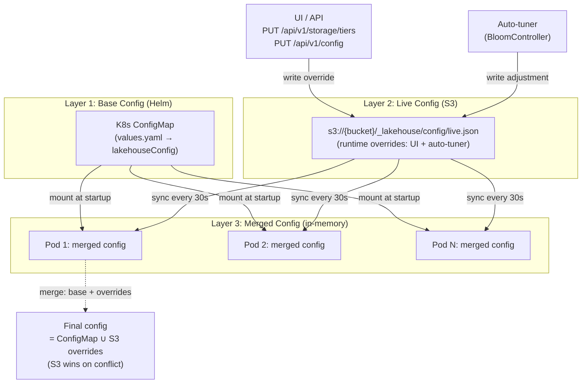
```mermaid
flowchart TD
    subgraph "Layer 1: Base Config (Helm)"
        CM["K8s ConfigMap\n(values.yaml → lakehouseConfig)"]
    end

    subgraph "Layer 2: Live Config (S3)"
        S3C["s3://{bucket}/_lakehouse/config/live.json\n(runtime overrides: UI + auto-tuner)"]
    end

    subgraph "Layer 3: Merged Config (in-memory)"
        P1["Pod 1: merged config"]
        P2["Pod 2: merged config"]
        P3["Pod N: merged config"]
    end

    CM -->|"mount at startup"| P1
    CM -->|"mount at startup"| P2
    CM -->|"mount at startup"| P3

    S3C -->|"sync every 30s"| P1
    S3C -->|"sync every 30s"| P2
    S3C -->|"sync every 30s"| P3

    UI["UI / API\nPUT /api/v1/storage/tiers\nPUT /api/v1/config"] -->|"write override"| S3C
    AT["Auto-tuner\n(BloomController)"] -->|"write adjustment"| S3C

    P1 -.->|"merge: base + overrides"| MERGED["Final config\n= ConfigMap ∪ S3 overrides\n(S3 wins on conflict)"]
```

### Config Layers and Precedence

```
Priority (highest wins):
  1. S3 live config  — UI/API overrides + auto-tuner adjustments
  2. ConfigMap        — Helm chart base values
  3. Defaults         — built-in defaults in code

Merge rule: deep merge, S3 fields override ConfigMap fields at leaf level.
```

**Example merge:**

```yaml
# ConfigMap (from Helm):
storage:
  tiers:
    hot:
      max_age: "7d"
      data:
        s3_storage_class: "STANDARD"

# S3 live config (from UI override):
{
  "storage": {
    "tiers": {
      "hot": {
        "max_age": "14d"
      }
    }
  }
}

# Merged result (what pod uses):
storage:
  tiers:
    hot:
      max_age: "14d"              # ← from S3 (UI override)
      data:
        s3_storage_class: "STANDARD"  # ← from ConfigMap (not overridden)
```

### S3 Live Config Structure

All runtime config lives under a well-known S3 prefix:

```
s3://{bucket}/_lakehouse/config/
├── live.json                    # current merged runtime overrides
├── live.json.sha256             # integrity check
├── history/
│   ├── 2026-05-17T10:00:00Z.json   # versioned snapshot
│   ├── 2026-05-17T09:30:00Z.json   # previous version
│   └── ...                          # kept for 30 days
└── leader.json                  # auto-tuner leader election
```

**`live.json` format:**

```json
{
  "version": 42,
  "updated_at": "2026-05-17T10:00:00Z",
  "updated_by": "ui:admin@example.com",
  "source": "api",
  "overrides": {
    "storage": {
      "tiers": {
        "hot": {"max_age": "14d"},
        "cold": {
          "data": {"s3_storage_class": "STANDARD_IA"}
        }
      }
    },
    "bloom": {
      "overrides": {
        "tier1_max_age": "14d"
      }
    }
  },
  "auto_tuned": {
    "bloom": {
      "tier1_max_age": "7d",
      "tier2_max_age": "28d",
      "ssd_cache_max_bytes": 268435456000,
      "memory_cache_max_bytes": 2147483648,
      "target_file_size": 536870912
    },
    "updated_at": "2026-05-17T09:58:00Z",
    "updated_by": "bloom-controller:select-pod-3"
  }
}
```

**Key design decisions:**

- `overrides` — explicit operator/UI changes. These **always win** over auto-tuner.
- `auto_tuned` — BloomController adjustments. These **lose** to operator overrides but **win** over ConfigMap defaults.
- `version` — monotonic counter, incremented on every write. Pods reject stale versions.
- `updated_by` — audit trail: who changed what and when.
- History snapshots kept for 30 days for compliance audit trail.

### Config Sync Protocol

Every pod runs a config sync loop:

```go
type ConfigSync struct {
    s3Client     s3.Client
    configPath   string            // s3://{bucket}/_lakehouse/config/live.json
    baseConfig   *Config           // from ConfigMap (immutable at runtime)
    liveConfig   atomic.Pointer[LiveConfig]  // from S3 (refreshed periodically)
    mergedConfig atomic.Pointer[Config]      // base + live merged
    version      atomic.Int64      // last seen S3 version
    onChange     []func(*Config)   // callbacks for config-dependent components
}

func (cs *ConfigSync) Run(ctx context.Context) {
    ticker := time.NewTicker(30 * time.Second)
    defer ticker.Stop()

    for {
        select {
        case <-ctx.Done():
            return
        case <-ticker.C:
            cs.syncFromS3(ctx)
        }
    }
}

func (cs *ConfigSync) syncFromS3(ctx context.Context) {
    live, err := cs.fetchLiveConfig(ctx)
    if err != nil {
        configSyncErrors.Inc()
        return
    }

    if live.Version <= cs.version.Load() {
        return // no change
    }

    merged := cs.merge(cs.baseConfig, live)
    cs.liveConfig.Store(live)
    cs.mergedConfig.Store(merged)
    cs.version.Store(live.Version)

    // Notify all components of config change
    for _, fn := range cs.onChange {
        fn(merged)
    }

    configSyncVersion.Set(float64(live.Version))
    configSyncLastSuccess.SetToCurrentTime()
}
```

**Sync characteristics:**
- **Poll interval**: 30 seconds (cheap — single S3 GET, ~200 bytes with SHA256 check)
- **Consistency**: eventual (max 30s propagation across fleet)
- **Availability**: if S3 unreachable, pods keep last known config (stale but functional)
- **Startup**: pod reads ConfigMap + S3 live config before accepting traffic
- **Cost**: ~2,600 GETs/day per pod ($0.001/day) — negligible

### Writing Config Changes

#### From UI/API

When an operator changes config via UI or API:

```go
func (cs *ConfigSync) ApplyOverride(ctx context.Context, path string, value any, actor string) error {
    // 1. Read current live config from S3
    current, err := cs.fetchLiveConfig(ctx)
    if err != nil {
        return err
    }

    // 2. Apply the override
    updated := current.Clone()
    updated.SetOverride(path, value)
    updated.Version++
    updated.UpdatedAt = time.Now()
    updated.UpdatedBy = actor
    updated.Source = "api"

    // 3. Write back with conditional PUT (optimistic locking via S3 ETag)
    err = cs.putLiveConfig(ctx, updated, current.ETag)
    if errors.Is(err, errConflict) {
        // Another pod wrote concurrently — retry with fresh read
        return cs.ApplyOverride(ctx, path, value, actor)
    }

    // 4. Save history snapshot
    cs.saveHistorySnapshot(ctx, updated)

    // 5. Update local immediately (don't wait for sync cycle)
    cs.liveConfig.Store(updated)
    merged := cs.merge(cs.baseConfig, updated)
    cs.mergedConfig.Store(merged)
    cs.version.Store(updated.Version)

    for _, fn := range cs.onChange {
        fn(merged)
    }

    return err
}
```

**Concurrency safety:** Uses S3 conditional writes (ETag-based optimistic locking). If two pods or two UI users write simultaneously, one gets a conflict and retries with the latest version.

#### From Auto-Tuner

The auto-tuner writes to the `auto_tuned` section only, never to `overrides`:

```go
func (bc *BloomController) persistTuning(ctx context.Context) {
    // Only the leader pod writes auto-tuner config
    if !bc.isLeader() {
        return
    }

    tuned := &AutoTunedConfig{
        Tier1MaxAge:       bc.tier1MaxAge,
        Tier2MaxAge:       bc.tier2MaxAge,
        SSDCacheMaxBytes:  bc.ssdCacheMax,
        MemCacheMaxBytes:  bc.memCacheMax,
        TargetFileSize:    bc.targetFileSize,
        UpdatedAt:         time.Now(),
        UpdatedBy:         fmt.Sprintf("bloom-controller:%s", bc.podName),
    }

    cs.UpdateAutoTuned(ctx, tuned)
}
```

**Leader election for auto-tuner:** Only one pod writes auto-tuner adjustments to avoid conflicts. Leader is elected via S3-based lease (`leader.json` with TTL):

```go
type LeaderLease struct {
    PodName   string    `json:"pod_name"`
    ExpiresAt time.Time `json:"expires_at"`
}

func (bc *BloomController) tryAcquireLease(ctx context.Context) bool {
    lease, err := readLease(ctx, cs.s3Client, cs.configPath+"/leader.json")
    if err == nil && lease.ExpiresAt.After(time.Now()) && lease.PodName != bc.podName {
        return false // another pod holds the lease
    }

    newLease := &LeaderLease{
        PodName:   bc.podName,
        ExpiresAt: time.Now().Add(5 * time.Minute),
    }
    return writeLease(ctx, cs.s3Client, cs.configPath+"/leader.json", newLease, lease.ETag) == nil
}
```

### Config Restore and Recovery

#### Pod Startup Sequence

```
1. Read ConfigMap (mounted as volume)            → base config
2. Read S3 live.json                              → runtime overrides
   └── If S3 unreachable: start with base config only, retry in background
3. Merge: base + auto_tuned + overrides           → effective config
4. Validate merged config (constraints, S3 class compat)
5. Register config change callbacks (bloom controller, storage tiers, etc.)
6. Start accepting traffic
```

**No state loss on restart:** All runtime config is in S3. Pod restart = read ConfigMap + S3 → identical state as before.

**No state loss on scale-out:** New pod joins fleet → reads same ConfigMap + same S3 live config → identical config to all other pods.

#### Disaster Recovery

If S3 config is lost or corrupted:

```
Scenario 1: live.json deleted
→ Pods keep last known config in memory
→ Next sync cycle: no live.json found → fall back to base config only
→ Auto-tuner recreates auto_tuned section within 60s
→ Operator overrides lost — must re-apply via UI/API

Scenario 2: live.json corrupted
→ SHA256 check fails → pods keep last known config
→ Alert: lakehouse_config_sync_errors_total
→ Operator: restore from history/ (automatic S3 versioning + 30d history snapshots)

Scenario 3: S3 bucket destroyed
→ Pods keep in-memory config indefinitely
→ ConfigMap still has base config
→ Recreate bucket → auto-tuner regenerates config
→ Apply operator overrides from Git (if stored) or audit log
```

**Recovery command:**

```bash
# List config history
lakehouse-logs --config-history

# Restore specific version
lakehouse-logs --config-restore --version 41

# Export current effective config (for backup)
lakehouse-logs --config-export > config-backup.json

# Import config (e.g., migrate to new cluster)
lakehouse-logs --config-import config-backup.json
```

### Helm Chart Integration

The ConfigMap from Helm is the base layer. S3 overrides layer on top.

```yaml
# values.yaml — base config (Layer 1)
lakehouseConfig:
  storage:
    tiers: {}                    # defaults — can be overridden via UI
  bloom:
    enabled: true
    ssd_path: "/data/bloom-cache"
  retention:
    default: "365d"

  # Config sync settings
  config:
    # S3 path for live config (runtime overrides)
    s3_path: "_lakehouse/config"
    # Sync interval — how often pods check S3 for config changes
    sync_interval: "30s"
    # Enable config history (snapshots in S3 for audit/restore)
    history_enabled: true
    # How long to keep config history snapshots
    history_retention: "30d"
```

**ConfigMap template:**

```yaml
# templates/configmap.yaml
apiVersion: v1
kind: ConfigMap
metadata:
  name: {{ include "victoria-lakehouse.fullname" . }}-config
data:
  config.yaml: |
    {{- toYaml .Values.lakehouseConfig | nindent 4 }}
```

**Deployment mount:**

```yaml
# templates/deployment.yaml (insert + select pods)
spec:
  containers:
    - name: lakehouse
      volumeMounts:
        - name: config
          mountPath: /etc/lakehouse
          readOnly: true
  volumes:
    - name: config
      configMap:
        name: {{ include "victoria-lakehouse.fullname" . }}-config
```

**What lives where:**

| Setting | ConfigMap (Helm) | S3 live config | Why |
|---------|-----------------|---------------|-----|
| `bloom.enabled` | Yes | No | Infrastructure — requires pod restart |
| `bloom.ssd_path` | Yes | No | Mount point — requires pod restart |
| `storage.tiers.*.max_age` | Default | Override | Runtime-adjustable, no restart needed |
| `storage.tiers.*.data.s3_storage_class` | Default | Override | Runtime-adjustable, affects lifecycle rules |
| `storage.tiers.*.metadata.s3_storage_class` | Default | Override | Runtime-adjustable |
| `retention.default` | Yes | Override | Can be tightened at runtime, not loosened past Object Lock |
| `retention.rules` | Base rules | Additional rules | UI can add tenant rules without Helm redeploy |
| `bloom.tier1_max_age` | Default | Auto-tuned | BloomController adjusts based on traffic |
| `bloom.overrides.*` | Pinned values | No | Operator pins — not auto-tuned |
| `config.sync_interval` | Yes | No | Infrastructure setting |

**Rule of thumb:**
- **ConfigMap** for settings that require pod restart or are infrastructure-level
- **S3 live config** for settings that can be changed at runtime without restart
- **Auto-tuner** adjusts operational parameters within S3 live config

### UI: Live Config Panel

```
┌─ Live Configuration ────────────────────────────────────────────────────┐
│                                                                          │
│  Config source: ConfigMap (Helm) + S3 overrides (v42)                   │
│  Last S3 sync: 12s ago   Fleet pods in sync: 5/5 ✅                    │
│                                                                          │
│  ┌─ Effective Config (merged) ───────────────────────────────────────┐  │
│  │                                                                    │  │
│  │  Setting                     │ Value   │ Source       │ Actions    │  │
│  │  ────────────────────────────┼─────────┼──────────────┼────────── │  │
│  │  storage.tiers.hot.max_age   │ 14d     │ UI override  │ [Reset]   │  │
│  │  storage.tiers.warm.max_age  │ 30d     │ ConfigMap    │ [Override]│  │
│  │  storage.tiers.cold.data.s3  │ STD_IA  │ UI override  │ [Reset]   │  │
│  │  bloom.tier1_max_age         │ 7d      │ Auto-tuned   │ [Pin]     │  │
│  │  bloom.tier2_max_age         │ 28d     │ Auto-tuned   │ [Pin]     │  │
│  │  bloom.ssd_cache_max_bytes   │ 250 GB  │ Auto-tuned   │ [Pin]     │  │
│  │  retention.default           │ 365d    │ ConfigMap    │ [Override]│  │
│  │                                                                    │  │
│  │  [Show all settings]  [Show overrides only]  [Show auto-tuned]    │  │
│  └────────────────────────────────────────────────────────────────────┘  │
│                                                                          │
│  ┌─ Config History ──────────────────────────────────────────────────┐  │
│  │                                                                    │  │
│  │  v42  2026-05-17 10:00  admin@example.com    UI: cold→STANDARD_IA│  │
│  │  v41  2026-05-17 09:58  bloom-controller:p3  Auto: tier2=28d     │  │
│  │  v40  2026-05-16 14:30  admin@example.com    UI: hot.max_age=14d │  │
│  │  v39  2026-05-16 14:00  bloom-controller:p1  Auto: cache=250GB   │  │
│  │  v38  2026-05-15 09:00  helm-deploy          ConfigMap update     │  │
│  │                                                                    │  │
│  │  [View diff v41→v42]  [Restore v41]  [Export current]             │  │
│  └────────────────────────────────────────────────────────────────────┘  │
│                                                                          │
│  ┌─ Fleet Sync Status ──────────────────────────────────────────────┐  │
│  │                                                                    │  │
│  │  Pod                │ Config version │ Last sync  │ Status         │  │
│  │  ───────────────────┼────────────────┼────────────┼─────────────── │  │
│  │  select-0           │ v42            │ 12s ago    │ ✅ in sync    │  │
│  │  select-1           │ v42            │ 8s ago     │ ✅ in sync    │  │
│  │  select-2           │ v42            │ 22s ago    │ ✅ in sync    │  │
│  │  insert-0           │ v42            │ 5s ago     │ ✅ in sync    │  │
│  │  insert-1           │ v42            │ 18s ago    │ ✅ in sync    │  │
│  │                                                                    │  │
│  └────────────────────────────────────────────────────────────────────┘  │
└──────────────────────────────────────────────────────────────────────────┘
```

### Config API Endpoints

**`GET /api/v1/config`** — Current effective (merged) config

```json
{
  "effective": { "...merged config..." },
  "sources": {
    "storage.tiers.hot.max_age": {"value": "14d", "source": "s3_override", "changed_by": "admin@example.com", "changed_at": "2026-05-16T14:30:00Z"},
    "bloom.tier2_max_age": {"value": "28d", "source": "auto_tuned", "changed_by": "bloom-controller:select-pod-3", "changed_at": "2026-05-17T09:58:00Z"},
    "retention.default": {"value": "365d", "source": "configmap"}
  },
  "version": 42,
  "fleet_sync": {
    "total_pods": 5,
    "synced_pods": 5,
    "oldest_version_in_fleet": 42
  }
}
```

**`PUT /api/v1/config`** — Apply runtime override

```json
{
  "overrides": {
    "storage.tiers.cold.data.s3_storage_class": "STANDARD_IA"
  }
}
```

**`DELETE /api/v1/config/overrides/{path}`** — Remove an override (revert to ConfigMap/default)

```
DELETE /api/v1/config/overrides/storage.tiers.hot.max_age
→ hot.max_age reverts from "14d" (UI override) to "7d" (ConfigMap default)
```

**`GET /api/v1/config/history`** — Config change history

```json
{
  "history": [
    {"version": 42, "changed_at": "2026-05-17T10:00:00Z", "changed_by": "admin@example.com", "source": "api", "changes": ["storage.tiers.cold.data.s3_storage_class: GLACIER_IR → STANDARD_IA"]},
    {"version": 41, "changed_at": "2026-05-17T09:58:00Z", "changed_by": "bloom-controller:select-pod-3", "source": "auto_tuner", "changes": ["bloom.tier2_max_age: 30d → 28d"]}
  ]
}
```

**`POST /api/v1/config/restore`** — Restore a previous config version

```json
{"version": 41}
```

**`GET /api/v1/config/fleet`** — Fleet sync status

```json
{
  "pods": [
    {"name": "select-0", "version": 42, "last_sync": "2026-05-17T10:00:12Z", "status": "synced"},
    {"name": "select-1", "version": 42, "last_sync": "2026-05-17T10:00:08Z", "status": "synced"}
  ]
}
```

### Config Sync Metrics

```
# Config version currently applied
lakehouse_config_version{pod="select-0"}

# Sync status
lakehouse_config_sync_last_success_timestamp_seconds
lakehouse_config_sync_errors_total
lakehouse_config_sync_latency_seconds

# Fleet consistency
lakehouse_config_fleet_synced_pods
lakehouse_config_fleet_total_pods
lakehouse_config_fleet_oldest_version

# Override counts
lakehouse_config_overrides_total{source="ui"}
lakehouse_config_overrides_total{source="auto_tuner"}

# History
lakehouse_config_history_snapshots_total
```

### Guarantees

| Property | Guarantee |
|----------|-----------|
| **Durability** | S3 11-nines. Config survives any pod/node/AZ failure. |
| **Consistency** | Eventual (max 30s). All pods converge to same version. |
| **Availability** | Pods keep last known config if S3 unreachable. |
| **Ordering** | Monotonic version counter. Pods never apply older version. |
| **Concurrency** | ETag-based optimistic locking. No lost updates. |
| **Audit** | Every change recorded with actor, timestamp, diff. 30d history. |
| **Recovery** | Restore any version from history. Export/import for migration. |
| **K8s native** | Base config via ConfigMap. Helm upgrade = new ConfigMap = new base. |
| **No restart needed** | Runtime settings applied via S3 sync. Only infrastructure settings need restart. |

## Risks & Mitigations

| Risk | Severity | Mitigation |
|------|----------|------------|
| S3 bloom sidecar doubles PUT requests during insert | Medium | Bloom is built lazily on first query, not on insert. Zero extra writes during ingest. |
| Bloom FPR (1%) causes unnecessary file reads | Low | 1% FPR means 1 in 100 files is a false positive — still 99% reduction. Per-RG bloom reduces this further to per-row-group level. |
| SSD cache fills up at high scale (100TB+/d) | High | Auto-tuner adjusts tier boundaries to fit available SSD. S3-only mode works at any scale with ~80ms p99. NVMe instances (i3en/i4i) for 100TB+. |
| Bloom index corruption (bad write, S3 error) | Medium | Bloom is reconstructable from parquet files. `--rebuild-bloom` CLI. Corrupt bloom detected by SHA256 checksum → auto-rebuild on next query. |
| S3 live config conflict (concurrent UI writes) | Low | ETag-based optimistic locking with automatic retry. No lost updates. |
| S3 live config unavailable (S3 outage) | Low | Pods keep last known config in memory. Stale but functional. Auto-tuner pauses. Alert fires. |
| Auto-tuner oscillation (flip-flopping tier boundaries) | Medium | Damping: changes require 3 consecutive observation cycles (3 minutes) before applying. Minimum change threshold (10%). |
| GLACIER_IR restore latency for cold data queries | Medium | Bloom metadata stays in STANDARD — point lookups are fast. Only full data retrieval needs restore. Cost projection UI warns operators before choosing GLACIER. |
| TTL recompression CPU cost during compaction | Low | Recompression runs during normal compaction cycle with rate limiting. ZSTD(17) is ~3x slower than ZSTD(3) but runs on already-cold data with low priority. |
| Config drift between ConfigMap and S3 overrides | Medium | UI shows source of each setting (ConfigMap vs S3 override). `config-export` command for backup. Helm upgrade merges with existing S3 overrides (S3 wins on conflict). |
| Per-tenant manifest sharding memory at 10K+ tenants | Medium | LRU eviction keeps only active tenants in memory. Cold tenant manifests loaded on demand from S3 (~50ms). |
| Migration from monolithic bloom to partitioned | Low | Backward-compatible: legacy `_bloom_index.bin` still read if partitioned not available. Migration is lazy — partitioned bloom built on first query per partition. |
| S3 lifecycle rule misconfiguration (data inaccessible) | High | Validation at startup rejects GLACIER/DEEP_ARCHIVE for metadata. `--s3-lifecycle-sync --dry-run` previews rules before applying. GLACIER_IR has millisecond retrieval — not a cold archive. |
| SOC2 audit: proving data retention compliance | Medium | `lakehouse_storage_oldest_data_seconds` metric. Config history in S3 (30d). S3 Object Lock prevents deletion. CloudTrail logs all S3 operations. |

## Testing Strategy

### Principles

1. **TDD from the start** — tests written BEFORE implementation for every component
2. **Spec as oracle** — every numeric claim, invariant, and constraint in this spec has a corresponding test
3. **Bloom is never correctness** — the fundamental safety property: queries without bloom MUST return identical results to queries with bloom
4. **Signal parity** — every test runs for BOTH traces AND logs unless explicitly single-signal
5. **Regression gates** — no PR merges without passing the full regression suite
6. **Existing patterns** — standard Go `testing` package, no external frameworks, follows established codebase conventions

### Test Categories & File Layout

```
internal/bloomindex/
├── bloomindex.go
├── bloomindex_test.go              ← existing (295 lines, 11 tests) — EXPAND
├── bloom_tiering_test.go           ← NEW: tier transitions, downgrade logic
├── bloom_property_test.go          ← NEW: property-based invariant tests
├── bloom_bench_test.go             ← NEW: latency benchmarks per tier
├── bloom_edge_test.go              ← NEW: edge cases, corruption, empty partitions
├── bloom_race_test.go              ← NEW: concurrent access patterns
├── bloom_memleak_test.go           ← NEW: long-running memory stability
├── bloom_fuzz_test.go              ← NEW: fuzz marshal/unmarshal, corrupt input

internal/storage/parquets3/
├── bloom_integration_test.go       ← NEW: bloom + storage + S3 integration
├── prewhere_test.go                ← NEW: PREWHERE 2-phase read tests
├── tier_transition_test.go         ← NEW: tier transitions with real parquet files

internal/config/
├── config_sync_test.go             ← NEW: S3 live config, merge, precedence
├── config_sync_race_test.go        ← NEW: concurrent config writes

internal/compaction/
├── bloom_compaction_test.go        ← NEW: bloom rebuild during compaction

tests/e2e/
├── bloom_smoke_test.go             ← NEW: basic bloom acceleration E2E
├── bloom_tiering_test.go           ← NEW: full tier lifecycle E2E
├── bloom_regression_test.go        ← NEW: regression suite (spec assertions)
├── storage_tiers_test.go           ← NEW: per-tier S3 class E2E
├── config_sync_test.go             ← NEW: fleet config sync E2E
├── bloom_api_test.go               ← NEW: all bloom API endpoints E2E

lakehouse-traces/
├── internal/bloomindex/             ← mirror of logs tests (signal parity)
│   ├── bloom_tiering_test.go
│   └── bloom_integration_test.go
```

### 1. Unit Tests

#### 1.1 Bloom Core (internal/bloomindex/)

```go
// bloom_tiering_test.go — tier transition logic

func TestTierForAge_Hot(t *testing.T) {
    // Age < 7d → Tier 1 (per-RG bloom)
}

func TestTierForAge_Warm(t *testing.T) {
    // Age 7-30d → Tier 2 (per-file bloom)
}

func TestTierForAge_Cold(t *testing.T) {
    // Age 30-90d → Tier 3 (summary bloom)
}

func TestTierForAge_Archive(t *testing.T) {
    // Age >90d → Tier 4 (no bloom)
}

func TestTierForAge_CustomBoundaries(t *testing.T) {
    // Operator-pinned tier1=14d, tier2=60d, tier3=365d
}

func TestDowngradeToPerFile(t *testing.T) {
    // Per-RG entries merged via MergeFrom into per-file entries
    // 3600 RG entries → 360 file entries
    // Verify size reduction ~10x
}

func TestDowngradeToSummary(t *testing.T) {
    // 360 per-file entries merged into 1 summary entry per partition
    // Verify summary size ≤ 9KB
}

func TestDowngradeIsOneWay(t *testing.T) {
    // Tier transitions never go backward (RG → file → summary → none)
}

func TestPerRGKeyFormat(t *testing.T) {
    // Key = "{fileKey}#{rowGroupIndex}" for Tier 1
    // Key = "{fileKey}" for Tier 2
    // Key = "summary" for Tier 3
}

func TestBloomSizeByTier(t *testing.T) {
    // Tier 1 (3600 entries): ~500KB per partition
    // Tier 2 (360 entries): ~50KB per partition
    // Tier 3 (1 entry): ~9KB per partition
}
```

```go
// bloom_property_test.go — invariant verification

func TestProperty_BloomNeverMissesInsertedValue(t *testing.T) {
    // Insert N random values, check each → ALL must return true
    // Repeat 1000 times with different seeds
}

func TestProperty_BloomFPRWithinBounds(t *testing.T) {
    // Insert N values, check M non-inserted values
    // False positive rate must be ≤ 1% (target FPR)
    // Test at cardinalities: 10, 100, 1000, 10000, 50000
}

func TestProperty_MergePreservesAllPositives(t *testing.T) {
    // Filter A has values {1,2,3}, Filter B has values {4,5,6}
    // MergeFrom(A, B) → merged filter must contain all 6 values
}

func TestProperty_MergeNeverReducesFPR(t *testing.T) {
    // Merged filter FPR ≤ sum of individual FPRs
    // (merging increases FP rate but never misses true positives)
}

func TestProperty_QueryWithBloomEqualsQueryWithout(t *testing.T) {
    // For any dataset D and query Q:
    //   results(Q, bloom=on) == results(Q, bloom=off)
    // This is the fundamental safety property
}

func TestProperty_TierTransitionsAreMonotone(t *testing.T) {
    // For any partition, as age increases, tier only increases
    // Tier 1 → 2 → 3 → 4, never backward
}

func TestProperty_LabelRollupIsSupersetOfHourly(t *testing.T) {
    // daily_labels ⊇ union(hourly_labels) for all columns
}

func TestProperty_ConfigMergePreservesUnoverriddenFields(t *testing.T) {
    // Apply partial override → all non-overridden fields from base preserved
}
```

```go
// bloom_edge_test.go — edge cases

func TestEmptyPartition_NoBloom(t *testing.T) {
    // Partition with 0 files → no _bloom.bin created
}

func TestSingleFilePartition(t *testing.T) {
    // Partition with 1 file → bloom has 1 entry, still functional
}

func TestCorruptBloom_FallsBackToFullScan(t *testing.T) {
    // Corrupt _bloom.bin (bit flip) → unmarshal error → full scan, correct results
}

func TestMissingBloom_ConservativeInclusion(t *testing.T) {
    // No _bloom.bin for partition → all files included (no false negatives)
}

func TestStaleBloom_FilesNotInManifest_Ignored(t *testing.T) {
    // Bloom has entries for deleted files → entries ignored (not in manifest)
}

func TestHighCardinality_BloomSkipped(t *testing.T) {
    // Column with >50K distinct values → bloom not built for that column
    // BloomSkippedHighCardinality metric incremented
}

func TestZeroCardinality_EmptyBloom(t *testing.T) {
    // Column with 0 distinct values → empty bloom filter, size = 0
}

func TestMaxPartitionSize_4200Files(t *testing.T) {
    // 4200 files per partition (100TB/d peak) → bloom ~600KB, still functional
}

func TestLegacyFileWithoutTimestamp(t *testing.T) {
    // Old file name (a1b2c3d4.parquet without timestamp) → always included in queries
}

func TestSHA256IntegrityCheck(t *testing.T) {
    // Bloom persisted with SHA256 → tampered file detected → rebuild triggered
}
```

```go
// bloom_race_test.go — concurrent access

func TestConcurrentBloomBuilds_Singleflight(t *testing.T) {
    // 10 goroutines query same unindexed partition simultaneously
    // Only 1 build happens (singleflight), other 9 wait
}

func TestConcurrentCacheAccess(t *testing.T) {
    // Read/write bloom cache from 50 goroutines → no race, no corruption
}

func TestConcurrentTierTransitions(t *testing.T) {
    // Multiple LocalMetadataCompactors running → no double-transition
}
```

```go
// bloom_fuzz_test.go

func FuzzBloomMarshalUnmarshal(f *testing.F) {
    // Fuzz marshal → unmarshal roundtrip
    // Verify no panics, data integrity after roundtrip
}

func FuzzBloomCorruptInput(f *testing.F) {
    // Fuzz corrupt byte sequences → unmarshal must return error, never panic
}

func FuzzLabelIndexMarshal(f *testing.F) {
    // Fuzz label data → marshal/unmarshal roundtrip
}
```

#### 1.2 Storage Tiers (internal/config/)

```go
// config_sync_test.go

func TestConfigMerge_S3OverridesConfigMap(t *testing.T) {
    // S3 sets hot.max_age=14d, ConfigMap says 7d → merged = 14d
}

func TestConfigMerge_UnsetFieldsFromConfigMap(t *testing.T) {
    // S3 overrides only cold.data.s3_storage_class
    // All other fields come from ConfigMap
}

func TestConfigMerge_AutoTunedLowerThanOverrides(t *testing.T) {
    // Precedence: S3 operator overrides > auto_tuned > ConfigMap
}

func TestConfigMerge_DefaultsWhenBothEmpty(t *testing.T) {
    // No ConfigMap bloom section, no S3 overrides → built-in defaults
}

func TestConfigVersion_MonotoneIncreasing(t *testing.T) {
    // Version always increments, never decrements
}

func TestConfigSync_StaleVersionRejected(t *testing.T) {
    // S3 returns version ≤ current → no update applied
}

func TestStorageTierValidation_MetadataMustNotUseGlacier(t *testing.T) {
    // metadata.s3_storage_class = "GLACIER_IR" → validation error at startup
}

func TestStorageTierValidation_HotMustUseStandard(t *testing.T) {
    // hot.data.s3_storage_class = "GLACIER_IR" → validation error
}

func TestStorageTierValidation_DefaultsApplied(t *testing.T) {
    // Empty tiers{} → verify all defaults: STANDARD, STANDARD_IA, GLACIER_IR, DEEP_ARCHIVE
}

func TestColdMaxAge_DerivedFromRetention(t *testing.T) {
    // retention.default = "365d" → cold.max_age = 365d automatically
}

func TestColdMaxAge_FallbackTo90d(t *testing.T) {
    // No retention set → cold.max_age = 90d
}

func TestPinnedOverrides_AutoTunerSkips(t *testing.T) {
    // bloom.overrides.tier1_max_age = "14d" → BloomController skips tier1
}
```

#### 1.3 Auto-Tuner (internal/bloomindex/)

```go
func TestTuneCacheSize_10PercentOfMemory(t *testing.T) {
    // 32GB available → cache_max = 3.2GB
    // 128GB available → cache_max = 8GB (capped)
}

func TestTuneTierBoundaries_SSDPressure(t *testing.T) {
    // SSD >90% → shrink tier1 from 7d to 5d
    // SSD <50% → expand tier1 from 7d to 10d
}

func TestTuneGranularity_FileCount(t *testing.T) {
    // <50 files/hour → daily granularity
    // ≥50 files/hour → hourly granularity
}

func TestTuneFileSize_IngestRate(t *testing.T) {
    // >3000 files/h → 512MB target
    // >1000 files/h → 256MB target
    // else → 128MB target
}

func TestDamping_RequiresThreeConsecutiveCycles(t *testing.T) {
    // Adjustment proposed in cycle 1 → not applied
    // Same adjustment in cycle 2 → not applied
    // Same adjustment in cycle 3 → applied
}

func TestDamping_MinimumChangeThreshold(t *testing.T) {
    // Change <10% of current value → skipped (oscillation prevention)
}
```

#### 1.4 TTL Recompression

```go
func TestCompressionLevel_ByAge(t *testing.T) {
    // Age < 7d → ZSTD(3)
    // Age 7-30d → ZSTD(7)
    // Age > 30d → ZSTD(17)
}

func TestCompressionLevel_AlignedWithTierBoundaries(t *testing.T) {
    // Custom tier1=14d → ZSTD(3) for 14d, ZSTD(7) for 14-30d
}

func TestRecompression_SizeReduction(t *testing.T) {
    // ZSTD(3) → ZSTD(7) = ~15% smaller
    // ZSTD(7) → ZSTD(17) = ~30-40% smaller
    // Verify on real parquet data samples
}
```

#### 1.5 PREWHERE

```go
func TestPREWHERE_FilterColumnReadFirst(t *testing.T) {
    // Query trace_id=X on row group → read only trace_id column (~5% of RG)
    // If not found → skip remaining columns (95% savings)
}

func TestPREWHERE_EliminatesBloomFalsePositives(t *testing.T) {
    // Bloom says "maybe" for file → PREWHERE reads filter column → confirms "no"
    // Verify bytes_avoided metric incremented
}

func TestPREWHERE_PassesMatchingRows(t *testing.T) {
    // Bloom says "maybe" → PREWHERE confirms "yes" → read full row group
    // Verify correct data returned
}

func TestPREWHERE_SelectivityThreshold(t *testing.T) {
    // Auto-tuner decides PREWHERE benefit based on column selectivity
    // High selectivity (trace_id) → always PREWHERE
    // Low selectivity (severity_text) → skip PREWHERE (not worth extra read)
}
```

#### 1.6 Cost Calculator

```go
func TestCostProjection_Default365d_100TBd(t *testing.T) {
    // Verify: data $221,325/mo, metadata $720/mo, recompression -$8,000/mo
}

func TestCostProjection_StorageClassChange(t *testing.T) {
    // Change cold from GLACIER_IR → STANDARD_IA → +35% cost
}

func TestCostProjection_TierBoundaryChange(t *testing.T) {
    // Extend hot from 7d → 14d → SSD increases, latency improves
}

func TestCostProjection_MetadataNegligible(t *testing.T) {
    // At any retention (30d, 90d, 365d, 7y): metadata < 1% of data cost
}
```

### 2. Integration Tests

#### 2.1 Bloom + Storage (internal/storage/parquets3/)

```go
// bloom_integration_test.go — bloom with real S3 (mocked) and parquet

func TestBloomBuild_OnFirstQuery(t *testing.T) {
    // 1. Write 10 parquet files to partition
    // 2. Query trace_id=X (bloom not yet built)
    // 3. Verify: full scan returns results, bloom built async
    // 4. Query trace_id=X again → bloom used, fewer files read
}

func TestBloomBuild_CorrectEntries(t *testing.T) {
    // Write files with known trace_ids
    // Build bloom → verify each file's bloom contains its trace_ids
}

func TestBloomSkip_ReducesFileReads(t *testing.T) {
    // 100 files, trace_id exists in 1 file
    // Query with bloom → 1-2 files read (1 true + ~1% FP)
    // Query without bloom → 100 files read
    // Verify results identical
}

func TestBloomPersist_S3Roundtrip(t *testing.T) {
    // Build bloom → persist to S3 → evict from cache → reload from S3
    // Verify identical filter behavior
}

func TestBloomRebuild_AfterCompaction(t *testing.T) {
    // 5 files compacted into 1 → bloom rebuilt for merged file
    // Old bloom entries for deleted files harmless (not in manifest)
}

func TestLabelBuild_HourlyAndDailyRollup(t *testing.T) {
    // Write 24 hourly partitions with different services
    // Verify: each hourly _labels.json correct
    // Verify: daily _labels.json = union of all hourly
}

func TestLabelQuery_30DayServiceList(t *testing.T) {
    // 30 daily label files → GetFieldValues("service.name", 30d)
    // Verify: returns union of all daily labels, ≤17ms
}
```

```go
// tier_transition_test.go

func TestTierTransition_HotToWarm(t *testing.T) {
    // Day 0: insert data → Tier 1 (per-RG bloom, ~500KB)
    // Day 7: LocalMetadataCompactor runs → Tier 2 (per-file bloom, ~50KB)
    // Verify: bloom entries merged, size reduced ~10x
    // Verify: queries still work correctly
}

func TestTierTransition_WarmToCold(t *testing.T) {
    // Day 30: Tier 2 → Tier 3 (summary bloom, ~9KB)
    // Verify: 360 per-file entries → 1 summary entry
    // Verify: queries work, slightly higher FPR acceptable
}

func TestTierTransition_ColdToArchive(t *testing.T) {
    // Day 90: Tier 3 → Tier 4 (no bloom)
    // Verify: _bloom.bin deleted, _labels.json kept
    // Verify: queries use label filter + parquet footer stats only
}

func TestTierTransition_QueryCorrectness_AllTiers(t *testing.T) {
    // Insert same data, query at each tier age
    // Results MUST be identical regardless of tier
    // Latency increases (35ms → 230ms → 600ms → 2s)
}
```

```go
// prewhere_test.go

func TestPREWHERE_S3RangeGET_FilterColumn(t *testing.T) {
    // Write 4GB parquet with 10 row groups
    // Query trace_id=X → S3 Range GET reads only trace_id column bytes
    // Verify: bytes_read ≪ total row group size
}

func TestPREWHERE_FalsePositiveElimination(t *testing.T) {
    // Bloom says "maybe" for 3 files (2 FP + 1 true positive)
    // PREWHERE reads filter column → eliminates 2 FP
    // Verify: only 1 file fully read
}
```

#### 2.2 Config Sync (internal/config/)

```go
// config_sync_test.go (integration)

func TestConfigSync_S3WriteAndRead(t *testing.T) {
    // Write live.json to mock S3 → sync loop picks it up
    // Verify: merged config reflects override within 1 sync cycle
}

func TestConfigSync_ETagConflict_Retry(t *testing.T) {
    // Two writers attempt concurrent PUT → one gets 412 Precondition Failed
    // Retry logic re-reads and re-applies → both changes preserved
}

func TestConfigSync_S3Unreachable_KeepsLastKnown(t *testing.T) {
    // Sync succeeds → S3 goes down → pod keeps last known config
    // Verify: no config change, error metric incremented
}

func TestConfigSync_HistorySnapshot(t *testing.T) {
    // Apply 3 config changes → verify 3 history snapshots in S3
    // Restore version 2 → verify config reverts
}

func TestConfigSync_AutoTunerWritesAutoTunedOnly(t *testing.T) {
    // Auto-tuner writes to auto_tuned section
    // Operator overrides section untouched
}

func TestConfigSync_LeaderElection(t *testing.T) {
    // 3 pods attempt leader lease → only 1 acquires
    // Verify: only leader writes auto-tuner adjustments
    // Verify: lease TTL (5min) respected
}
```

#### 2.3 Compaction + Bloom

```go
// bloom_compaction_test.go

func TestCompaction_RebuildBloomAfterMerge(t *testing.T) {
    // 5 files → compacted to 1 → bloom rebuilt for new file
}

func TestCompaction_StaleBloomEntries_Harmless(t *testing.T) {
    // Bloom references old files A,B → compacted to C
    // Bloom still has A,B entries → ignored (not in manifest)
    // Query returns correct results from C
}

func TestCompaction_LeaderElection_SingleWriter(t *testing.T) {
    // 3 compactor instances → only 1 writes bloom rebuild
}

func TestCompaction_TTLRecompression_Applied(t *testing.T) {
    // Day 7 partition → compaction applies ZSTD(7)
    // Day 30 partition → compaction applies ZSTD(17)
    // Verify: file size reduced vs ZSTD(3) original
}
```

### 3. End-to-End Tests (tests/e2e/)

All E2E tests use build tag `//go:build e2e` and require docker-compose stack.

```go
// bloom_smoke_test.go — basic bloom acceleration

func TestBloom_TraceIDLookup(t *testing.T) {
    // Insert 1000 traces via vlinsert
    // Wait for flush + bloom build
    // Query single trace_id → verify result within 100ms
    // Verify bloom_files_skipped metric > 0
}

func TestBloom_ServiceList(t *testing.T) {
    // Insert traces with 5 services
    // Query GetFieldValues("service.name") → returns all 5
    // Verify response from label files (not full scan)
}

func TestBloom_DisabledVsEnabled_IdenticalResults(t *testing.T) {
    // Run same query with bloom enabled and disabled
    // Verify: identical results, bloom version faster
}

func TestBloom_MultiTenant_Isolation(t *testing.T) {
    // Tenant A: 500 traces, Tenant B: 500 traces
    // Query Tenant A trace_id → never returns Tenant B data
    // Bloom paths use tenant prefix
}
```

```go
// bloom_tiering_test.go — full tier lifecycle (requires time simulation)

func TestBloom_TierLifecycle_HotToArchive(t *testing.T) {
    // Insert data at t=0
    // Verify Tier 1 (per-RG bloom) → fast query
    // Advance to day 8 → verify Tier 2 (per-file)
    // Advance to day 31 → verify Tier 3 (summary)
    // Advance to day 91 → verify Tier 4 (no bloom)
    // All queries return correct results at every tier
}
```

```go
// bloom_regression_test.go — spec assertion regression suite

func TestRegression_BloomFPR_Under1Percent(t *testing.T) {
    // Insert 10K traces, query 10K random non-existent trace_ids
    // FPR must be ≤ 1%
}

func TestRegression_QueryLatency_Tier1_Under100ms(t *testing.T) {
    // Tier 1 (hot) trace_id query p95 ≤ 100ms
}

func TestRegression_QueryLatency_ServiceList30d_Under50ms(t *testing.T) {
    // Service list query over 30 days ≤ 50ms
}

func TestRegression_BloomMetadata_Under1Percent_OfData(t *testing.T) {
    // After ingest: bloom + label size < 1% of parquet size
}

func TestRegression_SignalParity_TracesAndLogs(t *testing.T) {
    // Same operations on traces and logs → identical bloom behavior
    // Same API endpoints available for both signals
}

func TestRegression_MigrationBackwardCompat(t *testing.T) {
    // Legacy _bloom_index.bin still readable
    // New partitioned bloom takes precedence when available
}

func TestRegression_CacheEviction_OldestFirst(t *testing.T) {
    // Fill cache → verify oldest partitions evicted first
}

func TestRegression_CompactionPreservesBloom(t *testing.T) {
    // After compaction: bloom rebuilt, queries still correct
}

func TestRegression_WALReplay_PreservesBloom(t *testing.T) {
    // Crash after insert, before bloom persist
    // WAL replay → data recovered → bloom built on next query
}
```

```go
// storage_tiers_test.go

func TestStorageTiers_API_GetTiers(t *testing.T) {
    // GET /api/v1/storage/tiers → verify JSON with all 4 tiers,
    // sizes, costs, S3 classes
}

func TestStorageTiers_API_UpdateTier(t *testing.T) {
    // PUT /api/v1/storage/tiers → change cold S3 class
    // Verify: response includes cost projection
    // Verify: subsequent GET reflects change
}

func TestStorageTiers_API_CostProjection(t *testing.T) {
    // GET /api/v1/storage/tiers/cost-projection?cold.data.s3_storage_class=STANDARD_IA
    // Verify: projects ~35% cost increase
}

func TestStorageTiers_API_PerTenant(t *testing.T) {
    // GET /api/v1/storage/tiers/tenants → verify per-tenant breakdown
}

func TestStorageTiers_Defaults_WhenNotSet(t *testing.T) {
    // Empty tier config → verify defaults applied:
    // STANDARD, STANDARD_IA, GLACIER_IR, DEEP_ARCHIVE
}
```

```go
// config_sync_test.go (e2e)

func TestConfigSync_UIOverride_FleetWide(t *testing.T) {
    // PUT /api/v1/config on pod 1
    // Wait 30s
    // GET /api/v1/config on pod 2 → same override present
}

func TestConfigSync_History_AuditTrail(t *testing.T) {
    // Apply 3 changes → GET /api/v1/config/history → 3 entries
    // Each entry has version, timestamp, actor, changes
}

func TestConfigSync_Restore_PreviousVersion(t *testing.T) {
    // Apply change (v2) → POST /api/v1/config/restore {version: 1}
    // Verify: config reverted to v1 state
}
```

```go
// bloom_api_test.go

func TestBloomAPI_Status(t *testing.T) {
    // GET /api/v1/bloom/status → verify:
    // enabled, mode, tiers with partition counts, cache hit rates
}

func TestBloomAPI_QueryExplain(t *testing.T) {
    // GET /api/v1/bloom/query-explain?trace_id=abc&timeRange=1h
    // Verify: 6-layer pipeline output with elimination counts per layer
}

func TestBloomAPI_TenantStats(t *testing.T) {
    // GET /api/v1/bloom/tenant/{id}/stats → verify per-tenant bloom sizes
}

func TestBloomAPI_ControllerState(t *testing.T) {
    // GET /api/v1/bloom/controller → verify auto-tuner observations and adjustments
}
```

### 4. Benchmark Tests

```go
// bloom_bench_test.go

func BenchmarkBloomBuild_360Files(b *testing.B) {
    // Build bloom for 360 files × 5 columns × 200 trace_ids
    // Target: <10ms per partition
}

func BenchmarkBloomLookup_CacheHit(b *testing.B) {
    // Lookup trace_id in cached bloom
    // Target: <20μs per lookup
}

func BenchmarkBloomLookup_S3Fetch(b *testing.B) {
    // Fetch bloom from S3 + lookup
    // Target: <50ms (S3 latency dominated)
}

func BenchmarkTierDowngrade_RGToFile(b *testing.B) {
    // Merge 3600 per-RG entries → 360 per-file
    // Target: <100ms
}

func BenchmarkTierDowngrade_FileToSummary(b *testing.B) {
    // Merge 360 per-file → 1 summary
    // Target: <10ms
}

func BenchmarkLabelQuery_30Days(b *testing.B) {
    // Load 30 daily label files, union distinct values
    // Target: <17ms
}

func BenchmarkConfigMerge(b *testing.B) {
    // Merge ConfigMap + S3 overrides
    // Target: <1ms (runs on sync cycle)
}

func BenchmarkPREWHERE_FilterColumn(b *testing.B) {
    // Read single column from row group
    // Target: ~15ms for 500KB column chunk
}

func BenchmarkBloomMarshalUnmarshal(b *testing.B) {
    // Full bloom serialization + deserialization
    // Track size per operation
}
```

### 5. Regression Detection Framework

A dedicated regression test file that validates EVERY numeric claim in the spec. Runs in CI on every PR.

```go
// tests/e2e/bloom_regression_test.go

// SpecAssertion defines a testable claim from the spec
type SpecAssertion struct {
    Section     string
    Claim       string
    Threshold   float64
    Unit        string
    Comparator  string // "≤", "≥", "≈"
}

var specAssertions = []SpecAssertion{
    // Bloom sizes
    {"S3 Layout", "Hourly partition bloom size", 50, "KB", "≤"},
    {"S3 Layout", "Daily partition bloom size", 1200, "KB", "≤"},
    {"Tiered Metadata", "Per-RG bloom per partition", 500, "KB", "≤"},
    {"Tiered Metadata", "Summary bloom per partition", 9, "KB", "≤"},
    {"Metadata Enumeration", "Daily label file size", 5, "KB", "≤"},

    // FPR
    {"Bloom Core", "False positive rate", 0.01, "rate", "≤"},

    // Latency
    {"Query Flow", "Tier 1 trace_id p50", 35, "ms", "≤"},
    {"Query Flow", "Tier 2 trace_id p50", 230, "ms", "≤"},
    {"Query Flow", "Tier 3 trace_id p50", 800, "ms", "≤"},
    {"Query Flow", "Tier 4 trace_id p50", 3000, "ms", "≤"},
    {"Metadata Enumeration", "Service list 30d", 17, "ms", "≤"},

    // File elimination
    {"Performance", "Bloom I/O reduction", 99.7, "%", "≥"},

    // Metadata cost ratio
    {"Expected Savings", "Metadata % of data", 1.0, "%", "≤"},
}

func TestSpec_AllAssertions(t *testing.T) {
    for _, a := range specAssertions {
        t.Run(a.Section+"/"+a.Claim, func(t *testing.T) {
            actual := measureAssertion(t, a)
            switch a.Comparator {
            case "≤":
                if actual > a.Threshold {
                    t.Errorf("REGRESSION: %s = %.2f %s, spec says ≤ %.2f %s",
                        a.Claim, actual, a.Unit, a.Threshold, a.Unit)
                }
            case "≥":
                if actual < a.Threshold {
                    t.Errorf("REGRESSION: %s = %.2f %s, spec says ≥ %.2f %s",
                        a.Claim, actual, a.Unit, a.Threshold, a.Unit)
                }
            }
        })
    }
}
```

### 6. Docker Compose Updates for Bloom Testing

Update `deployment/docker/docker-compose-e2e.yml` to support bloom-specific testing:

```yaml
# Added services for bloom index E2E testing

services:
  # ... existing services (minio, victorialogs, lakehouse-logs, etc.) ...

  # Bloom-specific data generator
  # Seeds data across multiple time ranges to test tier transitions
  datagen-bloom-seed:
    image: ${LAKEHOUSE_IMAGE:-lakehouse-logs:dev}
    entrypoint: ["/bin/sh", "-c"]
    command:
      - |
        # Insert data at multiple ages for tier testing:
        # Hot (today), Warm (10d ago), Cold (45d ago), Archive (100d ago)
        for age_hours in 1 240 1080 2400; do
          ts=$(date -d "-${age_hours} hours" +%s)
          for i in $(seq 1 100); do
            curl -s -X POST "http://lakehouse-logs:9428/insert/jsonline" \
              -H "Content-Type: application/json" \
              -d "{\"_time\":${ts},\"_msg\":\"bloom-test-${age_hours}h-${i}\",\"trace_id\":\"trace-${age_hours}-${i}\",\"service.name\":\"svc-${i}\"}"
          done
        done
    depends_on:
      lakehouse-logs:
        condition: service_healthy
    profiles: ["bloom-test"]

  # Second select node for fleet sync testing
  lakehouse-logs-select-2:
    image: ${LAKEHOUSE_IMAGE:-lakehouse-logs:dev}
    command:
      - -lakehouse.mode=select
      - -lakehouse.s3.endpoint=http://minio:9000
      - -lakehouse.s3.bucket=obs-archive
      - -lakehouse.s3.access-key=minioadmin
      - -lakehouse.s3.secret-key=minioadmin
      - -lakehouse.bloom.enabled=true
      - -lakehouse.bloom.ssd-path=/data/bloom-cache
      - -httpListenAddr=:9429
    healthcheck:
      test: ["CMD", "wget", "-q", "-O-", "http://localhost:9429/health"]
      interval: 5s
      timeout: 3s
      retries: 10
    depends_on:
      minio:
        condition: service_healthy
    profiles: ["bloom-test", "fleet-test"]

  # Third select node for fleet sync and leader election testing
  lakehouse-logs-select-3:
    image: ${LAKEHOUSE_IMAGE:-lakehouse-logs:dev}
    command:
      - -lakehouse.mode=select
      - -lakehouse.s3.endpoint=http://minio:9000
      - -lakehouse.s3.bucket=obs-archive
      - -lakehouse.s3.access-key=minioadmin
      - -lakehouse.s3.secret-key=minioadmin
      - -lakehouse.bloom.enabled=true
      - -lakehouse.bloom.ssd-path=/data/bloom-cache
      - -httpListenAddr=:9430
    healthcheck:
      test: ["CMD", "wget", "-q", "-O-", "http://localhost:9430/health"]
      interval: 5s
      timeout: 3s
      retries: 10
    depends_on:
      minio:
        condition: service_healthy
    profiles: ["bloom-test", "fleet-test"]

  # Bloom regression runner
  bloom-regression:
    build:
      context: ../..
      dockerfile: tests/e2e/Dockerfile
    command: ["go", "test", "-tags=e2e", "-v", "-count=1", "-timeout=15m",
              "-run", "TestRegression|TestBloom|TestStorageTiers|TestConfigSync",
              "./tests/e2e/"]
    environment:
      - LOGS_BASE_URL=http://lakehouse-logs:9428
      - LOGS_SELECT_2_URL=http://lakehouse-logs-select-2:9429
      - LOGS_SELECT_3_URL=http://lakehouse-logs-select-3:9430
      - TRACES_BASE_URL=http://lakehouse-traces:10428
    depends_on:
      datagen-bloom-seed:
        condition: service_completed_successfully
    profiles: ["bloom-test"]
```

**Makefile targets:**

```makefile
# Run bloom-specific E2E tests
bloom-e2e:
	docker compose -f deployment/docker/docker-compose-e2e.yml \
		--profile bloom-test up -d --build
	docker compose -f deployment/docker/docker-compose-e2e.yml \
		--profile bloom-test run bloom-regression
	docker compose -f deployment/docker/docker-compose-e2e.yml \
		--profile bloom-test down

# Run fleet sync tests (3 select nodes)
fleet-e2e:
	docker compose -f deployment/docker/docker-compose-e2e.yml \
		--profile bloom-test --profile fleet-test up -d --build
	docker compose -f deployment/docker/docker-compose-e2e.yml \
		--profile bloom-test --profile fleet-test run bloom-regression \
		go test -tags=e2e -v -run "TestConfigSync|TestFleet" ./tests/e2e/
	docker compose -f deployment/docker/docker-compose-e2e.yml \
		--profile bloom-test --profile fleet-test down

# Run full regression suite (all tests including bloom)
regression:
	docker compose -f deployment/docker/docker-compose-e2e.yml \
		--profile bloom-test up -d --build
	docker compose -f deployment/docker/docker-compose-e2e.yml \
		--profile bloom-test run bloom-regression
	docker compose -f deployment/docker/docker-compose-e2e.yml down
```

### 7. CI Pipeline Integration

```yaml
# .github/workflows/ci.yaml additions

  bloom-unit-tests:
    runs-on: ubuntu-latest
    steps:
      - uses: actions/checkout@v4
      - uses: actions/setup-go@v5
        with:
          go-version: '1.26'
      - name: Bloom unit tests (logs)
        run: |
          GOWORK=off go test -race -count=1 -timeout=5m \
            ./internal/bloomindex/... \
            ./internal/config/... \
            -run "TestBloom|TestTier|TestConfig|TestProperty"
      - name: Bloom unit tests (traces)
        run: |
          cd lakehouse-traces
          GOWORK=off go test -race -count=1 -timeout=5m \
            ./internal/bloomindex/... \
            -run "TestBloom|TestTier"

  bloom-benchmarks:
    runs-on: ubuntu-latest
    if: github.event_name == 'pull_request'
    steps:
      - uses: actions/checkout@v4
      - uses: actions/setup-go@v5
        with:
          go-version: '1.26'
      - name: Bloom benchmarks
        run: |
          GOWORK=off go test -bench=Benchmark -benchtime=3s -count=2 \
            ./internal/bloomindex/... \
            ./internal/storage/parquets3/... \
            -run "^$" | tee benchmark-results.txt
      - name: Compare benchmarks
        uses: benchmark-action/github-action-benchmark@v1
        with:
          tool: 'go'
          output-file-path: benchmark-results.txt
          fail-on-alert: true
          alert-threshold: '120%'  # fail if 20% regression

  bloom-e2e:
    runs-on: ubuntu-latest
    needs: [bloom-unit-tests]
    steps:
      - uses: actions/checkout@v4
      - name: Bloom E2E + Regression
        run: make bloom-e2e
        timeout-minutes: 20
```

### 8. Spec Consistency Checks

Automated tests that detect inconsistencies within the spec itself:

```go
// tests/spec/consistency_test.go
//go:build spec

func TestSpec_TierBoundaries_Consistent(t *testing.T) {
    // All references to tier boundaries in the spec agree:
    // Hot=0-7d, Warm=7-30d, Cold=30-90d, Archive=90d+
    // Check: tier tables, config examples, code snippets, diagrams
}

func TestSpec_S3Classes_ValidPerTier(t *testing.T) {
    // All S3 class references match constraint matrix:
    // Hot: STANDARD only
    // Metadata: never GLACIER/DEEP_ARCHIVE
}

func TestSpec_CostNumbers_Consistent(t *testing.T) {
    // Cost per GB rates match across all tables:
    // STANDARD=$0.023, STANDARD_IA=$0.0125, GLACIER_IR=$0.004, DEEP=$0.00099
}

func TestSpec_LatencyNumbers_Consistent(t *testing.T) {
    // Latency targets don't contradict across sections:
    // Tier 1=35ms everywhere, Tier 2=230ms everywhere, etc.
}

func TestSpec_CompressionLevels_Consistent(t *testing.T) {
    // ZSTD levels match tier assignments everywhere:
    // Hot=3, Warm=7, Cold/Archive=17
}
```

### 9. Test Execution Order (TDD)

Tests are written BEFORE implementation, in this order:

```
Phase 1: Core bloom (PR 1)
  Write: bloom_property_test.go, bloom_edge_test.go, bloom_tiering_test.go
  Then:  Implement partitioned bloom, tier model, merge logic
  Gate:  All unit tests pass, FPR ≤ 1%

Phase 2: Storage integration (PR 2)
  Write: bloom_integration_test.go, prewhere_test.go
  Then:  Implement bloom build, S3 persist, PREWHERE
  Gate:  bloom_integration + prewhere tests pass

Phase 3: Query acceleration (PR 3)
  Write: bloom_smoke_test.go (E2E)
  Then:  Wire bloom into select path
  Gate:  E2E trace_id lookup < 100ms, service list < 50ms

Phase 4: Tiering + compaction (PR 4)
  Write: tier_transition_test.go, bloom_compaction_test.go
  Then:  Implement LocalMetadataCompactor, TTL recompression
  Gate:  Full tier lifecycle test passes

Phase 5: Config + auto-tuning (PR 5)
  Write: config_sync_test.go, config_sync_race_test.go
  Then:  Implement ConfigSync, BloomController, S3 live config
  Gate:  Fleet sync E2E, leader election test

Phase 6: Storage tiers + API (PR 6)
  Write: storage_tiers_test.go, bloom_api_test.go
  Then:  Implement per-tier S3 class, all API endpoints, UI
  Gate:  All API contract tests pass, cost projection accurate

Phase 7: Regression suite (PR 7)
  Write: bloom_regression_test.go, spec consistency tests
  Then:  Full regression suite in CI
  Gate:  All spec assertions validated, CI green
```

### Test Count Summary

| Category | New files | New tests | Signals |
|----------|-----------|-----------|---------|
| Unit (bloom core) | 6 | ~45 | Both |
| Unit (config/tiers) | 2 | ~20 | Shared |
| Unit (auto-tuner) | 1 | ~8 | Shared |
| Unit (PREWHERE) | 1 | ~6 | Both |
| Unit (cost calc) | 1 | ~5 | Shared |
| Integration (bloom+storage) | 3 | ~18 | Both |
| Integration (config sync) | 2 | ~10 | Shared |
| Integration (compaction) | 1 | ~5 | Both |
| E2E (smoke) | 1 | ~5 | Both |
| E2E (tiering) | 1 | ~2 | Both |
| E2E (regression) | 1 | ~12 | Both |
| E2E (storage tiers) | 1 | ~5 | Both |
| E2E (config sync) | 1 | ~4 | Shared |
| E2E (API) | 1 | ~5 | Both |
| Benchmark | 1 | ~9 | Both |
| Fuzz | 1 | ~3 | Shared |
| Spec consistency | 1 | ~5 | N/A |
| **Total** | **26 files** | **~167 tests** | |

### Docker Compose Profile Summary

| Profile | Services | Use case |
|---------|----------|----------|
| (default) | minio, victorialogs, lakehouse-logs/traces, datagen, vlselect | Existing E2E |
| `bloom-test` | + datagen-bloom-seed, bloom-regression | Bloom E2E + regression |
| `fleet-test` | + lakehouse-logs-select-2, select-3 | Config sync, leader election |
