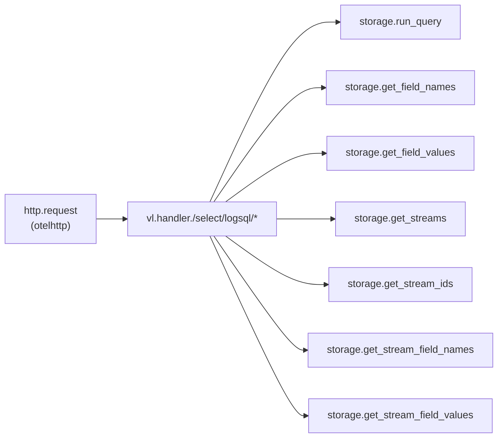
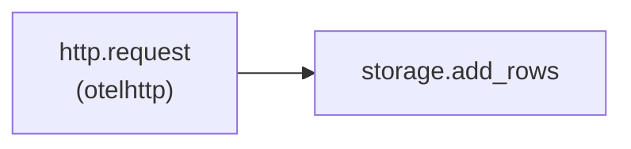
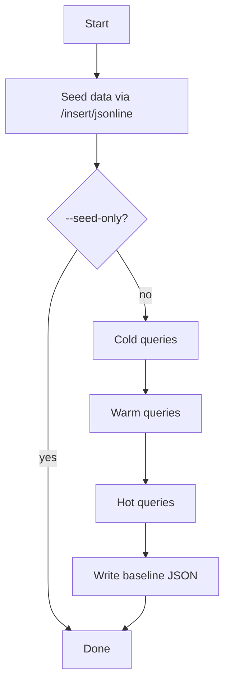

# Telemetry

Victoria Lakehouse ships built-in OpenTelemetry tracing for the HTTP, query, and insert paths. Traces help identify slow queries, understand request flow, and correlate logs/traces operations end-to-end.

## Configuration

Add a `telemetry` block under `lakehouse` in your configuration file:

```yaml
lakehouse:
  telemetry:
    enabled: true
    endpoint: "http://victoriatraces:4317"
    sample_rate: 0.1
    always_sample_slow: true
    batch_timeout: 5s
```

| Setting | Default | Description |
|---------|---------|-------------|
| `enabled` | `false` | Enable or disable the tracing pipeline. When disabled, a noop provider is used and no spans are created. |
| `endpoint` | `""` | OTLP gRPC endpoint for span export (e.g. `host:4317`). When empty with `enabled: true`, spans are recorded but discarded (useful for testing). |
| `sample_rate` | `1.0` | Fraction of traces to sample, between 0.0 and 1.0. Uses `ParentBased(TraceIDRatioBased(...))` so child spans inherit the parent decision. |
| `always_sample_slow` | `false` | When true, queries exceeding the slow-query threshold are always sampled regardless of `sample_rate`. |
| `service_name` | `"lakehouse"` | The `service.name` resource attribute attached to all exported spans. Set to `"lakehouse-traces"` for the traces binary. |
| `batch_timeout` | SDK default (5s) | How long the batch span processor waits before flushing a partial batch. |

## Trace Spans

### Query Path

When a LogsQL query arrives, it flows through three layers of instrumentation:



### Insert Path

Inserts pass through the HTTP layer into the traced writer:



### Span Reference

| Span Name | Attributes | Description |
|-----------|------------|-------------|
| `http.request` | Standard HTTP semantics (method, status, url) | Auto-instrumented by `otelhttp.NewHandler`. Wraps the entire HTTP request lifecycle. |
| `vl.handler./select/logsql/*` | `http.method`, `http.path` | Created by `wrapVL` for each LogsQL endpoint. The span name includes the actual URL path (e.g. `vl.handler./select/logsql/query`). |
| `storage.run_query` | `tenant_count` | Executes the core query against Parquet storage. |
| `storage.get_field_names` | -- | Lists available field names. |
| `storage.get_field_values` | `field` | Retrieves values for a specific field. |
| `storage.get_stream_field_names` | -- | Lists stream-level field names. |
| `storage.get_stream_field_values` | `field` | Retrieves values for a stream-level field. |
| `storage.get_streams` | -- | Lists log streams. |
| `storage.get_stream_ids` | -- | Lists stream IDs. |
| `storage.add_rows` | `row_count` | Writes log rows into Parquet storage. |

## Benchmark CLI

The `cmd/bench` tool seeds data and measures cold/warm/hot query latency, writing results as JSON baseline files for regression tracking.

### Build

```bash
make bench
```

This produces `bin/lakehouse-bench`.

### Usage

```bash
# Run the full benchmark (seed + measure) against a local instance
bin/lakehouse-bench --tier small --signal logs --endpoint http://localhost:9428

# Seed data only, skip benchmarks
bin/lakehouse-bench --seed-only --tier small --signal logs

# Benchmark both logs and traces with custom output directory
bin/lakehouse-bench --tier medium --signal both --output results/

# Run with more iterations for stable medians
bin/lakehouse-bench --tier small --runs 5
```

### Flags

| Flag | Default | Description |
|------|---------|-------------|
| `--tier` | `small` | Data tier: `small` (50K rows), `medium` (500K rows), `large` (2.5M rows) |
| `--signal` | `logs` | Signal type: `logs`, `traces`, or `both` |
| `--endpoint` | `http://localhost:9428` | Lakehouse HTTP endpoint |
| `--output` | `benchmarks` | Output directory for baseline JSON files |
| `--seed-only` | `false` | Only seed data, skip query benchmarks |
| `--runs` | `3` | Number of benchmark runs per query (median is used) |

### Output

Each run produces a `baseline-<signal>-<tier>.json` file:

```json
{
  "timestamp": "2026-05-20T12:00:00Z",
  "git_sha": "abc1234",
  "tier": "small",
  "signal": "logs",
  "file_count": 50000,
  "read": [
    {
      "endpoint": "/select/logsql/hits",
      "filter": "*",
      "cold_ms": 120.0,
      "warm_ms": 45.0,
      "hot_ms": 22.0
    }
  ]
}
```

### Benchmark Flow


